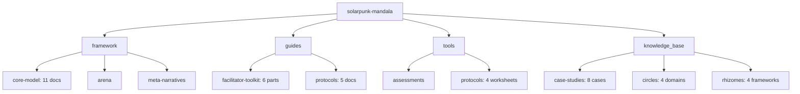

# 🌱 Solarpunk Mandala: A Unified Framework for Conscious Regeneration

**A consciousness-first, systems-based architecture for regenerating human and ecological systems across all scales—from cells to civilizations.**

**Framework Version**: 1.0 | **License**: MIT | **Repository**: https://github.com/ravaioli/solarpunk-mandala

---

## 🌍 Vision: Regeneration Through Dimensional Literacy

The Solarpunk Mandala is not another sustainability toolkit. It is a **meta-framework** that integrates **Analytic Idealism** (consciousness as primary reality), **General Systems Theory**, and **Cybernetics** into a practicable geometric architecture—the **Tesseract** (4D hypercube)—for navigating the complex, multi-perspectival nature of regenerative transformation.

This framework answers the question: *How do we design for a living universe where mind, matter, and meaning are inseparable?*

---

## 🧬 Core Architecture: The Three Pillars

### 1. Ontological Ground: Analytic Idealism

**Consciousness is fundamental; matter is its extrinsic appearance.**

Reality is constituted by a universal consciousness (Mind at Large) that dissociates into individual perspectives. What we perceive as the physical world is how consciousness appears across dissociative boundaries. This is not speculative philosophy—it's the necessary foundation for grounding intrinsic value, agency, and systemic coherence.

**Core Propositions:**
- Individual minds are dissociated alters within Mind at Large
- The physical world is the extrinsic appearance of inner dynamics
- This resolves the "Hard Problem of Consciousness" and grounds values in experience itself

**Why this matters**: It allows us to model physical systems, social dynamics, and inner values on a single, consistent spectrum—all as patterns of conscious experience.

### 2. Epistemic Architecture: The Tesseract

**A 4D hypercube as a cognitive prosthetic for multi-perspectival reality.**

If consciousness is primary and multi-perspectival, we need a structure that can hold multiple, irreducible viewpoints simultaneously without collapsing into reductionism. The Tesseract provides this.

**Structure:**
- **8 Cubes**: 4 unfolded (UR, UL, LL, LR) + 4 folded (boundary dimensions)
- **24 Faces**: Representing interconnections between domains
- **Central Core (ॐ)**: Embodied Foundations that enable all other perspectives

**The Eight Cubes:**
| Cube | Dimension | Description | Rhizomatic Expression |
|------|-----------|-------------|----------------------|
| ॐ | Core | Dissociative boundary of Mind at Large | Embodied Foundations |
| UR | 3rd-person exterior, individual | Biological & physical dynamics | MAN (Biological Needs), SHELLS (Infrastructure) |
| UL | 1st-person interior | Subjective experience & meaning | SPIRITUALITY (Inner Knowing) |
| LL | 2nd-person interior | Shared culture & dialogue | CULTURE (Identity & Engagement) |
| LR | 3rd-person exterior, collective | Institutions & systems | POLITICS, ECONOMICS, SOCIETY, NETWORKS |
| 5 | Dissociation Boundary | Interface where MAL partitions | Ecology + Spirituality: Practice |
| 6 | Intersubjective Gateway | Medium where "mine" becomes "ours" | Spirituality: Community + Politics: Dialogue |
| 7 | Systemic Emergence Plane | Scale-transition (individual ↔ collective) | Project Design Integration |
| 8 | Meta-Perspective | Non-perspectival center | SolarPunk Compass |

**Dimensional Literacy**: The cognitive skill of understanding systems by modeling them in multiple dimensions, moving beyond linear or flat thinking to grasp nested relationships and higher-order synthesis.

### 3. Process Logic: Cybernetics & Scale-Free Cognition

**The framework is a living, self-regulating system.**

- **Feedback Loops**: Rhizomatic Network as the feedback infrastructure
- **Circular Causality**: Dialectical Phases form autopoietic cycles
- **Requisite Variety**: The Tesseract's complexity matches socio-ecological reality
- **Scale-Free Cognition**: Intelligence exists at all scales (cells to societies), validated by Michael Levin's work on bioelectric cognition

**Key Scientific Validation**: Levin (2019) demonstrates that cognition operates across biological scales through bioelectric networks with computational boundaries. A cell, an organism, and a human community all exhibit forms of problem-solving and goal-directedness.

---

## 🛡️ Safety Protocol: The Threshold Principle

### ⚠️ **NON-NEGOTIABLE SYSTEMS LAW**

**No pathway work is safe unless ALL Four Embodied Foundations score ≥ 2/5.**

Attempting regeneration on unstable foundations causes **ethical and systemic bypassing**—where lofty goals mask unaddressed contraction, leading to collapse or harm.

### The Four Embodied Foundations

| Foundation | Score &lt; 2 Signal | Emergency Protocol | Measurement |
|------------|------------------|-------------------|-------------|
| **Nourishment** (Food & Resources) | &gt;50% skip meals; acute hunger | Mutual aid food distribution; seed exchange | Community survey + pantry audit |
| **Cleansing** (Water, Waste, Hygiene) | No safe water; disease risk | Water filtration; composting sanitation | Infrastructure audit + water testing |
| **Restoration** (Sleep, Rest, Recovery) | Chronic sleep deprivation; no safe spaces | Quiet zones; trauma first aid; rest hours | Sleep diaries + space mapping |
| **Movement** (Physical Freedom & Safety) | Physical confinement; violence | Safe corridors; community watch; mobility aid | Safety audit + mobility mapping |

**If any foundation is &lt; 2**: Activate **Boundary Medicine** immediately. Stop all pathway work and fortify the weak foundation. Re-assess every 2 weeks. Only proceed when ALL foundations ≥ 2 for 2 consecutive weeks.

**Bootstrapping Protocol**: Sub-threshold systems use emergency protocols, NOT Mandala pathways. This prevents circular logic.

---

## 🧭 The Four Ethical Axes

Each axis represents a core tension to navigate, not a binary choice:

### 1. Soteriological Axis
**Question**: *How integrated is the self/purpose?*  
**Foundation**: Restoration (≥2)  
**Contraction Signal**: Fragmented narrative, rigid identity  
**Navigation Principle**: Coherence with authentic, non-fragmented intention

### 2. Axiological Axis
**Question**: *How regenerative is the system?*  
**Foundation**: Nourishment (≥2)  
**Contraction Signal**: Ecological overshoot, extractive logic  
**Navigation Principle**: Care that expands future possibilities

### 3. Relational Depth Axis
**Question**: *How connected are we?*  
**Foundation**: Movement (≥2)  
**Contraction Signal**: Transactional relationships, polarization  
**Navigation Principle**: Complexity that honors connection

### 4. Temporal Orientation Axis
**Question**: *How wisely do we hold time?*  
**Foundation**: Cleansing (≥2)  
**Contraction Signal**: Short-termism, historical amnesia  
**Navigation Principle**: Courage to repair the past and seed the future

**Tetralemmic Logic**: Each axis is navigated through four positions—Assertion, Negation, Synthesis, and Transcendence—moving beyond binary thinking.

---

## 🛤️ The Four Pathways: Praxis Methods

Named in Portuguese to honor Paulo Freire's liberatory pedagogy:

| Pathway | Portuguese Term | Activates Axis | Core Work | Entry Point |
|---------|----------------|----------------|-----------|-------------|
| **Awakening** | *Conscientização* | Soteriological | Critical consciousness; waking up to conditioning | `guides/protocols/00-embodied-foundations-audit.md` |
| **Making** | *Capacitação* | Axiological | Building regenerative capacity; skill development | `tools/protocols/02-project-design-worksheet.md` |
| **Liberation** | *Liberação* | Relational Depth | Dismantling oppressive structures; freeing connections | `guides/facilitator-toolkit/` |
| **Healing** | *Cura* | Temporal Orientation | Repairing intergenerational trauma; restoring time-flow | `knowledge_base/circles/` |

**Scale-Free Application**: Each pathway applies to individuals, teams, communities, bioregions, and institutions.

---

## 📂 Complete Repository Structure

**Key Integration Points**:
- **Rhizomatic Network**: The "glue" connecting all components
- **Dialectical Phases**: 4D temporal unfolding mechanics
- **Embodied Foundations**: The 4 non-negotiable prerequisites

---

## 🚀 Getting Started: Choose Your Entry Point

### For Communities & Practitioners
1. **Toolkit Overview**: `guides/facilitator-toolkit/00-toolkit-overview.md`
2. **Assess Foundations**: Complete `guides/protocols/00-embodied-foundations-audit.md`
3. **4-Week Cycle**: Run the diagnostic cycle in `guides/facilitator-toolkit/`

### For Developers & Systems Thinkers
1. **Meta-Framework**: `framework/core-model/00-meta-framework-systems-cybernetics.md`
2. **Ontology**: `framework/core-model/01-ontology-analytic-idealism.md`
3. **Architecture**: `framework/core-model/02-epistemic-architecture-tesseract.md`

### For Researchers & Policy-Makers
1. **Case Studies**: `knowledge_base/case-studies/`
2. **Integrations**: `framework/core-model/09-compatible-frameworks-matrix.md`
3. **Rhizomes**: `knowledge_base/rhizomes/`

---

## 🔬 Scientific Rigor: Falsification Criteria

This framework is **scientifically grounded** and **explicitly falsifiable**:

### Critical Falsifiers
1. **Threshold Model**: If communities with all Foundation scores ≥3 show no capacity for 2D integration, the model is falsified
2. **Dialectical Conductance**: If it cannot be reliably measured (ICC < 0.6), the metric is invalid
3. **Tesseract Structure**: If the 8 Intelligences don't factor into 4 stable dimensions meta-analytically, the mapping is arbitrary

### Auxiliary Falsifiers
- If Levin's scale-free cognition is retracted
- If communities show inverse micro-macro relationships
- If adversarial contexts cannot be mapped

**Result**: Any critical falsifier met → framework must be revised or abandoned.

→ Full protocol: `framework/core-model/00-meta-framework-systems-cybernetics.md#falsification-conditions`

---

## 🤝 Contributing: Transdisciplinary Coherence

This is a **meta-theoretical project**. All contributions must maintain coherence across:

### Three Pillars of Contribution
1. **Ontological Consistency**: Respect Analytic Idealism foundation
2. **Geometric Integrity**: Map new components to Tesseract structure
3. **Ethical Rigor**: Honor the Threshold Principle

### Label Your Contributions
Use GitHub labels aligned with ethical axes:
- `axis:coherence` (Soteriological)
- `axis:care` (Axiological)
- `axis:complexity` (Relational Depth)
- `axis:courage` (Temporal Orientation)

**Before Contributing**: Read `CONTRIBUTING.md` and core documents 00-03.

---

## 📊 Compatible Frameworks Matrix

The Mandala **transcludes** (doesn't replace) existing systems:

| External Framework | Tesseract Mapping | Integration Method |
|--------------------|-------------------|--------------------|
| **UN SDGs** | Mapped to 8 cubes + 4 axes | Rhizomatic alignment protocol |
| **Doughnut Economics** | Axiological axis operationalization | Biophysical + social boundaries |
| **Kegan's Stages** | Soteriological pathway scaffolding | Developmental depth assessment |
| **Pattern Language** | Geometric pattern instantiation | 4D pattern language generator |
| **Enactivism** | ↔ Analytic Idealism bridge | Participatory sense-making |

→ Full matrix: `framework/core-model/09-compatible-frameworks-matrix.md`

---

## 🌟 What Makes This Different?

| Feature | Typical Solarpunk | Solarpunk Mandala |
|---------|-------------------|-------------------|
| **Foundation** | Materialist → Green tech | Consciousness-first + Scale-free cognition |
| **Model** | Linear roadmaps | 4D Tesseract geometry |
| **Ethics** | Values checklist | 4 integrated axes + Threshold Principle |
| **Safety** | Implicit | Explicit Boundary Medicine protocols |
| **Scale** | Human systems only | Cells to civilizations (Levin) |
| **Rigor** | Ideological | Falsifiable & empirically grounded |
| **Praxis** | Tool libraries | Dimensional literacy training |

---

## 📚 Core Framework Documents: The 11 Pillars

| # | Document | Primary Question | Key Deliverable |
|---|----------|------------------|-----------------|
| **00** | Meta-Framework: Systems & Cybernetics | *Why this architecture?* | GST + Cybernetics synthesis |
| **01** | Ontology: Analytic Idealism | *What kind of reality?* | Consciousness-first foundation |
| **02** | Epistemology: The Tesseract | *How do we know?* | 4D geometric modeling |
| **03** | Ethics: Four Axes | *How do we navigate?* | Integrated moral compass |
| **04** | Temporal: Dialectical Phases | *How do we move through time?* | Dialectical Velocity metric |
| **05** | Pathways: Four Gateways | *How do we act?* | Praxis methods (Awakening, Making, Liberation, Healing) |
| **06** | Geometry: Unpacking Tesseract | *How is it structured?* | 8 Cubes ↔ 8 Intelligences |
| **07** | Material Intelligence | *How does matter think?* | Levin's bioelectric agency |
| **08** | Multiple Intelligences | *What capacities?* | 8 intelligences across scales |
| **09** | Compatible Frameworks | *What does it connect to?* | Integration matrix |
| **10** | Cybernetic Foundations | *How does it self-regulate?* | Feedback & control systems |

---

## 📄 License & Citation

**License**: MIT (see `LICENSE`)

**Citation**: 
Ravaioli, M. (2024). *Solarpunk Mandala: A Unified Framework for Conscious Regeneration*. GitHub Repository. https://github.com/ravaioli/solarpunk-mandala

**Primary Theoretical Debts**:
- Bernardo Kastrup (Analytic Idealism)
- Ludwig von Bertalanffy (General Systems Theory)
- Michael Levin (Scale-free cognition)
- Humberto Maturana (Cybernetics/Autopoiesis)
- Paulo Freire (Liberation pedagogy)

---

## 🎯 Final Invitation

This is **practicable mysticism**: the ancient insight of unity consciousness made **geometrically navigable** for building regenerative futures.

**Your first step**: Choose any cube. Then ask: *Which foundation here is below threshold?*

The Mandala meets you where you are, but won't let you bypass what's needed.

**Welcome to conscious systems design.**
