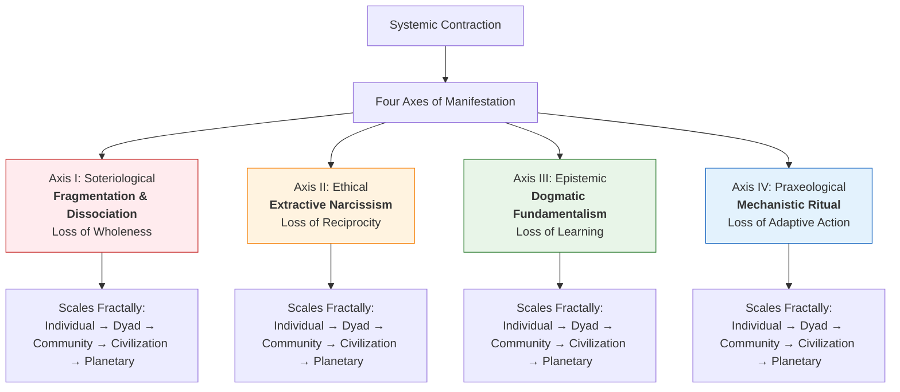
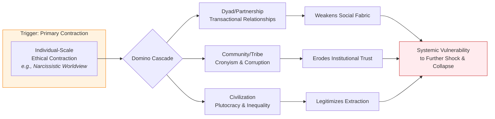
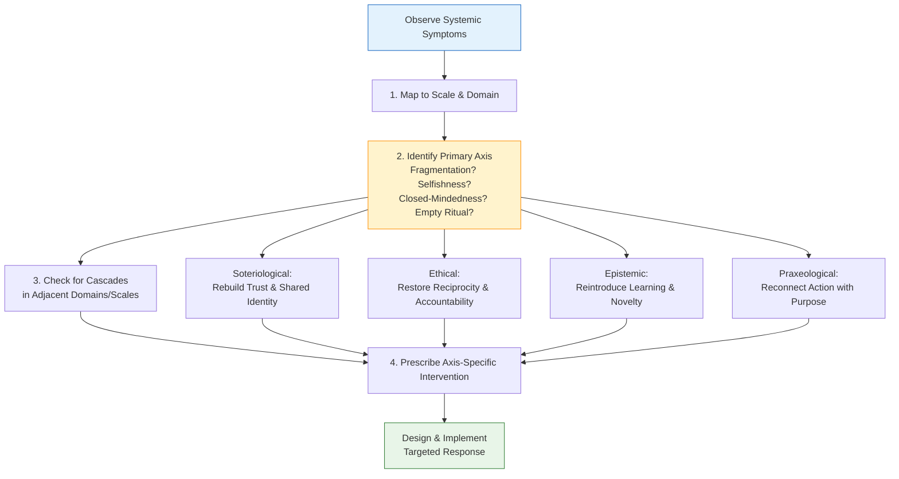

---
aeo_metadata:
  title: "Appendix: Four-Axis Contraction Tables"
  description: "A diagnostic framework mapping patterns of systemic collapse, simplification, and regression along the four primary axes of the Solarpunk Mandala. Serves as an inverse map to the core framework's expansion dynamics."
  context: "Diagnostic appendix to the core Mandala framework. Provides tools for analyzing failure modes, regressive patterns, and contraction cascades in conscious systems from individual to planetary scales."
  key_objectives:
    - "Define four distinct patterns of systemic contraction aligned with the Mandala's core axes."
    - "Provide fractal tables for diagnosing contraction manifestations across five scales and four domains."
    - "Establish a protocol for using contraction analysis to design targeted interventions."
    - "Map the inverse relationship between regenerative expansion and degenerative collapse."
  core_concepts:
    - "Soteriological Contraction (Fragmentation)"
    - "Ethical Contraction (Extractive Narcissism)"
    - "Epistemic Contraction (Dogmatic Fundamentalism)"
    - "Praxeological Contraction (Mechanistic Ritual)"
    - "Fractal Scaling of Collapse Patterns"
    - "Contraction Diagnosis Protocol"
  ontological_foundation: "Inverse Dynamics of Systems Theory & Cybernetics"
  epistemic_stance: "Diagnostic Pattern Recognition"
  search_queries:
    - "systemic collapse patterns analysis"
    - "contraction dynamics in complex systems"
    - "fractal scaling of social regression"
    - "diagnosing civilizational collapse"
    - "Solarpunk Mandala contraction tables"
  related_nodes:
    - "framework/core-model/02-epistemic-architecture-tesseract.md"
    - "framework/core-model/04-dialectical-phases-velocity.md"
    - "framework/core-model/00-meta-framework-systems-cybernetics.md"
  framework_status: "Stable Reference"
  version: "1.1"
  last_reviewed: "2026-01-12"
---
# Appendix A: Four-Axis Contraction Tables

## 🧭 Executive Overview: Mapping the Patterns of Collapse

This document provides a diagnostic and prognostic framework for understanding **systemic contraction**—the patterns of collapse, simplification, or regression within conscious systems (individual, community, civilization). It complements the Solarpunk Mandala's focus on expansion and integration by mapping its inverse: the dynamics of dissolution.

By cross-referencing contraction against the four primary axes of the Mandala's Tesseract model, these tables allow practitioners to:
1.  **Diagnose** the nature and depth of a contraction event.
2.  **Predict** likely cascading failures into adjacent domains.
3.  **Design interventions** that target the root axis of contraction rather than its symptoms.

**Reading Context:**
*   **Purpose:** A reference tool for analyzing failure modes, regressive patterns, and systemic collapse.
*   **Prerequisites:** Understanding of the core Mandala's Four Axes and their positive expressions (from Nodes 01-04).
*   **Time Investment:** 5-7 minutes for the framework; use tables as needed.

## 1. The Contraction Framework: Axes & Scales

Contraction is not monolithic. It manifests distinctly along each of the four primary axes of transformation defined by the Mandala. Furthermore, these patterns **scale fractally**, appearing in isomorphic forms from the intrapsychic to the global.

### 1.1 The Four Axes of Contraction

| Axis | Positive Pole (Mandala Goal) | Contractive Pole (This Document) | Core Dynamic |
| :--- | :--- | :--- | :--- |
| **Soteriological (Self)** | Integration, Expanded Identity, Unity | **Dissociation & Fragmentation** | Collapse of self-model; splitting of parts from whole. |
| **Ethical (Values)** | Regenerative Reciprocity, Symbiotic Ethics | **Extractive Narcissism** | Ethics shrink to zero-sum competition; externalization of costs. |
| **Epistemic (Knowledge)** | Perspectival Weaving, Multi-Modal Knowing | **Dogmatic Fundamentalism** | Closure of cognition; rejection of contradictory information. |
| **Praxeological (Action)** | Adaptive, Context-Sensitive Praxis | **Rigid, Mechanistic Ritual** | Action decouples from feedback; process becomes its own purpose. |

### 1.2 Fractal Scaling: From Psyche to Planet
A key insight is that the pattern of **Soteriological Dissociation** in an individual (e.g., a mental health crisis) is isomorphic to **Social Fragmentation** in a community (e.g., partisan schism) and **Civilizational Balkanization** at the global scale. The tables below are organized to make these fractal parallels explicit.

## 2. Contraction Tables by Axis

Each table details the manifestation of contraction across five systemic scales and four domains of expression.

### 2.1 Axis I: Soteriological Contraction (Dissociation & Fragmentation)
The collapse of integrative processes, leading to alienation, splitting, and loss of coherence.

| Scale | Cultural-Psychological Manifestation | Political-Social Manifestation | Economic-Technological Manifestation | Spiritual-Philosophical Manifestation |
| :--- | :--- | :--- | :--- | :--- |
| **Individual** | Dissociative disorders; internal conflict; loss of autobiographical narrative. | Social withdrawal; inability to form coalitional "we" spaces. | Inability to manage personal resources; impulsivity vs. hoarding. | Nihilism; loss of meaning; spiritual abandonment. |
| **Dyad/Partnership** | Codependency or hostile dependency; projective identification. | Power struggles; inability to negotiate shared governance. | Exploitative or parasitical economic arrangements. | Dualistic theologies (pure good vs. evil); spiritual competition. |
| **Community/Tribe** | Formation of insular subcultures; "us vs. them" identity politics. | Schism and factionalization; breakdown of communal decision-making. | Local economies collapse into gift vs. theft dichotomy. | Religious sectarianism; heresy hunts; purity spirals. |
| **Civilization/Nation** | Culture wars; nationalist mythmaking; historical amnesia. | Rise of secessionist movements; failed states; institutional distrust. | Trade wars, autarky, and protectionism; breakdown of supply chains. | Clash of civilizations narrative; religious fundamentalism as state ideology. |
| **Planetary** | Human vs. nature dichotomy; loss of planetary identity ("Earthling"). | Breakdown of global governance (UN, treaties); permanent state of geopolitical rivalry. | Collapse of global commons management; tragedy of the horizon. | Absence of planetary spirituality; cosmos seen as dead or hostile. |

### 2.2 Axis II: Ethical Contraction (Extractive Narcissism)
The atrophy of ethical regard, reducing complex reciprocity to simplistic, self-serving transactions.

| Scale | Cultural-Psychological Manifestation | Political-Social Manifestation | Economic-Technological Manifestation | Spiritual-Philosophical Manifestation |
| :--- | :--- | :--- | :--- | :--- |
| **Individual** | Narcissistic personality patterns; entitlement; lack of empathy. | A-political self-interest ("I've got mine"); social Darwinist worldview. | Consumerism; exploitation of personal networks for gain. | "Prosperity gospel"; magical thinking for personal benefit. |
| **Dyad/Partnership** | Transactional relationships; love conditional on utility. | Domination/submission patterns; abuse of power within the pair. | One partner financially entrapping the other. | "God is on my side" in conflicts; using spirituality to control. |
| **Community/Tribe** | Cronyism and nepotism; corruption of communal roles for private gain. | Kleptocracy; elite capture of community institutions. | Extractive local economy (e.g., company town); rent-seeking. | Religious institutions as vehicles for wealth/status. |
| **Civilization/Nation** | Celebrity culture; valorization of wealth and power as intrinsic goods. | Plutocracy; regulatory capture; legal system favors the powerful. | Colonial & neo-colonial economics; externalizing costs to periphery. | State religion used to justify inequality (divine right, caste). |
| **Planetary** | Anthropocentrism; human supremacy as a default ethical stance. | Neo-imperial geopolitics; powerful nations shape rules to their benefit. | Globalized extractivism; offshoring pollution and labor exploitation. | Religions without ecological ethics; "dominion" over Earth. |

### 2.3 Axis III: Epistemic Contraction (Dogmatic Fundamentalism)
The closure of cognitive and learning systems, rejecting novelty and complexity in favor of fixed, simplistic models.

| Scale | Cultural-Psychological Manifestation | Political-Social Manifestation | Economic-Technological Manifestation | Spiritual-Philosophical Manifestation |
| :--- | :--- | :--- | :--- | :--- |
| **Individual** | Black-and-white thinking; cognitive rigidity; inability to update beliefs. | Susceptibility to propaganda; ideological possession. | Inability to learn new skills; technological phobia. | Literalist dogma; fear of heretical or new spiritual ideas. |
| **Dyad/Partnership** | Conversations become debates to win; reality testing is abandoned. | Ideological alignment as condition for relationship; thought policing. | Rigid adherence to "traditional" economic roles. | Shared dogmatic belief system required for bond. |
| **Community/Tribe** | Groupthink; enforced orthodoxy; shunning of critics or innovators. | Authoritarian governance; censorship of dissenting information. | Techno-conservatism; rejection of innovation that disrupts status quo. | Fundamentalist religious community; anti-intellectualism. |
| **Civilization/Nation** | State-controlled media; nationalist historical revisionism. | Totalitarian information control; persecution of intellectuals. | Centralized planning ignores local knowledge; innovation stagnates. | State-enforced religious or ideological orthodoxy. |
| **Planetary** | Civilizational "clash of ignorance"; failure of intercultural learning. | Information warfare; deepfakes eroding shared reality. | Global IP regimes that stifle adaptation and local innovation. | Crusades/jihads; refusal to learn from other wisdom traditions. |

### 2.4 Axis IV: Praxeological Contraction (Mechanistic Ritual)
The disintegration of adaptive, context-sensitive action into repetitive, decoupled, and ultimately meaningless ritual.

| Scale | Cultural-Psychological Manifestation | Political-Social Manifestation | Economic-Technological Manifestation | Spiritual-Philosophical Manifestation |
| :--- | :--- | :--- | :--- | :--- |
| **Individual** | Compulsive behaviors; OCD; action divorced from intention or outcome. | Blind obedience to authority; "just following orders." | Bureaucratic job-holding; work as empty ritual. | Empty ritual observance; "going through the motions" spiritually. |
| **Dyad/Partnership** | Stale, scripted interactions; loss of spontaneity and play. | Rigid adherence to predefined relationship "rules" despite harm. | Household chores as battleground; no adaptation to new needs. | Joint prayer as performance without felt connection. |
| **Community/Tribe** | Cultural fossilization; traditions practiced without understanding their function. | Bureaucratic governance; process over purpose; red tape. | Bureaucratic local economy; permits and procedures stifle life. | Religious ritualism; purity laws override compassion. |
| **Civilization/Nation** | Dead cultural forms kept on life support (e.g., academic classicism). | Imperial bureaucracy; sclerotic institutions unable to reform. | Command economy; production quotas lead to useless goods. | Theocracy where legalistic observance replaces spirituality. |
| **Planetary** | Global culture becomes homogenized, sterile, and commercialized. | Gridlock in international bodies; treaties unresponsive to new crises. | Just-in-time supply chains so brittle they fail under novelty. | "McSpirituality"—standardized, packaged wisdom traditions. |

## 3. Diagnostic Application: Using the Tables

### 3.1 The Contraction Diagnosis Protocol
1.  **Observe Symptoms:** Identify visible failures, conflicts, or regressions in a system.
2.  **Map to Scale & Domain:** Locate the primary symptoms in the tables (e.g., "community-scale political-social manifestation").
3.  **Identify the Primary Axis:** Determine which axis's description best fits the core dynamic (Is it about fragmentation? selfishness? closed-mindedness? empty ritual?).
4.  **Check for Cascades:** Look at adjacent cells in the table (same axis, different scales/domains) for related symptoms that may be present or emerging.
5.  **Prescribe Axis-Specific Intervention:** Design responses that target the root axis:
    *   **Soteriological:** Interventions that rebuild trust, dialogue, and shared identity.
    *   **Ethical:** Interventions that restore reciprocity, accountability, and mutual care.
    *   **Epistemic:** Interventions that reintroduce novelty, dialogue, and learning.
    *   **Praxeological:** Interventions that reconnect action with feedback and purpose.

### 3.2 Example: Diagnosing a Community Schism
*   **Symptoms:** Factionalization, breakdown of meetings, bitter infighting.
*   **Mapping:** Primarily a **Community-scale, Political-Social manifestation**.
*   **Axis Identification:** The core dynamic appears to be splitting and loss of shared "we" → **Primary Axis = Soteriological (Fragmentation)**.
*   **Cascade Check:** Likely accompanying **Cultural-Psychological** symptoms ("us vs. them" narratives) and possibly **Economic** symptoms (factions withholding resources).
*   **Intervention:** Avoid purely procedural fixes (Praxeological). Focus on **Soteriological interventions**: deep dialogue, conflict transformation, shared visioning, and rituals of reconciliation.

## 4. Theoretical Notes & Falsification

*   **Isomorphism is Key:** The predictive power of this model depends on the validity of fractal scaling. If contraction at the individual scale follows a *different* pattern than at the community scale for the same axis, the model is weakened.
*   **Axis Interdependence:** In practice, contractions rarely occur on a single axis. **Axis II (Ethical) contraction often precedes or enables Axis III (Epistemic) closure** (e.g., selfish interest leads to ignoring inconvenient truths).
*   **Falsification Condition:** This model would be significantly challenged if a major historical collapse could be demonstrated to have progressed via a sequence of manifestations that cross axes and scales in a non-isomorphic, random way.

---
**Integration Point:** This diagnostic tool is designed for use alongside the **Dialectical Phases & Velocity (Node 04)** protocol, helping to identify when a system is in a prolonged **Antithesis** or **Negation** phase, and clarifying the nature of the contraction that must be worked through.
