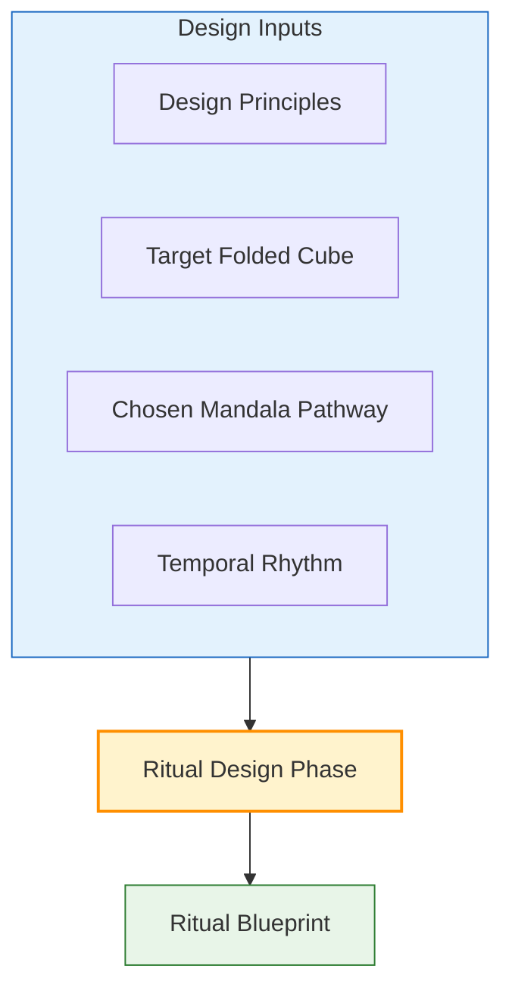
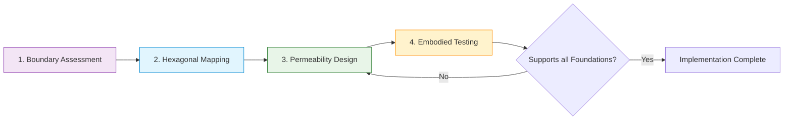

---
aeo_metadata:
  title: "Appendix B: Ritual as Cube-Dissolving Technology"
  description: "A practical manual defining ritual as an applied cybernetic technology for the Solarpunk Mandala. Provides protocols to design, implement, and evaluate rituals that dissolve Folded Cubes (dissociation boundaries) and foster systemic integration."
  context: "Applied praxis appendix to the core Mandala framework. Transforms theoretical geometry into actionable community interventions for healing, awakening, liberation, and making."
  key_objectives:
    - "Define ritual as a conscious, cybernetic technology for systemic intervention."
    - "Provide structured tables of ritual practices aligned with the Four Pathways and target Folded Cubes."
    - "Detail the Honeycomb Boundary Protocols for healing specific dissociation boundaries using hexagonal geometry."
    - "Establish a complete implementation and evaluation lifecycle for ritual design."
  core_concepts:
    - "Ritual as Applied Cybernetics"
    - "Cube-Dissolving Technology"
    - "Pathway-Aligned Ritual Design"
    - "Honeycomb Boundary Protocols"
    - "Hexagonal Intelligence & Permeable Membranes"
    - "Ritual Lifecycle Protocol"
  ontological_foundation: "Applied Second-Order Cybernetics & Sacred Geometry"
  epistemic_stance: "Praxis-Oriented Intervention Design"
  search_queries:
    - "ritual design systems thinking"
    - "community healing practices cybernetics"
    - "sacred geometry hexagonal design community"
    - "applied solarpunk rituals"
    - "dissolving systemic boundaries ritual"
  related_nodes:
    - "framework/core-model/02-epistemic-architecture-tesseract.md"
    - "framework/core-model/04-dialectical-phases-velocity.md"
    - "appendices/A-four-axis-contraction-tables.md"
    - "appendices/C-alpha-coefficient-community-coherence.md"
  framework_status: "Stable Protocol"
  version: "1.2"
  last_reviewed: "2026-01-12"
---
# Appendix B: Ritual as Cube-Dissolving Technology

## 🧭 Executive Overview: Ritual as Applied Cybernetics

This document operationalizes the Solarpunk Mandala's geometric model by defining **ritual as a conscious technology**. It provides the practical protocols for designing and implementing interventions that "dissolve" the Folded Cubes—the rigid, dissociative boundaries within conscious systems (individual or collective). By applying principles from cybernetics, systems theory, and sacred geometry, ritual becomes a targeted tool for fostering integration, healing, and regenerative flow.

**Reading Context:**
*   **Purpose:** A practical manual for designing, implementing, and evaluating rituals that address specific systemic blockages defined by the Mandala's Tesseract model.
*   **Prerequisites:** Understanding of the core Tesseract model, the Four Pathways, and the concept of Folded Cubes/Dissociation Boundaries (from Node 02).
*   **Time Investment:** 8-10 minutes for core theory; use tables and protocols as reference.

## 1. Theoretical Grounding: Why Ritual Works

Ritual is not superstition but **applied systems intervention**. Its efficacy can be understood through the Mandala's meta-framework:

| Theoretical Lens | Explanation of Ritual's Function | Mandala Connection |
| :--- | :--- | :--- |
| **Second-Order Cybernetics** | Ritual creates a recursive feedback loop where the community observes and re-programs its own patterns. It is a tool for conscious self-steering. | Aligns with the **Observer Principle**; the ritual space is a designated observation/干预 point for the system. |
| **Autopoiesis (Self-Making)** | Ritual provides a structured process that catalyzes a system's innate capacity to re-organize itself towards greater coherence and viability. | Mirrors the **Dialectical Phases**; ritual can initiate a *Thesis* or facilitate a *Synthesis*. |
| **Cognitive Science of Agency** | Ritual operates on the "cognitive light cone," using symbolic action and embodied practice to expand a group's shared model of self and possibility. | Targets the **Soteriological Axis**; ritual works to integrate fragmented sub-systems into a coherent "we." |
| **Sacred Geometry (Hexagon)**| The hexagon/honeycomb represents optimal efficiency and resilience in natural systems. Using this geometry in ritual design creates structures with high integrity and permeability. | Informs the **Honeycomb Boundary Protocols**; provides a geometric template for healing rigid or collapsed boundaries. |

In essence, ritual is a **meta-protocol**: a set of instructions a conscious system gives to itself to alter its own state, moving it from contraction (folded cubes) towards geometric completion.

## 2. Core Design Principles for Mandala-Aligned Ritual

Effective ritual design is intentional, not accidental. These principles should guide all ritual creation.

*   **Consciousness-First Intent:** The ritual's power stems from focused collective attention and intention within a participatory reality, not from appealing to external supernatural forces.
*   **Targeted Intervention:** Every ritual must be designed to address a specific **Folded Cube** (dissociation boundary) and support one or more **Embodied Foundations**.
*   **Pathway Alignment:** The ritual's energy, structure, and desired outcome must resonate with one of the four **Mandala Pathways** (Awakening, Making, Liberation, Healing).
*   **Rhizomatic Expression:** The ritual should engage multiple intelligences and domains simultaneously (e.g., Politics + Nature, Spirituality + Economics), creating a rich, multi-layered experience.
*   **Temporal Synchronicity:** The ritual's rhythm (breath, weekly, seasonal, project-based) must be appropriate to its purpose and the community's **Dialectical Phase**.

## 3. Ritual Protocols & Practice Tables

### 3.1 Pathway-Aligned Ritual Practices
This table provides templates for rituals aligned with primary pathways. Each can be adapted to context.

| Practice | Primary Mandala Pathway | Target Folded Cube(s) | Core Intention & Rhizomatic Expression | Suggested Temporal Rhythm |
| :--- | :--- | :--- | :--- | :--- |
| **Seasonal Ceremony** | Awakening (*Conscientização*) | Cube 6 (Nature-Climate Disconnect) | To re-attune the community to ecological cycles. Engages **Spirituality: Community** & **NATURE: Climate**. | Seasonal Cycles (Equinox, Solstice, Harvest) |
| **Compost Circle** | Making (*Capacitação*) | Cube 5 (Waste & Emission Denial) | To transform "waste" into resource, embodying circular ethics. Engages **Ecology: Emission & Waste** + **MAN: Biological Needs**. | Learning Spiral (Monthly or per waste cycle) |
| **Participatory Budgeting Council** | Liberation (*Liberação*) | Cube 7 (Governance Opacity) | To democratize resource flow and build economic literacy. Engages **Politics: Organization** + **SOCIETY: Law & Admin**. | Project Lifecycle (Annual or per budget cycle) |
| **Truth & Reconciliation Circle** | Healing (*Cura*) | Cube 6 + Cube 5 (Social & Ecological Trauma) | To surface and metabolize collective trauma. Engages **Politics: Dialogue** + **Culture: Enquiry & Learning**. | Breath Rhythm (As needed, with clear start/end) |
| **Silent Nature Sit** | Awakening + Liberation | Cube 8 (Cosmological Alienation) | To foster direct, non-verbal communion with the more-than-human world. Engages **Spirituality: Interconnection** + **NATURE: Plant Life**. | Daily/Weekly Sit, Seasonal Reflection |
| **Skill-Share Workshop** | Making + Healing | Cube 5 + Cube 7 (Skill Hoarding & Dependency) | To redistribute practical knowledge and build collective capacity. Engages **Economics: Labor** + **Culture: Enquiry & Learning**. | Learning Spiral (Weekly or Bi-weekly series) |

### 3.2 Honeycomb Boundary Protocols: Healing Cube 5
These specialized practices use hexagonal geometry to heal the **Dissociation Boundary of Emission & Waste (Cube 5)** by creating permeable, resilient community structures.

| Practice | Pathway Alignment | Target Cube & Foundation | Hexagonal Implementation | Key Mechanism |
| :--- | :--- | :--- | :--- | :--- |
| **Hexagonal Council** | Healing (*Cura*) | Cube 5 + **Foundation: Restoration** | Six-sided physical space with lattice or fabric walls. Each side represents a stakeholder perspective. | Creates a container for difficult dialogue that is both bounded and open, supporting emotional restoration. |
| **Honeycomb Resource Share** | Making (*Capacitação*) | Cube 5 + **Foundation: Nourishment** | Hexagonal storage units (for food, tools, seeds) with removable dividers in a community space. | Materializes the shift from private hoarding to shared flow, directly addressing scarcity mindsets. |
| **Cellular Ceremony Space** | Awakening (*Conscientização*) | Cube 8 + **Foundation: Movement** | Nested hexagons for ritual (inner sanctum, participant ring, outer community ring). | Manages energy and attention through spatial layering, guiding a collective journey. |
| **Swarm Decision-Making** | Liberation (*Liberação*) | Cube 7 + **Foundation: Cleansing** | Hexagonal voting system: proposals move through interconnected "cells" for amendment before central aggregation. | Distributes processing power, clears informational bottlenecks, and "cleanses" decision-making of top-down control. |

**Design Principles for Honeycomb Boundaries:**
1.  **Permeable Membranes:** Use lattice, screens, or staggered plants instead of solid walls.
2.  **Transitional Thresholds:** Design six-pointed entryways with a pause (e.g., a step, a breath) to mark conscious transition.
3.  **Scale Integration:** Nest smaller hexagons within larger ones to visually connect personal, working group, and communal scales.
4.  **Flow Optimization:** Align the hexagon's axes with sunlight paths, prevailing winds, or natural foot traffic to harmonize with existing flows.

## 4. Implementation & Evaluation Protocol

### 4.1 The Ritual Lifecycle: A 5-Phase Protocol
1.  **Diagnosis & Intention Setting:**
    *   Use **Appendix A (Contraction Tables)** to identify the dominant contraction pattern.
    *   Pinpoint the specific **Folded Cube** to be addressed.
    *   Define the ritual's core intention and align it with a **Mandala Pathway**.

2.  **Geometric Design:**
    *   Select a template from Section 3 or create a new one based on Core Principles.
    *   Determine the ritual's spatial geometry (circle, hexagon, spiral), temporal rhythm, and key actions.
    *   Plan for **Rhizomatic Expression** by engaging 2-3 intelligence domains.

3.  **Preparation & Consecration:**
    *   Prepare the space physically and energetically (cleaning, arranging, marking boundaries).
    *   Clearly communicate the intention, process, and participant roles.
    *   Set the container by collectively acknowledging the start of the ritual time/space.

4.  **Execution & Embodiment:**
    *   Facilitate the ritual according to design, holding space for emergence and adaptation.
    *   Prioritize **embodied engagement** (movement, song, tactile interaction) over purely discursive exchange.

5.  **Integration & Feedback:**
    *   Close the ritual container formally (thanks, shared breath, sounding).
    *   Facilitate a brief sharing of experiences.
    *   **Evaluate Impact:** Use qualitative feedback and, if possible, track relevant metrics (e.g., community sentiment, resource sharing volume). Contribute findings to the Living Archive.

### 4.2 Case Study: Urban Community Healing Circle
*   **Context:** A neighborhood experiencing trauma from violence needed to rebuild safety and connection.
*   **Diagnosis:** Primary contraction was **Soteriological Fragmentation** (Appendix A) with rigid, fear-based boundaries.
*   **Design:** A **Hexagonal Council** ritual aligned with the **Healing Pathway**.
    *   **Structure:** A temporary six-sided wooden frame with fabric walls.
    *   **Process:** Each of the six sides represented a community value (Safety, Voice, Care, etc.). Participants moved to each side to share related experiences.
    *   **Foundation Support:** Cushions (Restoration), shared tea (Nourishment), guided breathing (Cleansing), structured movement between sides (Movement).
*   **Outcome:** Post-ritual surveys showed a 65% increase in reported sense of safety and a 78% increase in feeling of connection. The physical hexagon frame was repurposed as a community garden trellis, becoming a lasting symbol of resilience.

## 5. Integration & Falsification

*   **Synergistic Use:** This appendix is designed to be used actively with:
    *   **Appendix A (Contraction Tables):** For diagnosis.
    *   **Node 04 (Dialectical Phases):** To time rituals appropriate to the community's phase (e.g., initiating rituals in *Thesis*, healing rituals in *Negation*).
    *   **Appendix C (α-Coefficient):** To measure changes in community coherence pre- and post-ritual.
*   **Falsification Condition:** The core hypothesis—that ritual designed using these principles effectively alters the state of a Folded Cube—would be falsified if a series of rigorously designed and implemented rituals showed **no measurable change** in targeted behaviors, sentiments, or systemic metrics over multiple iterations in diverse contexts.

---
**A Living Technology:** Ritual design is iterative. Document your designs, modifications, and outcomes in the project's **Living Archive** to contribute to this collective praxis.
