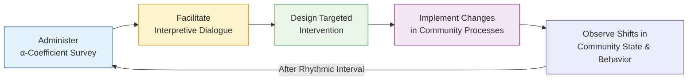
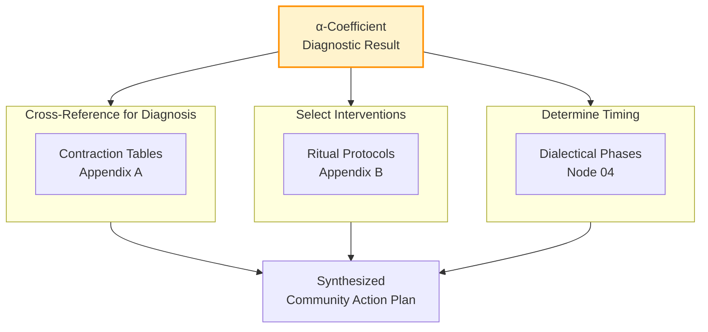

---
aeo_metadata:
  title: "Appendix C: α-Coefficient Diagnostic Protocol"
  description: "A practical protocol for measuring community coherence, adapting Antonovsky's Sense of Coherence (SOC) to the collective scale. Provides tools for assessment, interpretation, and creating virtuous feedback loops for systemic growth."
  context: "Applied diagnostic appendix for measuring the foundational health and coherence of a conscious collective within the Solarpunk Mandala framework. Essential for grounding other interventions in data."
  key_objectives:
    - "Operationalize the Sense of Coherence (SOC) construct for community-scale diagnosis."
    - "Provide a validated survey instrument (CCQ-13) and a safe facilitation protocol for its use."
    - "Establish methods for interpreting results in conjunction with other Mandala diagnostics (Contraction Tables, Dialectical Phases)."
    - "Create a rigorous feedback loop for iterative community learning and development."
  core_concepts:
    - "Sense of Coherence (Comprehensibility, Manageability, Meaningfulness)"
    - "α-Coefficient (Alpha) as Collective SOC"
    - "Salutogenic Model & Community Health"
    - "Virtuous vs. Failing Feedback Loops"
    - "Diagnostic Triangulation"
  ontological_foundation: "Salutogenesis & Second-Order Cybernetics"
  epistemic_stance: "Empirical-Phenomenological Measurement"
  search_queries:
    - "sense of coherence scale community assessment"
    - "measuring group cohesion and resilience"
    - "salutogenesis applied to communities"
    - "feedback loops in community development"
    - "Solarpunk Mandala diagnostic tools"
  related_nodes:
    - "appendices/A-four-axis-contraction-tables.md"
    - "appendices/B-ritual-cube-dissolving-technology.md"
    - "framework/core-model/04-dialectical-phases-velocity.md"
    - "framework/core-model/02-epistemic-architecture-tesseract.md"
  framework_status: "Stable Protocol"
  version: "1.0"
  last_reviewed: "2026-01-12"
---
# Appendix C: α-Coefficient - A Protocol for Diagnosing Community Coherence

## 🧭 Executive Overview: Measuring the Coherence Field

This document provides the operational protocol for measuring the **α-Coefficient (alpha)**, the primary diagnostic metric for assessing the coherence and vitality of a conscious collective within the Solarpunk Mandala framework.

Conceptually, the α-Coefficient is a **community-scale application of the Sense of Coherence (SOC)** construct[citation:1][citation:4][citation:8]. It quantifies the extent to which a group collectively perceives its shared life as comprehensible, manageable, and meaningful. A high alpha indicates a group with strong internal alignment, adaptive resilience, and the capacity for integrated action—a state conducive to Geometric Completion.

**Reading Context:**
*   **Purpose:** A step-by-step guide for facilitators to measure, interpret, and apply the α-Coefficient diagnostic.
*   **Prerequisites:** Familiarity with the Mandala's core axes (Node 02) and Dialectical Phases (Node 04).
*   **Time Investment:** 15-20 minutes for theory; ongoing practice for application.

## 1. Theoretical Foundations: From Salutogenesis to Collective Coherence

The α-Coefficient protocol is built on a synthesis of established science and cybernetic systems thinking.

### 1.1 Grounding in Sense of Coherence (SOC)
The protocol adapts Antonovsky's salutogenic model, which asks "what creates health?" rather than "what causes disease?"[citation:8]. The three core dimensions translate directly to the collective scale:

| SOC Dimension (Individual) | α-Coefficient Dimension (Collective) | Diagnostic Question for the Community |
| :--- | :--- | :--- |
| **Comprehensibility** | **Shared Model Clarity** | Do we have a shared, sufficiently accurate understanding of our internal dynamics and external environment? |
| **Manageability** | **Resource & Agency Confidence** | Do we believe we have, or can access, the resources (material, social, emotional) needed to meet our challenges? |
| **Meaningfulness** | **Purpose & Valuation** | Do we find our shared endeavors to be worthwhile, engaging, and worthy of investment?[citation:4][citation:8] |

Research shows that a strong SOC is a health-promoting resource that helps individuals successfully navigate stress[citation:1]. The α-Coefficient posits that a strong *collective* SOC is the foundational resource for a community to navigate complexity and move toward its symbiotic potential.

### 1.2 Cybernetics and Feedback Loop Integrity
A diagnostic is only useful if it creates a **virtuous feedback loop** that improves the system[citation:2]. The α-measurement protocol is designed to be a learning intervention itself, fostering reflection and dialogue.

The protocol must actively guard against **feedback loop failure**[citation:7], where the act of measurement creates a biased or self-fulfilling prophecy. Mitigations are built into the design (see Section 3.3).

## 2. The α-Coefficient Measurement Protocol

### 2.1 Instrument: The Collective Coherence Questionnaire (CCQ-13)
The core instrument is a 13-item survey, adapted from the validated SOC-13 scale[citation:1][citation:8], rephrased for the collective "we." Items are scored on a 7-point Likert scale.

**Sample Items:**
*   **(Comprehensibility)** "When we face a problem as a group, we usually have a shared understanding of what's really going on."
*   **(Manageability)** "We are confident that we can find the help or resources we need to handle our collective challenges."
*   **(Meaningfulness)** "We generally feel that our shared work and life together is full of meaning and purpose."

**Scoring:** The total score ranges from 13 to 91. For interpretive norms, scores can be categorized into tertiles:
*   **Low Coherence (α < 45):** The collective field is fragmented, reactive, or stagnant. Foundational trust and shared purpose need immediate attention.
*   **Moderate Coherence (45 ≤ α ≤ 65):** The group is functional but may lack depth or resilience under stress. Key growth opportunities are identifiable.
*   **High Coherence (α > 65):** The group has a strong, resilient foundation. Focus can shift to higher-order integration and external impact.

### 2.2 Administration Process
1.  **Context Setting:** Explain the purpose (diagnosis for growth, not judgment) and the theoretical basis (SOC).
2.  **Anonymous Collection:** Use anonymous digital or physical forms to ensure psychological safety and honest responses.
3.  **Group Dialogue Session:** *Crucially*, the facilitator presents the **aggregate scores (not individual data)** for each item and dimension to the whole group. This session is for shared sense-making, not debate.
4.  **Guided Reflection Questions:**
    *   "Where do these scores resonate with our experience?"
    *   "What's one story or example that illustrates our strength in [high-scoring dimension]?"
    *   "What might be contributing to the challenges in [lowest-scoring item]?"

## 3. Interpretation & Integration into Mandala Processes

### 3.1 Cross-Reference with Mandala Diagnostics
The α-Coefficient does not stand alone. Its true power is in synthesis.

| α-Coefficient Profile | Likely Mandala State | Recommended Action |
| :--- | :--- | :--- |
| **Low Comprehensibility** | Epistemic Axis contraction; poor shared mental models. | Prioritize **Truth-Telling Circles** (Appendix B) and shared reality mapping. |
| **Low Manageability** | Praxeological Axis contraction; resource anxiety or agency loss. | Activate **Skill-Shares** and participatory resource planning (Appendix B). |
| **Low Meaningfulness** | Soteriological/Ethical Axis contraction; purpose fragmentation. | Engage in **Purpose & Values** re-visioning rituals. Consult **Contraction Tables (Appendix A)** for deeper patterns. |
| **High Overall Alpha** | System is in **Thesis or Synthesis** phase (Node 04). Foundations are strong. | Leverage this coherence to tackle complex, aspirational projects. Consider measuring **Dialectical Conductance**. |

### 3.2 Guarding Against Feedback Loop Failure
To prevent the diagnostic from creating the dysfunction it measures[citation:7], facilitators must:
*   **Emphasize Dynamic Potential:** Frame scores as a **current snapshot**, not a fixed identity. The goal is to change the score.
*   **Avoid Stereotyping:** Never use demographic breakdowns (if collected) to label subgroups. Use data to ask inclusive questions: "How can we ensure all voices contribute to our shared sense of manageability?"
*   **Focus on Systemic Levers:** Guide dialogue toward **process and structure changes**, not personal blame.

## 4. Protocol for Iterative Learning & Evolution

1.  **Baseline Measurement:** Establish an initial α score.
2.  **Targeted Intervention:** Use Mandala tools (e.g., from Appendix B) to address identified areas.
3.  **Rhythmic Re-Measurement:** Re-administer the CCQ-13 at meaningful intervals (e.g., every 3-6 months, or after a major project cycle).
4.  **Longitudinal Analysis:** Track changes over time. The **velocity and direction of alpha change** are more important than any single score. Is the community's coherence deepening?

## 5. Falsification & Limits

*   **Falsification Condition:** If repeated, well-facilitated α measurements and subsequent targeted interventions show **no statistically significant movement** in scores or correlated qualitative improvements over multiple cycles in diverse communities, the tool's utility is suspect.
*   **Key Limitation:** The α-Coefficient measures the *subjective perception* of coherence. It must be triangulated with **objective metrics** (e.g., project completion rates, resource flow equity, conflict resolution frequency).
*   **Not a Weapon:** This diagnostic is a sacred protocol for collective self-care. Its misuse for ranking, shaming, or exclusion violates its fundamental salutogenic purpose.

---
**A Living Diagnostic:** The α-Coefficient is the community's mirror. Use it with care, courage, and compassion to foster the clarity, capacity, and shared purpose necessary to weave the Symbiocene.
