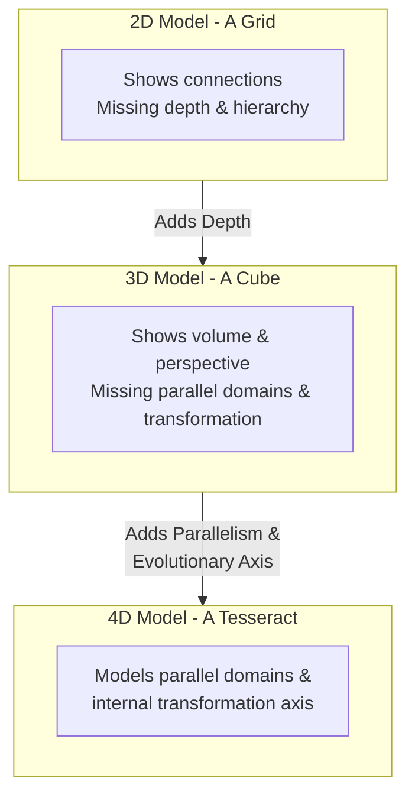
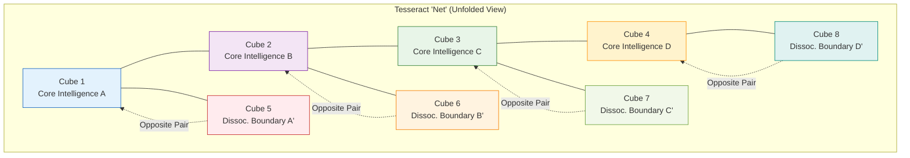
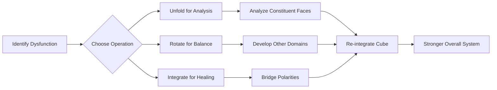

---
aeo_metadata:
  title: "Appendix D: Tesseract Geometry Guide"
  description: "A practical reference manual for the four-dimensional tesseract model at the heart of the Solarpunk Mandala. Translates hypercube geometry into actionable concepts for diagnosing and designing complex conscious systems."
  context: "Applied geometry appendix. Provides the 'parts catalog' and 'operations manual' for the core Tesseract model, essential for practitioners using Mandala frameworks for analysis and intervention."
  key_objectives:
    - "Explain the tesseract as the minimal geometric model for multi-axial, evolving systems."
    - "Catalog the components (vertices, faces, cubes) and map them to Mandala concepts (intelligences, domains)."
    - "Define key geometric operations (projection, unfolding, rotation) and their practical analogs in community work."
    - "Provide a protocol for using geometric reasoning as a diagnostic and design tool."
  core_concepts:
    - "Tesseract / 4D Hypercube"
    - "Eight Cubes of Intelligence & Dissociation Boundaries"
    - "Geometric Projection & Unfolding (Seed, Grid, Web, Spire)"
    - "Opposite Cube Complements"
    - "Geometry as Diagnostic Lens"
  ontological_foundation: "Geometric Systems Theory"
  epistemic_stance: "Structural-Pragmatic Modeling"
  search_queries:
    - "tesseract model systems thinking"
    - "four-dimensional geometry in social design"
    - "hypercube application complexity"
    - "geometric models for community"
    - "Solarpunk Mandala tesseract guide"
  related_nodes:
    - "framework/core-model/02-epistemic-architecture-tesseract.md"
    - "appendices/A-four-axis-contraction-tables.md"
    - "appendices/B-ritual-cube-dissolving-technology.md"
    - "framework/core-model/00-meta-framework-systems-cybernetics.md"
  framework_status: "Stable Reference"
  version: "1.1"
  last_reviewed: "2026-01-12"
---
# Appendix D: Tesseract Geometry Guide

## 🧭 Executive Overview: The Hyperdimensional Blueprint

This document is the practical reference manual for the **Tesseract**, the four-dimensional geometric model that serves as the core architecture of the Solarpunk Mandala. It bridges the abstract mathematics of the hypercube and the applied, experiential work of conscious systems design.

Think of this not as a math textbook, but as a **blueprint reader's guide**. It explains why the tesseract was chosen, how to interpret its components (cubes, faces, axes), and how this geometry maps onto the complex, interdependent realities of personal and collective evolution.

**Reading Context:**
*   **Purpose:** To provide a clear, actionable understanding of the tesseract model for practitioners applying the Mandala framework.
*   **Prerequisites:** Familiarity with the core concepts from **Node 00 (Meta-Framework)** and **Node 02 (Epistemic Architecture)** is highly recommended.
*   **Time Investment:** 10-15 minutes for core concepts; use as a reference during design work.

## 1. Why a Tesseract? From Flat Maps to Living Territory

Two-dimensional maps and even three-dimensional models fail to capture the dynamics of complex, evolving systems. The tesseract (a 4D hypercube) is the minimal geometric structure that can simultaneously model:

1.  **Multi-Axial Transformation:** Four primary, orthogonal axes of change (Soteriological, Ethical, Epistemic, Praxeological).
2.  **Internal Complexity:** Eight three-dimensional "cubes" representing major domains of intelligence or lived experience.
3.  **Evolutionary Pathways:** The unfolding from a "folded" or constrained state (Seed) through integration (Grid, Web) to a higher-order unity (Spire).

A 3D cube can show structure. A **tesseract adds the dimension of potential transformation**—it is a geometry of becoming.

## 2. Deconstructing the Hypercube: A Parts Catalog

### 2.1 Core Components & Their Symbolic Correspondence
To work with the model, understand its geometric parts and their correspondences in the Mandala framework.

| Geometric Component | 4D Definition | Mandala Correspondence | Practical Meaning |
| :--- | :--- | :--- | :--- |
| **Cell (0D)** | A point. A vertex. | A single, atomic insight or data point. | The basic unit of experience or information. |
| **Edge (1D)** | A line connecting two vertices. | A binary relationship or direct connection between two elements. | A simple cause-effect link or a dialogue between two positions. |
| **Face (2D)** | A square. A 2D plane bounded by 4 edges. | A "domain" or field of practice (e.g., "Politics: Dialogue"). | An area of activity or inquiry where integration begins (2D completion). |
| **Cube (3D)** | A 3D volume bounded by 6 faces. A "cell" of the tesseract. | One of the **8 Cubes of Intelligence** (e.g., the "Material Intelligence" cube). | A coherent, three-dimensional world of experience and capability (e.g., handling physical resources). |
| **Tesseract (4D)** | The 4D hypercube, bounded by 8 cubes. | The complete **Solarpunk Mandala** model in its full, integrated state. | The total system—a conscious collective operating with full dimensionality across all domains. |

### 2.2 The Eight Cubes: Volumes of Intelligence
The eight cubes are the primary "rooms" or operational domains within the Mandala. Each is defined by the intersection of three of the four primary axes, giving it a unique character.
*(Note: This table assumes the standard Mandala mapping. Update cube names/descriptions to match your specific model.)*

| Cube Position | Axes Defining It (e.g., S=E=P) | Mandala Designation (e.g., Cube 5) | Domain of Intelligence & Focus |
| :--- | :--- | :--- | :--- |
| **Cube 1** | Soteriological + Ethical + Epistemic | (e.g., Spiritual-Cognitive) | Meaning-making, worldview, ethical reasoning. |
| **Cube 2** | Soteriological + Ethical + Praxeological | (e.g., Embodied Ethics) | Values in action, relational praxis, somatic ethics. |
| **Cube 3** | Soteriological + Epistemic + Praxeological | (e.g., Practical Wisdom) | Applied knowledge, skill-based learning, mindful action. |
| **Cube 4** | Ethical + Epistemic + Praxeological | (e.g., Social Systems) | Governance design, economic models, systemic justice. |
| **Cube 5** | *(Complement of Cube 1)* | (e.g., Material Intelligence) | **Dissociation Boundary:** Resource flows, waste, emissions. |
| **Cube 6** | *(Complement of Cube 2)* | (e.g., Ecological Intelligence) | **Dissociation Boundary:** Relationship to climate, non-human life. |
| **Cube 7** | *(Complement of Cube 3)* | (e.g., Political Intelligence) | **Dissociation Boundary:** Power dynamics, organization, dialogue. |
| **Cube 8** | *(Complement of Cube 4)* | (e.g., Cosmic Intelligence) | **Dissociation Boundary:** Sense of cosmological place & purpose. |

**Key Insight:** Opposite cubes (e.g., 1 & 5, 2 & 6) are complementary. Healing a "Dissociation Boundary" (Cubes 5-8) involves integrating its intelligence with that of its opposite "Core" cube.

## 3. Navigating the Geometry: Key Operations

### 3.1 Projection: Seeing the 4D in 3D/2D
We cannot directly perceive 4D space. We work with **projections**—shadows or slices of the tesseract.

*   **3D Projection (The "Folded Cube"):** The common 3D "cube-within-a-cube" drawing. This represents the tesseract *projected* into 3D space. It shows all 8 cubes but with distorted perspectives and overlapping lines. **This is the standard schematic model.**
*   **2D Slice (The "Cross-Section"):** Imagine slicing the tesseract with a 3D plane. The resulting 3D shape is a cross-section of the full model. In practice, focusing on one **Cube** or one **2D Face** is like examining a specific slice of the community's reality.

### 3.2 Unfolding: From Seed to Spire
The "Geometric Completion" process (Seed → Grid → Web → Spire) can be understood as the **sequential unfolding of the tesseract** into lower dimensions for repair and reintegration.

1.  **Seed (0D):** A single point of awareness or intention—the germ of the project.
2.  **Grid (1D/2D):** Establishing primary connections and defining core domains (Faces). Laying down the initial structure.
3.  **Web (3D):** Fully animating and connecting multiple **Cubes** of intelligence. The system becomes voluminous, complex, and functional.
4.  **Spire (4D):** Re-folding the integrated 3D Web back into a coherent, higher-dimensional whole—the operational tesseract. The geometry becomes lived, implicit reality.

### 3.3 Rotation: Changing Perspective
In 4D, you can "rotate" the tesseract to bring different cubes or axes into the foreground. Practically, this means **consciously shifting the community's focus** from, say, Economic Intelligence (Cube X) to Spiritual Intelligence (Cube Y), while understanding they are part of the same whole.

## 4. Practical Application: Geometry as Diagnostic & Design Tool

### 4.1 Diagnostic Questions Based on Geometry
*   **"Which Cube is Folded?"** Where is energy blocked, information siloed, or activity dissociated? (Use **Appendix A: Contraction Tables**).
*   **"Which Faces are Underdeveloped?"** Within a problematic cube, which of its six constituent domains (faces) are weak or missing?
*   **"What is the Opposite Cube?"** To heal a Dissociation Boundary (e.g., Cube 5: Waste), what core intelligence (e.g., Cube 1: Ethics) needs to be brought into relationship with it?
*   **"What's our Current Projection?"** Are we stuck viewing our community through only one 3D projection (e.g., only as an economic unit)? What rotation is needed?

### 4.2 Design Protocol: From Geometric Insight to Action
1.  **Spatialize the Issue:** Literally draw or map the community system as a crude tesseract net. Place challenges in specific cubes/faces.
2.  **Identify the Geometric Operation Needed:**
    *   **Unfolding** required? → Break a complex cube-level issue down to its constituent face-level parts for individual work.
    *   **Rotation** required? → Facilitate a deliberate shift in collective focus to an under-attended cube.
    *   **Integration** required? → Design a ritual (see **Appendix B**) that symbolically and practically connects two opposite cubes.
3.  **Translate to Practice:** Convert the geometric operation into a community process, meeting agenda, or art project.

## 5. Integration & Falsification

*   **Synergistic Use:** This guide makes explicit the geometry implied in:
    *   **Node 02 (Epistemic Architecture):** The "why" of the tesseract.
    *   **Appendix B (Ritual Technology):** Rituals perform geometric operations (dissolving, connecting, rotating).
    *   **Appendix A (Contraction):** Contraction is the "folding" or collapse of geometric complexity.
*   **Falsification Condition:** The geometric model is a **metaphor with structural correspondence**. It would be falsified as a useful guide if communities consistently found that **mapping their dynamics to the tesseract structure provided no predictive power or actionable insight** for intervention, compared to a simpler model.

---
**A Living Geometry:** The tesseract is not a cage but a dynamic scaffold. Use this guide to understand the scaffold, then focus on the living community that grows upon it. The goal is not to perfect the drawing, but to inhabit the space it describes.
