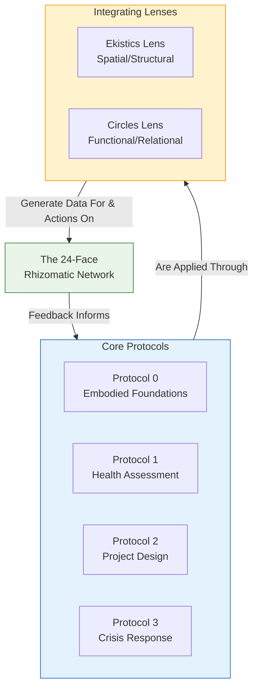
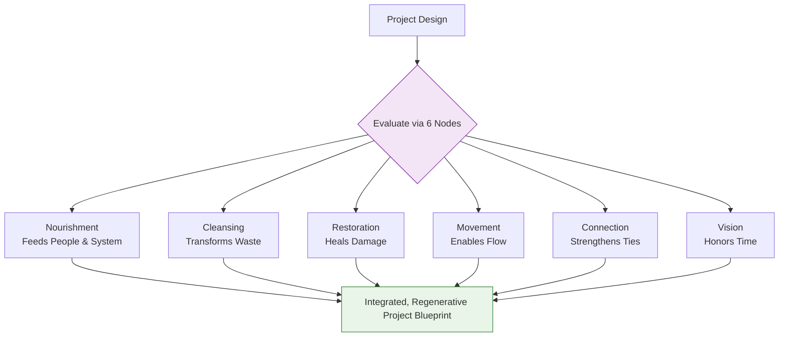
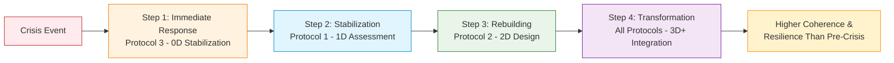

---
aeo_metadata:
  title: "Appendix E: Rhizomatic Protocol Integration"
  description: "The master manual for synthesizing the core Solarpunk Mandala protocols. Provides frameworks for integrating Embodied Foundations, Health Assessment, Project Design, and Crisis Response using the Rhizomatic Network's Ekistics and Circles lenses."
  context: "Advanced praxis appendix. Serves as the 'conductor's score' for facilitators, detailing how to weave individual Mandala tools into a unified, context-sensitive practice for community steering and regeneration."
  key_objectives:
    - "Define the logic of integrating spatial (Ekistics) and functional (Circles) lenses in all protocol work."
    - "Provide specific integration protocols for Health Assessment, Project Design, and Crisis Response."
    - "Establish the master 'Crisis-to-Regeneration Pathway' for transformational community navigation."
    - "Demonstrate practical synthesis through a detailed case study of integrated protocol application."
  core_concepts:
    - "Protocol Integration Logic"
    - "Ekistics & Circles as Integrating Lenses"
    - "Hexagonal Design Assessment"
    - "Dimensional Crisis Response"
    - "Crisis-to-Regeneration Pathway"
  ontological_foundation: "Applied Second-Order Cybernetics & Integrative Systems Thinking"
  epistemic_stance: "Synthetic-Pragmatic Weaving"
  search_queries:
    - "integrating community assessment tools"
    - "systems thinking protocol design"
    - "crisis response regenerative design"
    - "holistic project planning framework"
    - "Solarpunk Mandala facilitator guide"
  related_nodes:
    - "appendices/A-four-axis-contraction-tables.md"
    - "appendices/B-ritual-cube-dissolving-technology.md"
    - "appendices/C-alpha-coefficient-diagnostic-protocols.md"
    - "appendices/D-tesseract-geometry-guide.md"
    - "framework/core-model/04-dialectical-phases-velocity.md"
  framework_status: "Stable Protocol"
  version: "1.2"
  last_reviewed: "2026-01-12"
---
# Appendix E: Rhizomatic Protocol Integration

## 🧭 Executive Overview: Weaving the Protocols into Praxis

This document provides the master framework for **integrating the core Solarpunk Mandala protocols** into a cohesive, context-sensitive practice. It answers a critical question: "I have these different tools—Foundations, Assessment, Design, Response—how do I use them *together* effectively?"

Think of this as the **conductor's score** for the Mandala's instrumentation. Individual protocols are powerful, but their true potential is realized when played in concert, guided by the twin frameworks of the Rhizomatic Network: **Ekistics** (the spatial-structural lens) and **Circles** (the functional-relational lens).

**Reading Context:**
*   **Purpose:** A practical manual for facilitators and communities on synthesizing Mandala protocols for assessment, design, and crisis navigation.
*   **Prerequisites:** Familiarity with the four core protocols (0-3), the Rhizomatic Network's 24 Faces, and the Four Pathways.
*   **Time Investment:** 10-12 minutes for the integration framework; use protocols as situational reference.

## 1. Theoretical Foundation: The Logic of Integration

Protocols are not checklists but **dynamic interfaces** with a living system. Integration is necessary because complex realities cannot be fully addressed through a single lens. The Rhizomatic Network, with its 24 Faces (12 Ekistics + 12 Circles elements), provides the comprehensive map onto which all protocol data and actions can be plotted.

*   **Ekistics (The 'Where' & 'What'):** Provides the spatial, material, and infrastructural dimensions. *("What is the settlement's structure?")*
*   **Circles (The 'How' & 'Why'):** Provides the social, cultural, economic, and spiritual process dimensions. *("How do people relate and function within it?")*

Integration means constantly cross-referencing these two lenses to get a stereoscopic, full-spectrum view of the community system.

## 2. Core Integration Protocols

### 2.1 Protocol 1: Integrated Settlement Health Assessment
This protocol synthesizes the foundational **Settlement Health Assessment** with the **Four Axes** diagnostic, using the Rhizomatic Network as the integrating canvas.

**Objective:** To produce a multi-dimensional health profile that identifies not just weaknesses, but the *specific interfaces* between space and function that need healing.

| Diagnostic Axis | Primary Lens & Focus | Key Integration Question | Sample Tool/Output |
| :--- | :--- | :--- | :--- |
| **Soteriological (Self/Spirit)** | **Circles:** Spirituality **Ekistics:** MAN | How do our spaces (MAN) support or hinder our shared spiritual life and sense of identity? | Circles Radar Chart + Ekistics Scorecard overlay |
| **Ethical (Values/Relations)** | **Circles:** Culture, Politics **Ekistics:** SOCIETY | How do our social structures (SOCIETY) embody our stated ethics and facilitate healthy conflict? | Community Dialogue Protocol focused on structure-culture feedback |
| **Epistemic (Knowledge/Learning)** | **Circles:** Culture **Ekistics:** NETWORKS | How do our communication NETWORKS facilitate or block the flow of learning and memory? | Information flow mapping against cultural enquiry patterns |
| **Praxeological (Action/Production)** | **Circles:** Economics, Ecology **Ekistics:** SHELLS, NATURE | How do our built SHELLS and natural environment (NATURE) enable regenerative production and waste transformation? | Hexagonal Connection Map of resource flows |

**Integration Protocol Steps:**
1.  **Pre-Condition:** Verify all four Embodied Foundations are at Level ≥2 (via Protocol 0). Assessment without foundation is invalid.
2.  **Parallel Scoring:** Facilitate separate but simultaneous scoring sessions for the Four Axes and key Ekistics elements.
3.  **Cross-Walk Analysis:** Map each axis score to its corresponding 2-4 "Faces" on the full 24-Face Rhizomatic Network diagram. The weak point is rarely a whole axis, but a specific Face or the *interface between* a Circle and an Ekistics element.
4.  **Priority Identification:** Identify 1-3 of these weak interfaces as primary leverage points for intervention.
5.  **MAL Reflection:** For each weak interface, ask: *"How does this fracture in our shared reality help us remember our work to belong to Mind at Large?"* Grounds the diagnosis in the ontological foundation.

### 2.2 Protocol 2: Integrated Project Design
This protocol ensures that any community project is designed with **both spatial integrity and functional vitality** from the outset, aligned with a conscious Pathway.

**Objective:** To create projects that are coherent with the Mandala's geometry and actively strengthen the Rhizomatic Network.

| Project Phase | Awakening Pathway Focus | Making Pathway Focus | Liberation Pathway Focus | Healing Pathway Focus |
| :--- | :--- | :--- | :--- | :--- |
| **Conception** | "What evokes shared wonder?" (Spirituality) | "What core need must be met?" (MAN) | "Who decides if we do this?" (Politics) | "What old pain does this soothe?" (Culture) |
| **Design** | "How does design reflect cosmos?" (Spirituality) | "What is produced/transformed?" (Ecology/Economics) | "How does design distribute power?" (Politics) | "How does design facilitate learning?" (Culture) |
| **Implementation** | How is awe maintained in work? | How are skills developed? | How are decisions adapted? | How is care provided? |
| **Evaluation** | Did sense of meaning grow? | Did foundational capacity grow? | Were power structures healed? | Was relational repair achieved? |

**Integration Protocol: The Hexagonal Design Assessment**
For any project design, evaluate through six integrated nodes:
*   **Nourishment Node:** How will this project *feed* people (physically, emotionally, intellectually)?
*   **Cleansing Node:** How will this project *transform waste* (material, social, psychic)?
*   **Restoration Node:** How will this project *heal damage* to people or place?
*   **Movement Node:** How will this project *enable flow* (of resources, ideas, people)?
*   **Connection Node:** How will this project *strengthen relationships* (human & non-human)?
*   **Vision Node:** How will this project *honor time* (past memory, present need, future legacy)?

**Pathway Activation Check:** Before mobilizing a Pathway (e.g., a big "Making" project), verify its corresponding Embodied Foundation is above threshold (e.g., Nourishment for Making).

### 2.3 Protocol 3: Integrated Crisis Response
This protocol guides a dimensionally-appropriate response that moves from immediate stabilization to long-term regeneration, preventing reactive collapse.

**Objective:** To use crisis as a diagnostic and transformative moment, applying the minimum sufficient protocol for the current dimensional need.

| System Dimension | Immediate Response Focus (Ekistics - Stability) | Recovery & Regeneration Focus (Circles - Learning) |
| :--- | :--- | :--- |
| **0D (Point - Survival)** | **MAN:** Safety/Basic Needs **SHELLS:** Immediate Shelter | **Politics:** Security & Accord **Culture:** Narrative Holding |
| **1D (Line - Connection)** | **NETWORKS:** Communication/Coordination | **Culture:** Memory & Projection (What happened? What's next?) |
| **2D (Plane - Order)** | **SOCIETY:** Population Management | **Culture:** Identity & Engagement (Who are we now?) |
| **3D+ (Volume - Complexity)** | **NATURE:** Environmental Threat **SOCIETY:** Law & Administration | **Politics:** Ethics & Accountability **Spirituality:** Meaning-Making |

**Integration Protocol Steps:**
1.  **Foundation-First Triage:** Within first 24 hours, score the four Embodied Foundations. This data dictates all action priorities.
2.  **Hexagonal Emergency Planning:** Map the crisis response across the six nodes (Nourishment, Cleansing, etc.) to ensure a holistic, not just logistical, response.
3.  **Dimensional Scaling:** Match the complexity of your response coordination to the community's current operational dimension. Do not try to implement 3D solutions when the system has collapsed to 0D.
4.  **Post-Crisis Integration:** Design the recovery phase explicitly to strengthen the weakest interfaces revealed by the crisis, using Protocols 1 and 2.

## 3. Practical Application: The Crisis-to-Regeneration Pathway

This is the master sequence demonstrating dynamic protocol integration over time.

1.  **Immediate Response (0D):** Activate **Protocol 3** for foundational triage and stabilization. Goal: Prevent dissolution.
2.  **Stabilization (1D):** Use **Protocol 1** to assess the systemic vulnerabilities the crisis exposed. Goal: Understand the fracture patterns.
3.  **Rebuilding (2D):** Apply **Protocol 2** to design projects that specifically target and strengthen the weak faces identified in Step 2. Goal: Create new, resilient patterns.
4.  **Transformation (3D+):** Weave all protocols into ongoing governance and planning, creating a positive feedback loop of assessment, design, and adaptation. Goal: Achieve a higher coherence than pre-crisis.

### 3.1 Case Study: Community Flood Response
*   **Context:** A neighborhood experienced major flooding, displacing 50+ families.
*   **Application of Integrated Protocols:**
    *   **Protocol 3 (Crisis):** Foundation scores: Nourishment=0.8, Cleansing=0.5, Restoration=1.2, Movement=0.9. Action: 100% focus on raising Cleansing & Nourishment (water, food, sanitation).
    *   **Protocol 1 (Assessment):** Revealed chronically weak **WATER & AIR (Ecology)** and **NATURE: Climate** interfaces. Low score on **CULTURE: Memory & Projection**—historical flood patterns had been forgotten.
    *   **Protocol 2 (Design):** Designed (1) a flood-resilient community garden/water catchment system (addressing Ecology, Nourishment, Cleansing) and (2) a "Flood Memory" oral history project (addressing Culture: Memory).
    *   **Protocol 0 (Foundations):** Monitored foundation scores throughout recovery. Built a permanent community kitchen (↑Nourishment) and a healing garden (↑Restoration).
*   **Outcome:** 18 months post-crisis, the community's α-Coefficient and foundation scores exceeded pre-flood levels. The crisis, through integrated protocol response, became a catalyst for increased coherence and resilience.

## 4. Integration with Other Appendices

*   **Appendix A (Contraction Tables):** Use to diagnose the *type* of crisis or dysfunction before selecting integration protocols.
*   **Appendix B (Ritual Technology):** The rituals for "cube-dissolving" are the *enactment* of the interventions designed via Protocol 2.
*   **Appendix C (α-Coefficient):** The primary metric to track before, during, and after applying these integration protocols to measure impact on overall coherence.
*   **Appendix D (Tesseract Geometry):** Provides the structural logic. Protocol integration is the process of "operating" on the Tesseract's cubes and faces.
