---
aeo_metadata:
  title: "Appendix F: Meta-Narrative Mapping—A Field Guide to the Dialectical Arena"
  description: "A practical field guide for diagnosing the Necrocene meta-narrative, navigating the Five Phases of Dialectical Transformation, and designing interventions that embody the Symbiotic Commonwealth. Maps narrative warfare onto the Rhizomatic Network for actionable community strategy."
  context: "Advanced strategic appendix for cultural and narrative intervention within the Solarpunk Mandala. Provides the core framework for understanding transformation as a dialectical process and selecting phase-appropriate actions."
  key_objectives:
    - "Define the three forces of the Dialectical Arena: Necrocene (Thesis), Dialectical Axis (Process), Symbiotic Commonwealth (Synthesis)."
    - "Map the Five Phases of Transformation (0D-4D) with their core tasks, dangers, and geometric correlations."
    - "Provide indexed mechanisms of the Necrocene and Symbiotic narratives for deep diagnosis."
    - "Offer applied mappings of these narratives across key Rhizomatic Network domains (Politics, Economics, etc.)."
    - "Establish clear diagnostic and design protocols for phase-aware community intervention."
  core_concepts:
    - "The Dialectical Arena & Axis"
    - "Necrocene Meta-Narrative (Extraction, Control)"
    - "Symbiotic Commonwealth Meta-Narrative (Regeneration, Care)"
    - "Five Phases of Transformation (0D-4D)"
    - "Phase-Appropriate Strategy"
    - "Narrative Mechanism Mapping"
  ontological_foundation: "Dialectical Materialism & Narrative Systems Theory"
  epistemic_stance: "Critical-Praxis Analysis"
  search_queries:
    - "meta-narrative analysis social change"
    - "dialectical transformation phases"
    - "regenerative culture design"
    - "narrative warfare toolkit"
    - "Solarpunk strategic planning"
  related_nodes:
    - "framework/core-model/04-dialectical-phases-velocity.md"
    - "appendices/A-four-axis-contraction-tables.md"
    - "appendices/E-rhizomatic-protocol-integration.md"
    - "appendices/B-ritual-cube-dissolving-technology.md"
  framework_status: "Stable Strategy"
  version: "1.2"
  last_reviewed: "2026-01-12"
---
# Appendix F: Meta-Narrative Mapping—A Field Guide to the Dialectical Arena

## 🧭 Executive Overview: Navigating the Stories That Shape Reality

This document is a **field guide to the Dialectical Arena**—the contested space where the defining stories of our time clash and transform. It provides the tools to map the toxic patterns of the dominant **Necrocene** meta-narrative, navigate the **Five Phases of Dialectical Transformation**, and consciously design interventions that embody the emergent logic of the **Symbiotic Commonwealth**.

Think of this as a **compass and translation key**. It allows practitioners to diagnose the deep narrative roots of surface-level community challenges, understand their position in a process of change, and select phase-appropriate strategies for intervention across all domains of the Rhizomatic Network.

**Reading Context:**
*   **Purpose:** A practical manual for diagnosing narrative patterns, understanding transformation phases, and designing culturally-grounded interventions.
*   **Prerequisites:** Familiarity with the core Mandala Tesseract, the Rhizomatic Network's 24 Faces, and the concept of the Dialectical Axis (from Node 04).
*   **Time Investment:** 12-15 minutes for the core framework; use mapping tables as a reference during analysis.

## 1. The Dialectical Arena: Three Forces in Tension

The Arena is not neutral ground but a living field defined by three interdependent forces:

1.  **The Necrocene (Thesis):** The dominant, death-driven meta-narrative of extraction, dissociation, and control. It operates as a pervasive logic, not just a set of policies.
2.  **The Dialectical Axis (Process):** The inherent pathway of transformation, manifesting as five sequential yet recursive phases (0D to 4D). This is the engine of change from one narrative to another.
3.  **The Symbiotic Commonwealth (Synthesis):** The emergent, life-affirming meta-narrative of regeneration, reconnection, and care. It exists both as a future horizon and as latent patterns within present systems.

The work of the Mandala is to consciously navigate the Dialectical Axis from Thesis toward Synthesis.

## 2. The Dialectical Axis: Five Phases of Transformation

Transformation is not a binary switch but a journey through distinct phases, each with its own characteristics, tasks, and dangers. The following table maps this journey for a conscious system (individual or collective).

| Phase & Mandala Geometry | Necrocene Pattern (What We're Moving From) | Core Task & Transition Mechanism | Symbiotic Pattern (What We're Moving Toward) | Hive Development Analogy |
| :--- | :--- | :--- | :--- | :--- |
| **0D: Dissolution** *Cube 5 Activation* | **Power Hoarding through Fragmentation:** Crisis, panic, and the collapse of trust into isolated fragments. | **Boundary Recognition:** To safely fall apart and recognize the breaking point. Survival and mutual aid. | **Power Circulation through Reconnection:** The formation of basic trust and shared purpose in adversity. | Colony overcrowding; swarm preparation begins. A necessary breakdown before renewal. |
| **1D: Emergence** *24 Faces Activation* | **Illusion of Scarcity through Extraction:** Gatekeeping, short-term thinking, and competition for perceived limited resources. | **Reciprocal Metabolism:** To explore new possibilities and establish small-scale, reciprocal exchanges. | **Abundance through Circulation:** Skill-sharing, local currencies, and the first tangible experiences of sufficiency. | Swarm clusters; scout bees search for a new site. A liminal state of exploration. |
| **2D: Integration** *Cube 6 Activation* | **Externalized Costs through Dissociation:** Tokenism, "greenwashing," and addressing symptoms without systemic responsibility. | **Internalized Responsibility:** To integrate new patterns into coherent systems and establish shared accountability. | **Regenerative Cycles through Accountability:** Participatory governance, restorative justice, and circular material flows. | New nest site chosen; comb construction begins. Building the new structure. |
| **3D: Transformation** *Cube 8 Activation* | **Short-Termism through Amnesia:** Future-proofing that preserves old logic, elite capture of change movements. | **Deep Time Awareness:** To align systems with long-term, multi-generational health and ecological law. | **Seven-Generation Thinking through Continuity:** Strategic foresight, intergenerational mentoring, and cultural revival. | Fully functional hive transforms local ecology. The new system becomes a generative force. |
| **4D: Reunification** *Tesseract Wholeness* | **Death-Driven Logic through Separation:** The complete normalization of harm and alienation as "natural." | **Participatory Consciousness:** To embody the new logic as implicit reality, belonging to a conscious, patterned whole (MAL). | **Life-Affirming Logic through Belonging:** Seamless flow of care and power; living as an expression of a symbiotic universe. | Hive networks; genetic continuity. Maintaining identity while being part of a larger, regenerative web. |

```mermaid
graph LR
    Thesis[Necrocene Meta-Narrative<br/>Thesis / Status Quo] -->|Disintegration &<br/>Contradiction| P0[0D: Dissolution<br/>Crisis / Breakdown]

    P0 -->|Boundary Recognition<br/>& Mutual Aid| P1[1D: Emergence<br/>Exploration / Reciprocity]
    P1 -->|Metabolizing New Patterns| P2[2D: Integration<br/>Coherence / Accountability]
    P2 -->|Internalizing Responsibility| P3[3D: Transformation<br/>Generativity / Foresight]
    P3 -->|Embracing Deep Time| P4[4D: Reunification<br/>Wholeness / Belonging]

    P4 -->|New Tensions &<br/>Higher-Order Synthesis| Synthesis[Symbiotic Commonwealth<br/>Synthesis / New Horizon]

    P1 -.->|Recursive Feedback &<br/>Setbacks| P0
    P2 -.->|Recursive Feedback &<br/>Setbacks| P1
    P3 -.->|Recursive Feedback &<br/>Setbacks| P2

    style Thesis fill:#ffebee,stroke:#c62828
    style P0 fill:#fff3e0,stroke:#f57c00
    style P1 fill:#e8f5e8,stroke:#2e7d32
    style P2 fill:#e3f2fd,stroke:#1565c0
    style P3 fill:#f3e5f5,stroke:#7b1fa2
    style P4 fill:#fff3cd,stroke:#ff8f00
    style Synthesis fill:#e8f5e8,stroke:#2e7d32,stroke-width:2px
```

## 3. Meta-Narrative Index: Core Mechanisms of Each Pole

To diagnose and design effectively, we must move beyond symptoms to the **core narrative mechanisms**.

### 3.1 Necrocene Mechanisms (The Logic of Separation)
| Meta-Mechanism | Core Definition | Expression in 0D-1D (Crisis/Scarcity) | Expression in 2D-4D (Systemic Entrenchment) |
| :--- | :--- | :--- | :--- |
| **Power Hoarding** | Concentrating agency, resources, and meaning. | Rule by force/fear; gatekeeping survival resources. | Token inclusion; bureaucratic barriers; elite capture of transformation narratives. |
| **Extractive Temporality** | Stealing from the future to pay the present. | Crisis reactivity with no learning; quarterly obsession. | "Sustainable" growth; future-proofing that externalizes long-term costs. |
| **Structural Violence** | Harm embedded in seemingly neutral systems. | Open brutality and exclusion of the "other." | "Equal opportunity" without reparations; diversity without power redistribution. |

### 3.2 Symbiotic Commonwealth Mechanisms (The Logic of Reconnection)
| Meta-Mechanism | Core Definition | Expression in 0D-1D (Foundations/Roots) | Expression in 2D-4D (Flourishing/Canopy) |
| :--- | :--- | :--- | :--- |
| **Power Circulation** | Distributing agency through networks and context. | Mutual aid networks; skill-sharing circles. | Participatory budgeting; distributed leadership; fluid, context-aware roles. |
| **Regenerative Temporality** | Acting from deep time and multi-generational care. | Ancestral survival knowledge; seasonal awareness. | Intergenerational mentorship; cultural continuity planning; seven-generation impact assessment. |
| **Guided Activity** | Support that empowers without controlling. | Emergency response that protects dignity; clear roles in care networks. | Self-organizing systems with light-touch facilitation; care as a default social infrastructure. |

## 4. Applied Mapping: The Rhizomatic Network Through a Dialectical Lens

This section provides a practical translation table, mapping Necrocene and Symbiotic expressions onto specific domains of the Rhizomatic Network, annotated with their likely Dialectical Phase.

### 4.1 POLITICS Domain
| Circle Element | Necrocene Expression (🔴) & Phase | Symbiotic Expression (🌿) & Phase | Key Transition |
| :--- | :--- | :--- | :--- |
| **Organization & Governance** | Steering Activity: Rule by crisis, violence as order. *(0D)* | Participatory Democracy: Consent-based, decentralized coordination. *(2D-3D)* | From crisis control to distributed, trained facilitation. |
| **Law & Justice** | Structural Violence: Punitive systems, sacrifice zones. *(1D-2D)* | Restorative Justice: Healing harm, community reintegration. *(2D-3D)* | From punishment to dialogue circles and community-led accountability processes. |
| **Communication & Critique** | Antidiologic: Division, propaganda, epistemic chaos. *(0D-1D)* | Dialogic: Co-creation of truth, generative conflict. *(2D-4D)* | From debate-to-win to active listening and multi-perspective wisdom councils. |

### 4.2 ECONOMICS Domain
| Circle Element | Necrocene Expression (🔴) & Phase | Symbiotic Expression (🌿) & Phase | Key Transition |
| :--- | :--- | :--- | :--- |
| **Production & Resourcing** | Necrocapitalism: Linear extraction, creation of "death-worlds." *(1D-2D)* | Biocracy: Circular flows, regenerative design. *(2D-3D)* | From exploitative supply chains to local cooperatives and regional circular economies. |
| **Exchange & Transfer** | Finance Strategy: Debt peonage, wealth hoarding. *(1D-2D)* | Commons Strategy: Mutual credit, gift economy logic. *(1D-3D)* | From centralized currency to time banks, local currencies, and needs-based distribution. |

```mermaid
graph TD
    subgraph Phases
        P0[0D: Dissolution]
        P1[1D: Emergence]
        P2[2D: Integration]
        P3[3D: Transformation]
        P4[4D: Reunification]
    end

    P0 --> I0[Mutual Aid &<br/>Survival Support]
    P0 --> C0[Crisis Communication<br/>& Trauma Holding]

    P1 --> I1[Skill-Shares &<br/>Tool Libraries]
    P1 --> C1[Local Currencies &<br/>Direct Barter]

    P2 --> I2[Participatory Governance<br/>& Consensus Training]
    P2 --> C2[Restorative Justice<br/>Circles]

    P3 --> I3[Intergenerational<br/>Mentorship Programs]
    P3 --> C3[Regional Symbiotic<br/>Network Design]

    P4 --> I4[Cultural Revival &<br/>Deep Time Ceremony]
    P4 --> C4[Living Systems<br/>Stewardship]

    style I0 fill:#fff3e0,stroke:#f57c00
    style C0 fill:#ffebee,stroke:#c62828
    style I1 fill:#e8f5e8,stroke:#2e7d32
    style C1 fill:#e8f5e8,stroke:#2e7d32
    style I2 fill:#e3f2fd,stroke:#1565c0
    style C2 fill:#e3f2fd,stroke:#1565c0
    style I3 fill:#f3e5f5,stroke:#7b1fa2
    style C3 fill:#f3e5f5,stroke:#7b1fa2
    style I4 fill:#fff3cd,stroke:#ff8f00
    style C4 fill:#fff3cd,stroke:#ff8f00
```

## 5. Practitioner's Protocols: From Diagnosis to Design

### 5.1 Diagnostic Protocol with Phase Awareness
When facing a community challenge:
1.  **Locate the Element:** Identify which Rhizomatic Network Face (Circle + Ekistics) is the primary site of the issue.
2.  **Diagnose the Narrative:** Using Section 4, ask: *"Which column (🔴 or 🌿) better describes the dominant pattern here?"*
3.  **Assess the Phase:** Using Section 2, determine the community's current **Dialectical Phase** (0D-4D) regarding this issue. *Is it a crisis (0D), a stuck pattern (1D-2D), or a moment of potential breakthrough (3D)?*
4.  **Trace to the Root:** Connect the surface pattern to its underlying **Meta-Mechanism** (Section 3). *Is this fundamentally about hoarded power, extractive time, or structural violence?*
5.  **Name the Logic:** Articulate the specific **Necrocene Mechanism** at work. This precise naming is the first step to disarming it.

### 5.2 Design Protocol with Phase-Appropriate Strategies
When designing an intervention:
1.  **Envision the Symbiotic Alternative:** Select the target **🌿 Symbiotic Expression** from the mapping tables.
2.  **Match Strategy to Phase:** Choose tactics suitable for your diagnosed phase. *Offer mutual aid in 0D, not a complex consensus process. Propose participatory governance in 2D, not in a survival crisis.*
3.  **Leverage Transition Mechanisms:** Design activities that directly activate the **Core Task** of your phase (see Section 2 table). For 1D, design for "Reciprocal Metabolism"; for 2D, for "Internalized Responsibility."
4.  **Activate Mandala Geometry:** Consult the "Tesseract Cube Activation by Phase" table (from the original document) to understand which cognitive/social "space" needs activation in your community.
5.  **Measure Narrative Shift:** Track success not just by tasks completed, but by shifts in language, relationship patterns, and the embodied sense of what is "possible" or "normal."

## 6. Tesseract Cube Activation by Dialectical Phase
*This condensed table summarizes which aspects of collective "consciousness" are typically engaged in each phase.*
| Cube | 0D: Dissolution | 1D: Emergence | 2D: Integration | 3D: Transformation | 4D: Reunification |
| :--- | :--- | :--- | :--- | :--- | :--- |
| **UR (Physical)** | Survival panic | Sustainable metabolism | Reciprocal exchange | Regenerative flows | Participatory matter |
| **UL (Subjective)** | Nihilism/despair | Meaning-making | Shared purpose | Cosmic belonging | Pattern in Mind at Large |
| **LL (Intersubjective)** | Tribal conflict | Trust-building | Shared narrative | Ubuntu consciousness | Transpersonal unity |
| **LR (Systemic)** | Authoritarian control | Cooperative prototyping | Participatory systems | Symbiotic governance | Living system emergence |
| **Cube 5 (Dissoc.)** | Trauma & fragmentation | Boundary awareness | Boundary medicine practices | Seamless belonging | Dissolution of separation |
| **Cube 8 (Meta-Perspective)** | Collapsed foresight | Emerging awareness | Pattern recognition | Strategic foresight | Eternal now awareness |

## 7. Integration & Conclusion: The Arena as a Practice

*   **Integration:** This mapping is designed for use with **Appendix A (Contraction Tables)** for deeper diagnosis, **Appendix B (Ritual Technology)** to enact phase transitions, and **Appendix E (Protocol Integration)** to weave this analysis into holistic community steering.
*   **Conclusion:** The Dialectical Arena is not a theory to understand, but a **muscle to develop**. The goal is to build community capacity to: 1) **See** the meta-narrative in daily events, 2) **Locate** themselves on the Axis without judgment, and 3) **Choose** the next, most coherent step toward wholeness. This is the praxis of weaving the Symbiotic Commonwealth, one phase-aware intervention at a time.
