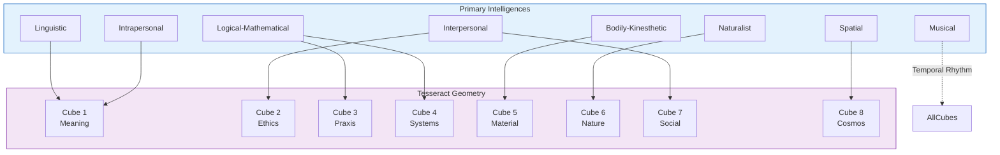
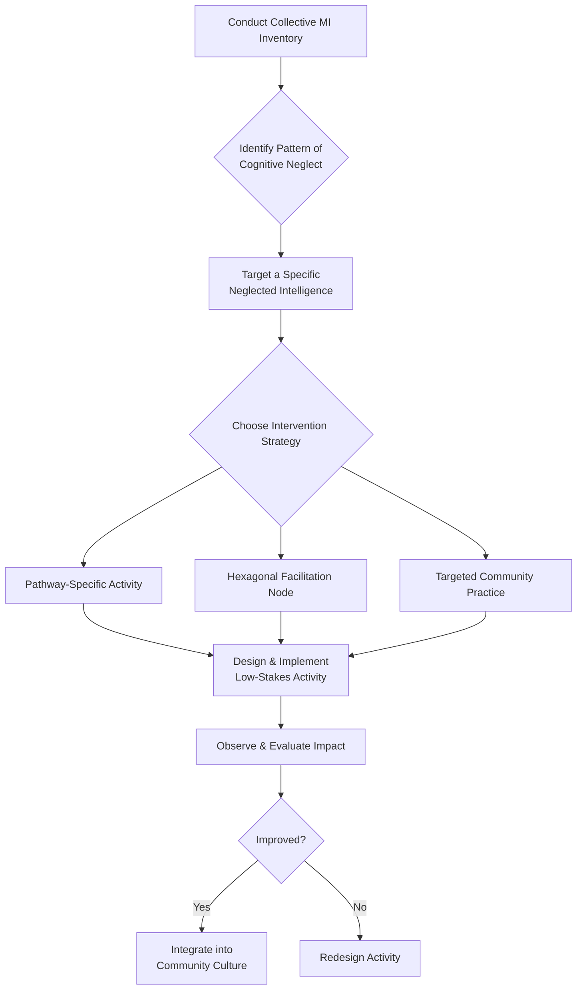

---
aeo_metadata:
  title: "Appendix G: Multiple Intelligences Integration—A Praxis Guide"
  description: "A practical manual for integrating Multiple Intelligences theory into the Solarpunk Mandala framework. Maps cognitive diversity onto geometric models to diagnose collective blind spots, design inclusive processes, and cultivate holistic community intelligence."
  context: "Applied psychology and facilitation appendix. Bridges cognitive theory and systemic geometry to equip practitioners with tools for creating cognitively regenerative communities within the Mandala framework."
  key_objectives:
    - "Map eight core intelligences onto the Tesseract's cubes and the Rhizomatic Network's domains."
    - "Provide a protocol for diagnosing a community's collective cognitive profile (strengths & neglects)."
    - "Establish intervention strategies, including Pathway-aligned development and Hexagonal Facilitation design."
    - "Demonstrate how cognitive diversity is a functional requirement for navigating complexity and fostering regeneration."
  core_concepts:
    - "Multiple Intelligences (Linguistic, Logical, Spatial, etc.)"
    - "Collective Cognitive Profile & Blind Spots"
    - "Cognitive Monoculture vs. Cognitive Ecosystem"
    - "Hexagonal Facilitation Design"
    - "Intelligence-Pathway Alignment"
  ontological_foundation: "Pluralistic Cognitive Science & Geometric Systems Theory"
  epistemic_stance: "Integrative-Pragmatic Weaving"
  search_queries:
    - "multiple intelligences community facilitation"
    - "cognitive diversity in systems thinking"
    - "inclusive meeting design"
    - "Howard Gardner solarpunk"
    - "collective intelligence development"
  related_nodes:
    - "framework/core-model/02-epistemic-architecture-tesseract.md"
    - "appendices/B-ritual-cube-dissolving-technology.md"
    - "appendices/C-alpha-coefficient-diagnostic-protocols.md"
    - "appendices/E-rhizomatic-protocol-integration.md"
  framework_status: "Stable Protocol"
  version: "1.1"
  last_reviewed: "2026-01-12"
---
# Appendix G: Multiple Intelligences Integration—A Praxis Guide

## 🧭 Executive Overview: Embodying the Geometry of Mind

This document provides the operational framework for integrating the theory of **Multiple Intelligences (MI)**—the diverse, semi-autonomous faculties of cognition—into the geometric architecture of the Solarpunk Mandala. It answers a critical question: "How do the distinct 'ways of knowing' within individuals and collectives map onto, animate, and are developed by the Tesseract's structure and the Rhizomatic Network's processes?"

Think of this as the **wiring diagram between psychology and geometry**. It allows practitioners to diagnose collective cognitive strengths and blind spots, design interventions that engage the full spectrum of intelligence, and foster communities where diverse cognitive styles become a source of resilience and creativity, not conflict.

**Reading Context:**
*   **Purpose:** A manual for mapping cognitive diversity onto systemic design, facilitating inclusive processes, and developing holistic community intelligence.
*   **Prerequisites:** Familiarity with the core Tesseract model (Node 02), the Rhizomatic Network's 24 Faces, and basic concepts of Multiple Intelligences theory.
*   **Time Investment:** 10-12 minutes for the core framework; use mapping tables as a reference during facilitation.

## 1. Theoretical Synthesis: Intelligences as the Animate Layer of Geometry

The Mandala's geometric models (Tesseract, Rhizomatic Network) describe the **structure and relationships** of a conscious system. Multiple Intelligences theory describes the **qualitative modes of processing** that animate that structure. Their integration is essential for praxis.

*   **Intelligences Animate Cubes:** Each of the Tesseract's eight cubes has a dominant "cognitive character" best navigated and developed through specific intelligences.
*   **Network Faces are Intelligence Interfaces:** Each Face of the Rhizomatic Network represents a domain of activity that requires the integration of several intelligences to address effectively.
*   **Cognitive Diversity as Requisite Variety:** A community's collective intelligence—its ability to sense, process, and respond to complexity—is a direct function of its accessible MI profile. Diversity is not just ethical; it's a functional necessity for navigating the Symbiocene.

## 2. Mapping the Eight Intelligences to the Mandala Architecture

This core mapping aligns eight key intelligences with the geometric and functional components of the framework. This is not a rigid assignment but a map of primary resonances.

| Intelligence | Core Faculty & "Language" | Primary Tesseract Correlation | Key Rhizomatic Domains (Faces) |
| :--- | :--- | :--- | :--- |
| **Linguistic** | Sensitivity to words, language, meaning, and narrative. | **Epistemic Axis**; Cubes related to Culture & Meaning. | **Culture:** Enquiry & Learning; **Politics:** Dialogue. |
| **Logical-Mathematical** | Sensitivity to patterns, logic, systems, and quantitative reasoning. | **Praxeological Axis**; Cubes related to Systems & Organization. | **Economics:** Production; **Politics:** Organization & Governance. |
| **Spatial** | Sensitivity to physical space, geometry, imagery, and relational placement. | **Soteriological Axis** (as internal landscape); **Cube 8 (Meta-Perspective)**. | **Ekistics:** All SHELLS & NETWORKS; **Spirituality:** Cosmology. |
| **Bodily-Kinesthetic** | Sensitivity to somatic experience, movement, gesture, and embodied craft. | **Embodied Foundations** (especially Movement); **Material Cubes**. | **MAN:** Biological Needs; **Ecology:** Practice. |
| **Musical** | Sensitivity to rhythm, pitch, timbre, and sonic patterning. | **Temporal Rhythms** of all processes; **Dialectical Phases**. | **Culture:** Arts & Celebration; **Spirituality:** Practice & Ceremony. |
| **Interpersonal** | Sensitivity to the moods, motivations, and needs of others. | **Intersubjective Cubes (LL)**; **Cube 6 (Gateway)**. | **Politics:** All elements; **Society:** All elements. |
| **Intrapersonal** | Sensitivity to one's own inner states, feelings, and self-model. | **Subjective Cubes (UL)**; **Soteriological Axis** work. | **Spirituality:** Contemplation; **Culture:** Identity. |
| **Naturalist** | Sensitivity to the living world, ecological patterns, and species differentiation. | **Cube 6 (Nature)**; **Ethical Axis** in external relation. | **NATURE:** All elements; **Ecology:** All elements. |

## 3. Diagnostic Protocol: Assessing Collective Cognitive Profile

A community, like an individual, has a "signature" of stronger and under-utilized intelligences. This protocol assesses that profile to guide development.

### 3.1 The Collective MI Inventory (CMI-I)
A simple observational and narrative assessment tool. For each intelligence, facilitators and community members reflect on:
1.  **Visibility:** How visibly is this intelligence expressed in our shared spaces, rituals, and decision-making?
2.  **Value:** How explicitly do we honor and reward this form of intelligence?
3.  **Infrastructure:** Do we have tools, processes, or physical spaces that support its expression?

**Scoring:** Use a simple scale (Low/Medium/High) or narrative descriptors. The goal is not a precise number but to identify clear patterns of **cognitive dominance** and **cognitive neglect**.

### 3.2 Analysis & Interpretation
*   **Identify Dominant Modes:** Which 2-3 intelligences are most visible and valued? (e.g., a tech collective may dominant in Logical & Linguistic, neglecting Musical and Naturalist).
*   **Identify Neglected Modes:** Which intelligences are consistently scored low? These are likely **systemic blind spots** that limit the community's resilience and creativity.
*   **Map to Challenge Areas:** Cross-reference neglected intelligences with the mapping in Section 2. Are the community's persistent struggles (e.g., conflict, poor planning) occurring in domains correlated with those neglected intelligences?

## 4. Intervention Protocol: Cultivating Holistic Community Intelligence

The goal is not to make everyone expert in everything, but to design community processes that **invite and require** the integration of diverse intelligences.

### 4.1 Pathway-Specific Intelligence Development
Each Mandala Pathway naturally cultivates a cluster of intelligences. Frame pathway work as intelligence development.

| Pathway | Primary Intelligences Cultivated | Sample Development Activities |
| :--- | :--- | :--- |
| **Awakening** | Intrapersonal, Spatial, Naturalist | Guided meditation (Intrapersonal), land art/mapping (Spatial), species identification walks (Naturalist). |
| **Making** | Bodily-Kinesthetic, Logical-Mathematical, Spatial | Collaborative building projects (Kinesthetic & Spatial), material flow analysis (Logical). |
| **Liberation** | Interpersonal, Linguistic, Logical-Mathematical | Restorative justice circles (Interpersonal & Linguistic), participatory budgeting design (Logical & Interpersonal). |
| **Healing** | Interpersonal, Intrapersonal, Musical | Shared storytelling (Linguistic/Interpersonal), grief rituals with song (Musical/Intrapersonal). |

### 4.2 The Hexagonal Facilitation Design
For any community meeting or process, use the hexagon's six points to ensure multiple intelligences are engaged. Design an activity or checkpoint for each:

1.  **Linguistic Node:** Share insights in words (e.g., check-in round).
2.  **Logical Node:** Analyze patterns or make a decision (e.g., pros/cons list).
3.  **Spatial Node:** Map ideas physically (e.g., sticky notes on a wall, drawing).
4.  **Kinesthetic Node:** Include a somatic element (e.g., standing to vote, moving to different corners of the room).
5.  **Interpersonal Node:** Work in pairs or small groups to discuss.
6.  **Musical/Naturalist Node:** Open or close with a song, sound, or moment of silence/listening to the environment.

### 4.3 Addressing Cognitive Neglect: Targeted Interventions
If the diagnostic reveals a neglected intelligence, design specific, low-stakes practices to invite it in:
*   **Neglected Musical Intelligence:** Introduce a simple, repeated song for opening meetings; use drumming to signal transitions.
*   **Neglected Naturalist Intelligence:** Hold meetings outdoors; include an "ecological witness" role in discussions.
*   **Neglected Spatial Intelligence:** Use more physical models, diagrams, and maps in planning sessions.

## 5. Integration with Other Appendices & Mandala Processes

*   **With Appendix B (Ritual):** Rituals are the primary technology for **embodying** intelligences. Design rituals that specifically engage neglected modes (e.g., a movement ritual for Kinesthetic, a soundscape ritual for Musical).
*   **With Appendix C (α-Coefficient):** A community's coherence (α) is likely higher when its processes honor multiple ways of knowing, reducing the "stress" experienced by those whose dominant intelligence is marginalized.
*   **With Appendix E (Protocol Integration):** Use the MI lens to **evaluate and refine** your integrated protocols. Is your Project Design protocol (E.2) only appealing to Logical thinkers? Redesign it with Spatial and Kinesthetic nodes.
*   **With Dialectical Phases (Node 04):** Different phases may call for different intelligence emphases. **0D Dissolution** may require acute Interpersonal and Intrapersonal intelligence to hold trauma. **3D Transformation** may require strong Spatial and Logical intelligence for systems redesign.

## 6. Case Study: From Debate to Dialogue

*   **Context:** A community council was stuck in repetitive, divisive debates (high Linguistic, Logical dominance).
*   **Diagnosis (CMI-I):** High Linguistic/Logical, very low Interpersonal (listening), Spatial, and Kinesthetic. Debates were "head-only."
*   **Intervention (Hexagonal Design):** Redesigned council meetings:
    *   **Spatial/Kinesthetic:** Created a physical "proposal map" on the floor. Speakers had to stand on the aspect they were addressing.
    *   **Interpersonal:** Introduced a mandatory "reflect back what you heard" rule before offering a counter-point.
    *   **Musical:** Used a bell to signal the end of one person's speaking time.
*   **Outcome:** Within three sessions, the quality of discussion shifted from debate to dialogue. Participants reported feeling "more connected" and "less ideologically rigid." The spatial mapping made complex proposals easier for everyone to grasp.

## 7. Conclusion: Toward a Cognitively Regenerative Culture

Integrating Multiple Intelligences is not an educational add-on but a core **regenerative practice**. It moves a community from relying on a narrow band of cognitive processing—a form of **cognitive monoculture**—toward a **cognitive ecosystem** rich in diverse, interdependent ways of knowing. This diversity is the soil from which the novel, adaptive solutions of the Symbiotic Commonwealth can grow.

**The ultimate goal:** To build communities where every member's unique cognitive signature is recognized as a vital contribution to the whole, and where collective processes are designed to weave those signatures into a coherent, resilient, and intelligent whole.
