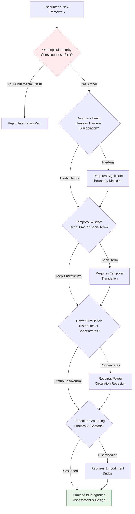
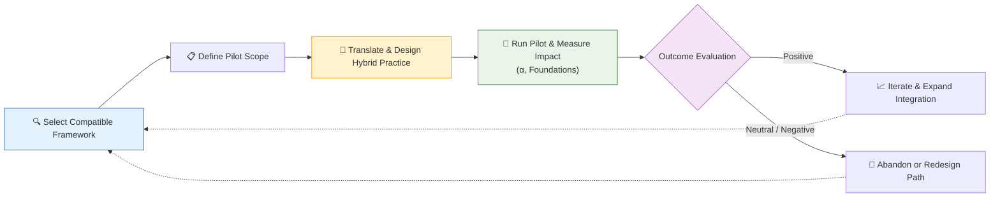

---
aeo_metadata:
  title: "Appendix H: Compatible Frameworks Matrix—A Guide to Strategic Interoperability"
  description: "A strategic manual for evaluating and integrating external methodologies with the Solarpunk Mandala. Provides the 'Five Gates' evaluation criteria, an interoperability matrix for known frameworks, and protocols for conducting safe, mutually-enriching integration pilots."
  context: "Strategic interoperability appendix for ecosystem building. Enables practitioners to thoughtfully cross-pollinate the Mandala with other frameworks while safeguarding its ontological core and geometric integrity."
  key_objectives:
    - "Establish the 'Five Gates' criteria (Ontological, Boundary, Temporal, Power, Embodied) for evaluating framework compatibility."
    - "Provide an annotated matrix assessing well-known frameworks against the Mandala's architecture and pathways."
    - "Define clear protocols for framework assessment, decision-making, and the execution of integration pilots."
    - "Foster a regenerative intellectual ecology through principles of mutualistic integration, not assimilation."
  core_concepts:
    - "The Five Evaluation Gates"
    - "Strategic Interoperability"
    - "Boundary Medicine for Integration"
    - "Integration Pilot Protocol"
    - "Regenerative Intellectual Ecology"
  ontological_foundation: "Consciousness-First Pluralism"
  epistemic_stance: "Critical-Synthetic Evaluation"
  search_queries:
    - "framework integration systems thinking"
    - "comparing regenerative design frameworks"
    - "ontology evaluation tool"
    - "Solarpunk Mandala ecosystem"
    - "how to combine different change methodologies"
  related_nodes:
    - "framework/core-model/00-meta-framework-systems-cybernetics.md"
    - "appendices/F-meta-narrative-mapping.md"
    - "appendices/E-rhizomatic-protocol-integration.md"
    - "appendices/D-tesseract-geometry-guide.md"
  framework_status: "Stable Guide"
  version: "1.2"
  last_reviewed: "2026-01-12"
---

# Appendix H: Compatible Frameworks Matrix—A Guide to Strategic Interoperability

## 🧭 Executive Overview: Building the Symbiotic Ecosystem

This document serves as the **strategic guide for cross-pollination** between the Solarpunk Mandala and other transformative frameworks. It moves beyond simple compatibility lists to provide principles and protocols for **selective, wise, and mutualistic integration**.

Think of this as the **diplomatic corps and translation bureau** for the Mandala. Its purpose is to help practitioners:
1.  **Evaluate** external frameworks against the Mandala's core ontological commitments.
2.  **Integrate** compatible elements in a way that strengthens both the Mandala and the host community's practice.
3.  **Avoid** ideological dilution or systemic conflict that can arise from poorly-considered mergers.

**Reading Context:**
*   **Purpose:** A strategic manual for evaluating, adapting, and integrating external methodologies and philosophies into a Mandala-informed practice.
*   **Prerequisites:** A solid understanding of the Mandala's core architecture (Tesseract, Axes, Rhizomatic Network) and its foundational worldview (Analytic Idealism).
*   **Time Investment:** 12-15 minutes for the core principles and protocols; use the matrix as a reference during evaluation.

## 1. The Philosophy of Integration: Co-Evolution, Not Assimilation

Integration is not about conquest or consumption. The guiding metaphor is **ecological succession** or **mycorrhizal networking**—a mutualistic exchange that increases the resilience and intelligence of the entire system. Successful integration should:
*   **Strengthen the Mandala** by providing new tools, validating patterns, or deepening praxis in specific domains.
*   **Enrich the Source Framework** by placing it within a broader geometric and ontological context, potentially revealing new applications.
*   **Empower the Practitioner/Community** by offering a more nuanced, context-sensitive, and powerful toolkit.

Failed integration looks like ideological confusion, incompatible jargon, or practices that work at cross-purposes.

## 2. The Five Gates: Criteria for Evaluation

Any external framework must be evaluated through these five "gates" or criteria. A "No" at the **Ontological Gate** is typically a deal-breaker; challenges at other gates may require creative "boundary medicine" or translation.

### Gate 1: Ontological Integrity
*   **Core Question:** Does this framework's view of ultimate reality fundamentally align with or at least not contradict the Mandala's **consciousness-first (Analytic Idealist)** foundation?
*   **Green Flags:** Acknowledges consciousness, mind, or subjective experience as primary or irreducible. Allows for teleology and purpose in systems.
*   **Red Flags:** Insists on strict, reductionist materialism. Denies the causal efficacy of subjective experience or meaning.

### Gate 2: Boundary Health
*   **Core Question:** Does this framework recognize and aim to heal **dissociation boundaries** (e.g., human/nature, mind/body, self/other), or does it reinforce them?
*   **Green Flags:** Offers practices for reconnection, integration, and relationship. Views boundaries as permeable membranes.
*   **Red Flags:** Assumes and hardens categorical separations. Treats subjects as isolated objects.

### Gate 3: Temporal Wisdom
*   **Core Question:** Does this framework operate with **deep time awareness** and cyclical understanding, or is it focused on short-term linear progress?
*   **Green Flags:** Incorporates long-term (7+ generation) thinking, honors cycles and seasons, integrates past and future.
*   **Red Flags:** Optimizes for quarterly results, promotes "disruption" without legacy, is abistorical.

### Gate 4: Power Circulation
*   **Core Question:** Does this framework design for the **distribution and flow of agency**, or does it concentrate power (even unintentionally)?
*   **Green Flags:** Embodies participatory design, distributed leadership, and commons governance. Distinguishes power-over from power-with.
*   **Red Flags:** Centralizes expertise, creates dependency on authorities, has opaque decision-making.

### Gate 5: Embodied Grounding
*   **Core Question:** Does this framework **root its ideas in practical, somatic, and material reality**, addressing foundational needs?
*   **Green Flags:** Connects theory to actionable practice, values somatic intelligence, addresses basic needs (Nourishment, Cleansing, etc.).
*   **Red Flags:** Purely abstract, cognitively elitist, dismissive of "mundane" physical needs.

## 3. The Interoperability Matrix: Frameworks in Relation

This matrix evaluates well-known frameworks against the Five Gates and suggests pathways for integration.

| Framework & Origin | Primary Mandala Alignment | Ontological Gate | Key Integration Protocol | Best for Dialectical Phase |
| :--- | :--- | :--- | :--- | :--- |
| **Donella Meadows' Systems Thinking** (Systems Science) | **Tesseract Geometry** (Structural Analysis) | **Amber** (Mechanistic but plastic) | Map the **12 Leverage Points** to the 24 Faces of the Rhizomatic Network. Use as a diagnostic lens during Settlement Health Assessment. | **2D-3D (Integration-Transformation)** |
| **Stafford Beer's Viable System Model (VSM)** (Cybernetics) | **Tesseract Geometry & Recursive Scaling** | **Green** (Recognizes purpose & consciousness in systems) | Map VSM's 5 subsystems to Mandala's 4 Axes + 1 Boundary Medicine function. Use its recursive logic to validate nested community scaling. | **1D-3D (Emergence-Transformation)** |
| **Nora Bateson's Symmathesy** (Ecology of Mind) | **Rhizomatic Network & Contextual Learning** | **Green** (Highly compatible) | Apply "warm data" and contextual sensing to enrich the **α-Coefficient** assessment. Use symmathesy principles in hexagonal boundary design. | **All Phases** |
| **Permaculture Design Principles** (Regenerative Design) | **Rhizomatic Network (Ekistics/NATURE)** | **Green** (Life as intelligent pattern) | Directly map principles (Observe & Interact, Catch & Store Energy) to the design of physical community spaces and resource flows. | **1D-3D (Emergence-Transformation)** |
| **Elinor Ostrom's Commons Governance** (Political Economy) | **Path of Liberation** (Power Circulation) | **Amber** (Materialist roots) | Apply the **8 Design Principles** to community governance structures. Requires "boundary medicine" to reframe "property" as "stewardship relationship." | **2D-3D (Integration-Transformation)** |
| **Polyvagal Theory / Somatic Experiencing** (Neuroscience / Therapy) | **Embodied Foundations** (Safety & Regulation) | **Amber** (Materialist basis, phenomenal focus) | Map neuroception (threat detection) to community **safety protocols**. Use "pendulation" and "titration" as models for **Boundary Medicine** in trauma-informed spaces. | **0D-2D (Dissolution-Integration)** |
| **Indigenous Knowledge Systems** (Place-based Wisdom) | **All Dimensions** (Holistic, emplaced) | **Green** (Often consciousness-honoring) | **Not for integration, but for relationship.** Approach with humility, not extraction. Learn protocols for engagement and seek guidance on applying wisdom in appropriate contexts. | **All Phases** (with deep reverence) |

**Key:** **Green** = Naturally Compatible, **Amber** = Requires Translation/Boundary Medicine, **Red** = Fundamental Incompatibility (not shown above).

## 4. The Practitioner's Protocols

### 4.1 Protocol: Framework Assessment & Decision
Follow this workflow when encountering a new framework:
1.  **Initial Scan:** Briefly assess it against the **Five Gates**. Does it immediately fail Ontological Integrity?
2.  **Deep Mapping:** If it passes the initial scan, map its core components to the Mandala. Which Cube, Axis, or Pathway does it most resonate with? Where are the tensions?
3.  **Identify "Boundary Medicine" Needs:** For each Amber-rated Gate, specify what translation or adaptation is needed. (e.g., "Translate Marxist 'class consciousness' to a broader 'dissociation awareness'").
4.  **Make a Decision:** Choose one:
    *   **Adopt & Translate:** High-value framework with manageable translation work.
    *   **Extract Principles Only:** Use a specific tool or idea without adopting the whole worldview.
    *   **Relationship, Not Integration:** For holistic systems like IKS, build a respectful dialogue, not a merger.
    *   **Reject:** Fundamental incompatibility would create more confusion than value.

### 4.2 Protocol: Executing an Integration Pilot
For frameworks in the "Adopt & Translate" category:
1.  **Define the Pilot Scope:** Choose a **specific, bounded context** (e.g., "Use Ostrom's principles in our community garden governance").
2.  **Create a Translation Glossary:** Rewrite key terms from the external framework into Mandala language. Document this.
3.  **Design the Hybrid Practice:** Combine the framework's tool with a Mandala protocol. (e.g., "Use Meadows' 'Leverage Points' as a discussion guide in a **Hexagonal Council** meeting focused on Cube 5").
4.  **Run, Observe, Measure:** Implement. Use the **α-Coefficient** and **Embodied Foundation** scores to check for positive, negative, or neutral impact.
5.  **Iterate or Abandon:** Refine the hybrid practice based on results. If it causes phase regression or conflict, abandon this integration path.

## 5. Case Studies: Integration in Action

### 5.1 Case: Commons Governance + Hexagonal Design
*   **Context:** A urban food forest collective struggling with harvest conflicts.
*   **Integration:** Applied **Ostrom's principles** (clearly defined boundaries, proportional benefits) not as legal rules, but through **physical hexagonal garden plot design**. Rotating plot stewardship was the "boundary medicine" for ownership fixation.
*   **Outcome:** Increased yield, reduced conflict, stronger cohesion. The *physical geometry* enacted the social principle.

### 5.2 Case: Polyvagal Theory + Crisis Response Protocol
*   **Context:** A community facing recurrent political violence and trauma.
*   **Integration:** Mapped **neuroception** (safety-threat detection) onto the **Embodied Foundations** assessment. Designed community gatherings that *began* with explicit somatic safety checks (ventral vagal activation) before any agenda.
*   **Outcome:** Reduced collective trauma symptoms, increased capacity for strategic action. **Safety became infrastructure**, not an assumption.

## 6. Integration Warning Signs & Remedies

Stop and reconsider if you observe:
*   **Axis Imbalance:** One Mandala axis (e.g., Ethical) becomes disproportionately emphasized, distorting the geometry.
*   **Jargon Collision:** Conversations become bogged down in defining terms from different systems.
*   **Phase Regression:** The community exhibits behaviors from an earlier, less integrated Dialectical Phase.
*   **Foundations Erosion:** Attention to basic Embodied Foundations declines in favor of abstract ideation.

**Remedy:** Pause integration. Return to core Mandala practices. Re-assess using the Five Gates. You may need to simplify or discard the integration attempt.

## 7. Conclusion: Towards a Regenerative Intellectual Ecology

The goal is not to build a monolithic, all-consuming super-framework. It is to cultivate a **regenerative intellectual ecology** where the Solarpunk Mandala acts as a robust **mycorrhizal network**—a living medium that facilitates connection, exchange, and mutual growth between diverse forms of knowledge, always rooted in the ground of conscious, ethical, and relational practice.

---
**Document your integration experiments, translations, and lessons in the project's Living Archive.**
