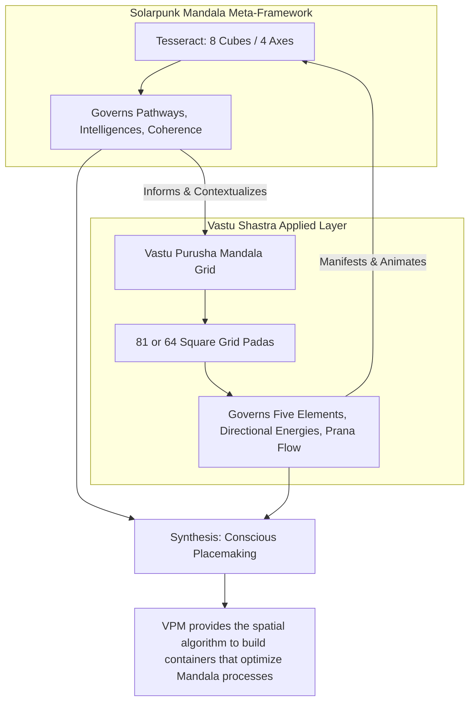
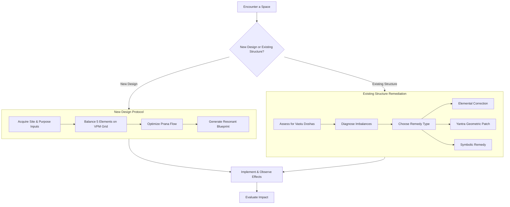

---
aeo_metadata:
  title: "Appendix I: Vastu Shastra as Applied Ontology"
  description: "A practical guide to integrating Vastu Shastra, the ancient science of architecture, as a living ontological system for conscious placemaking within the Solarpunk Mandala. Provides protocols to design and heal spaces for optimal energy flow, coherence, and symbiotic living."
  context: "Applied ontology and environmental design appendix. Bridges the geometric and energetic principles of Vastu Shastra with the Mandala's framework, offering concrete tools for creating built environments that actively support regeneration and conscious evolution."
  key_objectives:
    - "Reframe Vastu Shastra from superstition to an applied ontology of space and energy."
    - "Map Vastu's core principles (Five Elements, Vastu Purusha Mandala, directional energies) to Mandala geometry and pathways."
    - "Provide a diagnostic protocol for identifying 'Vastu Doshas' (energetic flaws) and their correlation with Mandala contraction patterns."
    - "Establish intervention protocols for both new design ('Vastu Compiler') and remediation of existing structures."
    - "Demonstrate Vastu's role as the material praxis for creating Symbiotic Commonwealth environments."
  core_concepts:
    - "Vastu Shastra as Applied Ontology"
    - "Pancha Bhoota (Five Elements) & Directional Governance"
    - "Vastu Purusha Mandala (VPM) as Geometric Blueprint"
    - "Vastu Dosha (Energetic Flaw) Diagnosis"
    - "Prana (Life Force) Optimization"
    - "Geometric Patching & Elemental Remediation"
  ontological_foundation: "Vedic Cosmology & Conscious Systems Theory"
  epistemic_stance: "Phenomenological-Geometric Praxis"
  search_queries:
    - "Vastu Shastra solarpunk application"
    - "sacred geometry architecture design"
    - "energetic space planning"
    - "Pancha Bhoota five elements design"
    - "Vastu Purusha Mandala explained"
  related_nodes:
    - "appendices/B-ritual-cube-dissolving-technology.md"
    - "appendices/C-alpha-coefficient-diagnostic-protocols.md"
    - "appendices/D-tesseract-geometry-guide.md"
    - "appendices/E-rhizomatic-protocol-integration.md"
  framework_status: "Stable Protocol"
  version: "1.0"
  last_reviewed: "2026-01-12"
---
# Appendix I: Vastu Shastra as Applied Ontology—A Guide to Conscious Placemaking

## 🧭 Executive Overview: The Geometry of Resonance

This document provides the framework for integrating **Vastu Shastra**, the ancient Indian science of architecture and space, as an **applied ontological praxis** within the Solarpunk Mandala. It moves beyond viewing Vastu as a set of superstitious rules, reframing it as a sophisticated system for aligning the geometry of human habitats with cosmic and terrestrial energies to foster well-being, clarity, and coherence[citation:1][citation:6].

Think of this as the **operational manual for conscious placemaking**. It provides the principles and protocols to design and diagnose built environments (homes, communities, sacred spaces) so they act as amplifiers of life force (*Prana*) and coherence, rather than sources of dissonance and stress. This is the material counterpart to the Tesseract's abstract geometry.

**Reading Context:**
*   **Purpose:** A practical guide for applying Vastu Shastra's ontological principles to design, assess, and heal physical spaces in alignment with Mandala objectives.
*   **Prerequisites:** Familiarity with the Mandala's core concepts (Tesseract, Axes, Embodied Foundations) and a basic openness to geomancy and sacred geometry.
*   **Time Investment:** 15-20 minutes for core theory; use the mapping and protocols as a reference during design or assessment.

## 1. Ontological Synthesis: Vastu Through a Mandala Lens

Vastu Shastra is fundamentally an **ontology of relationship**. It posits that the universe is a single, ordered medium composed of interwoven energies and consciousness[citation:2]. A building or site is not an inert object but a **unique ordered environment** within this whole, a living system exchanging energy, matter, and information[citation:2].

The Mandala provides the perfect meta-framework to understand and apply this:

| Vastu Shastra Concept | Ontological Meaning | Mandala Synthesis & Expression |
| :--- | :--- | :--- |
| **Pancha Bhoota (Five Elements)**[citation:1] | The fundamental constituents of reality: Earth, Water, Fire, Air, Space. | The **material and energetic substrates** shaped by the Tesseract's geometry. Balance is sought across the four axes. |
| **Vastu Purusha Mandala (VPM)**[citation:7] | The metaphysical blueprint; a grid mapping cosmic energies and deities onto a site. | The **applied geometric layer** of the Mandala. It is the "compiler" that translates intention and location into optimal spatial form[citation:3]. |
| **Directional Deities & Energies**[citation:1][citation:7] | Cardinal directions are associated with specific cosmic forces (e.g., East-Sun/Growth, North-Wealth). | These forces correspond to different **Mandala Pathways and Intelligences**. Aligning spaces to directions leverages these energies for specific outcomes. |
| **Prana (Life Force)** | The vital energy that animates all things; the goal is to optimize its flow. | Analogous to **coherence (α-Coefficient)** and smooth **Dialectical Conductance**. A Vastu-aligned space enhances collective coherence. |
| **Brahmasthana (Central Space)**[citation:7] | The energetic heart of a site, often left open. | Represents the **integrated core (4D Spire)** of the system. It is the silent, potent center from which all activity emanates. |

**Core Thesis:** Vastu Shastra operationalizes the Mandala's consciousness-first geometry in the material realm. It provides the algorithms to build containers that support the unfolding of conscious evolution[citation:3].

## 2. Core Principles: The Energetic Logic of Space

### 2.1 The Five Elements (Pancha Bhoota) & Their Governance
Every space is a dynamic balance of the five elements. Vastu prescribes their optimal placement and relationship[citation:1][citation:9].

| Element | Governing Direction | Qualities & Associations | Mandala Correlation | Ideal Spatial Function |
| :--- | :--- | :--- | :--- | :--- |
| **Earth (Prithvi)** | Southwest | Stability, support, grounding, inertia. | **Foundation: Restoration & Nourishment;** Praxeological Axis. | Master bedroom, heavy furniture, storage. Provides grounding. |
| **Water (Jala)** | Northeast | Flow, purity, intuition, cooling. | **Foundation: Cleansing;** Soteriological Axis (spirituality). | Water sources, wells, meditation/prayer rooms. Enhances clarity and calm. |
| **Fire (Agni)** | Southeast | Energy, transformation, digestion, passion. | **Path of Making;** Epistemic Axis (conversion of knowledge). | Kitchen, furnace, electrical panels. Channels productive energy. |
| **Air (Vayu)** | Northwest | Movement, communication, connection, change. | **Path of Liberation;** Social & political domains. | Guest rooms, ventilation, doors for movement. Facilitates exchange and new ideas. |
| **Space (Akasha)** | Center (Brahmasthana) | Expansion, potential, consciousness, unity. | **4D Integration (Spire);** The central void/unified field. | Central courtyard, open space, skylight. Connects to the cosmos and allows energy to integrate. |

### 2.2 The Vastu Purusha Mandala: The Operating System
The VPM is a square grid (commonly 8x8 or 9x9) superimposed on any site or building plan[citation:7]. It is the **computational core** for Vastu design[citation:3].
*   **The Grid (Pada Vinyasa):** The site is divided into modules (*padas*). Each *pada* is governed by a specific deity/energy force[citation:7].
*   **The Legend:** The grid corresponds to the body of **Vastu Purusha**, a cosmic being pinned to the ground by gods. The position of each god on his body determines the function of that zone (e.g., head in NE for wisdom, legs in SW for stability)[citation:7].
*   **Application:** Room functions are assigned based on the inherent energy of their grid sector. This creates a **cosmologically resonant layout**.

## 3. Diagnostic Protocol: Assessing Energetic Integrity (Vastu Dosha)

A *Dosha* is a flaw or misalignment that disrupts energy flow, believed to manifest as problems in health, relationships, or prosperity[citation:1]. This protocol adapts that diagnosis for Mandala practitioners.

### 3.1 The Diagnostic Matrix: From Spatial Flaw to Systemic Symptom
| Common Vastu Dosha[citation:1] | Energetic Disruption | Likely Mandala Symptom (Contraction Pattern) | Potential Community-Level Manifestation |
| :--- | :--- | :--- | :--- |
| **Toilet/Bathroom in Northeast** | Pollutes the pure Water element zone; blocks spiritual energy. | **Soteriological Contraction:** Loss of meaning, spiritual confusion, lack of clarity. | Community lacks vision or shared purpose; ethical compass is weak. |
| **Kitchen in North** | Fire element disrupts the wealth-governed (Kubera) North zone. | **Ethical Contraction (Extractive):** Financial anxiety, resource hoarding, instability. | Economic struggles, inequality, lack of trust in resource circulation. |
| **Main Entrance in South** | Opposes the gentle, life-giving energy of the North and East. | **Praxeological Contraction:** Action feels heavy, blocked, or leads to conflict. | Community projects stall; meetings are antagonistic; movement is sluggish. |
| **Staircase in Center** | Pierces the Brahmasthana, destabilizing the entire system's core. | **Systemic Fragmentation:** Lack of center; incoherence across all axes. | High α-Coefficient volatility; factions form; no unifying center holds. |
| **Heavy Structure in Northeast** | Crushes the light, expansive energy of this zone. | **Epistemic Contraction:** Learning is blocked; new ideas can't enter. | Intellectual stagnation; dogma sets in; community fails to adapt. |
| **Clutter/Cesspool in Northwest** | Blocks the Air element, halting communication and movement. | **Social Contraction:** Relationships stagnate; gossip and isolation increase. | Poor information flow; breakdown in dialogue; guests/outsiders are not integrated. |

### 3.2 Assessment Process
1.  **Map the Site:** Obtain or draw a scaled plan. Precisely orient it to true North[citation:5].
2.  **Superimpose the VPM Grid:** Overlay the appropriate grid (e.g., 8x8 for residential) on the plan[citation:7].
3.  **Analyze Function vs. Zone:** For each major room/feature, check its actual function against its ideal zone per the VPM and Five Elements table.
4.  **Identify Doshas:** Note significant misalignments, especially in key areas (NE, center, main entrance).
5.  **Cross-Reference with Community State:** Use the diagnostic matrix to see if identified *Doshas* correlate with known community challenges (e.g., using **Appendix A: Contraction Tables**).

## 4. Intervention Protocol: Design & Remediation

### 4.1 For New Design: The Vastu Compiler Protocol[citation:3]
Follow this sequence to generate a coherent design:
1.  **Input Acquisition:**
    *   **Location Vector:** Analyze sun path, wind patterns, soil, and geomagnetic orientation of the land[citation:6].
    *   **Purpose Vector:** Define the primary function (Home, Healing Center, Council Hall).
    *   **Occupant Profile:** Consider the collective or primary user's needs (aligned with Embodied Foundations assessment).
2.  **Pancha Bhoota Balancing:** Using the site plan and VPM grid, algorithmically assign functions to zones to achieve elemental harmony[citation:3].
    *   E.g., Place kitchen in SE (Fire), meditation in NE (Water), main entrance in N/E/NE, leave center open.
3.  **Prana Flow Optimization:** Ensure the layout allows for free, meandering movement of energy. Avoid sharp lines cutting through central space, ensure light and air penetrate deeply.
4.  **Output – Resonant Blueprint:** The result is a geometric plan that is not just functionally efficient but ontologically supportive, a **mandala in built form**.

### 4.2 For Existing Structures: Remediation & "Geometric Patching"
Not all flaws can be rebuilt. Remediation uses symbolic and subtle interventions.
*   **Yantras:** Place specific geometric diagrams (Yantras) in compromised zones to act as "energy patches," recalibrating the vibrational field[citation:3].
*   **Elemental Corrections:** Use the Five Elements to counter imbalances.
    *   *Dosha:* Toilet in NE (excess Earth/Water pollution).
    *   *Remedy:* Introduce a strong Fire element symbol (e.g., a bright lamp, triangle-shaped red art) and a Space element (e.g., a small crystal) to "digest" the stagnation and re-expand the zone.
*   **Color, Sound, & Flora:** Use directed color therapy, mantras/bells, and specific plants (e.g., Tulsi for purity) to shift the energy of a room[citation:3].

## 5. Integration with the Solarpunk Mandala Ecosystem

*   **With Embodied Foundations (Protocol 0):** Vastu is the **spatial manifestor** of the foundations. A Nourishment-deficient community needs a properly placed, vibrant kitchen (SE). A Cleansing-deficient group needs well-placed water elements and bathrooms.
*   **With α-Coefficient (Appendix C):** A community's coherence score can be a key metric to assess *before* and *after* a Vastu correction in a shared space.
*   **With Ritual Technology (Appendix B):** Rituals are enacted within space. A Vastu-aligned **Hexagonal Council** space will dramatically increase the ritual's potency by providing a resonant container.
*   **With Meta-Narrative (Appendix F):** Applying Vastu is a direct praxis of the **Symbiotic Commonwealth**, building structures that honor natural law and cosmic order versus the **Necrocene's** dissociative, exploitative architecture.

## 6. Conclusion: Building the Symbiocene, One Resonant Space at a Time

Vastu Shastra, as applied ontology, provides the **missing link** between the Mandala's visionary geometry and the tangible, felt experience of living in a regenerative culture. It teaches that we do not build on dead land, but within a living field of consciousness and energy[citation:2]. By learning its language of directions, elements, and geometric resonance, we become conscious co-creators of environments that actively support healing, awakening, and unified flourishing.

This is not about rigid dogma, but about cultivating **relational wisdom** with space. It is a core discipline for any community seriously weaving the Solarpunk dream into the fabric of reality.
