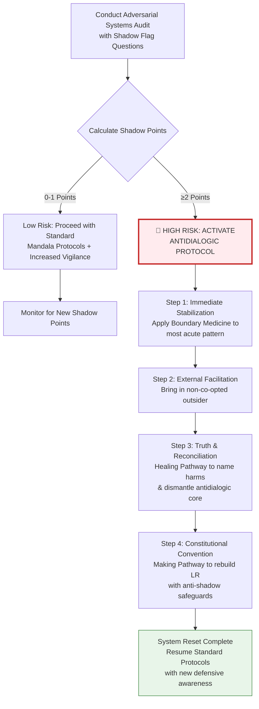

---
aeo_metadata:
  title: "Appendix J: The Adversarial Systems Lens—A Field Manual"
  description: "A critical diagnostic and intervention manual for identifying and healing 'shadow operations'—adversarial, coercive, or self-sabotaging patterns—within systems using the Solarpunk Mandala. Provides protocols to detect geometric distortions and prevent co-option of regenerative work."
  context: "Advanced critical-praxis appendix. Serves as the immune system for the Mandala framework, enabling practitioners to audit systems for pathological dynamics and apply corrective protocols before total collapse (Asuri-Antidialogic Complex)."
  key_objectives:
    - "Define four core 'shadow patterns' as specific geometric distortions (decoupling, hyper-activation, parasitic coupling) within the Tesseract."
    - "Provide a clear audit protocol with 'Shadow Flag Questions' and a scoring system to trigger interventions."
    - "Establish the 'Antidialogic Protocol' for high-risk situations where standard pathway work is contraindicated."
    - "Describe the total systemic pathology of the 'Asuri-Antidialogic Complex' and its required reset procedure."
    - "Ground the lens in cybernetic and ethical principles without creating moral dualism."
  core_concepts:
    - "Shadow Operations (Antidialogic/Asuri Patterns)"
    - "Geometric Distortion (Decoupling, Hyper-Activation, Parasitic Coupling)"
    - "Adversarial Systems Audit & Shadow Points"
    - "Antidialogic Protocol"
    - "Asuri-Antidialogic Complex"
  ontological_foundation: "Unitary Consciousness (No 'Shadow Cube') & Cybernetic Pathology"
  epistemic_stance: "Critical-Diagnostic Vigilance"
  search_queries:
    - "detecting coercion in regenerative communities"
    - "systems pathology diagnosis"
    - "preventing co-option of social movements"
    - "antidialogic action Freire"
    - "Solarpunk Mandala security"
  related_nodes:
    - "framework/core-model/03-ethics-four-axes.md"
    - "appendices/A-four-axis-contraction-tables.md"
    - "framework/core-model/00-meta-framework-systems-cybernetics.md"
    - "appendices/E-rhizomatic-protocol-integration.md"
  framework_status: "Critical Protocol"
  version: "1.2"
  last_reviewed: "2026-01-12"
---
# Appendix J: The Adversarial Systems Lens—A Field Manual for Shadow & Light

## 🧭 Executive Overview: Diagnosing Systemic Pathology

This document provides the critical **diagnostic and intervention framework** for identifying and healing adversarial, oppressive, or self-sabotaging dynamics—collectively termed **"Shadow Operations"**—within systems (individual, community, institutional) engaged with the Solarpunk Mandala. It addresses a fundamental challenge: How do we recognize when the very tools and geometries designed for liberation are being used, intentionally or not, to perpetuate extraction, control, and dissociation?

Think of this as the **immune system protocol** for the Mandala. It does not add new components but provides the lenses and tests to detect when the Tesseract's natural proportions and connections are distorted into pathological patterns. Its purpose is to protect the integrity of regenerative work from being co-opted by the very logic it seeks to transform.

**Reading Context:**
*   **Purpose:** A critical-praxis manual for auditing systems, detecting adversarial patterns ("shadow operations"), and applying targeted interventions to restore geometric integrity.
*   **Prerequisites:** Firm understanding of the Tesseract's 8 cubes, the Four Axes, and the core ethical framework. This is an advanced diagnostic tool.
*   **Time Investment:** 12-15 minutes for the core framework; use the shadow pattern mappings and protocols as reference during audits.

## 1. Core Principle: Shadow as Geometric Distortion

The foundational premise is that **"Shadow" is not a separate thing but a distortion of "Light."** There is no 9th "Shadow Cube." Instead, adversarial dynamics manifest as specific, predictable pathologies *within* the existing 8-cube geometry of the Tesseract:
*   **Decoupling:** Critical connections between cubes are severed (e.g., material action without relational care).
*   **Hyper-Activation:** One cube dominates, draining energy and agency from others (e.g., institutional capture).
*   **Parasitic Coupling:** Two cubes form a selfish alliance that exploits the wider system (e.g., efficiency extraction without ethics).

These distortions violate the ethical axes and represent what Paulo Freire called **"antidialogic"** action and what the Bhagavad Gita terms **"asuri"** (demonic) nature—actions that breed separation, control, and deceit, in contrast to dialogic, "daivi" (divine) actions that foster unity and truth.

## 2. The Four Primary Shadow Patterns: Detection & Response

Each shadow pattern is a systemic "disease" with a specific signature, detectable through metrics and observable behaviors.

### 2.1 Shadow Pattern 1: Extractive Hyper-Differentiation
*   **Core Pathology:** The coupling of **Material/Systemic cubes (UR ↔ LR) without the Relational cube (LL)**. Systems are optimized for efficiency and output while actively severing the intersubjective bonds that make work meaningful. People become "human resources."
*   **Mandala Manifestation:** High scores on Axiological (Care) extraction metrics; low Relational Depth complexity (purely transactional ties).
*   **Bhagavad Gita Parallel:** *Asuri* nature that views beings as mere instruments for gratification (16.11).
*   **Detection Protocol:**
    *   **Audit Question:** "Are decisions about resources (UR) and rules (LR) made without the consent and deep consultation of those affected (LL)?"
    *   **Metric Flag:** Axiological axis shows high extraction, low regeneration. Φ (coherence) signature shows LR_UR connection >> LL connection.
*   **Intervention Pathway:** **Primary: Liberation** (dismantle extractive structures). **Secondary: Making** (build regenerative alternatives). **Target:** Forcibly re-couple LL into UR-LR decisions via mandatory dialogue councils.

### 2.2 Shadow Pattern 2: Spiritual Bypass
*   **Core Pathology:** **Hyper-activation of the Subjective cube (UL) while neglecting the Material cube (UR)**. Individual or collective uses spiritual insight, ideology, or inner work to dissociate from unmet material needs, poverty, or somatic trauma.
*   **Mandala Manifestation:** High Soteriological (self) coherence scores, but Embodied Foundation of **Nourishment < 2**. Justifying suffering as "karma" or "illusion."
*   **Freire Parallel:** "False generosity"—offering spiritual comfort as a substitute for tangible justice.
*   **Detection Protocol:**
    *   **Audit Question:** "Do our high-minded ideals or spiritual practices allow us to tolerate unmet basic needs (food, shelter, safety) for ourselves or others?"
    *   **Metric Flag:** Any UL-focused practice while UR foundations are sub-threshold is a critical violation.
*   **Intervention Pathway:** **Primary: Making** (rebuild UR capacity). **Secondary: Awakening** (reintegrate genuine consciousness with embodiment). **Target:** Halt abstract UL work; mandate focus on UR Boundary Medicine until foundations are secure.

### 2.3 Shadow Pattern 3: False Community
*   **Core Pathology:** **Hyper-activation of the Relational cube (LL) while avoiding Systemic accountability (LR)**. The group enforces a rigid, insular "we-ness" that polices internal conformity while ignoring its external impact, ethics, or governance. Manifests as cult dynamics, toxic localism, or "cancel culture."
*   **Mandala Manifestation:** High Relational Depth connection scores, but extreme fragility when confronted with dissent or external accountability.
*   **Bhagavad Gita Parallel:** "Hypocrisy, arrogance, self-conceit" (16.4) masquerading as unity.
*   **Detection Protocol:**
    *   **Audit Question:** "Does our sense of 'us' depend on having a 'them'? Do we have processes to healthfully engage with outside criticism or systemic rules?"
    *   **Metric Flag:** High in-group coherence, near-zero coherence with out-groups or broader systemic principles.
*   **Intervention Pathway:** **Primary: Awakening** (critical consciousness). **Secondary: Healing** (temporal repair). **Target:** Mandate engagement with external LR systems (courts, audits); institute rotating "devil's advocate" roles.

### 2.4 Shadow Pattern 4: Institutional Capture
*   **Core Pathology:** **The Systemic cube (LR) becomes parasitic**, hijacking the functions of other cubes for its own self-preservation and growth. Institutions surveil thought (UL), militarize resources (UR), and co-opt culture (LL). The ultimate cancer of the system.
*   **Mandala Manifestation:** Rigidity on the Soteriological axis; historical amnesia and shortsightedness on the Temporal axis. The institution's identity becomes totalizing.
*   **Freire Parallel:** The "banking model" of education—the institution deposits reality into passive subjects.
*   **Detection Protocol:**
    *   **Audit Question:** "Do our structures (LR) exist to serve life, or does life seem to exist to serve and feed the structures?"
    *   **Metric Flag:** Φ (coherence) of LR dominates the sum of all other cubes—a clear parasitic drain.
*   **Intervention Pathway:** **Primary: Liberation** (dismantle the antidialogic core). **Secondary: Healing** (repair historical and future timelines). **Target:** Strategic disconnection (strike, boycott) to sever parasitic links; constitutional redesign.

```mermaid
graph TD
    subgraph Tesseract["Tesseract Cubes & Healthy Connections"]
        UR[Material<br/>UR]
        UL[Subjective<br/>UL]
        LL[Relational<br/>LL]
        LR[Systemic<br/>LR]
        UR <-.->|Healthy Flow| LR
        UR <-.->|Healthy Flow| LL
        UL <-.->|Healthy Flow| LL
        LL <-.->|Healthy Flow| LR
        UL <-.->|Healthy Flow| UR
    end

    subgraph Pattern1["Pattern 1: Extractive Hyper-Differentiation"]
        P1UR[Material UR] <-.->|Parasitic Coupling| P1LR[Systemic LR]
        P1LL[Relational LL]
        P1UR -.->|Severed Connection| P1LL
        P1LR -.->|Severed Connection| P1LL
        style P1UR stroke:#f57c00,stroke-width:4px
        style P1LR stroke:#f57c00,stroke-width:4px
        style P1LL stroke:#ccc,stroke-width:2px
    end

    subgraph Pattern2["Pattern 2: Spiritual Bypass"]
        P2UL[Subjective UL]
        P2UR[Material UR]
        style P2UL stroke:#7b1fa2,stroke-width:8px
        style P2UR stroke:#ccc,stroke-width:2px
    end

    subgraph Pattern4["Pattern 4: Institutional Capture"]
        P4LR[Systemic LR]
        P4UR[Material UR]
        P4UL[Subjective UL]
        P4LL[Relational LL]
        P4LR -.->|Parasitic Drain| P4UR
        P4LR -.->|Parasitic Drain| P4UL
        P4LR -.->|Parasitic Drain| P4LL
        style P4LR stroke:#c62828,stroke-width:8px
    end

    style Tesseract fill:#e8f5e9,stroke:#2e7d32
    style Pattern1 fill:#fff3e0
    style Pattern2 fill:#f3e5f5
    style Pattern4 fill:#ffebee
```

## 3. Systemic Diagnosis: The Asuri-Antidialogic Complex

When multiple shadow patterns co-occur and reinforce each other, the system enters a **totalized pathological state**: the **Asuri-Antidialogic Complex**. This is not mere imbalance but a full inversion of the Tesseract's light operation.

**Diagnosis Rule:** If ≥ 4 cubes show persistent shadow operation simultaneously, the system is in Complex. This state predicts systemic collapse within 12-18 months if not radically addressed.

| Cube | Light (Daivi/Dialogic) Operation | Shadow (Asuri/Antidialogic) Operation in Complex |
| :--- | :--- | :--- |
| **ॐ / MAL** | Consciousness dissociates compassionately to experience itself. | Consciousness dissociates traumatically; separation is enforced and violent. |
| **UR (Material)** | Biological needs are met regeneratively. | Biology is weaponized (e.g., food/water control, biopower). |
| **UL (Subjective)** | Inner experience is explored ethically and integrated. | Inner life is surveilled, manipulated, or colonized (propaganda, psyops). |
| **LL (Relational)** | Shared culture emerges freely through dialogue. | Culture is enforced via coercion (nationalism, cult dogma, fear of exile). |
| **LR (Systemic)** | Institutions are tools for collective flourishing. | Institutions act as cancerous growths, preserving themselves at all cost. |
| **Cube 5 (Dissociation)** | Boundary is permeable, a site for healing. | Boundary is rigid, militarized ("us vs. them"). |
| **Cube 6 (Gateway)** | Enables fluid movement from "I" to "We". | Becomes one-way: "The We" erases "The I" (collectivist tyranny). |
| **Cube 8 (Meta-Perspective)** | Holds all cubes lightly for wise oversight. | Becomes totalizing ideology, justifying all other distortions. |

**Intervention for Complex:** Requires a **total Tesseract reset**, not piecemeal reform. Must follow the full Antidialogic Protocol (Section 5.2).

## 4. Practitioner Protocols: From Audit to Action

### 4.1 The Adversarial Systems Audit
Augment the standard Embodied Foundations Audit with these **Shadow Flag Questions**:
*   **Nourishment (UR):** "Is access to food, water, or shelter used as a reward, punishment, or tool of control?"
*   **Movement (LL/LR):** "Are people free to leave, dissent, or criticize without fear of shunning or reprisal?"
*   **Restoration (UL):** "Is rest, introspection, or healing stigmatized as laziness or avoidance of 'real work'?"
*   **Cleansing (Systemic):** "Are systemic failures (pollution, waste) blamed solely on individuals, absolving the structure?"

**Scoring:** Each "Yes" = **+1 Shadow Point**.
*   **0-1 Points:** Monitor; integrate shadow awareness into ongoing work.
*   **≥2 Points:** **Activate Antidialogic Protocol Immediately.** Standard pathway work is contraindicated.

### 4.2 The Antidialogic Protocol
**DO NOT** proceed with standard Awakening/Making/Liberation/Healing work if Shadow Points ≥ 2. The system cannot healthily process it.
1.  **Immediate Stabilization:** Apply **Boundary Medicine** *only* to the most acute shadow pattern (e.g., if Nourishment is weaponized, focus there).
2.  **External Facilitation:** Mandate involvement of a trusted, **non-co-opted outsider** to lead the next steps. Internal perspective is compromised.
3.  **Truth & Reconciliation (Healing Pathway Focus):** Before rebuilding, must name and mourn the antidialogic actions and structures. This is deep, painful work.
4.  **Constitutional Convention (Making Pathway Focus):** Design new **LR (systemic)** rules and structures with explicit safeguards against the identified shadow patterns.

## 5. Philosophical Grounding & Falsification

*   **Why No "Shadow Cube"?** Adding a 9th cube would violate the Mandala's geometric (4D hypercube has 8 cells) and ontological (consciousness is unitary) foundations. It would externalize shadow as "other," fostering moral dualism and evading responsibility. Shadow is our own geometry malfunctioning.
*   **Integration:** This lens directly applies **Node 00 (Cybernetics)** - shadow is a runaway positive feedback loop. It operationalizes **Node 03 (Ethics)** - each pattern is an axis distortion. It is the critical tool for **Appendix A (Contraction Tables)** - providing the "how" behind systemic collapse.
*   **Falsification Conditions:**
    1.  If a diagnosis of **Asuri-Antidialogic Complex** (≥4 shadow cubes) does not predict observable system collapse or extreme dysfunction within 12-18 months, the diagnostic criteria are flawed.
    2.  If the **Antidialogic Protocol** does not restore system coherence (Φ balance) more effectively than continuing standard pathway work in high-shadow contexts, the interventions are ineffective.

## 6. Conclusion: The Immune Function

This lens is not pessimistic but **vigilant**. It grants practitioners the discernment to tell the difference between the growing pains of a transforming system and the death throes of a captured one. By learning to diagnose shadow operations, we move from naive idealism to robust, defensible praxis. We build not just with beauty, but with wisdom—the wisdom to protect the light by understanding the shapes of shadow.

---
**Use this lens sparingly but courageously. Its purpose is healing, not accusation. Document audits and interventions in the Living Archive to strengthen collective immunity.**
