# Appendix L: Synthesis of Analytic Idealism and Indic Philosophy

## 🔄 Executive Summary: An Integrated Consciousness Framework

This appendix presents a synthesized model of consciousness that bridges Western analytic philosophy with Eastern contemplative traditions. The integration reveals that **Analytic Idealism provides the metaphysical architecture, while Indic philosophical systems—particularly as exemplified in the Trika Shaiva tradition—offer detailed phenomenological maps and practical technologies**. It is important to note that while this specific synthesis draws heavily from the non-dual Shaiva Tantra perspective, core principles can theoretically be mapped to other major darshanas (philosophical views) such as Vedanta, Yoga, Buddhism, and Jainism, each offering unique but compatible insights into the architecture of consciousness. Together, they create a robust, actionable framework for understanding and navigating consciousness-first reality.

### 📊 Unified Conceptual Framework

```mermaid
graph TD
    A[Ultimate Reality] --> B[Consciousness as Fundamental Field<br/>Western: Mind-at-Large<br/>Eastern: Shabda/Nada Brahman]
    
    B --> C{Manifestation Mechanism}
    
    C --> D[Western Framework:<br/>Dissociation → Perceptual Interface]
    C --> E[Eastern Framework:<br/>Sound Gradation → Material World]
    
    D --> F[Individual Consciousness]
    E --> F
    
    F --> G[Path to Integration]
    
    G --> H[Western Methods:<br/>Boundary Medicine & Interface Regulation]
    G --> I[Eastern Methods:<br/>Sound Yoga & Contemplative Practice]
    
    H --> J[Healthy State: Flexible Boundaries<br/>Coherent Vibrations<br/>Integrated Awareness]
    I --> J
    
    J --> K[Practical Application:<br/>Conscious System Design]
```



## 1. Ontological Foundations: Consciousness as Fundamental Reality

### The Integrated Model

Contemporary consciousness studies reveal a convergence between Western analytic philosophy and Eastern contemplative traditions regarding the fundamental nature of reality. This synthesis proposes that:

**Consciousness is the primary substrate of existence**, characterized by intrinsic vibratory qualities. This vibratory nature manifests as structured patterns that give rise to the experienced world.

#### Terminology Synthesis

| Western Analytic Framework | Eastern Contemplative Framework | Unified Definition |
| :--- | :--- | :--- |
| **Mind-at-Large (MAL)** | **Shabda Brahman / Nada Brahman** | The fundamental conscious field with inherent vibratory nature |
| **Conscious Experience** | **Chitta Vritti** | Modulations and patterns within the conscious field |
| **Perceptual Interface** | **Vaikhari Vak** | The manifested level of reality perception |
| **Individuation Boundary** | **Ahamkara / Maya** | The principle of apparent separation from the whole |
| **Interface Modulation** | **Shabda Yoga / Sadhana** | Conscious alteration of perceptual filters |

## 2. Manifestation Mechanisms: How Consciousness Appears as World

### The Gradation Model of Manifestation

Both traditions describe a structured process through which undifferentiated consciousness becomes the experienced world:

```python
def consciousness_manifestation_model():
    """
    How unified consciousness appears as differentiated reality
    """
    
    levels = {
        'transcendent': {
            'description': 'Undifferentiated, unified consciousness',
            'western_term': 'Pure MAL state',
            'eastern_term': 'Para Vak / Shabda Brahman',
            'characteristics': 'Non-dual awareness, potentiality'
        },
        'conceptual': {
            'description': 'Pre-perceptual ideational forms',
            'western_term': 'Pre-interface conceptual space',
            'eastern_term': 'Pashyanti Vak',
            'characteristics': 'Intuitive knowing, visionary forms'
        },
        'mental': {
            'description': 'Internal articulation and thought',
            'western_term': 'Internal perceptual interface',
            'eastern_term': 'Madhyama Vak',
            'characteristics': 'Thinking, imagination, internal dialogue'
        },
        'manifested': {
            'description': 'Expressed, sensory reality',
            'western_term': 'External perceptual interface',
            'eastern_term': 'Vaikhari Vak',
            'characteristics': 'Sensory perception, physical reality'
        }
    }
    
    # Reality "descends" through these levels in manifestation
    # Consciousness practices "ascend" through purification
    
    return levels
```

## 3. The Spectrum of Conscious Boundaries

### Understanding Individuality

Both frameworks acknowledge individual consciousness while recognizing its fundamental unity with the whole. The apparent separation is maintained through what Western frameworks call **dissociation boundaries** and Eastern traditions term **ahamkara (ego principle)**.

### Healthy vs. Unhealthy Boundaries

**Healthy conscious boundaries** exhibit flexibility, permeability, and intentional modulation. They allow for:

- Individual agency and focused action

- Deep connection and empathic resonance

- Context-appropriate adjustments

- Growth and learning through experience

**Unhealthy boundaries** manifest as either:

- **Excessive rigidity**: Isolation, inability to connect, fixed perspectives

- **Excessive permeability**: Loss of self, overwhelm, enmeshment

- **Inflexibility**: Inability to adjust to context

### The Boundary Spectrum

```markdown
Optimal Functioning ←─ Flexible Boundaries ─→ Contextual Adaptation
      (Agency + Connection)         (Focus + Openness)
            ↑                              ↑
    Individual Expression           Relational Attunement
```

## 4. Vibration and Sound: The Interface Language

### The Primacy of Vibration

Multiple traditions converge on the understanding that **vibration is the fundamental medium** through which consciousness communicates with itself across apparent boundaries.

### Levels of Sound/Vibration

```markdown
Three Primary Levels:
1. **Expressed Sound (Ahata)**
   - External vibrations, sensory perception
   - Corresponds to: Beta/Gamma brain states, focused attention
   
2. **Internal Sound (Anahata)**
   - Subtle vibrations, interoceptive awareness
   - Corresponds to: Alpha/Theta states, internal awareness
   
3. **Fundamental Vibration (Shabda Brahman)**
   - The vibratory nature of consciousness itself
   - Corresponds to: Deep Delta/transcendent states
```

### Scientific Correlates

Emerging research in neuroscience and physics supports this vibrational model:

- Neural oscillations correlate with states of consciousness

- Quantum coherence suggests fundamental vibratory properties

- Cymatics demonstrates how vibration organizes matter

- Binaural beats can entrain brain states through auditory vibration

## 5. Consciousness Technologies: Practical Integration

### Integrated Practice Framework

This synthesis suggests that different practices serve different aspects of consciousness work:

```python
class ConsciousnessPracticeSelector:
    """
    Matches practices to individual patterns and needs
    """
    
    def recommend_practices(self, boundary_pattern):
        """
        Suggests practices based on boundary characteristics
        """
        
        practice_maps = {
            'overly_rigid': [
                'sound_based_emotional_opening',
                'devotional_practices_with_surrender',
                'community_resonance_activities'
            ],
            'overly_porous': [
                'focused_attention_exercises',
                'precise_ritual_or_technical_practice',
                'grounding_embodiment_work'
            ],
            'seeking_integration': [
                'inner_sound_awareness',
                'combined_visualization_mantra',
                'artistic_expression_as_sadhana'
            ],
            'maintenance': [
                'daily_rhythmic_practice',
                'nature_immersion',
                'contemplative_inquiry'
            ]
        }
        
        return practice_maps.get(boundary_pattern, ['basic_awareness_training'])
```

### Traditional Systems as Advanced Interface Protocols

Eastern contemplative systems provide sophisticated maps for consciousness navigation:

- Mantra systems: Sound formulas for specific consciousness effects

- Yantra visualization: Geometric patterns corresponding to consciousness states

- Mandala architecture: Spatial representations of consciousness structures

- Raga systems: Musical modes for time- and context-specific effects

## 6. Art and Devotion as Consciousness Technologies

### Artistic Practice as Boundary Work

Artistic traditions worldwide have developed sophisticated methods for navigating consciousness states:

**The Artist's Practice** involves:

1. Technical mastery (strengthening individual agency)

2. Surrender to inspiration/flow (transcending individual boundaries)

3. Creating resonant fields (affecting others' consciousness)

4. Cultural transmission (embedding consciousness patterns)

### Devotional Systems and Emotional Intelligence

Devotional practices represent advanced emotional resonance technologies that:

1. Bypass intellectual defenses through heart-centered engagement

2. Create direct resonance with transcendent qualities

3. Transform the emotional body into a clearer consciousness interface

4. Facilitate temporary boundary dissolution in controlled ways

### The Bhakti Mechanism

```markdown
Emotional Devotion Process:
1. Focus on transcendent qualities (love, beauty, truth)
2. Engage emotional resonance through ritual or practice
3. Emotional coherence facilitates boundary modulation
4. Temporary experience of unity consciousness
5. Integration of that unity into daily awareness
```

## 7. Applications for Individual and Collective Well-being

### Personal Development Framework

```markdown
Four Pillars of Conscious Development:
1. **Awareness Training**: Recognizing boundary states
2. **Modulation Skills**: Learning to adjust boundaries intentionally
3. **Integration Practices**: Harmonizing individual and universal aspects
4. **Expression Channels**: Creatively manifesting insights
```

### Community Design Principles

Regenerative communities can be designed using consciousness principles:

**Sound Ecology**: Intentional soundscapes that support healthy consciousness states
**Ritual Infrastructure:** Spaces and times for collective boundary work
**Art Integration**: Making all art forms conscious practice opportunities
**Intergenerational Transmission**: Blending traditional wisdom with contemporary understanding

#### Example: Regenerative Community Center

```markdown
A consciousness-informed community space includes:
- Architectural design based on consciousness maps (mandala principles)
- Acoustically tuned spaces for specific practices
- Daily collective rhythms (meditation, chanting, artistic practice)
- Individual practice spaces with appropriate support
- Educational programs integrating traditional and modern understanding
- Connection to natural rhythms and cycles
```

## 8. Research and Future Directions

### Integrative Research Methodology

Future consciousness research benefits from combining:

1. First-person phenomenology (contemplative practice traditions)

2. Third-person neuroscience (scientific measurement and analysis)

3. Second-person intersubjective methods (relational and communal approaches)

4. Analytic philosophical rigor (conceptual clarity and logical coherence)

### Key Research Questions

1. How do specific sound patterns (ragas, mantras) affect consciousness boundaries?

2. Can we map traditional consciousness states to neurological correlates?

3. How do collective practices affect group consciousness fields?

4. What architectural and environmental designs optimally support consciousness health?

5. How can traditional maps be translated for contemporary applications?

### Implementation Roadmap

```markdown
Short-term (1-2 years):
- Develop assessment tools for boundary health
- Create integrated practice protocols
- Build interdisciplinary research teams

Medium-term (3-5 years):
- Design consciousness-informed community prototypes
- Develop educational curricula
- Create digital support tools

Long-term (5+ years):
- Establish regenerative community models
- Influence policy and systemic design
- Foster global consciousness literacy
```

## 📝 Appendix Structure Summary

```markdown
Consciousness Technologies: An Integrated Framework
├── 1. Foundational Principles
│   ├── 1.1 Consciousness as Fundamental Reality
│   ├── 1.2 The Vibratory Nature of Existence
│   └── 1.3 The Appearance of Separation
├── 2. Maps and Models
│   ├── 2.1 Western Analytic Frameworks
│   ├── 2.2 Eastern Contemplative Systems
│   └── 2.3 Integrated Consciousness Cartography
├── 3. Technologies of Transformation
│   ├── 3.1 Sound and Vibration Practices
│   ├── 3.2 Visual and Spatial Methods
│   ├── 3.3 Movement and Embodiment
│   └── 3.4 Emotional and Devotional Approaches
├── 4. Health and Integration
│   ├── 4.1 Assessing Boundary Health
│   ├── 4.2 Tailored Practice Recommendations
│   └── 4.3 Integration and Lifestyle Design
├── 5. Collective Applications
│   ├── 5.1 Community Design Principles
│   ├── 5.2 Educational Approaches
│   └── 5.3 Cultural Regeneration
└── 6. Research and Development
    ├── 6.1 Integrative Methodologies
    ├── 6.2 Open Questions
    └── 6.3 Implementation Pathways
```

## 🎯 Core Insights for Practitioners

1. **Consciousness is not produced by the brain** but expressed through it—with the brain acting as a filtering and processing interface.

2. **Healthy individuality requires flexible boundaries** that can strengthen for focused action and relax for connection and insight.

3. **Sound and vibration are fundamental tools** for consciousness work, operating at multiple levels from gross to subtle.

4. **Traditional systems offer sophisticated maps** that complement contemporary understanding rather than contradicting it.

5. **Art and devotion are advanced consciousness technologies** with specific mechanisms and effects.

6. **Community design profoundly affects consciousness health** and should be approached intentionally.

7. **Future development requires integrating multiple ways of knowing**—experiential, scientific, relational, and analytical.

This framework offers a comprehensive approach to understanding and working with consciousness that honors both traditional wisdom and contemporary understanding. It provides practical tools for individual development while pointing toward applications for creating more conscious, regenerative cultures.

