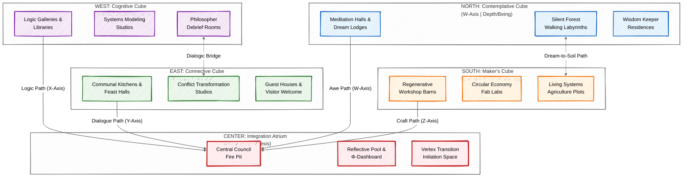

# Appendix Q: Consciousness Infrastructure — Protocols for Scaling Regenerative Awareness

## Executive Summary: Engineering Civilizations of Connection

This appendix provides the **applied engineering protocols** for scaling consciousness principles from individual and educational contexts (Appendices M, O, P) to community, civic, and bioregional scales. It addresses a critical gap: how to design the **physical, digital, and social infrastructure** that actively cultivates collective consciousness states, prevents systemic dissociation, and encodes the geometric principles of the Tesseract into the fabric of everyday life. Using the Arena's three-lens framework (**Ekistics** for space, **Circles** for domain, and the **Mandala Axis** for purpose), this is **consciousness-informed civilizational design**—a complete toolkit for building settlements that function as explicit "technologies of connection" to counteract the Necrocene's architectures of separation.

---
**Status:** DRAFT | **Version:** 0.8 | **Integration Points:** Arena Protocols (0, 1, 2, 3), Appendices I (Vastu), J (Adversarial), N (Epistemic), O (Learning), P (Education). Serves as the capstone application layer.

## 1.0 Foundational Integration: The Arena as Operating System

### 1.1 Core Proposition: Infrastructure as Crystallized Consciousness
All infrastructure—roads, laws, markets, buildings, networks—is **crystallized consciousness**. It reflects the dominant dissociation patterns of the culture that built it. Solarpunk infrastructure must therefore be **consciously architected to materialize a worldview of interconnection**.

### 1.2 The Three-Lens Design Protocol
Every Consciousness Infrastructure project must be developed through the Arena's integrated view:

| Arena Lens | Primary Question | Appendix Q Application |
|------------|------------------|------------------------|
| **Ekistics (Space)** | "Where and in what form does this exist?" | Determines the physical/spatial implementation (e.g., where to build a Ritual Chamber). |
| **Circles (Domain)** | "Which domains of community life does it serve/affect?" | Ensures holistic integration across Politics, Economics, Ecology, Culture, Spirituality. |
| **Mandala Axis (Purpose)** | "Which regenerative pathway does it activate?" | Aligns the project with Awakening, Making, Liberation, or Healing, and sets its developmental rhythm. |

**Gateway Rule:** The **Embodied Foundations Audit (Arena Protocol 0)** is mandatory. No Consciousness Infrastructure project can proceed if community scores for **Nourishment, Cleansing, Restoration, or Movement are below 2**. Infrastructure must first stabilize the somatic base.

## 2.0 Spatial Blueprint: Ekistics of Conscious Settlement

### 2.1 Conscious Re-definition of Ekistics Elements
Infrastructure must be designed to heal the dissociation inherent in Necrocene spaces.

| Ekistics Element | Consciousness-Informed Principle | Sample Infrastructure |
|------------------|----------------------------------|----------------------|
| **NATURE** | Not a "resource," but the primary conscious field we are embedded within. | **Bioregional Nervous System** sensors; Rewilded corridors with dream incubation stations. |
| **MAN** | A conscious "alter" within Mind-at-Large, with needs for both agency and connection. | **Portals of Perspective** (question-gates at neighborhood entries); **Somatic Freedom Pathways**. |
| **SOCIETY** | The intersubjective field; health is measured by boundary flexibility and dialogue depth. | **Dialectical Council Chambers**; **Restorative Justice Circles** integrated into public squares. |
| **SHELLS** | Built forms that actively modulate collective consciousness states. | **Acoustic Mandalas** (resonant plazas); **Dissolution/Integration Chambers**. |
| **NETWORKS** | The circulatory system for resources, information, and consciousness flow. | **Collective Φ-Monitoring Array**; **Regen Currency Digital Ledger**; low-energy mesh networks. |

### 2.2 The Tesseract Village Prototype

A complete Ekistics blueprint for a 100-person settlement that physically instantiates the geometric principles of the Epistemic Tesseract (Appendix N) and the Learning Tesseract (Appendix O). The layout is a navigable mandala where spatial zones ("Cubes") correspond to primary consciousness functions, and connecting paths ("Edges") are engineered for perspective-bridging.



#### Design Principles:

1. **Cubes as Developmental Zones**: Each cardinal zone correlates to a primary axis of the Epistemic Tesseract and hosts infrastructure supporting that mode of consciousness. Residents are encouraged to live in the zone matching their current growth edge.

2. **Edges as Transformative Pathways**: The paths between cubes are not neutral. They are designed landscapes that facilitate a cognitive and perceptual shift:

    - The Dialogic Bridge between the Cognitive and Connective Cubes is lined with debate alcoves and listening benches.

    - The Dream-to-Soil Path between the Contemplative and Maker's Cubes winds through a garden where plants mentioned in community dream reports are cultivated.

3. **Center as Integration Engine**: The Integration Atrium is the only space with direct visual and physical access to all four cubes. It hosts the Dialectical Council and the public Consciousness Dashboard (Phi_br), making collective awareness tangible.

4. **Permeable Boundaries**: While cubes have distinct identities, their boundaries are gardens, workshops, or commons that blend functions (e.g., a pottery studio in the Maker's Cube that is also used for somatic therapy from the Healing pathway).

**Operationalization (via Arena Protocol 2)**:
This prototype is not an artistic rendering but an engineering spec. When implementing:

- **Ekistics Analysis**: Each Cube must score highly on its corresponding Embodied Foundation (Contemplative→Restoration, Cognitive→Nourishment, Connective→Movement, Maker→Cleansing).

- **Circles Integration**: Each Cube's function must actively serve at least three Circles domains (e.g., the Maker's Cube serves Economics, Ecology, and Culture).

- **Mandala Axis Check**: The Village's master plan must allocate equal resource budgets to infrastructure supporting all four Pathways, ensuring no developmental axis is neglected.

## 3.0 Functional Blueprint: Circles of Conscious Domain

### 3.1 Governance as Boundary Regulation (Politics Domain)
**Tool: The Dialectical Council System**
Replaces adversarial democracy with a geometric model ensuring all epistemic axes are represented.

| Council Seat | Represents (Axis) | Selection Method | Primary Role in Council |
|--------------|-------------------|------------------|--------------------------|
| **X-Seat (The Logician)** | Evidence, data, long-term systemic logic. | Sortition from a pool of scientists, system thinkers. | Ensures decisions are logically coherent and sustainable. |
| **Y-Seat (The Empath)** | Community sentiment, marginalized voices, relational harmony. | Elected by lottery from volunteers trained in deep listening. | Voices the emotional and social impact; holds the relational field. |
| **Z-Seat (The Maker)** | Practical feasibility, craft, material and labor realities. | Rotated among guilds of builders, farmers, technicians. | Answers "Can we actually build/maintain this?" |
| **W-Seat (The Visionary)** | Long-term vision, ancestral wisdom, ethical depth. | Chosen by elders or through a community-vetted vision quest. | Asks "Does this serve Life's unfolding story?" |

**Decision Protocol (Geometric Consensus):** A proposal passes if it receives no strong objection from **more than one axis seat**. This forces cross-axis dialogue and synthesis, preventing any one perspective from dominating.

### 3.2 Economics as Consciousness Flow (Economics Domain)
**Tool: The Regen (Attention-Backed Currency)**
Currency is minted by verifiable acts of regenerative attention, creating a direct feedback loop between conscious action and economic capacity.

| Way to Earn "Regen" | Circles Domain | Verification Method |
|----------------------|----------------|---------------------|
| **Stewarding:** Improve soil health, biodiversity, or water quality on your land. | Ecology | Sensor data from the Bioregional Nervous System. |
| **Connecting:** Host a successful conflict resolution circle. | Politics & Culture | Validated, anonymized participant feedback scores. |
| **Making:** Craft a beautiful, durable item from local materials added to the community gift registry. | Economics & Culture | Guild peer review and registry entry. |
| **Dreaming:** Contribute a dream or vision to the public Narrative Feed that later inspires a community project. | Spirituality & Culture | Community vote and project attribution. |

**The Φ-Score Investment Filter:** Any project seeking large-scale community resources must be scored 1-10 on each axis (X, Y, Z, W). Funding requires a balanced score where **no axis is below 7, and the variance between axes is less than 2**. This prevents "flatland" investments (e.g., a technically brilliant but socially destructive project).

## 4.0 Activation Blueprint: The Mandala Axis in Action

### 4.1 Pathway-Specific Infrastructure
Consciousness infrastructure must serve all four regenerative purposes.

| Pathway | Primary Goal | Key Appendix Q Infrastructure | Arena Protocol 2 Checkpoint |
|---------|--------------|-------------------------------|-----------------------------|
| **Awakening (Conscientização)** | Cultivate wonder & connection. | **Calendar of Collective Pulses;** **Narrative & Dream Feed;** **Acoustic Mandalas.** | Requires **Restoration** foundation score ≥ 3. |
| **Making (Capacitação)** | Build regenerative material capacity. | **Regen Currency & Guilds;** **Maker's Cube workshops;** **Circular waste systems.** | Requires **Nourishment** foundation score ≥ 3. |
| **Liberation (Liberação)** | Dismantle oppressive structures & create equitable flow. | **Dialectical Council;** **Adversarial Pattern Detector (APD);** **Commons Land Trusts.** | Requires **Movement** foundation score ≥ 3. |
| **Healing (Cura)** | Repair individual & collective trauma. | **Dissolution/Integration Chambers;** **Restorative Justice Circles;** **Trauma-Informed Land Design.** | Requires **Cleansing** foundation score ≥ 3. |

### 4.2 Vertex Vocations: The Human Roles
The **16 Vertices** of the Arena (intersection of 4 Pathways and 4 primary Ekistics Elements) define the specific human roles needed to build and maintain this infrastructure. For example:
- **Regenerative Builder (Making + Shells):** Constructs Acoustic Mandalas and Dissolution Chambers.
- **Commons Infrastructure Planner (Liberation + Shells):** Designs the physical/digital networks for the Bioregional Nervous System and Regen ledger.
- **Eco-Therapist (Healing + Nature):** Guides community grief rituals in designated natural spaces.

## 5.0 Core Protocols: From Blueprint to Reality

### 5.1 Mandatory Project Integration (Arena Protocol 2)

All Consciousness Infrastructure projects must follow this protocol:

1.  **Embodied Gate Check:** Verify all four foundation scores are ≥ 3.
2.  **Dual-Framework Briefing:** Define success through both:
      - **Ekistics:** What Elements (Nature, Man, Society, Shells, Networks) will be altered?
      - **Circles:** What Domains (Politics, Economics, etc.) will be impacted?
3.  **Stakeholder Mapping:** Use the **24 Interfaces** hexagon map to identify all affected community intersections.
4.  **Pathway Alignment & Checkpoint:** Declare the primary Pathway and ensure its corresponding foundation threshold is met.
5.  **Iterative Refinement:** Pilot the project on a micro-scale, using the **Bioregional Nervous System** to measure changes in collective Φ before scaling.

### 5.2 Crisis Response & Maintenance (Arena Protocol 3)

```markdown
Immediate Response Algorithm:
1.  Run Immediate Foundation Assessment (score Nourishment, Cleansing, Restoration, Movement).
2.  IF any foundation score < 2:
        • 100% of resources shift to foundation stabilization.
        • Pause all other infrastructure projects.
3.  IF foundation scores are 2-3:
        • 70% resources to foundation reinforcement, 30% to crisis-specific response.
4.  IF foundation scores are 4-5:
        • 30% resources to foundation maintenance, 70% to crisis response.
```

## 6.0 The Rhizomatic Cross-Walk: The Integration Engine

The power of this design lies in the **24 Interfaces** of the Arena—the hexagons where each Ekistics Element meets each Circles Domain. Appendix Q tools are designed to heal or enhance specific interfaces.

| Critical Interface | Dysfunction (Necrocene Pattern) | Healing Tool (Appendix Q) | Protocol |
|-------------------|----------------------------------|----------------------------|----------|
| **POLITICS–ECONOMICS** | Institutional capture; policy for profit. | **Adversarial Pattern Detector (APD)** | Scans all council proposals for linguistic markers of shadow patterns. |
| **NATURE–SPIRITUALITY** | Nature as dead resource; loss of awe. | **Calendar of Collective Pulses** & **Dream Incubation Stations** | Seasonal community rituals in rewilded zones. |
| **SOCIETY–CULTURE** | Fragmented identity; cultural amnesia. | **Narrative & Dream Feed** in the public Φ-Dashboard | Makes the community's subconscious visible and discussable. |
| **NETWORKS–POLITICS** | Centralized control of information/energy. | **Decentralized Bioregional Nervous System** & **Regen Ledger** | Creates transparent, participatory feedback loops for governance. |

## 7.0 Technical Specification: The Bioregional Nervous System

This is the operational centerpiece, a **Digital/Informational Layer** tool spanning multiple domains.

### 7.1 Component Architecture

```markdown
1.  Acoustic Coherence Sensors:
    - Placement: Public squares, community centers, natural gathering points.
    - Data: Frequency harmony, resonant patterns, "cacophony index."
    
2.  Biometric Synchrony Stations (Opt-In):
    - Method: Wearable partnerships or kiosk stations with strict consent protocols.
    - Data: Aggregate Heart Rate Variability (HRV), electrodermal activity during events.
    
3.  Ecological Sentience Proxies:
    - Sensors: Soil moisture, mycelial network electrical signals, canopy density cameras.
    - Data: Patterns as proxies for the "health of the more-than-human mind."
    
4.  Narrative & Dream Feed:
    - Platform: Voluntary, anonymized digital platform.
    - Analysis: NLP for recurring archetypal patterns and emotional tone.
```

### 7.2 The Community Consciousness Dashboard
- **Primary Metric:** **Bioregional Φ (Phi_br)** = Composite index of acoustic, biological, and narrative coherence.
- **Visualization:** A real-time, glowing 3D map of the bioregion. Areas of high coherence pulse softly; areas of low coherence (dissociation) appear dim or fragmented.
- **Use:** Data is publicly displayed in Integration Atriums and informs the **Weekly Council of All Beings**.

## Conclusion: From Philosophy to Civilization

Appendix Q, when operated through the Arena's protocols, moves the Solarpunk Mandala from a framework of personal transformation into a **generative toolkit for civilizational redesign**. It provides the missing engineering specs to build a world that doesn't just *talk about* interconnection, but is **architected from the ground up to cultivate it as its primary function**.

> **The ultimate test of Consciousness Infrastructure is this:** Does walking through this village, participating in its economy, and being governed by its systems make it *easier* to feel connected, act ethically, and participate in the healing of the world? If so, it is working. If not, return to Protocol 0 and check the foundations.
