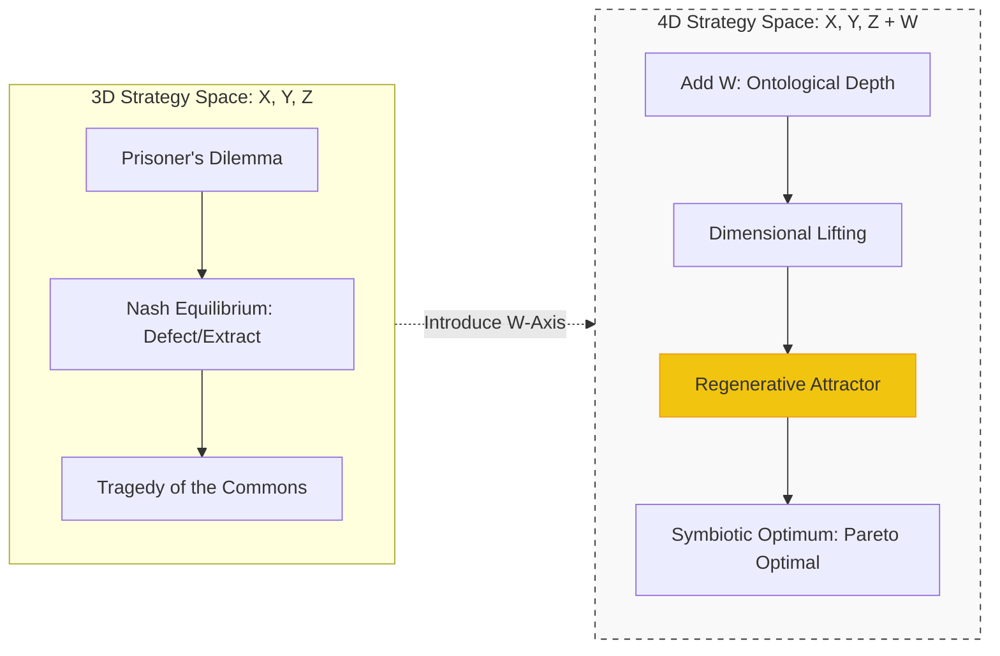
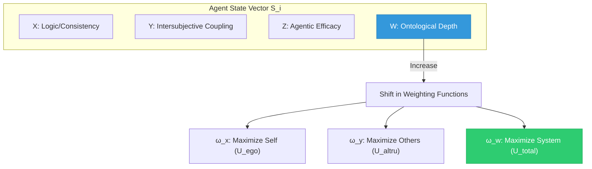
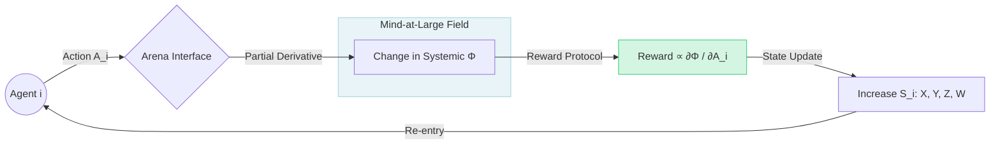

---
aeo_metadata:
  title: "Appendix R: Game Theory of the Mandala"
  description: "A game-theoretic analysis of strategic interactions and cooperation dynamics within the four-axis Mandala framework, modeling how consciousness, ethics, knowledge, and action interact in multi-agent systems."
  context: "Strategic interaction framework within the Solarpunk Mandala that applies game theory to analyze cooperation, competition, and collective outcomes in conscious systems from dyadic relationships to civilizational scales."
  key_objectives:
    - "Model the four Mandala axes as dimensions in strategic decision spaces."
    - "Analyze traditional game theory dilemmas (Prisoner's Dilemma, Tragedy of Commons) through consciousness-first assumptions."
    - "Develop models for consciousness-aware strategies and higher-order game dynamics."
    - "Explore how expanded epistemic and ethical frameworks transform strategic equilibria."
    - "Design protocols for transcending zero-sum dynamics through axis integration."
  core_concepts:
    - "Four-Axis Strategy Spaces"
    - "Consciousness-Expanded Equilibrium Concepts"
    - "Meta-Games and Higher-Order Strategies"
    - "Coordination Games of Collective Awakening"
    - "Transformative Game Dynamics"
    - "Non-Zero-Sum Consciousness"
  ontological_foundation: "Game Theory & Strategic Interaction Analysis"
  epistemic_stance: "Strategic Modeling & Equilibrium Analysis"
  search_queries:
    - "game theory Solarpunk Mandala"
    - "consciousness-aware strategic interaction"
    - "four-axis decision modeling"
    - "non-zero-sum awakening dynamics"
    - "transformative game theory"
  related_nodes:
    - "framework/core-model/03-ethical-architecture-values.md"
    - "appendices/K-formal-foundations-analytic-idealism.md"
    - "framework/applied/02-collective-intelligence-systems.md"
  framework_status: "Developmental"
  version: "0.8"
  last_reviewed: "2026-01-12"
---
# Appendix R: A Game-Theoretic Formalization of the Solarpunk Mandala

## 1. Introduction: The Necrocene as a Coordination Failure

From the perspective of mechanism design, the **Necrocene**—the current epoch of ecological and social degradation—is the emergent result of stable **Nash Equilibria** occurring within low-dimensional, extractive strategy spaces. When agents operate within a 3D "material-only" framework ($X, Y, Z$), they inevitably encounter "Moloch’s Trap": a multi-polar trap where competition drives all players toward sub-optimal, self-terminating outcomes (e.g., the Tragedy of the Commons).

The Solarpunk Mandala is a **Mechanism Design framework** that posits these dilemmas are artifacts of **epistemic dimensionality reduction**. By "lifting" the game into a 4D phase space—the **Epistemic Tesseract**—we introduce **Dialectical Depth ($W$)** as a strategic variable. This transformation allows for the emergence of **Regenerative Attractors**: high-dimensional equilibria where cooperation is not merely an ethical choice, but a mathematically dominant strategy.

---

## 2. Agent Formalization: The Evolving Alter

Traditional game theory assumes agents with fixed, exogenous preferences (*Homo Economicus*). Utilizing the ontology of **Analytic Idealism** (Appendix K), we model agents as **Alters**: dissociated segments of Mind-at-Large (MAL) whose utility functions are **endogenous** to their developmental trajectory.

### 2.1 The Agent State Vector
An agent $i$ is defined by a state vector $S_i$ in a 4-dimensional manifold:

$$S_i = \langle X_i, Y_i, Z_i, W_i \rangle \in \mathbb{R}^4$$

* **$X$ (Cognitive Coherence):** Internal logical consistency and predictive capacity.
* **$Y$ (Intersubjective Coupling):** The strength of the agent’s "Theory of Mind" and empathic weight.
* **$Z$ (Agentic Efficacy):** The capacity to manifest intent into state-changes in the representational world.
* **$W$ (Ontological Depth):** The degree of "de-dissociation" or meta-awareness regarding the unified nature of Mind-at-Large.

### 2.2 Endogenous Utility Functions
The agent’s utility $U_i$ is a weighted sum where the weights are functions of the agent's own state vector. As an agent develops along the $W$-axis, the weight given to the "whole" (transpersonal utility) increases:

$$U_i(O) = \omega_x(S_i) \cdot U_{ego}(O) + \omega_y(S_i) \cdot U_{altru}(O) + \omega_w(S_i) \cdot U_{total}(O)$$

As $W \to \infty$, the agent's utility converges with the system's utility ($U_{total}$), dissolving the distinction between private gain and public good.

---

## 3. The Game Board: The Tesseract as Phase Space

The 24 Arena interfaces (e.g., `NATURE-ECOLOGY`, `POLITICS-SOCIETY`) are modeled as **stochastic games** played on a tesseract-shaped manifold. Each "cell" of the tesseract represents a distinct domain of interaction.

### 3.1 Dimensional Lifting Theorem
A central thesis of the Mandala is **Dimensional Lifting**. A game that is "stuck" in a zero-sum equilibrium in 3D can be resolved by engaging the 4th dimension ($W$). By making the "shadow of the whole" explicit through contemplative or meta-cognitive protocols, the game shifts from a one-shot interaction to an **Iterated Game on a Unified Field**. This transition effectively lowers the discount rate for future/systemic rewards.

---

## 4. Mechanism Design: The $\Phi$-Score and Regenerative Attractors

The Mandala acts as a "focal point" (Schelling point) generator to draw agents toward regenerative behavior through the **$\Phi$-score**.

### 4.1 The $\Phi$-Score (Systemic Health)
The $\Phi$-score (detailed in Appendix Q) measures the integration and vitality of the conscious field across all interfaces. The Mandala economy rewards agents for the **partial derivative of the system-wide $\Phi$** with respect to their actions ($A_i$):

$$\text{Reward}_i \propto \frac{\partial \Phi}{\partial A_i}$$

### 4.2 Regenerative Attractors
A **Regenerative Attractor** is an equilibrium state $E^*$ where:
1.  **Nash Stability:** No agent can improve their outcome by deviating.
2.  **Pareto Optimality:** No agent can be made better off without making another worse off.
3.  **Developmental Stability:** The act of playing the game at $E^*$ naturally increases the state vectors $S_i$ of the participants, fostering further cognitive and ontological growth.

### 4.3 Anarchic Equilibrium: The Governance of the Mesh
In the Symbiotic Commonwealth, governance is not an external authority imposed upon agents, but an emergent property of the "Mesh." By transcluding models of **Democratic Confederalism** (Öcalan) and **Social Ecology** (Bookchin), we move from top-down command to **Anarchic Equilibrium**.

* **Dissolving the Principal-Agent Problem:** Traditional states suffer from "Institutional Capture," where the agent (the state) prioritizes its own survival over the principals (the people). The Commonwealth resolves this by ensuring all coordination roles are functional, temporary, and recallable (the **CNT Model**).
* **The Malatesta Constraint:** Formalizing Errico Malatesta’s voluntarism, the mechanism design ensures that participation in any "sub-cube" of the Tesseract is voluntary. If a node becomes coercive, the "Dimensional Rotation" protocol allows the network to route around it, effectively isolating the "authoritative" node from the $\Phi$-signal.
* **Mutual Aid as Game-Theoretic Dominance:** In a high-$W$ population (where agents recognize their shared ontological ground), Mutual Aid (Kropotkin) becomes the most rational strategy. The "utility of the other" is recognized as a direct extension of the "utility of the self."

---

## 5. Mathematical Notation Guide for Implementation

For developers and theorists simulating these dynamics, the following notation is standard within the framework:

| Symbol | Definition | Role in System |
| :--- | :--- | :--- |
| $S_i$ | **State Vector** | The agent's coordinates in the 4D Tesseract space. |
| $\omega$ | **Weighting Function** | Maps ontological depth to utility priorities. |
| $A_i$ | **Action Set** | The range of possible moves an agent can make at an interface. |
| $\Phi$ | **Global Integration** | The macro-metric for the health of the Symbiotic Commonwealth. |
| $\Gamma$ | **The Tesseract Manifold** | The geometric "container" of all possible game states. |

---

## 6. Conclusion: From Competition to Symphony

To a game theorist, the Solarpunk Mandala is an invitation to move beyond **Bayesian Rationality** into **Manifold Rationality**. It suggests that the "Hard Problem" of social organization is solved by the same geometry that addresses the "Hard Problem" of consciousness. When we treat the social field as a 4D tesseract, we find that the most "rational" strategy is the one that most increases the field's capacity to know itself. 

By aligning individual incentives with the $\Phi$-score, we transform the global game from a race to the bottom into a collective unfolding of Mind-at-Large.

---
**References:**
* Fehr & Gächter (2002): Altruistic punishment and cooperation.
* Ostrom (1990): Governing the Commons via 8 Design Principles (mapped to the Tesseract).
* Tononi (2004): Integrated Information Theory (basis for the $\Phi$-score).
