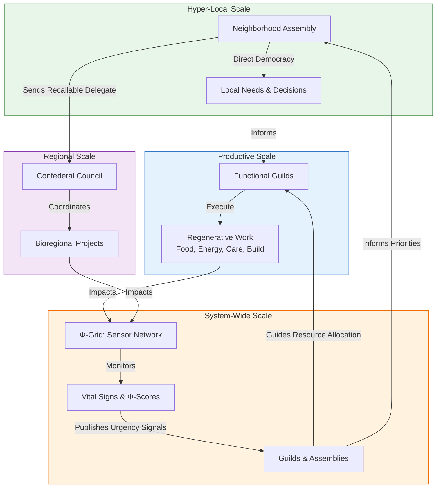

# Appendix S: The Symbiotic Commonwealth—Daily Life in the Mesh

## 1. Introduction: From "State" to "Social Body"
Appendix S outlines the practical, organizational blueprint of the **Symbiotic Commonwealth**. While Appendix R models the mathematics of cooperation, Appendix S details the lived reality of governance, work, and conflict resolution without a centralized state. We replace the "State"—a dissociated, monopolistic entity—with a **Social Mesh**, a distributed network that functions like a healthy organism, where sovereignty is embedded in the community and individual.

---

## 2. The Four Pillars of Daily Life
Daily life is structured by four integrated governance models, each addressing a specific scale of human interaction and a core axis of the Mandala.

*This table maps the four organizational models of daily life to the four ethical axes of the SolarPunk Mandala, illustrating the theoretical foundation of the Commonwealth.*

| Commonwealth Pillar (Model) | Primary Function | Manifested Mandala Axis | Axis Principle Served |
| :--- | :--- | :--- | :--- |
| **1. Local Assembly** (Communalism) | Hyper-local, face-to-face governance and community building. | **Relational Depth (Y-Axis)** | Fosters intersubjectivity, empathy, and direct democratic participation. |
| **2. Functional Guild** (Syndicalism) | Self-managed, productive labor organized by craft and purpose. | **Efficacy (Z-Axis)** | Channels skillful action and purposeful work into regenerative outcomes. |
| **3. Confederal Mesh** (Confederalism) | Regional coordination through mandated, recallable delegates. | **Ontological (W-Axis)** | Serves the health, sovereignty, and integration of the whole social body. |
| **4. The Φ-Grid** (Cyber-Socialism) | Real-time monitoring and logistic feedback via sensor networks & data. | **Logistical (X-Axis)** | Enables the flow of information and resources to maintain systemic vitality. |

### 2.1 The Local Assembly (The Soul of the Neighborhood)
*Inspired by: **Murray Bookchin’s Communalism** & **Zapatista Good Government Councils**.*
*   **Practical Life:** Governance is hyper-local. Weekly or bi-weekly, residents gather in a community space—a park, a hall, or via a resilient local mesh network—for the **Neighborhood Assembly**. Decision-making uses modified consensus (e.g., sociocracy) to ensure efficiency without coercion.
*   **The Experience:** You directly decide on land-use for urban gardens, allocate shared resources (like the "Library of Things"), and plan local festivals. This is face-to-face, high-empathy coordination, strengthening the **Relational Depth (Y) Axis**. Children participate in their own circles, learning direct democracy from a young age.
*   **Real-World Precedent:** The structure mirrors the **Zapatista Caracoles** in Chiapas, Mexico, where autonomous communities govern themselves through assemblies, and the neighborhood councils of **Rojava’s Democratic Confederalism**.

### 2.2 The Functional Guild (How the Work Gets Done)
*Inspired by: **Anarcho-Syndicalism (CNT/FAI)** & **Mondragon Corporation** principles.*
*   **Practical Life:** Productive labor is organized into voluntary, self-managing **Functional Guilds** (e.g., Energy Mesh Guild, Food Web Guild, Care Circle Guild). There are no permanent bosses; coordinators are elected for specific tasks and rotate. Remuneration is based on need and agreed-upon effort, often using the **Φ-currency** system (Appendix T).
*   **The Experience:** As a member of the **Water Stewards Guild**, you and your peers monitor local watershed health, maintain infrastructure, and plan restoration projects. Your work's success is measured by its **Use-Value** (clean water access, ecosystem Φ-score) and contribution to community resilience, activating the **Efficacy (Z) Axis**.
*   **Real-World Precedent:** The **Mondragon Corporation** in Spain—a federation of worker cooperatives—demonstrates large-scale, democratic, and economically viable self-management. Modern **Platform Cooperatives** (like Stocksy United) show how digital work can be organized along similar lines.

### 2.3 The Confederal Mesh (Scaling without Authority)
*Inspired by: **Abdullah Öcalan’s Democratic Confederalism** & **Bioregional Federation** concepts.*
*   **Practical Life:** For issues transcending the neighborhood (e.g., regional transit, watershed management), Assemblies send **recallable delegates** with strict mandates to a **Bioregional Council**. These councils are administrative, not legislative; they coordinate based on the needs articulated from below.
*   **The Experience:** Your neighborhood's delegate brings your assembly's position on a shared forestry project to the council. They negotiate, but cannot agree to terms that violate their mandate. Power remains rooted in the local assembly, while coordination scales effectively, serving the **Ontological (W) Axis**—the health of the whole.
*   **Real-World Precedent:** The **Autonomous Administration of North and East Syria (AANES)** operates on this confederal model, with grassroots communes sending delegates to district and regional councils. The **European Union's principle of subsidiarity** is a weaker, but related, concept.

### 2.4 The Φ-Grid (The Digital Nervous System)
*Inspired by: **Stafford Beer’s Cybernetic Viable System Model (VSM)** & **Sensor/Actuator Networks**.*
*   **Practical Life:** A transparent, open-source digital platform—the **Φ-Grid**—aggregates real-time data from environmental sensors, community audits, and resource trackers. It visualizes the vital signs (Φ-scores) of your community and bioregion.
*   **The Experience:** You check a community dashboard. A "vitality alert" shows declining pollinator counts in the southern green corridor. The grid automatically proposes this as a priority for the week, and the relevant guilds (Food Web, Mycology) can instantly see resource needs and volunteer. This replaces the opaque "Invisible Hand" with a **"Visible Heart,"** using **Logistical (X) Axis** data to maintain systemic health.
*   **Real-World Precedent:** **Barcelona's Decidim** platform is a digital tool for participatory democracy. **IoT-based smart city projects** (when designed for public good, not surveillance) show the technical feasibility of a real-time civic sensor network.

---

## 3. Conflict Resolution: From Adjudication to Transformation
In the absence of a monopolistic police and court system, the Commonwealth employs **Restorative and Transformative Justice** practices.
*   **The Process:** When harm or conflict occurs, the involved parties, supported by trained community facilitators (often called a "Circle" or "Council"), engage in a structured process. The goal is not to determine guilt and punish, but to: 1) Understand the root needs and causes, 2) Repair harm to the greatest extent possible, and 3) Reintegrate all parties into the community.
*   **The "Council of Elders":** This is not an age-based title, but denotes community members recognized for their high **W-Axis integrity** (ontological depth, empathy, wisdom). They facilitate "**4D Pivot**" dialogues, helping conflicting parties find integrative solutions that address underlying needs rather than bargaining over positions.
*   **Real-World Precedent:** **Indigenous peacemaking circles**, **transformative justice** models used in some activist communities, and **restorative justice conferences** in jurisdictions like New Zealand demonstrate effective alternatives to punitive legal systems.

---

## 4. Summary Table: The Commonwealth Architecture

| Scale | Model (Inspiration) | Core Activity | Mandala Axis | Key Mechanism |
| :--- | :--- | :--- | :--- | :--- |
| **Hyper-Local (1-500)** | **Communalism** (Bookchin, Zapatistas) | Neighborhood Assembly; Commons Management | Relational Depth **(Y)** | Face-to-face direct democracy; Modified consensus. |
| **Productive/Work** | **Syndicalism** (Mondragon, Platform Co-ops) | Self-managed Labor in Functional Guilds | Efficacy **(Z)** | Worker self-direction; Φ-currency for contribution. |
| **Regional/Bioregional** | **Confederalism** (AANES, Bioregionalism) | Mandated, Recallable Delegation to Councils | Ontological **(W)** | Bottom-up coordination; Power held at base. |
| **System-Wide** | **Cybernetic Socialism** (Beer's VSM) | Monitoring & Optimizing via the Φ-Grid | Logistical **(X)** | Real-time vital sign feedback; Stochastic resource allocation. |
| **Conflict** | **Transformative Justice** (Indigenous, Restorative Models) | Circle Processes; Council Facilitation | **Integration of All Axes** | Harm repair, root-cause analysis, community reintegration. |

---

## 5. Conclusion: The Organism of Freedom
The Symbiotic Commonwealth is the political-economic "unfolding" of the SolarPunk Tesseract. It demonstrates that complex, large-scale human society does not require a centralized, coercive state. Instead, order and innovation emerge from a **high-dimensional social architecture** that distributes power, embeds sovereignty in the community, and uses transparent feedback to maintain health. It is a blueprint for a society where the geometry of cooperation is built into the very fabric of daily life.

## 6. Key References & Further Reading

1.  **Bookchin, M.** (1992). *Urbanization Without Cities: The Rise and Decline of Citizenship*. Black Rose Books. *(The foundational text for libertarian municipalism and communalism)*.
2.  **Öcalan, A.** (2011). *Democratic Confederalism*. International Initiative Edition. *(The political theory behind the Rojava revolution and non-state confederalism)*.
3.  **Beer, S.** (1972). *Brain of the Firm*. Allen Lane. *(Presents the Cybernetic Viable System Model (VSM) for managing complex organizations)*.
4.  **Mondragon Corporation.** (Various). *Annual Reports & Cooperative Studies*. *(Practical case study of large-scale, successful worker self-management)*.
5.  **Zibechi, R.** (2012). *Territories in Resistance: A Cartography of Latin American Social Movements*. AK Press. *(Documents autonomous, community-based governance in Latin America, including the Zapatistas)*.
6.  **Pranis, K.** (2005). *The Little Book of Circle Processes*. Good Books. *(A practical guide to peacemaking circles, a key tool for restorative justice)*.
7.  **Benkler, Y.** (2006). *The Wealth of Networks: How Social Production Transforms Markets and Freedom*. Yale University Press. *(Analyzes commons-based peer production, relevant to Guild and Mesh organization)*.
8.  **Sale, K.** (1985). *Dwellers in the Land: The Bioregional Vision*. Sierra Club Books. *(On organizing human society around ecological regions rather than arbitrary political borders)*.
9.  **Case Study: The Autonomous Administration of North and East Syria (AANES).** *(A contemporary, large-scale experiment in democratic confederalism)*.
10. **Case Study: Barcelona's "Decidim" Digital Democracy Platform.** *(A real-world example of open-source, municipal-level participatory democracy software)*.

# Appendix S: The Symbiotic Commonwealth—Daily Life in the Mesh

## 1. Introduction: From "State" to "Social Body"
Appendix S outlines the practical, organizational blueprint of the **Symbiotic Commonwealth**. While Appendix R deals with the math of cooperation, Appendix S deals with the reality of how we eat, work, and resolve disputes without a central government. We replace the "State" (a dissociated, authoritative entity) with a **Social Mesh** that functions like a healthy, conscious organism.

---

## 2. The Four Pillars of Daily Life

Daily life in the Commonwealth is structured by four transclusive socialist models, each serving a specific human and geometric need.

### 2.1 The Local Assembly (The Soul of the Neighborhood)
*Inspired by: Murray Bookchin’s Communalism*
* **Practical Life:** Every Tuesday evening, your neighborhood meets in the park or community hall. You don't vote for a representative; you are the representative. 
* **The Experience:** Decisions about local land use, community gardens, or the "Library of Things" are made here. It is face-to-face, high-empathy coordination ($Y$-axis). 
* **The Result:** You know your neighbors not as "consumers," but as co-creators of your immediate reality.

### 2.2 The Functional Guild (How the Work Gets Done)
*Inspired by: The CNT’s Anarcho-Syndicalism*
* **Practical Life:** You spend part of your week working within a "Functional Guild" (e.g., the Energy Mesh, the Food Web, or the Care Circle). There are no bosses, only coordinators elected by the workers for specific tasks.
* **The Experience:** If you are a technician in the Energy Mesh, you and your peers decide how to maintain the local micro-grid. Your work is measured by "Use-Value" (does the neighborhood have light?) rather than "Exchange-Value" (is the company making a profit?).
* **The Result:** Labor is no longer alienated. Work is an expression of your $Z$-axis (Efficacy) in service to the whole.

### 2.3 The Confederal Mesh (Scaling without Authority)
*Inspired by: Abdullah Öcalan’s Democratic Confederalism*
* **Practical Life:** When your neighborhood needs to coordinate a watershed project with the neighboring valley, the Assembly sends a delegate to a "Regional Mesh Council."
* **The Experience:** This delegate has no power to make laws. They carry the specific "mandate" of your assembly. If they act against the assembly's wishes, they are recalled immediately.
* **The Result:** We achieve global coordination without a "Capital City." Power remains at the roots, while information flows to the canopy.

### 2.4 The Φ-Grid (The Digital Nervous System)
*Inspired by: Stafford Beer’s Cyber-Socialism*
* **Practical Life:** You check a simple dashboard on your device that shows the health of your local and regional interfaces—the $\Phi$-score.
* **The Experience:** You see that the "Soil Health" metric in your sector is dipping. The system automatically highlights this to the Food Web Guild. Resources (compost, labor, water) are shifted toward that "low-vitality" area before it becomes a crisis.
* **The Result:** We replace the "Invisible Hand" of the market (which is often blind) with the "Visible Heart" of real-time data ($X$-axis logic serving $W$-axis depth).

---

## 3. Conflict Resolution: The "Council of Elders"
In an anarchic system, we don't have police; we have **Conflict Transformation Circles**.
* **Daily Application:** If two neighbors have a dispute over a shared resource, they don't go to a court. They invite a group of "mediators"—people with high $W$-axis scores (Ontological Depth)—to facilitate a "4D Pivot."
* **The Goal:** To find the **Vertex of Integrated Wisdom** where both parties' needs are met through a higher-dimensional solution, rather than a zero-sum compromise.

---

## 4. Summary Table: The Commonwealth Experience

| scale | model | Daily Activity | Geometric Goal |
| :--- | :--- | :--- | :--- |
| **Local** | Communalism | Attending the Assembly; shared gardening. | $Y$ (Intersubjectivity) |
| **Work** | Syndicalism | Self-managed labor; guild coordination. | $Z$ (Efficacy) |
| **Regional** | Confederalism | Mandated delegation; inter-community aid. | $W$ (The Whole) |
| **Systemic** | Cyber-Socialism | Monitoring $\Phi$-scores; ecological balance. | $X$ (Logistics) |

---

**Conclusion:**
The Symbiotic Commonwealth is the practical "unfolding" of the Tesseract into a lived, socialist reality. It proves that we do not need a state to have order; we only need a high-dimensional architecture that allows the inherent unity of Mind-at-Large to express itself through human cooperation.
