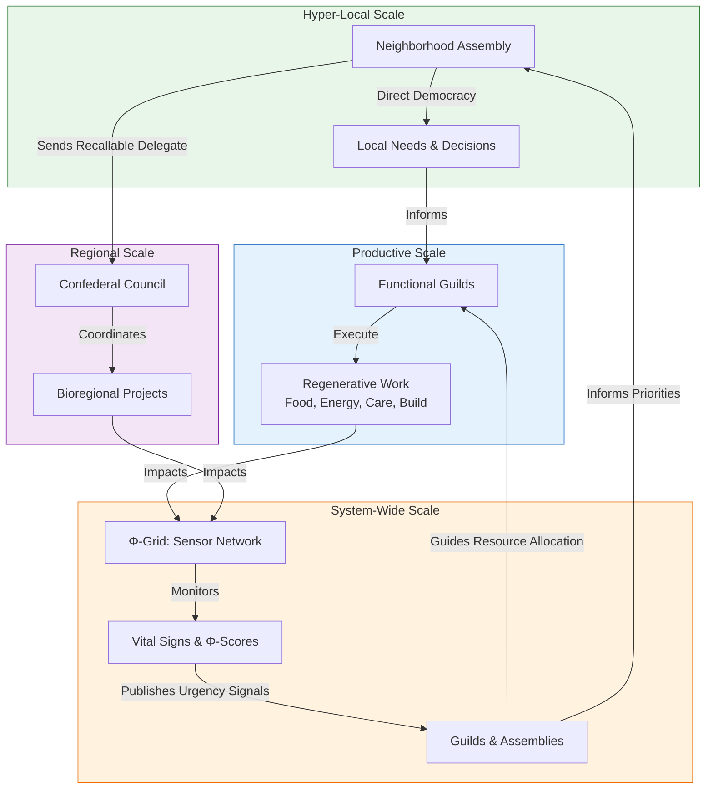
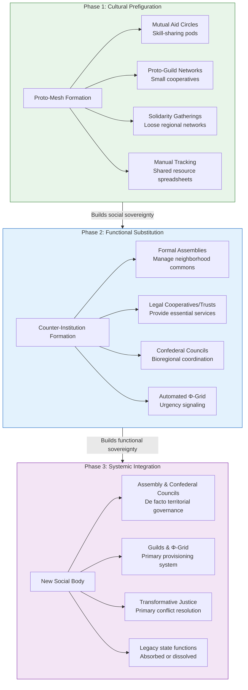

---
aeo_metadata:
  title: "Appendix S: Symbiotic Commonwealth Mesh"
  description: "A governance and organizational model based on decentralized, interdependent networks that coordinate through mutual benefit, shared consciousness, and distributed sovereignty rather than hierarchical control."
  context: "Political and organizational framework within the Solarpunk Mandala that extends consciousness-first principles to governance, creating structures that balance autonomy with interconnection and local agency with global coordination."
  key_objectives:
    - "Define the principles of symbiotic governance and distributed sovereignty."
    - "Model mesh network structures for resource sharing, decision-making, and collective action."
    - "Develop protocols for conflict resolution and coordination in decentralized systems."
    - "Establish consciousness-based criteria for participation and contribution in commonwealth networks."
    - "Design interfaces between local bioregional autonomy and global solidarity networks."
  core_concepts:
    - "Distributed Sovereignty and Subsidiarity"
    - "Mutual Benefit Coordination Protocols"
    - "Mesh Network Governance"
    - "Consciousness-Based Legitimacy"
    - "Polycentric Decision-Making"
    - "Resource Sharing and Mutual Aid Networks"
  ontological_foundation: "Complex Systems Theory & Network Science"
  epistemic_stance: "Systems Thinking & Participatory Design"
  search_queries:
    - "symbiotic commonwealth governance model"
    - "decentralized mesh network organization"
    - "distributed sovereignty systems"
    - "consciousness-based governance"
    - "polycentric decision-making networks"
  related_nodes:
    - "appendices/R-game-theory-mandala.md"
    - "appendices/T-regen-economy.md"
    - "framework/applied/05-governance-systems.md"
  framework_status: "Developmental"
  version: "0.9"
  last_reviewed: "2026-01-12"
---
# Appendix S: The Symbiotic Commonwealth—Daily Life in the Mesh

## 1. Introduction: From "State" to "Social Body"
Appendix S outlines the practical, organizational blueprint of the **Symbiotic Commonwealth**. While Appendix R models the mathematics of cooperation, Appendix S details the lived reality of governance, work, and conflict resolution without a centralized state. We replace the "State"—a dissociated, monopolistic entity—with a **Social Mesh**, a distributed network that functions like a healthy organism, where sovereignty is embedded in the community and individual.

---

## 2. The Four Pillars of Daily Life
Daily life is structured by four integrated governance models, each addressing a specific scale of human interaction and a core axis of the Mandala.

*This table maps the four organizational models of daily life to the four ethical axes of the SolarPunk Mandala, illustrating the theoretical foundation of the Commonwealth.*

| Commonwealth Pillar (Model) | Primary Function | Manifested Mandala Axis | Axis Principle Served |
| :--- | :--- | :--- | :--- |
| **1. Local Assembly** (Communalism) | Hyper-local, face-to-face governance and community building. | **Relational Depth (Y-Axis)** | Fosters intersubjectivity, empathy, and direct democratic participation. |
| **2. Functional Guild** (Syndicalism) | Self-managed, productive labor organized by craft and purpose. | **Efficacy (Z-Axis)** | Channels skillful action and purposeful work into regenerative outcomes. |
| **3. Confederal Mesh** (Confederalism) | Regional coordination through mandated, recallable delegates. | **Ontological (W-Axis)** | Serves the health, sovereignty, and integration of the whole social body. |
| **4. The Φ-Grid** (Cyber-Socialism) | Real-time monitoring and logistic feedback via sensor networks & data. | **Logistical (X-Axis)** | Enables the flow of information and resources to maintain systemic vitality. |

### 2.1 The Local Assembly (The Soul of the Neighborhood)
*Inspired by: **Murray Bookchin’s Communalism** & **Zapatista Good Government Councils**.*
*   **Practical Life:** Governance is hyper-local. Weekly or bi-weekly, residents gather in a community space—a park, a hall, or via a resilient local mesh network—for the **Neighborhood Assembly**. Decision-making uses modified consensus (e.g., sociocracy) to ensure efficiency without coercion.
*   **The Experience:** You directly decide on land-use for urban gardens, allocate shared resources (like the "Library of Things"), and plan local festivals. This is face-to-face, high-empathy coordination, strengthening the **Relational Depth (Y) Axis**. Children participate in their own circles, learning direct democracy from a young age.
*   **Real-World Precedent:** The structure mirrors the **Zapatista Caracoles** in Chiapas, Mexico, where autonomous communities govern themselves through assemblies, and the neighborhood councils of **Rojava’s Democratic Confederalism**.

### 2.2 The Functional Guild (How the Work Gets Done)
*Inspired by: **Anarcho-Syndicalism (CNT/FAI)** & **Mondragon Corporation** principles.*
*   **Practical Life:** Productive labor is organized into voluntary, self-managing **Functional Guilds** (e.g., Energy Mesh Guild, Food Web Guild, Care Circle Guild). There are no permanent bosses; coordinators are elected for specific tasks and rotate. Remuneration is based on need and agreed-upon effort, often using the **Φ-currency** system (Appendix T).
*   **The Experience:** As a member of the **Water Stewards Guild**, you and your peers monitor local watershed health, maintain infrastructure, and plan restoration projects. Your work's success is measured by its **Use-Value** (clean water access, ecosystem Φ-score) and contribution to community resilience, activating the **Efficacy (Z) Axis**.
*   **Real-World Precedent:** The **Mondragon Corporation** in Spain—a federation of worker cooperatives—demonstrates large-scale, democratic, and economically viable self-management. Modern **Platform Cooperatives** (like Stocksy United) show how digital work can be organized along similar lines.

### 2.3 The Confederal Mesh (Scaling without Authority)
*Inspired by: **Abdullah Öcalan’s Democratic Confederalism** & **Bioregional Federation** concepts.*
*   **Practical Life:** For issues transcending the neighborhood (e.g., regional transit, watershed management), Assemblies send **recallable delegates** with strict mandates to a **Bioregional Council**. These councils are administrative, not legislative; they coordinate based on the needs articulated from below.
*   **The Experience:** Your neighborhood's delegate brings your assembly's position on a shared forestry project to the council. They negotiate, but cannot agree to terms that violate their mandate. Power remains rooted in the local assembly, while coordination scales effectively, serving the **Ontological (W) Axis**—the health of the whole.
*   **Real-World Precedent:** The **Autonomous Administration of North and East Syria (AANES)** operates on this confederal model, with grassroots communes sending delegates to district and regional councils. The **European Union's principle of subsidiarity** is a weaker, but related, concept.

### 2.4 The Φ-Grid (The Digital Nervous System)
*Inspired by: **Stafford Beer’s Cybernetic Viable System Model (VSM)** & **Sensor/Actuator Networks**.*
*   **Practical Life:** A transparent, open-source digital platform—the **Φ-Grid**—aggregates real-time data from environmental sensors, community audits, and resource trackers. It visualizes the vital signs (Φ-scores) of your community and bioregion.
*   **The Experience:** You check a community dashboard. A "vitality alert" shows declining pollinator counts in the southern green corridor. The grid automatically proposes this as a priority for the week, and the relevant guilds (Food Web, Mycology) can instantly see resource needs and volunteer. This replaces the opaque "Invisible Hand" with a **"Visible Heart,"** using **Logistical (X) Axis** data to maintain systemic health.
*   **Real-World Precedent:** **Barcelona's Decidim** platform is a digital tool for participatory democracy. **IoT-based smart city projects** (when designed for public good, not surveillance) show the technical feasibility of a real-time civic sensor network.

---

## 3. Conflict Resolution: From Adjudication to Transformation
In the absence of a monopolistic police and court system, the Commonwealth employs **Restorative and Transformative Justice** practices.
*   **The Process:** When harm or conflict occurs, the involved parties, supported by trained community facilitators (often called a "Circle" or "Council"), engage in a structured process. The goal is not to determine guilt and punish, but to: 1) Understand the root needs and causes, 2) Repair harm to the greatest extent possible, and 3) Reintegrate all parties into the community.
*   **The "Council of Elders":** This is not an age-based title, but denotes community members recognized for their high **W-Axis integrity** (ontological depth, empathy, wisdom). They facilitate "**4D Pivot**" dialogues, helping conflicting parties find integrative solutions that address underlying needs rather than bargaining over positions.
*   **Real-World Precedent:** **Indigenous peacemaking circles**, **transformative justice** models used in some activist communities, and **restorative justice conferences** in jurisdictions like New Zealand demonstrate effective alternatives to punitive legal systems.

---

## 4. Summary Table: The Commonwealth Architecture

| Scale | Model (Inspiration) | Core Activity | Mandala Axis | Key Mechanism |
| :--- | :--- | :--- | :--- | :--- |
| **Hyper-Local (1-500)** | **Communalism** (Bookchin, Zapatistas) | Neighborhood Assembly; Commons Management | Relational Depth **(Y)** | Face-to-face direct democracy; Modified consensus. |
| **Productive/Work** | **Syndicalism** (Mondragon, Platform Co-ops) | Self-managed Labor in Functional Guilds | Efficacy **(Z)** | Worker self-direction; Φ-currency for contribution. |
| **Regional/Bioregional** | **Confederalism** (AANES, Bioregionalism) | Mandated, Recallable Delegation to Councils | Ontological **(W)** | Bottom-up coordination; Power held at base. |
| **System-Wide** | **Cybernetic Socialism** (Beer's VSM) | Monitoring & Optimizing via the Φ-Grid | Logistical **(X)** | Real-time vital sign feedback; Stochastic resource allocation. |
| **Conflict** | **Transformative Justice** (Indigenous, Restorative Models) | Circle Processes; Council Facilitation | **Integration of All Axes** | Harm repair, root-cause analysis, community reintegration. |

## 5. Phased Mesh Rollout: A Dual Power Roadmap
The Symbiotic Commonwealth is not declared; it is grown. This section outlines a strategic, phased roadmap for deploying the Mesh as a dual power structure, scaling from cultural prefiguration to functional substitution. Each phase corresponds to a deepening integration of the four pillars (Assembly, Guild, Confederal Council, Φ-Grid).

#### Phase 1: Cultural Prefiguration & Proto-Mesh Formation (The "Crack" Phase)
*   **Objective:** To establish the social patterns and minimal viable infrastructure of the Commonwealth within protective niches.
*   **Activities:**
    *   **Assemblies:** Form neighborhood "Circles" or "Pods" focused on mutual aid, skill-sharing, and political education. Use sociocracy or consensus.
    *   **Guilds:** Organize "Proto-Guilds" as skill-sharing networks or small cooperatives (e.g., a community tool library, a worker-owned café).
    *   **Confederation:** Establish loose networks of solidarity between proto-Assemblies and Guilds (e.g., regular regional gatherings).
    *   **Φ-Grid:** Deploy simple, manual tracking (shared spreadsheets, community audits) of local resources and needs.
*   **Dual Power Dynamic:** Creates **social sovereignty**—the capacity to meet some needs and make some decisions outside state/corporate channels. Parallels the "social center" and "autonomous space" movements (Ince, 2012).

#### Phase 2: Functional Substitution & Confederal Bridging (The "Counter-Institution" Phase)
*   **Objective:** To build institutions that can reliably provide essential goods and services, and to confederate them into a resilient network.
*   **Activities:**
    *   **Assemblies:** Evolve into formal decision-making bodies for neighborhood-scale commons (land, housing, security). Begin managing collective budgets (in Φ and legacy currency).
    *   **Guilds:** Scale into formal, legally recognized cooperatives or commons trusts that provide key services: energy (microgrids), food (peri-urban farms), care (health pods).
    *   **Confederation:** Establish mandated, recallable delegate councils to coordinate at bioregional scale (e.g., for watershed management, regional transit).
    *   **Φ-Grid:** Develop and deploy open-source sensor networks and software to automate Φ-score calculation and urgency signaling.
*   **Dual Power Dynamic:** Creates **functional sovereignty**—the Mesh begins to **substitute** for state/corporate functions in specific domains (energy, food, dispute resolution). Parallels the "rebel city" and "cooperative ecosystem" models (Bollier & Helfrich, 2019).

#### Phase 3: Systemic Integration & Legacy System Absorption (The "New Social Body" Phase)
*   **Objective:** For the Mesh to become the primary, legitimate governance and provisioning system for a population, integrating or replacing legacy state functions.
*   **Activities:**
    *   **Assemblies & Confederation:** Assume de facto governance over territory. Legacy municipal or state functions (infrastructure maintenance, large-scale planning) are absorbed into Confederal Council mandates or transformed into Guild contracts.
    *   **Guilds & Φ-Grid:** The regenerative economy becomes the default. UBP is fully realized. The Φ-Grid is the primary mechanism for logistical coordination of essential flows.
    *   **Conflict Resolution:** Transformative justice circles become the primary method for addressing harm, replacing the criminal legal system.
*   **Dual Power Dynamic:** The **dual power situation is resolved** in favor of the new geometry. The old state apparatus, stripped of its legitimacy and essential functions, withers or is formally dissolved. This reflects the culmination of democratic confederalism as practiced in Rojava (Knapp, Flach, & Ayboğa, 2016).

#### Strategic Principles for the Roadmap
1.  **Subsidiarity First:** Always build the local Assembly and Guild capacity before scaling confederation.
2.  **Transparency as Armor:** Use the open-source, transparent nature of the Φ-Grid and Mesh governance as a defense against co-optation and corruption.
3.  **Stochastic, Not Insurrectionary:** Growth occurs through solving concrete problems and meeting needs, not through frontal assault on state power. The state becomes irrelevant when its functions are superseded.

## 6. Key References & Further Reading

1.  **Bookchin, M.** (1992). *Urbanization Without Cities: The Rise and Decline of Citizenship*. Black Rose Books. *(The foundational text for libertarian municipalism and communalism)*.
2.  **Öcalan, A.** (2011). *Democratic Confederalism*. International Initiative Edition. *(The political theory behind the Rojava revolution and non-state confederalism)*.
3.  **Beer, S.** (1972). *Brain of the Firm*. Allen Lane. *(Presents the Cybernetic Viable System Model (VSM) for managing complex organizations)*.
4.  **Mondragon Corporation.** (Various). *Annual Reports & Cooperative Studies*. *(Practical case study of large-scale, successful worker self-management)*.
5.  **Zibechi, R.** (2012). *Territories in Resistance: A Cartography of Latin American Social Movements*. AK Press. *(Documents autonomous, community-based governance in Latin America, including the Zapatistas)*.
6.  **Pranis, K.** (2005). *The Little Book of Circle Processes*. Good Books. *(A practical guide to peacemaking circles, a key tool for restorative justice)*.
7.  **Benkler, Y.** (2006). *The Wealth of Networks: How Social Production Transforms Markets and Freedom*. Yale University Press. *(Analyzes commons-based peer production, relevant to Guild and Mesh organization)*.
8.  **Sale, K.** (1985). *Dwellers in the Land: The Bioregional Vision*. Sierra Club Books. *(On organizing human society around ecological regions rather than arbitrary political borders)*.
9.  **Case Study: The Autonomous Administration of North and East Syria (AANES).** *(A contemporary, large-scale experiment in democratic confederalism)*.
10. **Case Study: Barcelona's "Decidim" Digital Democracy Platform.** *(A real-world example of open-source, municipal-level participatory democracy software)*.
11. **Ince, A.** (2012). *In the Shell of the Old: Anarchist Geographies of Territorialisation*. Antipode. *(Academic analysis of how autonomous spaces function as prefigurative territories within the state)*.
12. **Bollier, D. & Helfrich, S.** (Eds.). (2019). *Free, Fair and Alive: The Insurgent Power of the Commons*. New Society Publishers. *(Detailed patterns for commoning, relevant to building functional counter-institutions)*.
13. **Knapp, M., Flach, A., & Ayboğa, E.** (2016). *Revolution in Rojava: Democratic Autonomy and Women's Liberation in Syrian Kurdistan*. Pluto Press. *(A detailed study of a contemporary, large-scale dual power project evolving through similar phases)*.

---

**Conclusion:**
The Symbiotic Commonwealth is the practical "unfolding" of the Tesseract into a lived, socialist reality. It proves that we do not need a state to have order; we only need a high-dimensional architecture that allows the inherent unity of Mind-at-Large to express itself through human cooperation.
