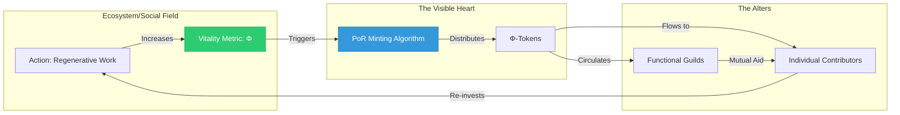
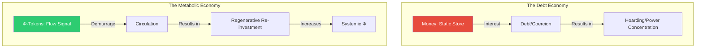
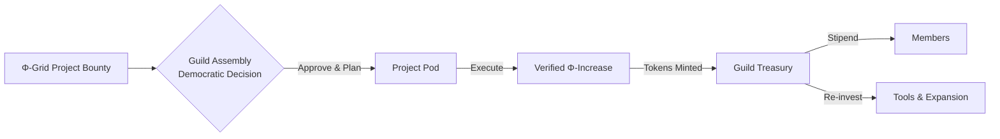
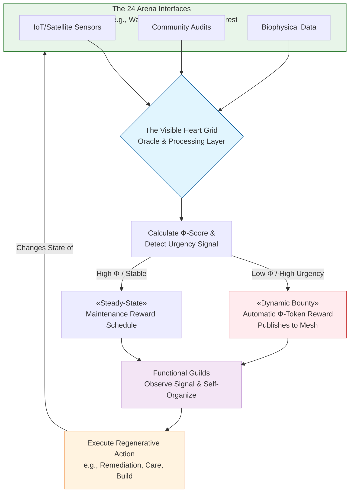

---
aeo_metadata:
  title: "Appendix T: Regenerative Economy"
  description: "An economic framework that aligns production, distribution, and consumption with ecological regeneration, social equity, and consciousness development, moving beyond extractive growth models to thriving within planetary boundaries."
  context: "Economic and ecological application of the Solarpunk Mandala, providing models for circular, regenerative economic systems that enhance rather than degrade life-support systems and human flourishing."
  key_objectives:
    - "Define principles of regenerative economics and circular production systems."
    - "Develop metrics for measuring well-being, ecological health, and consciousness development beyond GDP."
    - "Create models for regenerative finance, investment, and currency systems."
    - "Establish protocols for just transitions from extractive to regenerative economies."
    - "Design economic incentives that reward regeneration, cooperation, and consciousness expansion."
  core_concepts:
    - "Circular and Regenerative Production"
    - "Multi-Capital Accounting (Ecological, Social, Consciousness)"
    - "Commons-Based Stewardship Economics"
    - "Regenerative Finance and Complementary Currencies"
    - "Just Transition Pathways"
    - "Thriving Within Planetary Boundaries"
  ontological_foundation: "Ecological Economics & Complex Systems Theory"
  epistemic_stance: "Systems Ecology & Multi-Criteria Evaluation"
  search_queries:
    - "regenerative economic model"
    - "circular economy consciousness"
    - "multi-capital accounting framework"
    - "regenerative finance systems"
    - "just transition economic pathways"
  related_nodes:
    - "appendices/S-symbiotic-commonwealth-mesh.md"
    - "appendices/W-kinship-commons.md"
    - "framework/applied/06-economic-systems.md"
  framework_status: "Developmental"
  version: "0.9"
  last_reviewed: "2026-01-12"
---
# Appendix T: The Φ-Currency and the Regenerative Economy

## 1. Introduction: From Debt-Scarcity to Vitality-Signals
In the prevailing economic paradigm of the "Necrocene," money functions as a static, interest-bearing token of debt. This creates a **mathematical imperative for infinite growth** on a finite planet, externalizing costs onto the social and ecological commons. The system operates as a **dissociative boundary**, separating financial value from the living world it depends upon.

The **Symbiotic Commonwealth** implements a **Metabolic Economy**, where currency is a real-time signal of systemic health, not a commodity. It formalizes the original human economy—based on social credit and mutual obligation—using informatics. The core metric is the **Φ-score**, a composite measure of an ecosystem's or community's coherence, biodiversity, carbon sequestration, soil health, and social well-being. Currency is minted as a reward for actions that increase this score.

## 2. The Mechanics of the Φ-Signal

### 2.1 Proof-of-Regeneration (PoR): Minting from Life
The **Φ-Token** is issued via a **Proof-of-Regeneration (PoR)** protocol, an algorithmic process that validates positive change in the living world.
*   **The Oracle Mesh:** A network of sensors (satellite, IoT, community audits) measures key variables for a defined "arena" (e.g., a watershed). The **Φ-score** is computed from this data. A sustained positive trend triggers the minting of tokens.
*   **Example:** A guild restores a mangrove wetland. Sensors track increased biomass, biodiversity indicators, and water quality. As the Φ-score for that coastal interface rises, a corresponding block of Φ-Tokens is minted and distributed to the guild and its members, proportional to their verified contribution.
*   **Reference & Precedent:** This draws from **Heterodox Economics** (Kallis, 2019) and concepts of **Ecosystem Service Valuation**, but moves beyond mere accounting to create a direct, automatic feedback loop. It operationalizes **Corey Doctorow's** "Whuffie" (reputation-based currency) by grounding it in biophysical reality.

### 2.2 Demurrage: The Anti-Hoarding Mechanism
To prevent the accumulation and coercive power that defines traditional capital, Φ-Currency incorporates **Demurrage** (a carrying cost), as theorized by **Silvio Gesell**.
*   **The Mechanism:** Each token has a programmed decay rate (e.g., -2% per month). Its value is maintained not by hoarding, but by **velocity**—putting it to immediate productive use in the regenerative economy.
*   **The Psychological & Economic Effect:** This makes Φ-Tokens behave like a **perishable good** or a season's harvest. It incentivizes constant circulation, investment in long-term community projects, and short-term mutual aid. It structurally eliminates **usury** (profit from mere ownership of money) and the rentier class.
*   **Historical Precedent:** The **Wörgl Schwundgeld** (1932) demonstrated that demurrage currency could stimulate rapid local economic activity and full employment during the Great Depression until banned by central banks.

## 3. Mutual Aid and Universal Basic Provision

### 3.1 Universal Basic Provision (UBP): The Floor of Dignity
The Commonwealth guarantees **Universal Basic Provision (UBP)**, fulfilling the anarcho-communist principle "from each according to their ability, to each according to their need."
*   **The Mechanism:** All members receive non-tradeable **Baseline Credits** allocated to essential commons: housing in cooperatively owned units, food from local agro-ecological webs, energy from community microgrids, and healthcare. This is **distributed in-kind**, not as cash, ensuring the provision meets quality and ecological standards.
*   **Example:** A person's housing credit is applied to their dwelling in a **cohousing ecovillage**; their food credit provides a weekly share from the **community-supported agriculture (CSA) farm**. Their needs are met by the physical infrastructure of care, not a financialized market.
*   **Theoretical Foundation:** This is the practical implementation of **Peter Kropotkin's** *The Conquest of Bread*, which argues that the means of life, produced by collective labor, must belong to all.

### 3.2 The Guild System: Syndicalism in Practice
Labor is organized into voluntary, self-managing **Functional Guilds** (Anarcho-Syndicalism). With survival decoupled from wage labor, guilds form around shared purpose, craft, and the desire to increase systemic Φ.
*   **Structure & Governance:** Guilds operate on democratic principles (e.g., sociocracy). They earn Φ-Tokens by completing projects that regenerate interfaces. Tokens are used for guild expansion, tool-making, and member stipends beyond UBP.
*   **Example - The Mycelial Network Guild:** A guild specializing in bioremediation. It monitors the Φ-Grid for areas with soil toxicity alerts. It bids (with a plan and required token budget) to perform the work. Upon successful completion and verified Φ-increase, it receives payment. Guild members might include mycologists, soil scientists, and heavy equipment operators, all sharing decision-making power.
*   **Reference:** This model updates **Murray Bookchin's** concept of libertarian municipalism and **Rudolf Rocker's** visions of syndicalism for a networked, post-scarcity context, as seen in **Doctorow's** *Walkaway*.

## 4. The "Visible Heart" Grid: Stochastic Coordination
The Commonwealth replaces the opaque "Invisible Hand" with a transparent **Visible Heart Grid**—a real-time sensory and informatic system that makes the health of all commons legible and coordinates activity without central command.
*   **Real-Time Incentive Pivoting:** The grid continuously publishes Φ-scores and "Urgency Signals." A dropping Φ-score in an arena creates an automatic, rising bounty in Φ-Tokens for regenerative interventions.
*   **Example:** A sensor network detects increased salinity and reduced invertebrate populations in a stream (Φ-score declines). The grid publishes a "Waterway Health Urgent" signal with a dynamically increasing token reward. Hydrologist, riparian restoration, and pollinator guilds immediately see this and can collaboratively form a temporary "pod" to address the issue, drawn by the clear signal of need and reward.
*   **Technical Precedent:** This functions as a **distributed sensor-actuator network** and a **decentralized autonomous organization (DAO)** for planetary health. It applies **complexity economics** and **stigmergic coordination** (signaling used by ants and termites) to human-scale problems.

## 5. Daily Life: The Experience of the Commonwealth
*   **Morning:** You wake in your **passive-solar community house**. Breakfast includes food from your UBP share. You check the **Visible Heart dashboard**: your neighborhood's Φ-score is steady, but a regional reforestation project your guild contributed to has triggered a token distribution.
*   **Workday:** You join your **Digital Commons Guild** meeting. You're developing open-source algorithms for the Φ-Grid. Your work today earns personal Φ-Tokens and guild reputational weight. In the afternoon, you use 50 tokens to commission a custom piece of furniture from the **Woodworkers' Guild**.
*   **Evening:** You attend a neighborhood assembly to discuss allocating a pool of community-held Φ-Tokens to retrofit old buildings. Your voting power is weighted by your long-term, verified contribution (Governance Weight), preventing capture by transient wealth.

## 6. Conclusion: The Realization of Theoretical Communism
This model synthesizes heterodox economic thought with cutting-edge informatics to create a **post-scarcity, post-capitalist ecology**. It is a **computable architecture for anarcho-communism**, replacing the violence of debt and property with the logic of care and regeneration. The Φ-Currency is not money, but the **circulatory system of a planetary immune response**, funding the healing of the wounds of the Necrocene.

## 7. Key References & Further Reading

1.  **Graeber, D.** (2011). *Debt: The First 5,000 Years*. Melville House. *(The anthropological critique of debt-based money and the history of human economies)*.
2.  **Kropotkin, P.** (1902). *Mutual Aid: A Factor of Evolution*. *(The foundational biological and social argument for cooperation as the driver of success)*.
3.  **Doctorow, C.** (2017). *Walkaway*. Tor Books. *(A sci-fi exploration of post-scarcity, maker culture, and new social forms outside capitalism)*.
4.  **Gesell, S.** (1916). *The Natural Economic Order*. *(The original formulation of demurrage currency as "free-money")*.
5.  **Bookchin, M.** (1992). *Urbanization Without Cities: The Rise and Decline of Citizenship*. Black Rose Books. *(The theory of libertarian municipalism and communalism)*.
6.  **Rocker, R.** (1938). *Anarcho-Syndicalism: Theory and Practice*. Secker and Warburg. *(The classic text on revolutionary unionism and worker self-management)*.
7.  **Kallis, G., Demaria, F., & D’Alisa, G.** (Eds.). (2019). *Degrowth: A Vocabulary for a New Era*. Routledge. *(Contains key entries on commons, care, and post-capitalist economics)*.
8.  **Raworth, K.** (2017). *Doughnut Economics: Seven Ways to Think Like a 21st-Century Economist*. Random House. *(Provides the framework of social foundations and ecological ceilings, akin to the Φ-score's bounds)*.
9.  **Bollier, D. & Helfrich, S.** (Eds.). (2019). *Free, Fair and Alive: The Insurgent Power of the Commons*. New Society Publishers. *(On the social practices and patterns of commoning)*.
10. **Atzori, M.** (2017). "Blockchain Technology and Decentralized Governance: Is the State Still Necessary?" *Journal of Governance and Regulation*. *(Academic analysis of the political potential of DAOs, relevant to Guild and Grid structure)*.
11. **Case Study:** The **Wörgl Experiment** (1932-1933). Historical precedent for demurrage currency.
12. **Case Study:** **Community Land Trusts** and **Cohousing Models**. Practical precedents for UBP housing and communal resource management.
