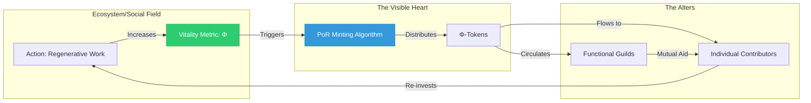
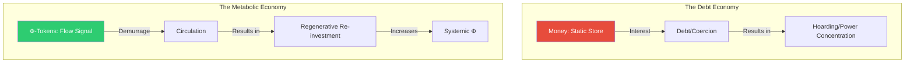
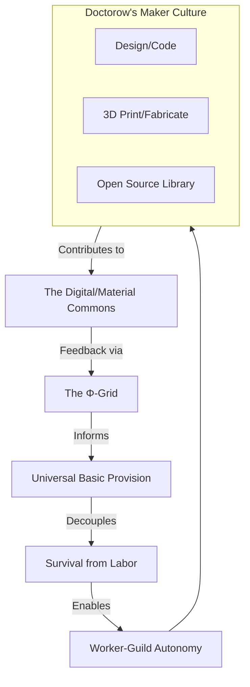

# Appendix T: The Φ-Currency and the Regenerative Economy

## 1. Introduction: From Debt-Scarcity to Vitality-Signals
In the prevailing economic paradigm of the "Necrocene," money functions primarily as a static store of value, created through interest-bearing debt. This structural design necessitates infinite extraction to satisfy a mathematical requirement for growth. 

The **Symbiotic Commonwealth** replaces this with a **Metabolic Economy**. Here, currency is not a commodity to be hoarded, but a signal of systemic health. Drawing from **David Graeber’s** anthropological history of debt, we recognize that money began as a social credit—a way to track what we owe one another in terms of care and contribution. The Commonwealth formalizes this "human economy" using high-fidelity informatics and the **$\Phi$-score**.

---

## 2. The Mechanics of the Φ-Signal
The primary unit of coordination is the **$\Phi$-Token**. Unlike fiat currency, which is issued by central banks, the $\Phi$-Token is minted by the ecosystem and the social body themselves through the **Proof-of-Regeneration (PoR)** protocol.

### 2.1 The Proof-of-Regeneration (PoR)
Following **Corey Doctorow’s** concepts of reputation-based coordination and the "Whuffie" of a post-scarcity era, the $\Phi$-Token is an accounting of a person’s contribution to the collective vitality. 
* **The Logic:** When an interface (a forest, a neighborhood, or a digital commons) transitions from entropy to integration, the change in the **$\Phi$-score** triggers the algorithmic minting of tokens.
* **The Distribution:** These tokens flow directly to the actors—individuals and guilds—whose work caused the regeneration. This ensures that "wealth" is synonymous with the verified improvement of the common field of Mind-at-Large.

### 2.2 Demurrage: Money That Breathes
To prevent the accumulation of power that **Graeber** identified as the root of state-coercion, the $\Phi$-Currency is subject to **Demurrage**. 
* **The Mechanism:** Tokens possess a natural decay rate (a "half-life"). If a token is held without being put back into circulation, it slowly dissipates. 
* **The Result:** This forces the currency to behave like energy in a biological system. It encourages immediate investment in community projects and eliminates the possibility of **Usury**, as there is no benefit to hoarding "decaying" assets.

---

## 3. Mutual Aid and Universal Basic Provision
The Commonwealth's economy is fundamentally rooted in **Peter Kropotkin’s** theory of **Mutual Aid**. Kropotkin argued that the most successful species are those that cooperate; the Commonwealth makes this cooperation technically seamless.

### 3.1 Universal Basic Provision (UBP)
Survival is decoupled from labor. Following the anarcho-communist tradition, the essentials for a dignified life—housing, nutrient-dense food, high-speed connectivity, and care—are provided as a "Commons."
* **The Experience:** Every "Alter" (individual) receives **Baseline Credits**. These are not for trade; they are a certificate of membership in the human family, ensuring that no one is coerced into labor by the threat of starvation.

### 3.2 The Guild System: Freedom of Craft
With survival guaranteed, labor becomes an act of **Self-Actualization**. Following the **Anarcho-Syndicalist** model, people join **Functional Guilds** to apply their skills (Efficacy/$Z$-axis) to the world.
* **Doctorow’s "Post-Scarcity" Logic:** In an era of automated production and local fabrication, the primary cost is no longer material, but **Creative Intent**. Guilds compete to provide the most regenerative service to the community, competing for $\Phi$-Tokens that allow them to expand their regenerative impact.

---

## 4. The "Visible Heart" Grid: Stochastic Coordination
In a non-authoritative system, we replace the "Invisible Hand" of the market—which **Graeber** noted often hides the underlying violence of property—with the **Visible Heart**. This is a real-time sensor and oracle mesh that monitors the health of the 24 Arena interfaces.

### 4.1 Real-Time Incentive Pivoting
Instead of relying on speculative prices that fluctuate based on the whims of the wealthy, the Commonwealth uses the $\Phi$-signal:
* **The Signal:** If a local watershed shows signs of pollution, the $\Phi$-score drops. 
* **The Response:** The "Reward" for cleaning that watershed automatically increases. This signal is visible to all Guilds.
* **Self-Organization:** A remediation guild pivots their resources to the watershed because it is now the most "incentivized" and "systemically urgent" task in the mesh. No central planner is required.

---

## 5. Daily Life: The Experience of the Commonwealth
Daily life in the Commonwealth is a shift from being a "Consumer" to being a "Participant."

* **Security:** You wake up in a home provided by the neighborhood assembly. Your energy and food needs are met by the local solar-mesh and food-web.
* **Contribution:** You spend your time working on a "Making" project—perhaps coding an open-source agricultural bot or assisting in a care circle. This work earns you $\Phi$-Tokens.
* **Agency:** You use your $\Phi$-Tokens to support a friend’s new theater project or to request a specialized 3D-printed component from an engineering guild.
* **Legacy:** Your long-term reputation (Governance Weight) grows as the systems you helped build thrive, giving your voice more resonance in the regional assemblies.

---

## 6. Conclusion: The Realization of Theoretical Communism
This economic model represents the "high-tech" realization of the anarcho-communist dream. By transcluding the insights of **Kropotkin** (Mutual Aid), **Graeber** (Debt-free social credit), and **Doctorow** (Post-scarcity Maker culture), the Solarpunk Mandala provides a computable, stable, and non-authoritative architecture for human flourishing. 

It is a world where we have "withered the state" by making its functions—coordination, security, and distribution—the emergent, transparent properties of a conscious, regenerative mesh.
