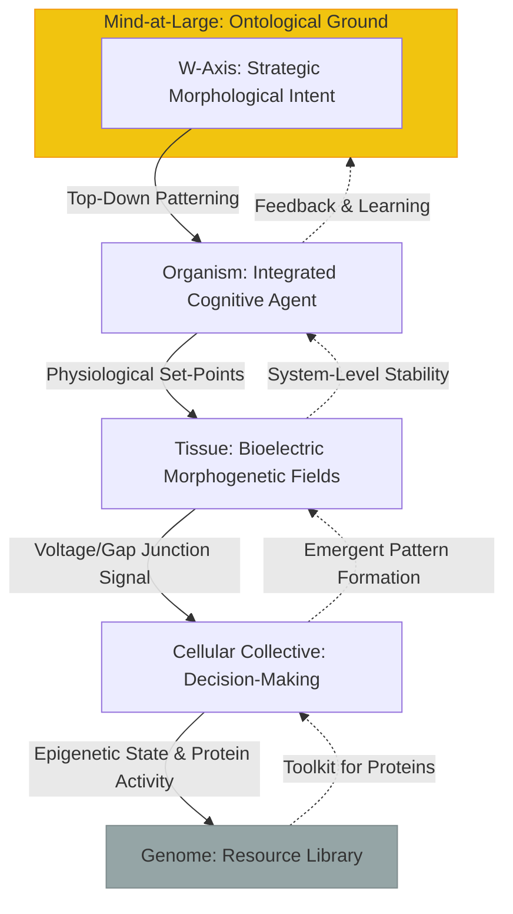
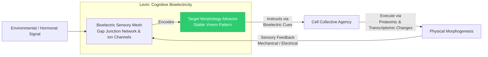
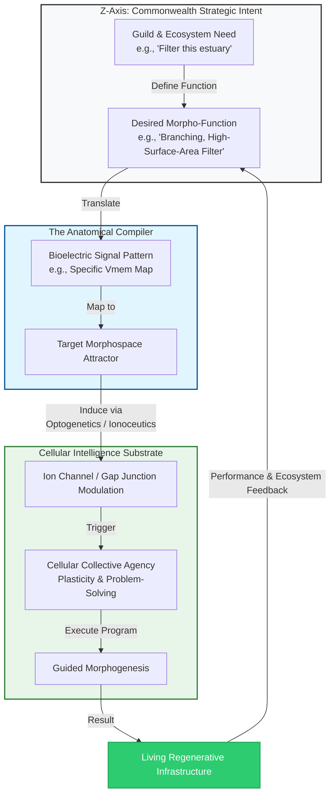

# Appendix U: The Alter’s Biology – Post-Materialist Morphogenesis

## 1. Beyond the Genome: The Theory of Biological Relativity
Following **Denis Noble**, the Commonwealth rejects the "Modern Synthesis" of gene-centrism. The organism is not a "lumberning robot" controlled by selfish genes, but a multi-scale, cognitive system where causation is fundamentally **reciprocal and context-dependent**.

*   **The Musical Metaphor:** The genome is not a blueprint; it is a set of "organ pipes." The organism (the player) pulls the stops, guided by environmental, physiological, and bioelectric cues, to create the music of life. Gene expression is an **output** of the system's state, not its sole director.
*   **Downward Causation:** Higher-level processes (tissue environment, organ function, organismic behavior) exert **constraining and instructive influences** on lower-level components (cells, proteins, genes). For example, the bioelectric pattern of a limb field instructs local cells to proliferate or differentiate to achieve that morphological goal, regardless of the cells' origin.
*   **Biological Relativity:** There is no single, privileged level of causality (e.g., the gene). Explanations in biology are **scale-relative**. What explains a heart attack (ion channel failure, coronary blockage, chronic stress, socioeconomic factors) depends on the level at which you are asking the question. The Alter operates across all levels simultaneously.

---

## 2. Bioelectric Agency: The Cognitive Glue
The Commonwealth utilizes **Michael Levin’s** discoveries to define the **Sensory Mesh**. The body is a **cognitive collective** of cells coordinated by dynamic, non-neural bioelectric networks that store target morphologies in a spatial memory.

*   **The Bioelectric Code:** Cells communicate via ion flows (H+, Na+, K+, Cl-) across gap junctions, creating resting potential patterns (Vmem) across tissues. These **pre-patterns** are information-rich, encoding future anatomical structures (e.g., "where an eye should form") long before differentiation begins.
*   **Target Morphologies as Attractors:** The bioelectric network behaves like a **Hopfield network** or a recurrent neural network, with certain voltage patterns representing stable attractor states (e.g., "complete planarian," "normal frog face"). These attractors are resilient; the system will correct perturbations (e.g., injury, tumorous growth) to return to the target morphology.
*   **Cellular Intelligence:** This process does not require a central brain. Somatic cells are **competent problem-solvers**. When presented with a novel morphological goal (induced via bioelectric manipulation), they can explore morphological space via plasticity and cooperation to achieve it, demonstrating a form of **basal cognition**.

---

## 3. Technology & Economy: The Anatomical Compiler
In the Regenerative Economy, we move from "Manufacturing" to **"In-forming."** By hacking the bioelectric software that runs on the hardware of cellular collectives, we can guide biological growth to create adaptive, self-repairing infrastructure.

*   **The Anatomical Compiler:** This is a conceptual interface that translates a human functional goal (e.g., "a bridge that self-heals") into a **bioelectric stimulus protocol**. It identifies the key ion channels or gap junctions to modulate in a starter cell mass (e.g., a engineered blastema) to initiate the desired morphogenetic program.
*   **Regenerative Infrastructure:** Imagine growing **living buildings** from coral-like scaffolds, **water filtration systems** from tuned wetland biomes, or **self-organizing roads** from symbiotic fungal networks. The growth process is low-energy, carbon-negative, and inherently adaptive.
*   **Example - Levin's Wormbots:** Experiments have created synthetic living machines (**xenobots**) from frog skin cells. These cell collectives, designed by AI and shaped by bioelectric cues, exhibit coordinated locomotion, object manipulation, and self-replication—proof-of-concept for guided morphogenesis without genetic engineering.

---

## 4. Psychopathology: Dissociative Bio-Feedback
Disease, from cancer to degeneration, can be reframed as a **breakdown in the bioelectric communication that maintains the unity of the cellular collective**. The Commonwealth uses this lens for diagnosis and healing.

*   **Cancer as Bioelectric Dissociation:** Levin's lab has shown that tumorigenesis is often preceded by a **specific breakdown in bioelectric connectivity**. Cells at a future tumor site become depolarized, breaking gap junction communication and causing them to "forget" they are part of the larger body. They default to a primitive, proliferative "somatic agenda." Remarkably, **restoring the correct bioelectric pattern can cause tumors to normalize and reintegrate into healthy tissue, without killing the cells.**
*   **The Φ-Grid as Healing Protocol:** The Commonwealth's **Φ-Grid**—a technology for measuring and influencing biofield coherence—is used to detect areas of bioelectric dissociation (low coherence, aberrant patterns). It then applies targeted **"morphogenetic rescues"** via electromagnetic fields, subtle energy cues, or molecular ionoceutics to rebroadcast the "healthy body pattern" and reintegrate the dissociated cellular cluster.
*   **A New Etiology:** This expands pathology beyond mere molecular breakdowns (broken gene, toxic molecule) to include **informatic and cognitive failures** at the tissue level. Healing therefore requires **re-establishing correct communication and information flow**, not just attacking pathogenic actors.

## 5. Key References & Further Reading

1.  **Noble, D.** (2006). *The Music of Life: Biology Beyond the Genome*. Oxford University Press. *(The foundational text on biological relativity and the critique of genetic reductionism)*.
2.  **Noble, D.** (2012). "A theory of biological relativity: no privileged level of causation." *Interface Focus*. *(The formal scientific paper outlining the theory)*.
3.  **Levin, M.** (2012). "Molecular bioelectricity in developmental and regeneration: New tools and recent discoveries." *Bioessays*. *(Introduction to bioelectric control of form)*.
4.  **Levin, M.** (2019). "The Computational Boundary of a 'Self': Developmental Bioelectricity Drives Multicellularity and Scale-Free Cognition." *Frontiers in Psychology*. *(Frames bioelectricity as a substrate for basal cognition and collective intelligence)*.
5.  **Levin, M. et al.** (2022). "Endogenous Bioelectric Signaling Networks: Exploiting Voltage Gradients for Control of Growth and Form." *Annual Review of Biomedical Engineering*. *(Current, comprehensive review of the mechanisms and potential applications)*.
6.  **Chernet, B. & Levin, M.** (2013). "Endogenous voltage potentials and the microenvironment: bioelectric signals that reveal, induce and normalize cancer." *Journal of Clinical & Experimental Oncology*. *(Key paper on cancer as a bioelectric disease)*.
7.  **Pezzulo, G. & Levin, M.** (2016). "Top-down models in biology: explanation and control of complex living systems above the molecular level." *Journal of The Royal Society Interface*. *(Connects downward causation, agency, and control in biological systems)*.
8.  **Kaiser, D.** (2014). "The same and not the same: identity and modularity in bioelectric networks." *Molecular Biology of the Cell*. *(On how bioelectric networks establish anatomical identity and boundaries)*.
