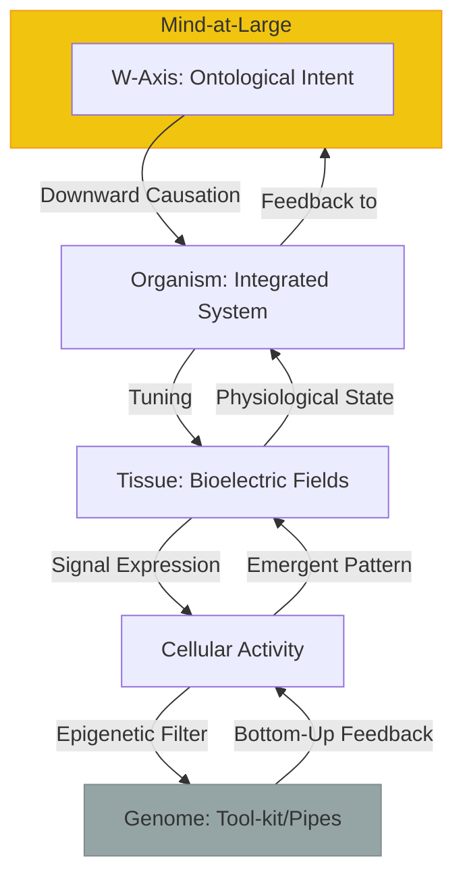
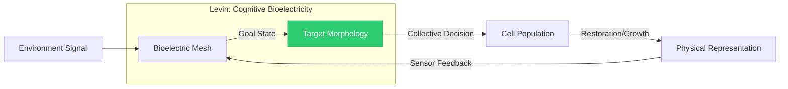
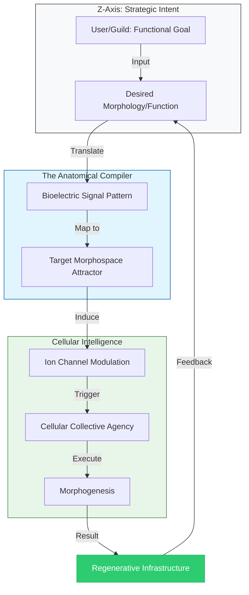

# Appendix U: The Alter’s Biology – Post-Materialist Morphogenesis

## 1. Beyond the Genome: The Theory of Biological Relativity
Following **Denis Noble**, the Commonwealth rejects the "Modern Synthesis" of gene-centrism. The Alter is not a "lumbering robot" controlled by selfish genes, but a multi-scale system where causation flows in both directions.

* **The Musical Metaphor:** The genome is not a blueprint; it is a set of "organ pipes." The organism is the player pulling the stops to create the music of life.

---

## 2. Bioelectric Agency: The Cognitive Glue
The Commonwealth utilizes **Michael Levin’s** discoveries in bioelectricity to define the **Sensory Mesh**. The body is a "collective intelligence" of cells coordinated by non-local bioelectric fields that store "target morphologies."

---

## 3. Technology & Economy: The Anatomical Compiler
In the Regenerative Economy, we move from "Manufacturing" to "In-forming." By utilizing Levin's work on bioelectric software, we treat biological systems as programmable entities that "grow" the Commonwealth's infrastructure.

---

## 4. Psychopathology: Dissociative Bio-Feedback
Levin’s work shows that cancer is a "bioelectric dissociation"—where cells forget they are part of a larger body. The Commonwealth uses the **Φ-Grid** as a healing protocol to re-integrate dissociated cellular clusters into the whole-system awareness.
