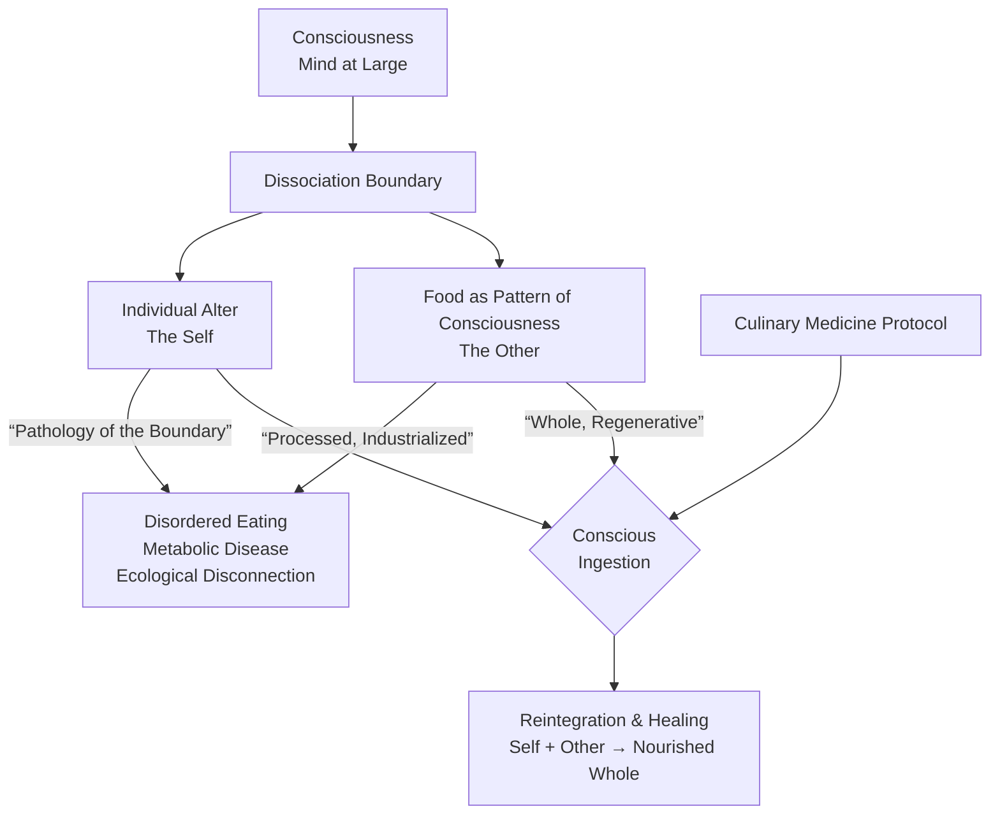
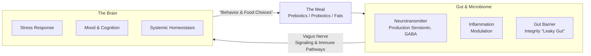
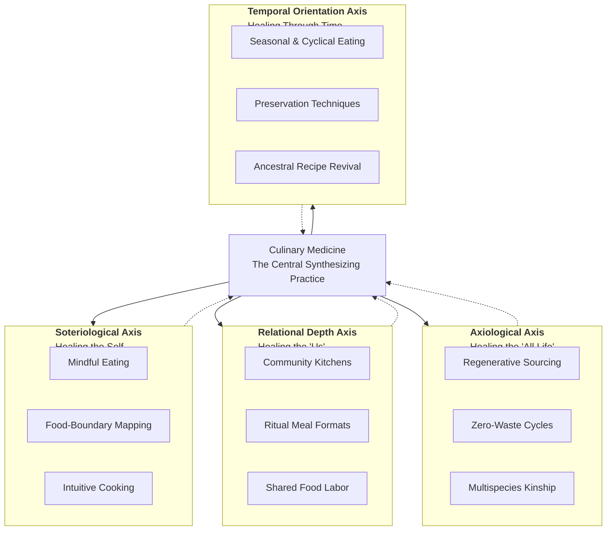

---
aeo_metadata:
  title: "Appendix V: Culinary Medicine"
  description: "An integrative approach to health and well-being that treats food as both physical nourishment and consciousness medicine, combining nutritional science, culinary arts, and contemplative practice for holistic healing."
  context: "Health and wellness application of the Solarpunk Mandala, providing frameworks for using food preparation, consumption, and sharing as practices for physical health, emotional balance, and consciousness development."
  key_objectives:
    - "Define principles of culinary medicine that integrate nutrition, mindfulness, and community."
    - "Develop protocols for food-based practices that support physical health and consciousness states."
    - "Create models for regenerative food systems that heal both people and planet."
    - "Establish culinary rituals that enhance gratitude, connection, and presence."
    - "Bridge traditional food wisdom with modern nutritional science and consciousness research."
  core_concepts:
    - "Food as Consciousness Interface"
    - "Mindful Eating and Preparation"
    - "Nutritional Alchemy and Bioenergetics"
    - "Regenerative Food Systems"
    - "Culinary Rituals and Community Bonding"
    - "Food as Medicine and Sacrament"
  ontological_foundation: "Holistic Health & Embodied Cognition"
  epistemic_stance: "Experiential Nutrition & Culinary Epistemology"
  search_queries:
    - "culinary medicine consciousness"
    - "mindful eating practices"
    - "food as medicine framework"
    - "regenerative food systems health"
    - "culinary rituals for well-being"
  related_nodes:
    - "appendices/M-idealist-psychopathology.md"
    - "appendices/Q-consciousness-infrastructure.md"
    - "practices/daily/02-mindful-nourishment.md"
  framework_status: "Developmental"
  version: "0.8"
  last_reviewed: "2026-01-12"
---
# **Appendix V: Culinary Medicine – A Synthesis of Nourishment, Healing and Regeneration**

*"Let food be thy medicine and medicine be thy food."* — Hippocrates

**Primary Function:** To integrate the entire food cycle—from soil to plate to compost—as a conscious, lived practice that repairs dissociative boundaries, fortifies the Embodied Foundations, and activates regenerative cycles across the SolarPunk Mandala Tesseract.

**Executive Summary:** Culinary Medicine is posited not as a mere nutrition guide but as a **synthesis discipline** and a primary protocol for Boundary Healing. It treats eating as the fundamental act where consciousness (the individual alter) consciously incorporates other patterns of consciousness (food, ecosystem), making it a critical site for mending the fragmentation between self, community, and nature. This appendix provides the theoretical grounding, evidence-based science, practical culinary toolkit, and explicit integration matrix for implementing Culinary Medicine within the Mandala's ethical and geometric framework.

---

## **1. Theoretical Grounding: Food as Boundary Medicine**

This section grounds culinary medicine in the **consciousness-first ontology** of the SolarPunk Mandala, viewing the act of eating as a primary site for healing the fundamental dissociations between mind, body, community, and ecology.

### **1.1 Ontological Foundation: Consciousness Ingests Itself**
The Mandala begins with Analytic Idealism: consciousness is fundamental. From this perspective, food is not external "fuel." **Eating is a profound process where conscious experience (the human alter) ingests and incorporates other patterns of conscious experience (the plant, animal, ecosystem).** A meal is an intimate communion across a **dissociation boundary**, a ritual where "self" and "other" literally become one. Modern disorders of eating—addiction, anorexia, metabolic disease—are thus **pathologies of this boundary**, manifestations of a distorted relationship between the individual alter and the larger conscious field from which it is never truly separate.

### **1.2 The Embodied Foundations Core: The Non-Negotiable Threshold**
The Mandala's **Embodied Foundations Core (ॐ)** is the practical anchor. Culinary medicine is the primary **protocol for elevating the Nourishment foundation**. It directly answers the immediate, embodied need, ensuring that the journey toward integration starts with the stability of the physical vessel. When Nourishment scores below a stable threshold (<2), culinary medicine provides the urgent, practical intervention to raise it, making higher-order work possible.

### **1.3 Boundary Health as Metabolic Health**
The "boundary" between self and food is most physically instantiated in the gut lining and the microbiome. **Intestinal permeability ("leaky gut")** is a literal boundary disturbance linked to systemic inflammation, autoimmune conditions, and mood disorders. Culinary medicine uses specific foods and preparations (e.g., bone broth, fermented foods, soluble fiber) to repair this physical boundary, demonstrating how metaphysical boundary healing has direct biochemical correlates.

---

## **2. The Evidence-Based Science of Food-as-Medicine**

Culinary Medicine is an evidence-based field blending the art of food with the science of medicine to prevent, treat, and restore well-being.

*   **Medical Efficacy**: Specific dietary patterns are foundational therapy for chronic diseases:
    *   **Mediterranean & DASH Diets**: First-line intervention for hypertension, cardiovascular risk reduction, and type 2 diabetes management.
    *   **Anti-Inflammatory Protocols**: Key component in managing autoimmune and inflammatory conditions like rheumatoid arthritis.
    *   **Ketogenic Diets**: Established therapy for drug-resistant epilepsy; investigational for neurological and psychiatric conditions.
*   **Mechanistic Pathways**: Food components act on precise physiological systems:
    *   **Brain & Cognition**: Omega-3 fatty acids (DHA, EPA) are critical for **neuronal membrane integrity** and synaptic plasticity. Antioxidant and polyphenol-rich diets reduce **oxidative stress** and neuroinflammation. The brain's health is inextricably linked to systemic **metabolic health** via insulin sensitivity and glucose regulation.
    *   **Gut-Brain Axis**: The microbiome produces neurotransmitters (e.g., serotonin, GABA) and communicates with the brain via the vagus nerve and immune pathways. Prebiotic fibers and probiotic foods directly modulate this axis, influencing stress response, mood, and cognition.

---

## **3. Culinary Application: The Practical Toolkit**

This discipline translates science into empowered daily practice, focusing on the "how-to" of healing nourishment.

### **3.1 Process & Skills**
Education focuses on **hands-on competency**:
*   **Foundational Skills**: Knife skills, mastery of moist/dry heat cooking methods (sautéing, steaming, roasting), flavor-building without excess salt/sugar.
*   **Therapeutic Cooking**: Preparing condition-specific meals (e.g., low-FODMAP, renal-friendly, energy-dense for cachexia).
*   **Mindful Practice**: Cooking and eating as meditation—attending to textures, aromas, and tastes to reintegrate sensation and presence.

### **3.2 Ingredients & Focus**
Emphasis is on **whole, minimally processed, information-rich foods**:
*   **Prioritized Categories**: Leafy greens, cruciferous vegetables, berries, legumes, whole grains, tree nuts, seeds, and fatty fish.
*   **The "Food-Pharmacy"**: Specific ingredients for targeted functions:
    *   **Turmeric (curcumin)**: Potent anti-inflammatory.
    *   **Garlic & Onions**: Prebiotic sulfur compounds.
    *   **Fermented Foods (kimchi, kefir)**: Probiotics and enzymes.
    *   **Dark Leafy Greens (kale, chard)**: Magnesium, folate, and phytonutrients.

### **3.3 Instruments & Technology**
*   **Basic Toolkit**: A chef's knife, paring knife, cutting board, cast-iron skillet, and saucepan form the essential instrumentarium.
*   **Digital Scaffolding**: **Virtual Culinary Medicine Toolkits (VCMTs)** use animated videos and infographics to teach skills and concepts, enabling scalable education. This aligns with the SolarPunk principle of **appropriate technology as scaffolding** for autonomy and community learning.

---

## **4. Synthesis with the SolarPunk Mandala Geometry**

Culinary Medicine is a synthesizing thread woven through the Mandala's architecture.

| Mandala Element | How Culinary Medicine Activates It | Practical Example |
| :--- | :--- | :--- |
| **ॐ Core (Nourishment)** | Primary protocol for stabilizing this first foundation. | A **Community Kitchen** providing free, nourishing meals to raise the foundation score of a neighborhood from <2 to ≥3. |
| **Axiological Axis (Regenerative Care)**| Connects food choices to land stewardship. | Sourcing from **regenerative agriculture** and **local food webs**, treating farmers as essential healthcare partners. |
| **Relational Depth Axis**| Builds community and heals isolation. | **Ritual Meal Formats** (Gratitude Circles, Silent Suppers) that activate the **Intersubjective Gateway (Cube 6)**. |
| **Soteriological Axis (Self-Understanding)**| Heals internal fragmentation. | **Food-Boundary Mapping** exercises to identify and repair emotional or disordered eating patterns. |
| **Temporal Orientation Axis**| Honors deep time and cycles. | **Seasonal eating**, seed saving, and preservation (fermenting, canning) as acts of temporal solidarity. |
| **Boundary Healing (Primary Function)**| Operates at all system levels. | Repairs the **gut lining** (physical), **mind-body split** (psychological), **social isolation** (communal), and **human-nature rift** (ecological). |

---

## **5. Case-Study Outline: The Regenerative Community Clinic**

**Context:** A suburban "food desert" with high rates of metabolic syndrome and social isolation.
**Mandala Diagnosis:**
*   **Axes:** Strong Axiological contraction (dependency on processed food supply chain) and Relational Depth contraction.
*   **Foundation:** Nourishment score ~1.8.
*   **Tesseract Focus:** Underactive LR (SHELLS - infrastructure) and LL (CULTURE).
**Intervention Protocol:**
1.  **Stage 1 (Crisis):** Activate **Boundary Medicine** via a mutual-aid meal delivery program using simple, nourishing recipes.
2.  **Stage 2 (Stabilization):** Launch a **Community Kitchen & Culinary Pharmacy** offering weekly cooking classes based on the Culinary Medicine Protocol.
3.  **Stage 3 (Integration):** Establish a **Regenerative Food Loop:** Kitchen compost feeds a community garden, which supplies the kitchen. Introduce **Food Currency** where volunteer labor in the garden or kitchen earns credits for meals.
**Outcome Metrics (12-18 months):** Nourishment foundation score ≥3. Measurable improvements in community-coherence metrics and reductions in local healthcare utilization for diet-related conditions.

---

## **6. Conclusion: The Daily Praxis of Conscious Incorporation**

Within the SolarPunk Mandala, Culinary Medicine is the daily praxis of **conscious incorporation**. It is how a dissociated alter of Mind-at-Large can begin to heal its boundaries through the most fundamental act: turning the conscious patterns of the world into the very substance of its own embodied consciousness. It answers the call for a new, holistic healthcare that is preventative, participatory, and planet-healing—moving us toward integration, one mindful, nourishing, and regeneratively sourced meal at a time.

---

## **7. References**

1.  Monteiro, C. A., et al. (2019). "Ultra-processed foods, diet quality, and human health." *Bulletin of the World Health Organization*.
2.  Estruch, R., et al. (2018). "Primary Prevention of Cardiovascular Disease with a Mediterranean Diet Supplemented with Extra-Virgin Olive Oil or Nuts." *New England Journal of Medicine*.
3.  Marx, W., et al. (2021). "Diet and depression: exploring the biological mechanisms of action." *Molecular Psychiatry*.
4.  Cryan, J. F., et al. (2019). "The Microbiota-Gut-Brain Axis." *Physiological Reviews*.
5.  La Puma, J. (2016). "What is Culinary Medicine and What Does It Do?" *Population Health Management*.
6.  Polak, R., et al. (2016). "A Cross-Sectional Assessment of Medical Students' Knowledge of Culinary Medicine." *American Journal of Lifestyle Medicine*.
7.  Razavi, A. C., et al. (2021). "Leveraging the Power of Culinary Medicine as a Tool for Medical Education and Community Health." *American Journal of Health Promotion*.

---

## **8. Living Archive & Contribution**

This appendix is a living document. Contributions are welcomed to the following repositories:

*   **Boundary-Healing Recipes:** Tagged by the ethical axis or foundation they primarily support.
*   **Community Kitchen Models:** Design blueprints, operational guides, and case studies from diverse bioregions.
*   **Educational Modules:** Lesson plans for teaching Culinary Medicine skills to different age groups and communities.
*   **Research Links:** Ongoing studies linking specific food practices, microbiome health, and psychological or social well-being.
