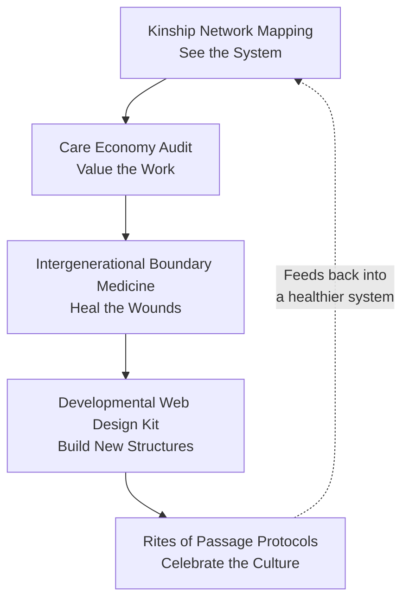
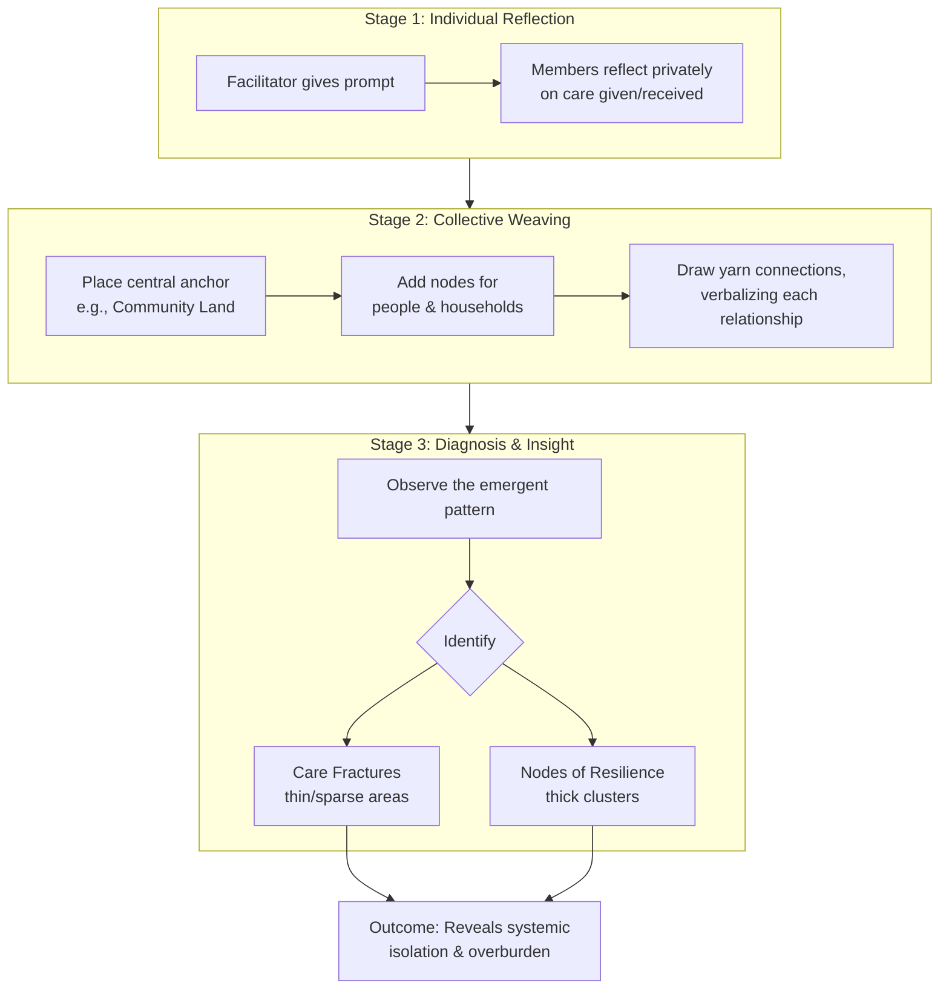
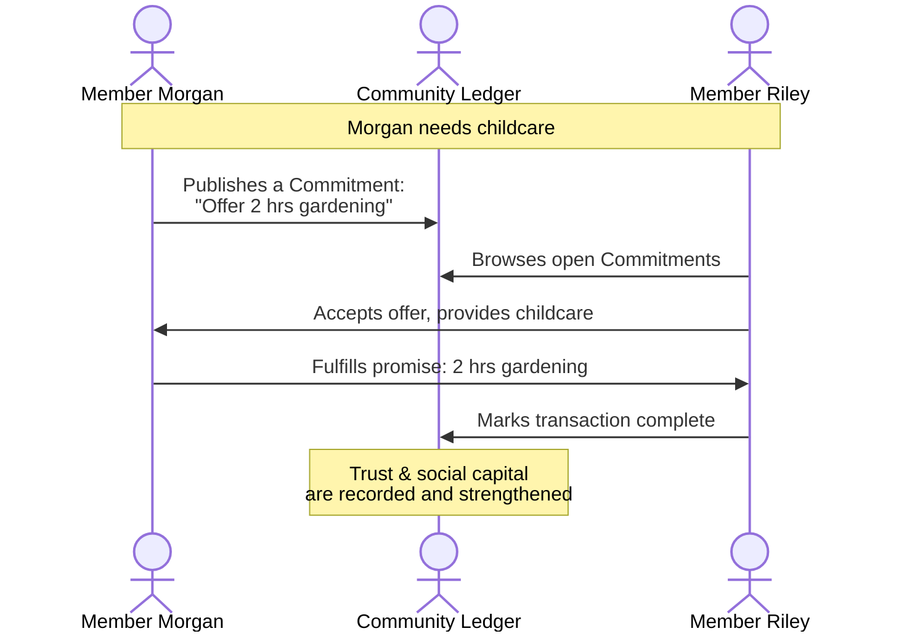
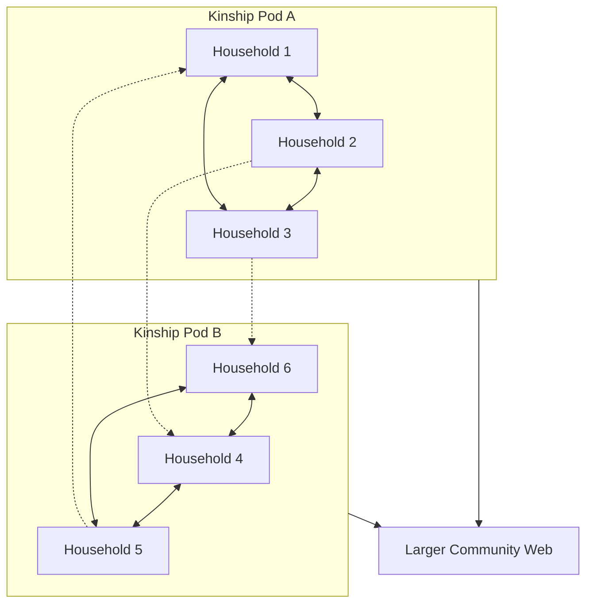
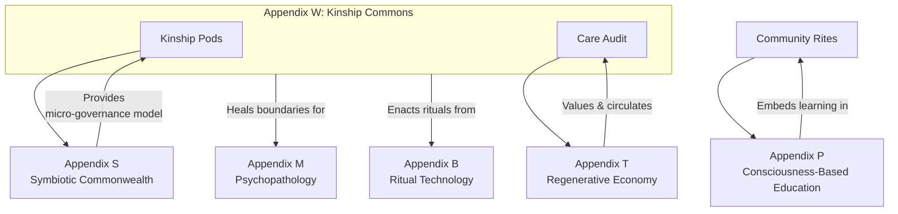

# Appendix W: The Kinship Commons – Regenerating Care & Family

## Primary Function
To dismantle the privatized, nuclear-family model and redesign kinship, caregiving, and intergenerational relationships as a **regenerative community commons**. This appendix provides the tools to heal familial trauma, redistribute care labor ethically, and cultivate "chosen family" networks that support lifelong human development and ecological belonging.

## Core Principles
*   **Care as a Commons:** Care work is a collective resource and responsibility, not a private burden.
*   **Lineage & Liberation:** Healing intergenerational trauma and consciously passing on regenerative wisdom are dual axes of kinship work.
*   **Developmental Webs:** Humans develop best within a "web" of diverse, multi-age relationships.
*   **More-than-Human Kinship:** True kinship extends to the land, ecosystems, and non-human beings.

## 1. Tool: Kinship Network Mapping
### Core Practice
A facilitated, visual process where community members co-create a map of their collective care ecosystem using symbols and colored yarn to represent the flow of resources (care, material support, knowledge, emotional sustenance).

### How It's Practiced
1.  **Individual Mapping:** Each person privately notes who they give to and receive from.
2.  **Collective Weaving:** In a group circle, participants add nodes (people/households) to a large canvas and connect them with yarn, verbalizing each relationship.
3.  **Diagnosis & Insight:** The group observes the emergent pattern to identify robust "nodes of resilience" and fragile "care fractures."

### Applied Example & References
*   **Portland's "Cully Community Care Network"** used mapping to transform a central hub model into a resilient web of neighborhood "pods."
*   Methodologies like **"Tree of Life"** (used with Aboriginal communities) provide non-traumatic frameworks for exploring support systems.
*   **Regenerative Community Design** emphasizes mapping relational infrastructure as critical capital.

### Mandala-Derived Benefits & Integration
*   **Operationalizes the Dialectical Axis:** Makes invisible relational dynamics (the ideal) visible and material.
*   **Applied Boundary Medicine:** Heals dissociation between private burden ("my problem") and communal reality ("our pattern")—directly applying **Appendix M**.
*   The map becomes a "living face" of the community's current relational geometry within the Tesseract.

---

## 2. Tool: The Care Economy Audit
### Core Practice
A protocol to quantify, value, and reorganize the non-monetary flow of care work within a community, establishing a local **grammar of value**.

### How It's Practiced
1.  **Cataloging Contributions:** Members list all non-monetary contributions (childcare, repairs, emotional labor, land stewardship).
2.  **Defining Local Value:** Through facilitated dialogue, the community creates a **Value Constitution** to determine relative worth (e.g., Is one hour of emotional labor equal to one hour of gardening?).
3.  **Creating a Ledger of Commitments:** A lightweight **"Commitment Ledger"** logs specific, future promises between members (e.g., "Member A promises 4 hours of childcare to Member B next Thursday"). The currency is trust.

### Applied Example & References
*   **BerkShares** (Massachusetts local currency) demonstrates place-based value.
*   **Cascadia Now!** bioregional network uses a "Care Credit" system where watershed cleanup earns credits for requesting help.
*   **Social Ecology's "Commitment Pooling Protocol"** provides a framework for tracking reciprocal promises.

### Mandala-Derived Benefits & Integration
*   **Bridges to the Regenerative Economy:** Prevents the Kinship Commons from becoming an extractive "free labor pool" by integrating care into the community's metabolic flows (**Appendix T**).
*   **Applies Game-Theoretic Principles:** Shifts coordination from extractive to regenerative by designing for balanced reciprocity (**Appendix R**).
*   **Operationalizes Analytic Idealism:** Treats care commitments as real, "first-class" entities in the community's shared consciousness.

---

## 3. Tool: Intergenerational Boundary Medicine
### Core Practice
A set of facilitated rituals and dialogues designed to heal the **temporal dissociation** that severs generations, trapping trauma and blocking wisdom.

### How It's Practiced
*   **Ritual of Listening Circles:** Structured sessions where different generations take turns speaking and witnessing prompts like "What from your childhood are you grieving?" (elders) and "What future are you afraid you will never see?" (youth).
*   **Skill-Based Re-Membering:** An elder teaches a tangible skill (woodworking, cooking an ancestral recipe) to youth, focusing on joint **attention and embodied practice** to transmit wisdom without traumatic narrative.
*   **The "Lineage Letter" Practice:** A writing ritual where individuals write to an ancestor to express pain, and then write a reply from the ancestor's perspective offering healing wisdom.

### Applied Example & References
*   **"Rites of Passage" programs** in Indigenous communities and organizations like the **Weaving Earth Center for Relational Education** formally mend the rupture between adolescence and adulthood.
*   **"Rings of Growth" drawing methodology** used by Tiwi Islands women to connect childhood memories to hopes for their children.
*   **Narrative therapy and art therapy** methods for safely externalizing and processing trauma.

### Mandala-Derived Benefits & Integration
*   **Applied Ritual Technology:** Directly uses **Appendix B (Ritual as Cube-Dissolving Technology)** to dissolve the "cubes" of segregated age groups and frozen historical trauma.
*   **Heals Developmental Boundaries:** Repairs the fractures that block the flow of consciousness and culture across generations, activating the **Learning Tesseract (Appendix O)**.
*   **Somatic Axis Practice:** Uses embodied, creative action to stabilize the Restoration foundation and facilitate healing.

---

## 4. Tool: The Developmental Web Design Kit
### Core Practice
A concrete, structural protocol for forming the basic unit of the Kinship Commons: the **"Kinship Pod"** or **"Family Guild."**

### How It's Practiced
1.  **Pod Formation:** A small group (3-8 households) with shared values and complementary needs commits to deeper mutual aid.
2.  **Chartering:** Using **Sociocratic** consent-process, the pod co-creates a **"Pod Charter"**—a living document outlining values, shared practices (e.g., weekly meal, childcare swap), conflict resolution, and resource sharing agreements.
3.  **Pod Rhythms:** Establish low-burden, consistent rhythms (weekly check-ins, monthly workdays).
4.  **Web-Weaving:** Intentionally connect pods into a larger network via overlapping members, creating redundancy and preventing clique formation.

### Applied Example & References
*   **Symbiosis Network** uses **"Pod Mapping"** exercises to define core members, allies, and resources for mutual aid assemblies.
*   **Co-housing models (Dancing Rabbit Ecovillage, Auroville)** provide real-world templates for shared infrastructure and micro-scale governance.
*   **Bioregionalism** principles root pod identity in place-based ecology.

### Mandala-Derived Benefits & Integration
*   **Instantiates Mesh Governance:** Each pod is a practicing cell of the **Symbiotic Commonwealth (Appendix S)**.
*   **Applies the Epistemic Tesseract:** The chartering process transforms abstract values (soteriology) into concrete agreements (axiology) through collaborative design (**Appendix N**).
*   **Builds "Edge Strength":** Strengthens the connections (edges) between household vertices in the community Tesseract, increasing collective resilience.

---

## 5. Tool: Rites of Passage Protocols
### Core Practice
The community-wide design and enactment of ceremonies to mark key lifecycle transitions, re-embedding the individual's journey within the cycles of the community and the land.

### How It's Practiced
*   **Community Design Sprint:** When a transition is approached (puberty, eldership), a council forms to design a rite. They ask: What needs to be released? What wisdom welcomed? What responsibilities activated?
*   **The Role of the Village:** The rite involves specific roles for non-family members (mentors, witnesses, celebrants), dissolving the nuclear family's privatized burden.
*   **Land-Based Anchor:** The ceremony is tied to a specific local natural feature and a seasonal moment (solstice, harvest), forging a bond with the **more-than-human kinship network**.

### Applied Example & References
*   The **"Vision Fast"** or wilderness solo ceremony, as adapted by the **School of Lost Borders**, is a profound community-supported rite of passage.
*   **Earthship communities** and **Transition Town initiatives** often integrate communal spaces and seasonal rhythms that naturally foster collective celebration.
*   **Cultural Continuity** is a key design principle in regenerative frameworks for rebuilding community resilience.

### Mandala-Derived Benefits & Integration
*   **Synthetic Ritual Technology:** A ultimate synthesis of **Appendix B (ritual)**, **Appendix M (healing temporal dissociation)**, and **Appendix O (marking developmental progression)**.
*   **Performs Meta-Narrative Mapping:** Enacts the replacement of the Necrocene story of isolation with a Symbiotic story of belonging (**Appendix F**).
*   **Creates a Living Campus:** Turns the community itself into an active site of **Consciousness-Based Education (Appendix P)**, rooting identity in place and relation rather than consumer ego.

## Integration Summary

This suite of tools forms a complete cycle for regenerating kinship:
1.  **See the System** (Kinship Network Mapping)
2.  **Value its Core Economy** (Care Economy Audit)
3.  **Heal its Wounds** (Intergenerational Boundary Medicine)
4.  **Build New Structures** (Developmental Web Design Kit)
5.  **Celebrate the New Culture** (Rites of Passage Protocols)

The Kinship Commons provides the essential relational substrate where the Mandala's principles—from Analytic Idealism to Regenerative Economics—are lived, tested, and embodied daily.
