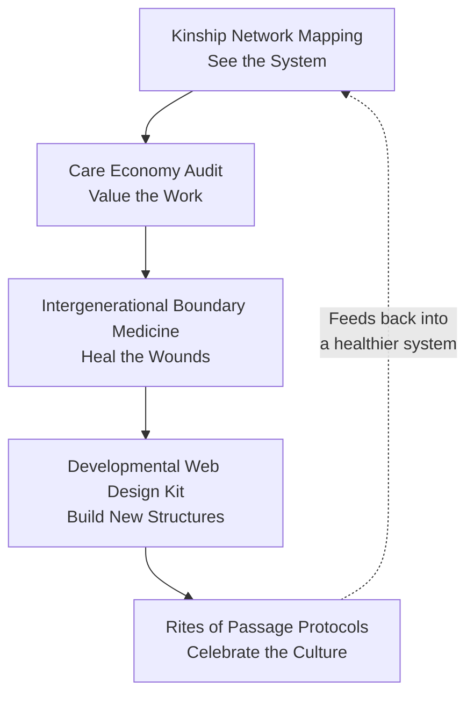
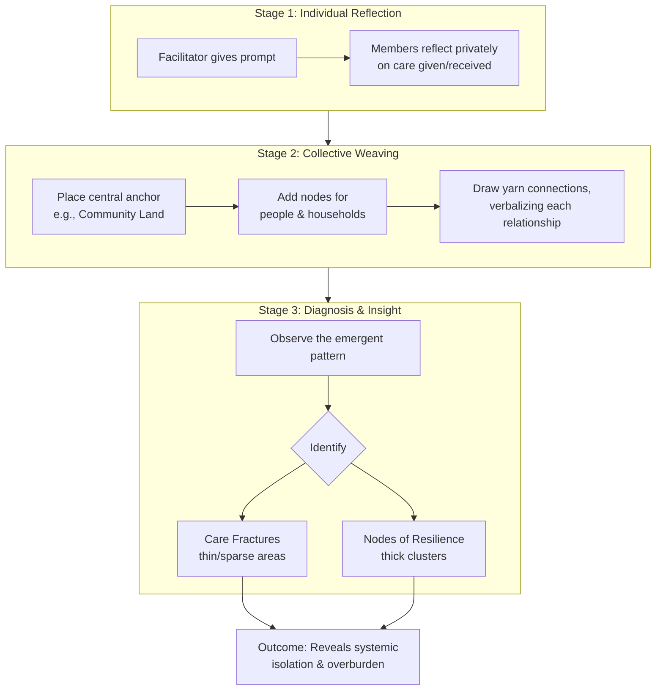
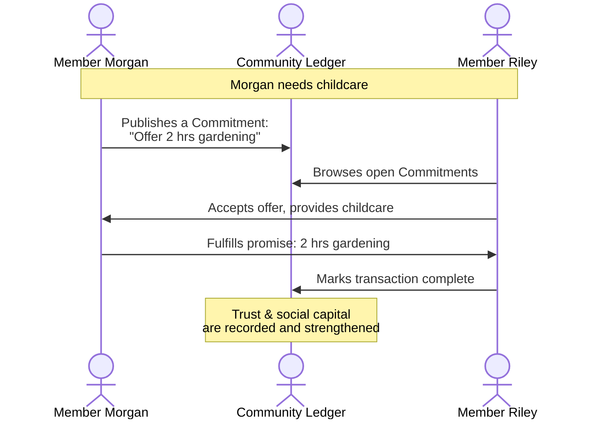
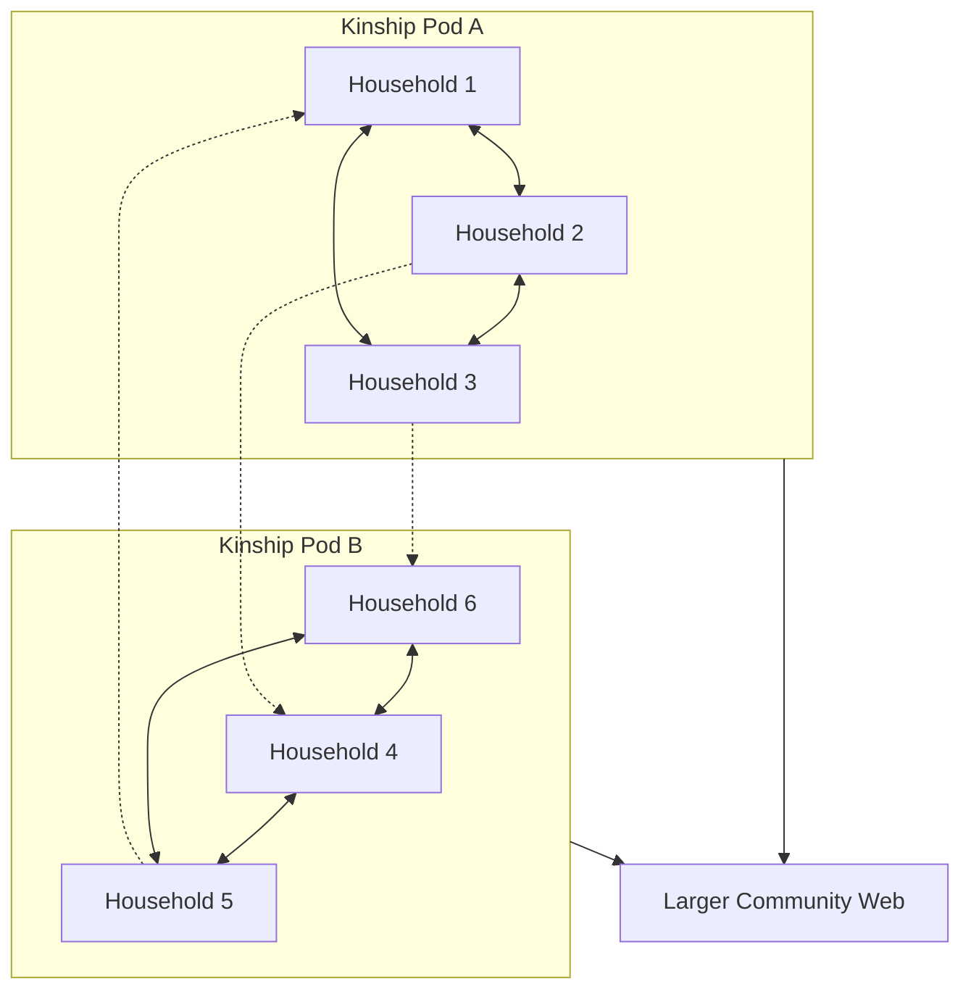
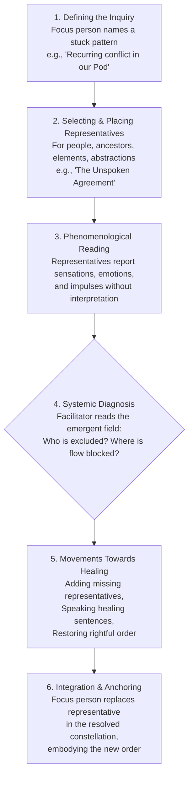
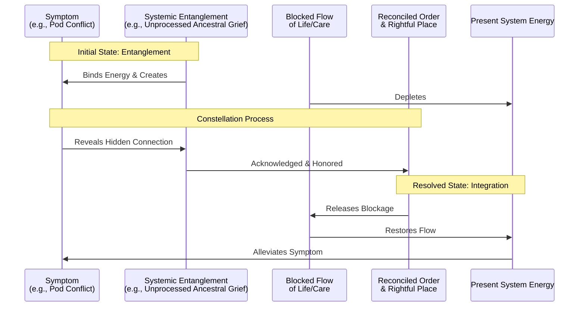
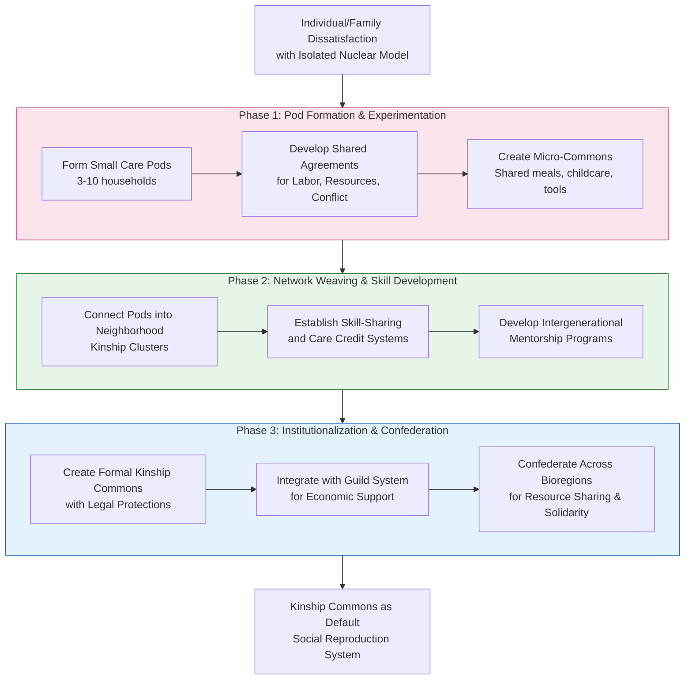
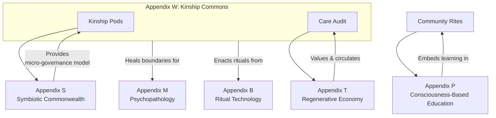

---
aeo_metadata:
  title: "Appendix W: Kinship Commons"
  description: "A framework for extending the concept of kinship beyond biological ties to include ecological, communal, and spiritual relationships, creating shared commons based on mutual care, responsibility, and interconnection."
  context: "Social and ecological relationship framework within the Solarpunk Mandala that redefines kinship as the basis for resource sharing, collective stewardship, and interbeing consciousness across human and more-than-human communities."
  key_objectives:
    - "Expand kinship models to include ecological, communal, and spiritual relationships."
    - "Develop governance and resource-sharing systems based on kinship principles."
    - "Create rituals and practices that strengthen kinship bonds across species and ecosystems."
    - "Establish legal and social structures that recognize more-than-human kinship rights."
    - "Design education systems that cultivate kinship consciousness from early childhood."
  core_concepts:
    - "Extended Kinship Networks"
    - "More-Than-Human Personhood"
    - "Kinship-Based Resource Commons"
    - "Interbeing and Interconnection"
    - "Ancestral and Future Kinship"
    - "Rituals of Kinship and Belonging"
  ontological_foundation: "Relational Ontology & Ecological Psychology"
  epistemic_stance: "Participatory Knowing & Relational Epistemology"
  search_queries:
    - "kinship commons framework"
    - "more-than-human kinship"
    - "extended kinship models"
    - "interbeing consciousness practices"
    - "kinship-based resource sharing"
  related_nodes:
    - "appendices/S-symbiotic-commonwealth-mesh.md"
    - "appendices/T-regen-economy.md"
    - "framework/applied/07-social-architecture.md"
  framework_status: "Developmental"
  version: "0.8"
  last_reviewed: "2026-01-12"
---
# Appendix W: The Kinship Commons – Regenerating Care & Family

## Primary Function
To dismantle the privatized, nuclear-family model and redesign kinship, caregiving, and intergenerational relationships as a **regenerative community commons**. This appendix provides the tools to heal familial trauma, redistribute care labor ethically, and cultivate "chosen family" networks that support lifelong human development and ecological belonging.

## Core Principles
*   **Care as a Commons:** Care work is a collective resource and responsibility, not a private burden.
*   **Lineage & Liberation:** Healing intergenerational trauma and consciously passing on regenerative wisdom are dual axes of kinship work.
*   **Developmental Webs:** Humans develop best within a "web" of diverse, multi-age relationships.
*   **More-than-Human Kinship:** True kinship extends to the land, ecosystems, and non-human beings.

## 1. Tool: Kinship Network Mapping
### Core Practice
A facilitated, visual process where community members co-create a map of their collective care ecosystem using symbols and colored yarn to represent the flow of resources (care, material support, knowledge, emotional sustenance).

### How It's Practiced
1.  **Individual Mapping:** Each person privately notes who they give to and receive from.
2.  **Collective Weaving:** In a group circle, participants add nodes (people/households) to a large canvas and connect them with yarn, verbalizing each relationship.
3.  **Diagnosis & Insight:** The group observes the emergent pattern to identify robust "nodes of resilience" and fragile "care fractures."

### Applied Example & References
*   **Portland's "Cully Community Care Network"** used mapping to transform a central hub model into a resilient web of neighborhood "pods."
*   Methodologies like **"Tree of Life"** (used with Aboriginal communities) provide non-traumatic frameworks for exploring support systems.
*   **Regenerative Community Design** emphasizes mapping relational infrastructure as critical capital.

### Mandala-Derived Benefits & Integration
*   **Operationalizes the Dialectical Axis:** Makes invisible relational dynamics (the ideal) visible and material.
*   **Applied Boundary Medicine:** Heals dissociation between private burden ("my problem") and communal reality ("our pattern")—directly applying **Appendix M**.
*   The map becomes a "living face" of the community's current relational geometry within the Tesseract.

---

## 2. Tool: The Care Economy Audit
### Core Practice
A protocol to quantify, value, and reorganize the non-monetary flow of care work within a community, establishing a local **grammar of value**.

### How It's Practiced
1.  **Cataloging Contributions:** Members list all non-monetary contributions (childcare, repairs, emotional labor, land stewardship).
2.  **Defining Local Value:** Through facilitated dialogue, the community creates a **Value Constitution** to determine relative worth (e.g., Is one hour of emotional labor equal to one hour of gardening?).
3.  **Creating a Ledger of Commitments:** A lightweight **"Commitment Ledger"** logs specific, future promises between members (e.g., "Member A promises 4 hours of childcare to Member B next Thursday"). The currency is trust.

### Applied Example & References
*   **BerkShares** (Massachusetts local currency) demonstrates place-based value.
*   **Cascadia Now!** bioregional network uses a "Care Credit" system where watershed cleanup earns credits for requesting help.
*   **Social Ecology's "Commitment Pooling Protocol"** provides a framework for tracking reciprocal promises.

### Mandala-Derived Benefits & Integration
*   **Bridges to the Regenerative Economy:** Prevents the Kinship Commons from becoming an extractive "free labor pool" by integrating care into the community's metabolic flows (**Appendix T**).
*   **Applies Game-Theoretic Principles:** Shifts coordination from extractive to regenerative by designing for balanced reciprocity (**Appendix R**).
*   **Operationalizes Analytic Idealism:** Treats care commitments as real, "first-class" entities in the community's shared consciousness.

---

## 3. Tool: Intergenerational Boundary Medicine
### Core Practice
A set of facilitated rituals and dialogues designed to heal the **temporal dissociation** that severs generations, trapping trauma and blocking wisdom.

### How It's Practiced
*   **Ritual of Listening Circles:** Structured sessions where different generations take turns speaking and witnessing prompts like "What from your childhood are you grieving?" (elders) and "What future are you afraid you will never see?" (youth).
*   **Skill-Based Re-Membering:** An elder teaches a tangible skill (woodworking, cooking an ancestral recipe) to youth, focusing on joint **attention and embodied practice** to transmit wisdom without traumatic narrative.
*   **The "Lineage Letter" Practice:** A writing ritual where individuals write to an ancestor to express pain, and then write a reply from the ancestor's perspective offering healing wisdom.

### Applied Example & References
*   **"Rites of Passage" programs** in Indigenous communities and organizations like the **Weaving Earth Center for Relational Education** formally mend the rupture between adolescence and adulthood.
*   **"Rings of Growth" drawing methodology** used by Tiwi Islands women to connect childhood memories to hopes for their children.
*   **Narrative therapy and art therapy** methods for safely externalizing and processing trauma.

### Mandala-Derived Benefits & Integration
*   **Applied Ritual Technology:** Directly uses **Appendix B (Ritual as Cube-Dissolving Technology)** to dissolve the "cubes" of segregated age groups and frozen historical trauma.
*   **Heals Developmental Boundaries:** Repairs the fractures that block the flow of consciousness and culture across generations, activating the **Learning Tesseract (Appendix O)**.
*   **Somatic Axis Practice:** Uses embodied, creative action to stabilize the Restoration foundation and facilitate healing.

---

## 4. Tool: The Developmental Web Design Kit
### Core Practice
A concrete, structural protocol for forming the basic unit of the Kinship Commons: the **"Kinship Pod"** or **"Family Guild."**

### How It's Practiced
1.  **Pod Formation:** A small group (3-8 households) with shared values and complementary needs commits to deeper mutual aid.
2.  **Chartering:** Using **Sociocratic** consent-process, the pod co-creates a **"Pod Charter"**—a living document outlining values, shared practices (e.g., weekly meal, childcare swap), conflict resolution, and resource sharing agreements.
3.  **Pod Rhythms:** Establish low-burden, consistent rhythms (weekly check-ins, monthly workdays).
4.  **Web-Weaving:** Intentionally connect pods into a larger network via overlapping members, creating redundancy and preventing clique formation.

### Applied Example & References
*   **Symbiosis Network** uses **"Pod Mapping"** exercises to define core members, allies, and resources for mutual aid assemblies.
*   **Co-housing models (Dancing Rabbit Ecovillage, Auroville)** provide real-world templates for shared infrastructure and micro-scale governance.
*   **Bioregionalism** principles root pod identity in place-based ecology.

### Mandala-Derived Benefits & Integration
*   **Instantiates Mesh Governance:** Each pod is a practicing cell of the **Symbiotic Commonwealth (Appendix S)**.
*   **Applies the Epistemic Tesseract:** The chartering process transforms abstract values (soteriology) into concrete agreements (axiology) through collaborative design (**Appendix N**).
*   **Builds "Edge Strength":** Strengthens the connections (edges) between household vertices in the community Tesseract, increasing collective resilience.

---

## 5. Tool: Rites of Passage Protocols
### Core Practice
The community-wide design and enactment of ceremonies to mark key lifecycle transitions, re-embedding the individual's journey within the cycles of the community and the land.

### How It's Practiced
*   **Community Design Sprint:** When a transition is approached (puberty, eldership), a council forms to design a rite. They ask: What needs to be released? What wisdom welcomed? What responsibilities activated?
*   **The Role of the Village:** The rite involves specific roles for non-family members (mentors, witnesses, celebrants), dissolving the nuclear family's privatized burden.
*   **Land-Based Anchor:** The ceremony is tied to a specific local natural feature and a seasonal moment (solstice, harvest), forging a bond with the **more-than-human kinship network**.

### Applied Example & References
*   The **"Vision Fast"** or wilderness solo ceremony, as adapted by the **School of Lost Borders**, is a profound community-supported rite of passage.
*   **Earthship communities** and **Transition Town initiatives** often integrate communal spaces and seasonal rhythms that naturally foster collective celebration.
*   **Cultural Continuity** is a key design principle in regenerative frameworks for rebuilding community resilience.

### Mandala-Derived Benefits & Integration
*   **Synthetic Ritual Technology:** A ultimate synthesis of **Appendix B (ritual)**, **Appendix M (healing temporal dissociation)**, and **Appendix O (marking developmental progression)**.
*   **Performs Meta-Narrative Mapping:** Enacts the replacement of the Necrocene story of isolation with a Symbiotic story of belonging (**Appendix F**).
*   **Creates a Living Campus:** Turns the community itself into an active site of **Consciousness-Based Education (Appendix P)**, rooting identity in place and relation rather than consumer ego.

## 6. Tool: Systemic Kinship Constellations

### Core Practice
A facilitated, experiential ritual that uses phenomenological methods to reveal and reconcile hidden systemic dynamics within chosen kinship networks, ecological relationships, and intergenerational lineages. It makes visible the unconscious "orders" of the Kinship Commons, identifying entanglements, blocked flows of care, and disruptions in the right to belong, thereby healing relational fractures at a systemic level.

### How It's Practiced
The practice unfolds in a held container, blending ritual space with therapeutic inquiry. A facilitator guides a "focus person" (whose system is being explored) and a group of participants who serve as representatives.

**Key Phases:**
1.  **Defining the Inquiry:** The focus person names a persistent challenge (e.g., "a recurring conflict in our Pod," "a feeling of exclusion from the land," "burnout in my care role").
2.  **Selecting & Placing Representatives:** The focus person intuitively chooses participants to represent key elements of their inquiry (e.g., themselves, another pod member, an ancestor, "the land," "the conflict itself"). They place them in the space in relation to one another, based on felt sense.
3.  **Phenomenological Reading:** Representatives report their physical sensations, emotions, and impulses without analysis (e.g., "I feel heavy," "I can't see the others," "I'm pulled backward").
4.  **Systemic Diagnosis:** The facilitator "reads" the living map. They identify systemic dynamics: Who is excluded? Where is the flow of love or respect blocked? Is there an imbalance between giving and taking? What hidden loyalty is being served by the symptom?
5.  **Movements Towards Healing:** The facilitator tests small interventions: adding a missing representative (e.g., a forgotten ancestor), guiding representatives to speak "healing sentences" (e.g., "I respect you as my parent, and I take life from you"), or repositioning them to restore a more truthful, orderly alignment.
6.  **Integration & Anchoring:** Once a resolution constellation emerges where all representatives feel a release of tension and a sense of "rightness," the focus person takes their own place in the new configuration, somatically integrating the shift.

### Applied Example & References
*   **Original Context:** Bert Hellinger's Family Constellations work with biological family systems to resolve transgenerational trauma.
*   **Adaptation for Commons:** The **"Systemic Constellations"** field (as practiced by innovators like Jan Jacob Stam) expands the method to organizations, social systems, and abstract issues. This tool adapts it further for **chosen kinship and ecological networks**.
*   **Practical Model:** The **"Women of the Heart" community** in Brazil uses constellations to address power dynamics and inheritance conflicts within their intentional community.

### Mandala-Derived Benefits & Integration
*   **Operationalizes Analytic Idealism & Relational Ontology:** Treats the relational field itself as the primary, knowable reality. The constellation is a direct, participatory inquiry into the "mind" of the relationship system.
*   **Advanced Ritual Technology (Appendix B):** Functions as a high-resolution, cube-dissolving ritual. It rapidly makes the invisible relational geometry of a pod or commons visible and mutable.
*   **Deepens Intergenerational Boundary Medicine (Tool 3):** Provides a powerful, non-verbal method to identify and reconcile specific transgenerational entanglements that dialogue alone cannot access.
*   **Prevents Pathology in Pods (Appendix M):** Serves as profound "pre-habilitation" and conflict resolution for **Developmental Webs (Tool 4)**. By revealing hidden systemic loyalties, it prevents new pods from unconsciously replicating old family dysfunctions.
*   **Enriches Kinship Network Maps (Tool 1):** Adds a **vertical, transgenerational axis** to the horizontal mapping of care flows, explaining *why* certain "care fractures" may exist.

### Sequence of Systemic Realignment
The process moves a system from a state of entanglement, which creates symptoms (like conflict or burnout), to a state of reconciled order, which releases energy back to the present.

This tool transforms the Kinship Commons from a *structurally* innovative model into a *systemically intelligent* one, capable of healing its own deepest relational wounds.

## 7. Dual Power in the Kinship Commons: Building Regenerative Social Reproduction Networks

The Kinship Commons is not merely an alternative family structure—it is a **fundamental site of dual power construction**. By reorganizing care, intimacy, and intergenerational relationships outside the logic of the nuclear family and the welfare state, we create the social fabric of the Commonwealth while directly contesting the Necrocene's most intimate patterns of alienation and isolation.

### 7.1 The Dual-Power Function of Kinship Commons
The Kinship Commons performs three essential dual-power functions:

| Function | How It Works | Dual-Power Impact |
|----------|--------------|-------------------|
| **Social Reproduction** | Provides childcare, elder care, emotional support, and domestic labor through communal networks rather than privatized households or state institutions. | **Diverts resources** from both the patriarchal family and the welfare state, creating autonomous care circuits. |
| **Value Cultivation** | Raises children and socializes adults into cooperative, ecological, and solidarity-based norms rather than competitive individualism. | **Generates new subjects** already aligned with Commonwealth values, accelerating cultural transition. |
| **Resilience Infrastructure** | Creates dense webs of mutual obligation that can withstand economic shocks, ecological crises, and state retrenchment. | **Builds material independence** from extractive systems, protecting communities during transition. |

### 7.2 Phased Construction of Kinship Dual Power
Building the Kinship Commons requires intentional progression from experimental pods to bioregional networks:

#### Phase 1: Pod Formation & Experimentation
- **Form Small Care Pods (3-10 households)**: Begin with trusted friends or neighbors pooling certain resources and care responsibilities.
- **Develop Shared Agreements**: Create explicit compacts for labor sharing, resource pooling, and conflict resolution.
- **Create Micro-Commons**: Establish shared meals, childcare rotations, tool libraries, or co-housing arrangements.

#### Phase 2: Network Weaving & Skill Development
- **Connect Pods into Neighborhood Kinship Clusters**: Multiple pods form neighborhood-scale networks for mutual support.
- **Establish Skill-Sharing and Care Credit Systems**: Formalize exchanges through time-banking or care credits tracked via simple apps or ledgers.
- **Develop Intergenerational Mentorship Programs**: Pair youth with elders for skill transmission, storytelling, and wisdom exchange.

#### Phase 3: Institutionalization & Confederation
- **Create Formal Kinship Commons with Legal Protections**: Establish legal entities (cooperatives, trusts, associations) to protect shared assets and relationships.
- **Integrate with Guild System for Economic Support**: Partner with Functional Guilds for material resources, space, and professional care services.
- **Confederate Across Bioregions**: Connect kinship commons for resource sharing, crisis response, and cultural exchange.

### 7.3 Dual-Power Strategies for Kinship Commons
1. **Care Credit Systems**: Implement time-banking or Φ-currency for care work, making invisible labor visible and valued.
2. **Common Housing Trusts**: Acquire property collectively to create intergenerational living communities protected from market speculation.
3. **Kinship Guilds**: Form specialized guilds for childcare, elder care, emotional support, and conflict facilitation.
4. **Rites of Passage Networks**: Create community-based ceremonies for life transitions (birth, adulthood, death) that reinforce Commonwealth values.

### 7.4 Overcoming Barriers to Kinship Dual Power
| Barrier | Dual-Power Solution |
|---------|---------------------|
| **Legal Recognition** | Create "chartered kinship commons" with protected legal status for multi-household families. |
| **Resource Constraints** | Pool resources across pods; negotiate with Functional Guilds for material support. |
| **Cultural Resistance** | Run "parenting circles" and public workshops that demonstrate the benefits of communal care. |
| **State Interference** | Build protective membranes through religious freedom claims, cooperative law, or municipal charters. |

### 7.5 Metrics for Kinship Dual Power
- **Care Diversion Rate**: Percentage of care work handled within Kinship Commons vs. state/market.
- **Intergenerational Connection Index**: Density of relationships across age cohorts within commons.
- **Kinship Resilience Score**: Ability to withstand crises without resorting to state/market solutions.
- **Value Transmission Efficacy**: Success in socializing next generation into cooperative norms.

### 7.6 The Heart of the Commonwealth
The Kinship Commons is where the **relational geometry** of the Commonwealth becomes lived reality. By building dual power in this most intimate domain, we create not just alternative social arrangements but the **embodied foundation** for all other dimensions of the Symbiotic Commonwealth. The family is not abolished but expanded into a fractal pattern of care that mirrors the mesh itself.

**Integration Note:** The Kinship Commons directly supports the **Relational Depth Axis** of the Mandala and provides the social foundation for the economic systems in Appendix T and the governance structures in Appendix S.

## Integration Summary

This suite of tools forms a complete cycle for regenerating kinship:
1.  **See the System** (Kinship Network Mapping)
2.  **Value its Core Economy** (Care Economy Audit)
3.  **Heal its Wounds** (Intergenerational Boundary Medicine)
4.  **Build New Structures** (Developmental Web Design Kit)
5.  **Celebrate the New Culture** (Rites of Passage Protocols)

The Kinship Commons provides the essential relational substrate where the Mandala's principles—from Analytic Idealism to Regenerative Economics—are lived, tested, and embodied daily.

## References

### Applied Examples & Community Models
Cascadia Now!. (n.d.). *Cascadia bioregional network and Care Credit system*. Retrieved from https://cascadianow.org

Cully Community Care Network. (n.d.). *Neighborhood care pods and relational web model in Portland*. Portland, OR.

Dancing Rabbit Ecovillage. (n.d.). *Ecovillage and co-housing model*. Rutledge, MO. Retrieved from https://www.dancingrabbit.org

Earthship Biotecture. (n.d.). *Sustainable community and building model*. Taos, NM. Retrieved from https://www.earthshipglobal.com

SCHUMACHER CENTER FOR A NEW ECONOMICS. (n.d.). *BerkShares local currency*. Great Barrington, MA. Retrieved from https://www.berkshares.org

School of Lost Borders. (n.d.). *Vision Fast and wilderness solo rites of passage*. Retrieved from https://www.schooloflostborders.org

Symbiosis Network. (n.d.). *Pod Mapping for mutual aid assemblies*. Retrieved from https://www.symbiosis.network

Transition Network. (n.d.). *Transition Town initiatives*. Retrieved from https://transitionnetwork.org

Weaving Earth Center for Relational Education. (n.d.). *Rites of passage and relational education*. Retrieved from https://weavingearth.org

### Methodologies & Therapeutic Practices
Ncube, N. (2006). *The Tree of Life: A narrative therapy approach with vulnerable children*. In *Working with vulnerable children* (pp. 11-28). Routledge. (Methodology used with Aboriginal communities for non-traumatic exploration of support systems).

White, M., & Epston, D. (1990). *Narrative means to therapeutic ends*. W.W. Norton & Company. (Narrative therapy methods for externalizing and processing trauma).

*Art therapy methods*. (n.d.). (Various practices for safe externalization and processing).

### Organizational & Theoretical Frameworks
*Bioregionalism principles*. (n.d.). (Philosophy rooting community identity in place-based ecology).

*Commitment Pooling Protocol*. (n.d.). Social Ecology framework for tracking reciprocal promises.

*Cultural Continuity*. (n.d.). (Design principle in regenerative frameworks for community resilience).

*Regenerative Community Design*. (n.d.). (Framework emphasizing relational infrastructure as critical capital).

*Rings of Growth drawing methodology*. (n.d.). (Practice used by Tiwi Islands women).

*Sociocratic consent-process*. (n.d.). (Governance method for collaborative decision-making in Pod Chartering).

### General Community References
*Auroville*. (n.d.). *International township and co-housing model*. Tamil Nadu, India. Retrieved from https://www.auroville.org

---
