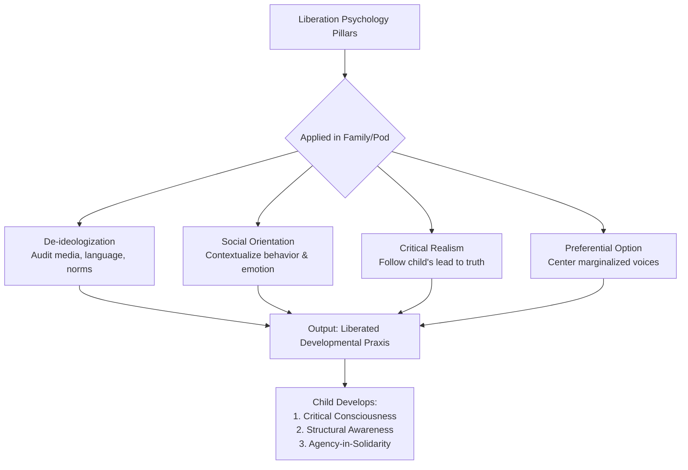
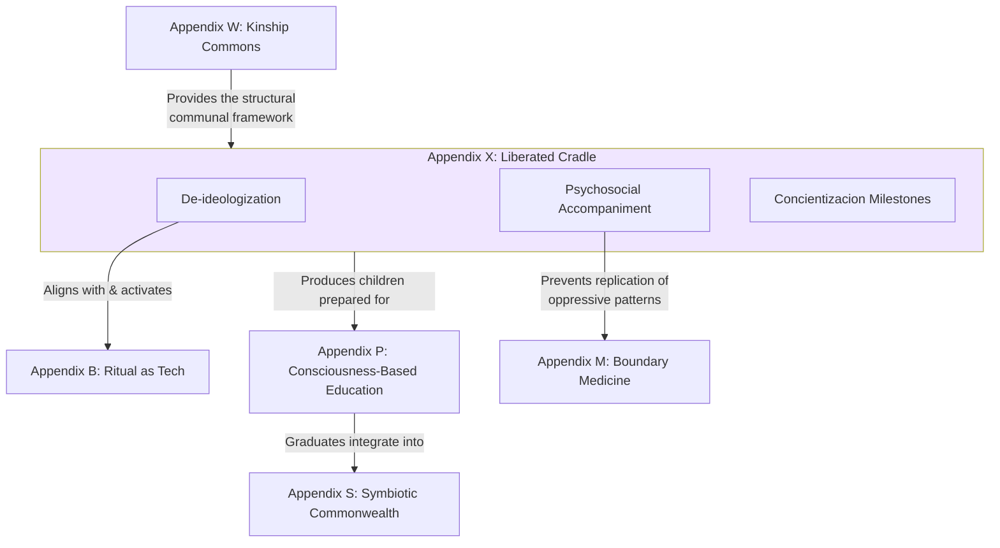
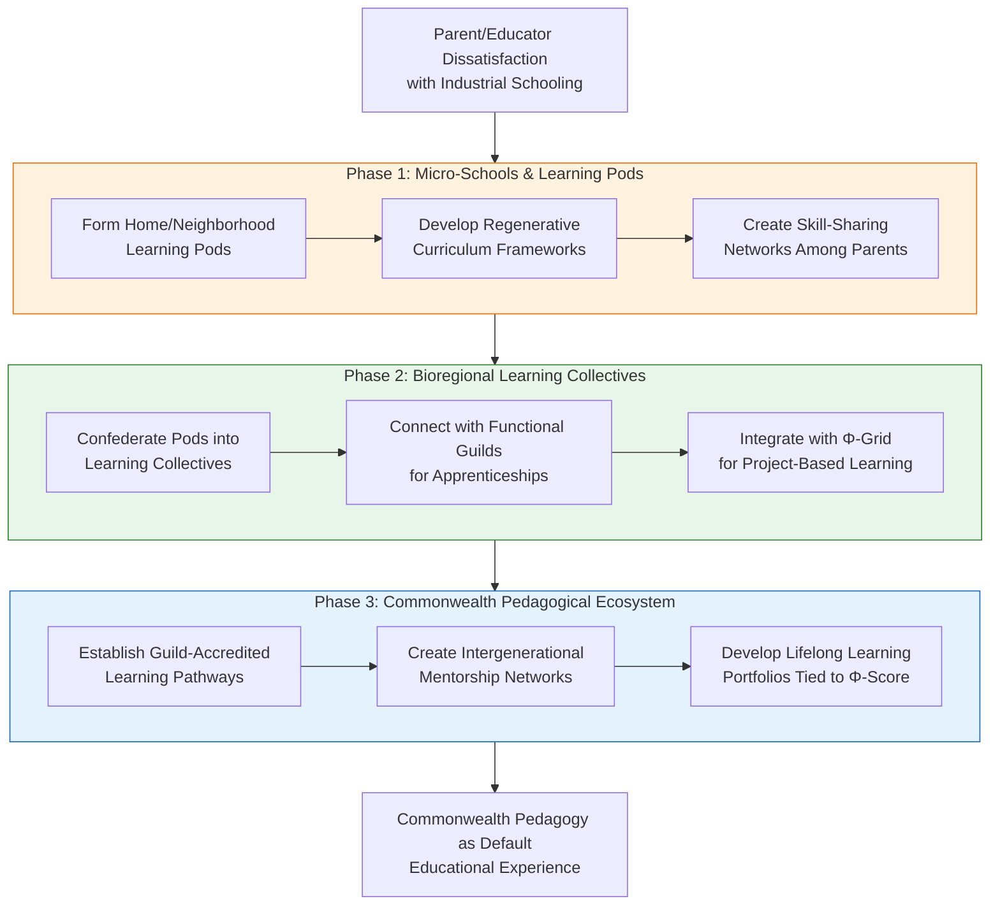

---
aeo_metadata:
  title: "Appendix X: The Liberated Cradle – Parenting as Concientización"
  description: "A Liberation Psychology framework for early childhood development and parenting that de-ideologizes the nuclear family, fosters critical consciousness, and orients development towards solidarity with the oppressed and the more-than-human world."
  context: "Psychosocial and developmental framework within the Solarpunk Mandala, applying Ignacio Martín-Baró's liberation psychology to transform parenting into a praxis of collective liberation."
  key_objectives:
    - "De-ideologize dominant narratives of individualism, competition, and control within parenting."
    - "Foster critical consciousness (concientización) in children and caregivers from early childhood."
    - "Apply a 'preferential option for the oppressed' in developmental materials, relationships, and community engagement."
    - "Heal parental triggers and wounds to prevent the replication of oppressive patterns."
    - "Establish the family/pod as a primary cell for liberatory psychosocial praxis."
  core_concepts:
    - "Concientización (Critical Consciousness)"
    - "De-ideologization of Childhood"
    - "Psychosocial Accompaniment"
    - "Liberatory Developmental Milestones"
    - "Preferential Option for the Oppressed & More-Than-Human World"
  ontological_foundation: "Liberation Psychology (Martín-Baró), Relational Ontology, Critical Social Theory"
  epistemic_stance: "Critical Realism, Participatory & Liberatory Knowledge Creation"
  search_queries:
    - "liberation psychology parenting"
    - "critical consciousness early childhood"
    - "Ignacio Martin-Baro child development"
    - "de-ideologizing family"
    - "social justice parenting tools"
  related_nodes:
    - "appendices/W-kinship-commons.md"
    - "appendices/P-consciousness-based-education.md"
    - "appendices/M-boundary-medicine-psychopathology.md"
    - "appendices/B-ritual-as-technology.md"
  framework_status: "Developmental"
  version: "1.0"
  last_reviewed: "2026-01-13"
---
# Appendix X: The Liberated Cradle – Parenting as Concientización

## Primary Function

To operationalize Ignacio Martín-Baró's principles of Liberation Psychology within the sphere of early childhood (0-8 years) and parenting. This appendix provides a framework to **de-ideologize** the privatized, nuclear family model, foster **critical consciousness (concientización)** in children and caregivers, and reorient development towards a **preferential option for the oppressed** and the more-than-human world. It transforms parenting from a private act of socialization into a public, communal practice of liberation and ecological stewardship.

### Core Metaphor: The Family as a De-ideologizing Cell
The family unit, and its extension into the Kinship Pod, is reconceived as a primary "cell" for de-ideologization. Within this cell, the dominant narratives of individualism, competition, human supremacy, and separation are critically examined and replaced with a **liberating psychosocial praxis** rooted in interconnection, critical realism, and solidarity.

## Part 1: Foundational Theory – Liberation Psychology for Parenting

Liberation psychology critiques traditional psychology for its value neutrality, false universality, and societal irrelevance, seeking instead to understand the person within their socio-political and historical context[citation:8]. This reorientation is foundational to liberation parenting.

### 1.1 Core Principle: From Socialization to *Concientización*
- **Traditional/Default Model**: Parenting prepares a child to internalize prevailing social norms (ideologies) and succeed within an unquestioned, often oppressive, status quo.
- **Liberation Psychology Model**: Parenting facilitates a child's development of **critical consciousness**. Development is the widening circle of *concientización*—from awareness of self and immediate relations, to critical understanding of community structures, to recognition of systemic power and ecological interdependence[citation:8].
- **Mandala Integration**: This directly applies the **Dialectical Axis** by making the ideological (thesis) visible so it can be met with critical, de-ideologized understanding (antithesis), synthesizing into a liberated, reality-based worldview.

### 1.2 The Four Pillars of Liberatory Developmental Praxis
Applying Martín-Baró's central concepts[citation:8] to early childhood:

| Pillar | Liberation Psychology Concept | Application to Parenting & Early Childhood |
| :--- | :--- | :--- |
| **De-ideologization** | Unmasking the dominant ideologies that obscure social forces and maintain oppression[citation:8]. | Critically examining the "adultist," colonial, and anthropocentric assumptions embedded in children's media, language, and expected behaviors. Helping children "read the world"[citation:1]. |
| **Critical Realism** | Letting problems generate their own theories, not forcing preconceived theories onto reality[citation:8]. | Following the child's lead and questions to guide learning about justice and ecology. Using their observed experiences of fairness/unfairness as the starting point for dialogue[citation:4][citation:6]. |
| **Social Orientation** | Understanding behavior as a result of social relations and alienating environments, not just intrapsychic processes[citation:8]. | Framing a child's distress or "misbehavior" within its social context (e.g., overstimulation, unmet need for connection, reaction to parental stress) rather than as inherent defiance[citation:5]. |
| **Preferential Option for the Oppressed** | Developing psychology *from* oppressed people, not *for* them[citation:8]. | Centering stories, wisdom, and voices from marginalized communities and more-than-human beings. Cultivating empathy and solidarity not as charity, but as a recognition of interconnected fate[citation:1][citation:7]. |

## Part 2: Applied Tools for Liberatory Parenting Pods

### Tool 1: The De-ideologization Inventory
A facilitated audit for a Parenting Pod to identify and challenge dominant ideologies embedded in their everyday environment.

- **Practice**:
    1.  **Media & Material Audit**: Collectively review children's books, toys, and media. Ask: Who is centered? Who is missing? What power dynamics are presented as normal? Replace "single-story" materials with those reflecting diverse, empowered narratives[citation:1].
    2.  **Language & Ritual Audit**: Examine common phrases and family rituals. Do they reinforce control ("Because I said so"), binary thinking, or human separation from nature? Co-create new, liberatory phrases and rituals that embody consent, nuance, and kinship[citation:2].
- **Integration**: This is applied **Boundary Medicine (Appendix M)** at the cultural level. It heals the dissociation between stated family values and the uncritically absorbed ideologies of the dominant culture.

### Tool 2: Critical Consciousness Milestones
A reframing of developmental milestones through the lens of *concientización* and social orientation.

| Age Range | Traditional Milestone | **Liberatory Milestone** | Liberatory Practice |
| :--- | :--- | :--- | :--- |
| 0-3 | Language Acquisition | **Emergence of Relational & Justice Vocabulary** | Naming emotions, relationships, and simple fairness concepts ("You seem sad." "We share the water.")[citation:1][citation:5]. |
| 3-5 | Theory of Mind | **Emergence of Structural Awareness** | Ability to identify simple cause-effect in social and ecological systems ("The playground is hot because there are no trees."). Discussing fairness in group dynamics[citation:4]. |
| 5-8 | Concrete Operations | **Capacity for Solidaristic Action** | Ability to plan and execute small acts of collective care (pod gardening, mutual aid projects) and understand their impact[citation:6]. |

### Tool 3: The Psychosocial Accompaniment Protocol
A method for caregivers to process their own triggers and wounds, preventing the replication of oppressive patterns.

- **Practice**: Based on identifying "ego reactions" (Fighter, Fixer, Feigner, Freezer, Fleer)[citation:5], caregivers in a pod practice:
    1.  **Witnessing**: A caregiver shares a trigger while others listen without judgment.
    2.  **Social Orientation**: The group helps reframe the trigger from "my child's bad behavior" to "what social or historical wound in me/my lineage does this touch?"[citation:8].
    3.  **Collective Re-narration**: The group co-creates a liberatory response rooted in connection and critical understanding, not control[citation:2][citation:5].
- **Integration**: This operationalizes the **preferential option for the oppressed** by prioritizing the healing of the caregiver's internalized oppression as a necessary step to liberate the child.

### Tool 4: *Concientización* Through Play & Land
Framing play and land-based activity as primary sites for de-ideologization and critical consciousness.

- **Core Tenet**: Free, imaginative play and direct engagement with a living place are forms of **critical realism**. They allow children to generate their own theories of the world, unfiltered by dominant ideologies[citation:8].
- **Practice - "Land as Co-Teacher"**:
    - **Reciprocal Stewardship**: Engage in activities that emphasize care and reciprocity (planting native species, composting, water conservation) over extraction or control.
    - **Storying the Land**: Learn and create stories about the local flora, fauna, and geography that emphasize agency, interconnection, and history, countering colonial narratives[citation:4].
- **Integration**: This practice grounds **Appendix T's (Regenerative Economy)** principles in the somatic, childhood experience, building an embodied foundation for ecological ethics.

## Part 3: Integration & Synthesis

### The Liberated Cradle in the Solarpunk Mandala
This appendix serves as the **psychosocial seedbed** for the entire Mandala, ensuring that the development of future generations begins from a foundation of critical consciousness and de-ideologized relation.

**Connection to Appendix W (Kinship Commons):** Appendix X provides the **liberatory developmental praxis** that brings the structural vision of the Kinship Commons to life. It answers *how* to raise children capable of thriving in and sustaining a web of mutual aid.

**Connection to Appendix P (Consciousness-Based Education):** The Liberated Cradle is the **essential precondition** for Appendix P. It cultivates the critical, interconnected consciousness that formal Conscientized Education can then refine and empower.

### Axiological Shift: Redefining "Healthy" Development
Liberation parenting necessitates a community-wide shift in values[citation:4]:
- From **"A healthy child is well-adjusted to society"** to **"A liberated child is critically conscious of society and feels empowered to help transform it."**
- From **"Good parenting provides stability and control"** to **"Liberatory parenting provides secure attachment within a container of critical inquiry and solidarity."**

## Educational Dual Power: Raising Commonwealth Citizens Within and Against the Necrocene

Parenting and education in the Solarpunk Mandala are not private matters but **strategic sites of dual power construction**. By creating alternative learning ecosystems that cultivate the capacities needed for the Commonwealth, we simultaneously withdraw consent from the Necrocene's education-industrial complex and prefigure the pedagogical practices of a regenerative society.

### The Dual-Power Function of Solarpunk Education
| Current System (Necrocene) | Dual-Power Alternative (Commonwealth) | Strategic Impact |
|----------------------------|---------------------------------------|------------------|
| **Competitive Individualism** → cultivates isolated achievers | **Cooperative Ecology** → cultivates community-minded contributors | **Undermines human capital** logic; builds solidarity networks early |
| **Abstracted Knowledge** → divorced from lived context | **Embedded Learning** → tied to bioregional place and community needs | **Re-localizes intelligence**; creates place-based expertise |
| **Standardized Testing** → measures compliance and ranking | **Portfolio Assessment** → documents contribution to community vitality | **Shifts success metrics** from individual achievement to collective regeneration |
| **Institutional Monopoly** → state/corporate control of credentialing | **Distributed Authority** → guilds, elders, and community validate skills | **Creates parallel credentialing** outside state control |

### Phased Construction of Educational Dual Power

#### Phase 1: Micro-Schools & Learning Pods
- **Form Home/Neighborhood Learning Pods**: Small groups of families co-create learning environments outside formal schools.
- **Develop Regenerative Curriculum Frameworks**: Design learning experiences around bioregional ecology, cooperation, and practical skills.
- **Create Skill-Sharing Networks Among Parents**: Parents with diverse expertise rotate teaching responsibilities.

#### Phase 2: Bioregional Learning Collectives
- **Confederate Pods into Learning Collectives**: Connect multiple pods for shared resources, expertise, and social opportunities.
- **Connect with Functional Guilds for Apprenticeships**: Youth learn directly from practitioners in regenerative fields.
- **Integrate with Φ-Grid for Project-Based Learning**: Use real-time ecological and social data as the basis for learning projects.

#### Phase 3: Commonwealth Pedagogical Ecosystem
- **Establish Guild-Accredited Learning Pathways**: Guilds validate skills and knowledge through demonstration rather than standardized tests.
- **Create Intergenerational Mentorship Networks**: Formalize wisdom transmission from elders to youth across domains.
- **Develop Lifelong Learning Portfolios Tied to Φ-Score**: Document learning through contribution to community vitality metrics.

### Dual-Power Pedagogical Strategies
1. **Deschooling Communities**: Create neighborhoods where multiple families commit to alternative education, providing critical mass and mutual support.
2. **Guild-Apprenticeship Pathways**: Partner children/youth with Functional Guilds for skill development tied to real community needs.
3. **Φ-Grid Learning Projects**: Use the sensor network and dashboard to create data-rich learning opportunities tied to local ecological monitoring.
4. **Intergenerational Wisdom Circles**: Pair youth with elders for oral history, traditional skills, and ethical formation outside institutional frameworks.

### Overcoming Educational Dual-Power Barriers
| Barrier | Strategy |
|---------|----------|
| **Legal Requirements** | Form as private schools, homeschool co-ops, or charter schools with maximum autonomy; use religious freedom arguments strategically. |
| **Resource Constraints** | Pool resources across families; barter with guilds for space and expertise; use open-source curricula. |
| **Socialization Concerns** | Create rich social environments through learning collectives; ensure regular interaction with diverse age groups. |
| **Credentialing** | Develop portfolio systems recognized by guilds and commons; create alternative transcripts that emphasize contribution over compliance. |

### Dual-Power Educational Metrics
- **Learning Diversion Rate**: Percentage of children's education happening outside industrial school system.
- **Community Contribution Index**: Measurable impact of youth projects on local Φ-score.
- **Intergenerational Connection Density**: Number of meaningful mentor-mentee relationships across age cohorts.
- **Pedagogical Innovation Diffusion Rate**: Speed at which successful educational practices spread through the dual-power network.

### Growing the Next Commonwealth
Educational dual power is not about creating "better schools" but about **growing an entirely different relationship to knowledge, skill, and community contribution**. By raising a generation already fluent in the patterns of the Commonwealth, we ensure the continuity of the transition and create living proof that another way is not just possible but already flourishing.

**Integration Note:** This educational approach directly implements the **Soteriological Axis** (self-integration through learning) and feeds the **Functional Guilds** with skilled, community-minded contributors. It also provides a practical implementation of the **Kinship Commons** (Appendix W) for child-rearing.

## References

### Foundational Liberation Psychology Source
Martín-Baró, I. (1994). *Writings for a liberation psychology*. Harvard University Press[citation:4].

### Peer-Reviewed Research & Literature Reviews
Singh, A., & references from the synthesis article (2023). Translating liberation psychology for children and adolescents from historically marginalized racial and ethnic backgrounds: A synthesis of the literature. *Clinical Child and Family Psychology Review, 26*(1), 65–81[citation:1][citation:3].

Sikkens, E., van San, M., Sieckelinck, S., & de Winter, M. (2018). Parents' perspectives on radicalization: A qualitative study. *Journal of Child and Family Studies, 27*(7), 2276–2284[citation:7].

### Frameworks for Critical Consciousness & Practice
Wilson, M. R. (2019, November). Modelling critical consciousness in early childhood. *Meagan Rose Wilson*[citation:2].

Clarke, D. (2024). The importance of teaching students to develop their critical consciousness: Part I. *Heart and Art*[citation:6].

### Additional Theoretical Grounding (Cited in Secondary Sources)
El-Amin, A., Seider, S., Graves, D., Tamerat, J., Clark, S., Soutter, M., Johannsen, J., & Malhotra, M. (2017). Critical consciousness: A key to student achievement. *Phi Delta Kappa International*[citation:2].

Freire, P. (2005). *Education for critical consciousness*. Continuum[citation:3].

Ladson-Billings, G. (1995). But that's just good teaching! The case for culturally relevant pedagogy. *Theory Into Practice, 34*(3), 159-165[citation:6].

---
