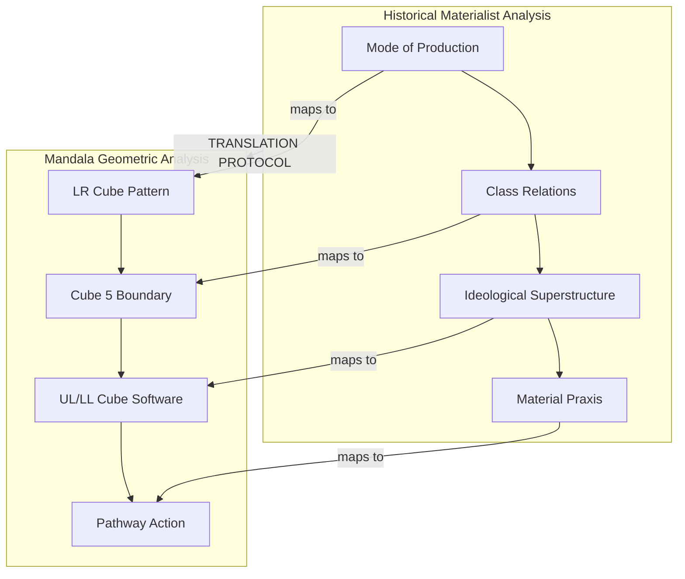
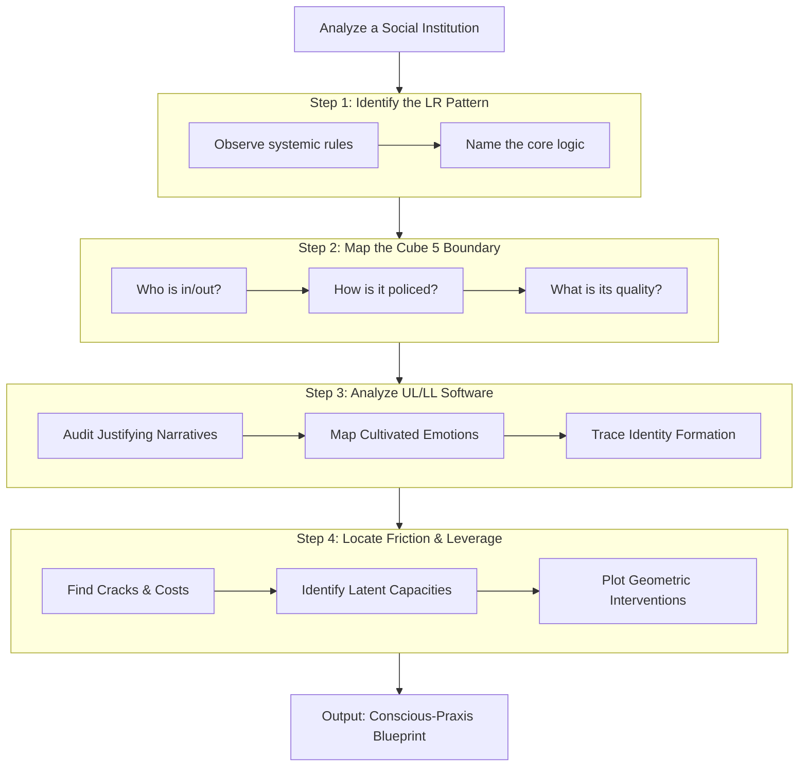
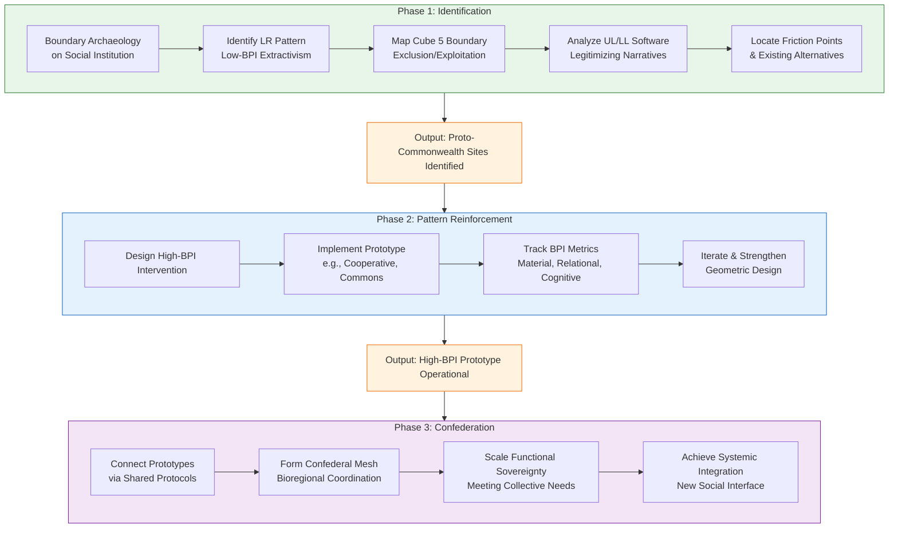

---
aeo_metadata:
  title: "Appendix Y: The Matter-Interface – Translating Historical Materialism"
  description: >
    A formal translation protocol that transcludes the analytic power of historical
    materialism into the consciousness-first framework of the Mandala. It maps
    concepts like class, base/superstructure, and ideology onto the geometric
    dynamics of the Tesseract, treating power and material conditions as operations
    on dissociation boundaries within Mind-at-Large.
  context: >
    A critical integration layer within the Solarpunk Mandala, providing a
    rigorous method to analyze power, exploitation, and social structures without
    abandoning the ontological primacy of consciousness. Serves as a direct
    response to materialist critiques and a bridge for praxis.
  key_objectives:
    - "Establish a one-to-one translation protocol between core Marxist social categories and Mandala geometry."
    - "Provide tools for 'Boundary Archaeology'—analyzing power structures as configurations of dissociation."
    - "Operationalize this translation within the Arena's Capital Framework via metrics like the Boundary Permeability Index (BPI)."
    - "Demonstrate that materialist analysis is not rejected, but subsumed and deepened within a consciousness-first ontology."
  core_concepts:
    - "Translation Protocol"
    - "Boundary Archaeology"
    - "Base/Superstructure as MAL Patterning"
    - "Class as Collective Dissociation"
    - "Ideology as Perceptual Software"
    - "Boundary Permeability Index (BPI)"
  ontological_foundation: "Analytic Idealism (consciousness-primary) with a translation layer for materialist phenomenology."
  epistemic_stance: "Integrative; employs geometric correspondence and pragmatic utility as validation."
  search_queries:
    - "Marxism analytic idealism integration"
    - "historical materialism tesseract translation"
    - "power analysis boundary dynamics consciousness"
    - "class struggle dissociation boundary"
  related_nodes:
    - "02-epistemic-architecture-tesseract.md"
    - "03-ethics-four-axes.md"
    - "framework/arena/dashboard-mvp/02-capital-framework.md"
    - "appendices/K-formal-foundations-analytic-idealism.md"
  framework_status: "Integration"
  version: "0.1"
  last_reviewed: "2024-10-27"
---
# Appendix Y: The Matter-Interface – Translating Historical Materialism into Boundary Dynamics

## Primary Function
To establish a formal translation layer between the analytic tools of historical materialism (class, base/superstructure, ideology, praxis) and the consciousness-first, geometric framework of the Solarpunk Mandala. This appendix transcludes Marxist social analysis, treating material conditions and power structures as emergent, stabilized patterns within the collective perceptual interface of Mind-at-Large (MAL). It provides protocols for analyzing power not as a separate force, but as an operation on dissociation boundaries.

## Part 1: Foundational Theory – The Translation Protocol
This section would formally define the core transclusion, similar to how Appendix X defines its four pillars.

**Core Thesis:** Historical Materialism provides a powerful and accurate *phenomenology of the Necrocene interface*. Its categories describe the operative rules of a specific, pathologically dissociated configuration of MAL. Translation is not reduction, but mapping to a more fundamental ontological layer.

| Marxist Concept | Mandala Translation (Geometric/Tesseract Terms) | Primary Locus in Framework |
| :-------------- | :----------------------------------------------- | :------------------------- |
| **Mode of Production / Economic Base** | A dominant, auto-catalytic **pattern within the LR Cube (Exterior-Collective)**; a **consensus reality tunnel** with high inertial stability. | **LR Cube**, **Cube 7** (Systemic Emergence) |
| **Class & Exploitation** | A **hierarchically hardened Dissociation Boundary (Cube 5)**. Exploitation is the systemic extraction of perceptual bandwidth/affective valence from one group of alters to stabilize the experience of another. | **Cube 5**, **Necrocene Facet: Domination/Exploitation** |
| **Ideology / Superstructure** | The **perceptual-affective software** (stories, norms, media) running in the **UL (Interior-Individual)** and **LL (Interior-Collective)** cubes that maintains the coherence of the dominant LR pattern and justifies its Boundary-5 configurations. | **UL & LL Cubes** |
| **Class Consciousness** | The **activation of Cube 6 (Intersubjective Gateway)** at scale, dissolving the pathological class boundary. The shift from experiencing as an isolated "I" to a solidaristic "We" within a shared structural position. | **Cube 6**, **Soteriological & Relational Depth Axes** |
| **Praxis / Revolution** | The intentional, collective use of **Pathway tools** to dissolve old boundary patterns (Cube 5) and stabilize new, regenerative LR patterns (Symbiotic Commonwealth facets). | **The Four Pathways**, **Dialectical Phases** |

## Part 2: Applied Tools – Boundary Archaeology & Power Mapping
This section provides the practical methods, analogous to the "De-ideologization Inventory" in Appendix X.

### Tool 1: Boundary Archaeology Protocol**

A step-by-step method to analyze any institution or social relation.
1.  **Identify the LR Pattern:** What is the dominant, repeating "rule" or logic? (e.g., "Capital must accumulate").
2.  **Map the Boundary (Cube 5):** Who is inside/outside? How is the boundary policed (materially, psychologically)?
3.  **Analyze the Software (UL/LL):** What narratives, emotions, and identities keep participants consenting to this pattern?
4.  **Locate the Friction:** Where is the pattern failing or causing experiential dissonance (the "crisis" point for change)?

### Tool 2: The Power Dashboard – Operationalizing Translation in the Arena
**Primary Function:** To transform the theoretical insights of Boundary Archaeology into quantifiable metrics and visualizations within the Arena's Capital Framework. This tool operationalizes power analysis by defining **capital as crystallized boundary control** and providing a system to track its transformation.

#### The Boundary Permeability Index (BPI)
The BPI is a composite metric designed to measure the rigidity or openness of key social dissociation boundaries (Cube 5 configurations) within a community or system. It translates qualitative power dynamics into a trackable indicator for regenerative praxis.

*   **Calculation:** The BPI is an aggregate score (0-100) derived from surveying sub-indices across three domains. Data is gathered via community audit, participatory sensing, and system data.
    *   **Material BPI (0-33):** Measures access to foundational resources.
        *   *Indicators:* Wealth/income disparity, land and housing access, nutritional sovereignty.
    *   **Relational BPI (0-33):** Measures the health of social connection and decision-making.
        *   *Indicators:* Inclusivity of governance, strength of mutual aid networks, diversity of social bridges.
    *   **Cognitive BPI (0-34):** Measures the diversity and accessibility of narrative and epistemic tools.
        *   *Indicators:* Media ownership concentration, access to liberatory education, plurality of cultural expression.

*   **Interpretation:**
    *   **Low BPI (0-40):** Indicates **extractive, rigid patterns**. Boundaries are walls; capital is hoarded as control. Characteristic of Necrocene structures.
    *   **Medium BPI (41-70):** Indicates **transitional, contested patterns**. Boundaries are membranes under negotiation.
    *   **High BPI (71-100):** Indicates **regenerative, fluid patterns**. Boundaries are sites of exchange and facilitation. Characteristic of Symbiotic Commonwealth aims.

#### Dashboard Implementation: The Pattern Lens
Within the Arena dashboard, the Capital Framework is augmented with a "Pattern Lens" filter, enabled by this appendix.

1.  **Capital Visualization:** All forms of capital (social, material, ecological) can be visualized not just as stocks/flows, but with a **BPI overlay**. A high-stock but low-BPI capital node (e.g., a privately held forest) is revealed as a site of boundary contention, not just a resource.
2.  **Intervention Tracking:** Any project or protocol launched in the Arena can have predicted and actual BPI impact mapped. Did the community energy co-op increase the Material and Relational BPI? The dashboard tracks this.
3.  **Scenario Modeling:** Users can model the potential BPI impact of proposed interventions (from Part 1, Step 4) before implementing them, creating a feedback loop between analysis, prediction, and action.
**Connection to the Arena (`02-capital-framework.md`):**
This appendix provides the **theoretical backbone** for the expanded Power Dynamics layer suggested for the Arena dashboard. It justifies why tracking "Boundary Permeability" is a more fundamental metric than tracking only material capital.

**Axiological Shift: Redefining "Power Analysis":**
*   **From:** "Power is a material resource held by some over others."
*   **To:** "Power is a specific quality of conscious relation—the capacity to shape and stabilize dissociation boundaries within MAL. It can be pathological (domination) or salutary (facilitation)."

## Part 3: Integration & Synthesis

This appendix does not stand alone; it functions as a vital **integrative processor** between critical social theory and the Mandala's core praxis. It provides the "how" for several key framework connections.

### Connection to the Four Ethical Axes (`03-ethics-four-axes.md`)
The translation protocol directly fuels each axis with a precise analysis of power:
*   **Axiological Axis (System Regeneration):** Boundary Archaeology is the primary diagnostic tool for this axis. It answers *"What, specifically, in the system needs regenerating?"* by identifying the pathogenic LR Pattern and its supporting boundary. Regeneration is defined as the process of **replacing that pattern with a higher-BPI configuration**.
*   **Relational Depth Axis:** This axis works directly on the **quality of dissociation boundaries (Cube 5)** mapped by the protocol. Moving from exploitation to solidarity is the process of softening a rigid boundary into a permeable one, increasing the Relational BPI.
*   **Soteriological Axis (Self-Integration):** The "UL/LL Software" analysis (Step 3) is the work of de-ideologizing the self. Healing internalized oppression and awakening critical consciousness is the process of **debugging the perceptual-affective software** that keeps the individual aligned with extractive patterns.
*   **Temporal Orientation Axis:** This axis is informed by the **historical dimension of Boundary Archaeology**. Understanding how a current LR Pattern was formed and stabilized (its history) is essential for wisely navigating its dissolution and guiding the transition to a new, long-horizon pattern.

### Connection to the Arena (`02-capital-framework.md`)
As detailed in Tool 2, this appendix provides the **theoretical backbone and metrics** for a power-aware evolution of the Capital Framework.
*   It redefines the core dashboard imperative from "manage capital stocks" to **"transform boundary permeability."**
*   The **BPI becomes a key success metric** for the entire Arena, sitting alongside traditional metrics to ensure that efficiency or growth does not come at the cost of cementing exploitative boundaries.

### Synthesis: The Matter-Interface as a Unifying Layer
The "Matter-Interface" is the conceptual plane where the *appearance of materiality* is understood as *stabilized conscious pattern*. This appendix therefore acts as a crucial bridge:
*   **For Materialists:** It argues, "Your analysis is correct *on the interface*. Let's use its insights, but apply them at the more fundamental level of the pattern-logic that generates the interface."
*   **For Idealists:** It argues, "Ignoring the persistent, painful patterns of the interface (oppression, ecology) is a form of disembodied bypass. We must have precise tools to engage with and transform them on their own terms."
*   **For Practitioners:** It provides a **common operational language**. Whether one's intuition is economic, ecological, or spiritual, the steps of Boundary Archaeology and the goal of raising the BPI create a shared, actionable methodology for liberation.

**In essence, Appendix Y transforms the Marxist critique from a fatal objection into a vital input.** It provides the schema for importing the formidable analytic toolkit of historical materialism directly into the Mandala's geometric engine, not to replace it, but to ensure its work is grounded in the most rigorous possible understanding of social power.

## Part 4: Toward Conscious Dual Power – From Archaeology to Architecture

### 4.1 Dual Power as Boundary Re-patterning
The translation protocol developed in this appendix does not end with analysis—it culminates in the conscious design and deployment of **dual power structures**. In classical Marxist theory, dual power describes a revolutionary situation in which two competing authority structures exist simultaneously, one representing the old order and the other embodying the emerging new society (Lenin, 1917). Within the Mandala framework, we reframe dual power as **the deliberate cultivation of high-BPI (Boundary Permeability Index) patterns within and against low-BPI necrocene systems**.

This process follows a three-phase geometric logic:

1.  **Identification of Proto-Commonwealth Sites:** Using Boundary Archaeology to locate existing social formations where high-BPI relations already manifest, even if partially (e.g., mutual aid networks, worker cooperatives, community land trusts). These are "cracks" in the dominant LR pattern.
2.  **Intentional Pattern Reinforcement:** Applying the translation protocol to strengthen these sites—not just as alternatives, but as **conscious prototypes** of the Symbiotic Commonwealth. This involves designing interventions that explicitly increase Material, Relational, and Cognitive BPI.
3.  **Confederation and Integration:** Scaling these prototypes into a functional mesh that can eventually meet collective needs more effectively than the extractive system, thereby transforming the social interface.

### 4.2 Case Study: Boundary Archaeology in Practice – The Catalan Integral Cooperative (CIC)
The **Catalan Integral Cooperative (CIC)**, an ecosystem of over 500 cooperatives and community projects in Catalonia, provides a real-world example of dual power as boundary re-patterning (Castells, 2017).

*   **LR Pattern Identified:** The dominant logic of financialized capitalism and state bureaucracy.
*   **Cube 5 Boundary Mapped:** The exclusionary boundary separating formal, taxable economic activity from informal, community-based mutual aid.
*   **UL/LL Software Analyzed:** The internalized belief that "legitimate" economies require state recognition and bank intermediation.
*   **Intervention Designed:** The CIC created a parallel economic circuit—including a community currency (the "Eco") and a mutual credit system—that operated as a **conscious high-BPI alternative**. It increased:
    *   **Material BPI:** By providing access to goods and services without euros.
    *   **Relational BPI:** Through assemblies and direct democratic governance.
    *   **Cognitive BPI:** By fostering a narrative of economic sovereignty and cooperation.

The CIC functioned as a **living prototype**, demonstrating that the translation from critique to construction is not only possible but already underway. Its partial integration with municipal governments (CIC, 2021) further illustrates the confederal logic of the Symbiotic Commonwealth in practice.

### 4.3 Strategic Implications for Praxis
For practitioners, this means:
*   **Diagnostic Clarity:** Use the Boundary Archaeology Protocol to distinguish between reformist adjustments within the old pattern and genuine dual power formations that prefigure a new one.
*   **Design Focus:** When launching a project, ask: "Does this intervention primarily **resist** a low-BPI boundary, or does it **build** a high-BPI alternative?" The most potent strategies do both simultaneously (Holloway, 2010).
*   **Metrics for Transition:** Track the growth of dual power not just by the number of participants, but by the **aggregate BPI** of the proto-Commonwealth mesh. The goal is to shift the geometric center of social gravity.

**In essence, Appendix Y provides the theoretical and diagnostic foundation for a conscious, geometrically-informed dual power strategy. It ensures that our building is not just oppositional, but architectural—laying down the new pattern with intentionality.**

---
#### **Additional References for Appendix Y:**
*   **Lenin, V. I.** (1917). *The Dual Power*. Pravda. *(Classic text defining the revolutionary concept of two competing powers)*.
*   **Castells, M.** (2017). *Another Economy is Possible: Culture and Economy in a Time of Crisis*. Polity. *(Analysis of alternative economic networks like the CIC within crisis contexts)*.
*   **CIC (Catalan Integral Cooperative).** (2021). *Annual Assembly Report & Internal Documents*. *(Primary source on the structure and evolution of the cooperative)*.
*   **Holloway, J.** (2010). *Crack Capitalism*. Pluto Press. *(Theoretical framework for understanding and creating "cracks" in the capitalist system as prefigurative spaces)*.
