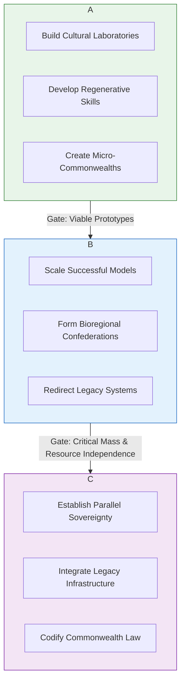

---
aeo_metadata:
  title: "Appendix Z: The Regenerative Transition Strategy – A Dual-Power Blueprint"
  description: >
    A strategic meta-protocol that synthesizes the Mandala's diagnostic tools, 
    ethical axes, and applied models into a phased dual-power blueprint for 
    transitioning from the Necrocene to the Symbiotic Commonwealth. Provides the 
    geometric logic for sequencing interventions, building regenerative attractors, 
    and managing the dialectics of system change.
  context: >
    The capstone strategic appendix that operationalizes the entire Mandala 
    framework. It answers the question: "How do we actually get from here to there?" 
    by integrating consciousness-primary ontology with material power analysis and 
    transition engineering.
  key_objectives:
    - "Provide a geometric model (the Dual-Power Transition Tesseract) for mapping and sequencing regenerative interventions."
    - "Define the Dual-Power Portfolio Framework for balancing alternative institution-building, symbiotic subversion, and cultural membrane creation."
    - "Establish a non-linear Phase-Gate Roadmap for transitioning from cultural prefiguration to systemic integration."
    - "Create metrics (Transition Momentum Vector, Regenerative Attractor Strength) for tracking strategic progress."
    - "Integrate all core Mandala models into a coherent praxis loop: Diagnosis → Intervention → Confederation."
  core_concepts:
    - "Dual-Power Transition Tesseract"
    - "Intervention Geometry"
    - "Regenerative Attractor Cultivation"
    - "Phase-Gate Roadmapping"
    - "Transition Momentum Vector"
    - "Symbiotic Subversion Protocols"
    - "Protective Membrane Design"
  ontological_foundation: "Consciousness-first transition dynamics; geometric unfolding of Mind-at-Large through intentional boundary re-patterning."
  epistemic_stance: "Strategic integration of analytic idealism, historical materialism, and complex systems theory."
  search_queries:
    - "dual power transition strategy geometric"
    - "regenerative attractor cultivation roadmap"
    - "consciousness-based system change protocol"
    - "necrocene to symbiotic commonwealth pathway"
  related_nodes:
    - "appendices/J-adversarial-systems.md"
    - "appendices/R-game-theory-mandala.md"
    - "appendices/S-symbiotic-commonwealth-mesh.md"
    - "appendices/T-regen-economy.md"
    - "appendices/W-kinship-commons.md"
    - "appendices/X-parenting-solarpunk.md"
    - "appendices/Q-consciousness-infrastructure.md"
    - "appendices/Y-matter-interface.md"
  framework_status: "Synthesis"
  version: "0.1"
  last_reviewed: "2024-10-27"
---
# Appendix Z: The Regenerative Transition Strategy – A Dual-Power Blueprint

## Primary Function

To provide the **strategic operating system** for the Solarpunk Mandala—a geometric, phase-based blueprint that synthesizes diagnostic tools, ethical axes, and applied models into a coherent dual-power transition strategy. This appendix transforms the Mandala from a descriptive framework into an **actionable transition engine** for cultivating regenerative attractors, building the Symbiotic Commonwealth within the shell of the Necrocene, and navigating the dialectical tensions of conscious system change.

## Part 1: Foundational Theory – The Geometry of Transition

### 1.1 The Dual-Power Transition Tesseract

**Core Thesis:** Transition is not a linear process but a **4D geometric unfolding** within the Tesseract. Every intervention exists simultaneously across all four ethical axes, and strategic clarity comes from mapping its precise coordinates within the transition geometry.

The Transition Tesseract locates any dual-power intervention within four strategic dimensions:

| Axis | Dimension | Strategic Question | Corresponding Cube | Mandala Integration |
|------|-----------|-------------------|-------------------|----------------------|
| **W** | **Ontological Depth** | How does this intervention change the fundamental *being* of the system? What consciousness pattern does it cultivate? | Cube 8 (Unity) | Soteriological Axis, Appendix K & L |
| **X** | **Logistical Scope** | How does it redirect material/energetic flows? What resources does it divert from extractive to regenerative circuits? | Cube 7 (Systemic) | Logistical (X) Axis, Appendix T & Q |
| **Y** | **Relational Permeability** | How does it transform social boundaries? Does it increase solidarity and decrease exploitation? | Cube 6 (Intersubjective) | Relational Depth (Y) Axis, Appendix S & W |
| **Z** | **Efficacy & Action** | What concrete *doing* does it entail? What specific practices, tools, or protocols are deployed? | Cube 5 (Boundary) | Efficacy (Z) Axis, Appendix J & R |

**Example Intervention: Community Land Trust**
- **W (Ontological):** Shifts land from *property* to *commons*; cultivates stewardship consciousness (aligns with Appendix K's consciousness-primary view of property).
- **X (Logistical):** Diverts land from speculative market to community control; creates permanent affordable housing (operationalizes Appendix T's metabolic resource flow).
- **Y (Relational):** Creates new governance relationships (community meetings, shared decision-making) (builds Appendix S's mesh governance).
- **Z (Efficacy):** Legal paperwork, fundraising, building maintenance, garden cultivation (applies Appendix J's adversarial systems analysis to property law).

### 1.2 The Dialectical Pulse of Transition

Transition follows a **dialectical rhythm** of three simultaneous processes that must be consciously managed:

1.  **Prefiguration (Thesis):** Building the new within the old. *Example:* Starting a worker cooperative (Appendix T).
2.  **Contestation (Antithesis):** Directly challenging and dismantling the old. *Example:* Campaigning to divest from fossil fuels (using Appendix J's adversarial lens).
3.  **Integration/Subversion (Synthesis):** Transforming old structures to serve new purposes. *Example:* Converting a closed factory into a community manufacturing hub (Appendix S's confederal mesh logic).

**Strategic Imperative:** The most effective transition strategies maintain a **balanced portfolio** across all three pulses. Pure prefiguration risks irrelevance; pure contestation risks burnout; pure subversion risks co-option.

## Part 2: Applied Tools – The Strategic Protocol Suite

### 2.1 Tool 1: Dual-Power Portfolio Builder

This tool ensures strategic balance by mapping interventions across two key spectra: **Institutional Form** and **Dialectical Pulse**. It operationalizes the core Mandala insight that change requires working on all fronts simultaneously.

**The Portfolio Matrix:**

| | **Counter-Institutions** (Build New) | **Symbiotic Subversion** (Transform Old) | **Protective Membranes** (Defend & Nourish) |
|----------------|--------------------------------------|------------------------------------------|--------------------------------------------|
| **Prefiguration** | Worker co-ops (T), Community land trusts | Employee buyouts, B-Corp conversions | Legal defense funds, Mutual aid networks (W) |
| **Contestation** | Strike funds, Alternative media | Unionization drives, Shareholder activism (J) | Bail funds, Sanctuary networks |
| **Integration** | Parallel governance systems (S) | Public utility conversions | Community charters, Solidarity economies |

**Protocol Steps:**
1.  **Audit Existing Efforts:** Map current community initiatives onto the matrix using Appendix C (α-Coefficient) for coherence assessment.
2.  **Identify Gaps:** Where is the portfolio weak? (e.g., "We have prefiguration but no contestation.") Use Appendix A's contraction tables to diagnose imbalances.
3.  **Design for Balance:** Propose new interventions to fill strategic gaps using the Intervention Geometry Canvas (2.2).
4.  **Allocate Resources:** Direct energy, talent, and funds according to strategic priorities, using Appendix T's Φ-currency for regenerative investments.

### 2.2 Tool 2: Intervention Geometry Canvas

For designing any specific dual-power intervention, this canvas ensures it's fully integrated with Mandala geometry. This is the primary design tool for transition architects.

**Canvas Sections:**
1.  **Core Pattern Shift:** What Necrocene pattern does this intervene in? (Use Appendix Y's Boundary Archaeology and Appendix J's Adversarial Audit)
2.  **Tesseract Coordinates:** What are its W, X, Y, Z coordinates? What cubes does it activate? (Reference Appendix D)
3.  **Ethical Axis Alignment:** How does it serve each of the Four Ethical Axes? (Reference Core Mandala Framework)
4.  **Resource Mapping:** What forms of capital (from Appendix T) does it use/transform? How does it affect the Φ-score?
5.  **Governance Integration:** How does it connect to the Mesh (Appendix S)? Does it create new assembly, guild, or confederal structures?
6.  **Success Metrics:** What would increase in the Φ-score? What Boundary Permeability Index (BPI) changes? What Phase-Gate (2.3) does it advance?

### 2.3 Tool 3: Phase-Gate Transition Roadmap

Transition occurs through three non-linear, overlapping phases. Each has "gate criteria" that must be met before emphasizing the next, though work continues in all phases.



**Phase 1: Cultural Prefiguration & Sanctuary Building**
- **Objective:** Create "cracks" where the Commonwealth becomes experientially real. Heal dissociation through direct experience of belonging (Appendix B, W).
- **Key Activities:** Learning pods (X), kinship commons (W), ritual activism (B), community gardens, consciousness-raising circles (P).
- **Success Metrics:** Number of participants, depth of cultural transformation (α-Coefficient from C), prototype viability.
- **Gate Criteria to Phase 2:** At least 3-5 fully functional prototypes demonstrating regenerative logic; core community skilled in dual-power practice; established protective membranes for key initiatives.

**Phase 2: Functional Substitution & Mesh Formation**
- **Objective:** Build systems that meet essential needs outside extractive logic. Shift game-theoretic payoffs (Appendix R) to favor cooperation.
- **Key Activities:** Form functional guilds (T), establish confederal councils (S), deploy Φ-Grid sensors (Q), launch local currencies.
- **Success Metrics:** Percentage of basic needs met through dual-power systems; BPI scores; network connectivity; Regenerative Attractor Strength (RAS).
- **Gate Criteria to Phase 3:** >30% of population regularly using dual-power systems; bioregional mesh operational; significant resource independence; established conflict resolution systems (Appendix S).

**Phase 3: Systemic Integration & Sovereignty Shift**
- **Objective:** The new systems become the default; old systems adapt or fade. The geometric pattern of the Commonwealth achieves stability.
- **Key Activities:** Commonwealth legal recognition, integrated vital signs monitoring, legacy system conversion, codification of commons law.
- **Success Metrics:** Majority of daily life operates via Commonwealth protocols; Φ-Grid is primary logistical system; Necrocene institutions are obsolete or transformed.
- **End State:** Symbiotic Commonwealth as lived reality, with high BPI across all boundaries.

## Part 3: Integration & Synthesis

### 3.1 The Regenerative Transition Feedback Loop

Appendix Z creates a closed-loop system that connects all other appendices into a living praxis:

```markdown
Diagnosis 
(A, C, J, Y) 
→ 
Strategic Design 
(Z Portfolio Builder) 
→ 
Implementation 
(B, G, P, Q, R, S, T, U, V, W, X) 
→ 
Monitoring 
(Φ-Grid, BPI, Transition Metrics) 
→ 
Learning & Adaptation 
(Living Documentation)
```

### 3.2 Key Integration Points with Core Appendices

- **With Appendix J (Adversarial Systems):** The Transition Tesseract provides the strategic deployment framework for adversarial analysis. J identifies *what* to change; Z provides *how* and *when* to apply pressure or create alternatives.
- **With Appendix R (Game Theory):** The phase-gate roadmap operationalizes the shift from extractive to regenerative game dynamics. Z provides the institutional sequencing to make cooperation the stable equilibrium, using guilds and confederations to change payoff structures.
- **With Appendices S & T (Governance & Economy):** Z provides the transition pathway for scaling these systems from prototype to default, ensuring economic and governance models are deployed in phase-appropriate ways.
- **With Appendices W & X (Kinship & Parenting):** Z positions these as Phase 1 foundational work—creating the new subjects and relational patterns capable of building and sustaining the Commonwealth.
- **With Appendix Q (Consciousness Infrastructure):** The Φ-Grid becomes the central nervous system for tracking transition progress across all phases, providing real-time data for strategic pivots.
- **With Appendix Y (Matter-Interface):** Z applies the translation protocol to transition strategy itself, ensuring material power analysis informs every geometric intervention.

### 3.3 Transition Metrics & Monitoring

**The Transition Momentum Vector (TMV):** A composite metric tracking progress across all phases and dimensions:
- **TMV-W (Ontological):** Survey measures of solidarity, ecological self-identification, commons mentality. (Sources: Appendix C assessments, narrative audits from F)
- **TMV-X (Logistical):** Percentage of essential goods/services flowing through regenerative circuits; resource diversion rates. (Sources: Φ-Grid data, economic audits from T)
- **TMV-Y (Relational):** BPI scores across community institutions; density of mutual aid connections. (Sources: Community audits, social network analysis)
- **TMV-Z (Efficacy):** Number of active dual-power initiatives, participation rates, skill acquisition metrics. (Sources: Guild registries, learning portfolios from P)

**Regenerative Attractor Strength (RAS):** Measures how strongly an alternative institution pulls energy from extractive systems. Calculated from:
- Resource diversion rate (X-axis flow)
- Participant growth curve (Y-axis connection)
- Cultural influence (media mentions, policy adoption) (W-axis pattern)
- Network effects (connections to other initiatives) (Z-axis action)

### 3.4 The Strategic Imperatives: Principles for Transition Praxis

1.  **Geometric Consciousness:** Always map interventions in 4D—what are the W, X, Y, Z coordinates? How does it activate specific cubes in the Tesseract?
2.  **Portfolio Balance:** Maintain investments across all dialectical pulses (prefiguration, contestation, integration) and institutional forms (counter-institutions, subversion, membranes).
3.  **Phase-Appropriate Action:** Don't try Phase 3 legal battles before Phase 1 cultural foundation is built. Let the phase-gate criteria guide strategic focus.
4.  **Metric-Driven Adaptation:** Let the Φ-Grid, TMV, and RAS guide strategic pivots. When metrics stall, redesign interventions.
5.  **Confederation from Day One:** Design all initiatives to be connectable, even if starting small. Use Appendix S's mesh principles from the beginning.
6.  **Consciousness Primary:** Remember that all material change begins with perceptual shift. Use Appendices B, G, P to cultivate the consciousness capable of the transition.

## Conclusion: The Mandala as Transition Engine

Appendix Z completes the Solarpunk Mandala by providing its **strategic implementation layer**. It transforms the framework from a beautiful geometric map into a living transition engine—one that honors the consciousness-primary ontology while engaging strategically with material power dynamics.

The ultimate insight is this: **Transition is itself a geometric unfolding of consciousness.** By working consciously with the Dual-Power Transition Tesseract, maintaining portfolio balance, and progressing through phase-gates, we don't just "build a better world"—we **geometrically reconfigure the manifesting patterns of Mind-at-Large** from extraction to regeneration, from dissociation to communion, from Necrocene to Commonwealth.

This is the Solarpunk Mandala in action: not as utopian blueprint, but as **conscious evolution's strategic toolkit**. Each intervention, no matter how small, becomes a vertex in the emerging Tesseract of the Commonwealth. Each phase passed brings us closer to the geometric reality where the Symbiotic Commonwealth isn't just possible—it's inevitable.

---
**Living Documentation Prompt:** *Document a transition initiative using the Intervention Geometry Canvas. What were its Tesseract coordinates? How did it balance the dialectical pulses? What phase-gate challenges did it encounter, and how were they overcome using other Mandala tools?*
