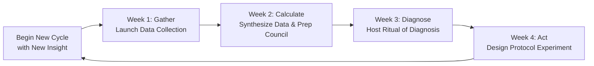

# Facilitator's Toolkit: Overview

## Purpose & Philosophy

Welcome to the Facilitator's Toolkit for the Regenerative Capital Dashboard.

This toolkit exists for one core reason: to support you in guiding your community through the living practice of the Solarpunk Mandala. It translates the framework's theory into actionable, grounded facilitation.

Here, facilitation is understood not as mere meeting management, but as a **act of co-creation**—you are helping to birth and nurture the community's collective capacity for conscious self-creation. Your role is to hold the container, ask the revealing questions, and trust the group's innate wisdom to emerge.

### Guiding Principles for Facilitation
*   **Service, Not Control:** Your task is to serve the group's process and the Mandala's ethical goals (Unitive, Beautiful, Just, True), not to control the outcome.
*   **The Ritual Container:** Each meeting, especially the **Ritual of Diagnosis**, is a ritual. Your attention to opening, atmosphere, and closing shapes the quality of insight.
*   **Wisdom is in the Room:** You do not need all the answers. Your primary skill is eliciting the intelligence and experience present within the community.
*   **Embrace the Cycle:** The 4-week sprint is a learning loop. Your role includes helping the community embrace both progress and setbacks as vital feedback.

## The Facilitator's Journey: A Roadmap

Your journey mirrors the community's 4-week sprint cycle. This toolkit is organized to provide the right resources at each phase of this journey.

## Master Checklist & Resource Guide

Use this table as your high-level checklist and map to the detailed resources in this toolkit. It outlines the core task and key questions for each phase, and points you to the specific guides, scripts, and templates designed to support you.

| Phase | Your Core Task | Key Questions You Hold | Primary Toolkit Resources |
| :--- | :--- | :--- | :--- |
| **Preparation** | Ground the community in the "why" and establish clear roles and scope. | "What are our shared intentions for this practice?"   "Who will steward which parts of the process?" | `01-preparation-phase/onboarding-guide.md`   `01-preparation-phase/role-descriptions.md`   `01-preparation-phase/scoping-worksheet.md` |
| **Week 1: Gather** | Initiate the collection of quantitative data and qualitative stories with clarity and care. | "How can we frame data gathering as an act of listening, not surveillance?"   "Is everyone clear on what to do and why?" | `02-week-1-gather/data-collection-script.md`   `02-week-1-gather/poll-launch-email.md`   `02-week-1-gather/steward-check-in.md` |
| **Week 2: Calculate** | Synthesize raw data into a clear, honest narrative for the community council. | "What is the story the data and stories are telling us?"   "How can I present this information simply and beautifully?" | `03-week-2-calculate/data-synthesis-cheatsheet.md`   `03-week-2-calculate/visualization-guide.md`   `03-week-2-calculate/council-brief-template.md` |
| **Week 3: Diagnose** | Host the **Ritual of Diagnosis**, guiding the community from observation to shared insight. | "How can I create a container for deep, authentic listening?"   "What pattern ('cube') is most asking to be released?" | `04-week-3-diagnose/ritual-script.md`   `04-week-3-diagnose/facilitator-questions.md`   `04-week-3-diagnose/cube-description-cards.md` |
| **Week 4: Act** | Help the community translate diagnosis into a focused, learnable experiment. | "What small, brave step can we take to soften this pattern?"   "How will we know what we're learning?" | `05-week-4-act/protocol-selection-worksheet.md`   `05-week-4-act/experiment-canvas.md`   `05-week-4-act/closing-cycle-ritual.md` |

## How to Use This Toolkit

1.  **Begin with Preparation:** Do not skip the `01-preparation-phase/`. A strong, shared foundation is 80% of successful facilitation.
2.  **Adapt, Don't Adopt:** These scripts and guides are templates. Modify the language, timing, and activities to fit your community's unique culture and needs. The principles are invariant; the forms are flexible.
3.  **Leverage Templates:** Find ready-to-use slides, posters, and documents in the `06-templates-and-printables/` folder to save time and energy.
4.  **Troubleshoot:** When you hit a snag—low participation, conflict, confusion—consult `07-faq-and-troubleshooting.md` for grounded advice.

## A Final Note: You Are Not Alone

Facilitation can feel lonely, but you are practicing in concert with a broader pattern of regeneration. This toolkit is your companion. Use it to reduce your cognitive load so you can be more present, intuitive, and courageous for your community.

**Your next step:** Proceed to `01-preparation-phase/onboarding-guide.md` to begin crafting your community's launch.

---
*Return to the [Dashboard Overview](../dashboard-mvp/01-overview.md) or the [Arena Index](../index.md).*
