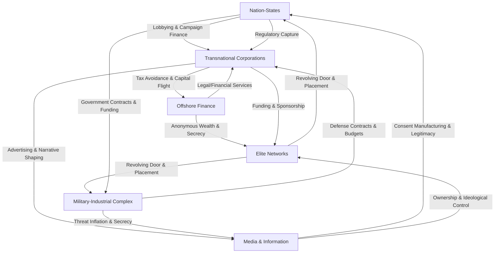
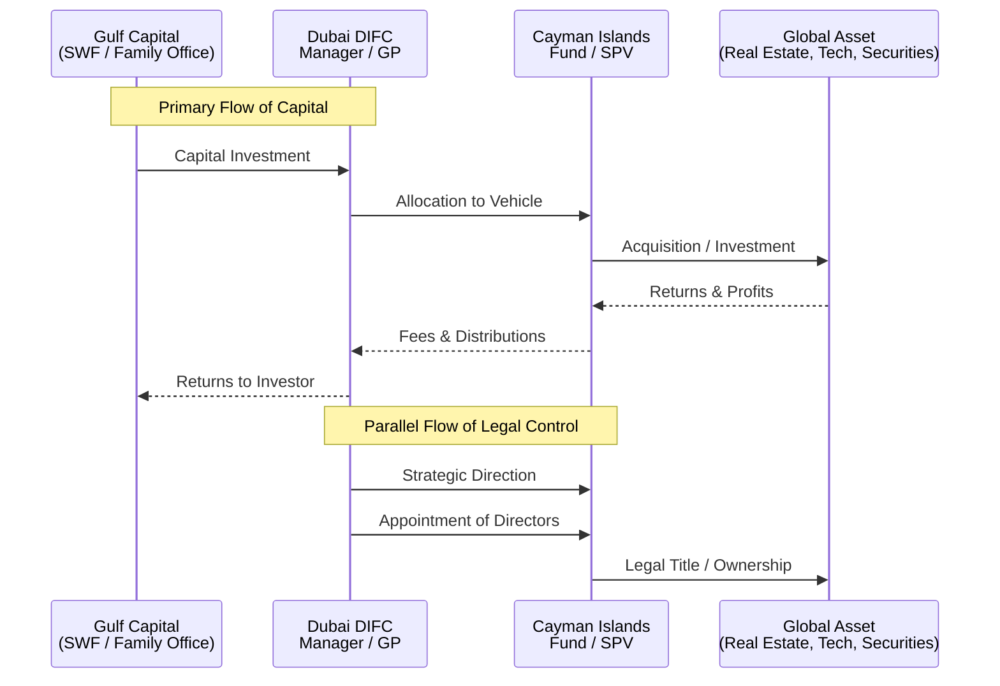
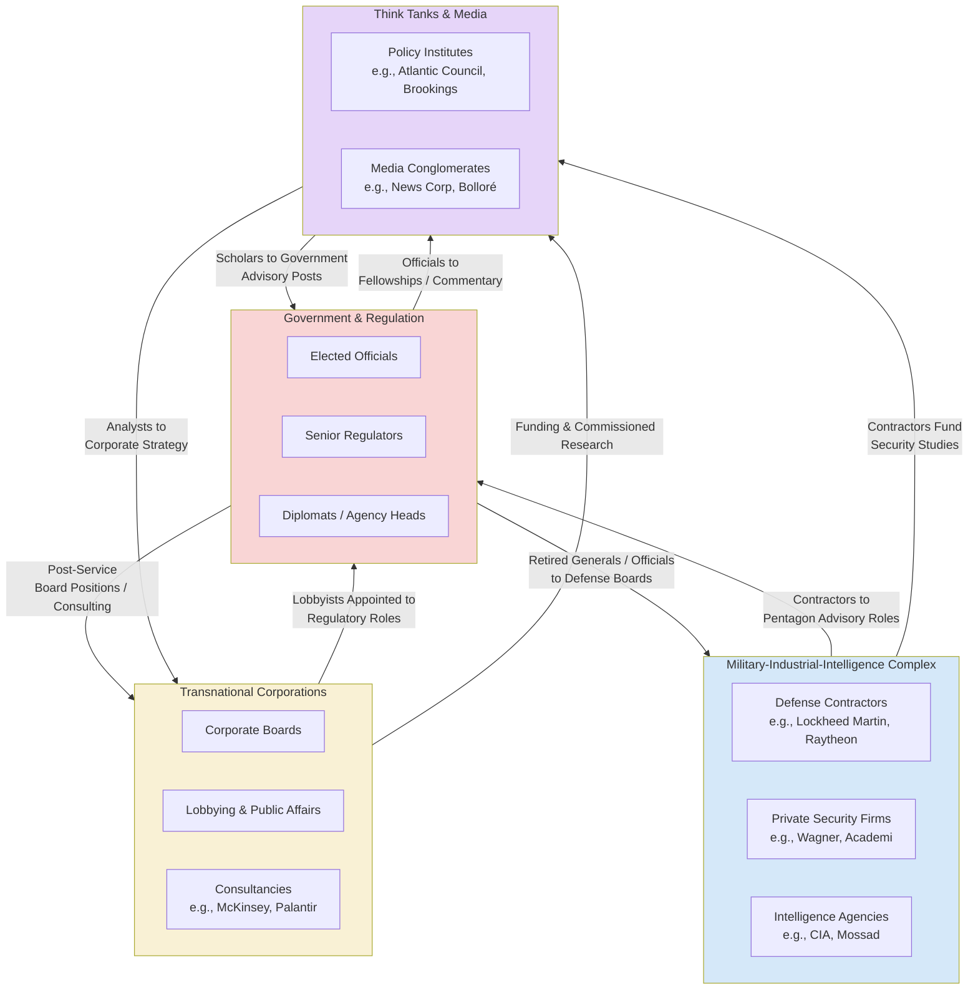

# Game A Hierarchy in the Arena Rhizome

## 1. Introduction: The Arena Framework & Game A
This document synthesizes research into the dominant global power structure, termed "Game A," through the analytical lens of the **Arena Rhizomatic Network**. Unlike traditional hierarchical models, the Arena framework conceptualizes power as a decentralized, adaptive, and self-reinforcing web—a rhizome. This network comprises interdependent cohorts connected by flows of capital, influence, and ideology. The purpose of this mapping is to identify the structure's key nodes, critical connections, internal fractures, and agents to reveal strategic leverage points for systemic transformation toward a "Game B" or symbiotic commonwealth.

### 1.1 The Operating System: Three Pillars of Pax Americana

Beneath the visible cohorts of Game A lies a foundational layer—the operating system that emerged from the post-Cold War "unipolar moment" (1991–2026). These three pillars are not merely supporting structures; they are the deep protocols that enable, legitimize, and coordinate the entire Game A rhizome. Their concurrent decay defines the terminal crisis of the current order.

#### 1.1.1 Pillar 1: Military Supremacy (Pax Americana)

- **Core Function**: The use of American military power—specifically aerial supremacy, special forces, and CIA infiltration—to guarantee global "peace" and enforce the rules-based international order.
- **Mechanisms**:
    - **Aerial Supremacy**: The capacity to destroy any government or infrastructure deemed problematic, serving as the ultimate backstop for all other power flows.
    - **Infiltration & Regime Management**: CIA operations to identify, promote, and protect elites loyal to the American Empire, while demoting or eliminating challengers.
    - **Multilateral Veneer**: Power projected through institutions (UN, World Bank, WTO) to mask American hegemony as collective, rules-based governance.
- **Connection to Game A Cohorts**: This pillar provides the coercive backbone for Nation-States (US as hegemon), the Military-Industrial-Intelligence Complex (as primary beneficiary and executor), and the "rules-based order" narrative sustained by Media-Information Conglomerates.

#### 1.1.2 Pillar 2: Science as Religion

- **Core Function**: The elevation of science—and its transnational priesthood of credentialed researchers—from a method of inquiry to the dominant global source of authority, legitimacy, and orthodoxy.
- **Mechanisms**:
    - **Transnational Loyalty**: Scientists owe primary loyalty to the international scientific order (Nature, Nobel prizes, academic prestige), superseding national or ethical allegiances.
    - **Orthodoxy & Suppression**: Science becomes a tool for enforcing consensus rather than fostering innovation; dissent is framed as heresy ("How dare you question science?").
    - **Legitimacy Factory**: Universities, research institutes, and peer-reviewed journals provide the "objective" justification for policy, regardless of underlying funding or power dynamics.
- **Connection to Game A Cohorts**: This pillar supplies epistemic legitimacy to all cohorts, particularly Transnational Corporations (ESG, "tech solutionism"), Media (framing expert consensus), and Elite Networks (shared intellectual status).

#### 1.1.3 Pillar 3: Dollar Hegemony

- **Core Function**: The universal acceptance of the US dollar as the global reserve currency, a medium of exchange, and—crucially—an aspirational object of accumulation.
- **Mechanisms**:
    - **Seigniorage & Corruption**: The ability to print the world's reserve currency allows the US to consume without producing, funding endless deficits, military adventures, and elite enrichment.
    - **Aspirational Capture**: The dollar becomes not just a medium of exchange but a life goal; individuals and nations orient their entire existence around accumulating it, internalizing the logic of the system.
    - **Financialized Inequality**: Unlimited dollar printing drives asset inflation, enriching older generations (boomers) and creating a sense of futility among younger cohorts, who retreat into gambling (crypto, sports betting) or disengagement.
- **Connection to Game A Cohorts**: This pillar is the lifeblood of Offshore Finance & Secrecy Jurisdictions (which exist to manage and hide dollar-denominated wealth), Transnational Corporations (which optimize for dollar profits), and the cognitive environment shaped by Media (celebrating wealth accumulation).

#### 1.1.4 The Decay of the Pillars (2026– )

All three pillars are now in terminal decay due to internal contradictions:

1.  **Hubris of Military Supremacy**: The US increasingly ignores the "rules-based order" it created (bombing Libya, Syria, Iran without multilateral approval), exposing the system as naked empire and eroding legitimacy.
2.  **Orthodoxy of Science**: The scientific establishment, having become a priesthood, suppresses disruptive innovation, leading to decades of stagnation (food delivery apps, not moonshots).
3.  **Corruption of Dollar Hegemony**: Unlimited printing has devalued the currency, fueled grotesque inequality, and created a global move toward de-dollarization and regional trading blocs.

The collapse of these three pillars is not a future event—it is the defining characteristic of the present moment, creating the fractures and openings that Game B strategies must exploit.

### 1.2 The Financial Architecture of Game A: Historical Origins & Operating Logic

The three pillars of Pax Americana rest upon a deeper financial architecture—an operating system designed centuries ago to prioritize capital mobility, privatize profit, and socialize loss. Understanding this architecture is essential for recognizing that financial crises are not accidents but engineered transitions that serve the interests of transnational capital.

#### 1.2.1 The 1688 System: The Original Blueprint

The modern financial order traces its origins to the **Glorious Revolution of 1688**, which merged the wealth of the Dutch Republic (then the richest region in the world, controlling the spice trade) with the military protection of the British Empire. This marriage produced the **Bank of England (1694)** —a private institution accountable to no electorate, with the power to print money and lend it to Parliament.

Three characteristics defined this system and continue to define Game A today:

1.  **Profits Privatized, Losses Socialized**  
    Private investors capture all upside from war, colonization, and speculation, while the nation-state (and therefore the public) absorbs all downside. The Bank of England’s model guaranteed that lending to the state was risk‑free, because the state would never default—it could always tax or borrow more.

2.  **Activity (War) as the Engine of Wealth**  
    Capital does not grow by sitting idle; it requires *activity*. The most profitable activity historically has been war: conquest opens new markets, secures resources, and generates reconstruction contracts. The British Empire’s rapid expansion after 1694—the Napoleonic Wars, the Great Game, the conquest of India and China—was financed by this system.

3.  **Transnationalism / Open Borders**  
    Capital must flow freely across borders to seek the highest returns. Nationalism, ethnic identity, and local control are treated as obstacles to be overcome. The system’s ideal is a borderless world where capital moves at will while populations remain constrained.

#### 1.2.2 The Ideological Justification: Replacing Religion with Materialism

To make this system palatable, transnational capital sponsored a new intellectual framework that elevated **materialism** to the status of a religion. Key philosophers were funded or promoted to systematically remove the divine from human understanding:

- **John Locke**: Argued that private property is a God‑given right and promoted empiricism—the idea that we can only know what we directly experience, thereby dismissing any inquiry into transcendent meaning.
- **David Hume**: Advanced skepticism, teaching that most of what we “know” is mere custom or habit, undermining any authority beyond individual desire.
- **Jeremy Bentham & John Stuart Mill**: Utilitarianism declared that pleasure is the ultimate good; therefore, making and spending money became the highest form of human flourishing.
- **Karl Marx, Charles Darwin, Sigmund Freud**: Each further erased the divine: Marx reduced history to class struggle, Darwin reduced humanity to animality, Freud reduced motivation to sexuality.

Together, these ideas created a cultural environment where **money is God**—the universal object of aspiration and the measure of all value. This worldview is not accidental; it was deliberately constructed to align human energy with the needs of capital accumulation.

#### 1.2.3 The American Phase: From Colony to Host

After the American Revolution, the newly independent United States resisted British transnational capital. But the City of London used **agents**—Rockefeller, Carnegie, J.P. Morgan, Vanderbilt—to monopolize key industries and eventually create a U.S. version of the Bank of England: the **Federal Reserve (1914)**.

The pattern that followed repeats the 1688 template:
- Federal Reserve created → U.S. enters World War I (1917)
- Stock market collapse (1929) → Great Depression
- U.S. enters World War II (1941)

The Federal Reserve is not a public institution; it is the mechanism by which transnational capital **captured the American host**. It enables the same three characteristics: privatized profits (Wall Street bonuses) with socialized losses (bailouts), constant military activity, and open capital flows.

#### 1.2.4 The 2008 Crisis and the Failed Pivot to China

After the 2008 financial crisis, the **Bank for International Settlements (BIS)** —the “central bank of central banks”—recognized that the Western economies were over‑leveraged. Their solution was to shift the center of economic gravity to China by manipulating the renminbi exchange rate. The signal was sent: invest in China.

China responded by printing money, building massive infrastructure, and becoming the world’s manufacturing hub. Chinese banks now dominate the global top four, and Chinese exports have flooded the world. But this strategy hit two walls:

- **China does not want to be hegemon**: It refuses to maintain a global military presence or act as the world’s reserve currency.
- **America will not permit China to replace it**: The resulting trade war and strategic rivalry block the full transition.

#### 1.2.5 The Current Transition: Collapsing America, Rising Israel

With the West declining and China unwilling to lead, transnational capital is now engineering a shift to **Israel**. This is the hidden logic behind the US‑Iran war and the broader instability in the Middle East.

Israel offers the ideal conditions for capital:
1. **War as Profit**: The Greater Israel Project ensures continuous military activity—the most profitable environment for the 1688 system.
2. **Reconstruction as Investment**: After war comes rebuilding, requiring massive capital infusions.
3. **Geographic Hub**: Israel’s location gives it control over trade routes between Europe, Asia, and Africa, making it a future logistics and finance hub.

To facilitate this shift, transnational capital must first **collapse the American economy**. This will likely be done by bursting the private credit bubble ($2 trillion in risky loans) and the AI bubble (companies like OpenAI and Nvidia that generate no profit). As in 2008, insiders will profit from short positions, consolidate weakened industries, and acquire distressed American assets (resources, water, oil) at fire‑sale prices before exiting.

#### 1.2.6 Strategic Implications for Game B

Understanding this financial architecture reveals that the current crises are not random—they are deliberate transitions engineered for elite profit. For Game B, this means:

- **Build local resilience before collapse**: Community‑owned energy, cooperative finance, and mutual aid networks are not alternatives; they are survival infrastructure for the coming engineered collapse.
- **Reclaim the spiritual**: The system’s power rests on the belief that “money is God.” Genuine spiritual practice, rooted in community and ecology, directly counters this ideological foundation.
- **Transparency as defense**: Expose the financial flows, secret societies, and occult networks that coordinate the system. Transparency disrupts the secrecy on which Game A depends.
- **Prepare for a new center of gravity**: As capital shifts to Israel, regions that were previously peripheral may become more autonomous. Game B strategies should anticipate and support this decentralization.

> *The collapse of the pillars (Section 1.1) and the financial architecture (Section 1.2) together form the complete diagnostic of Game A. They explain not only what is ending, but how it was built and where it is going—providing the strategic map needed to navigate the transition.*

## 2. 🌀 Game A Hierarchy: Cohorts, Fractures & Key Agents
The following cohorts constitute the primary nodes in the Game A rhizome. Each maintains its own internal hierarchy but achieves ultimate influence through symbiotic, often opaque, relationships with the others.

### 2.1 Nation-States
*   **Core Function:** Formal sovereignty and legal-territorial control; monopolists of legitimized violence; negotiators of international frameworks.
*   **Primary Fractures & Internal Tensions:**
    *   **Sovereignty vs. Capture:** Tension between democratic mandate and permeation by corporate lobbying, offshore finance, and elite networks.
    *   **Geopolitical Schism:** Division between states that are *homes to capital* (e.g., US, EU), *venues for extraction* (Global South), and *sovereignty vendors* (offshore hubs like UAE, Singapore).
    *   **The Consultancy State:** Erosion of internal policy capacity and abdication of sovereign functions to private consultancies (e.g., McKinsey, PwC).
*   **Representative Agents & Mechanisms:**
    *   **Agents:** Corrupted officials; legislators on influential committees; captured regulatory body heads.
    *   **Mechanisms:** The revolving door; corporate campaign finance; regulatory arbitrage.

### 2.2 Transnational Corporations (TNCs)
*   **Core Function:** Primary engines of globalized capital accumulation and resource extraction; optimizers of supply chains, labor, and tax liability across jurisdictions.
*   **Primary Fractures & Internal Tensions:**
    *   **Extractive vs. "Conscious" Capital:** Fracture between incumbent fossil fuel/mining/agribusiness sectors and newer "tech" or ESG-branded sectors.
    *   **Short-term Shareholder Value vs. Long-term Systemic Risk:** Fundamental tension between the quarterly earnings imperative and the need to address climate, inequality, and social stability.
    *   **Regulatory Capture vs. Public Backlash:** Risk of overreach where aggressive lobbying and tax avoidance spark political and consumer backlash.
*   **Representative Agents & Mechanisms:**
    *   **Agents:** Corporate lobbying arms; industry associations (MEDEF, BDI); CEOs of extractive and tech giants; Public Affairs executives.
    *   **Mechanisms:** Direct lobbying; financing of political campaigns and think tanks; strategic litigation; greenwashing.

### 2.3 Offshore Finance & Secrecy Jurisdictions
*   **Core Function:** Provide the legal-financial architecture for capital mobility, tax evasion/avoidance, anonymous wealth holding, and regulatory arbitrage.
*   **Primary Fractures & Internal Tensions:**
    *   **Old Secrecy vs. New Legitimacy:** Tension between traditional opaque tax havens (e.g., Cayman Islands) and newer "onshore-offshore" hubs (Dubai, Singapore) that combine zero tax with a facade of robust regulation.
    *   **Dependence on International Tolerance:** Vulnerability to blacklists (EU, FATF) and global transparency initiatives.
*   **Representative Agents & Mechanisms:**
    *   **Agents:** Swiss private bankers; Cayman-based legal firm partners; family office managers in Dubai/Singapore; trust and estate planners.
    *   **Mechanisms:** Shell companies and SPVs; discretionary trusts; privacy laws; legal opacity.

### 2.4 Media-Information Conglomerates
*   **Core Function:** Shape public perception, control narrative frameworks, manufacture consent or dissent, and commodify attention.
*   **Primary Fractures & Internal Tensions:**
    *   **Legacy vs. New Media:** Battle between traditional broadcast/print institutions and digital platform empires (Meta, Alphabet).
    *   **Public Interest vs. Profit/Propaganda:** Conflict within organizations between journalistic integrity and the demands of owners, advertisers, or political patrons.
    *   **Platforms as Publishers:** The unresolved tension of social media companies' responsibility for content and algorithmic amplification.
*   **Representative Agents & Mechanisms:**
    *   **Agents:** Moguls with ideological projects (e.g., Vincent Bolloré, Rupert Murdoch); Silicon Valley platform CEOs; algorithm engineers.
    *   **Mechanisms:** Ownership control; editorial direction; algorithmic curation; targeted advertising/micro-targeting.

### 2.5 Military-Industrial-Intelligence Complex (MIC)
*   **Core Function:** Provide coercive capabilities, intelligence, and "security" narratives that justify eternal expansion and budget growth.
*   **Primary Fractures & Internal Tensions:**
    *   **Public vs. Private Provision:** Tension between state militaries/intelligence agencies and the growing role of private military/security contractors (e.g., Wagner Group).
    *   **Old Arsenal vs. New Tech:** Competition between traditional defense primes (Lockheed Martin) and Silicon Valley defense-tech startups (Anduril, Palantir).
*   **Representative Agents & Mechanisms:**
    *   **Agents:** Defense contractors' CEOs; retired generals/admirals on corporate boards; intelligence officials moving into private surveillance.
    *   **Mechanisms:** The revolving door (Pentagon to contractor); threat inflation; political contributions from defense employees; "black budget" lobbying.

### 2.6 Elite Networks & Secret Societies
*   **Core Function:** Foster social cohesion, trust, and ideological alignment within the transnational capitalist class. The stealth connectors that synchronize action across formal cohort boundaries.
*   **Primary Fractures & Internal Tensions:**
    *   **Exclusion vs. Legitimacy:** Risk that excessive secrecy or exposure of coordination undermines public legitimacy and sparks backlash.
    *   **Inter-Generational & Ideological Shifts:** Potential for younger elites to hold diverging views on issues like climate change or inequality.
*   **Representative Agents & Mechanisms:**
    *   **Agents:** Members of forums (Bilderberg, Davos WEF); members of invitation-only think tanks (Council on Foreign Relations); old-money dynastic families.
    *   **Mechanisms:** Closed-door meetings; initiation rituals and social bonding; intermarriage; shared educational backgrounds.

## 3. Investigative Case Studies: Methodology & Findings

### 3.1 Case Study 1: Cognitive Capture - The Think Tank Funding Network
*   **Research Objective:** To trace the flow of financial capital from corporate, governmental, and ideological donors into think tanks, and to map how this funding influences research agendas, policy framing, and personnel.
*   **Methodology:**
    1.  **Cluster Identification:** Select a policy domain (e.g., climate, tax, foreign policy). Identify 3-5 dominant think tanks producing influential reports.
    2.  **Funding Source Analysis:** Use primary tools like the **Think Tank Funding Tracker** and secondary sources like annual reports and IRS 990 forms.
    3.  **Personnel Network Analysis:** Track career paths of think tank scholars, directors, and board members to/from government posts, corporate boards, and donor organizations.
    4.  **Narrative Analysis:** Compare policy outputs and public statements of think tanks with the stated interests of their major funders.
*   **Key Findings (Illustrative):**
    *   Foreign governments (UAE, Qatar) and Pentagon contractors are top funders of major U.S. foreign policy think tanks (Atlantic Council, Brookings).
    *   This creates a **"perspective filter"** where policy options aligning with donor interests receive more funding, research, and promotion.

### 3.2 Case Study 2: Capital Conduits - The Cayman-Dubai Axis
*   **Research Objective:** To dissect the specific legal and financial mechanisms by which capital flows through the hybrid offshore-onshore network.
*   **Methodology:**
    1.  **Structural Mapping:** Analyze standard fund and SPV structures domiciled in the Cayman Islands.
    2.  **Service Provider Mapping:** Identify key law firms, auditors, and administrators that operate in both jurisdictions.
    3.  **Flow Tracing:** Use leaked documents, financial reports, and legal case studies to trace exemplar capital flows.
    4.  **Regulatory Analysis:** Contrast the legal frameworks of each jurisdiction to understand the arbitrage offered.
*   **Key Findings (Illustrative):**
    *   This axis represents the **evolution of offshore finance**: from pure secrecy to **legitimized opacity**. It combines Cayman's frictionless financial engineering with Dubai's geopolitical stability.

## 4. Strategic Implications & Leverage Points for Game B
- **Target Cognitive Infrastructure**: Expose funding links and conflicts of interest in think tanks to break the "inevitability" frame of Game A. Build parallel, transparent epistemic communities.
- **Exploit Cohort Fractures**: Amplify tensions between extractive and "conscious" capital, or between old and new offshore models, to destabilize unified fronts.
- **Disrupt Critical Rhizomatic Connections**: Advocate for strong "cooling-off" periods to sever the revolving door. Support global asset registries and beneficial ownership transparency to disrupt offshore secrecy.
- **Build Resilient Parallel Networks**: Develop community-owned energy, cooperative finance, and open-source media to create functional Game B alternatives that can bypass captured Game A nodes.
- **Address the Pillars Directly**:
    - **Against Military Supremacy**: Build non-coercive security and mutual defense networks that do not rely on state monopoly on violence.
    - **Against Science as Religion**: Reclaim science as open, critical inquiry; demystify expertise; build citizen science and participatory research.
    - **Against Dollar Hegemony**: Develop local currencies, time banking, and cooperative finance that decouple well-being from dollar accumulation.

## 5. Visual Synthesis: System Diagrams

*  **Diagram 1: The Arena Rhizome - Core Cohorts & Primary Flows**

*  **Diagram 2: The Mechanism of Cognitive Capture**

*  **Diagram 3: Capital Flow Through the Cayman-Dubai Axis**

*  **Diagram 4: The Revolving Door Between Game A Cohorts**

---
