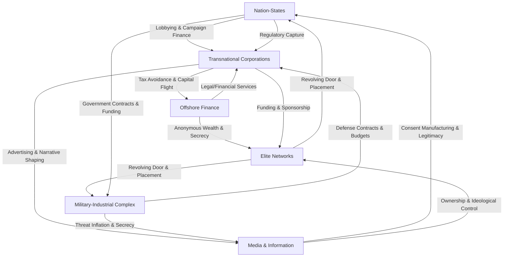
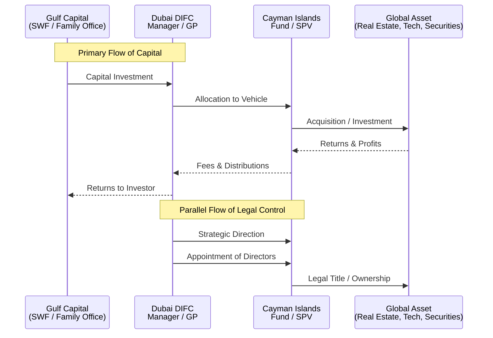

# Game A Hierarchy in the Arena Rhizome

## 1. Introduction: The Arena Framework & Game A
This document synthesizes research into the dominant global power structure, termed **"Game A,"** through the analytical lens of the **Arena Rhizomatic Network**. Unlike traditional hierarchical models, the Arena framework conceptualizes power as a decentralized, adaptive, and self-reinforcing web—a rhizome. This network comprises interdependent cohorts connected by flows of capital, influence, and ideology. The purpose of this mapping is to identify the structure's key nodes, critical connections, internal fractures, and agents to reveal strategic leverage points for systemic transformation toward a "Game B" or symbiotic commonwealth.

## 2. 🌀 Game A Hierarchy: Cohorts, Fractures & Key Agents
The following cohorts constitute the primary nodes in the Game A rhizome. Each maintains its own internal hierarchy but achieves ultimate influence through symbiotic, often opaque, relationships with the others.

### 2.1 Nation-States
*   **Core Function:** Formal sovereignty and legal-territorial control; monopolists of legitimized violence; negotiators of international frameworks.
*   **Primary Fractures & Internal Tensions:**
    *   **Sovereignty vs. Capture:** Tension between democratic mandate and permeation by corporate lobbying, offshore finance, and elite networks.
    *   **Geopolitical Schism:** Division between states that are *homes to capital* (e.g., US, EU), *venues for extraction* (Global South), and *sovereignty vendors* (offshore hubs like UAE, Singapore).
    *   **The Consultancy State:** Erosion of internal policy capacity and abdication of sovereign functions to private consultancies (e.g., McKinsey, PwC).
*   **Representative Agents & Mechanisms:**
    *   **Agents:** Corrupted officials; legislators on influential committees; captured regulatory body heads.
    *   **Mechanisms:** The revolving door; corporate campaign finance; regulatory arbitrage.

### 2.2 Transnational Corporations (TNCs)
*   **Core Function:** Primary engines of globalized capital accumulation and resource extraction; optimizers of supply chains, labor, and tax liability across jurisdictions.
*   **Primary Fractures & Internal Tensions:**
    *   **Extractive vs. "Conscious" Capital:** Fracture between incumbent fossil fuel/mining/agribusiness sectors and newer "tech" or ESG-branded sectors.
    *   **Short-term Shareholder Value vs. Long-term Systemic Risk:** Fundamental tension between the quarterly earnings imperative and the need to address climate, inequality, and social stability.
    *   **Regulatory Capture vs. Public Backlash:** Risk of overreach where aggressive lobbying and tax avoidance spark political and consumer backlash.
*   **Representative Agents & Mechanisms:**
    *   **Agents:** Corporate lobbying arms; industry associations (MEDEF, BDI); CEOs of extractive and tech giants; Public Affairs executives.
    *   **Mechanisms:** Direct lobbying; financing of political campaigns and think tanks; strategic litigation; greenwashing.

### 2.3 Offshore Finance & Secrecy Jurisdictions
*   **Core Function:** Provide the legal-financial architecture for capital mobility, tax evasion/avoidance, anonymous wealth holding, and regulatory arbitrage.
*   **Primary Fractures & Internal Tensions:**
    *   **Old Secrecy vs. New Legitimacy:** Tension between traditional opaque tax havens (e.g., Cayman Islands) and newer "onshore-offshore" hubs (Dubai, Singapore) that combine zero tax with a facade of robust regulation.
    *   **Dependence on International Tolerance:** Vulnerability to blacklists (EU, FATF) and global transparency initiatives.
*   **Representative Agents & Mechanisms:**
    *   **Agents:** Swiss private bankers; Cayman-based legal firm partners; family office managers in Dubai/Singapore; trust and estate planners.
    *   **Mechanisms:** Shell companies and SPVs; discretionary trusts; privacy laws; legal opacity.

### 2.4 Media-Information Conglomerates
*   **Core Function:** Shape public perception, control narrative frameworks, manufacture consent or dissent, and commodify attention.
*   **Primary Fractures & Internal Tensions:**
    *   **Legacy vs. New Media:** Battle between traditional broadcast/print institutions and digital platform empires (Meta, Alphabet).
    *   **Public Interest vs. Profit/Propaganda:** Conflict within organizations between journalistic integrity and the demands of owners, advertisers, or political patrons.
    *   **Platforms as Publishers:** The unresolved tension of social media companies' responsibility for content and algorithmic amplification.
*   **Representative Agents & Mechanisms:**
    *   **Agents:** Moguls with ideological projects (e.g., Vincent Bolloré, Rupert Murdoch); Silicon Valley platform CEOs; algorithm engineers.
    *   **Mechanisms:** Ownership control; editorial direction; algorithmic curation; targeted advertising/micro-targeting.

### 2.5 Military-Industrial-Intelligence Complex (MIC)
*   **Core Function:** Provide coercive capabilities, intelligence, and "security" narratives that justify eternal expansion and budget growth.
*   **Primary Fractures & Internal Tensions:**
    *   **Public vs. Private Provision:** Tension between state militaries/intelligence agencies and the growing role of private military/security contractors (e.g., Wagner Group).
    *   **Old Arsenal vs. New Tech:** Competition between traditional defense primes (Lockheed Martin) and Silicon Valley defense-tech startups (Anduril, Palantir).
*   **Representative Agents & Mechanisms:**
    *   **Agents:** Defense contractors' CEOs; retired generals/admirals on corporate boards; intelligence officials moving into private surveillance.
    *   **Mechanisms:** The revolving door (Pentagon to contractor); threat inflation; political contributions from defense employees; "black budget" lobbying.

### 2.6 Elite Networks & Secret Societies
*   **Core Function:** Foster social cohesion, trust, and ideological alignment within the transnational capitalist class. The stealth connectors that synchronize action across formal cohort boundaries.
*   **Primary Fractures & Internal Tensions:**
    *   **Exclusion vs. Legitimacy:** Risk that excessive secrecy or exposure of coordination undermines public legitimacy and sparks backlash.
    *   **Inter-Generational & Ideological Shifts:** Potential for younger elites to hold diverging views on issues like climate change or inequality.
*   **Representative Agents & Mechanisms:**
    *   **Agents:** Members of forums (Bilderberg, Davos WEF); members of invitation-only think tanks (Council on Foreign Relations); old-money dynastic families.
    *   **Mechanisms:** Closed-door meetings; initiation rituals and social bonding; intermarriage; shared educational backgrounds.

## 3. Investigative Case Studies: Methodology & Findings

### 3.1 Case Study 1: Cognitive Capture - The Think Tank Funding Network
*   **Research Objective:** To trace the flow of financial capital from corporate, governmental, and ideological donors into think tanks, and to map how this funding influences research agendas, policy framing, and personnel.
*   **Methodology:**
    1.  **Cluster Identification:** Select a policy domain (e.g., climate, tax, foreign policy). Identify 3-5 dominant think tanks producing influential reports.
    2.  **Funding Source Analysis:** Use primary tools like the **Think Tank Funding Tracker** and secondary sources like annual reports and IRS 990 forms.
    3.  **Personnel Network Analysis:** Track career paths of think tank scholars, directors, and board members to/from government posts, corporate boards, and donor organizations.
    4.  **Narrative Analysis:** Compare policy outputs and public statements of think tanks with the stated interests of their major funders.
*   **Key Findings (Illustrative):**
    *   Foreign governments (UAE, Qatar) and Pentagon contractors are top funders of major U.S. foreign policy think tanks (Atlantic Council, Brookings).
    *   This creates a **"perspective filter"** where policy options aligning with donor interests receive more funding, research, and promotion.

### 3.2 Case Study 2: Capital Conduits - The Cayman-Dubai Axis
*   **Research Objective:** To dissect the specific legal and financial mechanisms by which capital flows through the hybrid offshore-onshore network.
*   **Methodology:**
    1.  **Structural Mapping:** Analyze standard fund and SPV structures domiciled in the Cayman Islands.
    2.  **Service Provider Mapping:** Identify key law firms, auditors, and administrators that operate in both jurisdictions.
    3.  **Flow Tracing:** Use leaked documents, financial reports, and legal case studies to trace exemplar capital flows.
    4.  **Regulatory Analysis:** Contrast the legal frameworks of each jurisdiction to understand the arbitrage offered.
*   **Key Findings (Illustrative):**
    *   This axis represents the **evolution of offshore finance**: from pure secrecy to **legitimized opacity**. It combines Cayman's frictionless financial engineering with Dubai's geopolitical stability.

## 4. Strategic Implications & Leverage Points for Game B
*   **Target Cognitive Infrastructure:** Expose funding links and conflicts of interest in think tanks to break the "inevitability" frame of Game A. Build parallel, transparent epistemic communities.
*   **Exploit Cohort Fractures:** Amplify tensions between extractive and "conscious" capital, or between old and new offshore models, to destabilize unified fronts.
*   **Disrupt Critical Rhizomatic Connections:** Advocate for strong "cooling-off" periods to sever the revolving door. Support global asset registries and beneficial ownership transparency to disrupt offshore secrecy.
*   **Build Resilient Parallel Networks:** Develop community-owned energy, cooperative finance, and open-source media to create functional Game B alternatives that can bypass captured Game A nodes.

## 5. Visual Synthesis: System Diagrams

*  **Diagram 1: The Arena Rhizome - Core Cohorts & Primary Flows**

*  **Diagram 2: The Mechanism of Cognitive Capture**

*  **Diagram 3: Capital Flow Through the Cayman-Dubai Axis**

