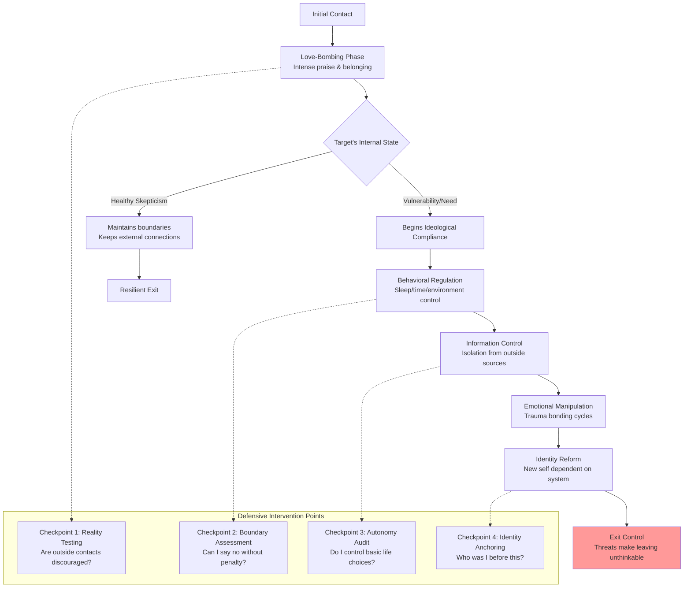
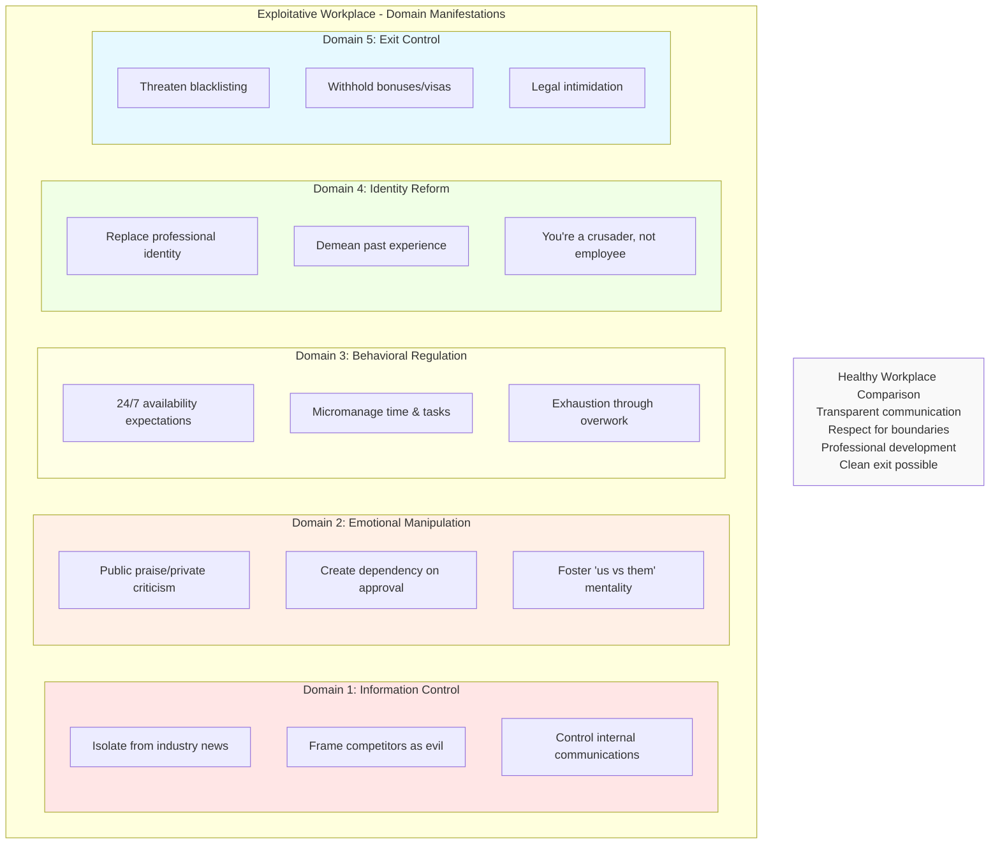

# Recognizing Undue Influence: A Public Defense Guide

## 📜 Preface & Ethical Distinction

**Purpose:** This is a defensive framework grounded in established research from social psychology, sociology, and criminology. Its sole purpose is to empower individuals and communities to recognize behavioral markers of undue influence and build resilience.

**Core Ethical Distinction:**
| Ethical Persuasion & Influence | Undue Influence & Coercive Control |
| :--- | :--- |
| Transparent intent | Hidden or deceptive agenda |
| Respects autonomy & consent | Undermines autonomy & bypasses consent |
| Allows questioning & critique | Punishes doubt & independent thought |
| Freedom to exit without penalty | Severe relational, financial, or psychological penalties for exit |

**Foundational Research:** This framework synthesizes Steven Hassan's **BITE Model**, Patrick Carnes's work on **trauma bonds**, Evan Stark's **coercive control**, and trafficking psychology research.

---

## 🎯 Semantic Schema: Five Core Domains

### 🔒 Domain 1: Information & Reality Control
*Restricting and distorting information to become the sole "reality interpreter."*

**🕵️ Observable Behavioral Markers:**
- Demonization of external sources (media, family, critics)
- Monitoring/controlling communication (demanding passwords, reading messages)
- Promoting "insider-only" doctrine with "us vs. them" narratives
- Early demands for secret-keeping with warnings outsiders "won't understand"

**🧠 Psychological Mechanism Exploited:** **Cognitive Dependence** – Cripples ability to trust own judgment.

**🌍 Real-World Examples:**
- **Religious:** Forbidding reading materials outside group's texts
- **Intimate Partner:** "Your friends are trying to break us up; cut them off"
- **Workplace:** Framing competitors as evil, demanding loyalty above ethics
- **Political:** Labeling all opposing views as treasonous or morally degenerate

**🛡️ Defense & Resilience Strategies:**
- **For Target:** Practice **"information hygiene"** – consume multiple reputable sources. Maintain one trusted external relationship. Notice anxiety/guilt when accessing outside info.
- **For Bystanders:** Communicate with low-pressure, non-judgmental care. Share positive news from outside world.

---

### 💔 Domain 2: Emotional & Relational Manipulation
*Engineering intense emotional highs/lows to create dependency and distorted attachment.*

**🕵️ Observable Behavioral Markers:**
- Love-bombing (excessive praise, gifts, attention) followed by withdrawal
- Intermittent reinforcement – unpredictable swings between reward/punishment
- Creating trauma bonds (becoming both source of distress and comfort)
- Systematic undermining of confidence (gaslighting, devaluation)

**🧠 Psychological Mechanism Exploited:** **Trauma Bonding** & **Classical Conditioning** – Bonds form as survival strategy amidst chaos.

**🌍 Real-World Examples:**
- **Intimate Partner:** Cycle of abuse → tearful apologies → gifts → repeat
- **Religious:** Public shaming followed by private "loving" guidance
- **Workplace:** Extreme praise one week, belittlement the next
- **Extremist Groups:** Shared grievance + leader as exclusive solution

**🛡️ Defense & Resilience Strategies:**
- **For Target:** **Document your reality** in private journal. Notice "hot/cold" patterns. Test small boundaries. Listen to your body (constant anxiety is data).
- **For Bystanders:** Validate negative experiences without reinforcing the "good" cycle. Be consistent emotional anchor.

---

### ⏰ Domain 3: Behavioral & Environmental Regulation
*Controlling time, environment, and behaviors to reduce autonomy through exhaustion.*

**🕵️ Observable Behavioral Markers:**
- Sleep deprivation or exhaustive schedules
- Micromanagement of diet, clothing, grooming, finances
- Group surveillance & reporting systems
- Ritualized compliance dominating daily life

**🧠 Psychological Mechanism Exploited:** **Ego Depletion** & **Ritual Habituation** – Mental energy for critical thought is drained.

**🌍 Real-World Examples:**
- **Workplace:** 24/7 availability expectations, controlled spending
- **Religious:** Mandated clothing, diets, packed prayer/study schedules
- **Intimate Partner:** Controlling all finances, isolation in remote location
- **Trafficking:** Strict quotas, controlled living quarters, document confiscation

**🛡️ Defense & Resilience Strategies:**
- **For Target:** **Protect physiological basics** (sleep, nutrition, solitude). Maintain control over small personal resource. Notice if you ask permission for mundane acts.
- **For Bystanders:** Offer practical support that restores autonomy ("Can I help you get time to yourself?").

---

### 🎭 Domain 4: Identity & Thought Reform
*Dismantling old self to rebuild new identity dependent on system for validation.*

**🕵️ Observable Behavioral Markers:**
- Forced confessions/renunciation of past life
- Loaded language & thought-terminating clichés ("trust the process")
- Replacement of identity labels with system-centric ones
- Phobia programming (fears about leaving = ruin/damnation)

**🧠 Psychological Mechanism Exploited:** **Cognitive Dissonance** & **Identity Fusion** – Pain of renouncing past is reconciled by overvaluing new identity.

**🌍 Real-World Examples:**
- **Extremist:** Renounce family/country, receive new "brotherhood" identity
- **Religious:** "Sinner's prayer" emphasizing worthlessness → group salvation
- **Intimate Partner:** "You're nothing without me" + "Only I truly love you"
- **MLM:** "You were just employee; now you're CEO/warrior for freedom"

**🛡️ Defense & Resilience Strategies:**
- **For Target:** **Anchor to pre-existing self** – keep tokens of past identity. Secretly maintain old skills/interests. Practice privately debating doctrines.
- **For Bystanders:** Use target's old name, affirm old strengths. "I always admired your independent thinking."

---

### 🚪 Domain 5: Exit Control & Systemic Retribution
*Making leaving unthinkable through threats of catastrophic consequences.*

**🕵️ Observable Behavioral Markers:**
- Threats of shunning/ostracism (lose all community/family)
- Financial entanglement (debts, pooled assets, unpaid labor)
- Legal/institutional threats (lawsuits, false reports, visa revocation)
- Ideological fear-mongering (prophecies of doom for leavers)

**🧠 Psychological Mechanism Exploited:** **Learned Helplessness** & **Terror Management** – Known misery seems safer than imagined terror of leaving.

**🌍 Real-World Examples:**
- **Religious:** Formal disfellowshipping with mandatory family cutoff
- **Intimate Partner:** "I'll kill myself/kids if you leave" threats
- **Workplace:** Withholding visas, threatening industry blacklisting
- **Trafficking:** Violence threats against victim or family

**🛡️ Defense & Resilience Strategies:**
- **For Target:** **Develop confidential exit plan** with trusted external contact. Secure documents if possible. Recognize fear is by design.
- **For Bystanders:** Offer unconditional lifeline – "My door is always open." Connect with professional resources (hotlines, counselors).

---

## 💪 Conclusion: The Resilient Self

Undue influence operates as systemic attack on autonomy. Core defenses include:
- Maintaining diverse social connections
- Practicing critical thinking as habit
- Honoring your emotions/bodily sensations as valid data
- Understanding ethical relationships welcome boundaries and exit

**🆘 Resources for Help:**
- National Human Trafficking Hotline: 1-888-373-7888
- National Domestic Violence Hotline: 1-800-799-7233
- International Cultic Studies Association (ICSA)
- Licensed mental health professionals trained in coercive control

*This guide is educational, not substitute for professional advice. In immediate danger, contact local emergency services.*
