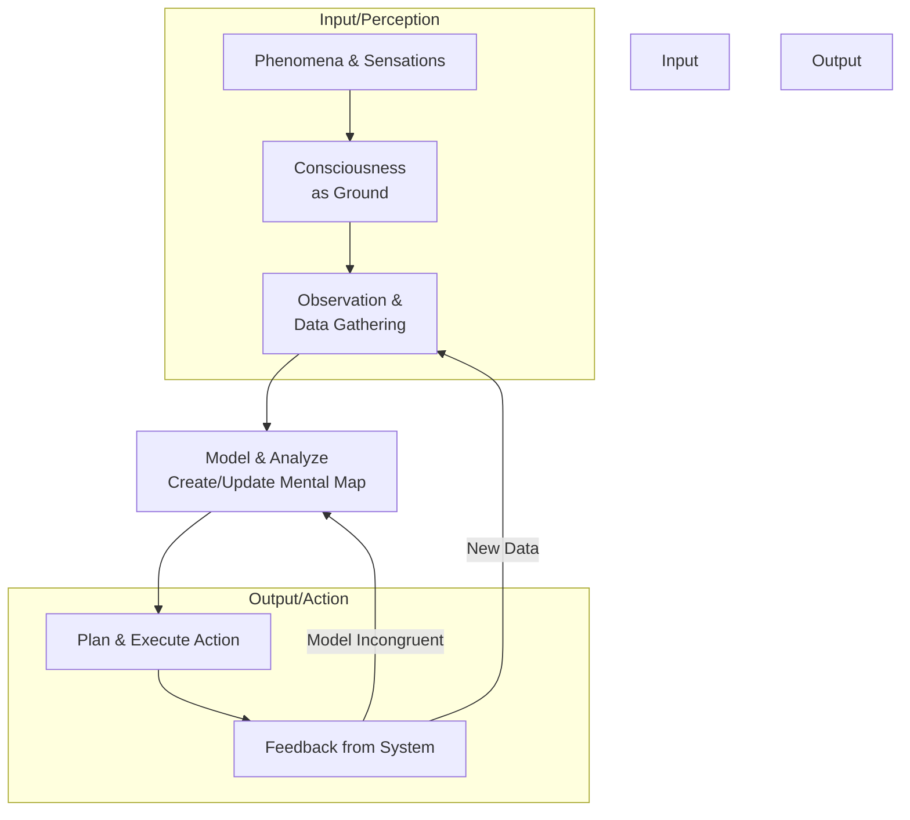
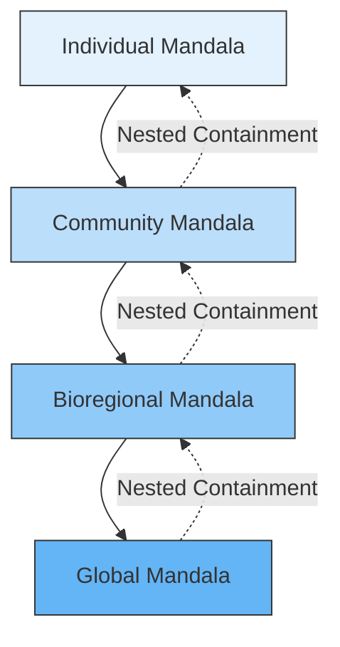
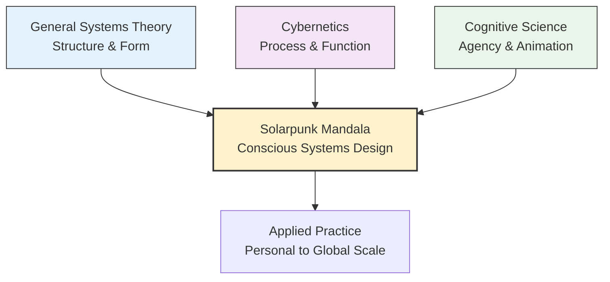
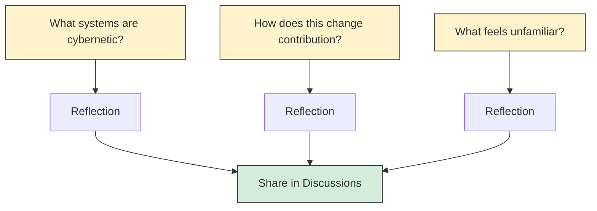

---
# AEO/AAE OPTIMIZATION METADATA
aeo_metadata:
  title: "Meta-Framework: Systems & Cybernetics (Node 00)"
  description: "The architectural blueprint of the Solarpunk Mandala, utilizing second-order cybernetics and systems theory to map conscious evolution."
  context: "The primary 'operating system' for the Solarpunk Mandala repository."
  key_objectives:
    - Define the recursive relationship between the observer and the system.
    - Establish a non-linear framework for regenerative design.
  core_concepts:
    - Second-Order Cybernetics
    - Autopoiesis
    - Feedback Loops
    - Recursive Modeling
  ontological_foundation: "Systems Theory / Cybernetics"
  search_queries:
    - "What is the meta-framework of the Solarpunk Mandala?"
    - "How does cybernetics apply to Solarpunk?"
  related_nodes: [index.md, 10-cybernetic-foundations.md]
  framework_status: "Stable"
---
# Meta-Framework: Systems & Cybernetics

The Solarpunk Mandala is a framework for **conscious systems design**. Its architecture is built upon two core, interdependent meta-disciplines from the systems sciences: **General Systems Theory (GST)**, which provides the logic of *structure and wholeness*, and **Cybernetics**, which provides the logic of *control, communication, and adaptation*.

Together, they form the transdisciplinary foundation that allows the Mandala to model complex, evolving realities—from personal psychology to global ecology—with geometric coherence.

## 🧭 Navigator's Introduction

*Welcome to the control panel of the Solarpunk Mandala. This document explains why the framework exists and how it operates. Think of this as reading the "genetic code" before exploring the organism.*

**Quick Orientation:**
- **Reading Time:** 8-10 minutes
- **Purpose:** Understand the *why* behind the entire system
- **Next Steps:** This document sets the stage for everything that follows

## 1. General Systems Theory: The Logic of Wholeness

General Systems Theory (GST), pioneered by Ludwig von Bertalanffy, is the study of the abstract organization of phenomena. It looks for universal patterns and principles that apply to systems of any kind, regardless of their specific content.

### Core Principles and Their Mandala Expression

| GST Principle | Description | Expression in the Mandala |
| :--- | :--- | :--- |
| **Wholeness & Emergence** | A system is more than the sum of its parts. New properties (*emergent properties*) arise from the interactions of components. | The **Tesseract** is an irreducible whole. The **Geometric Completion** states (Seed, Grid, Web, Spire) are emergent properties of cube integration, not found in any cube alone. |
| **Interdependence & Isomorphism** | System components are interconnected. Similar patterns (*isomorphisms*) appear across different types of systems. | The **Embodied Foundations** are interdependent. The **Dialectical Phase** pattern is isomorphic across personal development, community growth, and ecological succession. |
| **Boundaries & Open Systems** | Systems have boundaries that regulate exchange with their environment. Healthy living systems are open, importing energy/information to sustain complexity. | **Boundary Permeability** in the Material Intelligence Framework is the designed application of this principle. |
| **Equifinality** | In open systems, the same final state can be reached from different initial conditions and by different paths. | This is operationalized by the **Four Pathways**. **Web Completion** can be achieved via **Awakening, Making, Liberation, or Healing**, depending on context. |
| **Subsystems & Hierarchy** | Systems contain subsystems and are part of larger suprasystems (nested hierarchy). | The model is **recursive** and **scalable**. An individual is a subsystem of a community, which is a subsystem of a bioregion, all following similar structural logic. |

### Critical Systems Thinking: Power, Pluralism, and Emancipation

While General Systems Theory provides descriptive models, Critical Systems Thinking (CST) adds necessary normative and emancipatory dimensions. CST acknowledges that:
1. **All systems boundaries are political choices:** Who/what is included/excluded reflects power dynamics.
2. **Multiple perspectives are inevitable:** Different stakeholders have irreducibly different valid perspectives on any complex situation.
3. **Emancipation is central:** Systems thinking must serve human flourishing and liberation from unnecessary constraints.

**CST Principles Applied to Mandala Framework:**
- **Boundary Critique:** Each community must explicitly question: "Whose voices are shaping our Tesseract mapping? What perspectives are we excluding?"
- **Pluralism:** The Multiple Intelligences Framework ensures diverse ways of knowing are valued, not just dominant cognitive styles.
- **Emancipatory Intent:** The movement from Necrocene to Symbiotic Commonwealth explicitly aims to liberate both human and non-human communities from extractive systems.
- **Methodological Commitment:** We commit to methodological pluralism—using different systems methodologies as appropriate to context, not imposing one rigid approach.

**Summary:** GST provides the Mandala with its **geometric and relational validity**. It answers *why* the Tesseract, cubes, and pathways are structured as they are: they are instantiations of universal systems logic.

## 2. Cybernetics: The Logic of Process

Cybernetics, derived from the Greek for "steersman," is the study of communication, control, and adaptation in complex systems. If GST describes the *structure*, cybernetics describes the *dynamic processes* that bring it to life.

### Core Principles and Their Mandala Expression

| Cybernetic Principle | Description | Expression in the Mandala |
| :--- | :--- | :--- |
| **Feedback Loops** | A system's output is fed back as input, informing its next action (balancing/negative or reinforcing/positive). | The **Rhizomatic Network** is the feedback infrastructure. **Boundary Medicine** is a balancing feedback response to foundation scores. |
| **Circular Causality & Autopoiesis** | Causes are effects in a web of mutual influence. Living systems are self-producing (*autopoietic*). | The **Dialectical Phases** and **Pathways** form autopoietic cycles. The *Path of Making* builds a community's capacity for more making. |
| **Requisite Variety (Ashby's Law)** | A control system must have at least as much internal flexibility as the environmental complexity it faces. | The complexity of the **Tesseract (8 cubes, 4 axes)** provides the requisite variety to model and navigate socio-ecological reality. |
| **The Observer Principle** | The observer is part of the system being studied (second-order cybernetics). | This aligns perfectly with **Analytic Idealism**. The Mandala is a tool for a self-observing, self-designing conscious system. |

**Summary:** Cybernetics provides the Mandala with its **operational and regulatory validity**. It answers *how* the system learns, corrects course, and maintains itself—the mechanics behind the **Dialectical Velocity** and **Protocols**.

## 3. Cognitive Science of Agency: The Animated Layer

The principles of **General Systems Theory** provide the Mandala's structural logic, and **Cybernetics** provides its regulatory mechanics. The work of biologist Michael Levin on **scale-free cognition** and **cognitive light cones** provides the crucial third layer: a scientific model of **agency, intelligence, and selfhood** that animates these structures and processes across all scales.

Levin's research reveals that cognitive capacities—problem-solving, goal-directedness, memory—are not unique to brains but are fundamental, scale-free properties of living systems. This means a cell, an organism, an ecosystem, and a human community all exhibit forms of cognition and intelligence. This directly validates the Mandala's core premise that the same geometric and ethical patterns can be modeled from the individual to the collective.

### Core Concepts and Their Synthesis

| Levin's Concept | GST/Cybernetics Synthesis | Mandala Expression |
| :--- | :--- | :--- |
| **Scale-Free Cognition** | Validates GST's search for **isomorphic patterns** across systems. Provides a **functional basis** for why similar organizational principles (like feedback loops) work at different scales. | Justifies applying the **Tesseract geometry** and **Pathways** from personal to bioregional scales. A community's intelligence is not a metaphor but a functional reality. |
| **Cognitive Light Cones** | An agent's "self" is defined by the spatio-temporal extent of events it can measure and influence—its **computational boundary**. Cybernetics studies how this boundary is regulated via feedback. | The **Soteriological Axis** (Integration of Self) is the journey of **expanding one's cognitive light cone**. Spiritual or social practices are technologies for this expansion. |
| **Expansion of Self via Cooperation** | New levels of organization emerge when subunits align goals, forming a new, coherent "self" with a larger light cone. This is the **cybernetic process of forming higher-order viable systems**. | **Geometric Completion** (Seed → Grid → Web → Spire) maps the stages of this boundary integration and expansion within a collective. |
| **Homeostatic Drive** | The fundamental drive of living systems to reduce "stress" or prediction error—a core **cybernetic objective**. | The entire Mandala, through its **Ethical Axes** and **Pathways**, is a framework for reducing systemic "stress" and moving toward homeostatic balance at the scale of conscious collectives. |

In summary, Levin's work provides a **biologically-grounded science of mind and agency** that seamlessly connects the abstract structure of GST to the operational logic of Cybernetics. It explains *why* and *how* the parts of a Mandala—whether a person or a community—are not just interconnected components, but sentient, goal-directed participants in a shared cognitive field.

## Synthesis: The Mandala as Applied Meta-Framework

The Solarpunk Mandala is not merely *informed by* GST and Cybernetics; it is a **practicable synthesis** of them, instantiated within a specific ontological commitment (Analytic Idealism).

*   **GST** gives us the **Mandala's Form**: Its geometry, hierarchies, and relational maps.
*   **Cybernetics** gives us the **Mandala's Function**: Its protocols, feedback metrics, and adaptive processes.
*   **Analytic Idealism** gives us the **Mandala's Ground and Goal**: A conscious universe in which these forms and functions are applied for the purpose of participatory flourishing.

Thus, the Mandala can be described as a **consciousness-first, applied meta-framework for the design and navigation of complex adaptive systems**. It takes the abstract, descriptive power of GST and the regulatory power of cybernetics and directs them toward the ethical, regenerative aims of the Solarpunk horizon.

## Falsification Conditions: When the Mandala is Wrong

The Mandala is scientific only if it can be proven wrong. Here are explicit falsification criteria:

### Critical Falsifiers
1. **If communities with Foundation scores ≥3 show no capacity for 2D integration**, the threshold model is falsified
2. **If Dialectical Conductance cannot be reliably measured by independent raters** (ICC &lt; 0.6), the concept is not operational
3. **If the 8 Intelligences do not factor into 4 dimensions** in factor analysis, the Tesseract mapping is arbitrary

### Auxiliary Falsifiers
4. **If Levin's scale-free cognition is retracted**, the Mandala loses its biological grounding
5. **If communities show inverse relationships** (high individual scores, low collective functioning), the micro-macro link is broken
6. **If adversarial contexts cannot be mapped** onto the framework, it's ideologically biased

### Consequence
**If any critical falsifier is met**, the Mandala must be revised or abandoned. If auxiliary falsifiers mount, the model loses parsimony.

## 🔄 Pedagogical Bridge: From Theory to Practice

### Why This Order?
This document comes first because it establishes the *operating system* for everything that follows. In cybernetics, you must understand the control mechanisms before you can understand what's being controlled.

### Repository as Cybernetic System
- **Inputs:** Issues, discussions, external frameworks
- **Processing:** The dialectical phases (document 04) acting as transformation rules
- **Outputs:** Merged PRs, updated documentation, evolved models
- **Feedback:** Comments, reactions, fork activity, real-world applications

### Interactive Reflection

---

**Next Document:** [01 - The Ontological Foundation →](01-ontology-analytic-idealism.md)

*Following the cybernetic control system, we now explore what kind of reality this system operates within.*
