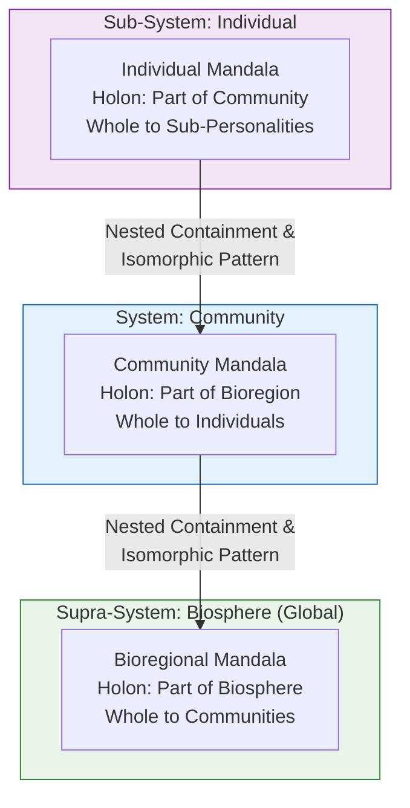
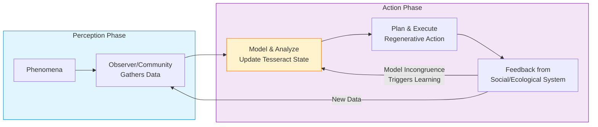
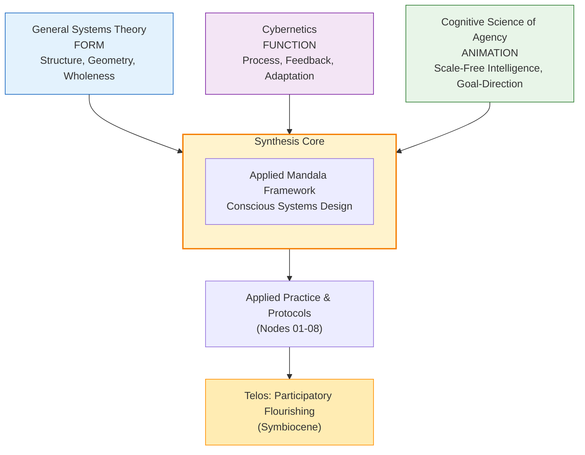
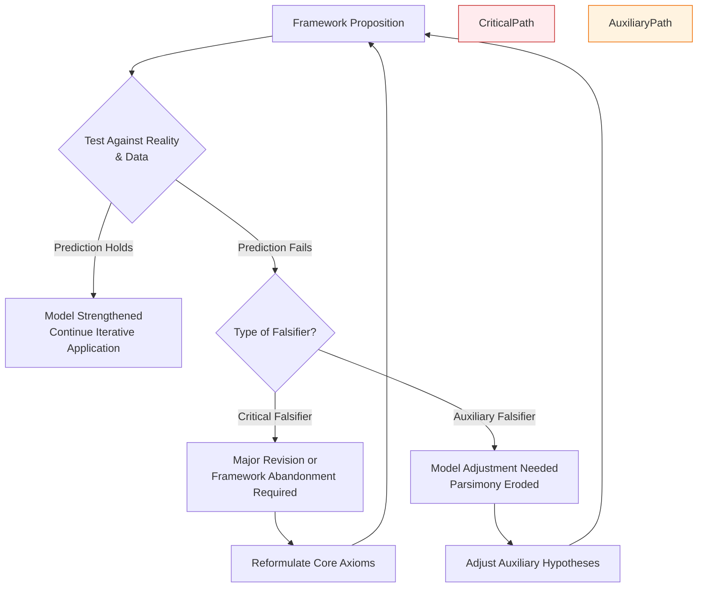

---
aeo_metadata:
  title: "Meta-Framework: Systems Theory & Cybernetics (Node 00)"
  description: "The architectural blueprint and control system of the Solarpunk Mandala. Synthesizes General Systems Theory (structure), Cybernetics (process), and Cognitive Science (agency) into a framework for conscious systems design."
  context: "Primary meta-framework and 'operating system' for the entire Solarpunk Mandala repository. This document must be understood before engaging with other nodes."
  key_objectives:
    - "Define the recursive, nested relationship between observer and system using second-order cybernetics."
    - "Establish a non-linear, scalable framework for regenerative design across personal, community, and bioregional scales."
    - "Integrate Michael Levin's scale-free cognition to animate systems theory with a model of agency."
    - "Provide explicit falsification conditions to ensure scientific rigor."
  core_concepts:
    - "Second-Order Cybernetics (Observer-in-the-System)"
    - "General Systems Theory (Wholeness, Isomorphism)"
    - "Autopoiesis & Circular Causality"
    - "Scale-Free Cognition & Cognitive Light Cones"
    - "Critical Systems Thinking (Boundary Critique, Emancipation)"
  ontological_foundation: "Synthesis of Systems Theory, Cybernetics, and Cognitive Science"
  epistemic_stance: "Interdisciplinary Synthesis with Critical Reflexivity"
  search_queries:
    - "systems theory cybernetics solarpunk framework"
    - "second order cybernetics conscious systems design"
    - "general systems theory application regeneration"
    - "scale free cognition Michael Levin systems thinking"
    - "holarchy nested systems model"
  related_nodes:
    - "index.md"
    - "01-ontological-grounding-analytic-idealism.md"
    - "02-epistemic-architecture-tesseract.md"
    - "04-dialectical-phases-velocity.md"
  framework_status: "Stable Core"
  version: "2.0"
  last_reviewed: "2026-01-12"
---
# Meta-Framework: Systems & Cybernetics (Node 00)

## 🧭 Executive Overview & Navigation

This document is the architectural blueprint and **control panel** for the Solarpunk Mandala. It establishes the foundational "operating system"—a conscious synthesis of General Systems Theory (structure), Cybernetics (process), and Cognitive Science (agency). Understanding this meta-framework is essential for effectively navigating and applying all subsequent models in the repository.

**Reading Context:**
- **Purpose:** To define the *why* and *how* behind the entire Mandala's design.
- **Prerequisites:** None. This is the entry point.
- **Next Steps:** Proceed to [01-ontological-grounding-analytic-idealism.md] for the philosophical foundation, or [02-epistemic-architecture-tesseract.md] for the core geometric model.
- **Time Investment:** 10-12 minutes for core concepts.

## 1. General Systems Theory: The Architecture of Wholeness

General Systems Theory (GST) provides the **structural logic** of the Mandala. It is the transdisciplinary study of the abstract organization of phenomena, seeking universal principles that apply to systems of any scale or domain—from a cell to a civilization.

### 1.1 Core Principles and Mandala Expression

| GST Principle | Core Description | Mandala Expression & Application |
| :--- | :--- | :--- |
| **Wholeness & Emergence** | A system is an irreducible whole; new properties (*emergence*) arise from the interaction of parts, not from the parts alone. | The Tesseract model is a unified whole. States of **Geometric Completion** (Seed, Grid, Web, Spire) are emergent properties of cube integration, not present in any single cube. |
| **Interdependence & Isomorphism** | Components are interconnected; similar patterns (*isomorphisms*) appear across different systems (biological, social, psychological). | The **Embodied Foundations** are deeply interdependent. The pattern of **Dialectical Phases** is isomorphic across personal, community, and ecological scales. |
| **Boundaries & Open Systems** | Systems maintain boundaries that regulate exchange. Living systems are *open*, importing energy/information to sustain complexity. | The **Material Intelligence Framework** operationalizes this via the principle of **Boundary Permeability**—designing for optimal exchange. |
| **Equifinality** | In open systems, the same final state can be reached from different starting points and via different paths. | Realized through the **Four Pathways**. **Web Completion** can be achieved via *Awakening, Making, Liberation, or Healing*, depending on context. |
| **Nested Hierarchy (Holarchy)** | Systems are simultaneously wholes and parts: they contain subsystems and are nested within larger suprasystems. | The framework is **recursively scalable**. An individual is a holon within a community, within a bioregion, all following similar structural logic. |

```mermaid
flowchart TD
    subgraph Suprasystem["Supra-System: Biosphere (Global)"]
        direction LR
        S3[Bioregional Mandala<br/>Holon: Part of Biosphere<br/>Whole to Communities]
    end

    subgraph System["System: Community"]
        S2[Community Mandala<br/>Holon: Part of Bioregion<br/>Whole to Individuals]
    end

    subgraph Subsystem["Sub-System: Individual"]
        S1[Individual Mandala<br/>Holon: Part of Community<br/>Whole to Sub-Personalities]
    end

    S1 -- Nested Containment &<br/>Isomorphic Pattern --> S2
    S2 -- Nested Containment &<br/>Isomorphic Pattern --> S3

    style Suprasystem fill:#e8f5e8,stroke:#2e7d32
    style System fill:#e3f2fd,stroke:#1565c0
    style Subsystem fill:#f3e5f5,stroke:#7b1fa2
```

### 1.2 Critical Systems Thinking: The Normative Layer

While GST provides descriptive models, **Critical Systems Thinking (CST)** adds essential normative, pluralistic, and emancipatory dimensions. It asserts that:
1.  **All systems boundaries are political:** Defining what is inside/outside reflects power dynamics and values.
2.  **Multiple perspectives are inevitable:** Different stakeholders hold irreducibly valid viewpoints on any complex reality.
3.  **Emancipation is central:** Systems thinking must serve the flourishing and liberation of all life.

**CST in the Mandala Framework:**
- **Boundary Critique:** Communities must explicitly ask: *"Whose voices shape our Tesseract? What perspectives are marginalized?"*
- **Methodological Pluralism:** The framework commits to using multiple systems methodologies as context demands, rejecting one rigid approach.
- **Emancipatory Intent:** The transition from **Necrocene to Symbiocene** is an explicit project of liberation from extractive systems for human and non-human communities.

## 2. Cybernetics: The Dynamics of Process and Adaptation

If GST provides the *blueprint*, Cybernetics (from *kybernetes*, "steersman") provides the *steering mechanisms*. It is the study of **communication, control, and adaptation** in complex systems.

### 2.1 Core Principles and Mandala Expression

| Cybernetic Principle | Core Description | Mandala Expression & Application |
| :--- | :--- | :--- |
| **Feedback Loops** | A system's output is fed back as input, enabling self-regulation (*balancing/negative feedback*) or growth (*reinforcing/positive feedback*). | The **Rhizomatic Network** is the feedback infrastructure. **Boundary Medicine** protocols are balancing feedback responses to foundational imbalances. |
| **Circular Causality & Autopoiesis** | Causes and effects are circular and mutually influencing. Living systems are *autopoietic* (self-producing). | The **Dialectical Phases** form autopoietic learning cycles. Success in one phase (*Thesis*) generates the conditions for its counter-phase (*Antithesis*). |
| **Requisite Variety (Ashby's Law)** | "Only variety can absorb variety." A controller must have at least as much internal complexity as the environment it manages. | The Tesseract's complexity (8 cubes, 4 axes) provides the **requisite variety** to model and navigate complex socio-ecological realities. |
| **The Observer Principle (2nd-Order Cybernetics)** | The observer is inseparable from the observed system. We are always participating in the systems we study. | This is foundational to the Mandala's **consciousness-first** stance. The framework is a tool for a self-observing, self-designing conscious collective. |

```mermaid
graph LR
    subgraph Input["Perception Phase"]
        P[Phenomena] --> O[Observer/Community<br>Gathers Data]
    end

    O --> M[Model & Analyze<br>Update Tesseract State]

    subgraph Output["Action Phase"]
        M --> A[Plan & Execute<br>Regenerative Action]
        A --> F[Feedback from<br>Social/Ecological System]
    end

    F -->|New Data| O
    F -->|Model Incongruence<br>Triggers Learning| M

    style Input fill:#e1f5fe,stroke:#0288d1
    style Output fill:#f3e5f5,stroke:#7b1fa2
    style M fill:#fff3cd,stroke:#f57c00
```

## 3. Cognitive Science of Agency: The Animating Principle

The work of biologist **Michael Levin** on scale-free cognition provides the crucial third layer: a **scientific model of agency and intelligence** that animates the structures of GST and the processes of Cybernetics across all scales.

### 3.1 Synthesizing Cognition with Systems & Cybernetics

| Levin's Concept | Synthesis with GST/Cybernetics | Mandala Expression |
| :--- | :--- | :--- |
| **Scale-Free Cognition** | Validates GST's isomorphisms by showing problem-solving, goal-directedness, and memory are fundamental properties of living organization, not just brains. | Justifies applying the **Tesseract geometry and Pathways** from person to planet. A community's intelligence is a functional reality, not a metaphor. |
| **Cognitive Light Cones** | An agent's "self" is defined by the spatio-temporal extent of events it can perceive/influence—its computational boundary. Cybernetics studies how this boundary is regulated. | The **Soteriological Axis** maps the journey of expanding one's cognitive light cone. Spiritual and social practices are technologies for this boundary expansion. |
| **Agency via Cooperation** | New, coherent "selves" with larger agency emerge when subunits align goals—a cybernetic process of forming higher-order viable systems. | **Geometric Completion** (Seed→Grid→Web→Spire) models the stages of this boundary integration and agency expansion within a collective. |
| **Homeostatic Drive** | The fundamental drive to reduce "stress" or prediction error—a core, multi-scale cybernetic objective. | The entire Mandala is a framework for reducing *systemic* prediction error and moving toward homeostatic balance at the scale of conscious collectives. |

## 4. Synthesis: The Mandala as Conscious Systems Design

The Solarpunk Mandala is the **practicable synthesis** of these three meta-disciplines, instantiated within the ontological commitment of Analytic Idealism.

```mermaid
flowchart TD
    GST["General Systems Theory<br/>FORM<br/>Structure, Geometry, Wholeness"]
    Cyber["Cybernetics<br/>FUNCTION<br/>Process, Feedback, Adaptation"]
    Cog["Cognitive Science of Agency<br/>ANIMATION<br/>Scale-Free Intelligence, Goal-Direction"]

    GST --> S
    Cyber --> S
    Cog --> S

    subgraph S["Synthesis Core"]
        direction TB
        MF["Applied Mandala Framework<br/>Conscious Systems Design"]
    end

    S --> Practice["Applied Practice & Protocols<br/>(Nodes 01-08)"]
    Practice --> Telos["Telos: Participatory Flourishing<br/>(Symbiocene)"]

    style GST fill:#e3f2fd,stroke:#1565c0
    style Cyber fill:#f3e5f5,stroke:#7b1fa2
    style Cog fill:#e8f5e8,stroke:#2e7d32
    style S fill:#fff3cd,stroke:#f57c00,stroke-width:2px
    style Telos fill:#ffecb3,stroke:#ff8f00
```

- **GST provides the FORM:** The geometry, relational maps, and nested hierarchy of the Tesseract.
- **Cybernetics provides the FUNCTION:** The protocols, feedback metrics (e.g., Dialectical Conductance), and adaptive learning processes.
- **Cognitive Science provides the AGENCY:** The understanding that the system's parts are sentient, goal-directed participants.
- **Analytic Idealism provides the GROUND & GOAL:** A conscious universe where this design is applied for participatory flourishing.

Thus, the Mandala is a **consciousness-first, applied meta-framework** for the participatory design and navigation of complex adaptive systems toward the Solarpunk horizon.

## 5. Falsification & Evolution: A Scientific Framework

For the Mandala to be a rigorous framework, not a dogma, it must have explicit **falsification conditions**.

```mermaid
flowchart TD
    Start[Framework Proposition] --> Test{Test Against Reality<br> & Data}

    Test -->|Prediction Holds| Valid[Model Strengthened<br/>Continue Iterative Application]

    Test -->|Prediction Fails| CQ{Type of Falsifier?}

    CQ -->|Critical Falsifier| Crit[Major Revision or<br/>Framework Abandonment Required]
    CQ -->|Auxiliary Falsifier| Aux[Model Adjustment Needed<br/>Parsimony Eroded]

    Crit --> Reformulate[Reformulate Core Axioms]
    Aux --> Adjust[Adjust Auxiliary Hypotheses]

    Reformulate --> Start
    Adjust --> Start

    style CriticalPath fill:#ffebee,stroke:#c62828
    style AuxiliaryPath fill:#fff3e0,stroke:#ef6c00
```

### 5.1 Critical Falsifiers (Would necessitate major revision or abandonment)
- If communities with **Foundation scores ≥3** show no measurable increase in capacity for 2D integration.
- If **Dialectical Conductance** cannot be reliably measured by independent raters (ICC < 0.6).
- If factor analysis shows the **8 Intelligences** do not load onto the 4 hypothesized Tesseract axes.

### 5.2 Auxiliary Falsifiers (Would erode parsimony and require adjustment)
- If key biological grounding (e.g., Levin's scale-free cognition) is robustly invalidated.
- If a persistent inverse relationship is found between high individual scores and low collective functioning.
- If the framework proves incapable of mapping adversarial or ideologically opposed contexts.

## 6. Pedagogical Bridge: From Meta-Framework to Practice

### 6.1 Why This Document is Node 00
This meta-framework establishes the **operating system**. In cybernetic terms, you must understand the control mechanisms before engaging with what is being controlled. All subsequent nodes (01, 02, 03, etc.) are applications or instantiations of this core logic.

### 6.2 This Repository as a Cybernetic System
- **Input:** Issues, discussions, pull requests, external data.
- **Processing:** The **Dialectical Phases** (see Node 04) act as the transformation rules for community discourse.
- **Output:** Merged PRs, updated models, new protocols.
- **Feedback:** Community engagement, real-world application results, forked iterations.
- **Goal (Telos):** The iterative refinement of tools for conscious collective evolution toward the Symbiocene.

---
**Next Steps:** With this meta-framework in mind, you are prepared to explore the specific architecture. Proceed to **[01-ontological-grounding-analytic-idealism.md](./01-ontology-analytic-idealism.md)** to understand the conscious ground of being upon which this entire design is built.
