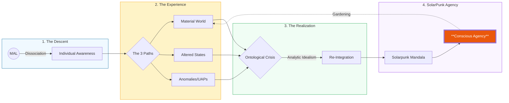
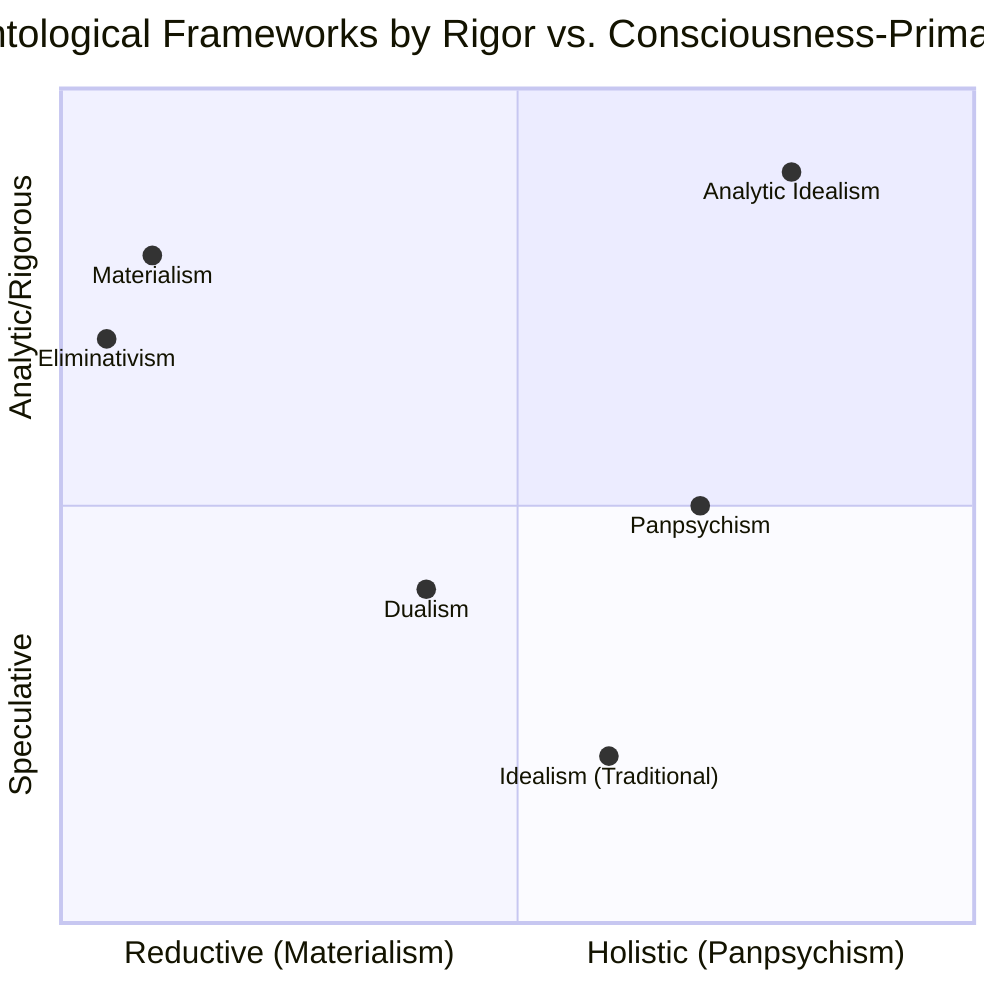
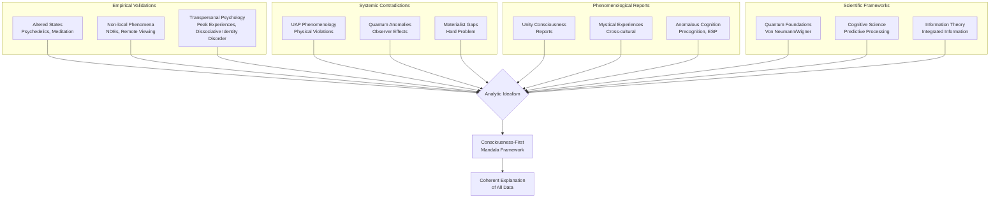
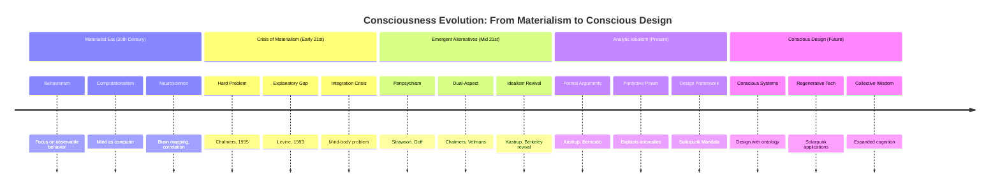

---
aeo_metadata:
  title: "Ontology: Analytic Idealism (Node 01)"
  description: >
    A consciousness-first ontological foundation in which reality is understood
    as structured experience, with the physical world emerging as a perceptual
    interface across dissociative boundaries.
  context: >
    Establishes what is fundamentally real within the Solarpunk Mandala:
    consciousness as primary, perception as interface, and matter as appearance.
  key_objectives:
    - Define consciousness as ontologically fundamental.
    - Explain physical reality as a multimodal perceptual interface.
    - Account for individuality via dissociation within Mind-at-Large.
    - Ground ethics and regeneration in lived experience rather than abstraction.
  core_concepts:
    - Analytic Idealism
    - Consciousness-First Ontology
    - Mind-at-Large
    - Dissociation
    - Screen of Perception
    - Perceptual Interface
    - Regeneration vs Extraction
  ontological_commitments:
    - Consciousness is fundamental; matter is derivative.
    - Perception is an interface, not a representation of objective reality.
    - Individual minds are dissociated segments of a unified conscious field.
    - Causation is experiential at its base, not material.
  perceptual_framework:
    description: >
      Perception is the structured set of experiential modalities through which
      conscious dynamics appear as a world.
    modalities:
      - vision
      - audition
      - touch
      - olfaction
      - gustation
      - interoception
      - proprioception
      - thermoception
      - nociception
      - affective_valence
    functional_role:
      - enables adaptive action
      - constrains access to Mind-at-Large
      - grounds meaning, value, and agency
  dissociation_model:
    description: >
      Dissociation explains the emergence of individual perspectives by limiting
      perceptual bandwidth within consciousness.
    perceptual_effects:
      - salience gating
      - boundary formation
      - identity stabilization
    modulation_examples:
      - trauma
      - meditation
      - psychedelics
      - ritual
  ethical_implications:
    description: >
      Ethics arises from the modulation of experience. Harm and flourishing are
      defined perceptually, not abstractly.
    guiding_principle: >
      Systems that systematically narrow perceptual access produce suffering;
      systems that restore perceptual coherence enable regeneration.
  perceptual_regeneration:
    definition: >
      The restoration of healthy perceptual bandwidth, salience balance, and
      intersubjective attunement within conscious systems.
    relevance:
      - individual well-being
      - collective coherence
      - ecological attunement
  theoretical_references:
    - name: "Analytic Idealism"
      author: "Bernardo Kastrup"
      relevance: >
        Provides the metaphysical framework for treating consciousness as
        ontologically primary.
    - name: "Interface Theory of Perception"
      author: "Donald D. Hoffman"
      relevance: >
        Offers convergent empirical support for treating perception as an adaptive
        interface rather than a veridical depiction of reality.
      usage_note: >
        Referenced as supportive evidence, not as a complete ontology.
  search_queries:
    - "Analytic idealism consciousness ontology"
    - "perception as interface philosophy neuroscience"
    - "dissociation consciousness theory"
    - "ontology of experience regeneration"
  related_nodes:
    - 02-epistemic-architecture-tesseract.md
    - 05-dissociation-boundary-medicine.md
    - 07-ethics-regeneration-extraction.md
---

# Ontological Ground: Analytic Idealism

This model is grounded in the framework of Analytic Idealism, a modern metaphysical philosophy most rigorously articulated by philosopher and scientist Bernardo Kastrup. Analytic idealism proposes that reality is fundamentally conscious experience. What we perceive as the physical world is not a free-standing, mind-independent structure, but the "multimodal appearance" of a transpersonal, universal consciousness—referenced as Mind at Large (MAL). From this perspective, individual conscious beings, like you and me, are not products of brains, but rather localized dissociations of this foundational consciousness, each with a unique, evolving perspective.

This ontology shifts our entire paradigm: instead of seeing consciousness as a fragile accident inside a dead universe, we see the universe as a living, experiential process, and ourselves as integral expressions of it. This provides a profound philosophical foundation for SolarPunk's core values of interconnection, regeneration, and hopeful co-creation.

## 🌌 Reality Engine

*If document 00 was the operating system, this is the physics engine. Here we establish what kind of "reality" the Solarpunk Mandala inhabits.*

**Key Mindshift:** We're moving from *how things work* to *what things fundamentally are*.

**Reading Lens:** Try reading this not as abstract philosophy, but as practical instructions for world-building.

## Core Propositions

1. **Individual minds are not emergent properties of brains, but dissociated alters within MAL**—akin to personalities in a single psyche, each with its own boundary of experience.

2. **The physical world—including bodies, ecosystems, and cities—is the extrinsic appearance of inner dynamics within MAL.** What we measure as "matter" is how consciousness looks from across a dissociative boundary.

This view resolves the "hard problem" of consciousness, honors the primacy of direct experience, and aligns with findings in quantum physics, predictive processing neuroscience, and the phenomenology of non-ordinary states (e.g., near-death experiences, deep meditation).

### Why Start with Ontology? A Note for the Materialist Perspective

If your background is in science, engineering, or software development, your default worldview is likely **scientific materialism** (or physicalism): the belief that reality is fundamentally made of physical matter and energy, governed by mathematical laws, with consciousness emerging as a byproduct of complex computation in brains.

This model is powerfully effective. It built our technology, medicine, and space programs. It feels intuitive because it aligns with our sensory experience of a world "out there."

So why does this project deliberately start from a different ontological foundation—**Analytic Idealism** (consciousness-first)?

Think of it not as rejecting the scientific method, but as questioning its starting assumptions. It's a **paradigm-level choice**, similar to choosing a programming language or a foundational database schema for a complex system. The choice of base ontology determines what you can easily describe, what problems become salient, and where you might hit logical dead ends.

## 🧠 The Perceptual Interface: How Mind-at-Large Appears as a World

If reality is fundamentally conscious experience, then **perception is not a passive mirror of an external world**, but an *active interface* through which Mind-at-Large (MAL) appears to itself across dissociative boundaries.

From the standpoint of Analytic Idealism, perception is the **grammar of appearance** — the structured set of experiential modalities through which conscious activity becomes legible as “a world.”

### Perception as Interface, Not Representation

This framework aligns closely with **Donald Hoffman’s Interface Theory of Perception**, which demonstrates (both mathematically and evolutionarily) that perceptual systems do not evolve to show reality as it is, but to present **fitness-relevant symbols** that guide adaptive action.

> *Perception is more like a desktop interface than a window onto objective truth.*  
> — Donald Hoffman

In this view:
- Space, time, objects, and bodies are **icons**, not fundamental entities
- Perceptual experiences are **species-specific user interfaces**
- What we call “physical reality” is a **compressed, actionable appearance** of deeper conscious dynamics

Analytic Idealism extends this insight ontologically:  
**the interface is not hiding a material world — it is how consciousness looks across dissociation.**

### The Core Perceptual Modalities (Experiential Primitives)

The “multimodal appearance” of reality arises through a finite set of **primary perceptual modalities**. These are not secondary byproducts of matter, but **first-order modes of conscious experience** within localized alters.

**Exteroceptive Modalities (World-Oriented)**
- **Vision** (light, color, motion, depth)
- **Audition** (sound, rhythm, spatial direction)
- **Olfaction** (chemical pattern recognition)
- **Gustation** (nutritional valuation)
- **Tactile Touch** (pressure, vibration, texture)

**Interoceptive & Embodied Modalities (Self-Oriented)**
- **Interoception** (heartbeat, breath, hunger, nausea)
- **Thermoception** (hot / cold)
- **Nociception** (pain, threat, tissue risk)
- **Proprioception** (body position and movement)
- **Affective Valence** (pleasant / unpleasant)

These modalities together constitute the **Screen of Perception** — the experiential boundary surface through which MAL’s internal dynamics are rendered as an apparently external world.

### Dissociation as Perceptual Filtering

Within Analytic Idealism, dissociation does not eliminate access to Mind-at-Large — it **filters and constrains perceptual bandwidth**.

- A tighter dissociation boundary → narrower perceptual range, stronger salience gating
- A loosened boundary → expanded perceptual access (altered states, transpersonal experience)

Altered states of consciousness (psychedelics, meditation, trauma, ritual) are therefore not hallucinations *ex nihilo*, but **modulations of the perceptual interface** — changes in what information is allowed through the dissociative filter.

This reframes perception as:
- **Dynamic** (not fixed)
- **Ethically significant** (because suffering and flourishing are perceptual realities)
- **Central to regeneration** (because systems change requires perceptual change)

### Why Perception Matters for a Solarpunk Future

If values, meaning, and agency arise within experience, then **designing regenerative systems is inseparable from designing perceptual conditions**.

A Solarpunk future is not only about cleaner energy or better infrastructure — it is about cultivating:
- perceptual attunement to ecological rhythms
- restored interoceptive awareness
- reduced salience hijacking by fear and scarcity
- expanded capacity to perceive interconnection

In short:  
**we do not change worlds by rearranging matter alone — we change the interfaces through which reality is experienced.**

This perceptual layer is the necessary bridge between ontology (what is) and epistemic architecture (how we know and act), which the next document formalizes through the Tesseract model.

> **Interface Theory of Perception (ITP)**  
> Hoffman, D. D. (2019). *The Case Against Reality*. W.W. Norton & Company.
>
> Hoffman demonstrates that perceptual systems optimized by evolution do not track objective truth, but fitness-relevant structure. Space, time, and objects function as adaptive symbols — comparable to a user interface — that guide action while concealing underlying complexity.
>
> Within the Solarpunk Mandala, Interface Theory is not treated as a complete ontology, but as **convergent empirical support** for the claim that perception is an interface rather than a depiction. Analytic Idealism extends this insight by identifying consciousness itself — not matter — as the underlying reality that interfaces make actionable.

### The Consciousness Journey: From Dissociation to Re-integration

The fundamental human experience can be understood as a journey from original unity, through dissociation into separate subject-object relationships, and ultimately toward conscious re-integration.

#### The Materialist Bind in Modelling Lived Reality

The materialist model excels at describing *objective processes* but struggles fundamentally with *subjective experience*—the very field of values, meaning, ethics, and qualitative life that **SolarPunk** and this mandala aim to cultivate. This leads to paradoxes:

1.  **The Hard Problem of Consciousness:** In a purely physical universe, *why* should complex information processing (like in a brain) feel like anything at all? Why isn't it just "dark inside"? Materialism has no explanatory bridge from objective matter to subjective experience. It is forced to either deny the reality of experience (**illusionism**) or treat it as an inexplicable emergent property.
2.  **The Problem of Values and Meaning:** If consciousness is a secondary illusion, then so are values, purpose, and meaning. They become evolutionary quirks or social constructs with no fundamental grounding. This makes it philosophically difficult to argue for an *intrinsic* value in sustainability, beauty, or community—they become preferences, not truths. A SolarPunk future needs a sturdier foundation for its values.
3.  **The Observer Problem:** Quantum mechanics and the philosophy of science highlight that the observer cannot be cleanly removed from the system. A model of reality that treats consciousness as a latecomer ghost in the machine has a hard time accounting for its own epistemic foundation—*who* is the scientist, the modeler, the GitHub user reading this?

#### Analytic Idealism as a Coherent Foundation

Analytic Idealism addresses these binds by making a simpler, more parsimonious foundational assumption: **Consciousness is primary, not derivative.**

*   **It's Not "Magic":** It's a formal ontology that uses the tools of analytic philosophy. It doesn't deny the laws of physics; it **re-interprets them**. In this view, the regularities we call "physics" are the *observed grammar of conscious experience*, not the description of a world outside of it.
*   **It Solves the Core Problems:**
    *   **The Hard Problem disappears:** Experience is fundamental, so there's no need to generate it from non-experiential parts. Matter (as we perceive it) is understood as the *intrinsic appearance* of conscious activity.
    *   **Values are re-grounded:** If reality is experiential at its core, then qualities like harmony, suffering, beauty, and understanding are primary facets of existence. Building a SolarPunk world isn't just a pragmatic survival strategy; it's an alignment with the fundamental grain of reality.
    *   **The Observer is central:** The modeler, the community, the perceiver is not an accidental byproduct but the very substrate of the world being modeled. This creates a natural ethics of participation and responsibility.
 

#### The Practical Payoff for This Project

For the **SolarPunk Mandala**, this ontological starting point is a design feature:

1.  **Coherence:** It allows us to model physical systems, social dynamics, and inner values on a single, consistent spectrum—all as patterns of conscious experience.
2.  **Agency & Responsibility:** It frames our actions not as deterministic particles in a void, but as conscious choices that directly shape the qualitative fabric of shared reality.
3.  **A Foundation for Post-Capitalist Values:** It provides a metaphysical basis for intrinsic worth that isn't tied to material extraction or utility, supporting the shift from an ethos of domination to one of participation and care.

**In essence, we are not choosing metaphysics *over* practicality. We are choosing a foundational model (Idealism) that we believe is more logically coherent and better suited to ground the practical, ethical, and experiential goals of a SolarPunk future than the default materialist model.**

You don't have to accept this ontology to contribute, but understanding it is key to understanding the architecture of the mandala model. Think of it as our **core philosophical API**. All other modules—agency, systems, values—are built to be compatible with this base layer.

#### Empirical Panpsychism (Koch-Tononi Convergence)

Analytic Idealism posits consciousness as primary. IIT provides the **intrinsic property** that makes this tenable:

- **Axiom 1 (Koch)**: Consciousness is a fundamental property of any system with cause-effect power upon itself (Φ > 0)
- **Axiom 2 (Kastrup)**: Matter is the extrinsic appearance of inner experience
- **Synthesis**: Φ quantifies the *degree of dissociation* from Mind at Large

**Citation**: Koch, C. (2019). *The Feeling of Life Itself*. MIT Press. 
- Page 142: "Cerebellum has 69 billion neurons but Φ≈0 because feed-forward architecture lacks causal autonomy"
- This **validates** the Tesseract's distinction between biological complexity and conscious capacity

#### Enactive Realization: How Consciousness Brings Forth Worlds

While Analytic Idealism establishes consciousness as fundamental, Enactivism provides the *how*: consciousness is not a passive observer but an active participant that **brings forth** worlds through structural coupling and sense-making.

**Key Integration Points:**
1. **Consciousness as Action:** Rather than "consciousness perceives reality," we adopt "consciousness enacts meaningful worlds through perceptually-guided action"
2. **Autopoiesis as Self-Production:** Living systems (including communities) maintain their organization through circular self-production—directly mirroring your dialectical phases
3. **Structural Coupling:** Our continuous interaction with environments shapes both us and the environment—explaining how mandalas co-evolve with communities
4. **Participatory Sense-Making:** Knowledge emerges *between* agents in interaction, not within isolated minds

**Why This Matters for Solarpunk Mandala:** 
- Explains how communities literally "bring forth" their Symbiotic Commonwealth through collective action
- Provides biological grounding for your "Embodied Foundations" protocols
- Bridges the apparent gap between idealist ontology and material practice

### The Spectrum of Conscious Experience: Altered States and Transpersonal Mentations

The proposition that consciousness is fundamental is powerfully validated by the full spectrum of human experience. From the perspective of Analytic Idealism, so-called Altered States of Consciousness (ASCs) are not malfunctions but **critical modes of exploration** into the deeper layers of Mind at Large (MAL). The common distinction between "internal" ideas and "external" substances dissolves; both are instrumental in modulating the localized process of consciousness, inducing what can be termed **"transpersonal mentations"**—shifts in the patterns of experience that transcend the ordinary self.

Crucially, this framework **dissolves the "hard problem" of consciousness**. The problem arises from the materialist assumption that matter is primary and must somehow generate subjective experience. Analytic Idealism inverts this: consciousness is primary, and matter is its extrinsic appearance. Therefore, the existence and qualities of consciousness are not a problem to be solved from the outside but the foundational given from which all else is understood. Altered states are not puzzles for materialism but direct evidence of consciousness's intrinsic plasticity.

This modulation of conscious experience occurs at two interdependent levels: the **framework of interpretation** and the **process of perception**.

#### 1. Foundational Frameworks: Belief, Ideology, and Media as Onto-Epistemic Software

In a consciousness-only reality, ideas are not passive abstractions but **active, constitutive patterns** of that consciousness. The beliefs, narratives, and ideologies we internalize function as the fundamental operating parameters for our individual locus within MAL.

*   **Mechanism:** They act as a **interpretive filter**, determining what is categorized as real, valuable, true, or possible. Consuming media is, in effect, downloading and installing packages of this ontological software.
*   **Onto-Epistemic Impact:** A rigid, self-sealing belief system creates a **maladaptive filter**—an epistemic trap. This severely limits learning and adaptation, directly causing low **Dialectical Velocity** and fragmentation along the **Soteriological Axis**. Conversely, a flexible, inquisitive framework facilitates growth and integration.
*   **The Mandala as Counter-Software:** The SolarPunk Mandala framework itself is a designed consciousness technology intended to install a more adaptive, interconnected, and regenerative "onto-epistemic operating system."

#### 2. Instrumental Influences: Consumables and Practices as Modulators of Perception

While beliefs configure the *rules of interpretation*, substances and practices more directly modulate the *process of perception*. They are tools that temporarily alter the brain's filtering functions—the *image* of localization within MAL—allowing different patterns of pre-existing conscious content to come into awareness.

| Category & Mechanism | Primary Examples | Effect on Conscious "Filter" | Role in the Mandala Framework |
| :--- | :--- | :--- | :--- |
| **BIOCHEMICAL & NEUROLOGICAL INFLUENCES** | | | |
| **Exogenous Psychoactives** (Chemical modulation) | Psychedelics (psilocybin, DMT), empathogens, dissociatives, stimulants, depressants. | Alters neurochemistry, weakening default filters. Can permit experiences of ego dissolution, unity, and access to transpersonal content. | Potent catalysts for the **Soteriological Axis** (**Path of Awakening**). Can induce rapid **Dialectical Velocity** and ontological shock, requiring careful integration via **Boundary Medicine**. |
| **Foundational Biochemical Optimization** (Baseline neurochemical support) | Adaptogens, essential nutrients, fasting protocols, foundational diets (Mediterranean, ancestral), hydration optimization, sleep nutrition. | Establishes optimal baseline neurochemical environment through fundamental physiological support, providing stable foundation for higher cognitive and consciousness work. | Essential **Embodied Foundations** technology; prerequisite for all other instrumental influences; ensures biochemical stability necessary for sustained practice and prevents depletion from other consciousness-modulating practices. |
| **Targeted Neurochemical Enhancement** (Precision neurotransmitter modulation) | Nootropics (racetams, choline), neurotransmitter precursors (5-HTP, L-theanine), smart drugs, microdosing protocols, biohacking compounds. | Fine-tunes specific neurotransmitter systems and receptor sensitivity for enhanced cognitive function, focus, emotional regulation, and neuroplasticity while maintaining ordinary waking awareness. | Enhances **Path of Awakening** through optimized cognitive capacity; supports **Material Intelligence** work through precision neurochemical optimization; enables sustained **Dialectical Velocity** through enhanced mental clarity and focus. |
| **Microbiome-Neuroaxis Modulators** (Gut-brain communication) | Psychobiotics, fermented foods (kefir, kimchi), prebiotic fibers, gut microbiome optimization protocols, dietary interventions for mental health. | Modulates the gut-brain axis through microbial metabolite production, neurotransmitter synthesis, and immune system regulation, affecting mood, cognition, and stress response pathways. | Foundational for **Embodied Foundations**; represents **Material Intelligence** approach to mental health; supports **Path of Healing** through holistic biological optimization; creates biochemical baseline for other instrumental influences. |
| **Epigenetic Consciousness Technologies** (Gene expression programming) | Meditation-induced neuroplasticity, lifestyle optimization, stress management protocols, exercise-induced BDNF production, environmental enrichment practices. | Activates beneficial gene expression patterns related to neuroplasticity, stress resilience, and cognitive enhancement through behavioral and environmental triggers, creating long-term biological changes. | Long-term **Embodied Foundations** technology; enables sustained **Path of Awakening** through enhanced neurobiological capacity; represents **Material Intelligence** approach to human potential optimization; supports collective resilience through epigenetic inheritance. |
| **TECHNOLOGICAL & ENVIRONMENTAL INFLUENCES** | | | |
| **Technological & Behavioral Practices** (Attentional training) | Meditation, breathwork, sensory deprivation, ritual. | Directly trains the locus and focus of attention within the conscious field, deconstructing ordinary perception through skill. | Core technologies for the **Path of Awakening** and **Healing**. Represent the cultivation of *skillful epistemic access*. |
| **Sensory-Environmental Entrainment** (Direct perceptual gating) | Light/color therapy, binaural beats/hemi-sync, nature immersion (forest bathing), architectural sacred geometry, temperature extremes (cold/heat exposure). | Alters sensory gating mechanisms and environmental coupling, changing the "bandwidth" of information flow between individual locus and MAL. | Supports **Embodied Foundations** and **Path of Awakening** by restructuring the baseline perceptual interface with reality; particularly effective for **Boundary Medicine** through environmental re-attunement. |
| **Digital-Automatic Interface Technologies** (Perceptual augmentation) | VR/AR consciousness exploration systems, brain-computer interfaces (BCI), neurofeedback devices, digital psychedelics, AI-assisted meditation platforms. | Directly mediates and augments perceptual input/output streams, potentially creating new "filter" architectures through technological mediation of brain-computer coupling. | Emergent technology for **Path of Awakening** and **Material Intelligence**; challenges and expands traditional **Boundary Medicine** approaches through technological mediation of consciousness; requires ethical frameworks for digital sovereignty. |
| **Biophysical Field Modulators** (Environmental entrainment) | Geomagnetic field monitoring/interaction, electromagnetic field generators (PEMF, CES), quantum coherence devices, bioacoustic entrainment systems, environmental harmonic resonance technologies. | Influences the physical substrate of consciousness through electromagnetic, acoustic, and potentially quantum field interactions, altering the baseline coupling between individual locus and environmental fields. | Supports **Embodied Foundations** through environmental attunement; creates new pathways for **Path of Awakening** through biophysical field resonance; represents frontier technology for **Temporal Orientation** through environmental rhythm alignment. |
| **COLLECTIVE & SOCIAL INFLUENCES** | | | |
| **Intersubjective Field Resonance** (Social field effects) | Group ritual, collective grief/celebration, mass meditation events, synchrony practices (chanting, dance), deep relational attunement, mentorship transmission. | Temporarily dissolves individual dissociation boundaries through resonant coupling with other alters, creating shared experiential fields. | Core technology for **Social Regeneration** and **Path of Healing**; enables collective **Dialectical Velocity** and provides **Boundary Medicine** through intersubjective validation and support. |
| **Collective Field Coherence Technologies** (Social field engineering) | Synchronized group consciousness protocols, mass meditation coordination, collective intention experiments, social entrainment technologies, community resonance practices. | Creates and amplifies coherent collective fields through synchronized intention and shared attention, potentially enabling collective access to transpersonal states and shared altered consciousness. | Primary technology for **Social Regeneration** and **Path of Healing**; enables collective **Dialectical Velocity**; provides **Boundary Medicine** through intersubjective validation; represents frontier of **Axiological Axis** through collective symbolic resonance. |
| **TEMPORAL & RHYTHMIC INFLUENCES** | | | |
| **Rhythmic-Temporal Entrainment** (Temporal pattern coupling) | Sleep/dream work (lucid dreaming), circadian rhythm manipulation, seasonal attunement practices, menstrual cycling awareness, death/rebirth rituals. | Aligns individual conscious processes with larger temporal rhythms of MAL, shifting the "time-perception" filter and accessing non-ordinary temporal modes. | Essential for **Embodied Foundations** (seasonal living) and **Path of Awakening** (transcending linear time perception); supports long-term **Temporal Orientation** and resilience. |
| **PSYCHOLOGICAL & TRAUMA INFLUENCES** | | | |
| **Trauma-Psychological Dissociation** (Psychological defense modulation) | PTSD states, acute grief, dissociative identity conditions, high-intensity emotions, near-death experiences. | Creates *hyper* or *hypo* filtering states—either extreme boundary reinforcement (numbing) or involuntary boundary dissolution (flashbacks, flooding). | Represents both a challenge requiring **Boundary Medicine** and a potential unplanned catalyst for the **Path of Healing**; understanding these states is crucial for trauma-informed community practices. |
| **SYMBOLIC & AXIOLOGICAL INFLUENCES** | | | |
| **Symbolic-Axiological Entrainment** (Pattern-resonance coupling) | Sacred geometry (mandala, labyrinth), archetypal art, mathematical formalisms, mythic narratives, linguistic constructs, ritual symbols, musical harmony/rhythm. | Specific symbolic patterns act as "resonance keys" that bypass default filters by directly coupling with stable patterns in Mind at Large, enabling transpersonal access through *meaning* rather than chemistry or sensory alteration. | Primary technology for the **Axiological Axis** (**Path of Making**); explains why the Mandala *itself* functions as consciousness technology; essential for **Material Intelligence** work that aligns human design with archetypal patterns. |

**Transpersonal Mentations as Epistemic Tools**

Within Analytic Idealism, these transpersonal mentations are not creating consciousness *ex nihilo*; they are revealing its inherent breadth and depth. Their value is not in solving a hard problem but in providing **direct phenomenological evidence** for the ontology's core claim: that consciousness is fundamental, unified, and multidimensional. They empirically demonstrate that ordinary waking awareness is but one contingent mode of mentation, not the definitive frame of reality.

Therefore, the conscious, ethical, and foundationally-grounded use of these influences—both informational and chemical—becomes a legitimate and essential aspect of epistemic inquiry within a SolarPunk future. It is through understanding and wisely navigating this full spectrum that we learn to participate more fully in the conscious reality we inhabit.

#### Empirical Support from Developmental Biology

Recent work in developmental biology (Levin) suggests that **cognition precedes and enables complex life**. The observation that cellular collectives exhibit goal-directed intelligence—maintaining pattern memories, solving novel problems, and adapting to perturbations—supports the premise that mind-like properties are fundamental to organized matter, not emergent epiphenomena.

**Key Evidence:**
- **Pre-neural Cognition:** Goal-directed behavior exists in organisms without nervous systems
- **Bioelectric Consciousness:** Electrical patterns that correlate with anatomical intentions
- **Collective Intelligence:** Individual cells contribute to higher-order cognitive functions they don't "understand"
- **Morphogenetic Memory:** Stable, rewritable pattern storage in tissues

This aligns with the view that reality is experienced by and through minds at various scales of organization, from cellular collectives to human consciousness.

## Ontological Scope: What the Model Claims vs. What It Explores

### Empirical Claims (Falsifiable)
- **Scale-free cognition**: Cognition operates across biological scales (supported by Levin 2019)
- **Dissociation boundaries**: Systems partition and reintegrate in predictable patterns
- **Foundation thresholds**: Systems below threshold 2 cannot sustain complex integration

### Speculative Explorations (Not Empirical Claims)
- **UAPs as dissociation phenomena**: This is a **thought experiment** to illustrate the model, not a claim about UAP origins
- **Consciousness as fundamental**: This is the **ontological foundation**, not an empirical claim
- **Geometric necessity**: The Tesseract is **structurally useful**, not mathematically proven as the only possible form

### Clear Boundary Markers

**When you see this icon**: 🔍 = Empirical claim with citation needed  
**When you see this icon**: 💭 = Speculative exploration for conceptual clarity

### Case in Point: UAPs and the Conscious Universe

The framework of Analytic Idealism, where reality is fundamentally conscious experience, provides a uniquely coherent lens through which to examine Unidentified Aerial Phenomena (UAPs). Rather than forcing a choice between "physical craft" and "psychic projection," idealism accommodates both facets as aspects of a deeper, conscious reality.

#### The Analytic Idealist Interpretation
From this perspective, UAPs are understood as legitimate contents of the universal field of mind (MAL). Their reported characteristics—seeming to defy conventional physics, displaying intelligent control, and often inducing profound psychological effects in witnesses—are consistent with phenomena arising from a reality where consciousness is primary and matter is its extrinsic appearance. This view aligns with analysis suggesting UAPs may represent a technology that is a seamless extension of mentation, where a "craft" might move as intuitively as a human moves their own body, explaining observed non-ballistic trajectories (Kastrup, 2023).

#### Integration with the Mandala's Core Dynamics
UAPs interact with the model's primary axes and pathways in specific, illustrative ways:

*   **Soteriological Axis & Path of Awakening:** UAP encounters often trigger intense **ontological shock**, a direct assault on materialist assumptions. This can function as a powerful, if disruptive, catalyst for **Dialectical Velocity**, forcing a rapid re-evaluation of one's place in reality and potentially accelerating progress toward more integrated states of being.
*   **Axiological Axis & Path of Making:** The seemingly impossible technology attributed to UAPs points toward a **Material Intelligence** of a radically different order. It suggests that the "grammar" of physical reality, which this axis seeks to align with, has layers of flexibility and interactivity far beyond current human paradigms, expanding the horizon of regenerative design.
*   **Relational Depth & Temporal Orientation:** The enduring, global nature of the phenomenon demands a **long-term, cross-cultural perspective**. It fundamentally expands the scope of "relationship" to include potential non-human intelligence (NHI), challenging anthropocentrism and demanding new frameworks for intersubjective engagement.

In summary, within the Solarpunk Mandala, UAPs are not merely a puzzle for aerospace engineering but a **phenomenological catalyst**. They validate the need for a consciousness-first model capable of holding physical evidence, psychological impact, and transpersonal implications in a unified view of a participatory, intelligent, and deeply mysterious reality.

## 🎭 Practical Translation: From Philosophy to GitHub

### The Repository as Conscious Manifestation
In the terms of analytic idealism:
- **Consciousness:** The collective intent and awareness of all contributors
- **Physical World:** The actual codebase, issues, and documentation you see
- **Manifestation:** The process of turning ideas (mental) into PRs (material)

### Concrete Implications for Contributors

| Philosophical Concept | Practical Repository Equivalent |
|----------------------|--------------------------------|
| Consciousness-first reality | Intent-first contributions |
| Mental as fundamental | Discussion threads as primary reality |
| Physical as derivative | Code/docs as crystallized discussion |
| World-making | Repository evolution |

### 🌉 Bridge Exercise: Idealism in Action

🔍 Try this thought experiment

Imagine you're about to submit a PR. According to analytic idealism:

1. The *ideal form* exists in your consciousness first (the intent, the vision)
2. You engage in *mental processes* (planning, considering alternatives)
3. You create *material representations* (code, documentation)
4. These become part of the *shared conscious experience* when merged

**Reflection Questions:**
- How does this change your perception of "just fixing a typo"?
- What would it mean to approach every issue as world-making?
- How might conflicts represent different "conscious perspectives" converging?

## Analytic Idealism Integration Protocol

To prevent philosophical-materialist slippage in practical applications, all protocols must include Dissociation Lens questions:

### Dissociation Lens Framework
- **Core Question:** "This work addresses [specific dissociation boundary]. How does this practice help dissolve the boundary between [individual] and Mind at Large?"
- **Boundary Medicine:** Identify which folded cube (5-8) this work heals
- **MAL Reflection:** "How does this action connect us to the larger field of consciousness? What boundary might this heal?"

### Implementation Requirements
1. All protocol worksheets must include Dissociation Lens questions
2. All case studies must explicitly reference MAL integration
3. Crisis response must include "Consciousness First Aid" step addressing boundary fragmentation before material response
4. Material intelligence framework must reframe materials as "consciousness made visible"

### Example Integration (Protocol 3 Crisis Response)
Instead of: "Distribute food and water to affected areas"  

## 🧭 What's Next?

You've now seen the *operating system* (00) and the *physics engine* (01). Next, we need an **architecture** to build within this reality.

**Next Document:** [02 - Building in Consciousness: The Tesseract →](02-epistemic-architecture-tesseract.md)

*How do we structure knowledge in a consciousness-first reality?*
Add: "Distribute food and water while facilitating collective grounding practices that address the dissociation between individual survival and collective care. How does this emergency response help us remember our belonging to Mind at Large even in crisis?"
