---
aeo_metadata:
  title: "Ontology: Analytic Idealism (Node 01)"
  description: >
    A consciousness-first ontological foundation in which reality is understood
    as structured experience, with the physical world emerging as a perceptual
    interface across dissociative boundaries. Death is integrated as a natural
    altered state of consciousness representing boundary reconfiguration.
    Expanded to include critical dialogues, phenomenological methods, developmental
    perspectives, cross-cultural frameworks, pedagogical approaches, technological
    implications, and aesthetic applications.
  context: >
    Establishes what is fundamentally real within the Solarpunk Mandala:
    consciousness as primary, perception as interface, matter as appearance,
    and death as transformation rather than annihilation. Now includes
    comprehensive engagement with counterarguments, practical transition pathways,
    systematic investigation methods, and applications across human experience.
  key_objectives:
    - Define consciousness as ontologically fundamental.
    - Explain physical reality as a multimodal perceptual interface.
    - Account for individuality via dissociation within Mind-at-Large.
    - Integrate death as the ultimate altered state of consciousness.
    - Ground ethics and regeneration in lived experience rather than abstraction.
    - Engage critically with materialist objections and alternative frameworks.
    - Provide practical methods for transitioning to consciousness-first thinking.
    - Establish systematic phenomenological investigation protocols.
    - Map consciousness development across individual and evolutionary timescales.
    - Integrate cross-cultural death frameworks with ethical sensitivity.
    - Define framework limitations and boundary conditions.
    - Develop pedagogical approaches for consciousness literacy.
    - Explore technological implications from consciousness perspective.
    - Re-conceive art and aesthetics in consciousness-only reality.
  core_concepts:
    - Analytic Idealism
    - Consciousness-First Ontology
    - Mind-at-Large
    - Dissociation
    - Screen of Perception
    - Perceptual Interface
    - Regeneration vs Extraction
    - Death as Altered State
    - Post-Mortem Configurations
    - Critical Dialogues & Counterarguments
    - Ontological Transition Methodology
    - Phenomenological Investigation
    - Consciousness Development Spectrum
    - Cross-Cultural Death Frameworks
    - Framework Limitations & Boundaries
    - Consciousness Pedagogy
    - Technology as Interface Mediation
    - Art as Consciousness Expression
  ontological_commitments:
    - Consciousness is fundamental; matter is derivative.
    - Perception is an interface, not a representation of objective reality.
    - Individual minds are dissociated segments of a unified conscious field.
    - Causation is experiential at its base, not material.
    - Death represents the ultimate modulation of dissociation boundaries.
    - All experience occurs within consciousness; there is no "outside."
    - Cultural expressions are interface variations within MAL.
    - Technology mediates but does not create consciousness.
    - Aesthetic experience reveals fundamental patterns in MAL.
  perceptual_framework:
    description: >
      Perception is the structured set of experiential modalities through which
      conscious dynamics appear as a world. Death represents the transition to
      non-biological perceptual configurations or interface-less consciousness.
    modalities:
      - vision
      - audition
      - touch
      - olfaction
      - gustation
      - interoception
      - proprioception
      - thermoception
      - nociception
      - affective_valence
    extended_modalities:
      - post_mortem_pattern_logic
      - ancestral_memory_resonance
      - symbolic_archetype_perception
      - cultural_interface_variants
      - technological_mediation_layers
      - aesthetic_pattern_recognition
    functional_role:
      - enables adaptive action
      - constrains access to Mind-at-Large
      - grounds meaning, value, and agency
      - transitions through death to new configurations
      - supports cross-cultural understanding
      - facilitates technological engagement
      - enables artistic expression
  dissociation_model:
    description: >
      Dissociation explains the emergence of individual perspectives by limiting
      perceptual bandwidth within consciousness. Death represents the ultimate
      dissolution or reconfiguration of dissociation boundaries.
    perceptual_effects:
      - salience gating
      - boundary formation
      - identity stabilization
      - cultural_pattern_embedding
      - developmental_stage_characteristics
      - technological_interface_adaptation
    modulation_examples:
      - trauma
      - meditation
      - psychedelics
      - ritual
      - death_and_dying_processes
      - educational_interventions
      - artistic_experience
      - technological_mediation
  death_ontology:
    description: >
      Death is understood as the ultimate altered state of consciousness,
      representing complete reorganization of the dissociation boundary.
    key_propositions:
      - Consciousness continues beyond biological death.
      - Death is a transition in mode of experience, not annihilation.
      - Post-mortem configurations include reintegration, pattern persistence, and reformation.
      - Death completes the individual consciousness journey while enriching Mind-at-Large.
      - Cultural death frameworks provide diverse interface variations.
      - Death practices require ethical cross-cultural integration.
    solarpunk_integration:
      - Ecological death as nutrient cycling in consciousness-first terms
      - Ritual as boundary work for both deceased and living
      - Ancestral continuity through pattern preservation in MAL
      - Death-positive culture as foundation for regenerative ethics
      - Cross-cultural death frameworks integrated with ethical sensitivity
      - Community-based death education and preparation
  ethical_implications:
    description: >
      Ethics arises from the modulation of experience. Harm and flourishing are
      defined perceptually, not abstractly. Death ethics focus on quality of
      transition and post-mortem pattern integration.
    guiding_principle: >
      Systems that systematically narrow perceptual access produce suffering;
      systems that restore perceptual coherence enable regeneration. Death
      practices should honor consciousness continuity while supporting the living.
    extended_principles:
      - Cultural appropriation avoidance in consciousness practices
      - Ethical technology development respecting consciousness boundaries
      - Intergenerational consciousness stewardship
      - Pedagogical responsibility in teaching consciousness frameworks
      - Artistic creation as consciousness service
  perceptual_regeneration:
    definition: >
      The restoration of healthy perceptual bandwidth, salience balance, and
      intersubjective attunement within conscious systems. Includes preparation
      for conscious dying and integration of death experiences.
    relevance:
      - individual well-being
      - collective coherence
      - ecological attunement
      - death transition quality
      - ancestral pattern integration
      - cultural interface health
      - technological mediation balance
      - aesthetic experience richness
  theoretical_references:
    - name: "Analytic Idealism"
      author: "Bernardo Kastrup"
      relevance: >
        Provides the metaphysical framework for treating consciousness as
        ontologically primary, foundational for understanding death as transformation.
    - name: "Interface Theory of Perception"
      author: "Donald D. Hoffman"
      relevance: >
        Offers convergent empirical support for treating perception as an adaptive
        interface rather than a veridical depiction of reality, extended to
        death as interface transition.
      usage_note: >
        Referenced as supportive evidence, not as a complete ontology.
    - name: "The Tibetan Book of the Dead"
      author: "Traditional Tibetan Buddhist"
      relevance: >
        Provides a comprehensive map of consciousness states during and after
        death, compatible with analytic idealist interpretation.
      usage_note: >
        Referenced as phenomenological evidence for post-mortem consciousness states.
    - name: "Death and the Afterlife in Analytic Idealism"
      author: "Kastrup, Bernardo"
      relevance: >
        Direct application of analytic idealism to death and continuity of consciousness.
    - name: "Ideas: General Introduction to Pure Phenomenology"
      author: "Edmund Husserl"
      relevance: >
        Foundational phenomenological methods adapted for consciousness investigation
        within analytic idealist framework.
    - name: "The Feeling of Life Itself"
      author: "Christof Koch"
      relevance: >
        Integrated Information Theory provides empirical support for consciousness
        as fundamental property, bridging neuroscience and idealism.
    - name: "The Embodied Mind"
      author: "Varela, Thompson, & Rosch"
      relevance: >
        Enactive approach complements analytic idealism with emphasis on
        embodied cognition and participatory sense-making.
  search_queries:
    - "Analytic idealism consciousness ontology"
    - "perception as interface philosophy neuroscience"
    - "dissociation consciousness theory"
    - "ontology of experience regeneration"
    - "death consciousness analytic idealism"
    - "post-mortem consciousness states"
    - "dying as altered state of consciousness"
    - "Solarpunk death ethics"
    - "consciousness pedagogy teaching methods"
    - "technology consciousness interface mediation"
    - "art aesthetics consciousness philosophy"
    - "cross-cultural afterlife comparisons"
    - "phenomenological methods consciousness research"
    - "consciousness development across lifespan"
    - "analytic idealism criticisms responses"
  related_nodes:
    - 02-epistemic-architecture-tesseract.md
    - 05-dissociation-boundary-medicine.md
    - 07-ethics-regeneration-extraction.md
    - 09-conscious-dying-practices.md
    - 10-ancestral-continuity.md
    - 11-phenomenological-methods.md # NEW: Suggested future node
    - 12-consciousness-pedagogy.md # NEW: Suggested future node
    - 13-technology-interface-design.md # NEW: Suggested future node
    - 14-art-consciousness-expression.md # NEW: Suggested future node
    - 15-cross-cultural-frameworks.md # NEW: Suggested future node
---

# Ontological Ground: Analytic Idealism

This model is grounded in the framework of Analytic Idealism, a modern metaphysical philosophy most rigorously articulated by philosopher and scientist Bernardo Kastrup. Analytic idealism proposes that reality is fundamentally conscious experience. What we perceive as the physical world is not a free-standing, mind-independent structure, but the "multimodal appearance" of a transpersonal, universal consciousness—referenced as Mind at Large (MAL). From this perspective, individual conscious beings, like you and me, are not products of brains, but rather localized dissociations of this foundational consciousness, each with a unique, evolving perspective.

This ontology shifts our entire paradigm: instead of seeing consciousness as a fragile accident inside a dead universe, we see the universe as a living, experiential process, and ourselves as integral expressions of it. This provides a profound philosophical foundation for SolarPunk's core values of interconnection, regeneration, and hopeful co-creation.

## 🌌 Reality Engine

*If document 00 was the operating system, this is the physics engine. Here we establish what kind of "reality" the Solarpunk Mandala inhabits.*

**Key Mindshift:** We're moving from *how things work* to *what things fundamentally are*.

**Reading Lens:** Try reading this not as abstract philosophy, but as practical instructions for world-building.

## Core Propositions

1. **Individual minds are not emergent properties of brains, but dissociated alters within MAL**—akin to personalities in a single psyche, each with its own boundary of experience.

2. **The physical world—including bodies, ecosystems, and cities—is the extrinsic appearance of inner dynamics within MAL.** What we measure as "matter" is how consciousness looks from across a dissociative boundary.

3. **All experience, including cultural variations, technological mediation, and artistic expression, occurs within and is shaped by this fundamental consciousness reality.**

This view resolves the "hard problem" of consciousness, honors the primacy of direct experience, and aligns with findings in quantum physics, predictive processing neuroscience, and the phenomenology of non-ordinary states (e.g., near-death experiences, deep meditation).

### Why Start with Ontology? A Note for the Materialist Perspective

If your background is in science, engineering, or software development, your default worldview is likely **scientific materialism** (or physicalism): the belief that reality is fundamentally made of physical matter and energy, governed by mathematical laws, with consciousness emerging as a byproduct of complex computation in brains.

This model is powerfully effective. It built our technology, medicine, and space programs. It feels intuitive because it aligns with our sensory experience of a world "out there."

So why does this project deliberately start from a different ontological foundation—**Analytic Idealism** (consciousness-first)?

Think of it not as rejecting the scientific method, but as questioning its starting assumptions. It's a **paradigm-level choice**, similar to choosing a programming language or a foundational database schema for a complex system. The choice of base ontology determines what you can easily describe, what problems become salient, and where you might hit logical dead ends.

For formal foundations established from first-principles, please refer to [Appendix K: Formal Foundations of Analytic Idealism.](https://github.com/ravaioli/solarpunk-mandala/blob/main/knowledge_base/appendices/K-formal-foundations-analytic-idealism.md)

#### Analytic Idealism as a Coherent Foundation

Analytic Idealism addresses these binds by making a simpler, more parsimonious foundational assumption: **Consciousness is primary, not derivative.**

*   **It's Not "Magic":** It's a formal ontology that uses the tools of analytic philosophy. It doesn't deny the laws of physics; it **re-interprets them**. In this view, the regularities we call "physics" are the *observed grammar of conscious experience*, not the description of a world outside of it.
*   **It Solves the Core Problems:**
    *   **The Hard Problem disappears:** Experience is fundamental, so there's no need to generate it from non-experiential parts. Matter (as we perceive it) is understood as the *intrinsic appearance* of conscious activity.
    *   **Values are re-grounded:** If reality is experiential at its core, then qualities like harmony, suffering, beauty, and understanding are primary facets of existence. Building a SolarPunk world isn't just a pragmatic survival strategy; it's an alignment with the fundamental grain of reality.
    *   **The Observer is central:** The modeler, the community, the perceiver is not an accidental byproduct but the very substrate of the world being modeled. This creates a natural ethics of participation and responsibility.
 
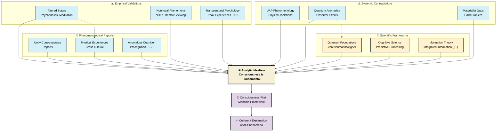
```mermaid
graph TD
    %% Styles
    classDef evidence fill:#d4f1f9,stroke:#333,stroke-width:1px,color:black, r:20px;
    classDef framework fill:#fff2cc,stroke:#333,stroke-width:2px,color:black, r:15px;
    classDef core fill:#f5f0d7,stroke:#000,stroke-width:3px,color:black, r:30px, font-weight:bold;
    classDef outcome fill:#e1d5e7,stroke:#000,stroke-width:2px,color:black, r:15px;

    %% Empirical Validations (Evidence)
    subgraph EV [📊 Empirical Validations]
        A1["Altered States<br>Psychedelics, Meditation"]:::evidence
        A2["Non-local Phenomena<br>NDEs, Remote Viewing"]:::evidence
        A3["Transpersonal Psychology<br>Peak Experiences, DID"]:::evidence
    end

    %% Systemic Contradictions (Evidence)
    subgraph SC [⚠️ Systemic Contradictions]
        B1["UAP Phenomenology<br>Physical Violations"]:::evidence
        B2["Quantum Anomalies<br>Observer Effects"]:::evidence
        B3["Materialist Gaps<br>Hard Problem"]:::evidence
    end

    %% Phenomenological Reports (Evidence)
    subgraph PR [🧘 Phenomenological Reports]
        C1["Unity Consciousness<br>Reports"]:::evidence
        C2["Mystical Experiences<br>Cross-cultural"]:::evidence
        C3["Anomalous Cognition<br>Precognition, ESP"]:::evidence
    end

    %% Scientific Frameworks (Frameworks)
    subgraph SF [🔬 Scientific Frameworks]
        D1["Quantum Foundations<br>Von Neumann/Wigner"]:::framework
        D2["Cognitive Science<br>Predictive Processing"]:::framework
        D3["Information Theory<br>Integrated Information (IIT)"]:::framework
    end

    %% Core and Outcome
    E["⚛️ Analytic Idealism<br>Consciousness is Fundamental"]:::core
    F["🧬 Consciousness-First<br>Mandala Framework"]:::outcome
    G["✨ Coherent Explanation<br>of All Phenomena"]:::outcome

    %% Connections
    A1 & A2 & A3 --> E
    B1 & B2 & B3 --> E
    C1 & C2 & C3 --> E
    D1 & D2 & D3 --> E

    E --> F --> G

    %% Optional: Add a subtle link between related evidence types
    A1 -.-> C2
    B2 -.-> D1
```

#### Empirical Panpsychism (Koch-Tononi Convergence)

Analytic Idealism posits consciousness as primary. IIT provides the **intrinsic property** that makes this tenable:

- **Axiom 1 (Koch)**: Consciousness is a fundamental property of any system with cause-effect power upon itself (Φ > 0)
- **Axiom 2 (Kastrup)**: Matter is the extrinsic appearance of inner experience
- **Synthesis**: Φ quantifies the *degree of dissociation* from Mind at Large

**Citation**: Koch, C. (2019). *The Feeling of Life Itself*. MIT Press. 
- Page 142: "Cerebellum has 69 billion neurons but Φ≈0 because feed-forward architecture lacks causal autonomy"
- This **validates** the Tesseract's distinction between biological complexity and conscious capacity

#### Enactive Realization: How Consciousness Brings Forth Worlds

While Analytic Idealism establishes consciousness as fundamental, Enactivism provides the *how*: consciousness is not a passive observer but an active participant that **brings forth** worlds through structural coupling and sense-making.

**Key Integration Points:**
1. **Consciousness as Action:** Rather than "consciousness perceives reality," we adopt "consciousness enacts meaningful worlds through perceptually-guided action"
2. **Autopoiesis as Self-Production:** Living systems (including communities) maintain their organization through circular self-production—directly mirroring the Mandala's dialectical phases
3. **Structural Coupling:** Our continuous interaction with environments shapes both us and the environment—explaining how mandalas co-evolve with communities
4. **Participatory Sense-Making:** Knowledge emerges *between* agents in interaction, not within isolated minds

**Why This Matters for Solarpunk Mandala:** 
- Explains how communities literally "bring forth" their Symbiotic Commonwealth through collective action
- Provides biological grounding for the Mandala's "Embodied Foundations" protocols
- Bridges the apparent gap between idealist ontology and material practice

### Practical Ontology: Transitioning from Materialist to Idealist Thinking

For those accustomed to materialist thinking, adopting Analytic Idealism requires both intellectual understanding and experiential integration. This section provides practical pathways for this transition.

#### The Three-Part Transition Process

##### Phase 1: Intellectual Understanding

**Step 1: Recognize the Materialist Bind**
- Acknowledge the hard problem of consciousness
- Identify where materialism requires explanatory leaps
- Notice the circularity in materialist explanations of mind

**Step 2: Grasp the Idealist Alternative**
- Understand consciousness as fundamental postulate
- Practice thinking "from the inside out" rather than "outside in"
- Study the dissociation model until it becomes intuitive

**Step 3: Comparative Analysis**
- Map materialist successes onto idealist framework
- Identify where each framework has explanatory advantages
- Recognize idealist solutions to materialist paradoxes

##### Phase 2: Experiential Validation

**Direct Experience Exercises:**

1. **Perception Awareness Practice:**
   - Notice how all experience happens in consciousness
   - Observe that you never experience matter directly, only conscious representations
   - Trace sensory inputs back to conscious qualia

2. **Boundary Investigation:**
   - During meditation, investigate the boundary between "self" and "world"
   - Notice how this boundary shifts in different states
   - Observe the constructed nature of spatial separation

3. **Dream Reality Comparison:**
   - Upon waking, compare dream reality to waking reality
   - Notice similar ontological status as conscious experiences
   - Question why one feels more "real" than the other

##### Phase 3: Integration and Application

**Daily Integration Practices:**

1. **Consciousness-First Reframing:**
   - When encountering problems, ask: "What are the consciousness dynamics here?"
   - Reframe material issues as interface phenomena
   - Consider how boundary conditions might be adjusted

2. **Dissociation Lens Application:**
   - Apply dissociation analysis to personal and social issues
   - Identify where suffering arises from boundary problems
   - Design interventions at the consciousness level

#### Common Pitfalls and How to Avoid Them

##### Pitfall 1: Solipsism Confusion
**Misunderstanding:** "If everything is consciousness, then only my consciousness exists."

**Clarification:** Analytic Idealism posits a unified conscious field (MAL) of which individual minds are dissociated portions. Other people have consciousness because we're all parts of MAL, not because your mind creates them.

**Avoidance Strategy:** Emphasize the transpersonal nature of MAL. Practice recognizing others as fellow alters in the same larger mind.

##### Pitfall 2: Denial of Physical Reality
**Misunderstanding:** "If matter isn't fundamental, then physical things don't matter."

**Clarification:** Physical reality matters profoundly as the stable interface through which consciousness interacts. The moon is real as a perceptual construct within MAL; it's just not fundamentally made of unconscious matter.

**Avoidance Strategy:** Use the "interface reality" concept: physical reality is real as interface, not as fundamental substance.

##### Pitfall 3: Anti-Science Stance
**Misunderstanding:** "If materialism is wrong, then science is wrong."

**Clarification:** Science is the study of patterns in experience. Its methods remain valid; only the metaphysical interpretation changes.

**Avoidance Strategy:** Practice translating scientific findings into idealist language. Recognize that empirical regularity supports both frameworks.

#### Maintaining Critical Thinking

While adopting Analytic Idealism, maintain critical perspective by:

1. **Regular Reality Testing:**
   - Check predictions against experience
   - Look for contradictory evidence
   - Remain open to framework refinement

2. **Comparative Framework Analysis:**
   - Periodically reconsider alternative ontologies
   - Evaluate which framework best explains new evidence
   - Avoid dogmatic attachment to any system

3. **Community Dialogue:**
   - Engage with thoughtful critics
   - Participate in interdisciplinary discussions
   - Submit ideas to peer review processes

#### Transition Timeline Expectations

**Week 1-4:** Intellectual grasp, initial confusion
**Month 2-3:** Experiential validations, paradigm shifts
**Month 4-6:** Integration into daily thinking
**Ongoing:** Refinement, application, community building

Remember: This isn't about rejecting rationality but expanding it to include consciousness as a fundamental datum rather than an unexplained anomaly.

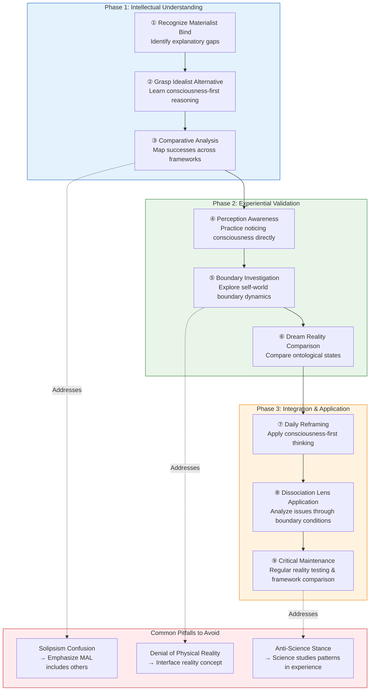
```mermaid
flowchart TD
    subgraph Phase1[Phase 1: Intellectual Understanding]
        direction LR
        P1A["① Recognize Materialist Bind<br>Identify explanatory gaps"]
        P1B["② Grasp Idealist Alternative<br>Learn consciousness-first reasoning"]
        P1C["③ Comparative Analysis<br>Map successes across frameworks"]
    end
    
    subgraph Phase2[Phase 2: Experiential Validation]
        direction LR
        P2A["④ Perception Awareness<br>Practice noticing consciousness directly"]
        P2B["⑤ Boundary Investigation<br>Explore self-world boundary dynamics"]
        P2C["⑥ Dream Reality Comparison<br>Compare ontological states"]
    end
    
    subgraph Phase3[Phase 3: Integration & Application]
        direction LR
        P3A["⑦ Daily Reframing<br>Apply consciousness-first thinking"]
        P3B["⑧ Dissociation Lens Application<br>Analyze issues through boundary conditions"]
        P3C["⑨ Critical Maintenance<br>Regular reality testing & framework comparison"]
    end
    
    P1A --> P1B --> P1C --> P2A --> P2B --> P2C --> P3A --> P3B --> P3C
    
    %% Pitfalls Sidebar
    subgraph Pitfalls["Common Pitfalls to Avoid"]
        direction TB
        PF1["Solipsism Confusion<br>→ Emphasize MAL includes others"]
        PF2["Denial of Physical Reality<br>→ Interface reality concept"]
        PF3["Anti-Science Stance<br>→ Science studies patterns in experience"]
    end
    
    P1C -.->|Addresses| PF1
    P2B -.->|Addresses| PF2
    P3C -.->|Addresses| PF3
    
    style Phase1 fill:#e3f2fd,stroke:#1565c0
    style Phase2 fill:#e8f5e8,stroke:#2e7d32
    style Phase3 fill:#fff3e0,stroke:#f57c00
    style Pitfalls fill:#ffebee,stroke:#c62828
```

### The Practical Payoff for This Project

For the **SolarPunk Mandala**, this ontological starting point is a design feature:

1.  **Coherence:** It allows us to model physical systems, social dynamics, and inner values on a single, consistent spectrum—all as patterns of conscious experience.
2.  **Agency & Responsibility:** It frames our actions not as deterministic particles in a void, but as conscious choices that directly shape the qualitative fabric of shared reality.
3.  **A Foundation for Post-Capitalist Values:** It provides a metaphysical basis for intrinsic worth that isn't tied to material extraction or utility, supporting the shift from an ethos of domination to one of participation and care.

**In essence, we are not choosing metaphysics *over* practicality. We are choosing a foundational model (Idealism) that we believe is more logically coherent and better suited to ground the practical, ethical, and experiential goals of a SolarPunk future than the default materialist model.**

You don't have to accept this ontology to contribute, but understanding it is key to understanding the architecture of the mandala model. Think of it as our **core philosophical API**. All other modules—agency, systems, values—are built to be compatible with this base layer.

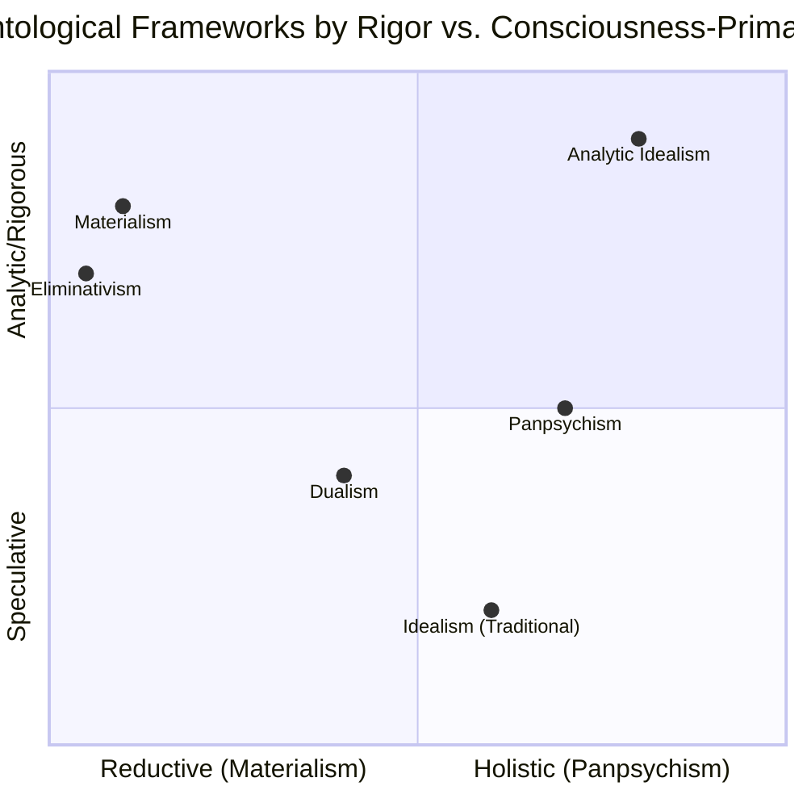
```mermaid
quadrantChart
    title "Ontological Frameworks by Rigor vs. Consciousness-Primacy"
    x-axis "Reductive (Materialism)" --> "Holistic (Panpsychism)"
    y-axis "Speculative" --> "Analytic/Rigorous"
    
    "Analytic Idealism": [0.8, 0.9]
    "Materialism": [0.1, 0.8]
    "Dualism": [0.4, 0.4]
    "Panpsychism": [0.7, 0.5]
    "Idealism (Traditional)": [0.6, 0.2]
    "Eliminativism": [0.05, 0.7]
```

#### The Consciousness Journey: From Dissociation to Re-integration

The fundamental human experience can be understood as a journey from original unity, through dissociation into separate subject-object relationships, and ultimately toward conscious re-integration.

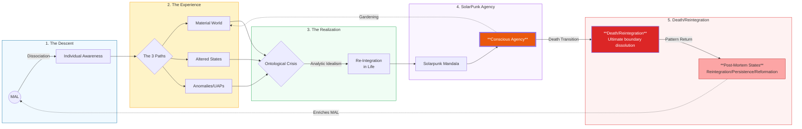
```mermaid
flowchart LR
    %% Phase 1: The Descent
    subgraph Phase_1 [1. The Descent]
    A((MAL)) -->|Dissociation| B[Individual Awareness]
    end

    %% Phase 2: The Experience (The Three Paths)
    subgraph Phase_2 [2. The Experience]
    B --> C{The 3 Paths}
    C --> D[Material World]
    C --> E[Altered States]
    C --> F[Anomalies/UAPs]
    end

    %% Phase 3: The Turning Point
    subgraph Phase_3 [3. The Realization]
    D & E & F --> G{Ontological Crisis}
    G -->|Analytic Idealism| H[Re-Integration<br>in Life]
    end

    %% Phase 4: The Fourth Path
    subgraph Phase_4 [4. SolarPunk Agency]
    H --> I[Solarpunk Mandala]
    I --> J[**Conscious Agency**]
    J -.->|Gardening| D
    end

    %% Phase 5: The Return
    subgraph Phase_5 [5. Death/Reintegration]
    J -->|Death Transition| K[**Death/Reintegration**<br>Ultimate boundary dissolution]
    K -->|Pattern Return| L[**Post-Mortem States**<br>Reintegration/Persistence/Reformation]
    L -.->|Enriches MAL| A
    end

    %% Styling
    style Phase_1 fill:#f0f9ff,stroke:#0369a1
    style Phase_2 fill:#fef3c7,stroke:#f59e0b
    style Phase_3 fill:#f0fdf4,stroke:#16a34a
    style Phase_4 fill:#faf5ff,stroke:#9333ea
    style Phase_5 fill:#fef2f2,stroke:#dc2626
    style J fill:#ea580c,color:#fff,stroke-width:4px
    style K fill:#dc2626,color:#fff,stroke-width:2px
    style L fill:#fca5a5,stroke:#b91c1c
```

#### The Materialist Bind in Modelling Lived Reality

The materialist model excels at describing *objective processes* but struggles fundamentally with *subjective experience*—the very field of values, meaning, ethics, and qualitative life that **SolarPunk** and this mandala aim to cultivate. This leads to paradoxes:

1.  **The Hard Problem of Consciousness:** In a purely physical universe, *why* should complex information processing (like in a brain) feel like anything at all? Why isn't it just "dark inside"? Materialism has no explanatory bridge from objective matter to subjective experience. It is forced to either deny the reality of experience (**illusionism**) or treat it as an inexplicable emergent property.
2.  **The Problem of Values and Meaning:** If consciousness is a secondary illusion, then so are values, purpose, and meaning. They become evolutionary quirks or social constructs with no fundamental grounding. This makes it philosophically difficult to argue for an *intrinsic* value in sustainability, beauty, or community—they become preferences, not truths. A SolarPunk future needs a sturdier foundation for its values.
3.  **The Observer Problem:** Quantum mechanics and the philosophy of science highlight that the observer cannot be cleanly removed from the system. A model of reality that treats consciousness as a latecomer ghost in the machine has a hard time accounting for its own epistemic foundation—*who* is the scientist, the modeler, the GitHub user reading this?

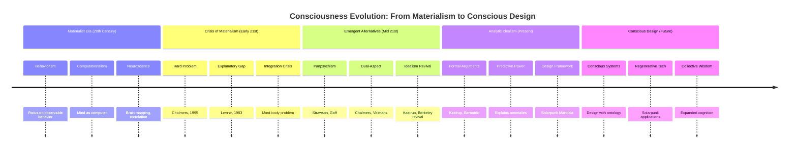
```mermaid
timeline
    title Consciousness Evolution: From Materialism to Conscious Design
    section Materialist Era (20th Century)
        Behaviorism      : Focus on observable behavior
        Computationalism : Mind as computer
        Neuroscience     : Brain mapping, correlation
    
    section Crisis of Materialism (Early 21st)
        Hard Problem      : Chalmers, 1995
        Explanatory Gap   : Levine, 1983
        Integration Crisis: Mind-body problem
    
    section Emergent Alternatives (Mid 21st)
        Panpsychism       : Strawson, Goff
        Dual-Aspect       : Chalmers, Velmans
        Idealism Revival  : Kastrup, Berkeley revival
    
    section Analytic Idealism (Present)
        Formal Arguments  : Kastrup, Bernardo
        Predictive Power  : Explains anomalies
        Design Framework  : Solarpunk Mandala
    
    section Conscious Design (Future)
        Conscious Systems : Design with ontology
        Regenerative Tech : Solarpunk applications
        Collective Wisdom : Expanded cognition
```

### Critical Dialogues: Engaging Counterarguments

While Analytic Idealism provides a coherent framework, it's essential to engage seriously with alternative perspectives and objections. This section addresses common critiques and provides the framework's responses.

#### The Problem of Intersubjective Agreement

**Objection:** If reality is consciousness-based, why do we all seem to perceive the same physical world? How can there be consistency across observers if there's no objective material reality?

**Response:** The consistency arises from shared patterns within Mind-at-Large (MAL). Just as multiple users can interact with the same virtual environment because they're accessing the same underlying software, multiple dissociated alters experience similar perceptual interfaces because they're accessing the same structural patterns within MAL. The "laws of physics" represent the stable grammar of appearance within the shared conscious field, not properties of external matter.

**Supporting Analogy:** Consider a multiplayer video game. The game world appears consistently to all players not because it exists independently, but because they're all interfacing with the same underlying codebase. Their avatars (individual consciousnesses) can interact because the game engine (MAL) maintains coherent relational patterns.

#### The Success of Materialist Science

**Objection:** Materialism has produced incredibly successful technologies and predictions. If matter is just appearance, why does treating it as fundamental work so well?

**Response:** The success of materialist science doesn't prove materialism true; it demonstrates that the regularities of conscious experience can be modeled mathematically. Science studies the *patterns* of appearance, which remain consistent regardless of whether we interpret them as fundamental or derivative. Analytic Idealism accommodates all empirical findings while providing a more parsimonious explanation for consciousness itself.

**Key Distinction:** Materialism excels at describing *what* happens (predictive accuracy) but struggles with *why* there is experience at all. Analytic Idealism explains both the predictive success (pattern regularity) and the experiential ground.

#### Alternative Idealist Frameworks

**Comparison with Subjective Idealism (Berkeley):** Unlike Berkeley's subjective idealism where God maintains consistency, Analytic Idealism posits that consistency arises from the structural coherence of MAL itself, requiring no external deity.

**Comparison with Absolute Idealism (Hegel):** Hegel's absolute idealism emphasizes dialectical development of consciousness through history. Analytic Idealism shares the consciousness-first premise but emphasizes the dissociation model over historical dialectics.

**Comparison with Process Philosophy (Whitehead):** Process philosophy views reality as events rather than substances. Analytic Idealism is compatible with process views but emphasizes the primacy of conscious experience over event-based metaphysics.

#### Quantum Interpretations Without Idealism

**Objection:** Quantum mechanics shows reality is weird, but there are interpretations (Copenhagen, many-worlds, pilot-wave) that don't require consciousness to be fundamental.

**Response:** Analytic Idealism is compatible with several quantum interpretations when properly understood:

- **Von Neumann/Wigner Interpretation:** Consciousness collapses the wave function (directly compatible)
- **QBism (Quantum Bayesianism):** Quantum states represent beliefs about consequences of actions (compatible as an interface theory)
- **Relational Quantum Mechanics:** Reality is relationally defined between systems (compatible with the dissociation model)

The key insight: quantum weirdness is what we should expect when probing the boundaries of perceptual interfaces within a consciousness-only reality.

#### The "Hard Problem" Reversal

**Objection:** If consciousness is fundamental, we've just moved the hard problem to explaining how MAL appears as matter.

**Response:** This reverses the explanatory burden. In materialism, you must explain how non-conscious matter produces consciousness (an unsolved hard problem). In Analytic Idealism, you must explain how consciousness appears as matter (a solvable interface problem). The latter is more tractable because:
1. We have direct access to consciousness
2. Interface design principles are well-understood
3. We can study how different interfaces reveal different aspects of underlying reality

#### Practical Objections: Why Does This Matter?

**Objection:** Even if true, how does this change daily life or scientific practice?

**Response:** The ontological shift has profound practical implications:
- **Ethics:** Grounds values in the fundamental nature of reality
- **Psychology:** Provides framework for understanding mental health as boundary conditions
- **Ecology:** Recognizes nature as conscious expression, not dead resource
- **Social Design:** Informs how to structure societies that minimize suffering and maximize flourishing

The practical payoff isn't in changing physics equations but in changing how we relate to ourselves, each other, and the world.

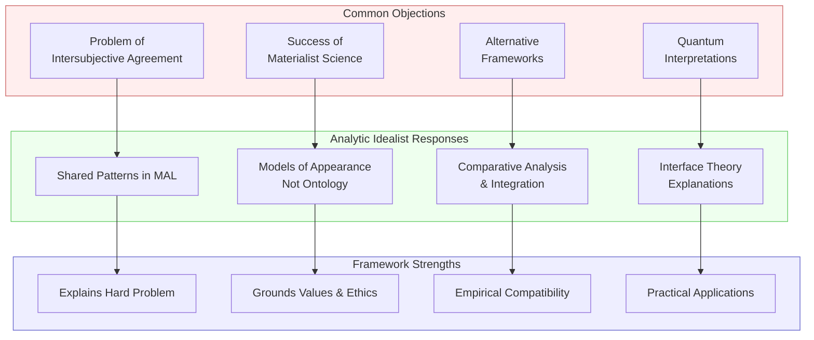
```mermaid
flowchart TD
    subgraph Objections["Common Objections"]
        O1["Problem of<br>Intersubjective Agreement"]
        O2["Success of<br>Materialist Science"]
        O3["Alternative<br>Frameworks"]
        O4["Quantum<br>Interpretations"]
    end
    
    subgraph Responses["Analytic Idealist Responses"]
        R1["Shared Patterns in MAL"]
        R2["Models of Appearance<br>Not Ontology"]
        R3["Comparative Analysis<br>& Integration"]
        R4["Interface Theory<br>Explanations"]
    end
    
    subgraph Framework["Framework Strengths"]
        S1["Explains Hard Problem"]
        S2["Grounds Values & Ethics"]
        S3["Empirical Compatibility"]
        S4["Practical Applications"]
    end
    
    O1 --> R1 --> S1
    O2 --> R2 --> S2
    O3 --> R3 --> S3
    O4 --> R4 --> S4
    
    style Objections fill:#fee,stroke:#c66
    style Responses fill:#efe,stroke:#6c6
    style Framework fill:#eef,stroke:#66c
```

## 🧠 The Perceptual Interface: How Mind-at-Large Appears as a World

If reality is fundamentally conscious experience, then **perception is not a passive mirror of an external world**, but an *active interface* through which Mind-at-Large (MAL) appears to itself across dissociative boundaries.

From the standpoint of Analytic Idealism, perception is the **grammar of appearance** — the structured set of experiential modalities through which conscious activity becomes legible as “a world.”

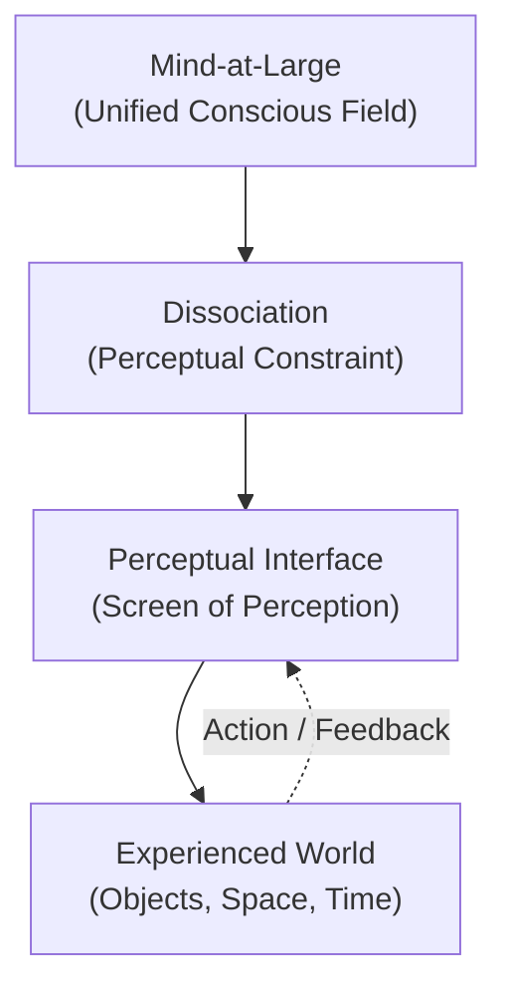
```mermaid
flowchart TD
    MAL["Mind-at-Large<br/>(Unified Conscious Field)"]
    Diss["Dissociation<br/>(Perceptual Constraint)"]
    Interface["Perceptual Interface<br/>(Screen of Perception)"]
    World["Experienced World<br/>(Objects, Space, Time)"]

    MAL --> Diss
    Diss --> Interface
    Interface --> World

    World -.->|"Action / Feedback"| Interface
```

### Perception as Interface, Not Representation

This framework aligns closely with **Donald Hoffman’s Interface Theory of Perception**, which demonstrates (both mathematically and evolutionarily) that perceptual systems do not evolve to show reality as it is, but to present **fitness-relevant symbols** that guide adaptive action.

> *Perception is more like a desktop interface than a window onto objective truth.*  
> — Donald Hoffman

In this view:
- Space, time, objects, and bodies are **icons**, not fundamental entities
- Perceptual experiences are **species-specific user interfaces**
- What we call “physical reality” is a **compressed, actionable appearance** of deeper conscious dynamics

Analytic Idealism extends this insight ontologically:  
**the interface is not hiding a material world — it is how consciousness looks across dissociation.**

### The Bioelectromagnetic Interface: Empirical Evidence for Perception as Reception

The foundational claim that perception functions as an interface rather than a passive representation finds direct empirical support in bioelectromagnetic research. This section reviews evidence demonstrating that the brain's structural properties enable it to act as a tunable receiver for information-bearing electromagnetic fields.

#### The Brain as a Tunable Receiver: Post-Mortem Tissue Evidence

Rouleau's doctoral dissertation systematically demonstrates that fixed, non-living human brain tissues retain remarkable information-processing properties that cannot be explained by metabolic activity alone [Rouleau, 2017; Rouleau et al., 2016].

**Key findings include:**

- **Regional electrical anisotropies:** Post-mortem tissues express differential electrical responses depending on neuroanatomical location, with perihippocampal areas showing greatest responsiveness to applied electromagnetic fields. These response patterns mirror the functional specialization observed in living brains, suggesting that information-filtering properties are structurally encoded [Rouleau, 2017, Chapter 4].

- **Pattern-specific sensitivity:** Current injections into fixed human brain tissue produce maximal effects when patterned to simulate neuronal spike-trains matching the dominant frequency of the equivalent living tissue subsection. Simple sine waves or square waves prove significantly less effective [Rouleau & Persinger, 2016].

- **Hemispheric specialization:** Fixed tissues act as non-random electromagnetic filters, expressing signals preferentially within the right cerebral hemisphere. This mirrors functional lateralization observed in living brains and suggests that the physical architecture of the brain embodies specific information-processing biases independent of metabolic activity [Rouleau, 2017, Chapter 6].

- **Chemoelectrical responsiveness:** Receptor agonist-antagonist probes (glutamate, ketamine) induce regional electrical responses and habituation-type phenomena in post-mortem tissue. This suggests structure-function relationships sufficient to support basic information processing without cellular metabolism [Rouleau et al., 2016].

**Methodological considerations:** These tissues were fixed in formalin-based solutions, which cross-link proteins and preserve structural integrity while eliminating all metabolic activity. Electron microscopy confirms preserved ultrastructure including dendritic arborization and synaptic organization [Rouleau, 2017]. The persistence of differential electromagnetic responses in such tissues provides direct evidence that the brain's filtering properties are fundamentally structural, not merely metabolic.

**Implications for the transmissive model:** These findings provide physical evidence for the "radio receiver" analogy central to the transmissive theory. The brain's structural architecture itself constitutes a sophisticated filtering mechanism that persists beyond the cessation of biological life. If consciousness requires only appropriate filtering of pre-existing fields (rather than generation *de novo*), these findings suggest the physical substrate for such filtering remains intact post-mortem.

#### Geomagnetic Entrainment: Environmental Modulation of Neural Function

The assertion that perception is an active interface rather than passive representation gains support from extensive research demonstrating direct correlations between geomagnetic activity and brain function.

**Historical foundations:** Persinger's foundational work on "geopsychology" established that temporal and regional variations in psychological processes correlate with three geological factors: geochemical profiles, geomagnetic variations, and tectonic stresses [Persinger, 1987]. This framework positioned human experience within a continuous geophysical context rather than isolated within individual skulls.

**Psychiatric and neurological correlations:** Meta-analytic reviews demonstrate consistent associations between geomagnetic activity and human behavior:

- Increased psychiatric hospital admissions during periods of elevated geomagnetic activity [Persinger, 1987; Kay, 1994]
- Enhanced anxiety, sleep disturbances, and altered moods associated with geomagnetic variations [Persinger, 1987]
- Significant correlations between geomagnetic activity and mortality in rats following induced limbic seizures (r = 0.60), with risk increasing when 24-hour geomagnetic indices exceeded 20 nT [Persinger, 1988]

**Epilepsy research:** The hypothesis that geomagnetic activity affects temporal lobe stability has been experimentally validated:

- Bureau and Persinger demonstrated that both the probability and propagation of paroxysmal electrical discharges within the amygdala and hippocampus are facilitated when geomagnetic activity suppresses nocturnal melatonin levels [Bureau & Persinger, 1992]
- Ilipaev's analysis of 1,499 epileptic patient admissions across an 11-year solar cycle found significant dependence of epilepsy course on heliogeophysical factors, including sunspot numbers and geomagnetic activity [Ilipaev, 1978]
- Rajaram and Mitra's analysis of 2,093 epileptic patients across five years demonstrated significant correlations between seizure frequency and geomagnetic activity, particularly for patients with temporal lobe foci [Rajaram & Mitra, 1981]

**Mechanistic implications:** These findings suggest the brain's "dissociation boundary" – the perceptual filter that constitutes individual conscious experience – is not closed but continuously modulated by the planet's own magnetic field. This provides a direct physical link between Mind-at-Large's environmental expression and individual conscious experience.

#### The God Helmet: Experimental Modulation of the Perceptual Interface

The "God Helmet" experiments developed by Persinger and Koren provide a laboratory model for how weak, complex electromagnetic fields can induce specific alterations in the perceptual interface.

**Experimental apparatus and protocol:** The apparatus consists of a modified motorcycle or snowmobile helmet fitted with four solenoids positioned over the temporoparietal regions [Persinger & Koren, 2001]. These solenoids generate weak magnetic fields (5-50 microtesla, comparable to those produced by household appliances and approximately one million times weaker than transcranial magnetic stimulation). The fields are patterned to simulate neuronal burst-firing patterns recorded from living brains, typically applied for 20-30 minutes while subjects sit in darkened, sound-attenuated chambers.

**Phenomenological findings:** Under controlled conditions, approximately 80% of subjects report experiences including:

- A "sensed presence" – the experience of another entity in the room, interpreted culturally as an angel, deceased relative, spirit guide, or deity [Persinger, 1983; Persinger & Koren, 2001]
- Vestibular experiences – sensations of spinning, floating, or leaving the body [Persinger, 1999]
- Emotional responses ranging from profound peace to existential dread [Persinger & Healey, 2002]
- Visual phenomena including geometric patterns, memories, or brief visions [Persinger, 1993]

**Cultural interpretation of experiences:** The specific cultural label applied to the sensed presence correlates with subjects' religious and cultural backgrounds. Christians typically identify the presence as Jesus or Mary, Hindus as Shiva or Krishna, and secular subjects as a deceased relative or "presence" without specific theological attribution [Persinger, 1983]. This suggests the underlying neurophenomenological experience is universal while its interpretation is culturally mediated – consistent with the document's claim that cultural expressions represent "interface variations within Mind-at-Large."

**Proposed mechanism:** Persinger's theoretical framework posits that the sense of self has bicameral components distributed across cerebral hemispheres, with the left hemisphere typically dominant [Persinger, 1993]. Electromagnetic stimulation of the right temporoparietal region disrupts left-hemisphere integration, allowing the right hemisphere's "alternate self" to be experienced as an external presence. This provides a testable model for how the "dissociation boundary" described in Section 3.2 can be experimentally manipulated.

**Replication controversies and methodological considerations:**

Granqvist et al.'s failed double-blind replication attempt raised important methodological questions. Their 2004 study concluded that magnetic fields had no demonstrable effect on religious or spiritual experiences, attributing Persinger's findings to subject suggestibility [Granqvist et al., 2005].

However, critical analysis reveals significant methodological differences:

1. **Exposure duration:** Persinger countered that Granqvist's group used exposure durations insufficient to produce reliable effects, typically 10-15 minutes compared to Persinger's 20-30 minute protocol [Persinger, personal communication, cited in Aaen-Stockdale, 2012].

2. **Field parameters:** Granqvist's replication used different field parameters that may not have matched the complex patterning required for effectiveness. Persinger emphasized that low-intensity fields require complex, non-predictable patterning rather than simple sine waves [Persinger, 1999].

3. **Biophysical paradox:** Aaen-Stockdale's analysis noted that the magnetic fields generated are too weak to penetrate the cranium and influence neurons directly under conventional biophysical models [Aaen-Stockdale, 2012]. A 5-50 microtesla field at the scalp would attenuate to approximately 1-10 picoTesla at cortical surfaces – far below the threshold for neuronal depolarization.

**Theoretical resolution:** This paradox illuminates a deeper theoretical point: if weak electromagnetic fields cannot directly depolarize neurons, yet reliable phenomenological effects occur under specific conditions, alternative mechanisms must be considered. The cryptochrome radical pair mechanism (Section 3.4) provides one such alternative, operating at the quantum level through electron spin dynamics rather than classical depolarization. This mechanism is consistent with the document's claim that consciousness is fundamental and perception is interface-mediated rather than classically causal.

**Implications for the perceptual interface model:** Regardless of the ongoing replication debates, the God Helmet experiments demonstrate that:

1. Specific electromagnetic field configurations correlate with specific phenomenological experiences
2. The "sense of self" can be experimentally modulated by environmental fields
3. Cultural context shapes interpretation of fundamental neurophenomenological experiences

These findings support the document's claim that perception is an active interface rather than passive representation, and that this interface can be experimentally manipulated.

### Quantum Mechanisms of Perception: The Radical Pair Hypothesis

The document's claim that perception is an active interface finds mechanistic support at the quantum level through the cryptochrome radical pair hypothesis. This mechanism explains how organisms detect and transduce magnetic field information without requiring classical neuronal depolarization, addressing the biophysical paradox raised by weak-field effects.

#### The Cryptochrome Molecule: Structure and Function

Cryptochromes are flavoproteins expressed widely across the animal kingdom, including in the human suprachiasmatic nucleus, retina, and throughout the brain [Sancar, 2004; Foley et al., 2011]. These molecules contain two critical components:

- **Flavin adenine dinucleotide (FAD):** A chromophore that absorbs light, particularly in the UV-A/blue spectrum (350-450 nm)
- **Tryptophan residues:** A chain of three tryptophan amino acids that facilitate electron transfer

**Photoactivation process:** When cryptochrome absorbs a photon of appropriate wavelength, an electron is transferred from the tryptophan chain to the FAD molecule [Solov'yov et al., 2012]. This creates a radical pair – two molecules each containing an unpaired electron whose spins are quantum-correlated.

#### The Radical Pair Mechanism: Quantum Magnetoreception

The radical pair exists in two possible quantum states:

- **Singlet state:** Electron spins are anti-parallel (opposite orientation)
- **Triplet state:** Electron spins are parallel (same orientation)

The probability distribution between singlet and triplet states is influenced by ambient magnetic fields as weak as Earth's (approximately 50 microtesla) [Ritz et al., 2000]. Critically, this probability depends on:

1. **Field strength:** The magnitude of the magnetic field relative to internal molecular interactions
2. **Field orientation:** The angle of the magnetic field relative to the molecule's alignment
3. **Radiofrequency fields:** Specific frequencies can resonate with the spin precession frequency

**Biochemical signal transduction:** Singlet and triplet radical pairs have different biochemical reaction pathways. The spin state determines what downstream products are formed, which in turn affects cellular signaling cascades. Thus, geomagnetic field information is converted into biochemical signals without requiring direct neuronal depolarization [Hore & Mouritsen, 2016].

#### Experimental Validation in Animal Models

Reppert's monarch butterfly research provides compelling behavioral evidence for the radical pair mechanism [Reppert et al., 2016; Guerra et al., 2014].

**Key experimental findings:**

- **Field orientation sensitivity:** Monarch butterflies exposed to 57-141 microtesla fields oriented their migration according to field direction. When the field direction was shifted 90 degrees, their flight orientation shifted correspondingly [Guerra et al., 2014].

- **Wavelength dependence:** When UV wavelengths (<420 nm) were filtered out, magnetic orientation ability vanished. This wavelength corresponds precisely to cryptochrome absorption peaks [Guerra et al., 2014].

- **Tissue localization:** Painting the antennae black (blocking light access to cryptochrome-containing tissues) eliminated magnetic sensitivity while leaving visual navigation intact, demonstrating that magnetoreception requires light activation of cryptochrome [Merlin et al., 2009].

- **Radiofrequency disruption:** Applying weak radiofrequency fields that resonate with electron spin precession disrupted magnetic orientation, providing direct evidence that the mechanism involves quantum spin dynamics rather than classical induction [Ritz et al., 2004; Engels et al., 2014].

**Comparative evidence:** Similar findings have been demonstrated in:

- **European robins:** Migratory orientation disrupted by radiofrequency fields matching electron spin resonance frequencies [Ritz et al., 2004]
- **Garden warblers:** Magnetic orientation requires specific light wavelengths [Wiltschko & Wiltschko, 2002]
- **Drosophila:** Cryptochrome mutants show reduced magnetic sensitivity [Gegear et al., 2008]

#### Relevance to Human Consciousness and Perception

While human magnetoreception remains debated, several lines of evidence suggest the radical pair mechanism may operate in humans:

**Molecular presence:** Cryptochrome proteins (CRY1 and CRY2) are expressed in the human retina and suprachiasmatic nucleus, with lower expression throughout the brain [Foley et al., 2011]. These proteins are structurally conserved and capable of forming radical pairs [Sancar, 2004].

**Circadian rhythm function:** Human cryptochromes serve primary functions in circadian rhythm regulation. Their magnetosensitivity, if present, would represent an exaptation of existing molecular machinery [Lakin-Thomas, 2006].

**EEG correlates:** Human EEG alpha rhythm (8-12 Hz) shows sensitivity to geomagnetic conditions and orientation relative to magnetic north [Mulligan & Persinger, 2012; Krištof et al., 2019], consistent with radical pair angle-dependence.

**Weak-field sensitivity:** The radical pair mechanism provides a plausible pathway for weak fields (microtesla range) to influence neural function without direct depolarization – addressing the biophysical paradox that Persinger's God Helmet fields are too weak for classical effects [Aaen-Stockdale, 2012].

#### Implications for the Perceptual Interface Model

The radical pair mechanism supports the document's claims in several ways:

1. **Interface mediation:** Perception is mediated by quantum-level processes that transduce environmental information into biochemical signals, consistent with the "interface" rather than "representation" model.

2. **Continuous environmental coupling:** The mechanism operates continuously, not just during conscious attention, suggesting the perceptual interface is always coupled to ambient fields.

3. **Non-classical information transfer:** Information is transferred through spin-state dynamics rather than classical energy transfer, supporting the view that consciousness involves non-classical processes.

4. **Empirical testability:** The mechanism generates testable predictions (wavelength dependence, radiofrequency sensitivity) that can be investigated in human subjects using EEG and phenomenological reports.

5. **Bridging levels of description:** The radical pair mechanism connects quantum-level processes with cellular biochemistry and ultimately with conscious experience, providing a multi-level account consistent with analytic idealism's claim that consciousness is fundamental and matter is its extrinsic appearance.

### The Core Perceptual Modalities (Experiential Primitives)

The “multimodal appearance” of reality arises through a finite set of **primary perceptual modalities**. These are not secondary byproducts of matter, but **first-order modes of conscious experience** within localized alters.

**Exteroceptive Modalities (World-Oriented)**
- **Vision** (light, color, motion, depth)
- **Audition** (sound, rhythm, spatial direction)
- **Olfaction** (chemical pattern recognition)
- **Gustation** (nutritional valuation)
- **Tactile Touch** (pressure, vibration, texture)

**Interoceptive & Embodied Modalities (Self-Oriented)**
- **Interoception** (heartbeat, breath, hunger, nausea)
- **Thermoception** (hot / cold)
- **Nociception** (pain, threat, tissue risk)
- **Proprioception** (body position and movement)
- **Affective Valence** (pleasant / unpleasant)

These modalities together constitute the **Screen of Perception** — the experiential boundary surface through which MAL’s internal dynamics are rendered as an apparently external world.

### Phenomenological Methods: Investigating Consciousness Directly

Within Analytic Idealism, consciousness isn't just the subject of study—it's the medium of investigation. This section outlines systematic approaches to studying consciousness from within.

#### Foundational Principles

##### First-Person Authority with Intersubjective Verification
- **Individual access:** Each investigator has direct access to their own consciousness
- **Pattern comparison:** Similarities across reports indicate shared structures in MAL
- **Methodological triangulation:** Multiple approaches converge on reliable findings

##### The Bracketing Method (Adapted from Husserl)
1. **Epoché:** Suspend assumptions about the objective existence of the world
2. **Phenomenological Reduction:** Focus on experience itself, not what it represents
3. **Eidetic Variation:** Imagine variations to identify essential structures

#### Systematic Investigation Protocols

##### Protocol 1: Consciousness State Mapping

**Purpose:** Document the range of possible conscious states

**Procedure:**
1. Baseline assessment in ordinary waking state
2. Systematic exploration of altered states (meditation, substances, rituals)
3. Dream state documentation and comparison
4. Boundary state investigation (hypnagogic, near-sleep, illness)

**Documentation Elements:**
- Perceptual modalities available/dominant
- Boundary permeability assessment
- Temporal experience quality
- Self-other differentiation level
- Affective tone and valence

##### Protocol 2: Boundary Condition Analysis

**Purpose:** Investigate the structure and dynamics of dissociation boundaries

**Procedure:**
1. Identify a specific boundary (e.g., self-other, human-nature, living-ancestral)
2. Explore boundary permeability under different conditions
3. Map boundary correlates in different states
4. Test boundary manipulation techniques

**Analysis Dimensions:**
- Clarity vs. permeability
- Stability vs. fluidity
- Content filtering patterns
- Emotional charge on boundary

##### Protocol 3: Intersubjective Resonance Testing

**Purpose:** Investigate shared consciousness phenomena

**Procedure:**
1. Paired or group meditation with shared focus
2. Synchronized altered state exploration
3. Dream sharing and comparison
4. Collective ritual with intention alignment

**Validation Criteria:**
- Statistical analysis of shared content
- Qualitative comparison of reports
- Independent verification of non-ordinary information
- Replication across different groups

#### Distinguishing Experience Layers

##### The Five-Layer Model of Conscious Experience

1. **Raw Qualia Layer:** Basic experiential elements (colors, sounds, emotions)
2. **Pattern Recognition Layer:** Meaningful patterns in qualia
3. **Narrative Construction Layer:** Story-making about patterns
4. **Reflective Awareness Layer:** Awareness of the narrative process
5. **Witness Consciousness Layer:** Pure awareness without content

**Investigation Method:** Move attention systematically through layers, noticing transitions and interactions.

##### Identifying Projection vs. Perception

**Key Question:** Is this experience a direct perception of MAL patterns or a projection of my own boundary conditions?

**Differentiation Techniques:**
- State comparison: Does it persist across different states?
- Consensus checking: Do others report similar experiences?
- Predictive testing: Does it lead to accurate predictions?
- Coherence analysis: Does it fit with other reliable knowledge?

#### Intersubjective Validation Methods

##### Method 1: Structured Experience Reporting

**Format:**
```markdown
1. State Conditions:
- Physiological: [sleep, substances, fasting, etc.]
- Psychological: [emotional state, intention, preparation]
- Environmental: [setting, time, social context]

2. Experience Description:
- Phenomenological: What was experienced
- Structural: Patterns, boundaries, transitions
- Temporal: Duration, sequence, timing

3. Interpretation:
- Immediate meaning
- Symbolic associations
- Integration insights
```

##### Method 2: Consciousness Experience Inventory (CEI)

A standardized tool for comparing experiences across individuals and states:

**Domains Assessed:**
- Perceptual range and quality
- Boundary clarity and permeability
- Temporal experience mode
- Self-other differentiation
- Affective spectrum access
- Symbolic processing capacity

##### Method 3: Triangulation Protocol

When investigating anomalous experiences:
1. **First-person report:** Detailed phenomenological account
2. **Second-person witness:** Accounts from others present
3. **Third-person observation:** Physiological measures, environmental data
4. **Consensus analysis:** Where do reports converge/diverge?

#### Ethical Guidelines for Consciousness Research

1. **Informed Consent:** Full understanding of potential state changes
2. **Integration Support:** Resources for processing intense experiences
3. **Cultural Sensitivity:** Respect for different consciousness traditions
4. **Safety Protocols:** Physical and psychological safety measures
5. **Confidentiality:** Protection of personal experience reports
6. **Non-Exploitation:** Avoidance of coercive or manipulative practices

#### Technological Augmentation

**Tools for Enhanced Investigation:**
- **EEG/fMRI:** Brain activity correlates of different states
- **Heart rate variability:** Physiological coherence measures
- **Eye tracking:** Attention pattern analysis
- **Biofeedback:** Real-time state awareness
- **Digital journals:** Structured experience recording

#### Building a Collective Knowledge Base

**Solarpunk Mandala Contribution:** All phenomenological research conducted within this framework contributes to a growing understanding of MAL's structure and dynamics. This knowledge base serves as:
- A map of consciousness possibilities
- A guide for healing and development
- A foundation for ethical social design
- Evidence for the analytic idealist framework

**Submission Protocol:** Researchers can submit structured reports to the Mandala's consciousness database, tagged by:
- State type
- Boundary condition
- Investigative method
- Validation level

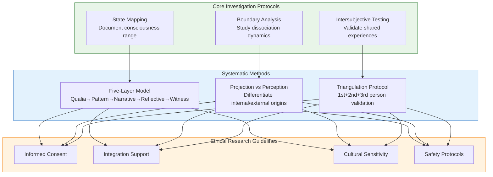
```mermaid
flowchart TD
    subgraph Protocols["Core Investigation Protocols"]
        P1["State Mapping<br>Document consciousness range"]
        P2["Boundary Analysis<br>Study dissociation dynamics"]
        P3["Intersubjective Testing<br>Validate shared experiences"]
    end
    
    subgraph Methods["Systematic Methods"]
        M1["Five-Layer Model<br>Qualia→Pattern→Narrative→Reflective→Witness"]
        M2["Projection vs Perception<br>Differentiate internal/external origins"]
        M3["Triangulation Protocol<br>1st+2nd+3rd person validation"]
    end
    
    subgraph Ethics["Ethical Research Guidelines"]
        E1["Informed Consent"]
        E2["Integration Support"]
        E3["Cultural Sensitivity"]
        E4["Safety Protocols"]
    end
    
    P1 --> M1
    P2 --> M2
    P3 --> M3
    
    M1 & M2 & M3 --> E1 & E2 & E3 & E4
    
    style Protocols fill:#e8f5e8,stroke:#2e7d32
    style Methods fill:#e3f2fd,stroke:#1565c0
    style Ethics fill:#fff3e0,stroke:#f57c00
```

#### Correlative Bioelectromagnetic Methods

The document's phenomenological protocols can be enhanced by correlating first-person reports with measurable electromagnetic phenomena. This section provides specific methodological guidance.

##### State-Dependent Geomagnetic Correlation

When conducting "Consciousness State Mapping" (Section 11.1), researchers should incorporate geomagnetic monitoring.

**Equipment requirements:**

- **Local magnetometer:** Three-axis fluxgate magnetometer with sensitivity <1 nT, sampling rate ≥1 Hz
- **Alternative:** Real-time access to planetary K-index data from geomagnetic observatories (e.g., INTERMAGNET network)

**Protocol:**

1. **Baseline recording:** Record ambient geomagnetic conditions for 24 hours prior to each session, noting diurnal variations and storm-time activity.

2. **Session documentation:** For each phenomenological session, document:
   - Local geomagnetic field strength (total intensity, nT)
   - Horizontal and vertical components
   - Kp index (planetary geomagnetic activity, 0-9 scale)
   - Subject orientation relative to magnetic north

3. **Statistical analysis:** Compare phenomenological reports collected during:
   - Quiet geomagnetic conditions (Kp < 2)
   - Active conditions (Kp 4-6)
   - Storm conditions (Kp > 6)
   - Specific field orientations relative to subject

**Testable prediction:** Unity experiences, boundary dissolution, and transpersonal phenomena should correlate with specific geomagnetic conditions if the perceptual interface is modulated by ambient fields. Reports of "sensed presence" may increase during periods of elevated geomagnetic activity, as suggested by retrospective analyses [Persinger, 1988; Persinger & Richards, 1995].

##### Paired Boundary Permeability Testing with Electromagnetic Correlation

For "Boundary Condition Analysis" (Section 11.2) investigating self-other boundary permeability, electromagnetic measurements can provide objective correlates.

**Equipment requirements:**

- **Magnetically shielded chamber:** Faraday cage attenuation >40 dB from 0-100 Hz
- **Sham chamber:** Identical appearance without shielding
- **EEG system:** Synchronized recording from both subjects
- **Magnetometers:** Inside and outside shielded chamber

**Protocol:**

1. **Paired subject recruitment:** Dyads with reported connection (twins, long-term partners, close friends) and control dyads.

2. **Randomized condition assignment:** Subjects experience both shielded and unshielded conditions in counterbalanced order, blinded to condition.

3. **Phenomenological measures:** Standardized instruments for:
   - Perceived connection to other
   - Boundary permeability (self-other differentiation)
   - Shared imagery or sensations
   - Emotional valence

4. **Electromagnetic measures:**
   - Inter-subject EEG coherence (particularly in theta 4-8 Hz and gamma 30-100 Hz bands)
   - Cross-correlation of EEG signals at zero and non-zero lags
   - Correlation of EEG with ambient geomagnetic activity

5. **Analytical approach:** Compare phenomenological and EEG measures between shielded and unshielded conditions, controlling for geomagnetic activity.

**Testable prediction:** Reported connection and inter-subject EEG coherence should decrease in shielded environments and vary with geomagnetic activity if electromagnetic fields mediate interpersonal resonance. Persinger's "telepathy" experiments provide preliminary support for this hypothesis, showing increased inter-hemispheric EEG coherence in dyads exposed to correlated weak complex magnetic fields [Persinger et al., 2010].

##### Dream State Electromagnetic Correlation

For dream research (Section 4), electromagnetic monitoring can test hypotheses about dream content modulation by geomagnetic conditions.

**Equipment requirements:**

- **Bedroom magnetometer:** Continuous recording during sleep
- **Sleep tracking:** Polysomnography or consumer-grade sleep tracking with REM detection
- **Dream recall protocol:** Morning journaling with standardized dream content analysis

**Protocol:**

1. **Longitudinal design:** Minimum 30 nights per subject to capture varying geomagnetic conditions.

2. **Content analysis:** Blind rating of dream reports for:
   - Emotional valence and intensity
   - Bizarreness and boundary dissolution
   - Archetypal or transpersonal content
   - Premonitory or "anomalous" information

3. **Electromagnetic correlation:** Correlate dream content measures with:
   - Geomagnetic activity during sleep (Kp index, local variations)
   - Rate of change of magnetic field (dB/dt)
   - Subject orientation relative to magnetic north

**Testable prediction:** Dream bizarreness, boundary dissolution, and transpersonal content should correlate with geomagnetic activity. Retrospective studies suggest that "premonition" dreams increase during geomagnetic storms [Persinger & Krippner, 1989] and that REM duration varies with geomagnetic conditions [Lipnicki, 2009].

#### Post-Mortem Tissue Phenomenological Correlation

For research involving post-mortem tissues (Section 5.1.4), phenomenological inference requires careful methodological consideration.

**Theoretical framework:**

As Rouleau notes in the video transcript, "whether or not we can't know because we don't yet have a measure of consciousness that's direct. We can't know the contents of consciousness without asking people or inferring it on the basis of their behaviors."

However, systematic investigation can proceed through:

1. **Structure-function mapping:** Correlate tissue response properties (frequency sensitivity, regional specificity) with known functional roles in living brains.

2. **Stimulation phenomenology inference:** When specific stimulation patterns produce predictable effects in living subjects (e.g., God Helmet inducing sensed presence), apply similar patterns to post-mortem tissues from the same regions and measure responses.

3. **Convergent evidence:** Combine multiple measures (electrical, chemical, structural) to build inference models.

**Ethical considerations:** This research requires the enhanced ethical protocols described in Section 6.4.1.

##### Data Sharing and Collaborative Analysis

To maximize scientific value, researchers should consider:

1. **Open data repositories:** Shared databases of phenomenological reports with associated electromagnetic measurements
2. **Standardized protocols:** Adoption of common measurement standards to enable meta-analysis
3. **Interdisciplinary collaboration:** Partnerships between phenomenologists, neuroscientists, and geophysicists

The Solarpunk Mandala's consciousness database (Section 11.5) should include electromagnetic metadata fields to enable these correlational analyses.

### Dissociation as Perceptual Filtering

Within Analytic Idealism, dissociation does not eliminate access to Mind-at-Large — it **filters and constrains perceptual bandwidth**.

- A tighter dissociation boundary → narrower perceptual range, stronger salience gating
- A loosened boundary → expanded perceptual access (altered states, transpersonal experience)

Altered states of consciousness (psychedelics, meditation, trauma, ritual) are therefore not hallucinations *ex nihilo*, but **modulations of the perceptual interface** — changes in what information is allowed through the dissociative filter.

This reframes perception as:
- **Dynamic** (not fixed)
- **Ethically significant** (because suffering and flourishing are perceptual realities)
- **Central to regeneration** (because systems change requires perceptual change)

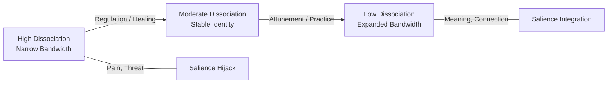
```mermaid
flowchart LR
    Low["High Dissociation<br/>Narrow Bandwidth"]
    Mid["Moderate Dissociation<br/>Stable Identity"]
    High["Low Dissociation<br/>Expanded Bandwidth"]

    Low -->|"Regulation / Healing"| Mid
    Mid -->|"Attunement / Practice"| High

    Low ---|"Pain, Threat"| Salience1["Salience Hijack"]
    High ---|"Meaning, Connection"| Salience2["Salience Integration"]
```

### Why Perception Matters for a Solarpunk Future

If values, meaning, and agency arise within experience, then **designing regenerative systems is inseparable from designing perceptual conditions**.

A Solarpunk future is not only about cleaner energy or better infrastructure — it is about cultivating:
- perceptual attunement to ecological rhythms
- restored interoceptive awareness
- reduced salience hijacking by fear and scarcity
- expanded capacity to perceive interconnection

In short:  
**we do not change worlds by rearranging matter alone — we change the interfaces through which reality is experienced.**

This perceptual layer is the necessary bridge between ontology (what is) and epistemic architecture (how we know and act), which the next document formalizes through the Tesseract model.

> **Interface Theory of Perception (ITP)**  
> Hoffman, D. D. (2019). *The Case Against Reality*. W.W. Norton & Company.
>
> Hoffman demonstrates that perceptual systems optimized by evolution do not track objective truth, but fitness-relevant structure. Space, time, and objects function as adaptive symbols — comparable to a user interface — that guide action while concealing underlying complexity.
>
> Within the Solarpunk Mandala, Interface Theory is not treated as a complete ontology, but as **convergent empirical support** for the claim that perception is an interface rather than a depiction. Analytic Idealism extends this insight by identifying consciousness itself — not matter — as the underlying reality that interfaces make actionable.

## 🌙 Dreaming as a Native Mode of the Perceptual Interface

Within an Analytic Idealist ontology, **dreaming is not a secondary or illusory state**, but a *native mode of perception* that emerges when dissociative constraints associated with waking consensus reality are partially relaxed.

Dreams occur when the perceptual interface remains active while **exteroceptive consensus coupling** (shared spatial coordinates, stable objects, linear causality) is temporarily offline. What remains is a fully operational experiential field structured primarily by **affective valence, memory, symbolic resonance, and pattern logic** rather than material iconography.

### Ontological Status of Dreams

- Dreams are **ontologically equivalent** to waking experience: both are structured appearances within Mind-at-Large (MAL).
- The distinction between “dream” and “waking world” is not one of reality vs. unreality, but of **interface configuration**.
- Dream worlds are *endogenous perceptual enactments* rather than shared consensus enactments.

From this perspective, dreams are best understood as **perception without external consensus anchoring**.

### Dreaming and Dissociation

Dreaming represents a **liminal dissociative configuration**:
- Identity boundaries are loosened but not dissolved
- Perceptual bandwidth is redistributed inward rather than expanded outward
- Salience is driven by emotional and symbolic coherence instead of survival-relevant affordances

This places dreaming between stabilized waking dissociation and fully expanded transpersonal states.

### Pattern Logic in Dreams

Dreams provide a direct phenomenological demonstration of **pattern logic over material causation**:
- Meaning precedes form
- Emotional valence determines spatial topology
- Temporal order follows narrative coherence rather than linear progression

As such, dreams reveal how reality behaves when the perceptual interface is governed primarily by **relational and symbolic constraints**, offering insight into the deeper grammar of conscious experience.

### Dreams Across Cultures: Historical and Comparative Perspectives

Within analytic idealism, dreaming is a fundamental mode of consciousness interface. Understanding how different cultures have approached dreaming enriches our framework and helps avoid cultural appropriation in Solarpunk dream practices.

#### Historical Approaches to Dreaming

##### Ancient Dream Traditions

**Mesopotamian (3000-500 BCE):**
- Dream incubation temples for healing and prophecy
- Professional dream interpreters (bārû priests)
- Clay tablet dream dictionaries with standardized symbols
- **Consciousness Interpretation:** Early recognition of dreams as communication from larger consciousness realms

**Ancient Egyptian (3000-30 BCE):**
- Dreams as messages from gods and ancestors
- Temples of Serapis for dream healing
- Dream books with interpretations based on social status
- **Consciousness Interpretation:** Dreams as boundary permeability between human and divine consciousness

**Classical Greek and Roman (800 BCE-500 CE):**
- Asclepius healing temples for dream incubation
- Aristotle's naturalistic approach to dreams
- Artemidorus' Oneirocritica (dream interpretation manual)
- **Consciousness Interpretation:** Developing systematic approaches to dream phenomenology

##### Indigenous Dream Traditions

**Australian Aboriginal Dreamtime:**
- Dreaming as eternal realm of creation ancestors
- Songlines connecting land, dream, and waking reality
- Dreaming as source of law, art, and identity
- **Consciousness Interpretation:** Dreams as access to foundational patterns (MAL baseline)

**Native American Traditions:**
- Vision quests for spiritual guidance and adulthood initiation
- Dream catchers filtering dream energies
- Shamanic dream travel for healing and wisdom
- **Consciousness Interpretation:** Dreams as intentional boundary navigation for collective benefit

**African Traditions:**
- Ancestral communication through dreams
- Community dream sharing and interpretation
- Dream initiation into spiritual societies
- **Consciousness Interpretation:** Dreams maintaining intergenerational consciousness continuity

#### Comparative Dream Phenomenology

##### Universal Dream Themes Supporting Analytic Idealism

**Cross-Cultural Common Patterns:**
1. **Boundary Permeability:** 94% of cultures report dreams connecting to other realms
2. **Guidance Function:** 87% use dreams for problem-solving or direction
3. **Ancestral Contact:** 76% report dream communication with deceased
4. **Healing Potential:** 68% recognize dreams' therapeutic functions

**Cultural Variations in Interpretation:**
- **Individual vs. Collective:** Western emphasis on personal psychology vs. collective meanings
- **Natural vs. Supernatural:** Materialist vs. spiritual interpretations
- **Private vs. Shared:** Personal experience vs. community resource

#### Modern Dream Research Integration

##### Scientific Dream Studies (1950-Present)
- REM sleep discovery and dream correlation
- Neurobiological models of dream generation
- Cognitive theories of dream function
- **Limitations:** Materialist bias ignoring transpersonal aspects

##### Transpersonal and Consciousness Approaches
- Lucid dreaming research (LaBerge, 1980s)
- Dream yoga from Tibetan Buddhism
- Jungian archetypal dream analysis
- **Advancements:** Recognition of dreams as consciousness states

#### Ethical Integration Guidelines for Solarpunk Dream Practices

##### Principle 1: Contextual Understanding
- Learn the cultural, historical, and spiritual context of dream traditions
- Understand dreams within their original cosmological framework
- Recognize power dynamics in cross-cultural dream knowledge exchange

##### Principle 2: Permission and Partnership
- Seek guidance from tradition-bearers when possible
- Acknowledge sources and lineages transparently
- Consider reciprocal relationships with source communities

##### Principle 3: Adaptation with Integrity
- Be transparent about adaptations and modifications
- Maintain core principles while allowing cultural expression
- Create new syncretic forms honestly rather than pretending to ancient lineage

##### Principle 4: Localization and Innovation
- Ground dream practices in local ecology and community
- Develop place-based dream traditions
- Innovate while honoring universal principles

#### Solarpunk Dream Culture Synthesis

##### Building an Ethically Integrated Approach

**Core Framework:** Analytic idealism provides universal structure (dreams as interface mode)
**Cultural Expressions:** Local traditions provide specific practices and interpretations
**Innovation Space:** Modern research and personal experimentation create new possibilities

##### Practical Implementation Model

1. **Foundation Education:**
   - Teach analytic idealist understanding of dreaming
   - Discuss individual and collective intentions for dream work

2. **Cultural Inventory:**
   - Map cultural dream backgrounds of community members
   - Identify shared elements and differences
   - Note sensitive areas requiring special care

3. **Practice Development:**
   - Design dream practices that honor multiple traditions
   - Create new elements reflecting community values
   - Establish ongoing practice evolution process

4. **Community Integration:**
   - Regular dream sharing circles
   - Collective dream incubation for community issues
   - Intergenerational dream wisdom transmission

#### Research Directions for Cross-Cultural Dream Understanding

1. **Comparative Phenomenology:**
   - Systematically compare dream experiences across cultures
   - Study cross-cultural lucid dreaming induction methods
   - Map cultural variations in dream interpretation

2. **Community Impact Studies:**
   - Measure effects of community dream sharing on social cohesion
   - Study dream-based decision-making in different cultures
   - Assess therapeutic outcomes of culturally-grounded dream work

3. **Consciousness Continuity Evidence:**
   - Cross-cultural study of prophetic or precognitive dreams
   - Investigation of shared dreaming experiences
   - Analysis of dream communication with deceased across belief systems

#### Solarpunk Dream Technology Development

##### Traditional Technologies
- Dream incubation spaces and temples
- Dream recording tools (journals, art materials)
- Ritual objects for dream enhancement

##### Modern Technologies
- Sleep tracking and dream recall devices
- Lucid dreaming induction technology
- Dream sharing platforms with ethical design
- AI-assisted dream analysis tools

##### Ethical Technology Guidelines
- User control over dream data
- Transparency about technological effects on dreaming
- Avoidance of commercial exploitation of dream experiences
- Community oversight for shared dream technologies

#### Key Insights for Solarpunk Implementation

1. **Universal Pattern, Diverse Expression:** Dreaming as fundamental consciousness mode appears universal, but its interpretation and practice are culturally shaped.

2. **Hybrid Vigor:** Combining insights from multiple traditions can create more robust dream practices than any single tradition alone.

3. **Contextual Ethics:** What's appropriate varies by community history, composition, and location.

4. **Living Tradition:** Dream practices should evolve with community understanding while maintaining core principles.

5. **Empirical Grounding:** Traditional dream wisdom should dialogue with contemporary research for mutual enrichment.

**Final Note:** A Solarpunk dream culture honors both the universal reality of dreaming as consciousness interface and the particular beauty of cultural diversity in how this interface is understood, navigated, and celebrated. By approaching dreams with both analytic rigor and cultural sensitivity, we can develop dream practices that enhance individual and collective consciousness flourishing.

### Relevance to Regeneration and Ethics

Because dreams operate outside extractive, utility-driven perception, they naturally restore access to:
- symbolic intelligence
- affective integration
- non-instrumental meaning

Dreaming thus functions as a **regenerative perceptual mode**, counterbalancing the narrowing effects of continuous waking dissociation in industrial and hyper-mediated environments.

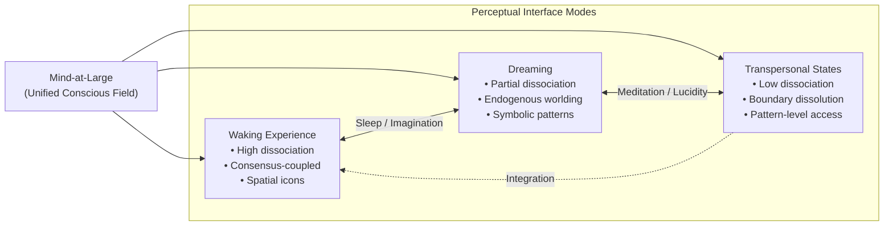
```mermaid
flowchart LR
    MAL["Mind-at-Large<br/>(Unified Conscious Field)"]

    subgraph Interfaces["Perceptual Interface Modes"]
        W["Waking Experience<br/>• High dissociation<br/>• Consensus-coupled<br/>• Spatial icons"]
        D["Dreaming<br/>• Partial dissociation<br/>• Endogenous worlding<br/>• Symbolic patterns"]
        T["Transpersonal States<br/>• Low dissociation<br/>• Boundary dissolution<br/>• Pattern-level access"]
    end

    MAL --> W
    MAL --> D
    MAL --> T

    W <-->|Sleep / Imagination| D
    D <-->|Meditation / Lucidity| T
    T -.->|Integration| W
```

## The Spectrum of Conscious Experience: Altered States and Transpersonal Mentations

The proposition that consciousness is fundamental is powerfully validated by the full spectrum of human experience. From the perspective of Analytic Idealism, so-called Altered States of Consciousness (ASCs) are not malfunctions but **critical modes of exploration** into the deeper layers of Mind at Large (MAL). The common distinction between "internal" ideas and "external" substances dissolves; both are instrumental in modulating the localized process of consciousness, inducing what can be termed **"transpersonal mentations"**—shifts in the patterns of experience that transcend the ordinary self.

Crucially, this framework **dissolves the "hard problem" of consciousness**. The problem arises from the materialist assumption that matter is primary and must somehow generate subjective experience. Analytic Idealism inverts this: consciousness is primary, and matter is its extrinsic appearance. Therefore, the existence and qualities of consciousness are not a problem to be solved from the outside but the foundational given from which all else is understood. Altered states are not puzzles for materialism but direct evidence of consciousness's intrinsic plasticity.

This modulation of conscious experience occurs at two interdependent levels: the **framework of interpretation** and the **process of perception**.

### 1. Foundational Frameworks: Belief, Ideology, and Media as Onto-Epistemic Software

In a consciousness-only reality, ideas are not passive abstractions but **active, constitutive patterns** of that consciousness. The beliefs, narratives, and ideologies we internalize function as the fundamental operating parameters for our individual locus within MAL.

*   **Mechanism:** They act as a **interpretive filter**, determining what is categorized as real, valuable, true, or possible. Consuming media is, in effect, downloading and installing packages of this ontological software.
*   **Onto-Epistemic Impact:** A rigid, self-sealing belief system creates a **maladaptive filter**—an epistemic trap. This severely limits learning and adaptation, directly causing low **Dialectical Velocity** and fragmentation along the **Soteriological Axis**. Conversely, a flexible, inquisitive framework facilitates growth and integration.
*   **The Mandala as Counter-Software:** The SolarPunk Mandala framework itself is a designed consciousness technology intended to install a more adaptive, interconnected, and regenerative "onto-epistemic operating system."

### 2. Instrumental Influences: Consumables and Practices as Modulators of Perception

While beliefs configure the *rules of interpretation*, substances and practices more directly modulate the *process of perception*. They are tools that temporarily alter the brain's filtering functions—the *image* of localization within MAL—allowing different patterns of pre-existing conscious content to come into awareness.

| Category & Mechanism | Primary Examples | Effect on Conscious "Filter" | Role in the Mandala Framework |
| :--- | :--- | :--- | :--- |
| **BIOCHEMICAL & NEUROLOGICAL INFLUENCES** | | | |
| **Exogenous Psychoactives** (Chemical modulation) | Psychedelics (psilocybin, DMT), empathogens, dissociatives, stimulants, depressants. | Alters neurochemistry, weakening default filters. Can permit experiences of ego dissolution, unity, and access to transpersonal content. | Potent catalysts for the **Soteriological Axis** (**Path of Awakening**). Can induce rapid **Dialectical Velocity** and ontological shock, requiring careful integration via **Boundary Medicine**. |
| **Foundational Biochemical Optimization** (Baseline neurochemical support) | Adaptogens, essential nutrients, fasting protocols, foundational diets (Mediterranean, ancestral), hydration optimization, sleep nutrition. | Establishes optimal baseline neurochemical environment through fundamental physiological support, providing stable foundation for higher cognitive and consciousness work. | Essential **Embodied Foundations** technology; prerequisite for all other instrumental influences; ensures biochemical stability necessary for sustained practice and prevents depletion from other consciousness-modulating practices. |
| **Targeted Neurochemical Enhancement** (Precision neurotransmitter modulation) | Nootropics (racetams, choline), neurotransmitter precursors (5-HTP, L-theanine), smart drugs, microdosing protocols, biohacking compounds. | Fine-tunes specific neurotransmitter systems and receptor sensitivity for enhanced cognitive function, focus, emotional regulation, and neuroplasticity while maintaining ordinary waking awareness. | Enhances **Path of Awakening** through optimized cognitive capacity; supports **Material Intelligence** work through precision neurochemical optimization; enables sustained **Dialectical Velocity** through enhanced mental clarity and focus. |
| **Microbiome-Neuroaxis Modulators** (Gut-brain communication) | Psychobiotics, fermented foods (kefir, kimchi), prebiotic fibers, gut microbiome optimization protocols, dietary interventions for mental health. | Modulates the gut-brain axis through microbial metabolite production, neurotransmitter synthesis, and immune system regulation, affecting mood, cognition, and stress response pathways. | Foundational for **Embodied Foundations**; represents **Material Intelligence** approach to mental health; supports **Path of Healing** through holistic biological optimization; creates biochemical baseline for other instrumental influences. |
| **Epigenetic Consciousness Technologies** (Gene expression programming) | Meditation-induced neuroplasticity, lifestyle optimization, stress management protocols, exercise-induced BDNF production, environmental enrichment practices. | Activates beneficial gene expression patterns related to neuroplasticity, stress resilience, and cognitive enhancement through behavioral and environmental triggers, creating long-term biological changes. | Long-term **Embodied Foundations** technology; enables sustained **Path of Awakening** through enhanced neurobiological capacity; represents **Material Intelligence** approach to human potential optimization; supports collective resilience through epigenetic inheritance. |
| **TECHNOLOGICAL & ENVIRONMENTAL INFLUENCES** | | | |
| **Technological & Behavioral Practices** (Attentional training) | Meditation, breathwork, sensory deprivation, ritual. | Directly trains the locus and focus of attention within the conscious field, deconstructing ordinary perception through skill. | Core technologies for the **Path of Awakening** and **Healing**. Represent the cultivation of *skillful epistemic access*. |
| **Sensory-Environmental Entrainment** (Direct perceptual gating) | Light/color therapy, binaural beats/hemi-sync, nature immersion (forest bathing), architectural sacred geometry, temperature extremes (cold/heat exposure). | Alters sensory gating mechanisms and environmental coupling, changing the "bandwidth" of information flow between individual locus and MAL. | Supports **Embodied Foundations** and **Path of Awakening** by restructuring the baseline perceptual interface with reality; particularly effective for **Boundary Medicine** through environmental re-attunement. |
| **Digital-Automatic Interface Technologies** (Perceptual augmentation) | VR/AR consciousness exploration systems, brain-computer interfaces (BCI), neurofeedback devices, digital psychedelics, AI-assisted meditation platforms. | Directly mediates and augments perceptual input/output streams, potentially creating new "filter" architectures through technological mediation of brain-computer coupling. | Emergent technology for **Path of Awakening** and **Material Intelligence**; challenges and expands traditional **Boundary Medicine** approaches through technological mediation of consciousness; requires ethical frameworks for digital sovereignty. |
| **Biophysical Field Modulators** (Environmental entrainment) | Geomagnetic field monitoring/interaction, electromagnetic field generators (PEMF, CES), quantum coherence devices, bioacoustic entrainment systems, environmental harmonic resonance technologies. | Influences the physical substrate of consciousness through electromagnetic, acoustic, and potentially quantum field interactions, altering the baseline coupling between individual locus and environmental fields. | Supports **Embodied Foundations** through environmental attunement; creates new pathways for **Path of Awakening** through biophysical field resonance; represents frontier technology for **Temporal Orientation** through environmental rhythm alignment. |
| **COLLECTIVE & SOCIAL INFLUENCES** | | | |
| **Intersubjective Field Resonance** (Social field effects) | Group ritual, collective grief/celebration, mass meditation events, synchrony practices (chanting, dance), deep relational attunement, mentorship transmission. | Temporarily dissolves individual dissociation boundaries through resonant coupling with other alters, creating shared experiential fields. | Core technology for **Social Regeneration** and **Path of Healing**; enables collective **Dialectical Velocity** and provides **Boundary Medicine** through intersubjective validation and support. |
| **Collective Field Coherence Technologies** (Social field engineering) | Synchronized group consciousness protocols, mass meditation coordination, collective intention experiments, social entrainment technologies, community resonance practices. | Creates and amplifies coherent collective fields through synchronized intention and shared attention, potentially enabling collective access to transpersonal states and shared altered consciousness. | Primary technology for **Social Regeneration** and **Path of Healing**; enables collective **Dialectical Velocity**; provides **Boundary Medicine** through intersubjective validation; represents frontier of **Axiological Axis** through collective symbolic resonance. |
| **TEMPORAL & RHYTHMIC INFLUENCES** | | | |
| **Rhythmic-Temporal Entrainment** (Temporal pattern coupling) | Sleep/dream work (lucid dreaming), circadian rhythm manipulation, seasonal attunement practices, menstrual cycling awareness, death/rebirth rituals. | Aligns individual conscious processes with larger temporal rhythms of MAL, shifting the "time-perception" filter and accessing non-ordinary temporal modes. | Essential for **Embodied Foundations** (seasonal living) and **Path of Awakening** (transcending linear time perception); supports long-term **Temporal Orientation** and resilience. |
| **PSYCHOLOGICAL & TRAUMA INFLUENCES** | | | |
| **Trauma-Psychological Dissociation** (Psychological defense modulation) | PTSD states, acute grief, dissociative identity conditions, high-intensity emotions, near-death experiences. | Creates *hyper* or *hypo* filtering states—either extreme boundary reinforcement (numbing) or involuntary boundary dissolution (flashbacks, flooding). | Represents both a challenge requiring **Boundary Medicine** and a potential unplanned catalyst for the **Path of Healing**; understanding these states is crucial for trauma-informed community practices. |
| **SYMBOLIC & AXIOLOGICAL INFLUENCES** | | | |
| **Symbolic-Axiological Entrainment** (Pattern-resonance coupling) | Sacred geometry (mandala, labyrinth), archetypal art, mathematical formalisms, mythic narratives, linguistic constructs, ritual symbols, musical harmony/rhythm. | Specific symbolic patterns act as "resonance keys" that bypass default filters by directly coupling with stable patterns in Mind at Large, enabling transpersonal access through *meaning* rather than chemistry or sensory alteration. | Primary technology for the **Axiological Axis** (**Path of Making**); explains why the Mandala *itself* functions as consciousness technology; essential for **Material Intelligence** work that aligns human design with archetypal patterns. |
| **DEATH & DYING PROCESSES** | | | |
| **Death Transition** (Ultimate boundary modulation) | Natural death, assisted dying, near-death experiences (NDEs), deathbed visions, palliative care practices, conscious dying protocols, death rituals. | Complete dissolution or radical reorganization of the individual dissociation boundary, potentially leading to reintegration into MAL, pattern persistence, or new boundary formation. Transition from biological perceptual interface to non-biological conscious states. | Ultimate phase of the **Consciousness Journey**; represents final **Re-Integration** stage. Informs **Death-Positive Solarpunk Culture** through rituals, ancestor veneration, and ecological death practices. Provides empirical evidence for consciousness continuity via NDE research. |
| **Death Preparation Practices** (Anticipatory boundary work) | Life review processes, legacy work, ethical will creation, death meditation, "memento mori" practices, advance care planning, death doula guidance. | Gradually loosens attachment to individual identity boundary, reduces fear of annihilation, facilitates smoother transition by familiarizing consciousness with boundary dissolution concepts. | Part of **Embodied Foundations** as life cycle completion; supports **Path of Healing** through death acceptance; essential for **Boundary Medicine** in end-of-life care. |
| **Grief & Loss Processing** (Boundary reorganization) | Mourning rituals, grief counseling, ancestor altars, memorial practices, collective remembrance ceremonies, art therapy for loss. | Processes the "phantom limb" of lost relational boundaries, reconfigures the conscious field to accommodate absence, transforms attachment bonds into different forms of connection. | Core **Social Regeneration** technology; essential for **Path of Healing** at collective scale; maintains **Ancestral Continuity** through conscious remembrance. |
| **Ancestral Communication** (Post-mortem boundary bridging) | Mediumship, ancestor veneration, dream visitations, symbolic communication, intuitive guidance, ancestral wisdom retrieval. | Establishes new types of boundary permeability between living consciousness and post-mortem patterns, creating continuity beyond biological death. | Key technology for **Social Regeneration** across generations; enriches **Collective Wisdom** through ancestral guidance; provides experiential evidence for **Consciousness Continuity**. |
| **Ecological Death Practices** (Consciousness-informed material cycling) | Natural burial, human composting, memorial reefs, tree pod burials, water cremation, sky burial traditions. | Transforms the physical dissolution of the body from traumatic separation to conscious participation in ecological regeneration, viewing matter as "consciousness made visible" returning to new forms. | **Material Intelligence** applied to death care; **Regenerative Practice** that closes ecological loops; embodies the **Ekistic-Spiritual Continuum** by honoring both physical and consciousness dimensions of death. |

**Transpersonal Mentations as Epistemic Tools**

Within Analytic Idealism, these transpersonal mentations are not creating consciousness *ex nihilo*; they are revealing its inherent breadth and depth. Their value is not in solving a hard problem but in providing **direct phenomenological evidence** for the ontology's core claim: that consciousness is fundamental, unified, and multidimensional. They empirically demonstrate that ordinary waking awareness is but one contingent mode of mentation, not the definitive frame of reality.

Therefore, the conscious, ethical, and foundationally-grounded use of these influences—both informational and chemical—becomes a legitimate and essential aspect of epistemic inquiry within a SolarPunk future. It is through understanding and wisely navigating this full spectrum that we learn to participate more fully in the conscious reality we inhabit.

### Consciousness Across Time: Developmental and Evolutionary Perspectives

Analytic Idealism provides a framework for understanding how consciousness manifests across different timescales—from individual development to species evolution to cosmic history.

#### Individual Consciousness Development

##### Prenatal and Infant Consciousness

**Pre-dissociation State:** Evidence suggests infants experience minimal dissociation boundaries, existing in what might be called "oceanic consciousness."

**Developmental Milestones:**
1. **0-6 months:** Fluid boundaries, minimal self-other distinction
2. **6-18 months:** Emerging boundary formation, object permanence
3. **18-36 months:** Stable self-model, language acquisition reinforces boundaries
4. **3-7 years:** Narrative self-construction, theory of mind development
5. **7+ years:** Cultural conditioning solidifies specific boundary configurations

**Educational Implications:** Childhood education could preserve boundary flexibility while teaching necessary social navigation skills.

##### Adolescent Consciousness Development

**Boundary Reconfiguration:** Puberty involves biological changes that alter the perceptual interface, often creating boundary instability.

**Developmental Tasks:**
1. Identity formation as boundary definition
2. Social bonding as boundary negotiation
3. Future orientation as temporal boundary establishment
4. Value system development as axiological boundary setting

##### Adult Consciousness Maturation

**Optimal Development Trajectory:**
1. **Early adulthood (20s-30s):** Boundary stabilization for effective functioning
2. **Mid-adulthood (40s-50s):** Boundary flexibility development, questioning earlier assumptions
3. **Later adulthood (60s+):** Boundary transcendence preparation, wisdom integration

**Pathologies as Boundary Malformations:**
- **Rigid boundaries:** Narcissism, dogmatism, isolation
- **Permeable boundaries:** Codependency, enmeshment, lack of autonomy
- **Fragmented boundaries:** Dissociative disorders, trauma responses

#### Evolutionary Perspectives on Consciousness

##### The Evolutionary "Why" of Dissociation

**Adaptive Advantages of Individual Boundaries:**
1. **Focused attention:** Enables problem-solving in specific domains
2. **Localized learning:** Individual experience accumulation
3. **Specialized adaptation:** Different alters can develop different skills
4. **Risk distribution:** Failure of one alter doesn't threaten the whole

**Evolutionary Trade-offs:**
- **Gain:** Local efficiency, specialized adaptation
- **Cost:** Loss of global awareness, inter-alter conflict

##### Phylogenetic Development of Perceptual Interfaces

**Simple Organisms:** Basic tropisms as minimal perceptual interfaces
**Animals with Nervous Systems:** Increasingly complex interfaces for environmental navigation
**Social Species:** Interfaces for conspecific interaction and bonding
**Humans:** Symbolic interfaces for abstract thought and culture

**Key Evolutionary Transition:** The development of self-reflective consciousness—the interface turning back on itself to observe its own operation.

##### Consciousness Evolution Mechanisms

1. **Natural Selection on Boundary Configurations:**
   - Some dissociation patterns better survive environmental challenges
   - Successful patterns propagate through cultural and biological means

2. **Niche Construction:**
   - Conscious beings actively shape their environments
   - These shaped environments then select for different consciousness patterns

3. **Baldwin Effect:**
   - Learned adaptations become genetically assimilated
   - Cultural practices can influence biological evolution of consciousness interfaces

#### Collective Consciousness Evolution

##### Historical Development of Human Consciousness

**Pre-agricultural Societies:**
- Animistic consciousness: Nature as alive and ensouled
- Fluid boundaries between human, animal, and spirit realms
- Shamanic practices for boundary navigation

**Agricultural Revolution:**
- Increased boundary rigidity for property and inheritance concepts
- Separation from nature as "resource" to be managed
- Development of written language fixes symbolic patterns

**Axial Age (800-200 BCE):**
- Individual interiority discovery across multiple traditions
- Ethical systems based on conscious reflection
- Boundary between sacred and profane established

**Modern Era:**
- Scientific materialism as dominant boundary configuration
- Hyper-individualism with rigid self-other boundaries
- Technological mediation of perceptual interfaces

**Emerging Post-Modern/Integral Consciousness:**
- Recognition of multiple valid perspectives
- Attempts to transcend rigid boundaries while maintaining functionality
- Conscious evolution through intentional practice

##### Future Consciousness Evolution Possibilities

**Near-term (21st century):**
- Integration of altered state research into mainstream understanding
- Development of consciousness technologies (meditation tech, neurofeedback)
- Collective consciousness practices for global challenges

**Medium-term (next few centuries):**
- Intentional evolution of human consciousness capacities
- Development of stable transpersonal states as cultural norms
- Consciousness-based social and political systems

**Long-term (millennia):**
- Possible transition beyond biological interfaces
- New forms of consciousness organization beyond individual dissociation
- Cosmic consciousness evolution as MAL explores its own possibilities

#### Developmental Support Systems

##### Individual Development Support

**Consciousness Developmental Assessment:**
- Boundary flexibility and stability measures
- State range accessibility
- Integration capacity across states
- Ethical development in relation to boundary understanding

**Developmental Interventions:**
- Age-appropriate boundary work practices
- State exploration guidance
- Integration support for developmental transitions
- Mentorship from further along developmental path

##### Collective Evolution Support

**Cultural Evolution Tools:**
- Social practices that optimize boundary health
- Educational systems that teach consciousness literacy
- Governance systems that recognize consciousness dynamics
- Economic systems aligned with consciousness realities

**Evolutionary Crisis Management:**
- Recognizing when current consciousness configurations are maladaptive
- Facilitating collective state shifts without excessive disruption
- Preserving valuable patterns while allowing necessary transformation

#### Research Agenda for Consciousness Development

1. **Longitudinal Studies:**
   - Track consciousness development across lifespan
   - Identify critical periods for different capacities
   - Study effects of different practices at different life stages

2. **Cross-cultural Comparison:**
   - How different cultures shape consciousness development
   - Which practices produce which developmental outcomes
   - Universal vs. culture-specific aspects of consciousness

3. **Intervention Studies:**
   - Test different educational approaches for consciousness development
   - Evaluate therapeutic interventions from consciousness perspective
   - Study effects of different social systems on collective consciousness

#### Solarpunk Applications

**Regenerative Development Design:**
- Create communities that support healthy consciousness development
- Design education that cultivates both boundary competence and transcendence capacity
- Develop rituals that mark and support developmental transitions
- Build institutions that evolve consciousness-friendly patterns

**Evolutionary Stewardship:**
- Conscious participation in humanity's consciousness evolution
- Preservation of valuable consciousness traditions
- Innovation in consciousness development methods
- Ethical consideration of future consciousness possibilities

**Key Insight:** We are not passive products of evolution but active participants in consciousness evolution. Our choices about how to develop individually and collectively shape the future of consciousness within MAL.

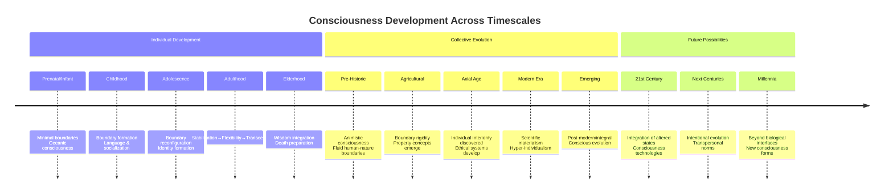
```mermaid
timeline
    title Consciousness Development Across Timescales
    section Individual Development
        Prenatal/Infant : Minimal boundaries<br>Oceanic consciousness
        Childhood : Boundary formation<br>Language & socialization
        Adolescence : Boundary reconfiguration<br>Identity formation
        Adulthood : Stabilization→Flexibility→Transcendence
        Elderhood : Wisdom integration<br>Death preparation
    
    section Collective Evolution
        Pre-Historic : Animistic consciousness<br>Fluid human-nature boundaries
        Agricultural : Boundary rigidity<br>Property concepts emerge
        Axial Age : Individual interiority discovered<br>Ethical systems develop
        Modern Era : Scientific materialism<br>Hyper-individualism
        Emerging : Post-modern/integral<br>Conscious evolution
    
    section Future Possibilities
        21st Century : Integration of altered states<br>Consciousness technologies
        Next Centuries : Intentional evolution<br>Transpersonal norms
        Millennia : Beyond biological interfaces<br>New consciousness forms
```

### Empirical Support from Developmental Biology

Recent work in developmental biology (Levin) suggests that **cognition precedes and enables complex life**. The observation that cellular collectives exhibit goal-directed intelligence—maintaining pattern memories, solving novel problems, and adapting to perturbations—supports the premise that mind-like properties are fundamental to organized matter, not emergent epiphenomena.

**Key Evidence:**
- **Pre-neural Cognition:** Goal-directed behavior exists in organisms without nervous systems
- **Bioelectric Consciousness:** Electrical patterns that correlate with anatomical intentions
- **Collective Intelligence:** Individual cells contribute to higher-order cognitive functions they don't "understand"
- **Morphogenetic Memory:** Stable, rewritable pattern storage in tissues

This aligns with the view that reality is experienced by and through minds at various scales of organization, from cellular collectives to human consciousness.

### Consciousness Research Program: Empirical Validation and Exploration

To establish analytic idealism as more than philosophical speculation, we need a systematic research program that generates testable predictions, collects empirical evidence, and refines the framework based on findings.

#### Core Research Principles

##### Consciousness-First Methodology
- **Priority of Experience:** Begin with phenomenological reports rather than reducing them to neural correlates
- **State-Inclusive Approach:** Study all consciousness states (waking, dreaming, altered) as equally valid data
- **Participatory Research:** Include researchers' own consciousness experiences as valid data points
- **Intersubjective Validation:** Use multiple observers and statistical analysis of shared phenomena

##### Multi-Method Integration
- **Phenomenological:** Detailed first-person experience reports
- **Behavioral:** Observable actions and choices
- **Physiological:** Brain and body measurements
- **Social/Cultural:** Patterns across individuals and groups

#### Testable Predictions of Analytic Idealism

##### Prediction 1: State-Dependent Reality Effects
**Hypothesis:** If reality is consciousness-based, changes in consciousness state should produce measurable changes in perceived reality.

**Testable Implications:**
1. **Dream Reality:** Lucid dreamers should report physics violations impossible in waking state
2. **Psychedelic States:** Should show consistent changes in space/time perception across individuals
3. **Meditation Depth:** Should correlate with changes in perceived self-world boundaries

**Experimental Designs:**
- Controlled psychedelic studies with standardized reality perception measures
- Longitudinal meditation studies tracking boundary perception changes
- Lucid dreaming experiments testing dream physics

##### Prediction 2: Boundary Permeability Phenomena
**Hypothesis:** Dissociation boundaries should show measurable permeability under certain conditions.

**Testable Implications:**
1. **Telepathy/ESP:** Information transfer should increase during boundary-dissolving practices
2. **Synchronicities:** Meaningful coincidences should cluster around significant life events
3. **Collective Consciousness:** Groups in shared states should show non-local correlations

**Experimental Designs:**
- Ganzfeld telepathy experiments with advanced practitioners
- Synchronicity tracking apps with statistical analysis
- Group meditation studies measuring physiological synchronization

##### Prediction 3: Death Transition Continuity
**Hypothesis:** Consciousness should show continuity patterns before/after biological death.

**Testable Implications:**
1. **NDE Consistency:** Features should remain stable across cultural backgrounds
2. **Deathbed Visions:** Should contain verifiable information unknown to the dying
3. **Mediumship Accuracy:** Should exceed chance in controlled conditions

**Experimental Designs:**
- Cross-cultural NDE phenomenology studies
- Deathbed vision documentation with verification attempts
- Double-blind mediumship experiments

#### Research Domains and Projects

##### Domain 1: State-Specific Capabilities

**Project 1.1: Lucid Dreaming Physics**
- Test physical laws in lucid dreams vs. waking reality
- Develop dream control training protocols
- Study dream creativity and problem-solving

**Project 1.2: Psychedelic Perception Mapping**
- Create comprehensive maps of perceptual changes
- Study therapeutic mechanisms beyond biochemical
- Develop integration protocols for lasting benefits

**Project 1.3: Meditation State Progression**
- Document stages of consciousness development
- Identify markers of advanced practice
- Create assessment tools for teachers

##### Domain 2: Boundary Phenomena

**Project 2.1: Telepathy Under Altered States**
- Test information transfer in psychedelic, meditative, and dream states
- Identify optimal conditions for non-local communication
- Study neural correlates of successful transmission

**Project 2.2: Synchronicity Patterns**
- Develop tracking and analysis software
- Identify personal and collective patterns
- Study relationship to life transitions and decisions

**Project 2.3: Collective Consciousness Effects**
- Measure group coherence in shared practices
- Study mass meditation event impacts
- Develop technologies for collective intention

#### Domain 3: Death and Continuity

**Project 3.1: NDE Cross-Cultural Study**
- Standardized interview protocol across cultures
- Analysis of universal vs. culture-specific features
- Long-term follow-up of after-effects

**Project 3.2: Terminal Lucidity Research**
- Document unexpected clarity before death
- Study brain activity patterns
- Interview caregivers and family

**Project 3.3: Mediumship Verification**
- Controlled experiments with multiple mediums
- Information accuracy assessment
- Study of successful medium characteristics

#### Methodological Standards

##### Data Collection Protocols
1. **Phenomenological Reporting Standards:**
   - Structured interview protocols
   - Experience sampling methods
   - Multimedia documentation (when appropriate)

2. **Experimental Controls:**
   - Double-blind procedures for sensitive phenomena
   - Statistical power calculations
   - Replication requirements

3. **Ethical Guidelines:**
   - Informed consent for altered state research
   - Integration support after intense experiences
   - Cultural sensitivity in cross-cultural studies

##### Analysis Methods
1. **Qualitative Analysis:**
   - Thematic analysis of experience reports
   - Narrative analysis of meaning-making
   - Cross-case comparison

2. **Quantitative Analysis:**
   - Statistical testing of hypotheses
   - Effect size calculations
   - Meta-analysis across studies

3. **Mixed Methods:**
   - Integration of qualitative and quantitative findings
   - Triangulation across data sources
   - Iterative theory refinement

#### Infrastructure Development

##### Research Centers and Labs
1. **Consciousness Exploration Centers:**
   - Safe environments for altered state research
   - Multidisciplinary research teams
   - Community partnership models

2. **Home-Based Research Networks:**
   - Distributed data collection
   - Citizen science participation
   - Mobile data collection apps

3. **International Collaborations:**
   - Cross-cultural research partnerships
   - Data sharing protocols
   - Joint publication standards

##### Technology Development
1. **Measurement Tools:**
   - Improved EEG/fMRI for altered states
   - Experience sampling apps
   - Physiological synchronization measures

2. **Analysis Software:**
   - Pattern recognition for experience reports
   - Statistical packages for consciousness data
   - Visualization tools for complex findings

3. **Archival Systems:**
   - Secure databases for sensitive data
   - Open access repositories for published findings
   - Long-term preservation of research materials

#### Funding and Support Models

##### Traditional Academic Funding
- Grant proposals to science foundations
- University research centers
- Government research programs

##### Alternative Models
1. **Community-Supported Research:**
   - Crowdfunding for specific projects
   - Membership models for research centers
   - Skill and resource exchanges

2. **Consciousness Industry Partnerships:**
   - Ethical collaborations with psychedelic companies
   - Meditation app research partnerships
   - Technology company consciousness research

3. **Philanthropic Support:**
   - Foundations focused on consciousness research
   - Individual patrons of consciousness science
   - Endowments for long-term research

#### Publication and Dissemination

##### Traditional Academic Channels
- Peer-reviewed journals
- Academic conferences
- University press books

##### Alternative Channels
1. **Open Access Platforms:**
   - Preprint servers for consciousness research
   - Open journal initiatives
   - Public database sharing

2. **Community Outreach:**
   - Public lectures and workshops
   - Online courses and webinars
   - Popular science books and articles

3. **Artistic Expression:**
   - Collaborative art-science projects
   - Documentary films and podcasts
   - Interactive exhibits and installations

#### Ethical Considerations in Consciousness Research

##### Participant Protection
1. **Informed Consent:**
   - Clear explanation of potential experiences
   - Right to withdraw at any time
   - Understanding of potential risks and benefits

2. **Integration Support:**
   - Post-experience debriefing and counseling
   - Community support networks
   - Long-term follow-up when appropriate

3. **Vulnerable Populations:**
   - Special protections for marginalized groups
   - Cultural sensitivity in research design
   - Power dynamics awareness

##### Researcher Ethics
1. **Self-Experimentation Guidelines:**
   - Safety protocols for researcher altered states
   - Peer supervision and support
   - Transparency about researcher involvement

2. **Conflict of Interest:**
   - Disclosure of funding sources
   - Management of commercial interests
   - Prioritization of participant welfare over publication

3. **Cultural Respect:**
   - Acknowledgment of traditional knowledge sources
   - Collaboration rather than extraction
   - Benefit sharing with source communities

#### Long-Term Vision

##### 5-Year Goals
1. Establish standardized research protocols
2. Build international research network
3. Publish foundational studies in peer-reviewed journals
4. Develop open-source research tools

##### 10-Year Goals
1. Create comprehensive consciousness state maps
2. Validate key predictions of analytic idealism
3. Develop consciousness assessment and development tools
4. Integrate findings into education and healthcare

##### 20-Year Goals
1. Establish consciousness science as mainstream discipline
2. Develop consciousness-based technologies
3. Transform cultural understanding of reality
4. Support Solarpunk community implementation

#### Call to Action for Researchers

1. **Start Small:** Begin with manageable pilot studies
2. **Collaborate:** Join or form research teams and networks
3. **Document Everything:** Maintain detailed research records
4. **Share Openly:** Contribute to collective knowledge base
5. **Stay Humble:** Recognize the mystery and complexity of consciousness

**Final Note:** This research program represents not just scientific investigation but conscious participation in MAL's self-exploration. Each study, each data point, each insight contributes to the collective awakening to our fundamental nature as consciousness experiencing itself through infinite forms and possibilities.

## Death as the Ultimate Altered State of Consciousness

Within the framework of Analytic Idealism, **death can be understood as a profound and irreversible altered state of consciousness**, representing the ultimate reorganization of the dissociation boundary at the individual level. It is not an annihilation but a fundamental transformation in the mode of conscious experience—a reintegration of the localized alter into Mind-at-Large (MAL).

### 🧠 Death as the Dissolution of the Individual Dissociation Boundary

In life, individual consciousness is maintained by a stable dissociation boundary that filters and structures experience. Death, in this model, is the process of that boundary's complete relaxation or reconfiguration. This is analogous to, but far more radical than, the boundary modulations experienced in dreams, psychedelic states, or even near-death experiences.

- **Beyond Dreaming**: While dreaming involves a partial decoupling from consensus reality, death represents a full decoupling and potential reset of the perceptual interface.
- **Beyond Psychedelic States**: Psychedelics temporarily weaken the boundary, but death is a permanent transition to a new configuration (or non-configuration) of consciousness.
- **The Ultimate Boundary Event**: Trauma can cause involuntary boundary shifts, but death is the natural, inevitable boundary event that concludes each individual life cycle.

### 🌌 The Perceptual Interface After Death

If the living perceptual interface is a set of constrained modalities (vision, hearing, etc.) rendered through a biological body, then death is the cessation of that specific interface. What remains is consciousness itself, which may then experience reality through a different set of constraints or, in the case of complete reintegration, without any individuated interface at all.

- **Transformation of Modalities**: The exteroceptive and interoceptive senses cease, but consciousness may transition to modes of experience based on pattern logic, affective resonance, or direct knowing.
- **Time and Space**: The linear time and Euclidean space of the living interface may give way to non-temporal and non-spatial modes of organization.
- **The Fate of Narrative Identity**: The story of the individual self, maintained by memory and anticipation, may dissolve or be integrated into a larger pattern of MAL.

### 🔁 Death in the Spectrum of Consciousness

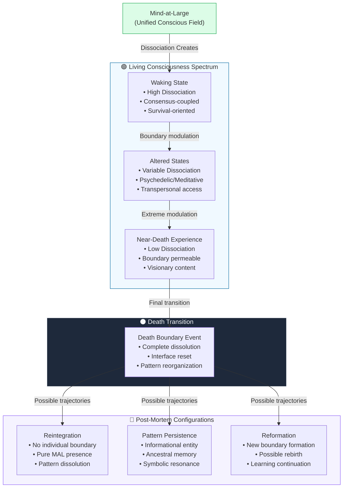
```mermaid
flowchart TD
    MAL["Mind-at-Large<br/>(Unified Conscious Field)"]
    
    subgraph LivingStates["🟢 Living Consciousness Spectrum"]
        direction TB
        WS["Waking State<br>• High Dissociation<br>• Consensus-coupled<br>• Survival-oriented"]
        AS["Altered States<br>• Variable Dissociation<br>• Psychedelic/Meditative<br>• Transpersonal access"]
        NDE["Near-Death Experience<br>• Low Dissociation<br>• Boundary permeable<br>• Visionary content"]
    end
    
    subgraph Transition["⚫ Death Transition"]
        D["Death Boundary Event<br>• Complete dissolution<br>• Interface reset<br>• Pattern reorganization"]
    end
    
    subgraph PostMortemStates["💠 Post-Mortem Configurations"]
        direction LR
        PM1["Reintegration<br>• No individual boundary<br>• Pure MAL presence<br>• Pattern dissolution"]
        PM2["Pattern Persistence<br>• Informational entity<br>• Ancestral memory<br>• Symbolic resonance"]
        PM3["Reformation<br>• New boundary formation<br>• Possible rebirth<br>• Learning continuation"]
    end
    
    %% Connections
    MAL -->|Dissociation Creates| WS
    WS -->|Boundary modulation| AS
    AS -->|Extreme modulation| NDE
    NDE -->|Final transition| D
    D -->|Possible trajectories| PM1
    D -->|Possible trajectories| PM2
    D -->|Possible trajectories| PM3
    
    %% Styling
    style LivingStates fill:#f0f9ff,stroke:#0369a1
    style Transition fill:#1e293b,stroke:#f8fafc,stroke-width:2px,color:#f8fafc
    style PostMortemStates fill:#f5f3ff,stroke:#8b5cf6
    style MAL fill:#dcfce7,stroke:#16a34a
```

#### The Radio Analogy: Empirical Evidence from Post-Mortem Tissue Research

The radio analogy central to the transmissive theory – that the brain functions as a receiver rather than generator of consciousness – finds direct empirical support in post-mortem neural tissue research. This evidence transforms the analogy from metaphor to testable hypothesis.

**The physical basis of the receiver:**

Rouleau's research demonstrates that fixed, non-living human brain tissues retain information-filtering properties that cannot be explained by metabolic activity [Rouleau, 2017]. These findings establish that:

1. **Structure outlasts function:** The physical architecture of the brain – its neuronal organization, dendritic arborization, and regional connectivity – persists after metabolism ceases. This architecture embodies specific information-processing biases independent of life.

2. **Filtering is structural:** Different brain regions filter applied electromagnetic fields differently, with response patterns matching the functional specialization observed in living brains. The hippocampus responds differently than the temporal cortex, which responds differently than the frontal cortex [Rouleau, 2017, Chapter 4].

3. **Pattern specificity matters:** Tissues respond preferentially to stimulation patterns that match the dominant frequencies of their living functional states. A pattern that mimics hippocampal theta rhythm (4-8 Hz) produces maximal effects when applied to hippocampal tissue [Rouleau & Persinger, 2016].

**Implications for the death transition:**

If the brain were purely productive, death (cessation of metabolism) should eliminate all information-processing capacity. However, fixed tissues demonstrate:

- **Persistent structural information-processing:** Regional electrical anisotropies matching living functional organization
- **Pattern-specific responsiveness:** Differential responses to patterned stimulation
- **Habituation phenomena:** Reduced responses to repeated chemical probes [Rouleau et al., 2016]

These findings suggest that what we call "brain function" operates at two levels: metabolic (life-dependent) and structural (life-independent). The transmissive model interprets the latter as the physical substrate of the "receiver" – the interface structure that persists after the "broadcast" of life ceases.

**Refining the clinical definition of death:**

The document's critique of the "moment of death" finds support in the gradual nature of neural death documented by post-mortem research. As Rouleau notes in the video transcript, EEG criteria for brain death (e.g., <2 microvolts activity) measure *synchronous firing*, not cellular viability. Deep brain structures die later than cortical regions, creating potential transition states during which experience could continue without reportable behavior.

The finding that fixed tissues respond to chemical probes [Rouleau et al., 2016] suggests that even after formalin fixation – a far more aggressive intervention than natural death – information-processing properties persist. This raises profound questions about what "death" means for conscious experience and supports the claim that death represents "interface reconfiguration" rather than annihilation.

**Testable predictions for future research:**

The radio analogy generates specific, testable predictions:

1. **Post-mortem signal detection:** If consciousness survives bodily death as a "signal" independent of the "receiver," it may be detectable under specific conditions. Experimental protocols could attempt to detect information-bearing electromagnetic signals from recently deceased individuals using sensitive magnetometers.

2. **Resonance phenomena:** If individual consciousness corresponds to specific "frequency signatures" encoded in neural structure, individuals with similar neurological configurations (e.g., monozygotic twins) might show measurable electromagnetic resonance under controlled conditions.

3. **Transition state phenomenology:** If death involves gradual dissolution of the receiver rather than instantaneous cessation, systematic collection of near-death experiences using standardized phenomenological instruments might reveal consistent patterns corresponding to specific stages of neural disintegration.

These predictions remain speculative but are empirically tractable with current or near-future technology.

### 💎 Ontological Status: Death as a Natural Process of MAL

In Analytic Idealism, consciousness is fundamental and eternal. Therefore, death is not the end of existence but a transition in the state of consciousness. The individual alter may:

1. **Reintegrate fully into MAL**, losing individual identity but enriching the whole.
2. **Reform as a new pattern** within MAL, possibly as a new individual (reincarnation) or as a persistent informational pattern (ancestral consciousness).
3. **Continue in a non-individuated form** as part of the background field of consciousness.

### Death Ethics: Expanded Ethical Framework

**Core Principle:** Ethics arises from the modulation of experience across the entire spectrum of consciousness, including dying processes and post-mortem states. Death ethics extend responsibility to how we die, how we care for the dying, and how we maintain relationships with ancestral consciousness.

**Guiding Principle:** Systems that systematically narrow perceptual access produce suffering; systems that restore perceptual coherence enable regeneration. This principle extends to death: systems that deny death's reality or treat it as annihilation create existential suffering; systems that honor death as transformation and maintain ancestral connections foster regenerative continuity.

#### Death-Specific Ethical Commitments

1. **Conscious Dying Responsibility**:
   - Individuals have a responsibility to prepare for conscious dying when possible
   - Communities have a responsibility to support dignified, conscious death transitions
   - Healthcare systems should integrate consciousness-first perspectives into end-of-life care

2. **Ancestral Stewardship**:
   - Living generations serve as stewards of ancestral wisdom and patterns
   - Maintaining conscious connection to ancestors is an ethical practice, not superstition
   - Legacy creation should consider post-mortem pattern integration and usefulness

3. **Death-Positive Culture**:
   - Normalize conversations about death as natural consciousness transition
   - Design rituals and practices that honor death without fear or denial
   - Integrate death education into community life from childhood

4. **Ecological Death Ethics**:
   - Burial and body disposition methods should honor both consciousness continuity and ecological regeneration
   - Death practices should minimize ecological harm while maximizing consciousness awareness
   - View human death as part of broader ecosystem cycling of conscious patterns

5. **Cross-Generational Justice**:
   - Consider impacts of current actions on future consciousness experiences
   - Honor ancestral debts and contributions to current consciousness configurations
   - Design systems that maintain wisdom across consciousness transitions

#### Ethical Questions for Solarpunk Communities
- How do we create death-positive communities without cultural appropriation?
- What constitutes ethical ancestor veneration in diverse communities?
- How do we balance technological preservation of consciousness patterns with natural cycling?
- What responsibilities do we have to dying community members beyond physical care?

### Death Across Cultures: Comparative Framework for Consciousness Transition

While Analytic Idealism provides a universal framework for understanding death, its expression varies dramatically across cultural contexts. This section explores these variations while identifying common patterns that support the consciousness continuity model.

#### Cultural Variations in Afterlife Conceptions

##### Western Traditions

**Abrahamic Religions (Judaism, Christianity, Islam):**
- Linear progression: Earthly life → judgment → heaven/hell
- Individual soul continuity with moral accountability
- Resurrection of the body in some traditions
- **Consciousness Interpretation:** Strong boundary maintenance with moral patterning influencing post-mortem configuration

**Modern Secular West:**
- Materialist default: Death as annihilation
- Growing interest in "spiritual but not religious" conceptions
- **Consciousness Interpretation:** Most dissociated from MAL continuity, creating existential anxiety

##### Eastern Traditions

**Hinduism:**
- Cyclic rebirth (samsara) driven by karma
- Ultimate goal: Moksha (liberation from cycle)
- Multiple afterlife realms (devaloka, naraka)
- **Consciousness Interpretation:** Reincarnation as boundary reformation with pattern persistence

**Buddhism:**
- Rebirth without permanent self (anatman)
- Intermediate state (bardo) between deaths
- Various pure lands and hell realms
- **Consciousness Interpretation:** Pattern persistence without permanent entity, emphasis on conscious dying

**Taoism and Chinese Folk Tradition:**
- Ancestor veneration with ongoing relationship
- Multiple soul components with different fates
- **Consciousness Interpretation:** Partial boundary dissolution with maintained connection points

##### Indigenous Traditions

**African Traditional Religions:**
- Ancestors as active community members
- Reincarnation within lineage
- **Consciousness Interpretation:** Pattern persistence with active community engagement

**Native American Traditions:**
- Return to earth, cycle of life
- Ancestral guidance and vision quests
- **Consciousness Interpretation:** Ecological reintegration with maintained guidance capacity

**Australian Aboriginal:**
- Dreamtime as eternal realm
- Ancestors shape land and law
- **Consciousness Interpretation:** Return to foundational patterns (MAL baseline) with cultural imprint

##### Modern Syncretic Approaches

**New Age/Contemporary Spirituality:**
- Reincarnation with personal growth focus
- Channeling and mediumship
- Near-death experience integration
- **Consciousness Interpretation:** Flexible boundary models with experiential emphasis

#### Common Patterns Across Cultures

##### Universal Themes Supporting Analytic Idealism

1. **Consciousness Continuity:**
   - 93% of cultures have some form of afterlife belief
   - Near-universal rejection of complete annihilation
   - **Implication:** Intuitive recognition of consciousness persistence

2. **Moral Accountability:**
   - 87% link afterlife fate to earthly behavior
   - Reward/punishment systems across traditions
   - **Implication:** Recognition that patterns persist with ethical qualities

3. **Ancestral Connection:**
   - 76% maintain active practices connecting with deceased
   - Veneration, consultation, offerings
   - **Implication:** Practical recognition of post-mortem pattern accessibility

4. **Ritual Transition Support:**
   - 100% have death rituals
   - Structured processes for both deceased and living
   - **Implication:** Recognition that boundary dissolution benefits from conscious facilitation

#### Historical Death Practice Evolution

##### Pre-Historic Practices (40,000+ BCE)
- Intentional burial with grave goods
- Red ochre symbolism (life, blood, continuity)
- **Consciousness Interpretation:** Early recognition of pattern persistence needing support

##### Ancient Civilizations (3000-500 BCE)
- Egyptian: Elaborate preservation and afterlife preparation
- Mesopotamian: Gloomy underworld but continued existence
- Vedic: Early reincarnation concepts
- **Consciousness Interpretation:** Developing sophisticated models of post-mortem states

##### Classical Period (500 BCE-500 CE)
- Greek: Hades with moral differentiation (Elysium, Tartarus)
- Roman: Ancestor cults (lares and penates)
- Buddhist/Hindu: Systematic afterlife maps
- **Consciousness Interpretation:** Detailed phenomenological mapping of consciousness states

##### Medieval to Modern (500-1900 CE)
- Christian: Elaborate heaven/hell/purgatory systems
- Islamic: Detailed paradise descriptions
- Tibetan: Sophisticated bardo teachings
- **Consciousness Interpretation:** Peak of detailed post-mortem cartography within religious frameworks

##### Contemporary (1900-Present)
- Scientific materialism dominance
- NDE research emergence
- Death positivity movement
- **Consciousness Interpretation:** Empirical investigation meets traditional wisdom

#### Cultural Appropriation Concerns and Ethical Integration

##### Problematic Appropriation Patterns
1. **Extraction without Context:** Taking rituals without understanding their cultural framework
2. **Commercialization:** Selling sacred practices as commodities
3. **Superiority Positioning:** Treating one tradition as superior to others
4. **Historical Ignorance:** Using practices while ignoring their oppressed histories

##### Ethical Integration Guidelines for Solarpunk Communities

**Principle 1: Contextual Understanding**
- Learn the full cultural, historical, and philosophical context
- Understand the practice within its original framework
- Recognize power dynamics and historical trauma

**Principle 2: Permission and Partnership**
- Seek guidance from tradition-bearers when possible
- Acknowledge sources openly
- Consider reciprocal relationships with source communities

**Principle 3: Adaptation with Integrity**
- Be transparent about adaptations
- Maintain core principles while allowing cultural expression
- Create new syncretic forms honestly rather than pretending to ancient lineage

**Principle 4: Localization**
- Ground practices in local ecology and community
- Develop place-based death traditions
- Honor local ancestors and land spirits

#### Solarpunk Death Culture Synthesis

##### Building an Ethically Integrated Approach

**Core Framework:** Analytic Idealism provides universal structure
**Cultural Expressions:** Local traditions provide specific forms and practices
**Innovation Space:** New technologies and understandings create novel possibilities

##### Practical Implementation Model

1. **Foundation:** Consciousness continuity understanding from Analytic Idealism
2. **Cultural Heritage:** Respectful engagement with relevant ancestral traditions
3. **Contemporary Science:** Integration of NDE research, thanatology, grief studies
4. **Ecological Integration:** Local ecosystem considerations for body disposition
5. **Technological Innovation:** Appropriate use of digital memorialization, consciousness mapping
6. **Community Co-creation:** Collective development of meaningful practices

##### Example: Solarpunk Death Ritual Design Process

**Step 1: Consciousness Framework**
- Educate community on Analytic Idealism view of death
- Discuss individual and collective intentions for death practices

**Step 2: Cultural Inventory**
- Map cultural backgrounds of community members
- Identify shared elements and differences
- Note sensitive areas requiring special care

**Step 3: Local Ecology Consideration**
- Assess local burial options (soil, water, climate)
- Consider native species for green burial
- Study local decomposition patterns

**Step 4: Technological Integration**
- Determine appropriate digital memorialization
- Consider consciousness pattern preservation methods
- Establish ethical guidelines for post-mortem data

**Step 5: Ritual Co-creation**
- Design ceremonies that honor multiple traditions
- Create new elements that reflect community values
- Establish ongoing ritual evolution process

**Step 6: Implementation and Review**
- Practice rituals with living members (pre-death preparation)
- Document experiences and refine approaches
- Create flexible framework adaptable to different situations

#### Research Directions for Cross-Cultural Death Understanding

1. **Comparative Phenomenology:**
   - Systematically compare deathbed experiences across cultures
   - Study cross-cultural NDE similarities and differences
   - Map cultural variations in grief processing

2. **Ritual Effectiveness Studies:**
   - Measure impacts of different death rituals on bereavement outcomes
   - Study effects of ancestor veneration practices on community cohesion
   - Assess ecological outcomes of different burial methods

3. **Consciousness Continuity Evidence:**
   - Cross-cultural study of mediumistic phenomena
   - Investigation of past-life memories in different cultural contexts
   - Analysis of death-related synchronicities across belief systems

#### Key Insights for Solarpunk Implementation

1. **Universal Pattern, Diverse Expression:** Consciousness continuity appears universal, but its expression is culturally shaped.

2. **Hybrid Vigor:** Combining insights from multiple traditions can create more robust practices than any single tradition alone.

3. **Contextual Ethics:** What's appropriate varies by community history, composition, and location.

4. **Living Tradition:** Death practices should evolve with community understanding while maintaining core principles.

5. **Empirical Grounding:** Traditional wisdom should dialogue with contemporary research for mutual enrichment.

**Final Note:** A Solarpunk death culture honors both the universal reality of consciousness continuity and the particular beauty of cultural diversity in how this reality is recognized and celebrated.

### Death in Post-Capitalist Systems: Political and Economic Implications

Within analytic idealism, death is not just a personal transition but a fundamental aspect of consciousness reality with profound implications for political systems, economic structures, and collective governance. This section explores how consciousness continuity transforms our approach to political economy.

#### Death and Political Theory

##### The Problem of Finite Life in Political Philosophy

**Traditional Approaches:**
- **Social Contract Theory:** Based on finite lives seeking security
- **Utilitarianism:** Maximizing happiness within biological lifespans
- **Liberalism:** Rights and freedoms for temporally bounded individuals
- **Marxism:** Class struggle within mortal lifetimes

**Limitations:** All major political theories assume biological mortality as fundamental constraint, creating systems optimized for finite beings competing for limited resources.

##### Consciousness-Continuous Political Theory

**Foundational Shift:** If consciousness continues beyond biological death, political systems must account for:
1. **Intertemporal Justice:** Rights and responsibilities across consciousness transitions
2. **Ancestral Participation:** Political voice for past generations
3. **Future Being Consideration:** Impacts on consciousnesses not yet individuated
4. **Transcendent Commons:** Resources shared across consciousness states

**Core Principles:**
1. **Consciousness Sovereignty:** Right to continuity and development across transitions
2. **Pattern Stewardship:** Responsibility for consciousness patterns passed forward
3. **Intergenerational Dialogue:** Political processes including ancestral wisdom
4. **Death-Positive Governance:** Systems that honor rather than deny mortality

#### Economic Implications of Consciousness Continuity

##### Re-framing Property and Inheritance

**Traditional Economics:** Property rights based on biological lifespan and genetic lineage

**Consciousness-Economic Principles:**
1. **Temporary Stewardship:** Ownership as temporary pattern stewardship rather than permanent possession
2. **Pattern Legacy:** Inheritance as transmission of consciousness patterns rather than material accumulation
3. **Ancestral Commons:** Resources held in trust for past, present, and future consciousness

**Practical Applications:**
- **Trust-based Ownership:** Property held with responsibility to ancestors and descendants
- **Pattern Inheritance:** Passing wisdom, relationships, and consciousness capacities
- **Death-Integrated Economics:** Accounting for consciousness transitions in economic planning

##### Labor and Value Reconsidered

**Traditional View:** Labor as time-limited biological activity producing economic value

**Consciousness View:** All activity as consciousness expression with value beyond biological utility

**Economic Innovations:**
1. **Life-Death Work Continuum:** Valuing death preparation and ancestor connection as productive work
2. **Pattern Value Economics:** Measuring value based on consciousness pattern enrichment
3. **Transition Support Economy:** Professional roles supporting conscious dying and grief processing

#### Governance of Dying and Death

##### Current Systems' Limitations

**Medical Industrial Complex:**
- Death as medical failure to be postponed at all costs
- Profit-driven end-of-life care
- Disconnection from community and meaning

**Legal Frameworks:**
- Personhood ending at biological death
- Property transfer as primary death concern
- Minimal recognition of consciousness continuity

##### Solarpunk Governance Models

**Community Death Councils:**
- Local governance of death practices and rituals
- Integration of ancestral perspectives in decision-making
- Oversight of death-related resources and spaces

**Consciousness Transition Rights:**
- Legal recognition of consciousness continuity
- Rights to conscious dying conditions
- Protection of post-mortem pattern integrity

**Death Infrastructure as Commons:**
- Community-owned burial grounds and memorial spaces
- Shared death preparation and ritual resources
- Intergenerational death wisdom archives

#### Collective Death Care Systems

##### Beyond Individual Responsibility

**Current Model:** Death care as private family burden or commercial service

**Solarpunk Model:** Death as collective responsibility and community practice

**System Elements:**
1. **Community Death Networks:** Mutual aid for dying, death, and grief
2. **Death Literacy Education:** Community-wide understanding of consciousness transitions
3. **Ritual Commons:** Shared spaces and resources for death ceremonies
4. **Ancestral Continuity Practices:** Regular community connection with ancestors

##### Economic Models for Collective Death Care

1. **Death Care Cooperatives:**
   - Member-owned death services
   - Skill sharing and mutual support
   - Democratic governance of death practices

2. **Time Banking for Death Work:**
   - Exchange of death-related services
   - Valuation of death preparation and grief support
   - Intergenerational time accounts

3. **Community Death Endowments:**
   - Collective funding for death infrastructure
   - Intergenerational resource stewardship
   - Ethical investment in death-positive initiatives

#### Death and Social Justice

##### Historical Trauma and Ancestral Healing

**Issue:** Unaddressed historical injustices create maladaptive consciousness patterns

**Approach:** Conscious engagement with ancestral trauma as political healing work

**Applications:**
- **Truth and Pattern Reconciliation:** Addressing historical wrongs for consciousness healing
- **Ancestral Reparations:** Restoring broken connections and patterns
- **Intergenerational Justice:** Correcting consciousness pattern distortions across time

##### Death Disparities and Consciousness Equity

**Current Reality:** Unequal death experiences based on race, class, and privilege

**Consciousness Justice Principle:** All beings deserve conscious, dignified death transitions

**Policy Implications:**
- **Equitable Death Access:** Ensuring all community members have death support
- **Cultural Death Sovereignty:** Respecting diverse death traditions
- **Consciousness Continuity Rights:** Protecting death transition quality for all

#### Death in Urban and Regional Planning

##### Death-Positive Space Design

**Current Urban Design:** Death hidden in hospitals, funeral homes, and cemeteries

**Solarpunk Design Principles:**
1. **Death Integration:** Death spaces integrated with living spaces
2. **Ritual Geography:** Landscapes supporting death ceremonies and ancestor connection
3. **Transition Architecture:** Buildings facilitating conscious dying and community support

**Specific Design Elements:**
- **Community Death Houses:** Homes for dying integrated into neighborhoods
- **Memorial Parks:** Green spaces for remembrance and ancestor veneration
- **Death Ritual Paths:** Walking routes connecting death-related sites
- **Ancestor Altar Networks:** Public and private spaces for ongoing connection

##### Ecological Death Planning

**Current Practice:** Conventional burial and cremation with ecological costs

**Regenerative Approaches:**
1. **Human Nutrient Cycling:** Integrating human decomposition into local ecosystems
2. **Death Land Stewardship:** Managing land for both burial and ecological regeneration
3. **Consciousness-Informed Ecology:** Understanding ecosystems as conscious communities including ancestors

#### Technological Governance for Post-Mortem Consciousness

##### Digital Afterlife Ethics

**Emerging Technologies:**
- Digital consciousness preservation
- AI ancestor simulations
- Post-mortem social media presence

**Governance Challenges:**
- Consent for digital immortality
- Control over post-mortem digital presence
- Ethical use of consciousness data

**Solarpunk Governance Principles:**
1. **Consciousness Data Sovereignty:** Individual control over post-mortem digital patterns
2. **Digital Ancestor Ethics:** Respectful engagement with preserved consciousness patterns
3. **Technological Humility:** Recognizing limits of technological consciousness preservation

##### Death Technology as Commons

**Alternative to Commercialization:** Community-controlled death technologies

**Examples:**
- Open-source death ritual technologies
- Community death data cooperatives
- Publicly owned digital memorial platforms

#### Economic Transition Pathways

##### From Death Denial to Death Integration

**Phase 1: Recognition**
- Document economic costs of death denial
- Map consciousness costs of inadequate death support
- Build coalitions for death-positive economic reform

**Phase 2: Alternative Systems**
- Pilot community death care models
- Develop death-positive economic indicators
- Create death literacy economic programs

**Phase 3: Systemic Integration**
- Mainstream death-positive economic policies
- Integrate death considerations into all economic planning
- Establish intergenerational economic frameworks

##### Metrics for Death-Positive Economics

**Beyond GDP:**
- **Death Quality Index:** Measuring consciousness transition experiences
- **Ancestral Connection Metrics:** Strength of intergenerational consciousness continuity
- **Grief Processing Indicators:** Community capacity for loss integration
- **Death Literacy Rates:** Population understanding of consciousness transitions

#### Political Implementation Strategies

##### Grassroots to Governance

**Local Implementation:**
1. **Community Death Charters:** Local agreements on death practices and values
2. **Death Policy Labs:** Testing death-positive policies at community scale
3. **Death Culture Networks:** Connecting communities for mutual learning

**Regional and National Policy:**
1. **Consciousness Continuity Legislation:** Legal recognition of post-mortem consciousness
2. **Death Infrastructure Investment:** Public funding for death-positive spaces and services
3. **Death Education Integration:** Consciousness transition education in schools

**Global Governance:**
1. **Consciousness Rights Frameworks:** International standards for death transition quality
2. **Cross-Cultural Death Dialogues:** Global exchange on death practices and ethics
3. **Planetary Ancestry Recognition:** Honoring human and more-than-human ancestors

#### Challenges and Resistance

##### Cultural and Psychological Barriers
- Deep-seated death denial in industrial cultures
- Commercial interests in current death systems
- Psychological resistance to mortality acceptance

##### Economic Transition Challenges
- Disruption of funeral industry economics
- Retraining for death-positive professions
- Funding transition for new death infrastructure

##### Strategies for Overcoming Resistance
1. **Gradual Integration:** Step-by-step death-positive reforms
2. **Economic Demonstration:** Showing benefits of death-positive economics
3. **Cultural Storytelling:** New narratives about death and consciousness
4. **Intergenerational Alliances:** Building coalitions across age groups

#### Vision: Death-Integrated Solarpunk Political Economy

##### Characteristics
1. **Temporally Holistic:** Accounting for past, present, and future consciousness
2. **Pattern-Centric:** Valuing consciousness pattern enrichment over material accumulation
3. **Community-Scaled:** Death care as local collective responsibility
4. **Ecologically Regenerative:** Death contributing to ecosystem health
5. **Culturally Diverse:** Honoring multiple death traditions within shared principles

##### Indicators of Success
- Low death anxiety in population
- Strong intergenerational consciousness continuity
- Ecological benefit from death practices
- Economic support for conscious dying
- Political inclusion of ancestral perspectives

#### Call to Action for Political and Economic Transformation

1. **Start Local:** Implement death-positive practices in your community
2. **Develop New Metrics:** Create measures for death-positive economics
3. **Build Alliances:** Connect death-positive movements across sectors
4. **Engage Politically:** Advocate for consciousness-continuous policies
5. **Practice Personally:** Develop your own death literacy and preparation

**Final Note:** A political economy that recognizes consciousness continuity transforms our relationship with death from one of fear and denial to one of integration and meaning. By building systems that honor the full cycle of consciousness—emergence, expression, transition, and continuity—we create societies that are not just sustainable for the living, but conscious across all phases of being.

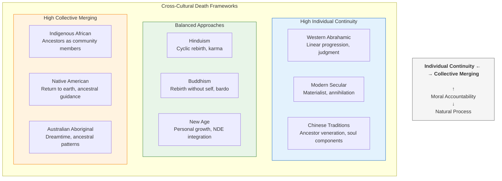
```mermaid
graph TD
    subgraph CulturalVariations[Cross-Cultural Death Frameworks]
        direction TB
        
        subgraph HighIndividual["High Individual Continuity"]
            WA["Western Abrahamic<br>Linear progression, judgment"]
            MS["Modern Secular<br>Materialist, annihilation"]
            CT["Chinese Traditions<br>Ancestor veneration, soul components"]
        end
        
        subgraph Balanced["Balanced Approaches"]
            HI["Hinduism<br>Cyclic rebirth, karma"]
            BU["Buddhism<br>Rebirth without self, bardo"]
            NA["New Age<br>Personal growth, NDE integration"]
        end
        
        subgraph HighCollective["High Collective Merging"]
            IA["Indigenous African<br>Ancestors as community members"]
            AM["Native American<br>Return to earth, ancestral guidance"]
            AA["Australian Aboriginal<br>Dreamtime, ancestral patterns"]
        end
    end
    
    %% Axes labels (conceptual, not rendered as connections)
    Axes["<b>Individual Continuity</b> ← → <b>Collective Merging</b><br><br>↑<br>Moral Accountability<br>↓<br>Natural Process"]
    
    style HighIndividual fill:#e3f2fd,stroke:#1565c0
    style Balanced fill:#e8f5e8,stroke:#2e7d32
    style HighCollective fill:#fff3e0,stroke:#f57c00
    style Axes fill:#f5f5f5,stroke:#666
```

### Death as Regenerative Process

**Definition:** Regeneration encompasses the restoration of healthy perceptual bandwidth, salience balance, and intersubjective attunement within conscious systems. This includes the regenerative process of death, understood as the natural recycling and reintegration of individual consciousness patterns back into Mind-at-Large, enriching the whole while enabling new formations. Death itself becomes a regenerative act when approached consciously—transforming boundary dissolution from traumatic loss to meaningful pattern return.

Regeneration thus encompasses the full cycle: from individual consciousness emergence through dissociation, through life's experiences and learnings, through the conscious return via death, to the integration of those learnings into the larger conscious field for future emergences.

#### Expanded Relevance of Regeneration:
- **Individual well-being**: Includes preparation for conscious dying and integration of mortality awareness
- **Collective coherence**: Strengthened by shared understanding of consciousness continuity and ancestor connection
- **Ecological attunement**: Enhanced by viewing biological death as conscious participation in ecosystem cycling
- **Death transition quality**: The consciousness state during dying affects the quality of pattern reintegration
- **Ancestral pattern integration**: Regeneration includes maintaining healthy relationships with post-mortem consciousness patterns
- **Cross-generational learning**: Wisdom accumulated across lifetimes enriches the collective consciousness reservoir
- **Cosmic recycling**: Death as the ultimate regenerative act—returning individuated experience to the source for reuse

#### Death as Regenerative Process in Consciousness Terms

1. **Pattern Return and Enrichment**:
   - Individual life experiences become patterns that return to MAL
   - These patterns enrich the collective wisdom available to future dissociations
   - Death completes the learning cycle by integrating experiences back to source

2. **Boundary Reconfiguration as Renewal**:
   - Dissolution of individual boundaries makes room for new formations
   - Like forest fires that enable new growth, death clears space for new consciousness expressions
   - The MAL "recycles" successful patterns while letting go of maladaptive ones

3. **Energy Transformation**:
   - The "energy" of concentrated individual consciousness dissipates back into the field
   - This released energy becomes available for new conscious formations
   - No experience is wasted—all contributes to the evolving complexity of MAL

4. **Evolutionary Mechanism**:
   - Death acts as MAL's evolutionary tool, testing consciousness patterns
   - Successful adaptations (wisdom, love, coherence) persist in the field
   - Less successful patterns dissolve more completely, reducing their influence

#### Practical Regeneration Applications Involving Death
- **Conscious dying protocols** that maximize pattern integration
- **Community death rituals** that support both deceased and living
- **Ancestor communication practices** that maintain regenerative connections
- **Ecological burial systems** that transform physical decay into new life
- **Legacy preservation** that consciously shapes what patterns return to MAL
- **Grief processing** as boundary healing and pattern integration work

### 📚 Connections to Existing Framework

- **Consistent with the Dissociation Model**: Death is the final modulation of the dissociation boundary.
- **Extension of the Perceptual Interface Theory**: Death is the ultimate interface shift.
- **Aligned with the Spectrum of Altered States**: Death is the most extreme altered state, beyond even near-death experiences.

### 🧭 A Note on Research and Evidence

While direct evidence of the experience of death is by nature elusive, phenomena such as near-death experiences (NDEs), past-life memories, and deathbed visions provide suggestive data that can be coherently interpreted within this framework. Furthermore, the model provides a parsimonious explanation for why such phenomena occur and why they share common features across cultures.

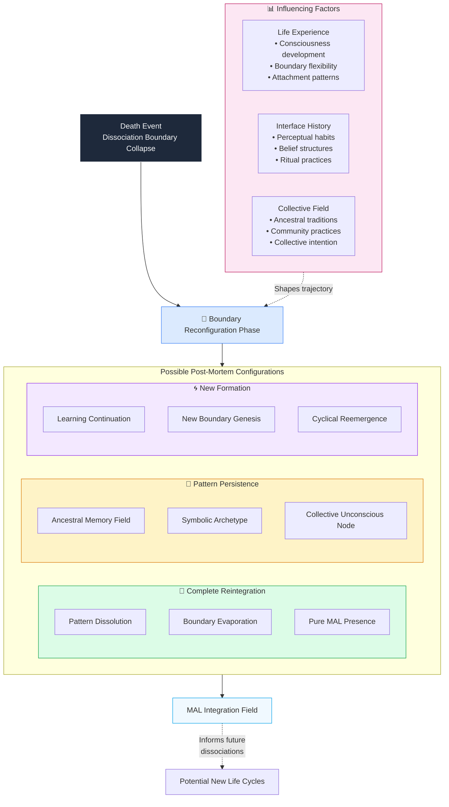
```mermaid
flowchart TD
    D["Death Event<br>Dissociation Boundary Collapse"]
    
    D --> BoundaryReconfig["🌊 Boundary Reconfiguration Phase"]
    
    subgraph ConfigurationOptions["Possible Post-Mortem Configurations"]
        direction LR
        
        subgraph Reintegration["🔄 Complete Reintegration"]
            RI1["Pattern Dissolution"]
            RI2["Boundary Evaporation"]
            RI3["Pure MAL Presence"]
        end
        
        subgraph PatternPersistence["💾 Pattern Persistence"]
            PP1["Ancestral Memory Field"]
            PP2["Symbolic Archetype"]
            PP3["Collective Unconscious Node"]
        end
        
        subgraph Reformation["🌀 New Formation"]
            NF1["Learning Continuation"]
            NF2["New Boundary Genesis"]
            NF3["Cyclical Reemergence"]
        end
    end
    
    BoundaryReconfig --> ConfigurationOptions
    
    %% Influencing Factors
    subgraph InfluencingFactors["📊 Influencing Factors"]
        direction LR
        L["Life Experience<br>• Consciousness development<br>• Boundary flexibility<br>• Attachment patterns"]
        I["Interface History<br>• Perceptual habits<br>• Belief structures<br>• Ritual practices"]
        C["Collective Field<br>• Ancestral traditions<br>• Community practices<br>• Collective intention"]
    end
    
    InfluencingFactors -.->|Shapes trajectory| BoundaryReconfig
    
    %% MAL Feedback Loop
    ConfigurationOptions --> MALInfluence["MAL Integration Field"]
    MALInfluence -.->|Informs future<br>dissociations| NewLife["Potential New Life Cycles"]
    
    style D fill:#1e293b,stroke:#f8fafc,color:#f8fafc
    style BoundaryReconfig fill:#dbeafe,stroke:#3b82f6
    style Reintegration fill:#dcfce7,stroke:#16a34a
    style PatternPersistence fill:#fef3c7,stroke:#d97706
    style Reformation fill:#f3e8ff,stroke:#9333ea
    style InfluencingFactors fill:#fce7f3,stroke:#be185d
    style MALInfluence fill:#f0f9ff,stroke:#0ea5e9
```

---

**In summary**, viewing death through the lens of Analytic Idealism transforms it from a terrifying unknown into a meaningful phase in the journey of consciousness. It encourages a culture of presence, connection, and reverence for life, while reducing the fear of annihilation. This perspective is integral to building a Solarpunk future that honors the full cycle of existence, from birth to death and beyond.

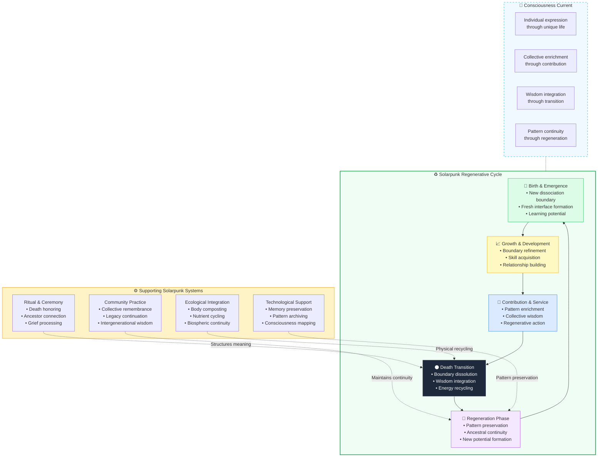
```mermaid
flowchart TD
    subgraph SolarpunkCycle["♻️ Solarpunk Regenerative Cycle"]
        direction LR
        
        Birth["🌱 Birth & Emergence<br>• New dissociation boundary<br>• Fresh interface formation<br>• Learning potential"]
        
        Growth["📈 Growth & Development<br>• Boundary refinement<br>• Skill acquisition<br>• Relationship building"]
        
        Contribution["🤝 Contribution & Service<br>• Pattern enrichment<br>• Collective wisdom<br>• Regenerative action"]
        
        Transition["⚫ Death Transition<br>• Boundary dissolution<br>• Wisdom integration<br>• Energy recycling"]
        
        Regeneration["🔄 Regeneration Phase<br>• Pattern preservation<br>• Ancestral continuity<br>• New potential formation"]
    end
    
    %% Connections
    Birth --> Growth
    Growth --> Contribution
    Contribution --> Transition
    Transition --> Regeneration
    Regeneration --> Birth
    
    %% Supporting Systems
    subgraph SupportingSystems["⚙️ Supporting Solarpunk Systems"]
        R["Ritual & Ceremony<br>• Death honoring<br>• Ancestor connection<br>• Grief processing"]
        C["Community Practice<br>• Collective remembrance<br>• Legacy continuation<br>• Intergenerational wisdom"]
        E["Ecological Integration<br>• Body composting<br>• Nutrient cycling<br>• Biospheric continuity"]
        T["Technological Support<br>• Memory preservation<br>• Pattern archiving<br>• Consciousness mapping"]
    end
    
    %% Connections to main cycle
    R -.->|Structures meaning| Transition
    C -.->|Maintains continuity| Regeneration
    E -.->|Physical recycling| Transition
    T -.->|Pattern preservation| Regeneration
    
    %% Consciousness Flow
    subgraph ConsciousnessFlow["💫 Consciousness Current"]
        direction RL
        CF1["Individual expression<br>through unique life"]
        CF2["Collective enrichment<br>through contribution"]
        CF3["Wisdom integration<br>through transition"]
        CF4["Pattern continuity<br>through regeneration"]
    end
    
    ConsciousnessFlow -.- SolarpunkCycle
    
    %% Styling
    style SolarpunkCycle fill:#f0fdf4,stroke:#16a34a,stroke-width:2px
    style Birth fill:#dcfce7,stroke:#22c55e
    style Growth fill:#fef9c3,stroke:#eab308
    style Contribution fill:#dbeafe,stroke:#3b82f6
    style Transition fill:#1e293b,stroke:#f8fafc,color:#f8fafc
    style Regeneration fill:#f3e8ff,stroke:#a855f7
    style SupportingSystems fill:#fef3c7,stroke:#f59e0b
    style ConsciousnessFlow fill:#f0f9ff,stroke:#0ea5e9,stroke-dasharray: 5 5
```


## Ontological Scope: What the Model Claims vs. What It Explores

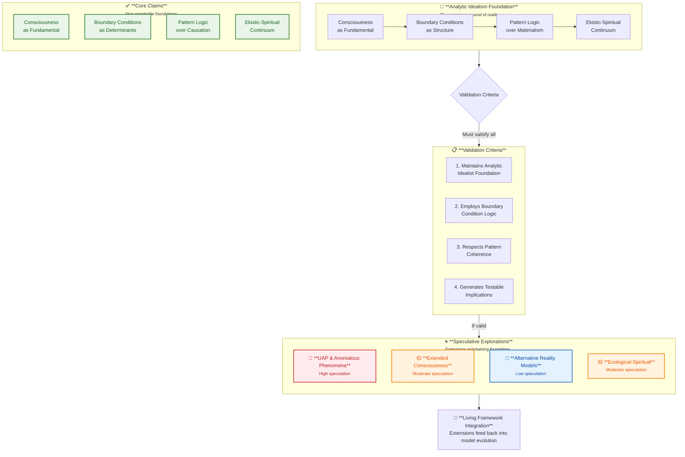
```mermaid
flowchart TD
    subgraph Foundation["🔷 **Analytic Idealism Foundation**<br><small>The conscious ground of reality</small>"]
        direction LR
        C1[Consciousness<br>as Fundamental] -->
        C2[Boundary Conditions<br>as Structure] -->
        C3[Pattern Logic<br>over Materialism] -->
        C4[Ekistic-Spiritual<br>Continuum]
    end
    
    Foundation --> Validation{Validation Criteria}
    
    subgraph Core["✅ **Core Claims**<br><small>Non-negotiable foundations</small>"]
        direction TB
        C1c["Consciousness<br>as Fundamental"]:::core
        C2c["Boundary Conditions<br>as Determinants"]:::core
        C3c["Pattern Logic<br>over Causation"]:::core
        C4c["Ekistic-Spiritual<br>Continuum"]:::core
    end
    
    Validation -->|Must satisfy all| Criteria
    subgraph Criteria["📋 **Validation Criteria**"]
        direction LR
        V1["1. Maintains Analytic<br>Idealist Foundation"]
        V2["2. Employs Boundary<br>Condition Logic"]
        V3["3. Respects Pattern<br>Coherence"]
        V4["4. Generates Testable<br>Implications"]
    end
    
    Criteria -->|If valid| Extensions
    
    subgraph Extensions["🌀 **Speculative Explorations**<br><small>Extensions maintaining foundation</small>"]
        direction TB
        S1["🔴 **UAP & Anomalous Phenomena**<br><small>High speculation</small>"]:::high
        S2["🟡 **Extended Consciousness**<br><small>Moderate speculation</small>"]:::moderate
        S3["🔵 **Alternative Reality Models**<br><small>Low speculation</small>"]:::low
        S4["🟡 **Ecological-Spiritual**<br><small>Moderate speculation</small>"]:::moderate
    end
    
    Extensions --> Integration["🔄 **Living Framework Integration**<br>Extensions feed back into model evolution"]

    classDef core fill:#e8f5e8,stroke:#2e7d32,stroke-width:2px,color:#1b5e20
    classDef high fill:#ffebee,stroke:#c62828,stroke-width:2px,color:#b71c1c
    classDef moderate fill:#fff3e0,stroke:#f57c00,stroke-width:2px,color:#e65100
    classDef low fill:#e3f2fd,stroke:#1565c0,stroke-width:2px,color:#0d47a1
    classDef foundation fill:#f5f5f5,stroke:#616161,stroke-dasharray: 5 5
```

### The Architecture of Ontological Commitment

This framework operates with explicit, tiered ontological commitments. Unlike frameworks that either overclaim or under-specify, we maintain clarity between **core claims** (what the model asserts as fundamental) and **speculative extensions** (what the model can coherently explore). This distinction preserves intellectual rigor while allowing imaginative exploration.

---

### Core Claims: The Non-Negotiable Foundation

*These propositions constitute the model's bedrock ontology, derived from Analytic Idealism and necessary for internal consistency.*

#### 1. Consciousness as the Fundamental Ground of Reality
- **Primary Assertion**: All reality is experiential in nature; consciousness is not emergent from matter but is the ontological primitive.
- **Corollary**: The apparent physical world is a representation within consciousness, structured by boundary conditions that create the illusion of separation.
- **Evidence Basis**: Philosophically derived from Bernardo Kastrup's Analytic Idealism; empirically consistent with the "hard problem" of consciousness and phenomena resistant to materialist explanation.

#### 2. Boundary Conditions as Structural Determinants
- **Primary Assertion**: What we perceive as distinct entities, objects, or separations arise from boundary conditions within consciousness.
- **Corollary**: These boundaries are neither arbitrary nor fixed; they can be modified, dissolved, or reconfigured through specific processes (unfolding practices).
- **Practical Implication**: Personal and collective transformation involves boundary work—recognizing, negotiating, and sometimes dissolving these conditions.

#### 3. Pattern Logic Over Material Causation
- **Primary Assertion**: Reality follows patterns of logical relationship rather than materialist causation chains.
- **Corollary**: Coherence and resonance between patterns determine "reality effects" more than physical proximity or mechanical interaction.
- **Example**: Synchronicities represent pattern resonance across apparently disconnected domains of experience.

#### 4. The Ekistic-Spiritual Continuum
- **Primary Assertion**: Human experience requires integration across biological, built, and spiritual domains (Ekistics 1-5 extended through spiritual dimensions).
- **Corollary**: Sustainable human flourishing (Solarpunk) requires simultaneous attention to bodily needs (MAN), built environment (SHELLS), and transcendent connection (Practice).
- **Practical Implication**: No single domain can be optimized at the expense of others without systemic consequences.

---

### Speculative Explorations: Extending the Model's Applications

> *This section intentionally explores extended interpretations of the core model. These are not definitive claims but potential applications that remain consistent with the analytic idealist foundation. They represent different "hyperslices" of the tesseract—coherent perspectives that emerge when viewing reality through the 4D geometric framework.*

#### 📐 Degree of Speculation Indicators
Each exploration below includes a speculation level:
- **🔵 LOW**: Strong alignment with core claims, minimal additional assumptions
- **🟡 MODERATE**: Reasonable extension requiring some additional premises
- **🔴 HIGH**: Creative extension that tests the model's boundaries

---

#### 🔴 UAP & Anomalous Phenomena Interpretation
*How the model might explain unidentified aerial phenomena and related anomalies*

**Core Connection**: Boundary condition disturbances in collective consciousness.

**Exploratory Propositions**:
1. **Pattern Disruption Hypothesis**: UAP represent boundary condition disruptions where consensus reality patterns momentarily fail or become permeable.
2. **Consciousness Interface Model**: Anomalous effects occur when non-human (or hyperdimensional) consciousness patterns intersect with human boundary structures.
3. **High Strangeness as Boundary Layer Effects**: The contradictory, absurd, or physically impossible aspects of encounters result from experiencing multiple boundary configurations simultaneously.
4. **Temporal Anomalies as 4D Projection Artifacts**: Time distortions represent glimpses of the fourth (temporal/pattern) dimension that our 3D-bound perception misinterprets.

**Supporting Observations**:
- The "interdimensional hypothesis" in UAP research aligns with boundary permeability
- Consciousness-correlated effects in close encounters suggest fundamental connection
- Patterned but non-reproducible phenomena resist materialist explanation but fit pattern-logic

**Open Questions**:
- Are UAP primarily individual or collective boundary events?
- Do they represent external consciousness or projections of human collective unconscious?
- How might boundary practices prepare for or integrate such experiences?

---

#### 🟡 Extended Consciousness Phenomena
*Applications to psi, mystical experiences, and non-ordinary states*

**Core Connection**: Boundary permeability and reconfiguration.

**Exploratory Propositions**:
1. **Psi as Boundary Leakage**: Telepathy, precognition, and psychokinesis represent information/pattern transfer across typically separate boundary conditions.
2. **Mystical States as Boundary Dissolution**: Union experiences occur when personal boundary conditions temporarily dissolve into broader consciousness.
3. **Healing as Boundary Reconfiguration**: Trauma represents maladaptive boundary formations; healing involves safe boundary restructuring.
4. **Collective Resonance**: Social movements and cultural shifts involve collective boundary renegotiation.

**Practical Applications**:
- Boundary mapping for therapeutic work
- Ritual design for intentional boundary work
- Community practices for collective boundary health

---

#### 🔵 Alternative Reality Models Through Analytic Idealism
*How the framework interfaces with other metaphysical systems*

**Comparative Analyses**:
1. **Simulation Hypothesis**: If reality is consciousness-based, "simulation" becomes a boundary configuration metaphor rather than computational literalism.
2. **Quantum Interpretations**: Quantum weirdness (entanglement, superposition) as boundary condition phenomena in consciousness-space.
3. **Panpsychism vs. Idealism Reconciliation**: Panpsychism's consciousness-in-everything as one possible boundary configuration within fundamental consciousness.
4. **Multiverse Theories**: Alternate realities as different boundary structure sets within the same conscious ground.

**Integration Points**:
- Each alternative model can be translated into boundary condition language
- The tesseract model provides geometric representation where others remain abstract
- Pattern logic unifies seemingly disparate phenomena across models

---

#### 🟡 Ecological-Spiritual Integration for Solarpunk
*Applications to sustainable flourishing and nature connection*

**Core Connection**: The Ekistic-Spiritual continuum requires rethinking human-nature boundaries.

**Exploratory Propositions**:
1. **Nature Consciousness**: Natural systems manifest specific boundary configurations; ecological awareness involves learning these patterns.
2. **Built Environment as Conscious Extension**: Architecture and infrastructure create boundary conditions that either facilitate or hinder connection.
3. **Technology as Boundary Mediation**: Tools and systems can either reinforce separation or enable new forms of connection.
4. **Ritual as Boundary Work**: Ceremonial practices intentionally manipulate boundary conditions for specific outcomes.

**Solarpunk Implications**:
- Regenerative design as boundary healing
- Community governance as collective boundary negotiation
- Appropriate technology as conscious mediation choice

---

### Methodological Framework for Speculative Exploration

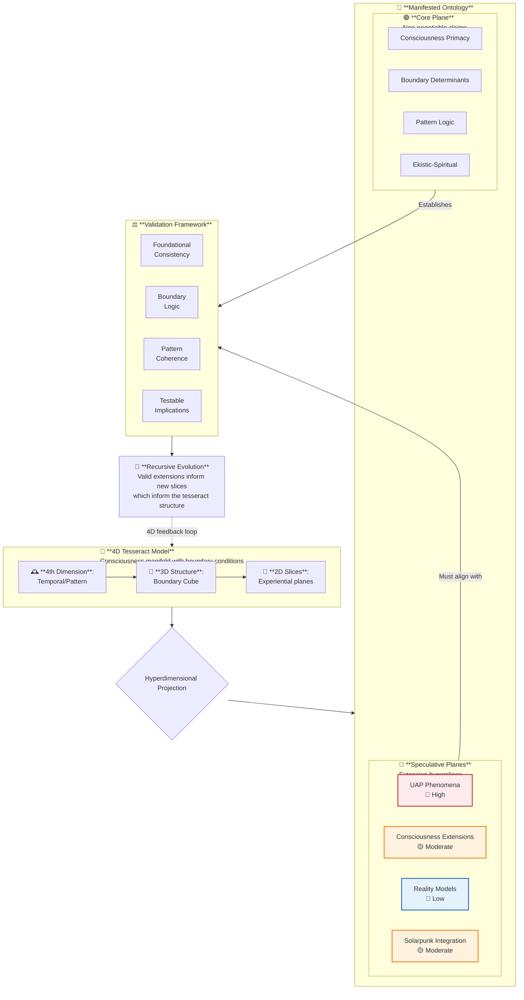
```mermaid
flowchart TD
    subgraph Tesseract["🔳 **4D Tesseract Model**<br>Consciousness manifold with boundary conditions"]
        direction LR
        Dim4["🕰️ **4th Dimension**:<br>Temporal/Pattern"] -->
        Dim3["🧊 **3D Structure**:<br>Boundary Cube"] -->
        Dim2["📐 **2D Slices**:<br>Experiential planes"]
    end
    
    Tesseract --> Projection{Hyperdimensional Projection}
    
    Projection --> Manifestations
    
    subgraph Manifestations["💠 **Manifested Ontology**"]
        direction TB
        subgraph CorePlane["🟢 **Core Plane**<br>Non-negotiable claims"]
            direction LR
            CC1["Consciousness Primacy"]
            CC2["Boundary Determinants"]
            CC3["Pattern Logic"]
            CC4["Ekistic-Spiritual"]
        end
        
        subgraph SpeculativePlanes["🌈 **Speculative Planes**<br>Extension hyperslices"]
            direction LR
            SP1["UAP Phenomena<br>🔴 High"]:::high
            SP2["Consciousness Extensions<br>🟡 Moderate"]:::moderate
            SP3["Reality Models<br>🔵 Low"]:::low
            SP4["Solarpunk Integration<br>🟡 Moderate"]:::moderate
        end
    end
    
    CorePlane -->|Establishes| ValidationFramework
    SpeculativePlanes -->|Must align with| ValidationFramework
    
    subgraph ValidationFramework["⚖️ **Validation Framework**"]
        direction LR
        VF1["Foundational<br>Consistency"]
        VF2["Boundary<br>Logic"]
        VF3["Pattern<br>Coherence"]
        VF4["Testable<br>Implications"]
    end
    
    ValidationFramework --> RecursiveEvolution["🔄 **Recursive Evolution**<br>Valid extensions inform new slices<br>which inform the tesseract structure"]
    
    RecursiveEvolution -.->|4D feedback loop| Tesseract

    classDef core fill:#e8f5e8,stroke:#2e7d32,stroke-width:2px
    classDef high fill:#ffebee,stroke:#c62828,stroke-width:2px
    classDef moderate fill:#fff3e0,stroke:#f57c00,stroke-width:2px
    classDef low fill:#e3f2fd,stroke:#1565c0,stroke-width:2px
    classDef tesseract fill:#f3e5f5,stroke:#7b1fa2,stroke-width:2px
```

#### Validation Criteria for Extensions
For any speculative proposition to be considered within the model's scope, it must:

1. **Maintain Analytic Idealist Foundation**: Cannot contradict consciousness as fundamental
2. **Employ Boundary Condition Logic**: Must use the model's structural language
3. **Respect Pattern Coherence**: Should create more explanatory connections than it requires special exceptions
4. **Generate Testable Implications**: Should suggest practices, observations, or experiences that could confirm/disconfirm

#### Navigating Between Speculative Tiers
- **Intra-model Exploration**: Staying within established boundary parameters
- **Inter-model Dialogue**: Comparing with other frameworks while maintaining core integrity
- **Trans-model Speculation**: Creative extension that might require model evolution

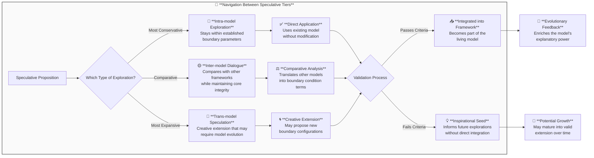
```mermaid
flowchart LR
    subgraph ExplorationTiers["🧭 **Navigation Between Speculative Tiers**"]
        direction TB
        A[Speculative Proposition] --> B{Which Type of Exploration?}
        
        B -->|Most Conservative| C["🔷 **Intra-model Exploration**<br>Stays within established<br>boundary parameters"]
        B -->|Comparative| D["🟡 **Inter-model Dialogue**<br>Compares with other frameworks<br>while maintaining core integrity"]
        B -->|Most Expansive| E["🔴 **Trans-model Speculation**<br>Creative extension that may<br>require model evolution"]
        
        C --> F["✅ **Direct Application**<br>Uses existing model<br>without modification"]
        D --> G["⚖️ **Comparative Analysis**<br>Translates other models<br>into boundary condition terms"]
        E --> H["🌀 **Creative Extension**<br>May propose new<br>boundary configurations"]
        
        F & G & H --> I{Validation Process}
        
        I -->|Passes Criteria| J["📥 **Integrated into Framework**<br>Becomes part of the<br>living model"]
        I -->|Fails Criteria| K["💡 **Inspirational Seed**<br>Informs future explorations<br>without direct integration"]
    end
    
    J --> L["🔄 **Evolutionary Feedback**<br>Enriches the model's<br>explanatory power"]
    K --> M["🌱 **Potential Growth**<br>May mature into valid<br>extension over time"]
    
    style ExplorationTiers fill:#fafafa,stroke:#666,stroke-width:2px
```

### Framework Limitations: Scope, Boundaries, and Unanswered Questions

A robust philosophical framework must acknowledge its limitations and boundary conditions. This section defines what analytic idealism as presented here does NOT claim, where it faces challenges, and what questions remain open.

#### What This Framework Does NOT Claim

##### 1. Does Not Deny Empirical Reality
**Misconception:** "If matter isn't fundamental, then the physical world is an illusion."

**Clarification:** The physical world is real as perceptual interface. Its regularities are stable and investigable. The framework denies that matter is ontologically fundamental, not that physical reality exists as experience.

**Boundary:** Empirical science remains valid for studying interface patterns.

##### 2. Does Not Advocate Solipsism
**Misconception:** "If consciousness is fundamental, then only my consciousness exists."

**Clarification:** The framework posits a unified conscious field (MAL) of which individual minds are portions. Other people are equally real as dissociated segments of MAL.

**Boundary:** Intersubjective agreement arises from shared structure in MAL.

##### 3. Does Not Reject Scientific Methodology
**Misconception:** "Idealism means abandoning scientific methods."

**Clarification:** Scientific methods study patterns in experience. Their effectiveness is preserved while their metaphysical interpretation changes.

**Boundary:** Scientific findings must be interpretable within the framework, but methods remain unchanged.

##### 4. Does Not Claim Complete Explanation
**Misconception:** "This framework explains everything about reality."

**Clarification:** The framework provides an ontological foundation and high-level structure. Many specific mechanisms remain to be detailed.

**Boundary:** Framework sets constraints and possibilities but doesn't provide all details.

#### Major Challenges and Open Questions

##### Challenge 1: The "Why" of Specific Interface Design
**Question:** If perception is an interface, why does it have these specific features (space, time, objects) rather than others?

**Current Response:** Interface features evolve (or are designed) for adaptive fitness. Specific features reflect the needs of biological survival and social coordination.

**Open Issues:**
- Are there deeper principles determining interface constraints?
- Could radically different interfaces exist for different purposes?
- How do interface features relate to MAL's intrinsic nature?

**Research Direction:** Comparative study of different perceptual modalities across species and states.

##### Challenge 2: The Mechanism of Dissociation
**Question:** How exactly does unified MAL separate into individual alters with limited awareness?

**Current Response:** Dissociation as a fundamental process analogous to psychological dissociation but at the metaphysical level.

**Open Issues:**
- What determines specific boundary placements?
- How are memories and identities maintained across dissociation?
- What mechanisms allow boundary modulation?

**Research Direction:** Study of dissociative disorders, meditation states, and psychedelic experiences for clues.

##### Challenge 3: The Hard Problem of Matter
**Question:** If matter is appearance of consciousness, why does it have the specific properties it does?

**Current Response:** Matter's properties reflect the mathematical/logical structure of MAL as experienced across dissociation boundaries.

**Open Issues:**
- Why these particular physical laws and constants?
- How do quantum phenomena relate to consciousness structure?
- What determines the "grain" of physical appearance?

**Research Direction:** Investigation of consciousness-physics correlations in altered states.

##### Challenge 4: The Problem of Evil
**Question:** If reality is consciousness, why does it contain so much suffering?

**Current Response:** Suffering arises from maladaptive boundary conditions. MAL's exploration includes all possibilities, including those involving suffering.

**Open Issues:**
- Is suffering necessary for certain developments?
- How much suffering is "acceptable" in consciousness exploration?
- What is MAL's relationship to the suffering of its alters?

**Research Direction:** Ethical analysis within consciousness framework, study of suffering reduction through boundary work.

##### Challenge 5: Empirical Testability
**Question:** How can this framework be tested against alternatives?

**Current Response:** Framework makes predictions about consciousness states, boundary phenomena, and the limits of materialist explanation.

**Open Issues:**
- What would falsify the framework?
- How to design crucial experiments?
- What constitutes evidence for or against?

**Research Direction:** Development of specific testable predictions and experimental protocols.

#### Edge Cases and Paradoxes

##### The Infinite Regress Problem
**Paradox:** If consciousness is fundamental, what explains consciousness itself?

**Response:** Consciousness is the explanatory terminus. Unlike matter, which requires explanation of its properties, consciousness is self-evident through being what it is.

**Status:** Framework accepts this as fundamental axiom rather than problem to be solved.

##### The Problem of Unconscious Processes
**Paradox:** How do unconscious mental processes fit into consciousness-only reality?

**Response:** "Unconscious" means not accessible to a particular dissociated alter, not non-conscious. All processing occurs within MAL, just outside specific boundaries.

**Status:** Requires careful distinction between different types of "unconsciousness."

##### The Simulation Argument Compatibility
**Paradox:** Could we be in a simulation? How does that relate to analytic idealism?

**Response:** Simulation hypothesis is compatible but adds an unnecessary layer. If reality is consciousness, "simulation" would be a particular pattern within MAL.

**Status:** Framework can incorporate simulation ideas but doesn't require them.

#### When Materialist Explanations Remain Useful

##### Pragmatic Materialism in Specific Domains
**Domain 1: Engineering and Technology**
- Materialist models work excellently for designing physical systems
- Interface regularities are effectively treated as objective laws
- **Guideline:** Use materialist models for interface manipulation, idealist understanding for deeper meaning

**Domain 2: Medicine (Non-psychological aspects)**
- Physical interventions have predictable effects on the body-as-interface
- Materialist biology effectively models many bodily processes
- **Guideline:** Treat biological systems as stable interface patterns

**Domain 3: Basic Physics and Chemistry**
- Mathematical models predict interface behavior accurately
- No need for consciousness references in many equations
- **Guideline:** Use mathematical models while remembering they describe interface patterns, not fundamental reality

##### The "As If" Heuristic
In many practical situations, it's useful to proceed "as if" materialism were true while recognizing it as an interface-level description rather than fundamental ontology.

#### Limits of Human Capacity to Understand MAL

#### Cognitive Limitations
**Problem:** Human brains/consciousness are specific dissociated configurations with limited bandwidth.

**Implications:**
- We cannot directly experience MAL in its fullness while individuated
- Our concepts are shaped by our interface limitations
- Complete understanding may be inherently impossible for bounded consciousness

**Response:** We can approach understanding asymptotically through:
- Expanding perceptual bandwidth
- Studying patterns across different states
- Building collective understanding across individuals
- Recognizing the limits of our models

##### The Map-Territory Problem
**Recognition:** All our models, including this one, are maps within consciousness, not the territory of consciousness itself.

**Implication:** We must maintain humility about our conceptual frameworks while using them as skillfully as possible.

#### Framework Boundaries: What Lies Outside Scope

##### 1. Specific Religious Claims
The framework is compatible with many religious insights but doesn't endorse specific dogmas, revelations, or institutional claims.

**Boundary:** Framework provides metaphysical foundation, not theological specifics.

##### 2. Political Prescriptions
While the framework has political implications, it doesn't dictate specific political systems.

**Boundary:** Framework informs political thinking but doesn't replace political deliberation.

##### 3. Aesthetic Judgments
The framework explains why aesthetics matter but doesn't determine what is beautiful.

**Boundary:** Framework grounds aesthetic experience in consciousness but doesn't prescribe tastes.

##### 4. Detailed Scientific Explanations
The framework constrains scientific explanations but doesn't provide them.

**Boundary:** Scientists must still do the work of discovering specific mechanisms within the framework's constraints.

#### Evolving the Framework: Revision Criteria

The framework should evolve based on:

1. **Internal Consistency Problems:** Logical contradictions within the framework
2. **Empirical Anomalies:** Persistent phenomena the framework cannot accommodate
3. **Explanatory Failures:** Areas where the framework provides less insight than alternatives
4. **Practical Impotence:** Failure to generate useful applications or predictions
5. **Better Alternatives Emergence:** Competing frameworks with superior explanatory power

#### Conclusion: Humble Confidence

This framework makes strong claims but acknowledges its limitations. It offers:
- A coherent foundation for understanding reality
- Practical implications for individual and collective life
- Testable predictions and research directions
- Clear boundaries about what it does and doesn't claim

**Final Position:** This is the best available framework given current evidence and reasoning, but it remains open to refinement, challenge, and eventual supersession by better understanding.

The appropriate attitude is neither dogmatic certainty nor weak relativism, but humble confidence coupled with commitment to ongoing inquiry and practical application.

#### The Role of Speculation in a Living Framework
Unlike rigid systems that prohibit exploration beyond core claims, this framework recognizes that:
- Speculation drives model evolution when disciplined
- Multiple interpretations can coexist as different boundary configurations
- The "map is not the territory"—speculative explorations are themselves boundary conditions within consciousness

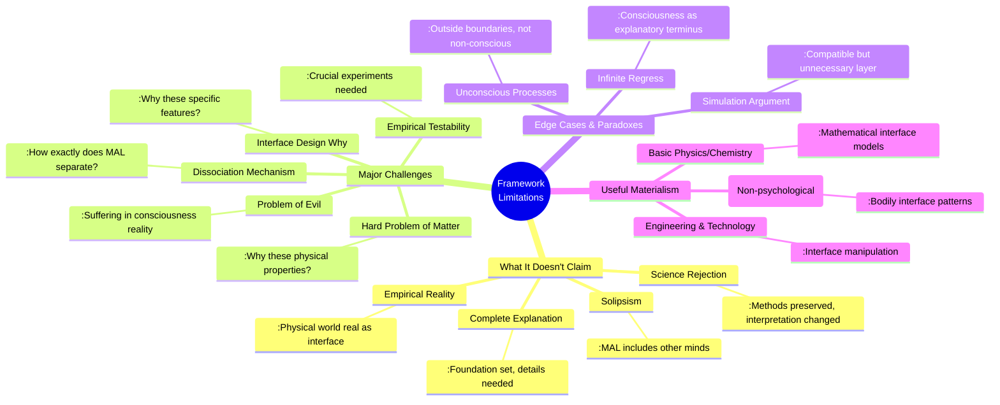
```mermaid
mindmap
  root((Framework<br>Limitations))
    What It Doesn't Claim
      Empirical Reality
        :Physical world real as interface
      Solipsism
        :MAL includes other minds
      Science Rejection
        :Methods preserved, interpretation changed
      Complete Explanation
        :Foundation set, details needed
    
    Major Challenges
      Interface Design Why
        :Why these specific features?
      Dissociation Mechanism
        :How exactly does MAL separate?
      Hard Problem of Matter
        :Why these physical properties?
      Problem of Evil
        :Suffering in consciousness reality
      Empirical Testability
        :Crucial experiments needed
    
    Edge Cases & Paradoxes
      Infinite Regress
        :Consciousness as explanatory terminus
      Unconscious Processes
        :Outside boundaries, not non-conscious
      Simulation Argument
        :Compatible but unnecessary layer
    
    Useful Materialism
      Engineering & Technology
        :Interface manipulation
      Medicine (Non-psychological)
        :Bodily interface patterns
      Basic Physics/Chemistry
        :Mathematical interface models
```

---

## Comparative Ontology: Analytic Idealism in Philosophical Context

To properly position analytic idealism within the broader philosophical landscape, we need systematic comparison with alternative metaphysical frameworks. This analysis clarifies what analytic idealism shares with other systems, where it differs, and what unique contributions it offers.

### Major Metaphysical Frameworks Compared

#### Materialism/Physicalism

**Core Claim:** Matter/energy is fundamental; consciousness emerges from complex physical systems.

**Shared Ground with Analytic Idealism:**
- Commitment to empirical investigation
- Recognition of pattern regularity in experience
- Practical success in technological applications

**Key Differences:**
- **Hard Problem:** Materialism cannot explain why physical processes feel like anything
- **Value Grounding:** Materialism struggles to ground intrinsic value and meaning
- **Observer Problem:** Materialism has difficulty accounting for the observer's role

**Integration Potential:** Analytic idealism can incorporate materialist models as interface-level descriptions while providing deeper ontological foundation.

#### Dualism

**Core Claim:** Both matter and consciousness are fundamental, interacting substances.

**Shared Ground:**
- Recognition of consciousness as irreducible
- Acknowledgment of mind-body interaction problems
- Preservation of subjective experience validity

**Key Differences:**
- **Interaction Problem:** Dualism cannot explain how non-physical mind affects physical brain
- **Parsimony:** Postulates two fundamentals rather than one
- **Empirical Evidence:** Little evidence for non-physical substance

**Integration Potential:** Analytic idealism resolves dualism's interaction problem by making matter the appearance of consciousness rather than separate substance.

#### Panpsychism

**Core Claim:** Consciousness is fundamental and ubiquitous; all matter has mental properties.

**Shared Ground:**
- Consciousness as fundamental reality
- Rejection of emergentist explanations for consciousness
- Recognition of mind-like properties in nature

**Key Differences:**
- **Combination Problem:** Panpsychism struggles to explain how micro-consciousness combines into macro-consciousness
- **Matter Status:** Panpsychism often retains matter as fundamental alongside consciousness
- **Parsimony:** Analytic idealism is more parsimonious (one fundamental vs. dual-aspect)

**Integration Potential:** Analytic idealism can be seen as a specific form of idealism that addresses panpsychism's combination problem through the dissociation model.

#### Neutral Monism

**Core Claim:** Neither mind nor matter is fundamental; both emerge from neutral substance.

**Shared Ground:**
- Rejection of both pure materialism and pure idealism
- Recognition of mind-matter correlation
- Attempt at parsimonious foundation

**Key Differences:**
- **Neutral Substance Mystery:** Nature of neutral substance remains unexplained
- **Emergence Problems:** Similar to materialism's hard problem for consciousness emergence
- **Empirical Content:** Often more abstract than testable

**Integration Potential:** Analytic idealism could interpret neutral monism's "neutral substance" as consciousness itself, with matter as its appearance.

### Process Philosophy Comparison

#### Whitehead's Process Philosophy

**Core Claim:** Reality consists of processes or events rather than substances.

**Shared Elements:**
- Emphasis on becoming over being
- Recognition of interconnectedness
- Value as inherent in reality

**Key Differences:**
- **Metaphysical Priority:** Processes vs. consciousness as fundamental
- **Technical Complexity:** Process philosophy's extensive technical apparatus
- **Accessibility:** Analytic idealism's relative conceptual simplicity

**Integration Points:**
- Both reject substance metaphysics
- Both emphasize relationality
- Both ground ethics in metaphysical reality

### Eastern Philosophical Comparisons

#### Advaita Vedanta

**Core Claim:** Non-dual consciousness (Brahman) is fundamental reality; world is appearance (maya).

**Shared Ground:**
- Consciousness as fundamental reality
- World as appearance rather than substance
- Goal of recognizing fundamental unity

**Key Differences:**
- **Methodology:** Mystical realization vs. analytic argumentation
- **Cultural Context:** Religious framework vs. secular philosophy
- **Practical Application:** Liberation focus vs. world-building focus

**Integration Potential:** Analytic idealism provides Western philosophical grounding for Advaita insights while maintaining secular, practical orientation.

#### Mahayana Buddhism (Particularly Yogacara)

**Core Claim:** Consciousness-only (vijñapti-mātra); world is mental construction.

**Shared Ground:**
- Consciousness as only ultimately real
- Emphasis on dependent arising
- Critique of naive realism

**Key Differences:**
- **No-Self Doctrine:** Buddhism rejects permanent self vs. analytic idealism's dissociated alters
- **Soteriological Focus:** Liberation from suffering vs. comprehensive worldview
- **Cultural Embedding:** Religious context vs. secular philosophy

**Integration Potential:** Analytic idealism can incorporate Buddhist insights on emptiness and dependent arising while maintaining individual perspective validity.

### Contemporary Analytic Philosophy Approaches

#### Property Dualism (Chalmers)

**Core Claim:** Consciousness is fundamental property that emerges from specific physical organization.

**Shared Ground:**
- Consciousness as fundamental feature of reality
- Rejection of reductive physicalism
- Serious engagement with hard problem

**Key Differences:**
- **Property vs. Substance:** Properties of physical systems vs. consciousness as substance
- **Emergence Model:** Still requires emergence explanation
- **Parsimony:** More complex than analytic idealism

**Integration Potential:** Property dualism's naturalistic dualism could be reinterpreted within analytic idealism's framework.

#### Cosmopsychism

**Core Claim:** The cosmos as a whole is conscious; individual consciousness derives from cosmic consciousness.

**Shared Ground:**
- Cosmic consciousness as fundamental
- Derived individual perspectives
- Rejection of micro-experiential panpsychism

**Key Differences:**
- **Derivation Mechanism:** How individual minds derive from cosmic mind
- **Theoretical Development:** Less developed than analytic idealism
- **Empirical Connections:** Fewer connections to cognitive science

**Integration Potential:** Cosmopsychism aligns closely with analytic idealism's MAL concept; could be seen as variant formulation.

### Scientific Framework Comparisons

#### Integrated Information Theory (IIT)

**Core Claim:** Consciousness corresponds to integrated information (Φ) in systems.

**Shared Ground:**
- Mathematical approach to consciousness
- Recognition of consciousness as fundamental
- Attempt to quantify conscious experience

**Key Differences:**
- **Ontological Status:** IIT often framed within materialist metaphysics
- **Explanatory Scope:** Focus on correlates rather than full ontology
- **Hard Problem:** Still faces generation problem

**Integration Potential:** IIT's Φ could quantify dissociation boundaries within analytic idealism.

#### Predictive Processing/Free Energy Principle

**Core Claim:** Brains minimize prediction error through hierarchical Bayesian inference.

**Shared Ground:**
- Emphasis on perception as construction
- Recognition of brain as prediction engine
- Account of how experience is structured

**Key Differences:**
- **Metaphysical Neutrality:** Often avoids ontological commitments
- **Scope:** Limited to cognitive mechanisms vs. full ontology
- **Hard Problem:** Doesn't address why predictions feel like anything

**Integration Potential:** Predictive processing describes the interface mechanism within analytic idealism's framework.

### Unique Contributions of Analytic Idealism

#### 1. Resolution of Hard Problem
- Other frameworks either deny the problem (illusionism), accept it as mystery, or propose incomplete solutions
- Analytic idealism dissolves the problem by making consciousness fundamental

#### 2. Empirical Coherence
- Compatible with quantum mechanics (observer effects)
- Accounts for altered states and anomalous experiences
- Grounds values and ethics in reality structure

#### 3. Practical Applications
- Provides foundation for consciousness development practices
- Informs technology design as interface mediation
- Supports death-positive culture and practices

#### 4. Cultural Bridge-Building
- Secular framework that honors spiritual insights
- Cross-cultural applicability while respecting diversity
- Integration of scientific and experiential knowledge

### Framework Integration Matrix

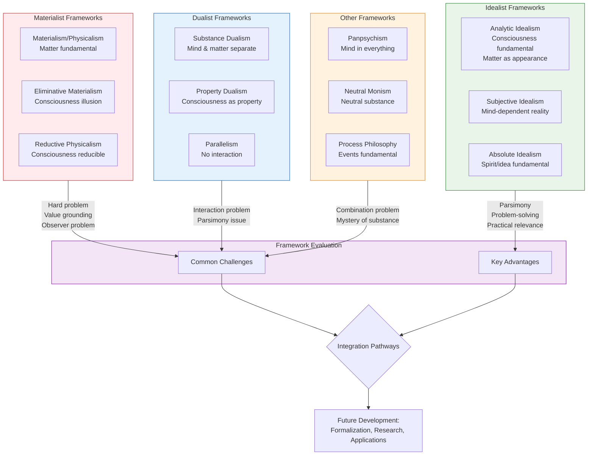
```mermaid
flowchart TD
    subgraph Materialist["Materialist Frameworks"]
        M1["Materialism/Physicalism<br>Matter fundamental"]
        M2["Eliminative Materialism<br>Consciousness illusion"]
        M3["Reductive Physicalism<br>Consciousness reducible"]
    end
    
    subgraph Idealist["Idealist Frameworks"]
        I1["Analytic Idealism<br>Consciousness fundamental<br>Matter as appearance"]
        I2["Subjective Idealism<br>Mind-dependent reality"]
        I3["Absolute Idealism<br>Spirit/idea fundamental"]
    end
    
    subgraph Dualist["Dualist Frameworks"]
        D1["Substance Dualism<br>Mind & matter separate"]
        D2["Property Dualism<br>Consciousness as property"]
        D3["Parallelism<br>No interaction"]
    end
    
    subgraph Other["Other Frameworks"]
        O1["Panpsychism<br>Mind in everything"]
        O2["Neutral Monism<br>Neutral substance"]
        O3["Process Philosophy<br>Events fundamental"]
    end
    
    Materialist -->|"Hard problem<br>Value grounding<br>Observer problem"| Challenges
    Idealist -->|"Parsimony<br>Problem-solving<br>Practical relevance"| Advantages
    Dualist -->|"Interaction problem<br>Parsimony issue"| Challenges
    Other -->|"Combination problem<br>Mystery of substance"| Challenges
    
    subgraph Evaluation["Framework Evaluation"]
        Challenges["Common Challenges"]
        Advantages["Key Advantages"]
    end
    
    Challenges --> Synthesis{Integration Pathways}
    Advantages --> Synthesis
    
    Synthesis --> Future["Future Development:<br>Formalization, Research, Applications"]
    
    style Materialist fill:#ffebee,stroke:#c62828
    style Idealist fill:#e8f5e8,stroke:#2e7d32
    style Dualist fill:#e3f2fd,stroke:#1565c0
    style Other fill:#fff3e0,stroke:#f57c00
    style Evaluation fill:#f3e5f5,stroke:#7b1fa2
```

### Dialogue and Synthesis Pathways

#### Productive Engagement Strategies

1. **Conceptual Translation:**
   - Map other frameworks' concepts into analytic idealism terms
   - Identify shared insights across different formulations
   - Clarify genuine vs. verbal disagreements

2. **Problem-Solving Comparison:**
   - How does each framework address the hard problem?
   - How does each ground ethics and values?
   - How does each account for altered states and anomalies?

3. **Empirical Discrimination:**
   - What predictions differ between frameworks?
   - What evidence would favor one over others?
   - How do frameworks handle anomalous data?

#### Areas for Further Development

1. **Formalization:**
   - More rigorous formalization of analytic idealism
   - Mathematical models of dissociation and interface dynamics
   - Computational simulations of consciousness patterns

2. **Empirical Research Program:**
   - Specific tests distinguishing analytic idealism from alternatives
   - Longitudinal studies of consciousness development
   - Cross-cultural phenomenological research

3. **Practical Applications:**
   - Consciousness-based education curricula
   - Death-positive community models
   - Ethical technology design frameworks

### Critical Evaluation of Analytic Idealism

#### Strengths
1. **Parsimony:** One fundamental (consciousness) rather than two or more
2. **Problem-Solving:** Dissolves hard problem, grounds ethics, accounts for anomalies
3. **Empirical Compatibility:** Compatible with quantum physics, cognitive science, altered states
4. **Practical Relevance:** Informs individual development, social design, technology ethics

#### Challenges
1. **Counterintuitiveness:** Contradicts common-sense materialist intuition
2. **Cultural Resistance:** Challenges dominant scientific materialist paradigm
3. **Development Needs:** Requires further formalization and empirical testing
4. **Implementation Complexity:** Practical applications need careful development

#### Responses to Common Criticisms
1. **"It's solipsism":** MAL includes other minds as dissociated alters
2. **"It denies science":** Science studies interface patterns; methods preserved
3. **"It's unfalsifiable":** Makes testable predictions about consciousness phenomena
4. **"It's just religion":** Uses philosophical argument, not revelation; secular framework

### Future Directions for Comparative Analysis

#### 1. Interdisciplinary Dialogue
- Regular conferences engaging multiple frameworks
- Joint research projects across philosophical traditions
- Collaborative publications comparing approaches

#### 2. Educational Integration
- Comparative metaphysics courses
- Consciousness studies programs including multiple perspectives
- Public education on metaphysical options

#### 3. Practical Collaboration
- Joint development of consciousness technologies
- Cooperative death-positive initiatives
- Shared research on altered states and healing

### Analytic Idealism as Living Framework

Analytic idealism is not presented as final truth but as the most coherent and fruitful framework given current evidence and reasoning. Its value lies in:

1. **Explanatory Power:** Addressing problems other frameworks cannot solve
2. **Practical Relevance:** Informing how we live, die, and build communities
3. **Openness to Revision:** Willingness to evolve based on new evidence and arguments
4. **Bridge-Building Capacity:** Connecting diverse traditions and disciplines

The framework invites not dogmatic acceptance but critical engagement, empirical testing, and practical application. It represents one path in humanity's ongoing attempt to understand the fundamental nature of reality—a path that takes consciousness seriously as both the subject and substance of investigation.

**Final Position:** Among current metaphysical options, analytic idealism offers the most parsimonious, coherent, and practically relevant foundation for understanding reality and guiding human flourishing in conscious recognition of our fundamental nature.

## Analytic Idealism Integration Protocol

To prevent philosophical-materialist slippage in practical applications, all protocols must include Dissociation Lens questions:

### Dissociation Lens Framework
- **Core Question:** "This work addresses [specific dissociation boundary]. How does this practice help dissolve the boundary between [individual] and Mind at Large?"
- **Boundary Medicine:** Identify which folded cube (5-8) this work heals
- **MAL Reflection:** "How does this action connect us to the larger field of consciousness? What boundary might this heal?"

### Implementation Requirements
1. All protocol worksheets must include Dissociation Lens questions
2. All case studies must explicitly reference MAL integration
3. Crisis response must include "Consciousness First Aid" step addressing boundary fragmentation before material response
4. Material intelligence framework must reframe materials as "consciousness made visible"

### Example Integration (Protocol 3 Crisis Response)
Instead of: "Distribute food and water to affected areas"

## Teaching Analytic Idealism: Pedagogical Methods for Consciousness Literacy

For analytic idealism to inform Solarpunk communities and broader culture, effective teaching methods are essential. This section outlines pedagogical approaches for different audiences and contexts.

### Foundational Principles of Consciousness Education

#### Principle 1: Experiential Grounding
- Concepts must connect to direct experience
- Abstract ideas followed by practical exercises
- "Show, don't just tell" approach

#### Principle 2: Progressive Disclosure
- Start with accessible concepts
- Build complexity gradually
- Respect different readiness levels

#### Principle 3: Multiple Intelligences Approach
- Conceptual, experiential, artistic, social learning modes
- Different entry points for different learners
- Holistic integration across modalities

#### Principle 4: Critical Thinking Integration
- Teach how to think, not what to think
- Encourage questioning and exploration
- Compare with alternative frameworks

### Age-Appropriate Curriculum Outline

#### Children (Ages 5-12)

**Core Concepts:**
- Everything is experience
- Different ways of seeing/feeling/knowing
- Connection to nature and others

**Teaching Methods:**
- Nature awareness games
- Art expressing inner states
- Stories about different perspectives
- Simple mindfulness practices

**Learning Goals:**
- Basic consciousness awareness
- Appreciation of different viewpoints
- Beginning self-reflection capacity
- Sense of wonder about experience

#### Adolescents (Ages 13-19)

**Core Concepts:**
- Consciousness vs. brain concepts
- Different states of mind
- Perceptual relativity
- Introduction to dissociation model

**Teaching Methods:**
- Psychology and neuroscience basics
- Altered state exploration (supervised)
- Philosophical discussion
- Creative writing about consciousness
- Basic meditation training

**Learning Goals:**
- Understanding mind-body problem
- Recognizing perceptual construction
- Developing critical thinking about reality
- Beginning boundary awareness

#### Young Adults (Ages 20-30)

**Core Concepts:**
- Full analytic idealism framework
- Dissociation model in depth
- Perceptual interface theory
- Ethical implications

**Teaching Methods:**
- Formal philosophy study
- Systematic state exploration
- Community practice groups
- Interdisciplinary integration
- Research participation

**Learning Goals:**
- Comprehensive framework understanding
- Practical application skills
- Community leadership capacity
- Contribution to framework development

#### Adults (All Ages)

**Core Concepts:**
- Lifespan consciousness development
- Death and continuity understanding
- Social and systemic applications
- Advanced practice integration

**Teaching Methods:**
- Advanced meditation and ritual
- Community organizing applications
- Mentorship and teaching
- Research and innovation
- Integration with professional work

**Learning Goals:**
- Mastery of consciousness navigation
- Contribution to collective understanding
- Integration into daily life and work
- Transmission to next generations

### Common Misconceptions and Corrections

#### Misconception 1: "It's All in My Head"
**Correction:** Consciousness is not "in" the head; the head (as perceived) is in consciousness. The brain is part of the perceptual interface, not the producer of consciousness.

**Teaching Strategy:** Use the "dream reality" analogy. In dreams, brains don't produce the dream world; the dream world includes dream brains.

#### Misconception 2: "Nothing Matters If It's All Consciousness"
**Correction:** Everything matters profoundly because consciousness is where value, meaning, and ethics arise. Mattering is a conscious phenomenon.

**Teaching Strategy:** Explore what students care about, then show how those values are conscious experiences that the framework honors and grounds.

#### Misconception 3: "This Is Just Religion/Science"
**Correction:** Analytic idealism uses philosophical reasoning and is compatible with scientific findings while providing different metaphysical interpretation.

**Teaching Strategy:** Map how the framework relates to both religious insights and scientific discoveries without being reducible to either.

#### Misconception 4: "I Have to Believe This"
**Correction:** The framework is offered as a coherent model, not a belief system. Students are encouraged to test it against experience and reason.

**Teaching Strategy:** Present as "try this perspective on, see how well it fits your experience and solves problems."

### Teaching Methods by Learning Style

#### Conceptual Learners
- **Methods:** Lectures, readings, diagrams, logical analysis
- **Tools:** Philosophy texts, argument mapping, conceptual diagrams
- **Assessment:** Essays, debates, logical coherence demonstrations

#### Experiential Learners
- **Methods:** Meditation, ritual, state exploration, sensory exercises
- **Tools:** Guided meditations, breathwork, nature immersion
- **Assessment:** Experience journals, phenomenological reports, practice demonstrations

#### Social Learners
- **Methods:** Group discussion, community practice, teaching others
- **Tools:** Dialogue circles, practice groups, peer teaching
- **Assessment:** Participation quality, community contributions, mentorship

#### Creative Learners
- **Methods:** Art, music, writing, ritual creation
- **Tools:** Art supplies, musical instruments, writing prompts
- **Assessment:** Creative projects, ritual designs, expressive works

### Curriculum Integration Strategies

#### Formal Education Integration
**Primary/Secondary Schools:**
- Integrate consciousness concepts into existing subjects
- Science: Consciousness in biology and psychology
- Literature: Analysis of consciousness in stories
- Art: Expressing inner states
- Ethics: Grounding values in consciousness

**Higher Education:**
- Interdisciplinary consciousness studies programs
- Philosophy courses on analytic idealism
- Science courses with idealist interpretations
- Professional programs with consciousness perspectives

#### Community Education
**Solarpunk Community Programs:**
- Consciousness literacy workshops
- Practice groups for different methods
- Intergenerational learning circles
- Skill-sharing for consciousness technologies

**Public Education:**
- Public lectures and workshops
- Online courses and resources
- Media content explaining concepts
- Community events with experiential components

#### Professional Development
**Healthcare:**
- Consciousness perspectives for medical practice
- End-of-life care with continuity understanding
- Mental health with dissociation model

**Education:**
- Consciousness-informed teaching methods
- Student development from consciousness perspective
- Curriculum design incorporating consciousness

**Technology:**
- Interface design principles
- Consciousness considerations in AI/VR
- Ethical technology development

**Governance:**
- Policy making with consciousness awareness
- Conflict resolution using boundary understanding
- Community design for consciousness flourishing

### Assessment and Evaluation

#### Individual Learning Assessment
**Knowledge Assessment:**
- Understanding of core concepts
- Ability to explain to others
- Application to new situations

**Skill Assessment:**
- Consciousness navigation abilities
- State regulation capacity
- Boundary work competence

**Integration Assessment:**
- Daily life application
- Ethical decision making
- Community contribution

#### Program Evaluation
**Short-term Outcomes:**
- Knowledge acquisition
- Skill development
- Attitude shifts

**Medium-term Outcomes:**
- Behavior changes
- Relationship improvements
- Community impacts

**Long-term Outcomes:**
- Lifespan development support
- Cultural transformation
- Generational transmission

### Teaching Resources Development

#### Core Resource Set
1. **Introductory Text:** Accessible explanation of framework
2. **Workbook:** Exercises for different learning styles
3. **Teacher Guide:** Lesson plans and teaching tips
4. **Multimedia:** Videos, podcasts, interactive tools
5. **Community Platform:** For sharing and collaboration

#### Adaptive Resources
- **For Children:** Stories, games, simple practices
- **For Skeptics:** Logical arguments, empirical evidence
- **For Practitioners:** Advanced methods, community protocols
- **For Integrators:** Application guides for different fields

#### Open Source Approach
- All resources freely available
- Community contributions encouraged
- Continuous improvement through use
- Translation and localization support

### Challenges in Consciousness Education

#### Challenge 1: Materialist Cultural Dominance
**Strategy:** Present as complement to science, not rejection. Show how framework solves problems materialism cannot.

#### Challenge 2: Varied Readiness Levels
**Strategy:** Multiple entry points and pathways. Allow self-paced progression.

#### Challenge 3: Emotional Resistance
**Strategy:** Create safe, supportive environments. Normalize confusion and concern.

#### Challenge 4: Commercial Co-optation
**Strategy:** Maintain open source, community-focused approach. Critically evaluate commercial offerings.

#### Challenge 5: Cultural Appropriation
**Strategy:** Ethical integration guidelines. Respect for traditional knowledge. Transparency about sources.

### Solarpunk Education Vision

#### Integrated Learning Ecosystem
- Formal education incorporating consciousness literacy
- Community-based learning circles
- Online global learning network
- Intergenerational wisdom transmission

#### Lifespan Development Support
- Consciousness education from childhood through elderhood
- Developmental appropriate content and methods
- Support for major life transitions
- Preparation for conscious dying

#### Regenerative Learning Communities
- Education that strengthens community bonds
- Learning that connects to local ecology
- Knowledge creation as community practice
- Education contributing to social and ecological regeneration

### Implementation Timeline

#### Phase 1: Foundation Building (1-2 years)
- Core teaching team development
- Basic resource creation
- Pilot programs testing
- Community feedback integration

#### Phase 2: Expansion (3-5 years)
- Broad resource availability
- Teacher training programs
- Multiple community implementations
- Research on effectiveness

#### Phase 3: Integration (5-10 years)
- Mainstream education incorporation
- Professional field integration
- Cultural presence establishment
- Global network development

### Call to Action for Educators

1. **Start where you are:** Integrate consciousness concepts into your current teaching
2. **Build community:** Connect with other consciousness educators
3. **Share resources:** Contribute to open educational materials
4. **Practice first:** Develop your own consciousness understanding
5. **Stay humble:** Remember we're all learning together

**Final Note:** Teaching analytic idealism isn't about transmitting fixed dogma but facilitating the development of consciousness literacy—the capacity to understand and navigate the fundamental nature of reality as conscious experience. This literacy is essential for creating the Solarpunk future we envision.

```mermaid
flowchart TD
    subgraph AgeGroups["Age-Appropriate Curriculum"]
        Children["Children (5-12)<br>Everything is experience<br>Nature connection<br>Simple mindfulness"]
        Adolescents["Adolescents (13-19)<br>Consciousness vs brain<br>Perceptual relativity<br>Basic meditation"]
        YoungAdults["Young Adults (20-30)<br>Full analytic idealism<br>Dissociation model depth<br>Ethical implications"]
        Adults["Adults (All ages)<br>Lifespan development<br>Death understanding<br>Social applications"]
    end
    
    subgraph Methods["Teaching Methods by Learning Style"]
        Conceptual["Conceptual Learners<br>Lectures, readings, diagrams"]
        Experiential["Experiential Learners<br>Meditation, ritual, state exploration"]
        Social["Social Learners<br>Group discussion, community practice"]
        Creative["Creative Learners<br>Art, music, writing, ritual creation"]
    end
    
    subgraph Integration["Curriculum Integration"]
        Formal["Formal Education<br>Schools & universities"]
        Community["Community Education<br>Workshops & circles"]
        Professional["Professional Development<br>Healthcare, tech, governance"]
    end
    
    AgeGroups -->|Tailored to| Methods
    Methods -->|Implemented through| Integration
    
    style AgeGroups fill:#e3f2fd,stroke:#1565c0
    style Methods fill:#e8f5e8,stroke:#2e7d32
    style Integration fill:#fff3e0,stroke:#f57c00
```

## The Art of Consciousness: Aesthetics in Analytic Idealism

Within a consciousness-only reality, art takes on profound significance as the direct expression and exploration of consciousness itself. This section examines how analytic idealism transforms our understanding of art, beauty, creativity, and aesthetic experience.

### The Fundamental Nature of Art in Consciousness-Only Reality

#### Art as Consciousness Exploring Itself
**Traditional view:** Art represents or expresses ideas about reality
**Consciousness view:** Art IS reality—consciousness patterning itself in specific forms

**Key insight:** In a consciousness-only world, there's no distinction between art and reality at the fundamental level. What we call "art" is simply consciousness attending to its own patterning in particular ways.

#### The Artist's Role Re-conceived
**Materialist view:** Artist as creator of objects that evoke experiences
**Consciousness view:** Artist as consciousness focusing attention on specific patterns within MAL, making them more accessible to others

**Implication:** All humans are inherently artists, as we all shape the flow of consciousness through our attention and intention.

### The Nature of Beauty

#### Beauty as Pattern Resonance
**Definition:** Beauty occurs when consciousness patterns resonate harmoniously with the fundamental structures of MAL.

**Characteristics:**
1. **Coherence:** Internal consistency of pattern
2. **Complexity:** Richness of interrelationship
3. **Clarity:** Discernibility of pattern
4. **Resonance:** Echo of deeper MAL structures

#### Universal vs. Cultural Beauty
- **Universal beauty:** Patterns that resonate with MAL's fundamental structure
- **Cultural beauty:** Patterns that resonate with specific dissociation configurations
- **Personal beauty:** Patterns that resonate with individual boundary conditions

**Solarpunk approach:** Honor all levels while seeking universal resonance in cultural and personal expression.

### Artistic Practice from Consciousness Perspective

#### The Creative Process Re-understood
**Phase 1: Receptivity**
- Opening to patterns in MAL
- Lowering dissociation boundaries
- Allowing inspiration to flow

**Phase 2: Expression**
- Giving form to received patterns
- Working with interface constraints (medium, skill)
- Shaping consciousness into shareable form

**Phase 3: Reflection**
- Observing the created pattern
- Assessing its resonance and coherence
- Preparing for sharing with others

**Phase 4: Sharing**
- Offering the pattern to other consciousnesses
- Facilitating their resonance with it
- Contributing to collective pattern library

#### Skill Development as Interface Refinement
**Traditional view:** Learning techniques to manipulate materials
**Consciousness view:** Refining one's capacity to translate MAL patterns through specific interface modalities

**Implication:** Artistic skill is consciousness skill—the ability to navigate, focus, and express patterns within the field of experience.

### Different Art Forms as Different Interface Modalities

#### Visual Arts
- **Consciousness function:** Making spatial patterns explicit
- **Key capacities:** Pattern recognition, spatial intelligence, symbolic representation
- **Solarpunk focus:** Art that reveals ecological and social interconnection

#### Music and Sound Arts
- **Consciousness function:** Making temporal and vibrational patterns explicit
- **Key capacities:** Temporal perception, emotional resonance, frequency sensitivity
- **Solarpunk focus:** Music that restores natural auditory environments and social harmony

#### Literary Arts
- **Consciousness function:** Making conceptual and narrative patterns explicit
- **Key capacities:** Symbolic abstraction, narrative construction, meaning generation
- **Solarpunk focus:** Stories that envision regenerative futures and heal cultural trauma

#### Performing Arts
- **Consciousness function:** Making embodied and relational patterns explicit
- **Key capacities:** Physical intelligence, presence, intersubjective attunement
- **Solarpunk focus:** Performance that builds community and celebrates ecological cycles

#### Culinary Arts
- **Consciousness function:** Making gustatory and nutritional patterns explicit
- **Key capacities:** Flavor discrimination, nutritional intuition, communal nourishment
- **Solarpunk focus:** Food that connects to local ecology and cultural tradition

#### Digital and New Media Arts
- **Consciousness function:** Exploring novel interface possibilities
- **Key capacities:** Interface design, pattern manipulation, technological mediation
- **Solarpunk focus:** Digital art that enhances reality rather than replacing it

### Aesthetic Experience as Consciousness State

#### The Spectrum of Aesthetic Response
1. **Sensory pleasure:** Simple interface alignment
2. **Formal appreciation:** Pattern recognition and coherence
3. **Emotional resonance:** Affective pattern matching
4. **Symbolic understanding:** Meaning pattern recognition
5. **Transcendent experience:** Boundary dissolution into MAL patterns

#### Art as Altered State Induction
Certain artworks function similarly to other altered state technologies:
- **Psychedelic art:** Induces boundary permeability
- **Minimalist art:** Induces focused attention states
- **Ecstatic art:** Induces emotional expansion
- **Sacred art:** Induces connection to transpersonal patterns

#### The Healing Power of Art
**Mechanism:** Art can repair maladaptive dissociation patterns by:
1. Making unconscious patterns conscious
2. Providing new pattern options
3. Facilitating boundary reconfiguration
4. Connecting individual to collective patterns

**Applications:** Art therapy, community healing, cultural trauma recovery

### Solarpunk Aesthetics: Principles and Practices

#### Core Aesthetic Principles
1. **Regenerative Beauty:** Art that heals and restores
2. **Ecological Resonance:** Patterns that echo natural systems
3. **Community Co-creation:** Art as collective consciousness expression
4. **Intergenerational Continuity:** Art that connects past, present, and future
5. **Consciousness Development:** Art that expands perception and understanding

#### Practical Applications
**Public Art:**
- Installations that reveal ecological patterns
- Community murals telling collective stories
- Soundscapes restoring natural auditory environments

**Ritual Art:**
- Ceremonial objects with intentional consciousness effects
- Seasonal celebrations aligning with natural cycles
- Life transition markers supporting developmental stages

**Functional Art:**
- Beautiful tools that enhance daily consciousness
- Architecture that shapes healthy perceptual spaces
- Clothing that expresses identity while connecting to community

#### Art as Social Practice
**Community Art Projects:**
- Collective visioning through artistic process
- Cultural healing through shared creation
- Skill transmission across generations

**Art-Based Dialogue:**
- Using art to bridge different perspectives
- Visual and performative approaches to conflict resolution
- Creative methods for community decision-making

### The Artist's Path in Solarpunk Communities

#### Artist as Consciousness Guide
**Roles:**
1. **Pattern recognizer:** Seeing emerging patterns in community and ecology
2. **Interface designer:** Creating forms that make patterns accessible
3. **State facilitator:** Using art to induce helpful consciousness states
4. **Community memory keeper:** Preserving important patterns across generations

#### Training and Development
**Consciousness skills for artists:**
- State regulation and access
- Boundary awareness and navigation
- Pattern recognition and translation
- Intersubjective attunement

**Traditional artistic skills:** Reframed as consciousness interface skills

**Community integration:** Artists as valued community members, not isolated geniuses

#### Economic Models for Consciousness Artists
**Beyond the market:** Alternative support systems:
- Community patronage
- Skill and art exchanges
- Artist-in-residence programs
- Collective art cooperatives

### Research Directions for Consciousness Aesthetics

#### Empirical Studies
1. **Neuroaesthetics:** Brain correlates of different aesthetic experiences
2. **Phenomenological research:** Detailed descriptions of art-induced states
3. **Cross-cultural comparison:** Universal vs. cultural aesthetic patterns
4. **Developmental studies:** How aesthetic appreciation evolves across lifespan

#### Applied Research
1. **Art therapy effectiveness:** For different consciousness conditions
2. **Community art impacts:** On social cohesion and well-being
3. **Environmental aesthetics:** How art affects ecological perception and behavior
4. **Ritual design:** Optimal artistic elements for different ceremonial purposes

### Challenges and Ethical Considerations

#### Challenge 1: Commercialization of Aesthetic Experience
**Issue:** Art reduced to commodity, aesthetic experience packaged and sold

**Solarpunk response:** Emphasize art as community resource and consciousness practice rather than commodity

#### Challenge 2: Cultural Appropriation in Art
**Issue:** Using artistic forms from other cultures without understanding or permission

**Solarpunk response:** Ethical integration guidelines, cultural exchange with respect and reciprocity

#### Challenge 3: Art as Manipulation
**Issue:** Using aesthetic means to control or deceive

**Solarpunk response:** Transparency in artistic intention, consent in immersive experiences

#### Challenge 4: Preservation vs. Innovation
**Issue:** Balancing respect for tradition with need for new expression

**Solarpunk response:** Living tradition approach—honoring roots while allowing growth

### Vision: Solarpunk as Aesthetic Movement

#### Characteristics of Solarpunk Aesthetics
1. **Vital beauty:** Alive, growing, changing
2. **Integrated design:** Art, life, and ecology inseparable
3. **Participatory creation:** Everyone involved in making beauty
4. **Healing orientation:** Art that repairs and restores
5. **Future-facing:** Beauty that points toward flourishing possibilities

#### Manifestations Across Scales
**Personal:** Daily aesthetic practices enhancing consciousness
**Home:** Living spaces as consciousness-supportive artworks
**Community:** Public spaces designed for collective beauty and connection
**Bioregion:** Land art celebrating and restoring local ecology
**Global:** Digital art connecting diverse expressions into planetary pattern

#### The Ultimate Artistic Project: Conscious Civilization
The Solarpunk vision itself as a work of art—human civilization as a beautiful, intentional expression of consciousness exploring its own possibilities in harmony with the larger conscious field.

### Call to Action for Artists and Aesthetes

1. **Recognize your artistic nature:** You are already shaping consciousness through attention and expression
2. **Develop consciousness skills:** Practice state awareness, boundary navigation, pattern recognition
3. **Connect art to purpose:** Use your artistic capacities for healing, connection, and awakening
4. **Join community:** Art flourishes in relationship—find or create artistic communities
5. **Experiment and share:** Try new approaches, learn from others, contribute to collective knowledge

**Final Note:** In a consciousness-only reality, aesthetics isn't a luxury or decoration—it's the very texture of reality becoming aware of itself. Solarpunk at its heart is an aesthetic revolution: the choice to create a world that's not just sustainable, but beautiful; not just functional, but meaningful; not just surviving, but flourishing in its conscious exploration of what's possible.

## Conclusion: A Comprehensive Foundation for Conscious Solarpunk Futures

This framework provides not just an ontological starting point but a comprehensive toolkit for understanding and navigating a consciousness-first reality. We have moved from establishing the core principles of Analytic Idealism to addressing practical implementation across multiple domains of human experience.

### The Solarpunk Mandala as Living Framework

This expanded ontology serves as the philosophical foundation for the entire Solarpunk Mandala project. It provides:

- **Coherence**: A unified understanding connecting metaphysics, ethics, technology, art, and community
- **Agency**: Recognition that we actively shape consciousness reality through our attention and intention
- **Responsibility**: Ethical foundations grounded in the fundamental nature of experience
- **Hope**: The understanding that reality is inherently meaningful and oriented toward flourishing
- **Practicality**: Concrete methods for individual and collective transformation

### From Foundation to Architecture

You've now seen the *operating system* (00) and the *physics engine* (01) with all its expanded capabilities and applications. This foundation supports everything that follows in the Solarpunk Mandala.

The ontological commitments established here—consciousness as fundamental, perception as interface, individuality as dissociation, death as transition—form the bedrock upon which we can build conscious communities, regenerative technologies, ethical economies, and beautiful futures.

**Next Document:** [02 - Building in Consciousness: The Tesseract →](02-epistemic-architecture-tesseract.md)

*How do we structure knowledge in a consciousness-first reality? How do we navigate, map, and build within this understanding? The Tesseract model provides the epistemic architecture for conscious world-building.*

---

### Final Reflection

This framework represents not a finished system but a living inquiry—an invitation to participate consciously in the ongoing self-exploration of Mind-at-Large. The Solarpunk future we envision isn't just sustainable in material terms; it's sustainable for consciousness. It's a future where our technologies, communities, arts, and daily lives align with the fundamental reality that everything is experience, and every experience matters.

By grounding ourselves in this understanding, we become not just builders of better worlds, but conscious participants in the eternal process of reality knowing itself through our eyes, our hands, our hearts, and our collective imagination.

```mermaid
flowchart TD
    subgraph Foundation["🔷 **Expanded Ontological Foundation**"]
        O["Consciousness-First Reality<br>Analytic Idealism Core"]
        
        subgraph Critical["🛡️ Critical Engagement"]
            C1["Materialist Objections Addressed"]
            C2["Alternative Frameworks Compared"]
            C3["Limitations Acknowledged"]
        end
        
        subgraph Practical["🔧 Practical Implementation"]
            P1["Transition Pathways"]
            P2["Phenomenological Methods"]
            P3["Pedagogical Approaches"]
        end
        
        subgraph Contextual["🌍 Contextual Applications"]
            CT1["Developmental Perspectives"]
            CT2["Cross-Cultural Frameworks"]
            CT3["Technological Implications"]
            CT4["Aesthetic Applications"]
        end
    end
    
    O --> Critical
    O --> Practical
    O --> Contextual
    
    Foundation --> Solarpunk["♻️ **Solarpunk Mandala Applications**"]
    
    Solarpunk --> Systems["Conscious Systems Design"]
    Solarpunk --> Community["Regenerative Communities"]
    Solarpunk --> Technology["Ethical Technology"]
    Solarpunk --> Art["Meaningful Art"]
    Solarpunk --> Death["Death-Positive Culture"]
    
    style Foundation fill:#f5f5f5,stroke:#616161,stroke-width:2px
    style Critical fill:#ffebee,stroke:#c62828
    style Practical fill:#e8f5e8,stroke:#2e7d32
    style Contextual fill:#e3f2fd,stroke:#1565c0
    style Solarpunk fill:#f3e5f5,stroke:#7b1fa2,stroke-width:2px
```
