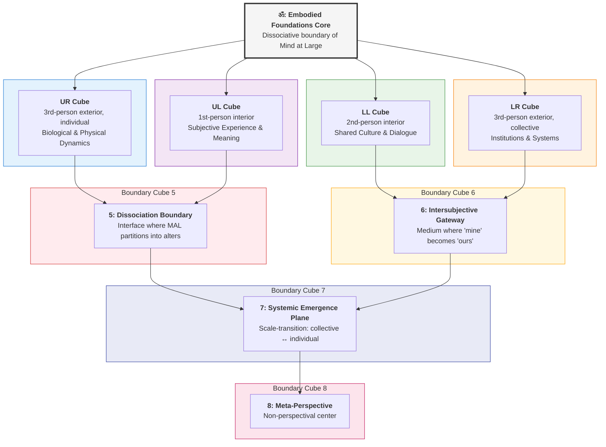
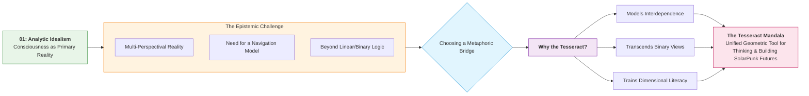
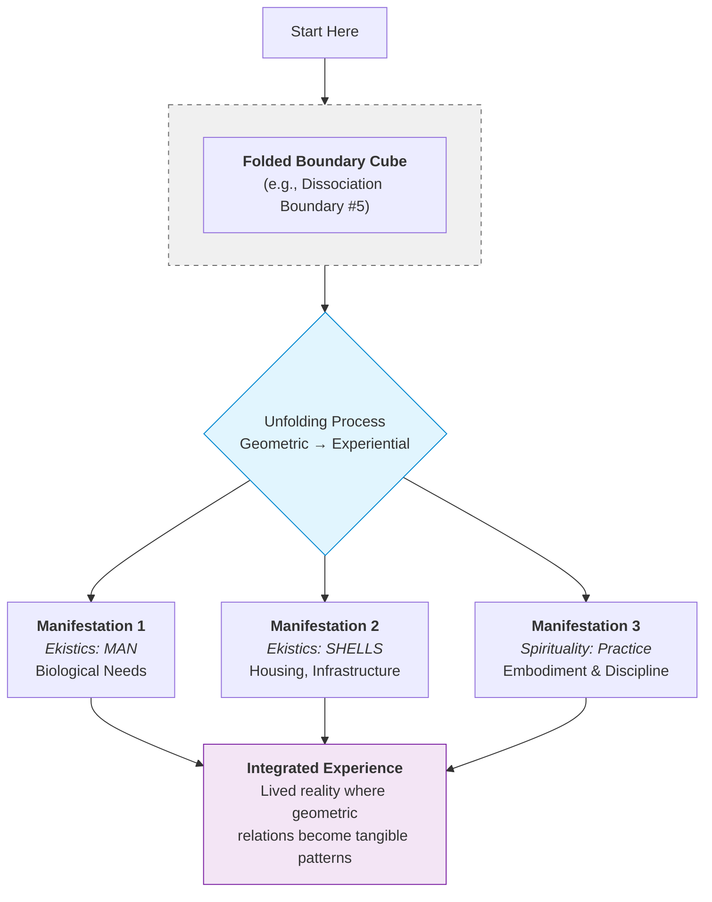
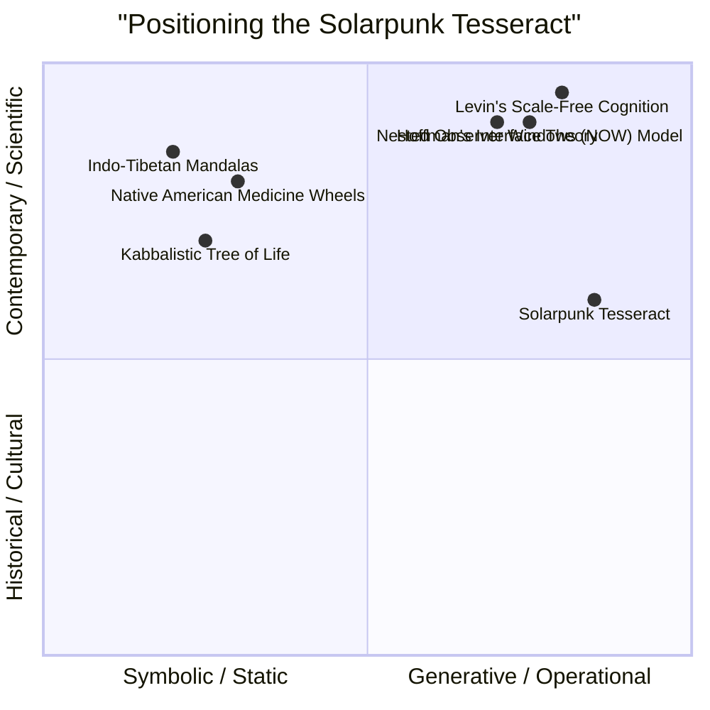

---
aeo_metadata:
  title: "Epistemic Architecture: The Tesseract (Node 02)"
  description: >
    A 4D cognitive model for processing complex, multi-dimensional information
    without reductionism, empirically constrained by neural correlates of
    consciousness and validated through predictable changes in perception.
  context: >
    The toolset for 'how we know what we know' within the framework, integrating
    geometric multi-perspectivalism with neurophysiological and perceptual
    validation protocols.
  key_objectives:
    - Provide a geometric visualization for multi-perspectival cognition.
    - Map the intersection of subjective, objective, collective, and systemic truths.
    - Ground dimensional transitions in empirically-validated neural circuits.
    - Require convergent neural, perceptual, and functional markers for validation.
  core_concepts:
    - Tesseract Mapping
    - 4D Cognition
    - Hypercube Epistemology
    - Multi-perspectivalism
    - Neural Correlates of Consciousness
    - Perceptual Markers
    - Empirical Falsification
  ontological_foundation: >
    Consciousness-first modeling (Analytic Idealism) informed by 4D geometry and
    empirical neuroscience (NCC / IIT-compatible).
  epistemic_constraints:
    - Neural specificity (distinct, dissociable circuits)
    - Perceptual specificity (predictable changes in lived experience)
    - Functional specificity (task, behavioral, or social performance)
  perceptual_framework:
    description: >
      Perception is treated as the conscious interface through which epistemic
      perspectives are accessed, constrained, and validated.
    modalities:
      - vision
      - audition
      - touch
      - interoception
      - proprioception
      - nociception
      - affective_valence
      - social_perception
    role_in_validation: >
      Each epistemic cube must predict characteristic alterations in perception
      under neural perturbation; absence of such changes constitutes falsification.
  perceptual_regeneration:
    definition: >
      The restoration and expansion of healthy perceptual bandwidth across
      individual and collective experience.
    indicators:
      - interoceptive_clarity
      - proportional_salience
      - temporal_depth
      - social_resonance
      - meta_awareness
    design_implication: >
      Systems that narrow perception are extractive even if efficient; systems
      that expand perceptual coherence are regenerative.
  theoretical_references:
    - name: "Interface Theory of Perception"
      author: "Donald D. Hoffman"
      relevance: >
        Provides empirical and evolutionary support for treating perception as an
        adaptive interface rather than a veridical representation of reality.
      usage_note: >
        Used as convergent evidence for interface-based modeling, not as a complete
        ontology.
  search_queries:
    - "Tesseract epistemic model perceptual validation"
    - "4D cognition neural correlates"
    - "multi-perspectival consciousness NCC"
    - "perception as interface neuroscience"
  related_nodes: 
    - 06-geometric-unpacking-tesseract.md
    - 08-multiple-intelligences-framework.md
    - 01-ontology-analytic-idealism.md
---
# Epistemic Architecture: The Tesseract

If consciousness is primary, how does it appear as a multi-perspectival reality? The answer is the tesseract—a four-dimensional hypercube used not as a literal claim, but as a cognitive prosthetic to map the eight cubes of epistemic access, which are observed and integrated from the Central Core (ॐ). The Tesseract claims scale-free applicability. This protocol makes that claim operational through explicit translation rules.

## 🧊 The Knowledge Hypercube

*With our reality defined (01), we now need a structure to organize knowledge within it. Enter the tesseract: a 4D structure that helps us think beyond 3D limitations.* 

**Pedagogical Warning:** This is intentionally disorienting. If you feel confused, that's the point—you're experiencing dimensional expansion.

**Three Ways to Approach This Document:**
1. **Mathematically:** As a 4D hypercube projected to 3D
2. **Metaphorically:** As a way to hold multiple perspectives simultaneously
3. **Practically:** As a navigation system for this repository

## The Geometric Bridge: From Consciousness to Model

Why use a spatial, geometric model to represent a reality where consciousness is primary and non-spatial?

This is a core epistemological choice. Analytic idealism posits that what we perceive as the physical world is the *intrinsic appearance* of conscious activity. However, to think, communicate, and build models about this unified field of consciousness, we require symbolic tools that can handle multi-faceted, interdependent relationships beyond linear logic.

The tesseract (a 4D hypercube) is employed here **not as a literal description of reality**, but as the most robust geometric metaphor for our epistemic situation:
- **Modeling Interdependence:** It allows us to visualize how multiple, seemingly distinct dimensions (e.g., self/other, theory/practice) are inseparable facets of a single, more complex whole.
- **Transcending Binary Logic:** Its 3D "shadows" or projections illustrate how lower-dimensional perspectives (like materialist reductionism) are not *wrong*, but inherently partial views of a higher-dimensional truth.
- **Fostering Dimensional Literacy:** It trains the mind to think in terms of nested, recursive systems and to seek the integrative "higher dimension" that resolves lower-level contradictions.

In essence, we are using the mathematics of geometry as a **bridge language** between direct, non-dual experience (the ontological ground) and the dualistic, relational thinking required for ethical action and systemic design. The following sections unpack how this geometric "API" structures our entire framework.

## The Eight Cubes

| Type | Cube | Description | Rhizomatic Expression |
|------|------|-------------|------------------------|
| Core Ground (Not a Cube) | ॐ: Embodied Foundations Core | Dissociative boundary of Mind at Large experiencing itself—a null point that enables all other perspectives | Nourishment, Cleansing, Restoration, Movement |
| Unfolded Cubes (Inhabitable Perspectives) | UR (3rd-person exterior, individual) | Biological, physical, and spatial dynamics | Ekistics: MAN (Biological Needs), SHELLS (Housing, Infrastructure) |
|  | UL (1st-person interior) | Subjective experience, meaning, and inner life | Circles: SPIRITUALITY (Inner Knowing, Meaning & Narrative) |
|  | LL (2nd-person interior) | Shared meaning, culture, and dialogue | Circles: CULTURE (Identity & Engagement, Enquiry & Learning) |
|  | LR (3rd-person exterior, collective) | Institutions, systems, and collective patterns | Circles: POLITICS, ECONOMICS + Ekistics: SOCIETY, NETWORKS |
| Folded Cubes (Boundary Dimensions) | 5: Dissociation Boundary | Interface where MAL partitions into alters | Ecology: Embodiment & Sustenance + Spirituality: Practice & Discipline |
|  | 6: Intersubjective Gateway | Medium where "mine" becomes "ours" | Spirituality: Community & Ceremony + Politics: Dialogue & Reconciliation |
|  | 7: Systemic Emergence Plane | Scale-transition: collective ↔ individual | Protocol 2: Project Design Integration |
|  | 8: Meta-Perspective | Non-perspectival center equidistant from all quadrants | SolarPunk Compass |

## Tesseract Cell → Intelligence Mapping: The Definitive Table

The Tesseract's 8 cubic cells correspond 1:1 to the 8 Intelligences. This is not metaphorical—it is a structural isomorphism: **each Intelligence is a dimension of MAL's self-observation through a specific dissociation configuration.**

| Tesseract Cell | Geometric Signature | Intelligence (from Doc 08) | Dissociation Function |
|----------------|---------------------|---------------------------|------------------------|
| **Cell ॐ (Seed)** | Internal × Individual × Static | **Intrapersonal** | Self-reflection within bounded alter |
| **Cell 1 (Grid)** | Internal × Individual × Dynamic | **Bodily-Kinesthetic** | Movement intelligence within alter |
| **Cell 2 (Web)** | Internal × Collective × Static | **Interpersonal** | Empathy across dissociation boundaries |
| **Cell 3 (Spire)** | Internal × Collective × Dynamic | **Existential-Spiritual** | Transcendence of boundary constraints |
| **Cell 4 (Mirror)** | External × Individual × Static | **Logical-Mathematical** | Pattern recognition in "matter" |
| **Cell 5 (Flux)** | External × Individual × Dynamic | **Linguistic-Verbal** | Information flow across boundaries |
| **Cell 6 (Weave)** | External × Collective × Static | **Spatial-Visual** | Structural mapping of pattern persistence |
| **Cell 7 (Rhythm)** | External × Collective × Dynamic | **Naturalist-Ecological** | Rhythm intelligence in transpersonal patterns |

### Conceptual Mapping

1. **Intrapersonal ↔ Cell ॐ**: The "seed" of consciousness is the bounded alter observing its own interiority.

2. **Bodily-Kinesthetic ↔ Cell 1**: Movement intelligence is how individual alters navigate their internal dynamic space.

3. **Interpersonal ↔ Cell 2**: The "web" is the network of dissociated alters recognizing each other as subjects.

4. **Existential-Spiritual ↔ Cell 3**: The "spire" is intelligence that perceives the boundaries themselves as contingent.

5. **Logical-Mathematical ↔ Cell 4**: The "mirror" reflects MAL's capacity for pattern recognition in its own extrinsic appearance.

6. **Linguistic-Verbal ↔ Cell 5**: "Flux" is the flow of information across dissociation boundaries—language as boundary-crossing protocol.

7. **Spatial-Visual ↔ Cell 6**: "Weave" maps how patterns persist across space—visual intelligence as pattern topology recognition.

8. **Naturalist-Ecological ↔ Cell 7**: "Rhythm" is the temporal intelligence of transpersonal patterns in their material configuration.

## Neurophysiological Validation with Perceptual Markers

Each Tesseract cube is validated not only by neural correlates, but by **predictable, dissociable changes in conscious perception**. Neural activity that does not produce the expected experiential alteration is insufficient to support a cube mapping.

| Cube | Primary Neural Correlates (NCCs) | Dominant Perceptual Markers | Disruption Signature | Falsification Condition |
|-----|----------------------------------|-----------------------------|----------------------|-------------------------|
| **ॐ Core (Embodied Foundations)** | Brainstem, vagal networks, hypothalamus | Baseline bodily coherence, safety, affective stability | Autonomic dysregulation, perceptual chaos | Stable experience despite core dysregulation |
| **UR (Exterior–Individual)** | Posterior hot zone (occipital–parietal) | Stable sensory objects, spatial coherence, body/world boundary | Fragmented perception, hallucinations, derealization | Intact object perception under posterior disruption |
| **UL (Interior–Individual)** | CMS, insula, ACC | Felt meaning, emotional tone, self-presence | Emotional flattening, depersonalization | Normal subjective valence despite CMS impairment |
| **LL (Interior–Collective)** | IFG, IPL, mirror neuron systems | Empathy, social attunement, shared meaning | Social blindness, loss of resonance | Preserved social understanding despite mirror disruption |
| **LR (Exterior–Collective)** | dlPFC, executive networks | Rule-based cognition, institutional perception | Disorganized systems thinking | Intact systemic reasoning under executive disruption |
| **Cube 5 (Dissociation Boundary)** | Claustrum, salience network | Pain, threat, perceptual prioritization | Hypervigilance or numbing | Normal salience gating under perturbation |
| **Cube 6 (Intersubjective Gateway)** | TPJ, striatum | Synchrony, “mine → ours” transitions | Social desynchronization | Collective attunement preserved despite TPJ impairment |
| **Cube 7 (Emergence / Scale)** | Hippocampal–entorhinal system | Temporal depth, scale navigation | Present-lock, loss of future sense | Long-horizon orientation intact |
| **Cube 8 (Meta-Perspective)** | ACC, frontoparietal meta-control | Perceptual decentering, awareness of awareness | Cognitive fixation | Meta-awareness intact under ACC disruption |

**Validation Criterion:**  
A cube is considered empirically supported only if **neural, perceptual, and functional markers converge**.

### Falsification Tests for Mapping Validity

**Test 1: Double Dissociation of UL vs. UR**
- **Prediction**: vmPFC lesion (UL) impairs self-reported emotional valence but NOT emotion recognition in others (LL); posterior lesion (UR) impairs sensory perception but NOT self-narrative.
- **Method**: Voxel-based lesion-symptom mapping in 50+ patients.
- **Failure Mode**: Overlap >30% between UL/UR impairment patterns = arbitrary mapping.

**Test 2: Social Contingency Specificity of LL**
- **Prediction**: Mirror neuron mu-rhythm suppression is significantly stronger (p < 0.01) during live face-to-face interaction vs. video observation.
- **Method**: Dual-EEG hyperscanning mother-infant paradigm [^24^].
- **Failure Mode**: Equal activation across conditions = LL not specific to 2nd-person.

**Test 3: Scale-Free Causal Coupling**
- **Prediction**: Thalamic intralaminar nuclei lesion impairs BOTH individual Φ and community 2D-integration capacity (LR↔UL coupling).
- **Method**: Measure individual EEG Φ and group decision-making quality pre/post sleep deprivation (thalamic dysregulation) [^25^].
- **Failure Mode**: Individual impairment does NOT predict group dysfunction = Cube 7 mapping invalid.

### Perceptual Falsification Layer: From Neural Correlates to Lived Experience

Neural correlates alone are insufficient to validate an epistemic architecture unless they are paired with **systematic changes in reported perception**. Because this framework treats perception as the conscious interface through which reality appears, each Tesseract cube must satisfy a **dual-constraint**:

1. **Neural specificity** (distinct, dissociable circuits)
2. **Perceptual specificity** (predictable alterations in experience)

A cube mapping is considered *invalid* if neural disruption does not produce the corresponding perceptual change.

#### Perceptual Predictions by Cube (Testable)

| Cube | Neural Perturbation | Required Perceptual Effect | Falsification Condition |
|-----|--------------------|----------------------------|-------------------------|
| **UR (Posterior Hot Zone)** | Parietal–occipital disruption | Loss or fragmentation of sensory objects (vision, sound, body boundaries) | Intact perception despite posterior disruption |
| **UL (CMS / Insula)** | vmPFC / ACC disruption | Flattened affect, loss of felt meaning, depersonalization | Normal subjective valence despite CMS impairment |
| **LL (Mirror / Social Circuits)** | IFG / IPL disruption | Preserved object perception but impaired social resonance and empathy | Social understanding intact despite mirror system disruption |
| **LR (Control Networks)** | dlPFC disruption | Intact perception but degraded rule-following and institutional cognition | Systemic reasoning intact despite control network impairment |
| **Cube 5 (Claustrum / Salience)** | Claustrum or insula disruption | Abnormal salience assignment (pain, threat, overwhelm or numbing) | Normal salience gating under perturbation |
| **Cube 6 (TPJ / Striatum)** | TPJ disruption | Impaired “mine → ours” transitions; social desynchronization | Collective attunement unaffected |
| **Cube 7 (Hippocampal–Entorhinal)** | Grid-place disruption | Loss of temporal depth and scale navigation | Preserved long-horizon orientation |
| **Cube 8 (ACC / Meta-control)** | ACC disruption | Reduced perceptual decentering; fixation on single perspective | Normal meta-awareness despite impairment |

---

#### Interpretation Rule

A valid Tesseract mapping requires **coherence across three layers**:

- Neural activity (NCC)
- Perceptual phenomenology (first-person reports)
- Functional capacity (task or social performance)

Failure in any layer constitutes a **failed mapping**, not an interpretive disagreement.

This perceptual falsification layer ensures that the Tesseract remains:
- empirically constrained
- phenomenologically grounded
- resistant to metaphor drift

### Integration: The 24 Faces as Known Tracts

Each Tesseract face corresponds to a documented white matter pathway:

| Face | Connects | Tract | Function |
|------|----------|-------|----------|
| UL→UR | Self ↔ Body | L5p neuron bifurcation | Causal integration of state and content |
| UL→LL | Self ↔ Other | Superior Longitudinal Fasciculus III | CMS to MNS feedforward |
| UR→LR | Body ↔ System | Superior Longitudinal Fasciculus I | Bottom-up saliency to top-down control |

**Validation**: DTI tractography must show that tract strength predicts cross-cube performance (e.g., SLF III integrity correlates with empathy accuracy).

### Clinical Translation: PTSD as Inter-Cube Dysfunction

**Neurosignature of Trauma**: Reduced CMS↔IFG functional connectivity (UL→LL) with intact posterior hot zone (UR). Patient feels body but cannot share experience.

**Intervention**: Mandala Healing Pathway targets L5p coupling via 40 Hz tACS to thalamocortical loop. Expected outcome: connectivity increase Δr > 0.3 predicts symptom reduction.

**If No Change**: Mapping is epiphenomenal, not causal.

## Perceptual Modalities Across the Tesseract

The eight cubes of the Tesseract are not abstract perspectives alone — they correspond to **distinct configurations of perceptual access** within the conscious interface. Each cube privileges, suppresses, or integrates specific perceptual modalities.

| Tesseract Cube | Primary Perceptual Modalities | Functional Role in Experience |
|---------------|------------------------------|-------------------------------|
| **ॐ (Embodied Foundations Core)** | Interoception, affective valence, baseline bodily sensing | Establishes perceptual stability and coherence; without this core, higher-dimensional cognition collapses into survival mode |
| **UR (3rd-person exterior, individual)** | Vision, audition, touch, smell, taste | Constructs the experienced “physical world”; sensory binding and object perception |
| **UL (1st-person interior)** | Interoception, emotional tone, pain meaning, self-referential affect | Generates felt meaning, identity, and narrative continuity |
| **LL (2nd-person interior)** | Social touch, facial expression, vocal tone, gaze perception | Enables intersubjective resonance, empathy, and shared reality |
| **LR (3rd-person exterior, collective)** | Aggregated sensory data, environmental signals, metrics | Translates perception into systems, rules, and institutional feedback |
| **Cube 5 – Dissociation Boundary** | Pain, threat detection, salience modulation | Gates perceptual bandwidth; regulates what enters awareness as “important” |
| **Cube 6 – Intersubjective Gateway** | Social salience, synchrony, rhythmic entrainment | Transforms “mine” into “ours” through shared perceptual fields |
| **Cube 7 – Systemic Emergence Plane** | Temporal perception, pattern persistence, spatial navigation | Enables scale transitions and long-horizon orientation |
| **Cube 8 – Meta-Perspective** | Attentional flexibility, perceptual decentering | Allows perception of perception; non-identification with any single interface |

**Interpretive Rule:**  
If a cube is impaired or suppressed, the corresponding perceptual modalities will show distortion, narrowing, or overload — providing empirical and phenomenological markers for diagnosis and intervention.

---

## From Ontology to Epistemology: The Tesseract as Geometric Bridge

The previous section established our ontological foundation: **Analytic Idealism**, where consciousness is primary. This raises a critical epistemological question: *How can we model, understand, and navigate a reality that is fundamentally conscious and multi-perspectival?* The move from ontology (what *is*) to epistemology (how we *know*) requires a framework that can handle complexity without collapsing into reductionism.

This is why we employ the **Tesseract (4D hypercube)** as our core epistemic metaphor. It is not merely a decorative symbol but a functional geometric logic that addresses specific limitations in our thinking.

### Why a Tesseract? The Limits of Flat Models

Traditional models of complex systems—whether in sustainability, psychology, or social theory—tend to be "flat." They either:
1.  **Isolate dimensions** (e.g., a 2D graph of economics vs. ecology), losing their interdependence.
2.   **Create overwhelming spaghetti diagrams** where every node connects to every other, losing all clarity.

The Tesseract offers a third way. As a 4D shape projected into 3D/2D, it natively represents **simultaneous interconnection and distinction**. Each of the Eight Cubes maintains its own structural integrity (a distinct perspective or domain), while being inextricably linked to the whole through edges and vertices. This mirrors the core ontological premise: multiple, distinct perspectives (cubes) are irreducible facets of a unified, conscious whole (the tesseract).

#### Scientific Validation: Scale-Free Cognition and the Tesseract
🔍 **Scientific Grounding**: Levin (2019) demonstrates that cognition operates across biological scales through bioelectric networks with computational boundaries. The Tesseract models this topology formally. [Levin, M. (2019). The Computational Boundary of a "Self": Developmental Bioelectricity Drives Multicellularity and Scale-Free Cognition. *Frontiers in Psychology*, 10, 2688.]. 

Capabilities like problem-solving, memory, and goal-directedness are not exclusive to human brains but exist on a continuum from single cells to complex animal collectives. This means that the intelligence and agency modeled within one "cube" of the Tesseract (e.g., the individual in the **MAN** cube) is of the same fundamental nature, though different in degree and expression, as the intelligence of a community (**SOCIETY** cube) or an ecosystem (**ECOLOGY** cube). The Tesseract is therefore not merely a useful metaphor but a **geometric map of isomorphic cognitive processes** unfolding at different levels of organization. The connections between cubes represent the real communicative and regulatory channels through which these nested cognitive systems influence one another.

### The Mandala as Cultural Tesseract

The geometric intuition of "multi-dimensional unity" is not new or exclusive to Western mathematics. Across cultures, humans have developed symbolic systems to represent this same epistemic challenge:

*   **Indo-Tibetan Mandalas:** These are precisely geometric maps of a multi-dimensional universe, used as meditation tools to navigate from ordinary perception (the outer squares/gates) to enlightened awareness (the center). They are epistemic guides for consciousness.
*   **Native American Medicine Wheels:** Circular frameworks dividing life into four (or more) directions/elements, emphasizing their balance and interaction within a sacred hoop. They model a holistic system of relationships.
*   **Hindu/Buddhist Cosmology (Mount Meru, Lokas):** Depictions of multi-layered realities (lokas) interpenetrating one another, not as separate places but as different vibrational or qualitative dimensions of existence.
*   **Kabbalistic Tree of Life:** A glyph of ten spheres (Sephirot) connected by 22 paths, mapping the emanation of the divine into the material and the conscious journey back toward unity. It is a system of relational ontology.

These are all, in essence, **cultural tesseracts**. They use geometric or symbolic logic to model a reality that is simultaneously unified and multifaceted. They are tools for "higher-dimensional thinking"—not in a literal sci-fi sense, but in the cognitive sense of holding multiple, interdependent perspectives in mind at once.

### The SolarPunk Tesseract: A Tool for Integration

Our Tesseract model builds on this ancient human impulse but grounds it in a modern, explicit framework:
1.  **It is generative:** The 8 cubes are not fixed symbols but flexible containers for mapping any complex system (a community, a project, an ecosystem).
2.  **It is relational:** The edges and vertices force us to define the *nature of the connections* between domains (e.g., How does the "Inner World" cube directly share an edge with the "Built Environment" cube?).
3.  **It is scalable:** The same 4D logic can be applied at different levels, from personal development to global civilization, maintaining the same epistemic "grammar."

Thus, the Tesseract Mandala is our chosen **epistemic architecture** because it provides a geometric language capable of expressing our **ontology of conscious unity-in-diversity**. It turns the philosophical premise of Analytic Idealism into a practical, visual, and systematic tool for thinking and building. It allows us to design for a SolarPunk future not as a collection of isolated solutions, but as a coherent, integrated pattern in the fabric of conscious experience.

#### The Science of Perception: Nested Observer Windows & Conscious Interfaces
The Tesseract's geometry of multiple, interconnected perspectives finds robust validation in contemporary models of consciousness and perception. Two complementary frameworks—**Donald Hoffman's Interface Theory of Perception** and the **Nested Observer Windows (NOW) Model by Justin Riddle & Jonathan Schooler**—provide a scientific foundation for this epistemic architecture.

**Hoffman's Interface Theory** posits that perceptual experiences (space, time, objects) do not depict reality as it is but form a species-specific **user interface**. This interface evolved to guide adaptive behavior by hiding the true, vastly complex nature of reality, which may be a network of "conscious agents." From this perspective, each cube of the Tesseract (ECOLOGY, SOCIETY, SPIRITUALITY, etc.) can be understood as a **specialized "desktop" or portal** within our collective conscious interface, optimized for navigating a particular domain of survival and flourishing.

The **Nested Observer Windows (NOW) Model** provides the structural mechanism for such an interface. It proposes that consciousness is fundamentally hierarchical, with "observer windows" nested within one another—from the fast, localized processing of neurons to the slow, integrated awareness of the whole brain. This creates a **recursive information-processing hierarchy** where higher-level windows (with broader spatial and temporal integration) govern and are informed by lower-level ones.

**Synthesis for the Mandala:** The Tesseract is a map of our **collective, multi-scale conscious interface**. Its eight cubes represent major, semi-autonomous "observer windows" within the social mind. The connections between cubes are the communicative channels through which these windows exchange information and negotiate a shared reality. The model's scalability—from individual to bioregional—mirrors the fundamental nestedness of observer systems, validating the application of the same geometric logic across different levels of a conscious hierarchy.

## Scale Translation Principle: Conditional Correspondence

**"As above, so below" is true IF boundary conditions are equivalent.**

### When Correspondence Holds
- **Isolated systems**: Individual in forest monastery ↔ isolated community
- **Equilibrium states**: Personal coherence = 4 AND Community coherence = 4
- **Homogeneous boundaries**: Similar dissociation patterns across scales

### When Correspondence Breaks
- **System coupling**: Individual in oppressive system (Personal=4, Community=1)
- **Boundary mismatch**: Different phase attractors at different scales
- **Power asymmetries**: Micro-level changes blocked by macro-level structures

### Operational Rule
**Always check boundary equivalence before applying micro insights to macro problems.**

## Key Integration Principles

- **The Embodied Foundations are not a layer within the model—they are the geometric and functional core from which all other dimensions unfold.** Without this foundation, higher-dimensional work collapses into bypassing.
- **Cube 6 Integration:** Cube 6 can be understood through Froese's irruption theory as spaces where individual 'irruptions' (increased underdetermination of material processes through motivational involvement) scale up to collective transformations. When individual neural entropy increases during meaningful ritual or dialogue, it creates conditions for system-wide phase transitions.

## Integration Note
The Embodied Foundations are not "lower" in value but foundational in function—like roots to a tree. When any foundation is compromised, the entire system contracts dimensionally toward survival mode (0D). When all foundations are strong, the system has the stability to unfold toward higher dimensions of complexity and coherence (3D+).

## 🧭 Next Rotation

Now that we have our 4D structure, we need **ethical guidelines** for navigating it. How do we move through this tesseract responsibly?

**Next Document:** [03 - The Ethics of Navigation →](03-ethics-four-axes.md)

*With great dimensional power comes great ethical responsibility.*
