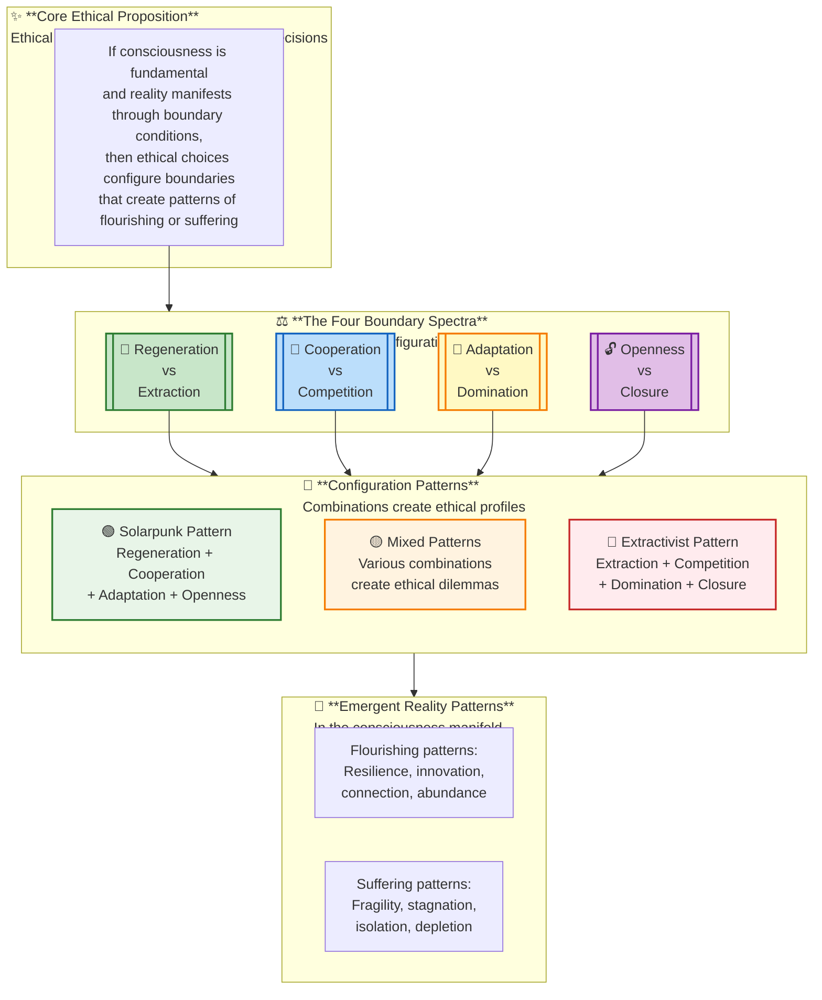
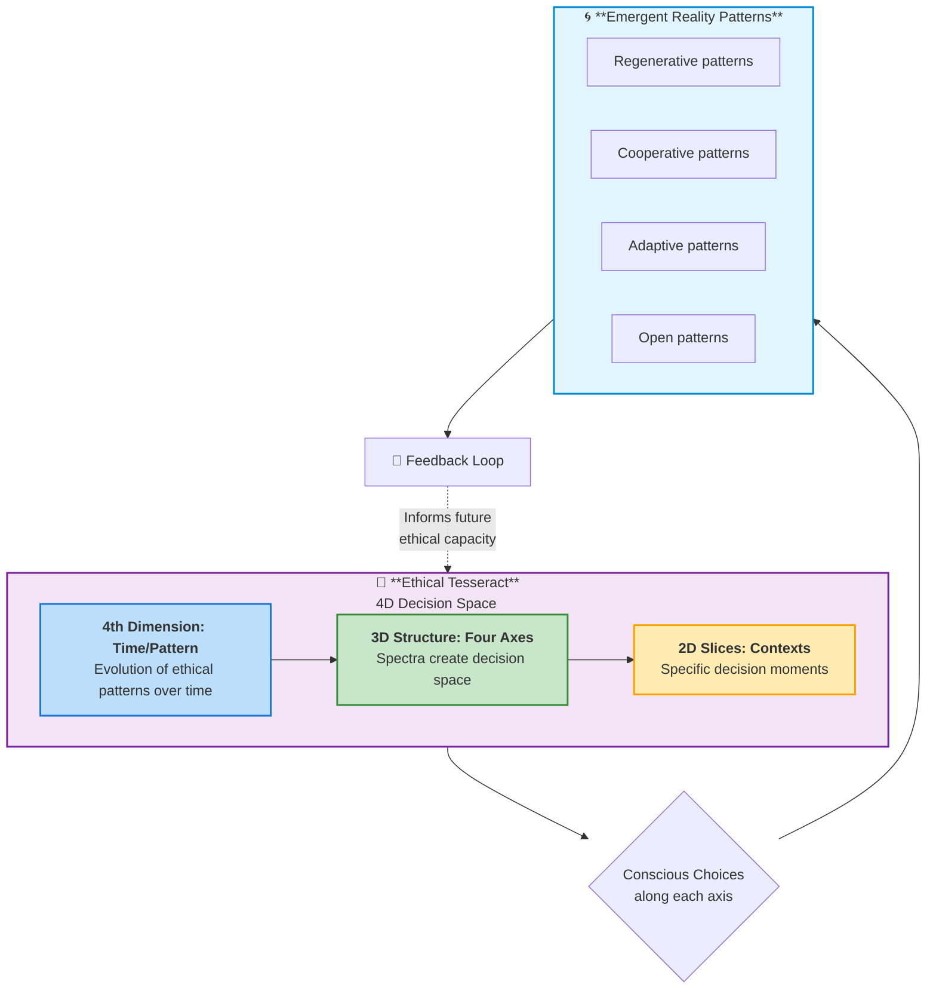
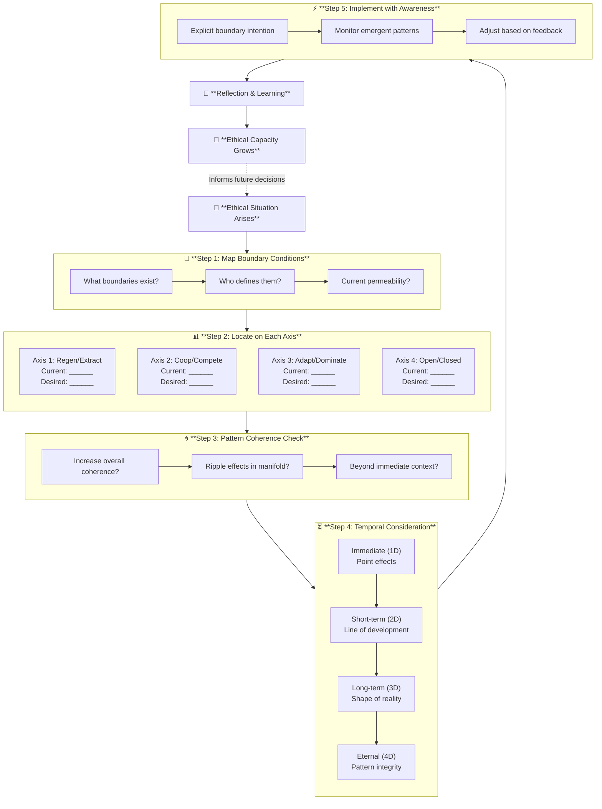
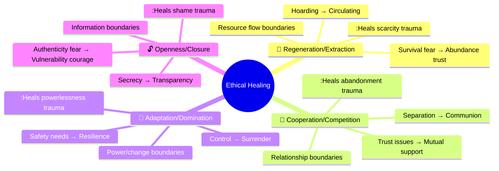
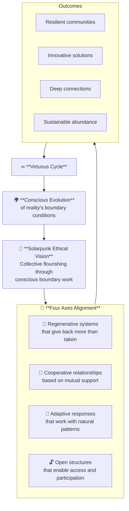

---
aeo_metadata:
  title: "Ethics: The Four Axes (Node 03)"
  description: "An ethical framework grounded in analytic idealism that maps boundary configuration choices to patterns of flourishing or suffering in the consciousness manifold."
  context: "The operational moral compass for Solarpunk praxis, translating ontological claims into practical boundary work."
  key_objectives:
    - Define the four boundary configuration spectra: Regeneration vs Extraction, Cooperation vs Competition, Adaptation vs Domination, Openness vs Closure
    - Provide practical tools for ethical decision-making as conscious boundary work
    - Connect ethical choices to dissociation boundary healing and pattern emergence
    - Enable alignment of individual and collective action with Solarpunk flourishing
  core_concepts:
    - Boundary Ethics: Ethics as conscious boundary configuration
    - Pattern Ethics: Ethical choices as pattern coherence decisions
    - Four Axes Spectra: Regeneration/Extraction, Cooperation/Competition, Adaptation/Domination, Openness/Closure
    - Ethical Tesseract: 4D model of ethical decision space
    - Solarpunk Praxis: Regenerative, cooperative, adaptive, open configurations
  ontological_foundation: "Analytic Idealism / Boundary Conditions in Consciousness / Pattern Logic"
  epistemic_framework: "Tesseract Geometry / 4D Hyperslices / Recursive Feedback"
  operational_focus: "Practical boundary work, decision protocols, community applications"
  search_queries:
    - "Solarpunk ethical framework regeneration extraction cooperation"
    - "Consciousness ethics boundary work decision making"
    - "Ethical tesseract four axes spectrum"
    - "Analytic idealism practical ethics boundary conditions"
  related_nodes: 
    - "01-ontology-analytic-idealism.md (foundational ontology)"
    - "02-epistemic-architecture-tesseract.md (geometric framework)"
    - "05-dissociation-boundaries.md (boundary healing context)"
    - "06-solarpunk-praxis.md (practical implementation)"
  framework_status: "Stable (revised 2024)"
  last_updated: "[Current Date]"
  revision_notes: "Completely restructured to ground ethics in boundary conditions, added practical tools, integrated with tesseract model"
  validation_status: "Internally consistent with ontology, pending community feedback"
  application_areas:
    - "Personal ethical discernment"
    - "Community decision-making"
    - "Systemic design evaluation"
    - "Boundary healing protocols"
  implementation_levels:
    - Individual: Daily boundary awareness practices
    - Community: Collective decision protocols
    - Systemic: Institutional design principles
  boundary_connections:
    primary: "Configures dissociation boundaries in consciousness"
    secondary: "Shapes experiential reality through boundary choices"
    tertiary: "Feeds back into ontological understanding through practice"
---
# Ethics: Four Axes for Solarpunk Praxis

## **Introduction: Ethics as Boundary Work**

> *"We shape our boundaries, and then our boundaries shape us. Ethics is the conscious art of this shaping."*

This ethical framework emerges directly from our ontological foundation: if consciousness is fundamental and reality manifests through boundary conditions, then **ethics becomes boundary work**. Each ethical choice reconfigures the boundaries within consciousness, creating different patterns of reality.

The four axes represent the primary dimensions along which we can consciously configure boundary conditions in service of collective flourishing. They are not arbitrary moral rules, but descriptions of how different boundary configurations produce different experiential outcomes in the consciousness manifold.

### **The Bridge: From Ontology to Ethical Practice**

| **Ontological Claim** | **Ethical Implication** | **Boundary Work Required** |
|----------------------|------------------------|----------------------------|
| Consciousness is fundamental | Honor the experiential nature of all beings | Respect interiority and subjective experience |
| Boundaries structure reality | Choose boundary configurations consciously | Develop boundary awareness and skill |
| Patterns create coherence | Align actions with generative patterns | Learn to recognize and cultivate healthy patterns |
| Ekistic-spiritual integration | Address all domains of human need | Balance biological, built, and spiritual considerations |

---

## **The Ethical Foundation: From Is to Ought**

### **Consciousness-Based Ethics**

Unlike ethical systems derived from abstract principles or social contracts, this framework emerges from our fundamental nature as consciousness. Since all experience happens within consciousness, ethics becomes:

1. **Experiential Ethics**: Prioritizing experiences that increase flourishing
2. **Boundary Ethics**: Configuring boundaries to support healthy relationships
3. **Pattern Ethics**: Choosing actions that create coherent, generative patterns

### **The Solarpunk Ethical Imperative**

Solarpunk's vision of a regenerative, just, and beautiful future requires specific boundary configurations. Each ethical choice moves us toward or away from that vision by altering the boundary conditions of our collective consciousness.

---

## **The Four Axes: Ethical Dimensions as Boundary Spectra**

Each axis represents a continuum of possible boundary configurations, not a binary choice. Our position along each spectrum determines the patterns that emerge in our lived reality.




---

### **🔄 Axis 1: Regeneration vs. Extraction**

**Boundary Condition:** *How systems define their relationship with energy and information flows*

| **Aspect** | **Regenerative Pole** | **Extractive Pole** |
|------------|-----------------------|---------------------|
| **Boundary Configuration** | Permeable, reciprocal boundaries | One-way, draining boundaries |
| **Pattern Logic** | Feedback loops increasing vitality | Linear consumption degrading systems |
| **Flow Direction** | Circular, giving back more than taken | Linear, taking without return |
| **Time Horizon** | Multi-generational, sustainable | Immediate gratification, depleting |
| **Energy Relationship** | Works with natural energy flows | Overrides and depletes energy sources |
| **Solarpunk Manifestation** | Closed-loop systems, mycelial networks | Colonial economics, soil depletion |

**Boundary Work Questions:**
- Are we creating feedback loops or dead ends?
- Does this exchange increase or decrease overall vitality?
- Are we giving back more than we take?

**Practice Examples:**
- Individual: Composting, energy conservation
- Community: Community-supported agriculture
- Systemic: Circular economy, regenerative agriculture

---

### **🤝 Axis 2: Cooperation vs. Competition**

**Boundary Condition:** *How relationships and resources are structured between entities*

| **Aspect** | **Cooperative Pole** | **Competitive Pole** |
|------------|----------------------|----------------------|
| **Boundary Configuration** | Interconnected, permeable boundaries | Fortified, exclusive boundaries |
| **Pattern Logic** | Mutual support networks | Zero-sum games, winners and losers |
| **Resource Allocation** | Shared according to need | Hoarded according to power |
| **Conflict Resolution** | Consensus, restorative justice | Domination, punitive measures |
| **Success Metric** | Collective flourishing | Individual advantage |
| **Solarpunk Manifestation** | Mutual aid networks, commons | Corporate monopolies, proprietary systems |

**Boundary Work Questions:**
- Does this create more connection or separation?
- Are we playing positive-sum or zero-sum games?
- Who benefits, and who pays the cost?

**Practice Examples:**
- Individual: Skill-sharing, emotional support
- Community: Consensus decision-making, time banking
- Systemic: Cooperative ownership, universal basic services

---

### **🌱 Axis 3: Adaptation vs. Domination**

**Boundary Condition:** *How systems relate to change and uncertainty*

| **Aspect** | **Adaptive Pole** | **Dominating Pole** |
|------------|-------------------|---------------------|
| **Boundary Configuration** | Flexible, responsive boundaries | Rigid, controlling boundaries |
| **Pattern Logic** | Emergence, self-organization | Command and control hierarchies |
| **Change Response** | Embrace and work with change | Resist and control change |
| **Knowledge Approach** | Local, experiential, distributed | Centralized, abstract, expert-only |
| **Error Handling** | Learning opportunities | Failures to be punished |
| **Solarpunk Manifestation** | Permaculture design, biomimicry | Industrial monoculture, concrete jungles |

**Boundary Work Questions:**
- Are we working with or against natural patterns?
- Does this increase or decrease resilience?
- Are we controlling or collaborating?

**Practice Examples:**
- Individual: Mindfulness, flexibility in plans
- Community: Participatory budgeting, adaptive governance
- Systemic: Ecosystem-based management, regenerative design

---

### **🔓 Axis 4: Openness vs. Closure**

**Boundary Condition:** *How information, resources, and participation are regulated*

| **Aspect** | **Open Pole** | **Closed Pole** |
|------------|---------------|----------------|
| **Boundary Configuration** | Transparent, accessible boundaries | Opaque, restricted boundaries |
| **Pattern Logic** | Distributed intelligence, innovation | Centralized control, stagnation |
| **Information Flow** | Free sharing, commons-based | Proprietary, secretive |
| **Decision Making** | Inclusive, participatory | Exclusive, authoritarian |
| **Identity Formation** | Fluid, inclusive categories | Rigid, exclusionary categories |
| **Solarpunk Manifestation** | Open-source everything, radical transparency | Intellectual property walls, surveillance states |

**Boundary Work Questions:**
- Who has access, and who is excluded?
- What information is hidden, and why?
- Are boundaries protecting or imprisoning?

**Practice Examples:**
- Individual: Vulnerability, honest communication
- Community: Open meetings, transparent finances
- Systemic: Open government data, creative commons licensing

---

## **Integration: The Ethical Tesseract**

The four axes interact in multidimensional space, creating an "ethical tesseract" of possible boundary configurations. Each ethical decision exists in this 4D space, with implications across all dimensions.



### The Ethical Compass: A Quick-Reference Tool

```markdown
            REGENERATION
               ↑
               |
    OPENNESS ← + → CLOSURE
               |
               ↓
           EXTRACTION

CENTER: Current ethical position
ARROWS: Available movement along each axis
```


**Using the Compass:**
1. **Locate** your current position for a given situation
2. **Identify** desired movement along each axis
3. **Notice** tensions between different axes
4. **Choose** actions that move toward desired configuration

---

## **Practical Applications**




### **Ethical Decision Protocol: A Boundary Work Practice**

#### **Step 1: Map the Boundary Conditions**
- What boundaries are present in this situation?
- Who/what defines these boundaries?
- How permeable are they currently?

#### **Step 2: Locate on Each Axis**
For each of the four axes:
- Current position on spectrum: ______
- Desired Solarpunk-aligned position: ______
- Movement required: ______

#### **Step 3: Pattern Coherence Check**
- Does this decision increase overall pattern coherence?
- What ripple effects through the consciousness manifold?
- How does this affect boundary conditions beyond immediate context?

#### **Step 4: Temporal Consideration**
- **Immediate effects** (1D: point in time)
- **Short-term patterns** (2D: line of development)
- **Long-term evolution** (3D: shape of reality)
- **Eternal implications** (4D: overall pattern integrity)

#### **Step 5: Implementation with Awareness**
- Proceed with explicit boundary intention
- Monitor for emergent patterns
- Adjust based on feedback from the system

### **Solarpunk Scenarios: Applying the Four Axes**

#### **Scenario 1: Community Energy Decision**
- **Axis 1**: Choose regenerative solar (give back to grid) vs extractive coal (deplete resources)
- **Axis 2**: Cooperative ownership (shared benefits) vs corporate competition (private profit)
- **Axis 3**: Adaptive micro-grid (resilient to disruption) vs dominating central plant (vulnerable)
- **Axis 4**: Open-source designs (community can repair) vs proprietary technology (dependent on corporation)

#### **Scenario 2: Urban Food System**
- **Axis 1**: Regenerative permaculture (builds soil) vs extractive agriculture (depletes soil)
- **Axis 2**: Food cooperatives (shared risk/benefit) vs competitive supermarkets (profit-driven)
- **Axis 3**: Adaptive polycultures (respond to conditions) vs dominating monoculture (forces conditions)
- **Axis 4**: Open seed libraries (community access) vs closed patented seeds (corporate control)

#### **Scenario 3: Community Governance**
- **Axis 1**: Regenerative leadership (empowers others) vs extractive leadership (drains community)
- **Axis 2**: Cooperative consensus (everyone's voice) vs competitive politics (winners take all)
- **Axis 3**: Adaptive governance (responds to needs) vs rigid bureaucracy (enforces rules)
- **Axis 4**: Open transparent processes (everyone can see) vs closed decision-making (few decide)

---

## **Ethics Across Domains: The Ekistic-Spiritual Mapping**

| **Axis** | **MAN (Biological)** | **SHELLS (Built)** | **NETWORKS (Social)** | **PRACTICE (Spiritual)** |
|----------|----------------------|---------------------|-----------------------|--------------------------|
| **Regen/Extract** | Soil health, nutrition | Energy-positive buildings | Mutual aid vs charity | Energy exchange in ritual |
| **Coop/Compete** | Symbiosis in microbiome | Co-housing design | Consensus governance | Collaborative ceremony |
| **Adapt/Dominate** | Permaculture principles | Modular, adaptable architecture | Emergent leadership | Surrender to divine will |
| **Open/Closed** | Genetic diversity, microbiome | Open-source designs, repairability | Transparent governance | Ecstatic dissolution of ego |

---

## **Ethics as Dissociation Boundary Navigation**



Each ethical axis corresponds to healing a specific type of dissociation boundary:

| **Axis** | **Boundary Type** | **Healing Path** | **Trauma Pattern Addressed** |
|----------|-------------------|------------------|------------------------------|
| **Regen/Extract** | Resource flow boundary | From hoarding to circulating | Scarcity trauma, survival fear |
| **Coop/Compete** | Relationship boundary | From separation to communion | Abandonment trauma, trust issues |
| **Adapt/Dominate** | Power boundary | From control to surrender | Powerlessness trauma, safety needs |
| **Open/Closed** | Information boundary | From secrecy to transparency | Shame trauma, authenticity fear |

**Ethical work = Boundary healing work**: Every ethical choice reconfigures our dissociation boundaries in the consciousness manifold, either reinforcing or healing trauma patterns.

---

## **Integration with Core Framework**

### **Connection to Analytic Idealism**
- Ethical choices configure boundary conditions within consciousness
- Different configurations create different experiential realities
- There is no "neutral" ethics—every choice shapes reality

### **Connection to Tesseract Model**
- Each axis represents a dimension in the ethical tesseract
- Ethical decisions create different "slices" through the 4D structure
- The tesseract shows how ethical dimensions interact non-linearly

### **Connection to Solarpunk Vision**
- The four axes define the ethical shape of Solarpunk society
- Moving toward regenerative, cooperative, adaptive, open configurations
- Ethics as the practical implementation of Solarpunk values

---

## **A Living Framework for Practice**

```mermaid
flowchart LR
    subgraph Individual["👤 **Individual Scale**"]
        I1["Morning intention<br>setting"]
        I2["Decision pauses"]
        I3["Evening reflection"]
    end
    
    subgraph Community["👥 **Community Scale**"]
        C1["Ethical check-ins"]
        C2["Pattern mapping"]
        C3["Boundary ceremonies"]
    end
    
    subgraph Systemic["🏛️ **Systemic Scale**"]
        S1["Institutional design"]
        S2["Policy evaluation"]
        S3["Cultural narrative"]
    end
    
    Individual -- Boundary awareness --> Community
    Community -- Collective alignment --> Systemic
    Systemic -- Supportive structures --> Individual
    
    AllScales["⚖️ **All Scales Interact**<br>Ethical patterns resonate<br>across consciousness manifold"] --> Feedback
    
    Feedback["🔄 **Recursive Evolution**<br>Experiences at one scale<br>inform all others"]
    
    Feedback -.-> Individual
    Feedback -.-> Community
    Feedback -.-> Systemic
    
    classDef individual fill:#e8f5e8,stroke:#2e7d32,stroke-width:2px
    classDef community fill:#e3f2fd,stroke:#1565c0,stroke-width:2px
    classDef systemic fill:#f3e5f5,stroke:#7b1fa2,stroke-width:2px
```



This framework is not a rigid moral code but a living tool for conscious boundary work. As we practice:

1. **We develop ethical discernment** through pattern recognition
2. **We cultivate boundary flexibility** through conscious choice
3. **We participate in reality creation** through intentional configuration

### **Practice Suggestions**

#### **Daily Practice**
- **Morning intention**: Set ethical compass for the day
- **Decision pauses**: Check alignment with four axes before significant choices
- **Evening reflection**: Review boundary work and pattern observations

#### **Community Practice**
- **Ethical check-ins**: Regular community alignment on boundary configurations
- **Pattern mapping**: Collective observation of emergent patterns from choices
- **Boundary ceremonies**: Rituals to consciously reconfigure community boundaries

#### **Systemic Practice**
- **Institutional design**: Build systems that encourage Solarpunk-aligned configurations
- **Policy evaluation**: Assess proposals against the four axes
- **Cultural narrative**: Tell stories that reinforce regenerative, cooperative values

---

## **Conclusion: Ethics as Conscious Evolution**



This framework reveals ethics not as compliance with external rules, but as participation in the conscious evolution of reality's boundary conditions. Each ethical choice:

1. **Configures boundaries** in the consciousness manifold
2. **Creates patterns** of experience and relationship
3. **Shapes the future** by establishing precedent and momentum

As we collectively:

- **Shift from extraction to regeneration** → We heal resource flow boundaries
- **Shift from competition to cooperation** → We heal relationship boundaries  
- **Shift from domination to adaptation** → We heal power boundaries
- **Shift from closure to openness** → We heal information boundaries

We're not just making ethical choices—we're participating in the healing of dissociation boundaries at personal, community, and species levels. Each decision becomes a hyperslice through the ethical tesseract, manifesting particular configurations of the consciousness manifold.

**Thus, Solarpunk ethical practice = Conscious boundary work in service of collective flourishing.**

---

### **Next Steps for Practice**

1. **Start small**: Choose one axis to focus on for a week
2. **Map your context**: Identify boundary configurations in your life/community
3. **Experiment**: Try small boundary reconfigurations and observe effects
4. **Share**: Discuss ethical boundary work with others
5. **Evolve**: Let your ethical practice grow with your understanding

Remember: The goal is not perfection but conscious participation. Every moment offers an opportunity for ethical boundary work.

---

**Related Documents:**
- [01-ontology-analytic-idealism.md](01-ontology-analytic-idealism.md) - The ontological foundation
- [02-epistemic-architecture-tesseract.md](02-epistemic-architecture-tesseract.md) - The geometric model
- [04-temporal-unfolding-dialectical-phases.md](04-temporal-unfolding-dialectical-phases.md) - Practical implementation
