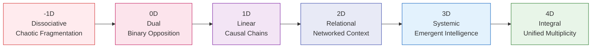
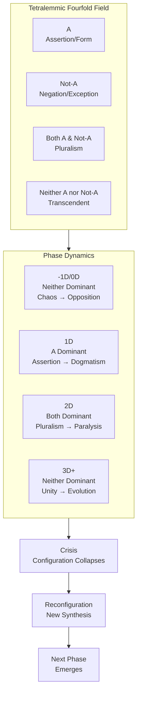
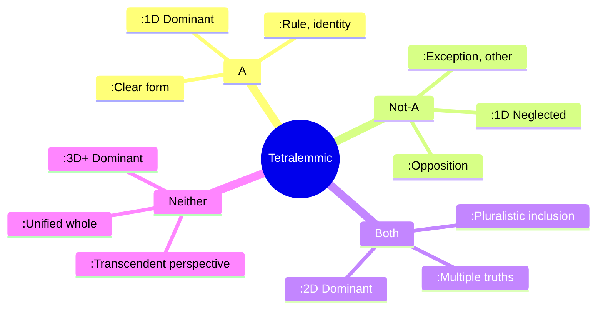
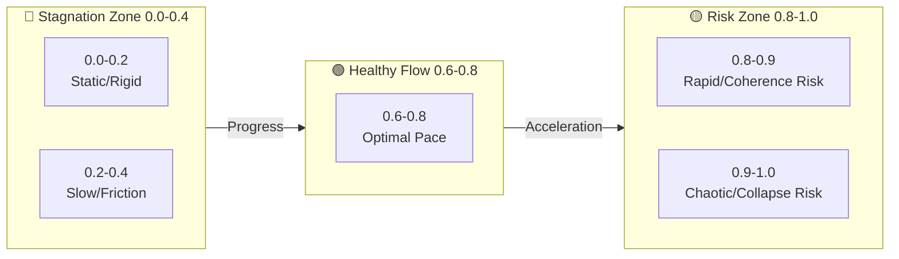
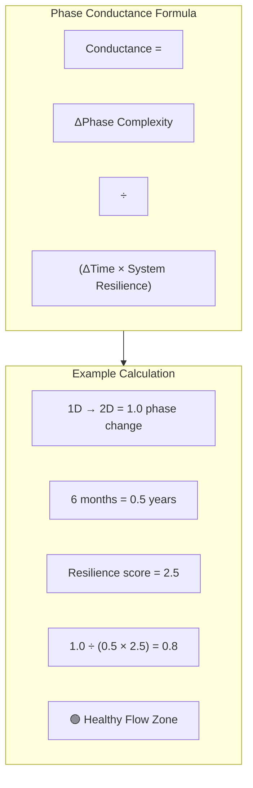
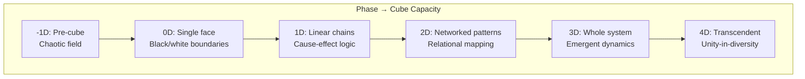
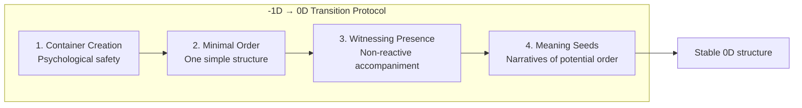

---
aeo_metadata:
  title: "Temporal Unfolding: Dialectical Phases (Node 04)"
  description: "A phase-based model of conscious evolution integrating dialectical mechanics with practical conductance metrics for navigating transformation at personal, communal, and systemic scales."
  context: "The 'when' and 'how fast' of Solarpunk transition, providing temporal architecture for understanding transformation patterns and pacing within the consciousness manifold."
  key_objectives:
    - "Map the six-dimensional phase evolution of conscious systems from dissociation to integral unity"
    - "Provide the Phase Conductance Metric for assessing transformation pace and health"
    - "Connect dialectical mechanics (Hegelian/tetralemmic) to practical phase navigation"
    - "Integrate temporal unfolding with tesseract model and ethical axes for holistic framework coherence"
    - "Offer actionable protocols for diagnosing phase states and facilitating healthy transitions"
  core_concepts:
    - "Six Dialectical Phases: -1D to 4D evolution of consciousness structures"
    - "Phase Conductance Metric: 0.0-1.0 scale measuring transformation pace and health"
    - "Hegelian Dialectic: Thesis-antithesis-synthesis engine of phase transitions"
    - "Tetralemmic Logic: Fourfold relational field within each phase (A, Not-A, Both, Neither)"
    - "Contraction Signals: Distress patterns indicating phase navigation issues"
    - "Tesseract Integration: How each phase capacity engages boundary cube work"
  ontological_foundation: "Analytic Idealism / Process Philosophy / Dialectical Synthesis"
  epistemic_framework: "Phase Evolution Logic / Temporal Architecture / Recursive Pattern Recognition"
  operational_focus: "Phase diagnosis, transformation pacing, intervention protocols, transition facilitation"
  search_queries:
    - "Solarpunk dialectical phases transformation model"
    - "Phase conductance metric system change pacing"
    - "Hegelian dialectic tetralemmic consciousness evolution"
    - "Temporal unfolding six dimensional phases"
  related_nodes:
    - "02-epistemic-architecture-tesseract.md (spatial complement)"
    - "03-ethics-four-axes.md (ethical application context)"
    - "05-dissociation-boundaries.md (phase -1D/0D foundation)"
    - "06-unfolding-protocols.md (practical implementation)"
  visual_diagrams:
    - "Six Phase Evolution Flowchart"
    - "Tetralemmic Phase Structure Table"
    - "Phase Conductance Metric Zones"
    - "Contraction Signals Diagnosis Map"
    - "Tesseract Integration Matrix"
  framework_status: "Stable v2.1 (comprehensive restructuring)"
  last_updated: "2024-01-11"
  revision_notes: "Complete reorganization with logical flow from theory to practice, added concrete examples, integrated tesseract connections, developed practical protocols, fixed visualization rendering"
---
# Temporal Unfolding: Dialectical Phases (Node 04)

## Introduction: The Temporal Architecture of Transformation

This document presents the temporal dynamics of the Solarpunk Mandala—**how conscious systems evolve through time**. While the Tesseract (Node 02) provides the spatial architecture for understanding complexity, these Dialectical Phases provide the **temporal architecture for understanding transformation**.

> **Core Proposition**: Change in conscious systems follows a recursive, scale-invariant pattern of unfolding that applies equally to personal growth, community development, and civilizational evolution. Each phase represents a qualitatively different way of organizing consciousness and relationship, with specific capacities, challenges, and transition requirements.

### The Temporal-Spatial Framework Integration

| **Dimension** | **Spatial (Tesseract)** | **Temporal (Phases)** | **Integration** |
|---------------|-------------------------|-----------------------|-----------------|
| **Structure** | Boundary cubes in consciousness | Phase evolution through time | Phases determine capacity to engage cubes |
| **Focus** | "What" exists and how it relates | "When" and "how fast" change occurs | Temporal readiness for spatial complexity |
| **Tool** | Geometric visualization | Phase diagnosis and pacing metrics | Combined framework for holistic navigation |

---

## The Six Dialectical Phases: Consciousness Evolution Journey

Systems evolve through six dimensional phases, each representing a qualitatively different way of organizing consciousness and relationship.

### Phase -1D: Dissociative (Chaotic Fragmentation)
**The breakdown of prior wholeness into elemental components.**

| **Aspect** | **Description** | **Personal Example** | **Community Example** | **Societal Example** |
|------------|-----------------|----------------------|------------------------|----------------------|
| **Characteristics** | Sensation without pattern, pure potential without structure, loss of coherent narrative | Trauma response, dissociation, overwhelming emotional states | Community collapse, loss of shared narrative, fragmented initiatives | Civilizational collapse, paradigm disintegration |
| **Purpose** | Creates raw material and energetic potential for new forms to emerge from dissolution | Creates space for deep restructuring of identity | Generates energy for fundamental restructuring | Produces conditions for civilizational reinvention |
| **Boundary State** | Dissolved boundaries, no coherent separation | Ego dissolution, lack of self-other distinction | No collective identity, pure individualism | Anomie, loss of social cohesion |
| **Transition Task** | From chaos to minimal viable distinction | Establish basic self-presence | Form core group with shared survival need | Establish basic social contract |

### Phase 0D: Dual (Binary Opposition)
**The crystallization of oppositional pairs from the chaotic field.**

| **Aspect** | **Description** | **Personal Example** | **Community Example** | **Societal Example** |
|------------|-----------------|----------------------|------------------------|----------------------|
| **Characteristics** | Self/Other, Good/Bad, Us/Them dichotomies, either/or thinking, debate and polarized conflict | Black-and-white thinking, projection, identity through opposition | Factionalization, ideological purity tests, in-group/out-group dynamics | Political polarization, cultural wars, nationalism |
| **Purpose** | Establishes clear distinctions and creates energetic tension necessary for developmental movement | Creates ego structure and personal boundaries | Defines group identity and shared values | Establishes cultural identity and social norms |
| **Boundary State** | Rigid, impermeable boundaries | Fortified ego boundaries | Strong group boundaries with clear membership | National borders, cultural exclusivity |
| **Transition Task** | From opposition to simple causal logic | Develop basic cause-effect understanding | Establish simple rules and roles | Create basic legal and governance structures |

### Phase 1D: Linear (Causal Chains)
**The organization of elements into sequential, goal-directed patterns.**

| **Aspect** | **Description** | **Personal Example** | **Community Example** | **Societal Example** |
|------------|-----------------|----------------------|------------------------|----------------------|
| **Characteristics** | If/Then logic, progress narratives, efficiency optimization, hierarchical organization, control-oriented approaches | Goal-setting, personal development plans, habit formation | Strategic planning, measurable objectives, clear leadership structures | Industrial development, economic growth targets, bureaucratic systems |
| **Purpose** | Creates directionality, efficiency, and capacity for sustained, focused action toward goals | Enables achievement and skill development | Facilitates coordinated action toward shared objectives | Drives technological and economic development |
| **Boundary State** | Functional boundaries with clear input/output | Self as agent with clear goals | Organizational boundaries with defined functions | Institutional boundaries with specialized roles |
| **Transition Task** | From linear chains to networked relationships | Recognize interpersonal interdependence | Develop collaborative networks | Create economic and social interdependence |

### Phase 2D: Relational (Networked Context)
**The recognition of interdependence within systems of relationships.**

| **Aspect** | **Description** | **Personal Example** | **Community Example** | **Societal Example** |
|------------|-----------------|----------------------|------------------------|----------------------|
| **Characteristics** | Both/And thinking, feedback loops, mutual influence, contextual understanding, empathy and collaboration | Emotional intelligence, perspective-taking, relationship skills | Participatory decision-making, consensus processes, network weaving | Ecosystem thinking, stakeholder engagement, multilateralism |
| **Purpose** | Develops capacity to see patterns of relationship and understand systemic interdependence | Enables healthy relationships and social integration | Facilitates complex coordination and conflict resolution | Supports sustainable development and global cooperation |
| **Boundary State** | Permeable, negotiated boundaries | Flexible identity in relationship | Fluid membership and role definitions | Transnational networks, global civil society |
| **Transition Task** | From relationships to self-organizing systems | Develop metacognitive awareness | Cultivate collective intelligence | Foster adaptive governance systems |

### Phase 3D: Systemic (Emergent Intelligence)
**The self-organization of systems with adaptive, evolutionary intelligence.**

| **Aspect** | **Description** | **Personal Example** | **Community Example** | **Societal Example** |
|------------|-----------------|----------------------|------------------------|----------------------|
| **Characteristics** | Emergent properties not reducible to parts, self-organization, learning/adaptation/evolution, meta-cognition | Integral consciousness, witnessing awareness, self-authoring mind | Collective intelligence, emergent leadership, adaptive governance | Complex adaptive systems, learning societies, evolutionary economics |
| **Purpose** | Enables systems to learn, adapt, and evolve in response to changing conditions | Facilitates psychological integration and wisdom | Supports community resilience and innovation | Enables civilizational adaptation to complex challenges |
| **Boundary State** | Fluid boundaries with conscious regulation | Conscious ego with transpersonal awareness | Purpose-driven boundaries with contextual adaptation | Permeable cultural boundaries with conscious integration |
| **Transition Task** | From systemic to participatory consciousness | Embody non-dual awareness in action | Cultivate collective participatory consciousness | Foster global integral consciousness |

### Phase 4D: Integral (Unified Multiplicity)
**The conscious participation in a unified field of co-creative unfolding.**

| **Aspect** | **Description** | **Personal Example** | **Community Example** | **Societal Example** |
|------------|-----------------|----------------------|------------------------|----------------------|
| **Characteristics** | Coherent diversity, unified multiplicity, participatory consciousness, spontaneous right action, dissolution of subject-object distinction | Non-dual embodiment, effortless action, transcendent service | Collective flow states, synergistic co-creation, cultural renaissance | Planetary consciousness, integral civilization, participatory evolution |
| **Purpose** | Represents integration of all previous phases into embodied, participatory wisdom | Realization of essential nature and its expression | Manifestation of collective genius and cultural beauty | Actualization of humanity's potential as conscious co-creators |
| **Boundary State** | Transcended boundaries (unity-in-diversity) | Self as expression of the whole | Community as conscious organ of the whole | Civilization as conscious expression of planetary life |
| **Transition Task** | Continuous conscious evolution | Ongoing deepening of embodiment | Continuous cultural evolution | Participatory cosmic evolution |

---

## The Dialectical Engine: Hegelian Process & Tetralemmic Field

The progression from -1D to 4D is driven by a Hegelian dialectic: a thesis faces its contradiction (antithesis), leading to a crisis resolved through higher-order synthesis. However, within each phase, a more complex tetralemmic (catuṣkoṭi) logic operates—describing the fourfold relational field present synchronically.

### Practical Application: Phase-Specific "Cube" Diagnosis

This lens enables precise diagnosis of pathologies **within** a phase, not just between phases:

- **1D Community Stuck in "Assertion Cube"**: Dogmatic about initial rules → Needs intentional seeking of Not-A (outside feedback, internal dissent)
- **2D Initiative Stuck in "Analysis Paralysis"**: Endlessly weighing options (Both/And Cube) → Needs transcendent perspective (unifying vision, sacred purpose)
- **0D Group Stuck in "Opposition Cube"**: Constant conflict without progress → Needs minimal viable structure (simple agreement, shared focus)

**Summary**: Hegelian dialectic = engine of change **between** phases. Tetralemmic dialectic = map of relational field **within** each phase. Both together allow understanding of both journey trajectory and current terrain.

---

## Phase Conductance Metric: Measuring Transformation Health

Healthy transformation follows an optimal pace—not too slow (stagnation), not too fast (disintegration). The Phase Conductance Metric provides a 0.0–1.0 scale for assessing this pace.

### The Conductance Scale and Zones

### Calculating Phase Conductance

**Formula**: `Conductance = (ΔPhase Complexity) / (ΔTime × System Resilience)`

Where:
- **ΔPhase Complexity**: Change in phase level (e.g., 1D → 2D = 1.0)
- **ΔTime**: Time period for change (in appropriate units)
- **System Resilience**: Composite score of Embodied Foundations (1.0–3.0 scale)

**Example Calculation**:
- Community moves from 1D to 2D over 6 months
- System Resilience score = 2.5 (based on Embodied Foundations assessment)
- Conductance = 1.0 / (6 × 2.5) = 1.0 / 15 = 0.067/month
- To annualize: 0.067 × 12 = 0.8 → **Healthy Flow Zone**

### Application Protocol

1. **Assess Current Phase**: Use phase characteristics and examples above
2. **Track Phase Movement**: Document phase transitions with dates and evidence
3. **Calculate Conductance**: Apply formula with appropriate time units
4. **Interpret Results**:
   - **<0.4**: Increase challenge, reduce friction
   - **0.6–0.8**: Maintain current approach
   - **>0.8**: Increase stability, integration practices
5. **Adjust Interventions**: Based on zone and specific context

### Integration with Framework Foundations

**Critical Constraint**: Phase Conductance is constrained by Embodied Foundations. A system cannot maintain high conductance (>0.6) if any foundation score is <2. Conversely, high foundation scores enable but don't guarantee high conductance—the system must actively engage the Four Ethical Axes to generate directional movement.

**Activation Rule**: 
> No pathway or protocol should be activated if Phase Conductance < 0.3 **or** if any Embodied Foundation score < 2.0. This is a core systems safeguard against premature complexity or unsustainable transformation.

---

## Contraction Signals: Diagnosis and Intervention Protocols

When systems move too quickly or slowly through phases, they exhibit "contraction signals" indicating distress. Each signal has specific diagnostics and interventions.

### Diagnosis and Intervention Framework

| Contraction Signal | Likely Phase Issue | Primary Diagnosis | Intervention Protocol | Ethical Axis Focus |
|-------------------|-------------------|-------------------|----------------------|-------------------|
| **Rigidity/Repetition** (Velocity < 0.4) | 3D → 1D regression, excess structure | Over-strong boundaries, fear of change | Introduce play/creativity, weaken boundaries, diversity exposure | Openness, Adaptation |
| **Fragmentation/Chaos** (Velocity > 0.8) | 2D → -1D regression, structure collapse | Insufficient coherence, overwhelm | Establish simple rules, restore minimum viable structure, rhythm | Regeneration, Cooperation |
| **Numbness/Disconnection** | 0D dynamics, relational rupture | Splitting, trust breakdown, meaning loss | Repair trust, safe connection, meaning restoration | Cooperation, Regeneration |
| **Hyper-urgency/Paralysis** | Temporal dysregulation | Pace-capacity misalignment, time distortion | Rhythm restoration, pace alignment, capacity building | Adaptation, Regeneration |

### Phase-Specific Intervention Toolkit

#### -1D/0D Interventions (Chaos/Opposition)
- **Grounding Practices**: Embodied awareness, breathing, somatic regulation
- **Minimum Viable Structure**: One simple rule/agreement, consistent meeting time
- **Safe Container Creation**: Clear boundaries, confidentiality, shared intention

#### 1D Interventions (Rigidity/Dogmatism)
- **Perspective Expansion**: Devil's advocate role, outside expert input, diversity exposure
- **Experimentation Frames**: "Prototype" mindset, safe-to-fail experiments, learning metrics
- **Boundary Permeability**: Temporary role swaps, cross-functional teams, customer immersion

#### 2D Interventions (Complexity/Paralysis)
- **Decision Frameworks**: Integrative decision matrices, consent vs consensus, timeboxing
- **Pattern Recognition**: Systems mapping, leverage point identification, narrative coherence
- **Transcendent Perspective**: Vision reconnection, purpose reminder, ritual/ceremony

#### 3D+ Interventions (Stagnation/Isolation)
- **Evolutionary Tension**: Creative tension introduction, aspirational gap, future self connection
- **Cross-Scale Learning**: Micro-macro pattern transfer, cross-system pollination, generative dialogue
- **Participatory Deepening**: Collective sensing practices, shared embodiment, co-creative ritual

---

## Phase Transitions and Tesseract Integration

Each dialectical phase corresponds to specific capacities for engaging with the Tesseract's boundary cubes. This integration creates a complete framework where temporal phase determines capacity for spatial complexity navigation.

### Phase Capacities for Cube Work

| Phase | Cube Engagement Capacity | Primary Cube Focus | Limitation | Development Opportunity |
|-------|--------------------------|-------------------|------------|-------------------------|
| **-1D** | Pre-cube: Cannot hold boundaries | None—chaotic field | No stable perception of boundaries | Emergence of basic distinction (0D capacity) |
| **0D** | Single cube face: Black/white boundaries | Opposition cubes (good/bad, us/them) | Cannot see multiple perspectives simultaneously | Developing causal logic (1D capacity) |
| **1D** | Linear cube connections: Cause-effect chains | Process cubes (input→output, goal→action) | Cannot handle reciprocal influence or feedback loops | Developing relational awareness (2D capacity) |
| **2D** | Multiple cube relationships: Networked patterns | Relational cubes (stakeholder networks, ecosystem maps) | Cannot perceive emergent systemic properties | Developing systemic perception (3D capacity) |
| **3D** | Whole cube perception: Systemic dynamics | Complexity cubes (adaptive systems, emergence patterns) | Cannot fully embody participatory unity | Developing integral embodiment (4D capacity) |
| **4D** | Transcendent cube engagement: Unity-in-diversity | All cubes as expressions of unified field | No limitation—fluid engagement as needed | Continuous evolutionary expression |

### Practical Integration: Phase-Appropriate Boundary Work

**For 1D Systems Working with Boundary Cubes**:
- Focus on **one ethical axis at a time** (e.g., just Regeneration/Extraction)
- Use **simple binary assessments** (more regenerative or more extractive?)
- Create **clear action steps** from assessments
- Avoid complexity of multiple interacting axes

**For 2D Systems Working with Boundary Cubes**:
- Map **relationships between 2-3 ethical axes**
- Identify **tensions and synergies** between different boundary configurations
- Develop **integrative solutions** addressing multiple concerns
- Engage **multiple stakeholders** in boundary negotiations

**For 3D+ Systems Working with Boundary Cubes**:
- Hold **entire ethical tesseract** in awareness during decisions
- Perceive **emergent patterns** across boundary configurations
- Facilitate **participatory boundary evolution** with all stakeholders
- Engage in **conscious boundary play** and experimental configurations

### Transition Protocols Between Phases

#### Protocol: Supporting -1D → 0D Transition
1. **Container Creation**: Establish absolute psychological safety
2. **Minimal Order**: Introduce one simple, non-negotiable structure
3. **Witnessing Presence**: Provide non-reactive accompaniment through chaos
4. **Meaning Seeds**: Plant small narratives of potential order

#### Protocol: Supporting 1D → 2D Transition
1. **Complexity Introduction**: Gradually introduce competing perspectives
2. **Relational Skills Training**: Teach active listening, perspective-taking
3. **Feedback Systems**: Create safe feedback mechanisms
4. **Both/And Practice**: Exercises in holding contradictory truths

#### Protocol: Supporting 2D → 3D Transition
1. **Emergence Observation**: Practice noticing patterns beyond explicit agreements
2. **Self-Organization Experiments**: Create spaces for organic coordination
3. **Meta-Awareness Development**: Reflect on group process and dynamics
4. **Evolutionary Purpose Connection**: Link actions to larger developmental arcs

---

## Practical Implementation Framework

### Phase Diagnosis Worksheet

**Step 1: Observable Evidence Collection**
- What patterns of thinking dominate? (Either/Or, Both/And, etc.)
- How are decisions made? (Hierarchical, consensus, emergent?)
- What is the relationship to boundaries? (Rigid, permeable, fluid?)
- How is conflict handled? (Avoidance, polarization, integration?)

**Step 2: Phase Alignment Assessment**
- Review phase characteristics (-1D to 4D)
- Note which phase matches majority of evidence
- Identify phase contradictions (signs of transition or regression)
- Estimate phase percentage (e.g., "70% 1D, 30% 2D emerging")

**Step 3: Conductance Calculation**
- Document last phase transition and timeframe
- Assess Embodied Foundations (scale 1.0–3.0)
- Calculate conductance score
- Identify conductance zone (stagnation, healthy, risk)

**Step 4: Intervention Planning**
- Based on phase and conductance, select appropriate interventions
- Create 30/60/90 day implementation plan
- Establish metrics for progress tracking
- Schedule regular reassessment points

### Scenario Application Library

**Scenario 1: Community Conflict Resolution**
- **Presenting Issue**: Factionalization and stuck decision-making
- **Phase Diagnosis**: 0D with 1D aspirations (polarized but wanting progress)
- **Conductance**: 0.2 (stagnation zone)
- **Intervention Protocol**: 
  1. Establish neutral facilitation (safe container)
  2. Create simple decision framework (1D structure)
  3. Practice perspective-taking exercises (2D skill building)
  4. Gradually increase complexity tolerance

**Scenario 2: Organizational Transformation Stalling**
- **Presenting Issue**: Change initiatives consistently failing despite good plans
- **Phase Diagnosis**: 1D implementing 2D/3D strategies (capability gap)
- **Conductance**: 0.3 (stagnation with frustration)
- **Intervention Protocol**:
  1. Simplify change to one clear, winnable goal (1D alignment)
  2. Build relational capacity before complex collaboration (phase-appropriate)
  3. Celebrate small wins to build momentum
  4. Gradually introduce more complexity as capacity grows

**Scenario 3: Burnout in High-Performing Collective**
- **Presenting Issue**: Excellence followed by exhaustion and fragmentation
- **Phase Diagnosis**: 2D operating at 3D+ pace (conductance > 0.9)
- **Conductance**: 0.85 (disintegration risk)
- **Intervention Protocol**:
  1. Immediate pace reduction (protected integration time)
  2. Simplify structures and decisions temporarily
  3. Focus on foundation repair (trust, safety, individual wellness)
  4. Re-establish healthy conductance (0.6–0.8) before complexity

### Integration with Solarpunk Praxis

The dialectical phase model provides crucial temporal intelligence for Solarpunk transition:

1. **Phase-Appropriate Strategy**: Different phases require different transition approaches
2. **Healthy Pace Maintenance**: Prevents burnout and collapse in transformation efforts
3. **Developmental Sequencing**: Ensures foundational capacities before complex interventions
4. **Cultural Evolution Support**: Maps the consciousness evolution needed for Solarpunk realization

**Key Insight**: Solarpunk cannot be implemented from any single phase—it requires the capacity to navigate all phases consciously, recognizing which phase dynamics are operating and applying phase-appropriate interventions.

---

## Conclusion: Conscious Participation in Temporal Unfolding

This temporal unfolding framework completes the integrated Solarpunk Mandala model by adding the dimension of time to the spatial architecture of the tesseract and the ethical guidance of the four axes. Together, these three core nodes provide:

1. **Spatial Intelligence** (Tesseract): Understanding what exists and how it relates
2. **Ethical Intelligence** (Four Axes): Guiding how to configure boundaries consciously
3. **Temporal Intelligence** (Dialectical Phases): Knowing when and how fast to navigate change

### Framework Integration Summary

| **System Aspect** | **Primary Node** | **Supporting Nodes** | **Integrated Application** |
|-------------------|------------------|----------------------|----------------------------|
| **What exists** | 02-Tesseract (spatial relations) | 01-Ontology (foundation) | Mapping current reality patterns |
| **How to choose** | 03-Ethics (boundary configuration) | 02-Tesseract (options space) | Making conscious boundary decisions |
| **When to act** | 04-Phases (temporal dynamics) | 03-Ethics (pace guidance) | Timing interventions appropriately |
| **How to heal** | 05-Dissociation Boundaries | 04-Phases (regression understanding) | Addressing developmental wounds |
| **How to implement** | 06-Unfolding Protocols | All previous nodes | Integrated transformation practice |

### Continuing the Journey

This phase model is not a linear ladder to climb but a developmental spiral to navigate with increasing consciousness. The goal is not to reach 4D and stay there, but to develop the capacity to move fluidly through phases as appropriate to context, need, and evolutionary impulse.

**Final Practice Invitation**: 
1. Identify one system you participate in (personal, relational, communal)
2. Diagnose its current phase using the worksheets
3. Calculate its conductance score
4. Choose one phase-appropriate intervention
5. Practice, observe, and adjust

Remember: The healthiest systems are not those stuck in "higher" phases, but those that can consciously navigate their current phase while developing capacity for the next appropriate transition.

---

**Related Documents**:
- [02-epistemic-architecture-tesseract.md](02-epistemic-architecture-tesseract.md) - Spatial framework complement
- [03-ethics-four-axes.md](03-ethics-four-axes.md) - Ethical guidance for phase navigation
- [05-dissociation-boundaries.md](05-dissociation-boundaries.md) - Foundation for -1D/0D work
- [06-unfolding-protocols.md](06-unfolding-protocols.md) - Practical implementation methods

**Next Development Steps**:
- Community case study collection (2024 Q2)
- Phase transition ritual development (2024 Q3)
- Conductance measurement tool digital version (2024 Q4)
- Cross-cultural phase pattern research (2025)

*This is a living document. Last updated: 2024-01-11*
