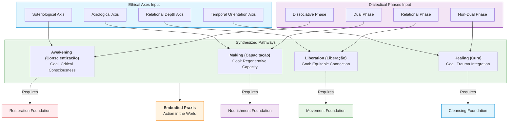
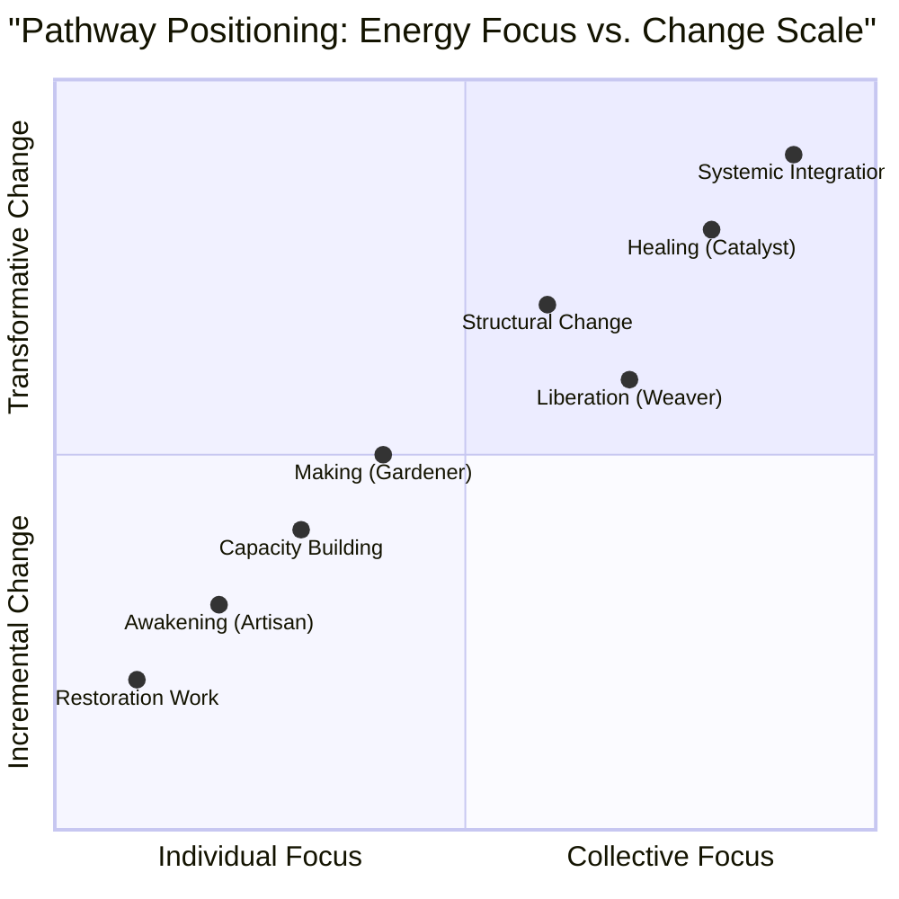
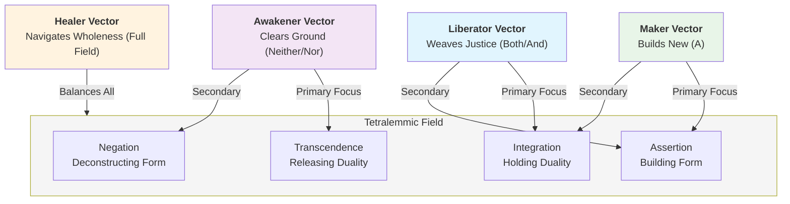
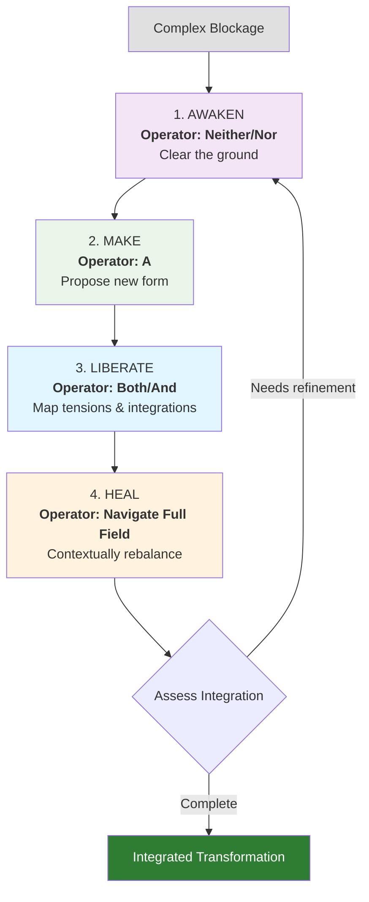
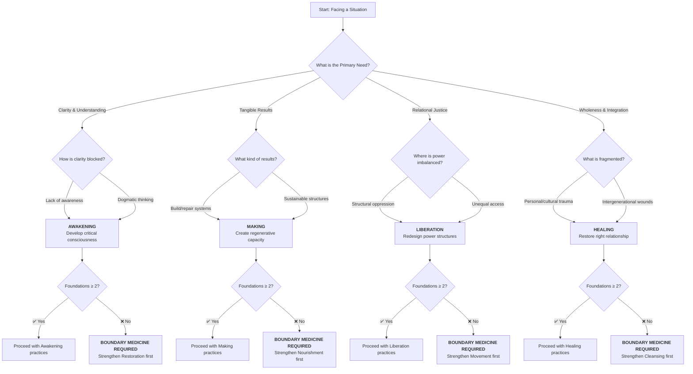
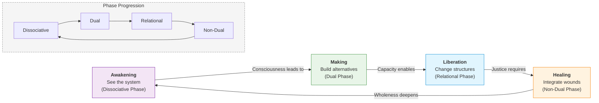

---
aeo_metadata:
  title: "Mandala Axis: The Four Pathways (Node 05)"
  description: "The core experiential journey of consciousness within the mandala framework."
  context: "The roadmap for personal and collective evolution."
  key_objectives:
    - Define Immersion, Reflection, Transcendence, and Agency.
    - Highlight the Fourth Path (Agency) as the 'Solar' contribution.
  core_concepts:
    - The Path of Agency
    - The Path of Immersion
    - The Path of Reflection
    - The Path of Transcendence
  ontological_foundation: "Analytic Idealism"
  search_queries:
    - "The four paths of experience in Solarpunk Mandala."
    - "What is the fourth path of conscious agency?"
  related_nodes: [01-ontology-analytic-idealism.md, 03-ethics-four-axes.md]
  framework_status: "Stable"
---

# Mandala Axis: Four Pathways

## Your Personal Vector Through the Tesseract

In the temporal unfolding (04), you witnessed how ideas move through 4D space. Now, discover how you move—your unique vector through the geometric reality. This document expands the Tetralemmic logic introduced in 04-temporal-unfolding into the practical domain of the Four Pathways.

The four pathways are not personality types. They are modes of engagement—different ways to apply force along the mandala's axes, creating different patterns of contribution.

## The Four Vectors of Contribution

Each pathway represents a different approach to applying energy within the Tesseract's structure:

### 1. The Artisan Path → Refinement Vector

Focusing energy inward to perfect individual components.

- Movement: Radial contraction toward precision
- Temporal phase affinity: Thesis (stabilizing) & Material (perfecting)
- Geometric action: Polishing vertices and edges
- Repository work: Code quality, documentation clarity, tool refinement
- Label: `pathway:artisan`

### 2. The Gardener Path → Nurturing Vector

Focusing energy outward to cultivate relationships and conditions.

- Movement: Radial expansion toward ecosystem health
- Temporal phase affinity: Synthesis (integrating) & Antithesis (pruning)
- Geometric action: Strengthening connections between vertices
- Repository work: Community building, issue triage, welcoming newcomers
- Label: `pathway:gardener`

### 3. The Weaver Path → Connective Vector

Focusing energy through patterns and relationships.

- Movement: Diagonal integration across planes
- Temporal phase affinity: Synthesis (integrating) & Thesis (pattern recognition)
- Geometric action: Tracing and revealing hidden connections
- Repository work: Pattern recognition, integration docs, cross-reference creation
- Label: `pathway:weaver`

### 4. The Catalyst Path → Transformative Vector

Focusing energy beyond existing structures to create new possibilities.

- Movement: Orthogonal rotation into new dimensions
- Temporal phase affinity: Antithesis (challenging) & Material (manifesting new)
- Geometric action: Rotating the entire tesseract to reveal new faces
- Repository work: Paradigm proposals, radical refactors, new directions
- Label: `pathway:catalyst`

## The Freirean Roots of the Four Pathways

These four pathways are not arbitrary—they emerge directly from Paulo Freire's pedagogy of liberation. We honor this lineage by retaining the Portuguese terms as **spiritual anchors**, even as we translate them for clarity.

### Why Portuguese Matters

Freire taught that **language is never neutral**—it carries the consciousness of its culture. By keeping the Portuguese, we remind ourselves that:

1. **Conscientização** (Critical Consciousness) is more than "awareness"—it's the **radical reorientation** of perception to see oppression clearly
2. **Capacitação** (Capacity-Building) is more than "skills"—it's **collective empowerment** through praxis
3. **Liberação** (Liberation) is more than "freedom"—it's **structural transformation** through dialogue
4. **Cura** (Healing) is more than "restoration"—it's **relational wholeness** through love and solidarity

**However**, we recognize that technical documentation requires clarity. Therefore:

- **First mention** in each document: Use Portuguese + English in parentheses
- **Subsequent mentions**: Use English for readability
- **Ritual/ceremonial contexts**: Use Portuguese to honor the lineage

The Portuguese terms are **invocations**, not jargon. 

## Pathway-Tesseract Alignment Matrix

Each pathway engages with the Tesseract's geometry differently:

## The Tetralemmic Logic of the Four Pathways

### The Logical Architecture of Embodied Praxis

The Four Pathways represent distinct *logical operators* within the fourfold architecture of reality described by the Tetralemma (catuṣkoṭi). Each pathway engages the dialectical process through a specific position in the Tetralemmic field, defining its fundamental mode of transforming consciousness and systems.

### Mapping: From Dialectical Task to Pathway Protocol

Each pathway operationalizes the synthetic task of its corresponding dialectical phase into a practical protocol.

| Pathway | Dialectical Phase | Phase Task (from 04) | Primary Tetralemmic Operator | Pathway Execution of Phase Task |
| :--- | :--- | :--- | :--- | :--- |
| **Awakening** (*Conscientização*) | **0D: Dissolution** | "Move from pure potential to minimal viable assertion" | **Neither A nor Not-A** (The Ground) | Creates *clearing* through suspension of assumptions, allowing new consciousness (A) to emerge from the ground of potential. |
| **Making** (*Capacitação*) | **1D: Emergence** | "Allow assertion to be challenged by negations without collapsing" | **A** (Thesis/Assertion) | Builds tangible alternatives (A) with embedded feedback mechanisms to incorporate limits and exceptions (Not-A). |
| **Liberation** (*Liberação*) | **2D: Integration** | "Navigate multiple truths by discovering integrative pattern" | **Both A and Not-A** | Holds competing needs and truths in tension to design structures that transcend (Neither/Nor) oppressive binaries. |
| **Healing** (*Cura*) | **3D+: Transformation** | "Consciously apply the entire dialectical process for evolution" | **Dynamic Navigation** (All Positions) | Contextually applies the full Tetralemmic logic—asserting boundaries, integrating trauma, holding silence—to restore wholeness across time. |

### Pathway Imbalances as Tetralemmic "Cubes"

When a pathway becomes fixated on its primary logical operator, it creates a "Cube" (per 04's diagnosis)—a rigid pattern that blocks dialectical movement.

| Pathway | Healthy Operator | Imbalance ("Cube") | Manifestation | Corrective Movement |
| :--- | :--- | :--- | :--- | :--- |
| **Awakening** | Suspension & Clearing (Neither/Nor) | **Void Cube** Avoids all form | Endless critique without proposal; spiritual bypassing | Small, embodied pilot of an alternative (Move toward **A** via Making) |
| **Making** | Proposition & Construction (A) | **Dogma Cube** Ignores negation | Solutionism; blind spots to externalities; "build anyway" attitude | Deliberate constraint-seeking: "What breaks this?" (Engage **Not-A**) |
| **Liberation** | Synthesis & Re-weaving (Both/And) | **Paralysis Cube** Can't choose | Eternal deliberation; consensus fetishism; no action | Provisional stand with sunset clause (Touch **Neither/Nor** via Awakening) |
| **Healing** | Contextual Navigation (All Positions) | **Omnipotence Cube** Carries all logic | Burnout; enmeshment; "I must hold everything" | Conscious delegation: "Whose pathway/logic is needed here?" (Re-establish boundaries) |

### Practical Protocol: The Tetralemmic Pathway Rotation

This four-step protocol applies the full logical spectrum to any complex intervention, ensuring comprehensive transformation.

**Example Application: Stuck Community Decision**
1. **Awaken (Neither/Nor):** *"What unspoken rule keeps us stuck?"* → Identifies: "We assume decisions require 100% consensus."
2. **Make (A):** *"What minimal rule change could help?"* → Proposes: "Adopt consent decision-making (can live with it)."
3. **Liberate (Both/And):** *"Who benefits/harms? What's excluded?"* → Maps: "Moves faster but may marginalize deep concerns."
4. **Heal (Navigate):** *"What adjustment balances these?"* → Adjusts: "Use consent plus 48-hour integration period for amendments."

## Pathway Identification: Vector Analysis

Rather than asking "Who are you?" ask "How do you apply energy right now?"

### Vector Assessment

Imagine you encounter a bug in the documentation:

**Artisan response:**
- Fix the specific error with precision
- Check for similar errors elsewhere
- Update any affected references
- Energy vector: Inward toward accuracy

**Gardener response:**
- Consider who might be confused by this
- Create a guide to prevent similar confusion
- Check if the system encourages such errors
- Energy vector: Outward toward understanding

**Weaver response:**
- Trace why this error occurred in the system
- Map connections to other potential issues
- Propose structural changes to prevent category errors
- Energy vector: Through the system's patterns

**Catalyst response:**
- Question whether documentation should exist in this form
- Propose a completely different knowledge structure
- Use the error as evidence for systemic transformation
- Energy vector: Beyond the current structure

Your turn: Pick a simple issue. Imagine four distinct responses. Which feels most natural? That's your current vector.

## Temporal-Phase Pathway Affinities

Your pathway preference often aligns with specific phases of the dialectic:

| Pathway | Natural Phase Entry | Contribution Style | Phase Transition Role |
| :--- | :--- | :--- | :--- |
| Artisan | Material phase | Perfecting implementation | Thesis → Material refinement |
| Gardener | Synthesis phase | Nurturing consensus | Antithesis → Synthesis bridging |
| Weaver | Thesis phase | Revealing patterns | Synthesis → Material mapping |
| Catalyst | Antithesis phase | Challenging foundations | Material → New Thesis creation |

## Practical Pathway Application

### 1. Pathway-Aware Contribution

When submitting work:
[pathway:artisan] Fix typo in tesseract documentation

Pathway alignment: Refinement vector - improving precision of geometric description
Temporal phase: Material integration - correcting existing implementation
Geometric action: Polishing vertex description clarity

### 2. Pathway-Rotating Practice

To develop pathway flexibility, try this exercise:

1. Pick a simple task: "Improve the README"
2. Approach it from each pathway perspective:
   - Artisan: Perfect the formatting and clarity
   - Gardener: Make it more welcoming and accessible
   - Weaver: Show connections to other documentation
   - Catalyst: Question the README format entirely

### 3. Pathway Collaboration

Different pathways create different tensions and synergies:

- Artisan + Gardener: Precision meets accessibility
- Weaver + Catalyst: Patterns meet transformation
- Gardener + Weaver: Relationships meet connections
- Catalyst + Artisan: Innovation meets craftsmanship

Collaboration prompt: Find someone with a different pathway preference. Co-create something that honors both vectors.

## Pathway Labels in Practice

This repository uses pathway labels to:

- Route contributions to appropriate reviewers
- Balance energy distribution across the system
- Track developmental growth as contributors rotate pathways

Label usage:

- `pathway:artisan` - Technical refinement tasks
- `pathway:gardener` - Community and growth tasks
- `pathway:weaver` - Integration and pattern tasks
- `pathway:catalyst` - Innovation and transformation tasks

### Label Application Protocol:

1. **Self-tagging**: Contributors add pathway labels based on their primary vector for the contribution
2. **Review routing**: Labels route to reviewers with complementary pathway expertise
3. **Balance monitoring**: Maintain pathway diversity across major initiatives
4. **Developmental tracking**: Encourage pathway rotation for integrative skill development

## Integration Exercises

### Exercise 1: Tetralemmic Pathway Diagnosis

Pick a current challenge in your work or community. Apply the Tetralemmic Pathway Rotation Protocol:

1. **Awaken**: What hidden assumption (form) underpins this challenge?
2. **Make**: What one small, clear change could you propose?
3. **Liberate**: Who would benefit and who might resist? Why?
4. **Heal**: What adjustment would honor both the proposal and the resistance?

### Exercise 2: Pathway Vector Mapping

Track your contributions for one week using pathway labels. At week's end:
- Which pathway did you use most frequently?
- Which felt most energizing? Most draining?
- Which pathway was absent from your work?

### Exercise 3: Cross-Pathway Collaboration

Find a partner with a different dominant pathway. Co-design a solution to a simple problem (like organizing a meeting). Notice:
- Where do your approaches naturally align?
- Where do they create tension?
- How can you integrate both vectors into a stronger solution?

## Boundary Medicine Reminder

Remember that pathways require foundation strength. If you find yourself:
- Consistently avoiding a particular pathway
- Feeling "stuck" in a pathway's negative pattern
- Unable to complete the Tetralemmic Rotation

Return to your Embodied Foundations. Pathway work without somatic grounding leads to abstraction and burnout. The pathways are vectors through reality, but you must be grounded in reality to wield them effectively.

---

**Next**: With pathways established, we move to the applied layer where these vectors manifest in specific domains. See 06-applied-domains for how pathways operate in technology, ecology, governance, and culture.
