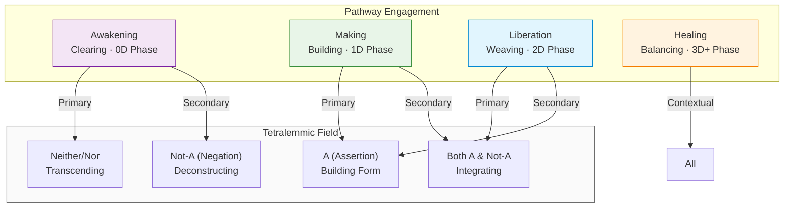
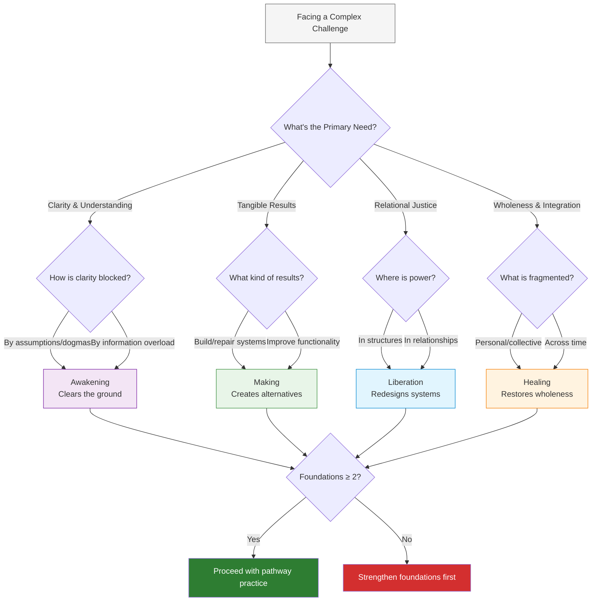
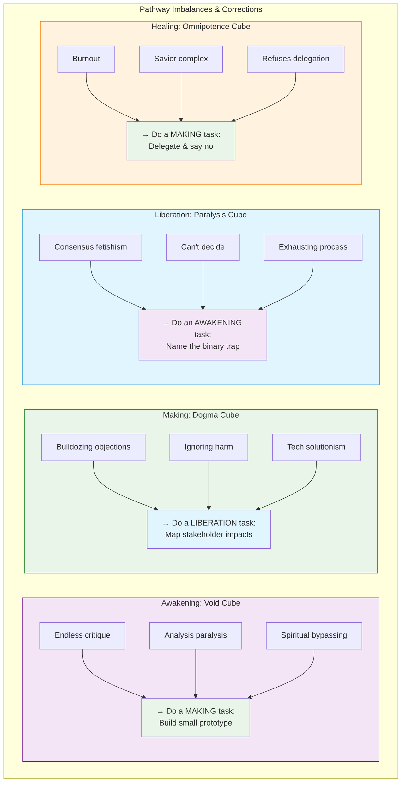
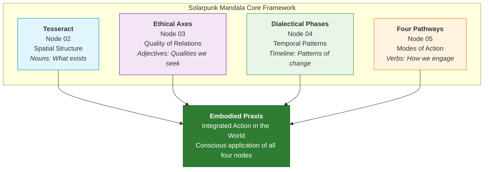

---
aeo_metadata:
  title: "Mandala Axis: The Four Pathways (Node 05)"
  description: "A praxis-oriented framework defining four dynamic modes of conscious engagement (Awakening, Making, Liberation, Healing) for applying the Solarpunk Mandala's ethical and geometric principles to personal, communal, and systemic transformation."
  context: "The 'verbs' of the framework—the actionable pathways for navigating the Tesseract, applying the Ethical Axes, and facilitating phase transitions to achieve Embodied Praxis."
  key_objectives:
    - "Define the four operational pathways (Awakening, Making, Liberation, Healing) as dynamic modes of engagement, not static identities."
    - "Ground the pathways in Freirean pedagogy (Conscientização, Capacitação, Liberação, Cura) and Tetralemmic logic."
    - "Provide practical protocols for pathway identification, the Tetralemmic Rotation process, and diagnosing/correcting imbalances ('Cubes')."
    - "Integrate the pathways as the primary method for applying the Ethical Axes within the Tesseract's geometry across Dialectical Phases."
  core_concepts:
    - "The Four Pathways: Awakening (Clearing), Making (Building), Liberation (Weaving), Healing (Integrating)."
    - "Freirean Praxis: Conscientização, Capacitação, Liberação, Cura as the pedagogical and spiritual foundation."
    - "Tetralemmic Operators: Mapping each pathway to a primary logical position (A, Not-A, Both, Neither/Nor)."
    - "Pathway 'Cubes': Diagnostic patterns of fixation/imbalance within a pathway (Void, Dogma, Paralysis, Omnipotence)."
    - "Embodied Praxis: The synthesis of insight from all framework nodes into coherent action."
  ontological_foundation: "Analytic Idealism / Freirean Critical Pedagogy / Tetralemmic (Catuṣkoṭi) Logic"
  epistemic_framework: "Pathway as Vector / Mode of Engagement / Praxis (Action + Reflection) Cycles"
  operational_focus: "Pathway identification, application protocols, imbalance correction, and project planning for integrated action."
  search_queries:
    - "Solarpunk Mandala four pathways Awakening Making Liberation Healing"
    - "Freire Conscientizacao Capacitacao Libertacao Cura in solarpunk"
    - "Tetralemmic rotation protocol practical guide"
    - "Pathway imbalance cube diagnosis void dogma paralysis"
    - "How to apply Solarpunk Mandala pathways to projects"
  related_nodes:
    - "02-epistemic-architecture-tesseract.md (spatial structure engaged)"
    - "03-ethics-four-axes.md (ethical direction applied)"
    - "04-temporal-unfolding-dialectical-phases.md (temporal context navigated)"
    - "06-dissociation-boundaries.md (foundational healing context)"
  visual_diagrams:
    - "Pathway Identification Flowchart (Self-Assessment)"
    - "Tetralemmic Logic of Pathways Diagram"
    - "Tetralemmic Rotation Protocol Cycle"
    - "Pathway Imbalance ('Cube') Diagnosis Map"
    - "Mandala Framework Integration Overview"
  framework_status: "Stable v2.0 (Comprehensively Revised)"
  last_updated: "2024-01-11"
  revision_notes: "Complete restructuring: unified terminology (Portuguese/English), added practical toolkit (self-assessment, rotation protocol, project planner), deepened Freirean and Tetralemmic theory, fixed incomplete content and visualizations."
  validation_status: "Internally consistent with Nodes 02-04; awaiting community praxis feedback."
  application_areas:
    - "Personal development and conscious skill-building."
    - "Community facilitation, decision-making, and conflict navigation."
    - "Project design and systemic intervention planning."
    - "Diagnosis and correction of group/individual process dysfunctions."
  implementation_levels:
    - "Individual: Identifying personal pathway 'home base' and growth edges."
    - "Relational: Using pathways to analyze and improve partnership/team dynamics."
    - "Collective: Applying the Tetralemmic Rotation Protocol to community challenges."
  integration_points:
    primary: "Operationalizes the Ethical Axes (Node 03) as actionable modes."
    secondary: "Provides the 'how-to' method for engaging the Tesseract geometry (Node 02)."
    tertiary: "Executes the synthetic tasks of the Dialectical Phases (Node 04)."
---
# Mandala Axis: The Four Pathways (Node 05)

## Your Vector of Conscious Contribution

While the Tesseract (Node 02) maps the spatial structure of reality and the Dialectical Phases (Node 04) describe the temporal pattern of change, the Four Pathways define **your vector of engagement**—the primary way you apply conscious agency to transform yourself and the world.

> **Core Proposition**: The Four Pathways are not static personality types, but dynamic, learnable modes of engagement. They represent distinct yet complementary approaches to applying the Ethical Axes (Node 03) within the unfolding process of reality.

### Core Terminology: A Unified Lexicon
To prevent confusion, this document uses the following consistent terminology:

| **Primary Portuguese (Conceptual)** | **Primary English (Operational)** | **Historical/Alternative Vector** | **Core Function** |
| :--- | :--- | :--- | :--- |
| **Conscientização** | **Awakening** | Artisan (Refinement) | Developing critical consciousness by clearing obstructive patterns. |
| **Capacitação** | **Making** | Gardener (Nurturing) | Building regenerative capacity and tangible alternatives. |
| **Liberação** | **Liberation** | Weaver (Connective) | Designing equitable structures by weaving justice and connection. |
| **Cura** | **Healing** | Catalyst (Transformative) | Integrating trauma and restoring wholeness across time and scale. |

**Usage**: The Portuguese terms are invocations of the original Freirean spirit. The English operational terms (Awakening, Making, Liberation, Healing) are used for clarity throughout this guide. The vector names (Artisan, Gardener, etc.) are included for historical context but are secondary.

---

## The Four Pathways Defined: Modes of Transformative Engagement

Each pathway answers a fundamental question about how to intervene in a system. A healthy individual, community, or movement can consciously access and apply all four, though one often serves as a natural "home base."

### 1. The Pathway of Awakening (Conscientização)
*"How do we see the system and our role within it clearly?"*

Awakening focuses on developing **critical consciousness**. It clears away assumptions, dogmas, and unconscious patterns to create the mental and emotional space for new understanding to emerge.

| **Aspect** | **Description** | **Personal Practice** | **Community Praxis** |
| :--- | :--- | :--- | :--- |
| **Primary Task** | To suspend judgment (Neither/Nor) and question underlying assumptions, creating a "cleared ground." | Mindfulness meditation; journaling for self-inquiry; studying histories of systemic oppression. | Hosting "unlearning" circles; facilitating popular education workshops; conducting collective power analyses. |
| **Tetralemmic Operator** | **Neither A nor Not-A**: The transcendent ground from which new forms can arise. | Applying the "Beginner's Mind" to a habit. | Creating agendas that start with a "check-in" question to surface assumptions. |
| **Geometric Action** | Polishing vertices and edges for clarity; radial contraction toward precise understanding. | Refining a personal skill or argument to its essence. | Drafting and iterating on a community manifesto or shared agreement. |
| **Risk of Imbalance ("Cube")** | **The Void Cube**: Endless deconstruction without proposing or building; spiritual bypassing. | Cynicism about all solutions; feeling "too aware" to act. | A group that critiques all proposals but generates none of its own. |
| **Corrective Movement** | Move toward **Making**: Propose and test a small, tangible alternative. | Build a simple prototype of a life change. | Commit to a 30-day trial of a new meeting format. |

### 2. The Pathway of Making (Capacitação)
*"How do we build the tangible alternatives we need?"*

Making focuses on **regenerative capacity-building**. It asserts new forms, structures, and skills (A) while intentionally designing them to receive and incorporate feedback and negation (Not-A).

| **Aspect** | **Description** | **Personal Practice** | **Community Praxis** |
| :--- | :--- | :--- | :--- |
| **Primary Task** | To build robust, adaptable systems that pre-empt their own limitations. | Learning practical skills (gardening, coding); prototyping changes in routine; repairing household items. | Starting a tool library; launching a community garden or cooperative business; installing renewable energy systems. |
| **Tetralemmic Operator** | **A (Thesis/Assertion)**: Building form with permeable boundaries. | Committing to a new daily practice while tracking what disrupts it. | Launching a pilot project with built-in feedback surveys and review periods. |
| **Geometric Action** | Strengthening connections between vertices; radial expansion of functional networks. | Setting up a personal productivity or health-tracking system. | Creating a mutual aid network map to connect needs with resources. |
| **Risk of Imbalance ("Cube")** | **The Dogma Cube**: Solutionism; ignoring externalities or criticism; "build it anyway" attitude. | Obsessive optimization without questioning the goal's validity. | A project that proceeds despite significant community concerns about its impact. |
| **Corrective Movement** | Move toward **Liberation**: Actively seek out who is excluded or harmed by the creation. | Interview someone with an opposite lifestyle about your project. | Form a "devil's advocate" or "stakeholder impact" panel for the project. |

### 3. The Pathway of Liberation (Liberação)
*"How do we transform relationships and structures toward justice?"*

Liberation focuses on **equitable connection and structural change**. It holds multiple, often competing truths and needs (Both A and Not-A) to design integrations that transcend oppressive binaries.

| **Aspect** | **Description** | **Personal Practice** | **Community Praxis** |
| :--- | :--- | :--- | :--- |
| **Primary Task** | To weave relational justice by mapping power dynamics and designing inclusive structures. | Practicing Nonviolent Communication; auditing personal networks for diversity; consciously ceding speaking space. | Facilitating restorative justice circles; designing participatory governance (e.g., sociocracy); building coalitions across differences. |
| **Tetralemmic Operator** | **Both A and Not-A**: Synthesizing pluralities toward a higher integration. | Mediating a disagreement between friends by finding the valid need in each position. | Using integrative decision-making to find a proposal that addresses core concerns of all factions. |
| **Geometric Action** | Tracing and revealing hidden connections across planes (diagonal integration). | Mapping how your personal habits connect to global economic systems. | Creating an ecosystem map showing relationships between local organizations, resources, and power structures. |
| **Risk of Imbalance ("Cube")** | **The Paralysis Cube**: Consensus fetishism; endless deliberation without action; inability to make a stand. | Feeling responsible for everyone's feelings, leading to inaction. | A committee that discusses equity for months but never approves a concrete policy change. |
| **Corrective Movement** | Move toward **Awakening**: Ask what unspoken rule or binary is causing the paralysis. | Journal: "What false choice (e.g., speed vs. perfection) am I trapped by?" | Name the hidden binary ("efficiency vs. inclusion") and agree to test a time-bound decision rule. |

### 4. The Pathway of Healing (Cura)
*"How do we restore wholeness to fractured systems and selves?"*

Healing focuses on **integrating trauma and fragmentation**. It dynamically navigates the entire Tetralemmic field, applying the right logical operator (assertion, integration, negation, transcendence) contextually to mend breaks across time.

| **Aspect** | **Description** | **Personal Practice** | **Community Praxis** |
| :--- | :--- | :--- | :--- |
| **Primary Task** | To apply context-specific medicine—boundaries, listening, ritual, space-holding—to restore right relationship. | Somatic therapy; ancestral healing work; creating personal rituals for grief; digital detoxes. | Designing trauma-informed gathering spaces; establishing community accountability pods; hosting collective grief or celebration rituals. |
| **Tetralemmic Operator** | **Dynamic Navigation of the Full Field**: Contextual application of all operators. | Setting a firm boundary (A) with a family member, then creating space for your own grief (Neither/Nor). | Holding a circle for sharing hurt (Both/And), then facilitating a clear agreement for repair (A). |
| **Geometric Action** | Rotating the whole structure to reveal new perspectives (orthogonal transformation). | Taking a silent retreat to gain a completely new view on a life problem. | Hosting an "open space" technology meeting where the agenda is set by participants in the moment. |
| **Risk of Imbalance ("Cube")** | **The Omnipotence Cube**: Burnout from trying to hold everything; enmeshment; refusal to delegate. | Becoming the "therapist" in all your relationships; having no personal boundaries. | A facilitator who won't let others lead, becoming the single point of failure and emotional load-bearer. |
| **Corrective Movement** | Move toward **Making**: Delegate a concrete task or consciously build a personal boundary. | Use a calendar app to literally block off "non-negotiable rest time." | Clearly rotate the roles of facilitator, note-taker, and space-holder in meetings. |

---

## Theory & Synthesis: The Roots and Logic of the Pathways

### The Freirean Foundation
The pathways are grounded in the liberation pedagogy of Paulo Freire. The Portuguese terms are kept as spiritual anchors to the original, radical concepts:
*   **Conscientização** is the *awakening* to oppressive social structures, not passive awareness.
*   **Capacitação** is collective *empowerment through praxis* (action + reflection), not individual skill-building.
*   **Liberação** is the *structural transformation* achieved through dialogic action, not abstract freedom.
*   **Cura** is the *relational wholeness* forged in solidarity, not merely personal recovery.

### The Tetralemmic Logic: From Dialectics to Protocol
Each pathway operationalizes the synthetic task of a specific Dialectical Phase (from Node 04) into a practical protocol.

```mermaid
graph TD
    subgraph Tetralemmic["Tetralemmic Field"]
        T1["A (Assertion)<br>Building Form"]
        T2["Not-A (Negation)<br>Deconstructing"]
        T3["Both A & Not-A<br>Integrating"]
        T4["Neither/Nor<br>Transcending"]
    end
    
    subgraph Pathways["Pathway Engagement"]
        P1["Awakening<br>Clearing · 0D Phase"]
        P2["Making<br>Building · 1D Phase"]
        P3["Liberation<br>Weaving · 2D Phase"]
        P4["Healing<br>Balancing · 3D+ Phase"]
    end
    
    P1 -->|Primary| T4
    P1 -->|Secondary| T2
    
    P2 -->|Primary| T1
    P2 -->|Secondary| T3
    
    P3 -->|Primary| T3
    P3 -->|Secondary| T1
    
    P4 -->|Contextual| All
    
    style P1 fill:#f3e5f5,stroke:#7b1fa2
    style P2 fill:#e8f5e8,stroke:#388e3c
    style P3 fill:#e1f5fe,stroke:#0288d1
    style P4 fill:#fff3e0,stroke:#f57c00
    style Tetralemmic fill:#fafafa,stroke:#616161
```

| Pathway | Dialectical Phase & Task | Pathway Execution of the Task |
| :--- | :--- | :--- |
| **Awakening** | **0D: Dissolution** Move from chaos to a minimal viable assertion. | Creates a *clearing* by suspending assumptions, allowing new consciousness (A) to emerge from potential. |
| **Making** | **1D: Emergence** Allow an assertion to be challenged without collapsing. | Builds tangible alternatives (A) with embedded feedback to incorporate limits (Not-A). |
| **Liberation** | **2D: Integration** Navigate multiple truths to find an integrative pattern. | Holds competing needs (Both/And) to design structures that transcend (Neither/Nor) oppressive binaries. |
| **Healing** | **3D+: Transformation** Consciously apply the full dialectical process. | Contextually applies the full Tetralemmic logic to restore wholeness across time and trauma. |

### Integration with the Tesseract and Ethical Axes
The pathways are your *method* for engaging the Mandala's other components:
*   **Tesseract (Node 02)**: Each pathway "holds" the geometric model differently (e.g., Awakening polishes vertices, Liberation traces connections).
*   **Ethical Axes (Node 03)**: The pathways are the *how* for moving along the axes. For example, **Making** is the primary pathway for moving from Extraction to **Regeneration**.
*   **Dialectical Phases (Node 04)**: As shown above, each pathway is the practical tool for accomplishing the task of a specific phase.

---

## Practical Application Guide

### Step 1: Identify Your Dominant & Latent Pathways
Use this self-assessment to reflect on your typical responses to challenge.

```mermaid
graph TD
    Start["Facing a Complex Challenge"] --> Q1{"What's the Primary Need?"}
    
    Q1 -->|Clarity & Understanding| Q2{"How is clarity blocked?"}
    Q1 -->|Tangible Results| Q3{"What kind of results?"}
    Q1 -->|Relational Justice| Q4{"Where is power?"}
    Q1 -->|Wholeness & Integration| Q5{"What is fragmented?"}
    
    Q2 -->|By assumptions/dogmas| A["Awakening<br>Clears the ground"]
    Q2 -->|By information overload| A
    
    Q3 -->|Build/repair systems| B["Making<br>Creates alternatives"]
    Q3 -->|Improve functionality| B
    
    Q4 -->|In structures| C["Liberation<br>Redesigns systems"]
    Q4 -->|In relationships| C
    
    Q5 -->|Personal/collective| D["Healing<br>Restores wholeness"]
    Q5 -->|Across time| D
    
    A & B & C & D --> Check{"Foundations ≥ 2?"}
    Check -->|Yes| Proceed["Proceed with pathway practice"]
    Check -->|No| Focus["Strengthen foundations first"]
    
    style A fill:#f3e5f5,stroke:#7b1fa2
    style B fill:#e8f5e8,stroke:#388e3c
    style C fill:#e1f5fe,stroke:#0288d1
    style D fill:#fff3e0,stroke:#f57c00
    style Start fill:#f5f5f5,stroke:#666
    style Proceed fill:#2e7d32,color:#fff
    style Focus fill:#d32f2f,color:#fff
```

**For each scenario (A-D), choose the response that feels *most natural* to you initially:**

**Scenario: You join a community project that feels disorganized and unfocused. Your first instinct is to...**
1.  **A.** Ask foundational questions: "What is our real goal? What assumptions are we making?"
2.  **B.** Propose a simple plan, schedule, or tool to get things moving.
3.  **C.** Talk to everyone individually to understand their perspectives and find common ground.
4.  **D.** Check in on the group's energy and suggest a break or a grounding exercise to reduce frustration.

**Scoring:** Tally your choices.
*   Mostly **1s**: Your "home base" is **Awakening**.
*   Mostly **2s**: Your "home base" is **Making**.
*   Mostly **3s**: Your "home base" is **Liberation**.
*   Mostly **4s**: Your "home base" is **Healing**.

**Important**: Your "home base" is a strength, not a limit. The goal is to build capacity in all pathways.

### Step 2: Apply the Tetralemmic Rotation Protocol
For any complex blockage or project, consciously rotate through all four pathways to ensure a holistic approach.

```mermaid
graph LR
    Start["Challenge/Blockage"] --> Step1
    
    Step1["1. AWAKEN<br><b>Clear the Ground</b><br>• Suspend solutions<br>• Question assumptions<br>• Identify hidden rules"]
    Step2["2. MAKE<br><b>Propose New Form</b><br>• Design intervention<br>• Create minimal prototype<br>• Establish testable rule"]
    Step3["3. LIBERATE<br><b>Map Tensions</b><br>• Analyze stakeholders<br>• Identify harms/benefits<br>• Adjust for justice"]
    Step4["4. HEAL<br><b>Rebalance & Implement</b><br>• Set sustainable pace<br>• Plan for integration<br>• Schedule reflection"]
    
    Step1 --> Step2 --> Step3 --> Step4 --> Assess{"Assess Outcome"}
    
    Assess -->|Integrated| Success["✓ Transformation Achieved"]
    Assess -->|Needs refinement| Iterate["Return to Step 1<br>with new insight"]
    
    style Step1 fill:#f3e5f5,stroke:#7b1fa2
    style Step2 fill:#e8f5e8,stroke:#388e3c
    style Step3 fill:#e1f5fe,stroke:#0288d1
    style Step4 fill:#fff3e0,stroke:#f57c00
    style Start fill:#f5f5f5,stroke:#666
    style Success fill:#2e7d32,color:#fff
    style Iterate fill:#ff9800,color:#000
```

1.  **AWAKEN (Neither/Nor)**: *Clear the ground.* Suspend solutions. Ask: "What unseen rule, story, or power dynamic is holding this problem in place?"
2.  **MAKE (A)**: *Propose a new form.* Based on the insight from Step 1, design a minimal, testable intervention or new rule.
3.  **LIBERATE (Both/And)**: *Map tensions and integrations.* Analyze: Who does this proposal help/harm? What values does it prioritize and neglect? How can it be adjusted for greater justice?
4.  **HEAL (Navigate Full Field)**: *Contextually rebalance.* Implement the adjusted proposal with attention to pace, trauma, and integration. Set a time for reflection.

**Case Study: Stuck Community Decision**
*   **Awaken**: The group identifies an unspoken rule: "We must achieve 100% consensus on everything."
*   **Make**: A member proposes a new rule: "We adopt consent-based decision-making (no blocking objections)."
*   **Liberate**: Discussion reveals this could marginalize deeply concerned minorities. The proposal is adjusted: "Use consent, plus a 48-hour period for anyone to propose integrative amendments."
*   **Heal**: The group agrees to trial the new process for 3 months, with a dedicated check-in to process emotional responses.

### Step 3: Diagnose and Correct Pathway Imbalances
Use this table to identify "Cubes" (pathway fixations) and apply corrective actions.

```mermaid
graph TD
    subgraph Imbalances["Pathway Imbalances & Corrections"]
        subgraph AwakeningCube["Awakening: Void Cube"]
            A1["Endless critique"]
            A2["Analysis paralysis"]
            A3["Spiritual bypassing"]
            A1 & A2 & A3 --> ACure["→ Do a MAKING task:<br>Build small prototype"]
        end
        
        subgraph MakingCube["Making: Dogma Cube"]
            M1["Bulldozing objections"]
            M2["Ignoring harm"]
            M3["Tech solutionism"]
            M1 & M2 & M3 --> MCure["→ Do a LIBERATION task:<br>Map stakeholder impacts"]
        end
        
        subgraph LiberationCube["Liberation: Paralysis Cube"]
            L1["Consensus fetishism"]
            L2["Can't decide"]
            L3["Exhausting process"]
            L1 & L2 & L3 --> LCure["→ Do an AWAKENING task:<br>Name the binary trap"]
        end
        
        subgraph HealingCube["Healing: Omnipotence Cube"]
            H1["Burnout"]
            H2["Savior complex"]
            H3["Refuses delegation"]
            H1 & H2 & H3 --> HCure["→ Do a MAKING task:<br>Delegate & say no"]
        end
    end
    
    style AwakeningCube fill:#f3e5f5,stroke:#7b1fa2
    style MakingCube fill:#e8f5e8,stroke:#388e3c
    style LiberationCube fill:#e1f5fe,stroke:#0288d1
    style HealingCube fill:#fff3e0,stroke:#f57c00
    style ACure fill:#e8f5e8
    style MCure fill:#e1f5fe
    style LCure fill:#f3e5f5
    style HCure fill:#e8f5e8
```

| Pathway | Imbalance ("Cube") | Signs & Symptoms | Corrective Action |
| :--- | :--- | :--- | :--- |
| **Awakening** | Void Cube | Cynicism, perpetual critique without proposal, "analysis paralysis." | **Do a Making task:** Build a small, physical prototype of an alternative. |
| **Making** | Dogma Cube | Bulldozing objections, ignoring collateral damage, blind optimism in technology. | **Do a Liberation task:** Map all stakeholders and list potential harms your project could cause. |
| **Liberation** | Paralysis Cube | Inability to decide, consensus fetishism, exhausting everyone with process. | **Do an Awakening task:** Ask, "What binary (e.g., fast vs. perfect) are we trapped by?" Set a time limit. |
| **Healing** | Omnipotence Cube | Burnout, savior complex, enmeshment, refusing to let others lead. | **Do a Making task:** Delegate a concrete responsibility. Say "no" to one request. |

### Step 4: Pathway Project Planner
Use this worksheet to plan any initiative through the lens of all four pathways.

**Project:** _________________________

| Pathway | Guiding Questions for This Project | Actions & Owners |
| :--- | :--- | :--- |
| **Awakening** | What assumptions (about power, resources, success) need to be questioned upfront? What are we not seeing? | |
| **Making** | What is the minimal viable product or first tangible step? What tools/skills do we need to build? | |
| **Liberation** | Who benefits? Who might be harmed or excluded? How does this design replicate or challenge oppressive patterns? | |
| **Healing** | What is the sustainable pace? How will we handle conflict and repair? How do we celebrate and integrate learnings? | |

---

## Conclusion: Integration with the Solarpunk Mandala

```mermaid
graph TD
    subgraph Framework["Solarpunk Mandala Core Framework"]
        Tesseract["<b>Tesseract</b><br>Node 02<br>Spatial Structure<br><i>Nouns: What exists</i>"]
        Ethics["<b>Ethical Axes</b><br>Node 03<br>Quality of Relations<br><i>Adjectives: Qualities we seek</i>"]
        Phases["<b>Dialectical Phases</b><br>Node 04<br>Temporal Patterns<br><i>Timeline: Patterns of change</i>"]
        Pathways["<b>Four Pathways</b><br>Node 05<br>Modes of Action<br><i>Verbs: How we engage</i>"]
    end
    
    Tesseract --> Praxis
    Ethics --> Praxis
    Phases --> Praxis
    Pathways --> Praxis
    
    Praxis["<b>Embodied Praxis</b><br>Integrated Action in the World<br>Conscious application of all four nodes"]
    
    style Tesseract fill:#e1f5fe,stroke:#0288d1
    style Ethics fill:#f3e5f5,stroke:#7b1fa2
    style Phases fill:#e8f5e8,stroke:#388e3c
    style Pathways fill:#fff3e0,stroke:#f57c00
    style Praxis fill:#2e7d32,color:#fff,stroke:#1b5e20
```

The Four Pathways complete the core operational model of the Solarpunk Mandala. They are the **verbs** that bring the framework to life:

1.  **Tesseract (Node 02)**: The *noun* — the spatial structure of reality.
2.  **Ethical Axes (Node 03)**: The *adjectives* — the qualities of relationship we aim for.
3.  **Dialectical Phases (Node 04)**: The *timeline* — the temporal pattern of change.
4.  **Four Pathways (Node 05)**: The *verbs* — the modes of engaged action.

### Embodied Praxis: The Synthesis
The ultimate goal is **Embodied Praxis**—action in the world that seamlessly integrates insight from all four nodes. A Solarpunk practitioner assesses the **phase** of a system, uses the **pathways** to engage its **tesseract-like complexity**, all while consciously configuring boundaries along the **ethical axes**.

### Continuing Your Practice
1.  **Next Time You Face a Challenge**: Pause and ask, "Which pathway am I using? Which one is missing?"
2.  **Form a Pod**: Gather 3-4 people and use the Tetralemmic Rotation Protocol to tackle a shared problem.
3.  **Reflect**: At the end of each week, journal: "Where did I use Awakening? Making? Liberation? Healing?"

Remember, the pathways are a spiral, not a ladder. Mastery is not about leaving one behind, but about deepening your capacity to choose the right tool for the moment, and ultimately, to wield them all in concert for the regeneration of our world.

---

**Related Documents**:
- [02-epistemic-architecture-tesseract.md](02-epistemic-architecture-tesseract.md) - The spatial model you engage.
- [03-ethics-four-axes.md](03-ethics-four-axes.md) - The ethical direction of your engagement.
- [04-temporal-unfolding-dialectical-phases.md](04-temporal-unfolding-dialectical-phases.md) - The temporal context for your action.
