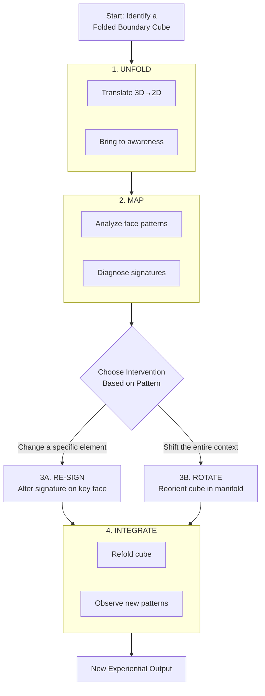
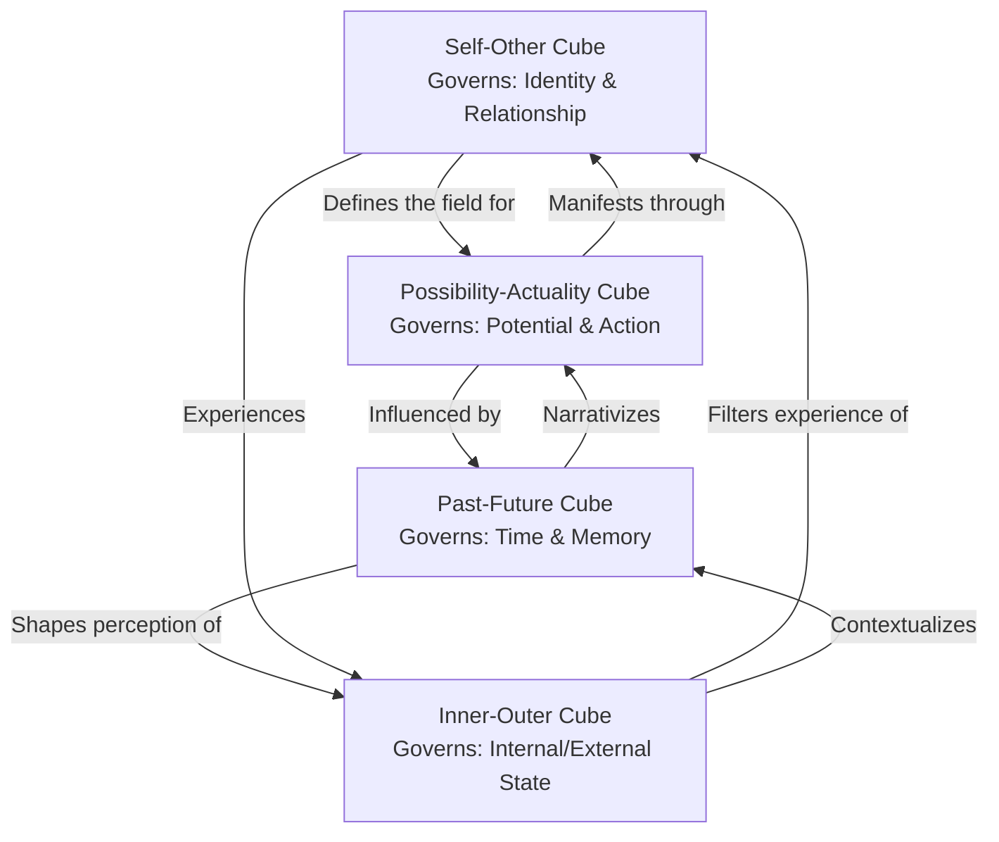
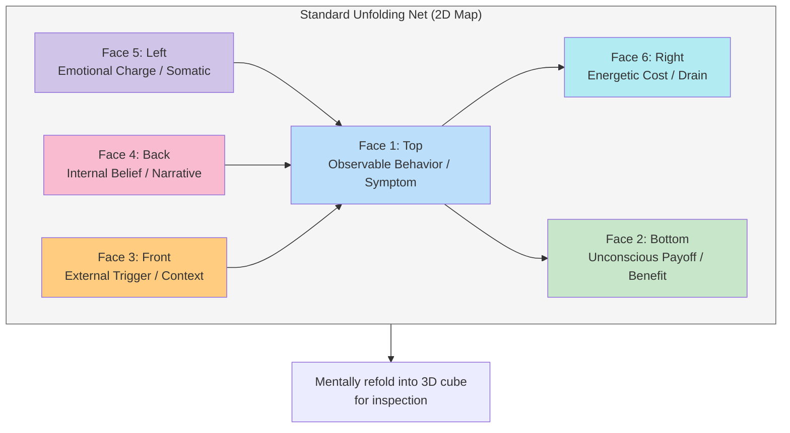
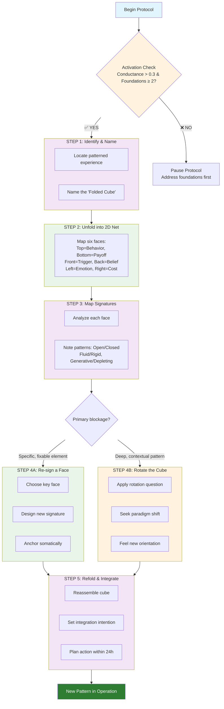
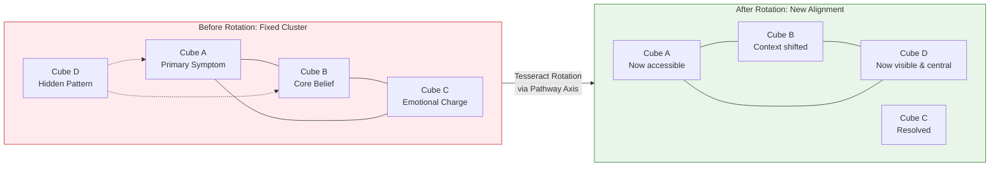

---
aeo_metadata:
  title: "Geometric Unpacking: The Tesseract Protocol (Node 06)"
  description: "The core operational protocol for conscious reality transformation, providing step-by-step methods to identify, unfold, and reconfigure the boundary conditions of experience within the tesseract model."
  context: "The practical 'how-to' manual for applying the framework's geometry. Translates theoretical models into actionable boundary work for personal, relational, and systemic change."
  key_objectives:
    - "Provide the step-by-step Boundary Cube Work Protocol for practical application"
    - "Define the four core operations (Unfolding, Mapping, Re-signing, Rotation) and when to use them"
    - "Connect geometric unpacking directly to the Four Pathways, Ethical Axes, and Dialectical Phases"
    - "Enable users to transform abstract patterns into mappable, changeable geometric structures"
  core_concepts:
    - "Boundary Cube Work Protocol: The 5-step method for geometric intervention"
    - "Four Core Operations: Unfolding, Mapping, Re-signing, Rotation"
    - "Cube Archetypes: Self-Other, Possibility-Actuality, Past-Future, Inner-Outer Cubes"
    - "Signatures: The specific patterns (Open/Closed, Fluid/Rigid) on cube faces"
    - "Tesseract Rotation: Meta-protocol for shifting entire systems of cubes"
  ontological_foundation: "Analytic Idealism / Geometric Consciousness / Boundary Condition Logic"
  epistemic_framework: "Operational Geometry / Protocol-Based Transformation / Pattern Recognition"
  operational_focus: "Step-by-step boundary work protocols, cube mapping, signature analysis, integration practices"
  search_queries:
    - "geometric unpacking tesseract protocol step by step"
    - "boundary cube work how to guide"
    - "conscious reality transformation geometric method"
    - "tesseract rotation protocol advanced boundary work"
  related_nodes:
    - "02-epistemic-architecture-tesseract.md (foundational geometric model)"
    - "03-ethics-four-axes.md (ethical direction for re-signing work)"
    - "04-temporal-unfolding-dialectical-phases.md (temporal context for interventions)"
    - "05-mandala-axis-four-pathways.md (modes of engagement for protocol application)"
  visual_diagrams:
    - "Four Core Operations Flow"
    - "Boundary Cube Work Protocol Flowchart"
    - "Cube Archetypes Relationship Map"
    - "Standard Unfolding Net (2D Map)"
    - "Cube Clusters and Tesseract Rotation"
  framework_status: "Stable v2.1 (comprehensive operational revision)"
  last_updated: "2024-01-11"
  revision_notes: "Transformed from theoretical geometry to practical protocol guide; added step-by-step methods, integration with all core nodes, operational tools, and visual guides"
  validation_status: "Operationally defined with clear protocols; requires community practice feedback"
  application_areas:
    - "Personal pattern transformation and habit change"
    - "Relational conflict resolution and boundary setting"
    - "Organizational system analysis and redesign"
    - "Community and cultural pattern intervention"
  implementation_levels:
    - "Beginner: Applying the 5-step protocol to personal patterns"
    - "Intermediate: Working with cube clusters and multiple signatures"
    - "Advanced: Tesseract rotation and systemic manifold work"
  boundary_connections:
    primary: "Direct operationalization of boundary condition theory from Node 01"
    secondary: "Provides the geometric 'how' for ethical axis movement from Node 03"
    tertiary: "Serves as the technical substrate for pathway work from Node 05"
  integration_points:
    - "Transforms tesseract theory into repeatable practice"
    - "Provides geometric tools for all four pathways to use"
    - "Creates measurable interventions for phase conductance tracking"
  next_development_steps:
    - "Community case study collection of protocol applications"
    - "Development of digital cube mapping and visualization tools"
    - "Advanced practitioner training materials for tesseract rotation"
  success_metrics:
    - "Ability to consistently identify and name folded boundary cubes"
    - "Successful application of re-signing or rotation to create observable change"
    - "Integration of protocol into regular personal or communal practice"
  maintenance_schedule:
    - "Quarterly review of protocol clarity and usability"
    - "Annual integration of advanced practice insights"
    - "Continuous collection of application examples and refinements"
  update_triggers:
    - "Emergence of new boundary patterns requiring protocol adaptation"
    - "Community feedback indicating steps needing clarification"
    - "Technological advances enabling new visualization methods"
  license_status: "Open for practical application and adaptation with attribution"
  contributor_guidelines: "Protocol refinements, case studies, and visualization tools particularly welcome"
  version_history:
    - "v1.0: Theoretical geometric exploration"
    - "v2.0: Initial operational protocol development"
    - "v2.1: Comprehensive restructuring into practical guide with full framework integration"
  documentation_status: "Complete with protocols, examples, diagrams, and integration guides"
---
# Geometric Unpacking: The Tesseract Protocol (Node 06)

## The Operating System for Conscious Reality

While the Tesseract model (Node 02) provides the *architecture* and the Pathways (Node 05) provide the *modes of engagement*, Geometric Unpacking is the **core operational protocol**. It is the precise, repeatable method for intervening in the boundary conditions of consciousness to transform experienced reality.

> **Core Proposition**: If reality manifests through boundary conditions within consciousness (Node 01), and these conditions have a geometric structure (Node 02), then we can change our reality by consciously "unpacking" and reconstituting these geometric forms. This is the practical mechanics of boundary work.

### What is "Geometric Unpacking"?
It is the process of:
1.  **Identifying** a "Folded Boundary Cube" — a geometric pattern that structures a specific area of your experience (e.g., a recurring conflict, a personal limitation, a systemic loop).
2.  **Unfolding** it from its compressed, operational state into its component parts for examination.
3.  **Mapping** its signatures (the unique patterns of energy and information on its faces).
4.  **Re-signing** or **Rotating** it — consciously altering its signatures or its orientation in the higher-dimensional manifold to produce a new experiential outcome.

This document provides the step-by-step methodology for this work.

---

## Part 1: Core Theory & Components

### The Geometry of Experience: A Recap
- **The Tesseract (4D Hypercube)**: The fundamental geometric model of reality as a structured, multi-dimensional manifold of conscious experience.
- **Boundary Cubes (3D)**: Three-dimensional "slices" or facets of the tesseract that define specific domains of experience (e.g., a Relationship Cube, a Work Cube, a Self-Image Cube).
- **Folded vs. Unfolded States**: A **Folded Cube** is operating unconsciously in the background, generating your default patterns. An **Unfolded Cube** is laid open for conscious inspection and intervention.
- **Signatures (2D)**: The patterns on each face of a cube. These are the specific "rules," emotional charges, beliefs, and data flows that define *how* that boundary operates (e.g., a face with a "Scarcity" signature governs resource flow).

### The Four Core Operations
| Operation | Geometric Action | Conscious Action | Primary Purpose |
| :--- | :--- | :--- | :--- |
| **Unfolding** | Translating a cube from 3D to a 2D net. | Bringing an unconscious pattern into full awareness. | **Diagnosis & Clarity.** To see the full structure of a problem. |
| **Mapping** | Analyzing the pattern (signature) on each face. | Investigating the specific beliefs, emotions, and rules on each aspect of the boundary. | **Analysis.** To understand the "source code" of the pattern. |
| **Re-signing** | Altering the signature on one or more faces. | Consciously changing a belief, emotional response, or agreement. | **Direct Change.** To edit a specific, problematic element. |
| **Rotation** | Reorienting the entire cube within the 4D tesseract. | Shifting the context or paradigm through which the entire boundary is viewed. | **Paradigm Shift.** To generate a completely new perspective or set of possibilities. |

### The Four Boundary Cube Archetypes
The framework identifies four primary cube types, each governing a fundamental axis of experience. Most complex patterns involve a cluster of these.

| Cube Archetype | Governs the Boundary of... | Sample Manifestation | Unfolding Question |
| :--- | :--- | :--- | :--- |
| **Self-Other Cube** | Identity, separation, and relationship. | "I am not like them"; social anxiety; codependency. | "Where do I end and another begin in this situation?" |
| **Possibility-Actuality Cube** | Potential, action, and manifestation. | Procrastination; imposter syndrome; "stuckness." | "What is possible here vs. what feels fixed?" |
| **Past-Future Cube** | Time, memory, legacy, and projection. | Rumination; anxiety about the future; repetitive trauma. | "How is the past actively shaping the future here?" |
| **Inner-Outer Cube** | Internal state and external reality. | "The world is hostile"; spiritual bypassing; performativity. | "What is truly internal versus externally imposed?" |

---

## Part 2: The Core Protocol: Boundary Cube Work

This is the essential, step-by-step method for applying geometric unpacking to a specific issue.

### Protocol Prerequisites: The Activation Check
Before beginning, ensure the following conditions are met. This is a safety and efficacy check.
- **System Phase Conductance (from Node 04) is > 0.3.** The system (you, your team) is not in total stagnation or chaotic collapse.
- **Relevant Embodied Foundations are ≥ 2.** You have the basic stability (safety, energy, connection) to process the work.
- **Your Pathway Intent is Clear.** Know which mode of engagement (Node 05) you are primarily using (e.g., *Awakening* for unfolding, *Making* for re-signing).

### Step-by-Step Boundary Cube Work Protocol

**Step 1: Identify & Name the Folded Cube**
*   **Action**: Locate a recurring, patterned experience. Give the pattern a descriptive, geometric name.
*   **Prompt**: "What is the repetitive, bounded experience that feels like a 'box' I'm in? (e.g., *The Procrastination Cube*, *The Conflict Loop Cube with [Person X]*, *The Financial Scarcity Cube*)."
*   **Output**: A single, named "Folded Boundary Cube."

**Step 2: Unfold into the 2D Net**
*   **Action**: Mentally/spatially lay out the cube's six faces. Assign each face a domain.
*   **Standard Net Map**:
    *   **Face 1 (Top)**: The Observable Behavior / Symptom.
    *   **Face 2 (Bottom)**: The Unconscious Payoff / Hidden Benefit.
    *   **Face 3 (Front)**: The External Trigger / Context.
    *   **Face 4 (Back)**: The Internal Belief / Narrative.
    *   **Face 5 (Left)**: The Emotional Charge / Somatic Feeling.
    *   **Face 6 (Right)**: The Energetic Cost / Resource Drain.
*   **Output**: A mental or physical map of the cube's six aspects.

**Step 3: Map the Signatures**
*   **Action**: Investigate and describe the specific pattern on each face. Be brutally honest.
*   **Prompt for each face**: "What is the specific, concrete signature here? Not 'fear,' but 'a cold clutch in the stomach when I think of starting.' Not 'a belief,' but 'the voice that says I'll fail.'"
*   **Tool**: Use the "Signature Spectrum" for common patterns (e.g., **Open <-> Closed**, **Fluid <-> Rigid**, **Generative <-> Depleting**).
*   **Output**: A detailed signature map (e.g., Face 4 (Belief): Signature = **Rigid**, Content = "My work must be perfect to be valuable.").

**Step 4A: Intervention - Re-sign a Face**
*   **Action**: Choose the face whose change would most disrupt the old pattern. Consciously design a new signature.
*   **Process**:
    1.  **Acknowledge** the old signature fully.
    2.  **Design** the new signature. Make it specific, affirmative, and slightly aspirational (e.g., change "Rigid (Must be perfect)" to "Adaptive (Good enough to learn from)").
    3.  **Anchor** the new signature. Create a somatic gesture, a new phrase, or a visual symbol for it. Apply it when the trigger occurs.
*   **Output**: A new operational signature on one key face of the cube.

**Step 4B: Intervention - Rotate the Cube**
*   **Action** (Used for deeper paradigm locks): Instead of changing a face, change the cube's orientation. Ask a rotation question.
*   **Rotation Questions**:
    *   "What if this *limitation* was actually a *protective boundary*?"
    *   "What if the *problem* is actually a *signal* pointing to a deeper need?"
    *   "How would a being from a different phase (1D, 2D, 3D) view this cube?"
*   **Process**: Hold the cube in mind, apply the rotation question, and feel for the "click" of a new perspective. The signatures may feel different without being directly edited.
*   **Output**: A fundamental shift in the meaning and context of the entire cube.

**Step 5: Refold & Integrate**
*   **Action**: Mentally reassemble the cube with its new signature(s) or orientation. Drop it back into the tesseract manifold.
*   **Process**: Visualize/sense the new cube operating in the background of your experience. Set an intention to notice its new outputs. Plan a simple "integration action" in the real world within 24 hours.
*   **Output**: A newly configured Boundary Cube operating subconsciously to generate new patterns.

---

## Part 3: Advanced Operations & Tesseract Rotation

### Working with Cube Clusters
Most significant life patterns are not single cubes, but interlocking clusters (e.g., a *Procrastination Cube* linked to a *Self-Worth Cube* and a *Fear of Success Cube*).
- **Mapping Clusters**: Unfold primary cube. Notice which face connects to another cube. Follow the connection and unfold the next.
- **The Leverage Point**: Find the cube in the cluster with the most rigid or intense signature. Changing this one often shifts the entire network.
- **Integration Protocol**: Work on one cube at a time, but hold the cluster map in awareness. Notice how changes in one affect the others.

### The Tesseract Rotation Protocol
This is a meta-protocol for when entire systems of cubes (a local region of your tesseract) are stuck in a fixed configuration.

1.  **Identify the Local Manifold**: Name the domain of life that feels uniformly stuck (e.g., "My Creative Expression Manifold").
2.  **Sense the Dominant Geometry**: What is the overall shape? Is it compressed? Twisted? Fractured?
3.  **Choose a Rotation Axis**: Use the Pathways as rotation axes:
    *   **Awakening Axis**: Rotate to prioritize clarity over outcome.
    *   **Making Axis**: Rotate to prioritize action over analysis.
    *   **Liberation Axis**: Rotate to prioritize connection over individual progress.
    *   **Healing Axis**: Rotate to prioritize wholeness over efficiency.
4.  **Execute the Rotation**: Perform a ritual, deep meditation, or series of actions symbolizing this priority shift for a set period (e.g., one week).
5.  **Observe New Cube Alignments**: After rotation, old cubes may resolve easily, and new, previously hidden cubes may become visible for work.

---

## Part 4: Integration & Praxis

### Connecting to the Solarpunk Mandala Framework
Geometric Unpacking is the tool that brings the other nodes to life.

| Mandala Component | How Geometric Unpacking Applies It |
| :--- | :--- |
| **Ethical Axes (Node 03)** | The "Re-signing" operation is how you move a boundary from (e.g.) **Extractive** to **Regenerative**. You change the signature on the relevant face. |
| **Dialectical Phases (Node 04)**| The complexity of cube work you can handle depends on your phase. 1D thinking can re-sign single faces. 3D+ thinking can rotate entire tesseract manifolds. |
| **Four Pathways (Node 05)**| Each pathway is a preferred "toolkit" for unpacking: **Awakening** excels at Unfolding/Mapping, **Making** at Re-signing, **Liberation** at working with Clusters, **Healing** at Tesseract Rotation. |
| **Embodied Foundations** | The pre-requisite check ensures this intellectual/energetic work is grounded in physical and emotional safety, preventing dissociation. |

### Practical Application: From Personal to Planetary
- **Personal**: Use the core protocol weekly on your most pressing "stuck pattern." Keep a "Cube Journal."
- **Relational**: Use with a partner or pod. One person unfolds their cube while others witness and ask clarifying questions. *Never map signatures for someone else.*
- **Communal**: Use to analyze group dynamics. "What is our Group Decision-Making Cube?" Map it collectively and re-sign it together.
- **Systemic**: Use the cube archetypes to analyze social systems. "Map the **Possibility-Actuality Cube** of our local economy." This reveals leverage points for activism and regenerative design.

### The Operator's Quick-Reference Guide

| Situation | Recommended Operation | Pathway Lens | Key Question |
| :--- | :--- | :--- | :--- |
| **"I keep having the same fight."** | Unfold & Map a **Self-Other Cube**. | Liberation | "What is the unspoken rule about 'winning' on Face 4?" |
| **"I feel completely stuck."** | Unfold a **Possibility-Actuality Cube**. Check for a **Closed** signature on Face 1. | Awakening | "What is the hidden benefit (Face 2) of staying stuck?" |
| **"I know my pattern but can't change it."** | Re-sign the key belief (Face 4). Anchor the new signature somatically. | Making | "What tiny, new action embodies the new signature?" |
| **"My whole life in this area feels wrong."** | Tesseract Rotation. Choose a new axis (e.g., Healing). | Healing | "If wholeness was the goal, what would I do first?" |
| **"It's a tangled mess of problems."** | Map the Cube Cluster. Find the leverage cube. | Liberation | "Which cube, if changed, would make the others obsolete?" |

---

## Conclusion: The Craft of Conscious Geometry

Geometric Unpacking is the disciplined craft of being a co-creator within a conscious universe. It moves the Solarpunk Mandala from a philosophical framework to a **living technology of transformation**.

**Starting This Week**:
1.  Pick one recurring annoyance.
2.  Name its Cube.
3.  Unfold it using the net map.
4.  Map just one face—the obvious behavior (Face 1).
5.  Simply observe this week how often you see that signature in action.

The goal is not to "fix" everything, but to develop **geometric literacy**—the ability to see the living geometry of your experience and to know you have the tools to engage with it. This is the foundation of genuine Solarpunk agency: not just dreaming of a better world, but actively repatterning the conscious substructure from which our shared world emerges.

---

**Related Documents**:
- [02-epistemic-architecture-tesseract.md](02-epistemic-architecture-tesseract.md) - The geometric theory behind this protocol.
- [03-ethics-four-axes.md](03-ethics-four-axes.md) - The ethical direction for your re-signing work.
- [05-mandala-axis-four-pathways.md](05-mandala-axis-four-pathways.md) - The modes of engagement for this work.
- [04-temporal-unfolding-dialectical-phases.md](04-temporal-unfolding-dialectical-phases.md) - Understand the phase you're working in.
