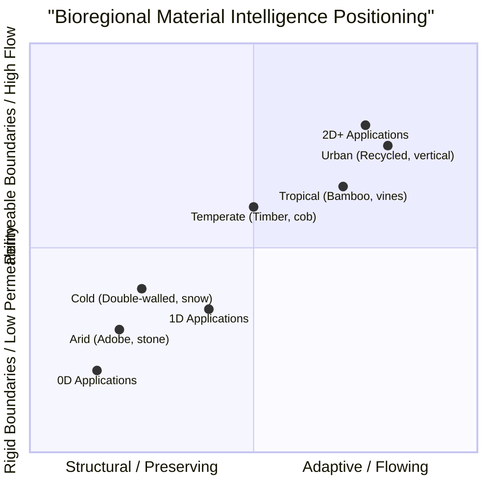
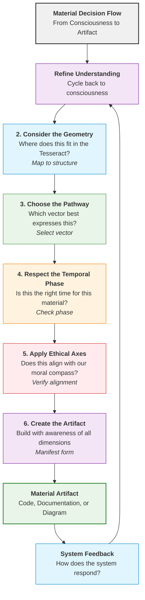
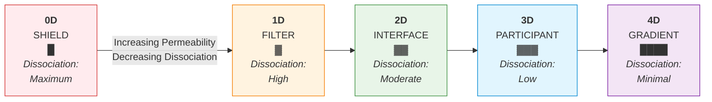
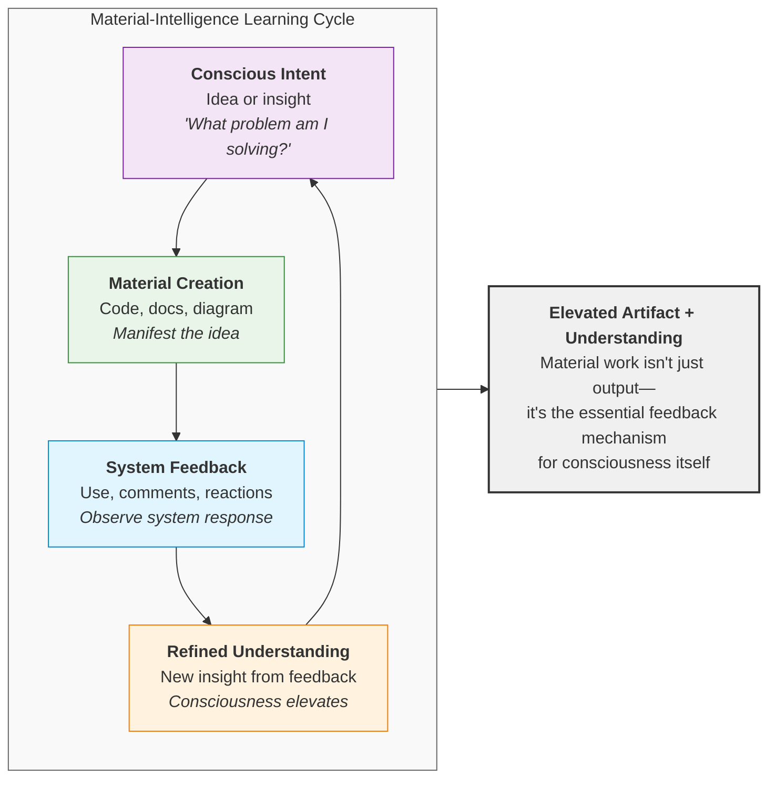
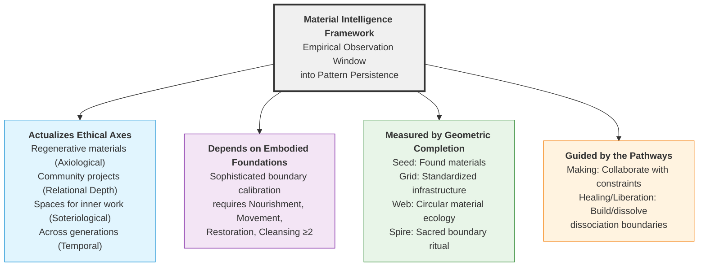

# Material Intelligence Framework

## Making the Tesseract Tangible

Material Intelligence is the study of transpersonal mentation as it patterns into stable, observable configurations under geometric constraint. Having witnessed the geometric completion (06), we now arrive at the practical question: **How do we build within this completed geometry?**

This is not "dumb practicality," but the sacred art of **manifesting consciousness into form.**

---

## The Three Dimensions of Material Work

Material Intelligence operates at three interconnected levels:

```mermaid
flowchart TD
    Material["<b>Material Intelligence</b><br>The Sacred Art of Manifesting<br>Consciousness Through Pattern Persistence"]
    
    Material --> Literal["<b>Literal Intelligence</b><br>Physical Artifact"]
    Material --> Intentional["<b>Intentional Intelligence</b><br>Geometric Constraints Crystallized"]
    Material --> Transformational["<b>Transformational Intelligence</b><br>Dissociation Boundaries Shifted"]
    
    Literal --> A1["Code that compiles"]
    Literal --> A2["Docs that are accurate"]
    Literal --> A3["Diagrams that are clear"]
    Literal --> Metric1["<b>Success Metric:</b><br>Technical Correctness"]
    
    Intentional --> B1["Code embodies boundary logic"]
    Intentional --> B2["Docs reveal Tesseract structure"]
    Intentional --> B3["Diagrams show pattern flows"]
    Intentional --> Metric2["<b>Success Metric:</b><br>Constraint Embodiment"]
    
    Transformational --> C1["Code changes problem space"]
    Transformational --> C2["Docs change learning patterns"]
    Transformational --> C3["Diagrams change perception"]
    Transformational --> Metric3["<b>Success Metric:</b><br>Coherence Flow"]
    
    style Material fill:#f0f0f0,stroke:#333,stroke-width:2px
    style Literal fill:#e1f5fe,stroke:#0288d1
    style Intentional fill:#f3e5f5,stroke:#7b1fa2
    style Transformational fill:#e8f5e8,stroke:#388e3c
    style Metric1 fill:#fff3e0,stroke:#f57c00
    style Metric2 fill:#fff3e0,stroke:#f57c00
    style Metric3 fill:#fff3e0,stroke:#f57c00
```

### 1. **Literal Intelligence** - The Physical Artifact
*What exists in concrete form.*
- Code that compiles and runs
- Documentation that's factually accurate
- Diagrams that are visually clear
- **Success metric:** Technical correctness

### 2. **Intentional Intelligence** - The Consciousness Crystallized
*What mind-state the artifact encodes.*
- Code that embodies ethical choices
- Documentation that follows coherent pathways
- Diagrams that reveal Tesseract connections
- **Success metric:** Principle embodiment

### 3. **Transformational Intelligence** - The System Change
*How the artifact changes the larger system.*
- Code that changes how people approach problems
- Documentation that changes how people learn
- Diagrams that change how people perceive relationships
- **Success metric:** Paradigm shift

---

## Material Work Assessment Matrix

For any material contribution, ask these questions:

| Dimension | Question | Example (Fixing a Bug) |
|-----------|----------|------------------------|
| **Geometric** | Where in the Tesseract? | Does this fix align with structural patterns? |
| **Pathway** | Which vector applies? | Artisan (precision) or Gardener (ecosystem health)? |
| **Temporal** | What phase is this? | Material (implementing) or Thesis (preserving)? |
| **Ethical** | Which axes engage? | Coherence (system alignment) & Care (user impact) |

### The Complete Material Decision Flow

1. **Start with consciousness:** What am I trying to manifest?
2. **Consider the geometry:** Where does this fit in the Tesseract?
3. **Choose the pathway:** Which vector best expresses this?
4. **Respect the temporal phase:** Is this the right time for this material?
5. **Apply ethical axes:** Does this align with our moral compass?
6. **Create the artifact:** Build with awareness of all dimensions.

---

## Ontological Foundation: Matter as Transpersonal Mentation Under Observation

The Material Intelligence Framework resolves a critical tension in the Solarpunk Mandala: how to reconcile the consciousness-first ontology of Analytic Idealism with the practical necessity of engaging ecological hardware. 

**Core Definition:**

Material Intelligence is **the study of transpersonal mentation as it patterns into stable, observable configurations under geometric constraint.** 

What we conventionally call "matter" is not a separate substance collaborating with consciousness—it is **the appearance of Mind at Large (MAL) when partitioned by dissociation boundaries.** When we study soil microbiomes, watershed dynamics, or fungal networks, we are not studying "matter with intelligence." We are studying **intelligence made visible through pattern persistence.**

### Why Hardware Matters in an Idealist Framework

The Solarpunk focus on ecological design, regenerative materials, and bioregional planning is not a concession to materialism. It is recognition that:

1. **Pattern Persistence Enables Self-Observation**: Stable geometric configurations allow MAL to observe itself across time and scale. A regenerative food forest is not "conscious matter" but a **scaffolding for sustained self-observation** by the same consciousness you experience as your own mind.

2. **Geometric Constraints Shape Experience**: The "intelligence" of mycelial networks or watersheds is not *in* the materials but *through* them. The **topology of embodiment**—the specific dissociation boundaries—determines what forms of mentation can stably express.

3. **Hardware is Boundary Medicine**: When we design permeable membranes (composting toilets), regenerative cycles (circular economies), or nested scales (village-to-bioregion structures), we are **calibrating dissociation boundaries** to allow more coherent flow of MAL across what appear to be separate scales.

### Material Engagement as Enactive Cognition

Material intelligence isn't about "smart materials" but about recognizing that **cognition extends into our tools, architectures, and environments**. Following the enactivist view:

1. **Tools as Cognitive Extensions:** The tesseract, mandalas, and ritual objects aren't just representations—they become **components of our cognitive system**
2. **Built Environment as Memory:** Settlements literally "remember" patterns of living through their structures
3. **Bodily Skill as Knowing:** The protocols work because they engage embodied skills, not just conceptual understanding

**Practical Implications:**
- Your "Ritual Cube Dissolving Technology" (Appendix B) works because it's an **enactive ritual**, not just a conceptual exercise
- The hexagonal mapping in the Arena is effective because it's a **perceptually-guided action space**
- Material intelligence emerges through **doing**, not just planning

### Eliminating the "Collaboration" Fallacy

**Imprecise framing**: "We collaborate with material intelligence."  
**Precise framing**: We collaborate with the **geometric constraints** that shape how MAL expresses through pattern persistence.

The carpenter doesn't collaborate with wood; she collaborates with the **dissociation topology** that manifests as grain, fiber, and lignin patterns. The bioregional planner doesn't collaborate with watersheds; she collaborates with the **boundary conditions** that appear as hydrological flow.

### Practical Implications

- **Soil Health**: Study soil as **dissociated cognition**—a stable pattern of MAL constrained by chemical, biological, and geological boundaries. Regeneration means healing those boundaries to allow more coherent flow.

- **Waste as Food**: "Waste" is not material but **boundary dysfunction**—a pattern of MAL that has become dissociated from its regenerative context. Composting is boundary medicine that reintegrates the pattern.

- **Bioregional Design**: Design for **pattern persistence** that enables sustained self-observation across nested scales. A regenerative village is a **dissociation configuration** that allows MAL to experience itself simultaneously as individual, community, and ecosystem.

---

## Bioregional Material Recommendations

This table applies the framework to five distinct climate zones, connecting local, regenerative materials with the key principles of the Solarpunk Mandala.

| Climate Zone | Boundary Materials | MAL Intelligence Expression | Resource Distribution Benefit | Dialectical Phase Application |
|--------------|-------------------|-----------------------------|------------------------------|-------------------------------|
| **Arid** | Adobe, stone, rammed earth | MAL's pattern persistence expressing thermal regulation intelligence shaped by water scarcity constraints | Thermal mass stores heat/coolth, releasing it slowly to adjacent spaces | **0D:** Emergency water catchment walls (boundary as survival) **1D:** Semi-permeable resource sharing boundaries (boundary as circulation) **2D+:** Adaptive thermal regulation systems (boundary as relationship) |
| **Tropical** | Bamboo, living vines, thatch | MAL's rapid-growth pattern persistence expressing abundance constraints | Rapid growth materials that self-repair while providing food, medicine, and shade | **0D:** Elevated flood-resistant platforms (boundary as protection) **1D:** Living boundary walls for food production (boundary as nourishment) **2D+:** Seasonal reconfiguration systems (boundary as adaptation) |
| **Temperate** | Timber lattice, cob, living willow | MAL's seasonal rhythm pattern persistence expressing balance constraints | Seasonal adaptability with materials that can be harvested sustainably | **0D:** Rapid-deployment shelters (boundary as immediacy) **1D:** Convertible boundary systems (boundary as flexibility) **2D+:** Multi-seasonal boundary designs (boundary as integration) |
| **Cold** | Double-walled structures, snow blocks | MAL's preservation pattern persistence expressing winter constraints | Insulating air gaps that maintain core temperature while allowing visual connection | **0D:** Maximum insulation survival pods (boundary as concentration) **1D:** Heat-sharing boundary channels (boundary as generosity) **2D+:** Solar orientation optimization (boundary as alignment) |
| **Urban** | Recycled materials, vertical gardens | MAL's transformation pattern persistence expressing waste-stream constraints | Industrial discards become resource distribution infrastructure | **0D:** Portable boundary systems (boundary as mobility) **1D:** Modular hexagonal containers (boundary as recombination) **2D+:** Living infrastructure integration (boundary as symbiosis) |

---

## The Dialectics of Boundary Permeability

A core function is designing *dissociation boundaries*—permeable membranes that regulate MAL's flow between different pattern configurations.

The boundary's function evolves through the dimensional phases:

*   **0D (Dissolution / Survival):** The boundary must provide maximum definition and protection. It is a **shield**. Permeability is minimized to conserve critical resources (heat, water, safety).
*   **1D (Emergence / Stability):** The boundary begins to facilitate controlled exchange. It becomes a **filter** or **channel**. Permeability is calibrated to allow the flow of essential resources while filtering out harm.
*   **2D (Integration / Relationship):** The boundary actively mediates complex relationships. It is an **interface** or **exchange surface**. Its permeability varies across its surface to facilitate different types of connection—visual, social, ecological.
*   **3D (Transformation / System):** The boundary becomes a **participant in systemic metabolism**. It is intelligent and adaptive, changing its permeability in response to seasonal, social, or ecological cycles.
*   **4D (Reunification / Symbiosis):** The distinction between "boundary" and "system" dissolves. The membrane is so finely tuned to the flows of the whole that it is experienced as a **gradient of belonging**, not a line of separation.

**The key principle:** A boundary designed for a 3D phase (complex, adaptive) will fail in a 0D context (where simple, robust survival is needed), and vice-versa. Material Intelligence requires diagnosing the community's phase and designing boundaries that match its capacity for relationship.

---

## Material-Intelligence Labels

This repository uses labels to track material intelligence dimensions:

- `material:literal` - Technical correctness focus
- `material:intentional` - Principle embodiment focus  
- `material:transformational` - System change focus
- `intelligence:technical` - Code/technical work
- `intelligence:spatial` - Visual/diagram work
- `intelligence:linguistic` - Documentation/writing work

**Label combination example:**
- `[material:intentional][intelligence:spatial]` - Diagram that embodies principles
- `[material:transformational][intelligence:technical]` - Code that changes paradigms

---

## The Material-Intelligence Feedback Loop

Material work creates a continuous learning cycle that connects consciousness to tangible form and back again:

**In practice:**
1.  **You intend to clarify a concept** (consciousness)
2.  **You create documentation** (material)
3.  **Others engage with it** (feedback)
4.  **You understand the concept better** (refined consciousness)
5.  **You improve the documentation** (better material)

**The insight:** Material work isn't just output—it's the essential feedback mechanism for consciousness. Each cycle elevates both the artifact and the understanding behind it.

---

## Implementation Principles

- **Consciousness First Principle:** Materials are expressions of MAL's intelligence through local adaptation. Select materials that remember their origin in Mind at Large and express place-specific wisdom.
- **Local Abundance First:** Prioritize materials that are locally abundant, regenerative, or waste-streams from other processes.
- **Multi-Functionality:** Select materials that serve multiple purposes simultaneously (structural, thermal, aesthetic, productive).
- **Adaptive Capacity:** Choose materials that can be seasonally adapted or rapidly reconfigured during crises.
- **Skill Accessibility:** Ensure boundary materials can be worked with locally available skills and tools.
- **Permeability Calibration:** Design boundaries with precisely calibrated permeability based on community needs and dialectical phase. A boundary for survival (0D) differs fundamentally from one for complex integration (2D+).

---

## Integration with the Full Mandala Model

The Material Intelligence Framework is the **empirical observation window** into the broader model. It traces how MAL expresses through pattern persistence in what we conventionally call "matter":

*   **It actualizes the Ethical Axes:** Regenerative materials (Axiological Axis) used in community-building projects (Relational Depth Axis) create spaces for inner work (Soteriological Axis) across generations (Temporal Orientation Axis).
*   **It depends on the Embodied Foundations:** A community cannot practice sophisticated material collaboration (requiring high **Nourishment**, **Movement**, and **Restoration**) if it is in survival mode (low foundations).
*   **It is measured by Geometric Completion:** 
    - A **Seed** completion might use found materials for a simple shelter.
    - A **Grid** completion uses standardized materials for shared infrastructure.
    - A **Web** completion develops a local, circular material ecology.
    - A **Spire** moment sees material, craft, and ritual become one.
*   **It is guided by the Pathways:** The **Path of Making** is the practice of collaborating with geometric constraints to shape how MAL expresses through pattern persistence. The **Paths of Healing and Liberation** inform *which* boundaries need to be built or dissolved (e.g., walls of segregation vs. gates of welcome).

**To apply this framework:** Begin by mapping local material intelligences (clays, stones, fibers, waste streams). Then, diagnose your community's primary dialectical phase. Finally, design boundaries that use those materials to create membranes with the precise permeability needed to support your next phase of growth.

---

**Next:** Explore the symphony of minds that create together.

**[Continue to: Multiple Intelligences →](08-multiple-intelligences-framework.md)**

---

*This document embodies Material Intelligence at the intentional level—crafting practical guidance that encodes geometric principles.*
