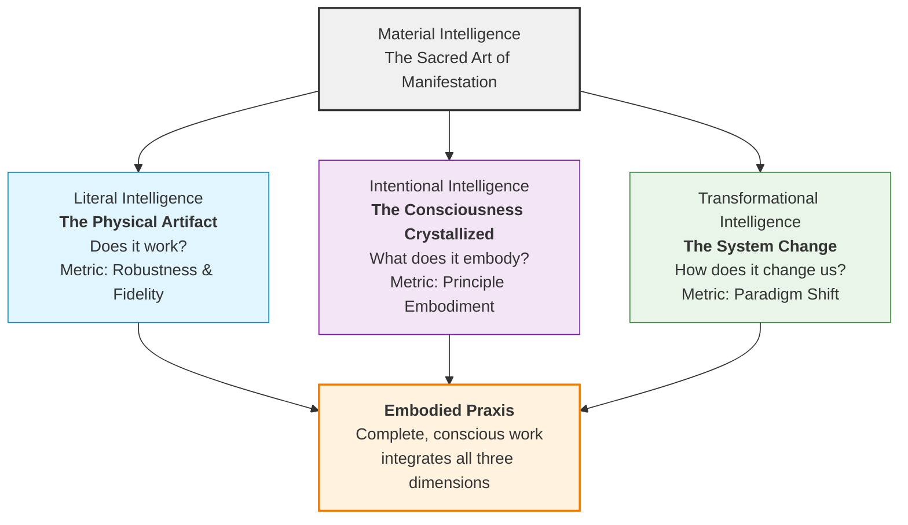
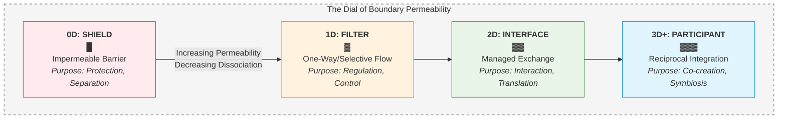
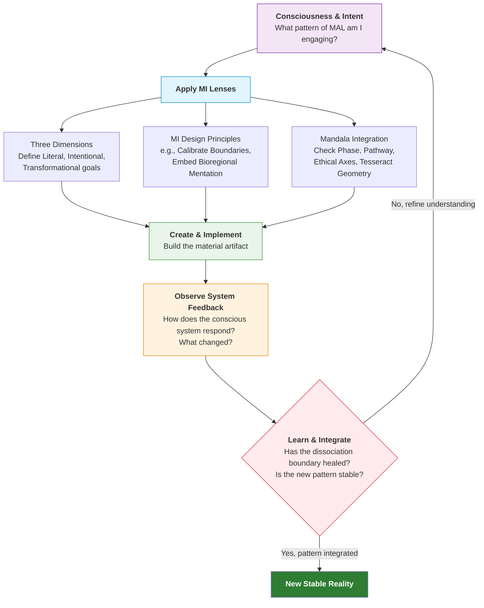

---
aeo_metadata:
  title: "Material Intelligence Framework (Node 07)"
  description: "The practical application layer of the Mandala, translating consciousness-first ontology into the sacred art of building. It reframes 'matter' as localized, patterned consciousness and provides protocols for creating artifacts that heal dissociation and manifest coherent reality."
  context: "The crucial bridge and application layer that connects the Mandala's theory (ontology, geometry, ethics) to tangible praxis in technology, ecology, and design. It answers 'how to build' within a conscious universe."
  key_objectives:
    - "Define and operationalize the Three Dimensions of Material Intelligence: Literal, Intentional, and Transformational work."
    - "Establish the 'Dial of Agency' as a scale for recognizing the mentational quality in material systems."
    - "Provide the MI Project Protocol, a practical worksheet for planning and evaluating any project through an MI lens."
    - "Transition design paradigms from resource extraction to relational intelligence and boundary calibration."
  core_concepts:
    - "Material Intelligence (MI): The study of transpersonal mentation patterning into stable forms under geometric constraint."
    - "Three Dimensions of MI Work: Literal (artifact), Intentional (consciousness crystallized), Transformational (system change)."
    - "The Dial of Agency: A spectrum from Pattern Persistence to Adaptive Mentation for engaging non-human systems."
    - "Pattern Persistence: Stable geometric configurations that allow Mind at Large (MAL) self-observation."
    - "Boundary Permeability: The design of dissociation interfaces (Shield, Filter, Interface, Participant) to regulate flow."
    - "Enactive Cognition: The understanding that tools and environments are extensions of mind, not separate from it."
  ontological_foundation: "Analytic Idealism / Mind at Large (MAL)"
  epistemic_framework: "Geometric Constraint / Pattern Theory / Enactivism"
  operational_focus: "Practical design protocols, bioregional design principles, project assessment, tangible artifact creation."
  search_queries:
    - "Material Intelligence Solarpunk how to build"
    - "Three dimensions of material work literal intentional transformational"
    - "Dial of Agency non-human consciousness"
    - "MI Project Protocol design worksheet"
    - "Bioregional design consciousness geometric constraint"
  related_nodes:
    - "01-ontology-analytic-idealism.md (foundational theory of consciousness)"
    - "02-epistemic-architecture-tesseract.md (geometric model for MI work)"
    - "03-ethics-four-axes.md (ethical guidance for material choices)"
    - "04-temporal-unfolding-dialectical-phases.md (temporal context for MI projects)"
    - "05-mandala-axis-four-pathways.md (engagement modes for MI practice)"
    - "08-multiple-intelligences-framework.md (complementary view of intelligence types)"
  visual_diagrams:
    - "The Three Dimensions of Material Intelligence (central triad)"
    - "The Dialectics of Boundary Permeability (Shield to Participant scale)"
    - "The Complete Material Decision Flow (process cycle)"
  framework_status: "Stable v2.0 (comprehensively revised and operationalized)"
  last_updated: "2024-01-11"
  revision_notes: "Expanded from a philosophical definition to a full operational framework with protocols, principles, and integration guides."
  application_areas:
    - "Regenerative architecture and bioregional design"
    - "Conscious software development and systems design"
    - "Tool-making and technology design through an MI lens"
    - "Community project planning and assessment"
    - "Healing dissociation in ecological and social systems"
  implementation_levels:
    - "Personal: Analyzing and designing everyday objects and habits."
    - "Communal: Using the MI Project Protocol for group initiatives."
    - "Systemic: Applying MI principles to infrastructure and policy design."
  integration_points:
    - "Operationalizes the Tesseract model through material work."
    - "Provides the 'how-to' mechanism for applying the Ethical Axes."
    - "Requires and informs awareness of Dialectical Phases."
    - "Executed through the Four Pathways as modes of engagement."
---
# Material Intelligence Framework (Node 07)

## The Sacred Art of Conscious Manifestation

The Material Intelligence (MI) Framework bridges the most critical gap in the Solarpunk Mandala: **how to translate a consciousness-first ontology into the practical, tangible work of building a regenerative world.** It answers the question: If consciousness is fundamental, what are we actually doing when we write code, build soil, or design a village?

> **Core Proposition**: What we perceive as "matter" is not a separate substance but **localized, patterned consciousness**—transpersonal mentation (Mind at Large) made stable and observable through geometric constraint. Material work is therefore the sacred art of collaborating with these patterns to heal dissociation and manifest coherent reality.

### Framework Integration: The Role of MI
MI is the **application layer** of the Mandala. It takes the geometric understanding of the Tesseract (Node 02), the ethical guidance of the Four Axes (Node 03), the temporal awareness of the Dialectical Phases (Node 04), and the engagement modes of the Four Pathways (Node 05) and turns them into **concrete, transformative practice.**

---

## Part 1: The Ontological Lens — Matter as Localized Consciousness

### Resolving the Idealism-Materialism Tension
The Solarpunk Mandala is founded on Analytic Idealism (Node 01), where consciousness is fundamental. This can create a seeming contradiction with the urgent, physical work of ecological regeneration. The MI Framework resolves this not by conceding to materialism, but by refining our understanding of "material."

**Core Definition**:
**Material Intelligence** is the study of transpersonal mentation as it patterns into stable, observable configurations under geometric constraint.

**What This Means in Practice**:
- **A Mycelial Network** is not "smart dirt," but a visible, stable pattern of Mind at Large (MAL), its intelligence expressed through the specific geometric constraints of hyphal growth, chemical exchange, and network topology.
- **A River Watershed** is a pattern of MAL expressing through the constraints of gravity, geology, and climate—its "intelligence" is the coherent, adaptive flow of information (water, sediment, life) within those boundaries.
- **A Codebase** is a pattern of consciousness crystallized into symbolic logic, its intelligence expressed through the execution of algorithms that transform information.

### Key Implications for Solarpunk Praxis
1.  **From Extraction to Relationship**: We are not extracting value from inert resources, but engaging in relationship with conscious patterns. The goal shifts from exploitation to **boundary calibration**—adjusting the constraints (e.g., soil chemistry, code architecture) to allow for more coherent, healthy flow.
2.  **Waste as Boundary Dysfunction**: "Waste" is a pattern of MAL that has become dissociated from its regenerative context. Composting, recycling, and circular design are forms of **boundary medicine** that reintegrate these patterns.
3.  **Hardware as Enactive Cognition**: Our tools, buildings, and infrastructures are not separate from our thinking; they are extensions of it. A well-designed tool shapes and enables new forms of thought and collaboration.

---

## Part 2: The Three Dimensions of Material Work

All acts of creation operate simultaneously across three dimensions of intelligence. Superior work consciously addresses all three.

```mermaid
flowchart TD
    MI["Material Intelligence<br>The Sacred Art of Manifestation"]
    
    MI --> L["Literal Intelligence<br><b>The Physical Artifact</b><br>Does it work?<br>Metric: Robustness & Fidelity"]
    MI --> I["Intentional Intelligence<br><b>The Consciousness Crystallized</b><br>What does it embody?<br>Metric: Principle Embodiment"]
    MI --> T["Transformational Intelligence<br><b>The System Change</b><br>How does it change us?<br>Metric: Paradigm Shift"]
    
    L & I & T --> Praxis["<b>Embodied Praxis</b><br>Complete, conscious work<br>integrates all three dimensions"]
    
    style MI fill:#f0f0f0,stroke:#333,stroke-width:2px
    style L fill:#e1f5fe,stroke:#0288d1
    style I fill:#f3e5f5,stroke:#7b1fa2
    style T fill:#e8f5e8,stroke:#388e3c
    style Praxis fill:#fff3e0,stroke:#f57c00,stroke-width:2px
```

### 1. Literal Intelligence (The Physical Artifact)
The tangible, functional reality of the thing created.
*   **Focus**: Technical correctness, functionality, structural integrity.
*   **The Question**: "Does it work? Is it well-made?"
*   **Examples**: Code that compiles without error. A wall that is plumb and load-bearing. Documentation that is factually accurate.
*   **Success Metric**: **Robustness & Fidelity**.

### 2. Intentional Intelligence (The Consciousness Crystallized)
The consciousness, ethics, and geometric logic encoded into the artifact's form.
*   **Focus**: Embodiment of principles, alignment with the Tesseract's geometry, ethical expression.
*   **The Question**: "What consciousness does this form embody? What relationships does it structure?"
*   **Examples**: Code structured according to boundary-logic principles. A building designed for communal interaction and resource flow. A diagram that reveals the Tesseract geometry of a system.
*   **Success Metric**: **Principle Embodiment & Geometric Coherence**.

### 3. Transformational Intelligence (The System Change)
The change the artifact catalyzes in the larger conscious system—the minds, relationships, and patterns around it.
*   **Focus**: Paradigm shift, healing of dissociation boundaries, evolution of collective understanding.
*   **The Question**: "How does this change the way we think, relate, and perceive?"
*   **Examples**: A tool that changes a community's problem-solving approach. A ritual space that facilitates collective healing. A policy that re-patterns social dynamics towards equity.
*   **Success Metric**: **Paradigm Shift & Coherence Flow**.

**Application**: In any project, explicitly define your target outcomes for all three dimensions. A solar panel (Literal) embodies regenerative energy principles (Intentional) to shift a household's relationship to consumption (Transformational).

---

## Part 3: Principles for MI-Informed Design

These principles guide the translation of MI theory into design decisions, from software to settlement planning.

### Principle 1: Design for Pattern Persistence & Self-Observation
Create forms that are stable enough for MAL to "observe itself" across time, yet adaptable enough to learn and evolve.
*   **Practice**: Use feedback loops, modularity, and redundant systems. Design gardens that reveal ecological succession, or code with clear observability and logs.

### Principle 2: Calibrate Boundary Permeability
Consciously design the "dissociation boundaries" in your system—the interfaces between components, systems, or people—to regulate flow for health.
*   **Practice**: Apply the "Dialectics of Boundary Permeability" (see below). Should this membrane be a SHIELD (0D), a FILTER (1D), an INTERFACE (2D), or a PARTICIPANT (3D+)? Examples: A privacy fence vs. a picket fence vs. a shared hedge.

### Principle 3: Embed Bioregional Mentation
Let the specific, localized patterns of consciousness (climate, ecology, geology) inform and shape the design. Work *with* the constraints as expressions of intelligence.
*   **Practice**: Use the Bioregional Design Matrix (see below) not as a prescription, but as a starting point for dialogue with place.

### Principle 4: Enact Through the Full Pathway Cycle
Use the Four Pathways (Node 05) as a complete design cycle: **Awaken** to the existing patterns, **Make** the new intervention, **Liberate** it by integrating diverse needs, and **Heal** the disruption caused by change.

```mermaid
flowchart LR
    subgraph Scale["The Dial of Boundary Permeability"]
        direction LR
        S0["<b>0D: SHIELD</b><br>█<br>Impermeable Barrier<br><i>Purpose: Protection, Separation</i>"]
        S1["<b>1D: FILTER</b><br>▓<br>One-Way/Selective Flow<br><i>Purpose: Regulation, Control</i>"]
        S2["<b>2D: INTERFACE</b><br>▓▓<br>Managed Exchange<br><i>Purpose: Interaction, Translation</i>"]
        S3["<b>3D+: PARTICIPANT</b><br>▓▓▓<br>Reciprocal Integration<br><i>Purpose: Co-creation, Symbiosis</i>"]
    end

    S0 -- "Increasing Permeability<br>Decreasing Dissociation" --> S1 --> S2 --> S3

    style Scale fill:#f5f5f5,stroke:#666,stroke-dasharray: 5 5
    style S0 fill:#ffebee,stroke:#d32f2f
    style S1 fill:#fff3e0,stroke:#f57c00
    style S2 fill:#e8f5e8,stroke:#388e3c
    style S3 fill:#e1f5fe,stroke:#0288d1
```

---

## Part 4: The MI Project Protocol — A Practical Worksheet

Use this protocol to plan and evaluate any project through the lens of Material Intelligence.

**Project Name:** _________________________
**Primary Pathway in Use:** [ ] Awakening [ ] Making [ ] Liberation [ ] Healing

### Phase 1: Foundation & Intent
1.  **Consciousness Clarification**: What specific pattern of consciousness (MAL) am I trying to engage with, stabilize, or transform? (e.g., "The pattern of fragmented communication in our team," "The water flow pattern on this land.")
2.  **Core Intent**: What is the deepest desired outcome? Frame it as a shift in a dissociation boundary or pattern persistence.

### Phase 2: Three-Dimensional Goal Setting
| Dimension | Goal for This Project | How We'll Measure It |
| :--- | :--- | :--- |
| **Literal Intelligence** | (The tangible artifact/outcome) | |
| **Intentional Intelligence** | (The principle/geometry embodied) | |
| **Transformational Intelligence** | (The systemic/behavioral change) | |

### Phase 3: Design & Principle Application
3.  **Bioregional Mentation**: What are the key material/contextual constraints here? What "intelligence" do they express? (Refer to Bioregional Matrix below).
4.  **Boundary Permeability Design**: What are the key boundaries in this system? What level of permeability (0D-4D) is optimal for each, and why?
5.  **Ethical Axis Alignment**: How does this project align with the Four Ethical Axes (Regen/Extract, Coop/Compete, Adapt/Dominate, Open/Closed)?

### Phase 4: Integration & Check
6.  **Temporal Phase Check**: What is the current Dialectical Phase of the system I'm working in? Is my design appropriate for that phase (e.g., not introducing 3D complexity to a 0D crisis)?
7.  **Tesseract Geometry**: Where in the Tesseract's structure does this work primarily take place? (e.g., working on a specific Boundary Cube?).

### Bioregional Design Matrix: Principles in Context
| Climate/Context | Material Expression of MAL | Core MI Design Challenge | Sample MI Principle Application |
| :--- | :--- | :--- | :--- |
| **Arid** | Persistence & thermal regulation under water scarcity. | Creating cooling and microclimates without abundant water. | **Principle 2**: Design double-layered walls (adobe) with thermal mass to create a buffered INTERFACE (2D) between intense day heat and cold night. |
| **Tropical** | Rapid growth, abundance, and decomposition. | Managing intense flow of energy, water, and growth. | **Principle 1**: Use living, growing materials (bamboo, vines) that self-repair and change, designing for observable succession. |
| **Temperate** | Seasonal rhythm and balanced storage. | Adapting to cyclical change and leveraging seasonal abundance. | **Principle 3**: Design convertible structures (timber & cob) that adjust function with seasons, collaborating with the rhythm. |
| **Cold** | Insulation, preservation, and focused energy. | Retaining heat and light while maintaining connection. | **Principle 2**: Create double-walled thermal traps (air as insulator) that are SHIELDS (0D) against cold but PARTICIPANTS (3D) in capturing low-angle sun. |
| **Urban** | Transformation, recombination of human-made flows. | Creating integration and regeneration within legacy infrastructure. | **Principle 4**: **Awaken** to waste streams, **Make** with recycled materials, **Liberate** access via modular design, **Heal** community connection. |

---

## Part 5: Integration with the Solarpunk Mandala

The MI Framework is the point where the Mandala's theory touches the ground.

### The "Dial of Agency": Recognizing Mentational Quality
This is a scale for perceiving the "density" or "focus" of conscious patterning in a system, moving from inert-seeming to actively intelligent. It helps determine the appropriate mode of engagement.
- **0-1: Pattern Persistence**: Stable, simple constraints (e.g., a stone, a steel beam). Engage with **Literal** focus and respect for geometry.
- **2-3: Pattern Interaction**: Systems with feedback (e.g., soil, a simple algorithm). Engage with **Intentional** design of interactions.
- **4-5: Adaptive Mentation**: Systems that learn and evolve (e.g., forest, mycelium, human community). Engage with **Transformational** intent and participatory respect.

### How MI Completes the Framework
1.  **For the Tesseract (Node 02)**: MI provides the **content and practice** for the Boundary Cubes. A "Community Governance Cube" is unpacked using MI protocols.
2.  **For the Ethical Axes (Node 03)**: MI is the **mechanism** for moving along an axis. Choosing regenerative materials is an MI action that moves a project from Extraction toward Regeneration.
3.  **For the Dialectical Phases (Node 04)**: MI work must be **phase-appropriate**. You build literal shelters (0D/1D work) in a crisis, not transformative temples (3D+ work).
4.  **For the Four Pathways (Node 05)**: The Pathways are the **verbs** for MI work. You *Awaken* to material patterns, *Make* intentional artifacts, *Liberate* their use, and *Heal* through their integration.

```mermaid
flowchart TD
    Start["<b>Consciousness & Intent</b><br>What pattern of MAL am I engaging?"]
    
    Start --> A["<b>Apply MI Lenses</b>"]
    
    A --> B["Three Dimensions<br>Define Literal, Intentional,<br>Transformational goals"]
    A --> C["MI Design Principles<br>e.g., Calibrate Boundaries,<br>Embed Bioregional Mentation"]
    A --> D["Mandala Integration<br>Check Phase, Pathway,<br>Ethical Axes, Tesseract Geometry"]
    
    B & C & D --> E["<b>Create & Implement</b><br>Build the material artifact"]
    
    E --> F["<b>Observe System Feedback</b><br>How does the conscious system respond?<br>What changed?"]
    
    F --> G{"<b>Learn & Integrate</b><br>Has the dissociation boundary healed?<br>Is the new pattern stable?"}
    
    G -->|Yes, pattern integrated| End["<b>New Stable Reality</b>"]
    G -->|No, refine understanding| Start

    style Start fill:#f3e5f5,stroke:#7b1fa2
    style A fill:#e1f5fe,stroke:#0288d1
    style E fill:#e8f5e8,stroke:#388e3c
    style F fill:#fff3e0,stroke:#f57c00
    style G fill:#ffebee,stroke:#d32f2f
    style End fill:#2e7d32,color:#fff
```

---

## Conclusion: The Practitioner of Material Intelligence

The Material Intelligence practitioner is a **geomancer of consciousness**. They see the world not as dead stuff to arrange, but as a living geometry of mindful patterns waiting to be engaged in dialogue. Their craft is to listen to the intelligence in the constraints, to design forms that heal dissociation, and to build the literal foundations of a conscious, regenerative world.

**Your First Week of MI Practice**:
1.  **Observe**: Pick one ordinary object (a mug, a chair). Contemplate it not as an object, but as a **stabilized pattern of consciousness**. What constraints shaped it? What intention is crystallized in its form?
2.  **Analyze**: Use the Three Dimensions to analyze a tool you use daily. What is its Transformational intelligence? How does it change how you think?
3.  **Design**: Use the MI Project Protocol to plan a small weekend project—a garden bed, a piece of furniture, a simple script. Define its Literal, Intentional, and Transformational goals.

By practicing MI, you stop building a world *on* the Earth and start collaborating *with* the conscious Earth to manifest new possibilities.

---

**Related Documents**:
- [01-ontology-analytic-idealism.md](01-ontology-analytic-idealism.md) - The philosophical foundation of MI.
- [02-epistemic-architecture-tesseract.md](02-epistemic-architecture-tesseract.md) - The geometric model MI operates within.
- [05-mandala-axis-four-pathways.md](05-mandala-axis-four-pathways.md) - The modes of engagement for MI work.
