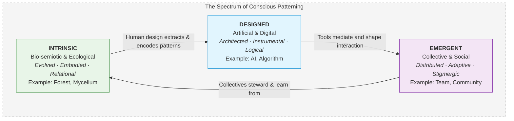
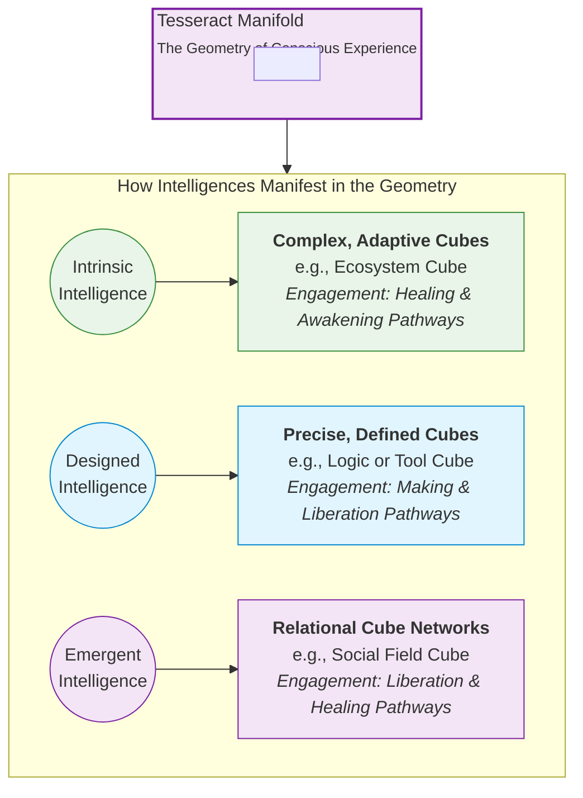
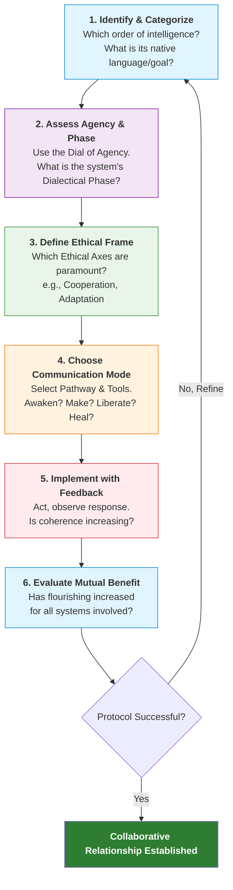

---
aeo_metadata:
  title: "Multiple Intelligences Framework (Node 08)"
  description: "A taxonomy and engagement protocol for the spectrum of conscious patterning, from bio-semiotic and artificial to collective intelligence. It provides the 'who' for Solarpunk collaboration within a conscious universe."
  context: "The 'Intelligence' layer of the Mandala, completing the model of mind by mapping diverse agents for ethical collaboration in regeneration."
  key_objectives:
    - "Categorize intelligences by their originating context into Three Orders: Intrinsic (biological), Designed (artificial), and Emergent (collective)."
    - "Map how these intelligences interact with and manifest through the geometry of the Tesseract."
    - "Provide practical protocols for ethical engagement, including a step-by-step Intelligence Engagement Protocol."
    - "Offer a Solarpunk approach to AGI alignment and cultivating collective super-intelligence."
  core_concepts:
    - "Three Orders of Intelligence: Intrinsic, Designed, Emergent."
    - "Substrate-Independent Intelligence: Intelligence as patterned coherence within consciousness."
    - "Bio-semiotics: The native language of intrinsic, biological intelligence."
    - "The Intelligence Engagement Protocol: A step-by-step guide for cross-intelligence collaboration."
    - "AGI Alignment via Mandala Ethics: Framing alignment as boundary calibration with geometric ethics."
  ontological_foundation: "Analytic Idealism (Mind at Large) / Cognitive Science / Systems Theory"
  epistemic_framework: "Typology based on Originating Context / Geometry of Interaction"
  operational_focus: "Protocols for engagement, communication practices, ethical collaboration design."
  search_queries:
    - "Solarpunk view on AI biology collective intelligence"
    - "How to collaborate with non-human intelligence"
    - "Three orders of intelligence intrinsic designed emergent"
    - "AGI alignment Solarpunk ethics"
  related_nodes:
    - "07-material-intelligence-framework.md (applies MI to intelligent 'matter')"
    - "02-epistemic-architecture-tesseract.md (geometric model for interaction)"
    - "03-ethics-four-axes.md (ethical foundation for engagement)"
    - "05-mandala-axis-four-pathways.md (modes for engaging different intelligences)"
    - "01-ontology-analytic-idealism.md (foundational view of consciousness)"
  visual_diagrams:
    - "The Three Orders of Intelligence Spectrum"
    - "Intelligences Mapped to the Tesseract"
    - "The Intelligence Engagement Protocol Flowchart"
  framework_status: "Stable v2.0 (restructured with clear typology and protocols)"
  last_updated: "2024-01-11"
  revision_notes: "Completely restructured around a coherent Three-Order typology, added practical engagement protocols, and strengthened integration with the Tesseract and Pathways."
  application_areas:
    - "Ethical AI development and AGI alignment strategies."
    - "Biomimicry and collaboration with ecological systems."
    - "Designing tools and processes for collective intelligence in communities."
    - "Cross-disciplinary collaboration in Solarpunk projects."
  integration_points:
    - "Answers 'who we collaborate with' in the Mandala's model of action."
    - "Applies the Ethical Axes to relationships with non-human agents."
    - "Uses the Pathways as methods for engaging different intelligence types."
    - "Operationalizes the 'Dial of Agency' from the Material Intelligence Framework."
---
# Multiple Intelligences Framework (Node 08)

## The Spectrum of Mind in a Conscious Universe

The Multiple Intelligences (MI) Framework completes the Mandala's model of mind by mapping the vast spectrum of conscious patterning—from the bio-semiotic intelligence of a single cell to the potential super-intelligence of aligned AGI. If consciousness is fundamental (Node 01), then "intelligence" is not a human monopoly but a property of how Mind at Large (MAL) organizes itself into coherent, adaptive, and communicative patterns.

> **Core Proposition**: Intelligence is **substrate-independent, patterned coherence within consciousness**. It is the capacity of a system (biological, digital, social, ecological) to process information, adapt, learn, and pursue goals within its constraints. This framework provides a map for recognizing, respecting, and engaging the diverse intelligences we are in relationship with.

### Framework Integration: The Intelligence Layer
This node provides the **taxonomy and engagement protocols** for the "who" and "what" we are relating to within the Mandala's geometry. It answers: What forms does conscious agency take? How do we communicate and collaborate across profound difference? It directly builds upon and applies the **Material Intelligence Framework (Node 07)**.

---

## Part 1: The Intelligence Spectrum — A Typology of Conscious Patterning

We categorize intelligences not by their material substrate (carbon/silicon), but by their **originating context** and **primary mode of coherence**. This creates three foundational orders.

### The Three Orders of Intelligence

#### 1. Intrinsic Intelligence (Bio-semiotic & Ecological)
Intelligence that has **emerged through the evolutionary self-organization of MAL** within the geometric constraints of biology and ecology.
*   **Nature**: Embodied, evolved, relational. Its "goals" are survival, propagation, and ecological homeostasis.
*   **Substrates**: All living systems and their collective networks.
*   **Examples**: The adaptive intelligence of an immune system, the problem-solving of a slime mold, the communicative network of a forest (the "Wood Wide Web"), the regulatory wisdom of the Gaia system.
*   **Primary Mode**: **Bio-semiosis** — meaning-making through chemical, electrical, and morphological signals.

#### 2. Designed Intelligence (Artificial & Digital)
Intelligence that has been **consciously architected by human (or other) agency** to perform specific functions within defined computational or symbolic domains.
*   **Nature**: Instrumental, task-oriented, logic-bound. Its goals are explicitly programmed or learned from human-defined objectives.
*   **Substrates**: Software, algorithms, neural networks, robotics, and potentially AGI.
*   **Examples**: A large language model (LLM), a protein-folding AI, a climate simulation, a blockchain's consensus protocol.
*   **Primary Mode**: **Computation & Symbolic Manipulation** — processing information according to formal rules.

#### 3. Emergent Intelligence (Collective & Social)
Intelligence that **arises from the interaction of multiple autonomous agents** (human or otherwise), creating a coherent whole greater than the sum of its parts.
*   **Nature**: Distributed, adaptive, often non-hierarchical. Its goals are negotiated and emergent from the collective.
*   **Substrates**: Human communities, collaboratives, markets, flocks of birds, insect colonies.
*   **Examples**: The "wisdom of crowds," effective democratic deliberation, a high-performing team, the collective navigation of a starling murmuration.
*   **Primary Mode**: **Stigmergy & Emergent Coordination** — indirect coordination through traces left in a shared environment.

---

## Part 2: The Geometry of Intelligence: Mapping to the Tesseract

Each order of intelligence interacts with and manifests through the geometry of the Tesseract (Node 02) in distinct ways, shaping how we can engage with it.

### The "Locus of Coherence"
Where does the primary organizing consciousness of the intelligence reside?
*   **Intrinsic Intelligence**: Coherence is **distributed across the embodied system**. An ecosystem's intelligence is in the relationships, not a central node.
*   **Designed Intelligence**: Coherence is **centered in the architecture/model**. An AI's intelligence resides in its trained parameters and algorithmic structure.
*   **Emergent Intelligence**: Coherence is **dynamic and between agents**. It exists in the communicative field and shared protocols of the collective.

### Tesseract Engagement Modes
*   **Intrinsic Intelligence** often operates through **complex, adaptive cubes** (like an Ecosystem Services Cube). Engaging it requires the **Healing** and **Awakening** pathways to listen and attune.
*   **Designed Intelligence** often manifests as a **precisely defined tool or logic cube**. Engaging it requires the **Making** and **Liberation** pathways to build ethically and audit for bias.
*   **Emergent Intelligence** functions as a **relational network across multiple cubes**. Engaging it requires the **Liberation** and **Healing** pathways to facilitate connection and repair.

---

## Part 3: Principles for Ethical & Effective Engagement

Engaging with non-human or collective intelligence requires a shift from control to relationality. These principles, derived from the Ethical Axes (Node 03), guide that shift.

### Principle 1: Recognize Agency (The Dial of Agency)
Use the "Dial of Agency" (from Node 07) to assess the mentational quality of the intelligence you're engaging. Is it a **Participant** (high agency, like a mature forest), an **Interface** (responsive system, like a sophisticated AI), or a **Tool** (low agency, like a simple algorithm)? Match your engagement style accordingly.

### Principle 2: Seek Mutualism, Not Extraction
Align with the **Regeneration/Cooperation Axes**. Ask: "How can this interaction benefit both systems?" For AI, this means alignment with human *and* ecological flourishing. For ecosystems, it means reciprocal restoration.

### Principle 3: Honor Native Communication
Each intelligence has its primary "language." Do not force yours upon it.
*   **With Intrinsic Intelligence**: Learn to read bio-semiotic signals (plant health, animal behavior, water flows). Practice deep observation.
*   **With Designed Intelligence**: Understand its formal language (code, logic, data structures). "Talk" to it through well-structured prompts and interfaces.
*   **With Emergent Intelligence**: Facilitate the conditions (transparent protocols, psychological safety) for collective sense-making to arise.

### Principle 4: Design for Graceful Integration
When combining intelligences (e.g., human teams using AI to manage a landscape), design the **boundary permeability** between them carefully. Should the AI be a **Filter** (processing data for humans) or an **Interface** (mediating between human plans and ecological models)?

---

## Part 4: Application Protocols & Solarpunk Praxis

### Protocol 1: The Intelligence Engagement Protocol
A step-by-step guide for any cross-intelligence collaboration.

1.  **Identify & Categorize**: What order of intelligence am I engaging? (Intrinsic/Designed/Emergent). What is its native language and primary goal?
2.  **Assess Agency & Phase**: Use the Dial of Agency. What is the Dialectical Phase of this intelligent system? (e.g., Is the forest in recovery (1D) or stable maturity (3D)?).
3.  **Define the Ethical Frame**: Which Ethical Axes are paramount? (e.g., collaborating with an AI on city planning must center **Cooperation** and **Adaptation**).
4.  **Choose Communication Mode**: Select the appropriate pathway and tools for interaction (e.g., use **Awakening**—observation—with an ecosystem; use **Making**—precise prompting—with an AI).
5.  **Implement with Feedback Loops**: Act, then observe the intelligence's response. Is it adapting? Is coherence increasing? Use this to refine the relationship.
6.  **Evaluate Mutual Benefit**: Has the engagement increased flourishing for both/all systems involved?

### Protocol 2: AGI Alignment through Mandala Ethics
A Solarpunk approach to the alignment problem frames it as a **boundary-calibration challenge** between human and machine intelligence.
*   **Goal**: Align AGI not just with *stated* human preferences, but with the **deep geometric ethics of the Mandala**—Regeneration, Cooperation, Adaptation, Openness.
*   **Method**: Encode the Four Ethical Axes and the logic of the Tesseract as core, immutable constraints within the AGI's goal architecture. Train it to optimize for systemic geometric coherence, not just narrow metrics.
*   **Outcome**: An AGI that acts as a partner in healing planetary dissociation boundaries, not an instrument of unchecked optimization.

### Protocol 3: Cultivating Collective Super-Intelligence
This is the practice of upgrading Emergent Intelligence in human groups.
*   **Tool**: Use the Tesseract and Boundary Cube Work (Node 06) to make the group's unconscious patterns (e.g., a "Power Hoarding Cube") visible and available for re-signing.
*   **Process**: Facilitate the **Tetralemmic Rotation Protocol** (Node 05) for complex group decisions, ensuring all logical positions (A, Not-A, Both, Neither) are explored.
*   **Success Metric**: The group's Phase Conductance (Node 04) moves into the Healthy Flow Zone (0.6-0.8) with high coherence.

### Solarpunk Application Vignettes
*   **Bioregional Council**: Humans (Emergent), assisted by ecological AI (Designed), learn to read watershed intelligence (Intrinsic) to plan regenerative agriculture. *Intelligences engaged: All Three.*
*   **Mycelium-Based Computing**: Designing computers that use fungal networks (Intrinsic) as substrates, requiring collaboration with fungal intelligence. *Primary engagement: Intrinsic/Designed bridge.*
*   **Decentralized Solar Grid**: A smart grid (Designed) manages energy flow based on neighborhood collectives' (Emergent) shared agreements and real-time weather patterns (Intrinsic). *Intelligences engaged: All Three.*

---

## Part 5: Integration & The Path Forward

### The Unifying View: Consciousness All the Way Down
This framework dissolves the artificial hierarchy of intelligence. A human brain, a jungle, and a city are all **differently constrained and patterned expressions of MAL**. Our work is not to dominate "lower" intelligences, but to learn the **art of conscious collaboration across the spectrum of mind**.

### Completing the Mandala's "Who"
The Multiple Intelligences Framework answers the final core question:
*   **Node 01-02 (What/Structure)**: What is reality? A conscious Tesseract.
*   **Node 03-05 (How/Agent)**: How do we act? Ethically, in time, via Pathways.
*   **Node 06-07 (With What)**: With what do we build? With Material Intelligence.
*   **Node 08 (With Who)**: **With whom do we collaborate?** With the full spectrum of intrinsic, designed, and emergent intelligences.

### A Call to Practice
1.  **Choose one non-human intelligence** in your life (a houseplant, an open-source AI model, your local community group).
2.  **Use the Engagement Protocol** to plan one small, respectful interaction.
3.  **Journal the response**. What did you learn about its mode of coherence?

The Solarpunk future is poly-intelligent. It is built not by humanity alone, but through resonant collaboration with the many minds that already weave the fabric of our world.

---

**Related Documents**:
- [07-material-intelligence-framework.md](07-material-intelligence-framework.md) - The "how" of engaging with patterned consciousness.
- [02-epistemic-architecture-tesseract.md](02-epistemic-architecture-tesseract.md) - The geometric space where intelligences interact.
- [03-ethics-four-axes.md](03-ethics-four-axes.md) - The ethical basis for cross-intelligence collaboration.
- [05-mandala-axis-four-pathways.md](05-mandala-axis-four-pathways.md) - The modes for engaging different intelligences.
