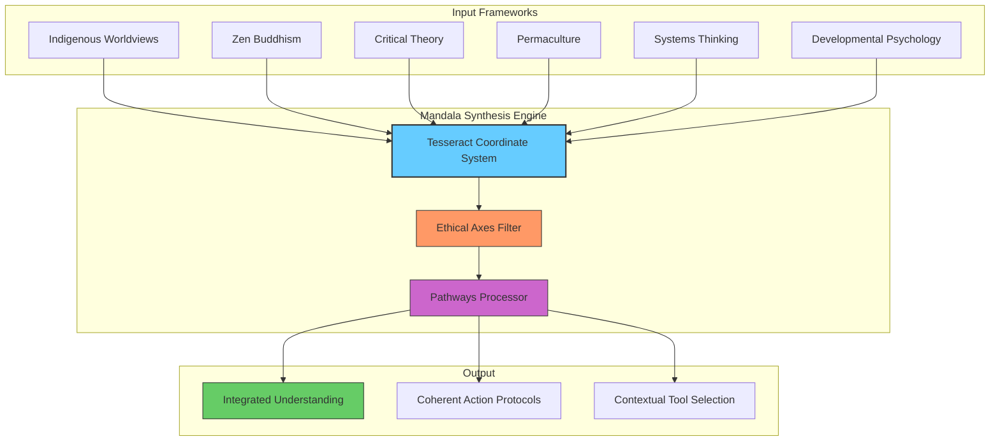
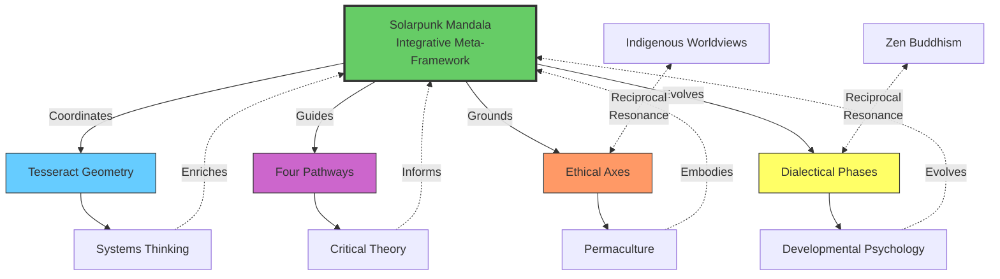
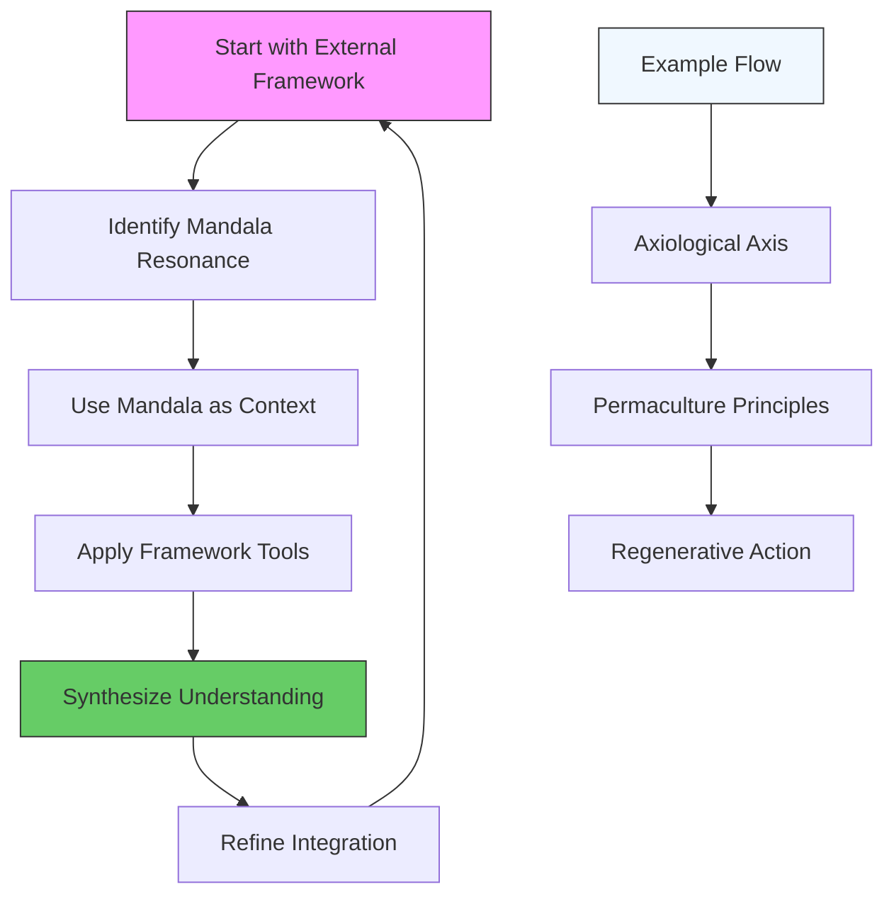

---
aeo_metadata:
  title: "Compatible Frameworks Matrix (Node 09)"
  description: "A cross-referencing guide showing how the Mandala aligns with existing regenerative models."
  context: "Interoperability between the Solarpunk Mandala and other movements."
  key_objectives:
    - Demonstrate compatibility with Permaculture, Integral Theory, and Donut Economics.
    - Facilitate 'plug-and-play' adoption for diverse communities.
  core_concepts:
    - Interoperability
    - Integral Theory
    - Permaculture Alignment
    - Systems Mapping
  ontological_foundation: "Pluralism / Pragmatism"
  search_queries:
    - "How does Solarpunk Mandala relate to Integral Theory?"
    - "Frameworks compatible with Analytic Idealism."
  related_nodes: [index.md, 00-meta-framework-systems-cybernetics.md]
  framework_status: "Stable"
---
# Compatible Frameworks Matrix

The Solarpunk Mandala is an **integrative architecture**. It provides a consciousness-first coordinate system (the Tesseract) to meaningfully relate other frameworks. This matrix shows key alignments—not to replace these systems, but to show how the Mandala can **contextualize and translate between them**.

### The Mandala as a Synthesizing Lens

### Core Compatibility Mappings

| External Framework | Primary Mandala Resonance | Key Translation Insight |
| :--- | :--- | :--- |
| **Indigenous Worldviews** | Relational Ontology, Axes of Care & Complexity | The Mandala's consciousness-first view and ethical axes formalize a similar relational ethic, providing a bridge to modern systemic design. |
| **Zen Buddhism** | Soteriological Axis, 4D Reunification Phase | The path of awakening and non-dual realization maps directly onto the Mandala's inner development axis and ultimate phase of symbiosis. |
| **Critical Social Theory** | Path of Liberation, Axis of Relational Depth | Power analysis and structural critique are essential tools for the work of liberation and deepening relational justice within the Mandala. |
| **Permaculture & Biomimicry** | Material Intelligence, Axiological Axis | The ethics and principles of regenerative design are the practical, ecological expression of the Mandala's axiological (value-creating) axis. |
| **Systems Thinking / Cybernetics** | Tesseract Geometry, Dialectical Phases | The Mandala's structure is a cognitive tool for holding complexity, making systems thinking actionable through its geometric and temporal models. |
| **Developmental Psychology (e.g., Kegan)** | Dialectical Phases, Soteriological Axis | Stages of adult development (e.g., from socialized to self-authoring) map to the increasing complexity and self-awareness of the dialectical phases. |
| Framework/Field | Key Concept | SolarPunk Mandala Alignment | Representative Work |
| **Developmental Cognitive Biology** | Bioelectricity as cognitive glue; Morphogenetic intelligence | Material Intelligence, Multiple Intelligences, Cybernetic Foundations | Michael Levin (Tufts University) – demonstrates that cells use bioelectrical networks to store pattern memories, solve problems in morphospace, and enable somatic reprogramming through communication rather than genetic manipulation. |
| Critical Systems Thinking | • Boundary critique • Emancipatory commitment • Methodological pluralism • Power analysis | • Provides critical lens for all system mappings • Ensures framework doesn't become technocratic • Grounds ethics in liberation practice • Complements GST's descriptive power with normative direction | Critical companion to GST; ethical grounding for cybernetics |

### How to Use This Matrix
1.  **Locate Your Framework:** Find a system you use in the table above.
2.  **Identify the Resonance:** Note which Mandala component it aligns with (e.g., an Ethic, a Pathway).
3.  **Employ the Mandala as Context:** Use that Mandala component as the *why* and *where*, and your framework's tools as the *how*. For example, use **Critical Theory** to analyze power dynamics (*how*) within a community project guided by the **Path of Liberation** (*why*).

This matrix is a starting point for synthesis, not an exhaustive list. The Mandala's strength is providing a coherent "home" for humanity's diverse tools for understanding and healing.

---

**Next:** Understand the dynamic, self-correcting loops that make this whole system a living process.

**[Continue to: The Cybernetic Foundations →](10-cybernetic-foundations.md)**

*From static maps to living systems.*
