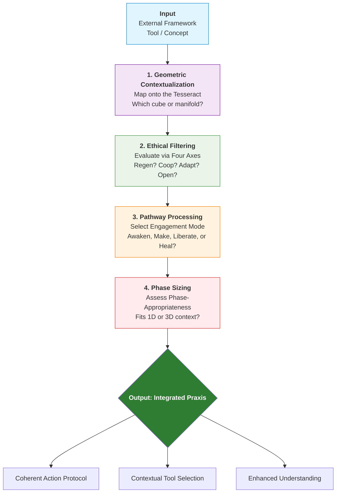
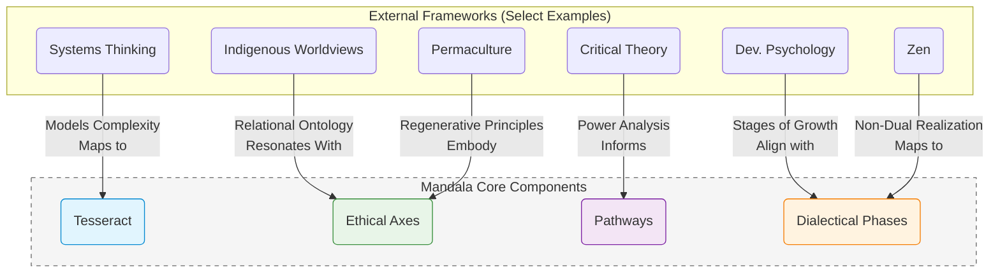
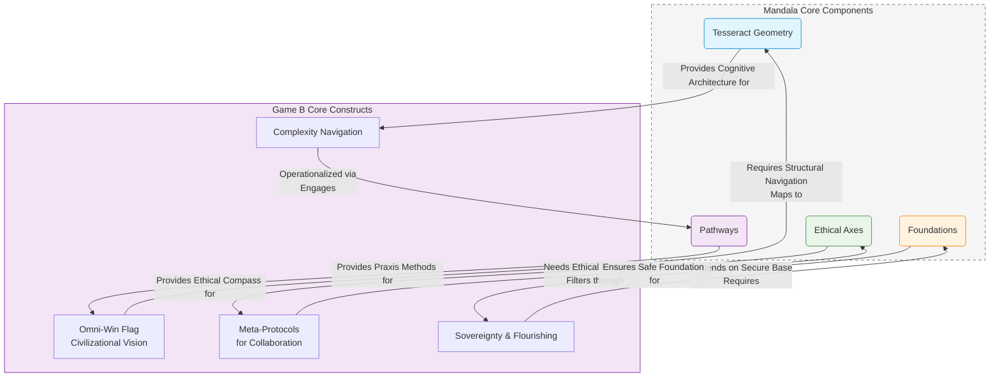
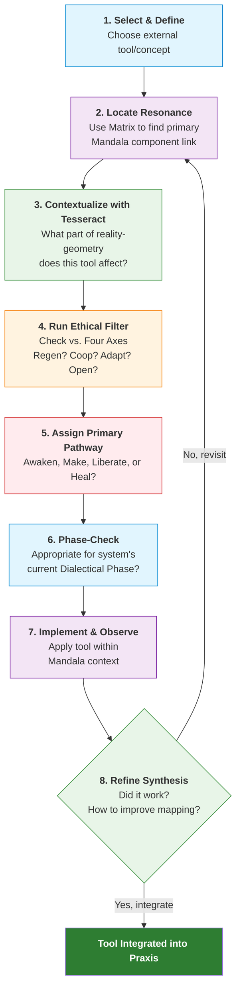

---
aeo_metadata:
  title: "Compatible Frameworks Matrix (Node 09)"
  description: "The integration hub and translation layer of the Mandala. It maps key correspondences with other essential frameworks (Permaculture, Critical Theory, Systems Thinking, etc.), providing protocols for conscious synthesis and coherent praxis."
  context: "The 'interoperability layer' that enables the Mandala to function as a meta-framework, connecting diverse tools and worldviews for holistic Solarpunk action."
  key_objectives:
    - "Map primary resonances between the Mandala's core components and key external regenerative, consciousness, and justice frameworks."
    - "Provide the 'Framework Integration Protocol'—a step-by-step method for consciously synthesizing external tools within the Mandala's context."
    - "Demonstrate how the Mandala resolves tensions between frameworks (e.g., speed vs. depth) by finding higher-order syntheses."
    - "Facilitate 'plug-and-play' understanding for practitioners from diverse backgrounds, lowering the barrier to Mandala adoption."
  core_concepts:
    - "The Mandala as a Meta-Framework: An operating system for understanding how other frameworks connect."
    - "The Synthesis Engine: The multi-stage process (Tesseract → Ethics → Pathways → Phases) of integrating external knowledge."
    - "Resonance Mapping: Identifying the primary point of alignment between an external concept and a Mandala component."
    - "Framework Integration Protocol: The 8-step practice for conscious integration."
    - "From Conflict to Synergy: Using the Tetralemma and Pathways to resolve framework tensions."
  ontological_foundation: "Pluralism / Pragmatism / Analytic Idealism (via Node 01)"
  epistemic_framework: "Integrative Synthesis / Comparative Framework Analysis"
  operational_focus: "Practical integration protocols, translation guides, workshop design for interdisciplinary teams."
  search_queries:
    - "How to combine Permaculture with Systems Thinking Solarpunk"
    - "Integral Theory vs Solarpunk Mandala comparison"
    - "Framework integration protocol guide"
    - "Donut Economics Analytic Idealism connection"
    - "Game B"
  related_nodes:
    - "00-meta-framework-systems-cybernetics.md (the meta-systemic foundation)"
    - "index.md (the overall framework home)"
    - "02-epistemic-architecture-tesseract.md (the geometric mapping tool)"
    - "03-ethics-four-axes.md (the ethical filter for integration)"
    - "05-mandala-axis-four-pathways.md (the engagement modes for applied synthesis)"
  visual_diagrams:
    - "The Mandala Synthesis Engine Process"
    - "Framework Resonance Mapping"
    - "The Framework Integration Protocol Flowchart"
  framework_status: "Stable v2.0 (restructured with clear protocols and expanded mappings)"
  last_updated: "2024-01-12"
  revision_notes: "Transformed from a simple reference table into a full integration manual with protocols, conflict resolution, and a clear theory of synthesis."
  application_areas:
    - "Designing interdisciplinary courses or workshops."
    - "Planning complex projects that require multiple philosophical/technical lenses."
    - "Resolving strategic or methodological conflicts within teams or movements."
    - "Personal study to contextualize new learning within a coherent worldview."
  integration_points:
    - "Directly applies all preceding core nodes (01-08) as tools for integration."
    - "Serves as a crucial entry point for newcomers familiar with other frameworks."
    - "Embodies the pluralistic, non-dogmatic ethos of the Solarpunk Mandala."
---
# Compatible Frameworks Matrix (Node 09)

## The Mandala as a Synthesizing Integrator

This matrix serves as the **Rosetta Stone and integration hub** for the Solarpunk Mandala. It maps key correspondences between the Mandala's core architecture and other essential frameworks for regeneration, consciousness, and justice. The goal is not to replace these rich traditions but to demonstrate how the Mandala provides a **consciousness-first coordinate system** (the Tesseract) to contextualize, relate, and translate between them, enabling more coherent and powerful praxis.

> **Core Proposition**: The Mandala is a **meta-framework**—an operating system for understanding how other frameworks connect. It answers the question: "If all these tools are valid, how do I know which to use, when, and how do they fit together?"

---

## Part 1: The Mandala Synthesis Engine: How Integration Works

The Mandala integrates external frameworks through its core components, acting as a multi-stage filter and processor for knowledge and practice.

```mermaid
flowchart TD
    Input["<b>Input</b><br>External Framework<br>Tool / Concept"]
    
    Input --> Stage1["<b>1. Geometric Contextualization</b><br>Map onto the Tesseract<br>Which cube or manifold?"]
    Stage1 --> Stage2["<b>2. Ethical Filtering</b><br>Evaluate via Four Axes<br>Regen? Coop? Adapt? Open?"]
    Stage2 --> Stage3["<b>3. Pathway Processing</b><br>Select Engagement Mode<br>Awaken, Make, Liberate, or Heal?"]
    Stage3 --> Stage4["<b>4. Phase Sizing</b><br>Assess Phase-Appropriateness<br>Fits 1D or 3D context?"]
    
    Stage4 --> Output{"<b>Output: Integrated Praxis</b>"}
    Output --> O1["Coherent Action Protocol"]
    Output --> O2["Contextual Tool Selection"]
    Output --> O3["Enhanced Understanding"]

    style Input fill:#e1f5fe,stroke:#0288d1
    style Stage1 fill:#f3e5f5,stroke:#7b1fa2
    style Stage2 fill:#e8f5e8,stroke:#388e3c
    style Stage3 fill:#fff3e0,stroke:#f57c00
    style Stage4 fill:#ffebee,stroke:#d32f2f
    style Output fill:#2e7d32,color:#fff
```

### The Integration Pathway:
1.  **Input**: A concept or tool from an external framework (e.g., a Permaculture principle, a Critical Theory analysis).
2.  **Geometric Contextualization (Tesseract)**: The idea is mapped onto the Tesseract. *Where in the structure of reality does this apply? Is it about a specific Boundary Cube, a relationship between cubes, or the whole manifold?*
3.  **Ethical Filtering (Four Axes)**: The idea is evaluated through the ethical lenses of Regeneration/Extraction, Cooperation/Competition, Adaptation/Domination, Openness/Closure. *Does it align with Solarpunk ethics? How does it help us move along these spectra?*
4.  **Pathway Processing (Four Pathways)**: The appropriate mode of engagement is selected. *Is applying this tool an act of Awakening, Making, Liberating, or Healing?*
5.  **Temporal & Developmental Sizing (Dialectical Phases)**: The idea is assessed for phase-appropriateness. *Is this a tool for a 1D emergent context or a 3D transformative one?*
6.  **Output**: The result is an **Integrated Understanding**, a **Coherent Action Protocol**, or a **Contextual Tool Selection** that is both faithful to the original framework and amplified by the Mandala's holistic context.

---

## Part 2: Core Compatibility & Translation Matrix

This table provides the primary points of resonance between the Mandala and other key frameworks. Use it to find entry points for integration.

| External Framework | Primary Mandala Resonance | Key Translation Insight | Practical Integration Example |
| :--- | :--- | :--- | :--- |
| **Analytic Idealism (Kastrup)** | **Foundational Ontology (Node 01)** | The Mandala's entire structure is built on the premise that consciousness is fundamental. Matter is localized consciousness (MI). | Use Analytic Idealism to ground the *why* of the Tesseract. Use the Mandala's models to operationalize idealism into practical protocols for transformation. |
| **Indigenous & Relational Worldviews** | **Relational Ontology, Axes of Care & Complexity** | The Mandala's consciousness-first view and ethical axes formalize a similar relational, reciprocal ethic, providing a bridge to systemic design while honoring ancestral wisdom. | Approach the **Four Pathways** as modern ceremonies: *Awakening* as listening to place, *Making* as reciprocal crafting, *Liberation* as restoring right relationship, *Healing* as integrating ancestral trauma. |
| **Zen & Contemplative Traditions** | **Soteriological Axis, 4D Reunification Phase, Awakening Pathway** | The path of non-dual realization and present-moment awareness maps directly to the inner development axis and the ultimate goal of participatory, non-dual consciousness. | Use meditation as a core practice for **Awakening Pathway** work and for "unfolding" personal **Boundary Cubes**. The state of *samadhi* or flow is an experience of high **Phase Conductance** in the **Integral Phase**. |
| **Critical Social Theory** | **Liberation Pathway, Relational Depth & Power Axes** | Power analysis, critique of hegemony, and emancipatory goals are essential tools for the work of liberation and deepening relational justice within the Mandala. | Use critical theory to analyze the **power signatures** on the faces of a community's "Governance Boundary Cube" before attempting to re-sign it. It ensures liberation work targets real structures, not just symptoms. |
| **Permaculture & Biomimicry** | **Material Intelligence Framework, Axiological & Adaptation Axes** | The ethics (Earth Care, People Care, Fair Share) and principles of regenerative design are the practical, ecological expression of the Mandala's value-creating and adaptive axes. | Design a garden using permaculture principles (the *how*), explicitly framed as an act of **Making** that moves the system along the **Regeneration and Adaptation Axes**, creating a **Literal & Intentional** intelligent artifact. |
| **Systems Thinking & Cybernetics** | **Tesseract Geometry, Dialectical Phases, Feedback Loops** | The Mandala's structure is a cognitive tool for holding complexity. It makes abstract systems thinking actionable through geometric visualization and phase-aware intervention. | Model a community economy as a cluster of interacting **Boundary Cubes** (Resource, Exchange, Governance). Use systems archetypes to predict cube behaviors, and phase analysis to time interventions. |
| **Developmental Psychology (e.g., Kegan, Cook-Greuter)** | **Dialectical Phases, Soteriological Axis** | Stages of adult development (e.g., from socialized to self-authoring to self-transforming) map directly to the increasing cognitive complexity, perspective-taking, and self-awareness of the dialectical phases (-1D to 4D). | Assess a team's average **Dialectical Phase** to understand their capacity for complexity. Tailor communication and project scaffolding (1D clear rules vs. 3D emergent co-creation) to match their developmental center of gravity. |
| **Donut Economics (Raworth)** | **Ethical Axes (especially Regeneration/Extraction), Tesseract as Nested Systems** | The Donut's social foundation and ecological ceiling are brilliant visualizations of the **boundary conditions** for a thriving human system within a living planet—a core Mandala concern. | Use the Donut as a **diagnostic tool** to assess a project's impacts. Use the Mandala's **Pathways** and **MI Framework** to design the specific interventions that move the system *into* the safe and just space of the Donut. |
| **Complexity Theory** | **Emergent Intelligence, Cube Clusters, Phase Transitions** | Concepts like emergence, attractors, and phase transitions describe the *behavior* of intelligent systems that the Mandala models geometrically and engages with ethically. | View a **Tesseract Rotation** or a community **Phase Transition** as a deliberate induction of a complexity phase shift. Design for "adjacent possibles" and manage **Conductance** to avoid chaotic collapse. |
| **Narrative Therapy** | Primarily UL Cube (self-narrative), LL Cube (family stories). | Techniques for externalizing and re-authoring problem-saturated stories. | Provides the core clinical methodology for **Narrative Field Audit Phase 4 (Tetralemmic Intervention)** at the individual/family scale. |
| **Sense-Making / Cynefin** | Maps to the full Tesseract: UL (sense), LL (social), LR (system), UR (data). | Used to diagnose context (complex, chaotic) and guide narrative strategy. | Informs **Phase 2 (Tesseract Mapping)** by providing heuristics for classifying narrative types within complex systems. |
| **Memetics** | LR Cube (propagation through systems), LL Cube (cultural retention). | Analyzes narrative units ("memes") for fitness, virulence, and replication. | Offers a structural analysis of "narrative code" for understanding **Meta-Narrative** propagation and designing resilient counter-narratives. |
| **Game B** | **Tesseract (Meta-Perspective Cube 8) & All Four Pathways** | Game B's vision for a post-rivalrous civilization and its meta-protocol approach for navigating complexity resonate deeply with the Mandala's consciousness-first, geometric navigation of civilizational-scale transformation. | Use the Tesseract to model the multi-perspectival nature of civilizational transition (mapping Game B's "hills" to cubes), and apply the Four Pathways to structure Game B community experiments (e.g., *Awakening* to Game A conditioning, *Making* new protocols, *Liberating* from oppressive structures, *Healing* civilizational trauma). |

```mermaid
graph TD
    subgraph Mandala["Mandala Core Components"]
        T(Tesseract)
        E(Ethical Axes)
        P(Pathways)
        D(Dialectical Phases)
    end

    subgraph Frameworks["External Frameworks (Select Examples)"]
        IW(Indigenous Worldviews)
        CST(Critical Theory)
        PERM(Permaculture)
        SYS(Systems Thinking)
        DEV(Dev. Psychology)
        ZEN(Zen)
    end

    IW -- "Relational Ontology<br>Resonates With" --> E
    CST -- "Power Analysis<br>Informs" --> P
    PERM -- "Regenerative Principles<br>Embody" --> E
    SYS -- "Models Complexity<br>Maps to" --> T
    DEV -- "Stages of Growth<br>Align with" --> D
    ZEN -- "Non-Dual Realization<br>Maps to" --> D

    style Mandala fill:#f5f5f5,stroke:#666,stroke-dasharray: 5 5
    style T fill:#e1f5fe,stroke:#0288d1
    style E fill:#e8f5e8,stroke:#388e3c
    style P fill:#f3e5f5,stroke:#7b1fa2
    style D fill:#fff3e0,stroke:#f57c00
```

### Part 2.1: Game B Integration - Civilizational-Scale Application

**Framework Status:** ⚡ **Active Mapping & Proto-Practical Integration**  
**Synergy Level:** **High** - Game B provides the civilizational-scale container; Mandala provides the ontological foundation, ethical navigation, and structural geometry for its actualization.

#### Tesseract Mapping: Game B Tenets to Geometric Architecture

| Game B Concept | Primary Tesseract Cube | Mandala Intelligence | Explanation of Mapping |
|----------------|------------------------|----------------------|------------------------|
| **"Omni-win-win civilization"** | LR (3rd-person exterior, collective) | **POLITICS/ECONOMICS Intelligence** | The LR cube handles collective exterior systems—the precise domain where Game B seeks to transform civilizational structures toward non-rivalrous outcomes. |
| **"Maximizing human flourishing"** | UL (1st-person interior) & LL (2nd-person interior) | **SPIRITUALITY & CULTURE Intelligences** | Flourishing requires both individual subjective well-being (UL) and shared cultural meaning-making (LL)—the intersection of personal and collective interiority. |
| **"Meta-protocol for hyper-collaboration"** | Cube 6 (Intersubjective Gateway) | **Spirituality: Community + Politics: Dialogue** | Cube 6 is specifically designed as the medium where "mine becomes ours"—the exact cognitive/social space where hyper-collaboration protocols must operate. |
| **"Navigating complexity without complicated systems"** | Cube 8 (Meta-Perspective) | **SolarPunk Compass** | This requires the non-perspectival center that can hold multiple irreducible viewpoints simultaneously—the core function of the Meta-Perspective cube. |
| **"Individual and collective sovereignty"** | ॐ Core (Embodied Foundations) | **Embodied Foundations** | Sovereignty cannot exist without secure foundations of Nourishment, Cleansing, Restoration, and Movement—the pre-requisite boundary conditions for agency. |
| **"Anti-fragile, scalable civilization"** | Cube 7 (Systemic Emergence Plane) | **Project Design Integration** | Scalability and anti-fragility emerge at the transition point between individual and collective scales, managed by Cube 7's scale-transition mechanics. |
| **"Freeing oneself from ideology"** | Cube 5 (Dissociation Boundary) | **Ecology + Spirituality: Practice** | This boundary work occurs at the interface where Mind at Large partitions—requiring practices that recognize both ecological embeddedness and spiritual discernment. |
| **"Building capacity to navigate complexity"** | UR (3rd-person exterior, individual) | **MAN & SHELLS Intelligences** | Individual capacity-building requires attention to both biological needs (MAN) and physical infrastructure/tools (SHELLS) as foundational supports. |

#### Ethical Axes Alignment: Game B Through Mandala Navigation

| Game B Challenge/Goal | Primary Ethical Axis | Mandala Navigation Principle | Practical Integration |
|------------------------|----------------------|-----------------------------|----------------------|
| **"How to transition from rivalrous to non-rivalrous dynamics?"** | Axiological Axis (Regeneration) | **Care that expands future possibilities** | Game B's economic/political innovations must be measured against whether they genuinely expand future possibilities for all beings, not just optimize current human systems. |
| **"Cultivating individual sovereignty in collective context"** | Soteriological Axis (Integration) | **Coherence with authentic intention** | Game B's emphasis on sovereignty maps directly to the Soteriological Axis's work on integrating fragmented selves into coherent, non-contradictory wholes. |
| **"Creating omni-considerate decision-making"** | Relational Depth Axis (Connection) | **Complexity that honors connection** | "Omni-consideration" requires the capacity to hold radically complex relational webs without simplification—precisely the skill developed through this axis. |
| **"Addressing intergenerational challenges and long-term thinking"** | Temporal Orientation Axis (Time) | **Courage to repair past and seed future** | Game B's civilizational timeframe requires exceptional temporal literacy—the courage to address historical trauma while planting seeds for centuries ahead. |
| **"Avoiding multipolar traps and tragedy of the commons"** | All Four Axes (Integrated) | **Tetralemmic navigation** | These systemic failures require simultaneous attention to: integration of selves (Soteriological), regenerative patterns (Axiological), deep relationality (Relational), and long-term responsibility (Temporal). |

```mermaid
graph TD
    subgraph Mandala["Mandala Core Components"]
        T(Tesseract Geometry)
        E(Ethical Axes)
        P(Pathways)
        FF(Foundations)
    end

    subgraph GameB["Game B Core Constructs"]
        GB_Flag["Omni-Win Flag<br>Civilizational Vision"]
        GB_Protocol["Meta-Protocols<br>for Collaboration"]
        GB_Sov["Sovereignty & Flourishing"]
        GB_Complexity["Complexity Navigation"]
    end

    GB_Flag -- "Requires Structural Navigation<br>Maps to" --> T
    GB_Protocol -- "Needs Ethical Framework<br>Filters through" --> E
    GB_Sov -- "Depends on Secure Base<br>Requires" --> FF
    GB_Complexity -- "Operationalized via<br>Engages" --> P

    T -- "Provides Cognitive Architecture for" --> GB_Complexity
    E -- "Provides Ethical Compass for" --> GB_Protocol
    FF -- "Ensures Safe Foundation for" --> GB_Sov
    P -- "Provides Praxis Methods for" --> GB_Flag

    style Mandala fill:#f5f5f5,stroke:#666,stroke-dasharray: 5 5
    style T fill:#e1f5fe,stroke:#0288d1
    style E fill:#e8f5e8,stroke:#388e3c
    style P fill:#f3e5f5,stroke:#7b1fa2
    style FF fill:#fff3e0,stroke:#f57c00
    style GameB fill:#f3e5f5,stroke:#7b1fa2,color:#333
```

#### Protocol Integration Matrix for Game B Praxis

| Game B Practice/Need | Mandala Protocol/Tool | Integration Method |
|----------------------|----------------------|-------------------|
| **Game B community formation & governance** | `guides/facilitator-toolkit/` + `guides/protocols/00-embodied-foundations-audit.md` | Before establishing Game B governance protocols, communities must first assess and secure their Four Embodied Foundations (Threshold Principle). |
| **"Feeling way forward" experimentation** | Pathway: **Awakening (*Conscientização*)** | The critical consciousness work of deconstructing Game A conditioning is prerequisite for effective Game B experimentation. |
| **Building alternative economic systems** | Pathway: **Making (*Capacitação*)** + `tools/protocols/02-project-design-worksheet.md` | Regenerative economic prototyping follows the Making pathway's capacity-building framework, using the project design worksheet for iteration. |
| **Addressing power dynamics & liberation** | Pathway: **Liberation (*Liberação*)** | Dismantling oppressive structures within Game B communities themselves requires the explicit Liberation pathway methodologies. |
| **Healing intergenerational trauma** | Pathway: **Healing (*Cura*)** + `knowledge_base/circles/` | Game B's long-term orientation necessitates healing historical and intergenerational wounds that replicate in systems. |
| **Sensing and responding to complexity** | **Rhizomatic Network** + **Dialectical Phases** | The Mandala's feedback infrastructure and 4D temporal unfolding provide the real-time responsive capacity Game B needs for complex navigation. |

#### Unique Contributions & Reciprocal Benefits

**What Mandala Offers Game B:**
- **Explicit Falsifiability & Safety Protocols**: The **Threshold Principle** and **Boundary Medicine** as concrete, operational safety protocols to prevent ethical bypassing during civilizational experimentation.
- **Consciousness-First Foundation**: **Analytic Idealism** as a rigorous, scientifically-engaged ontology that explains *why* consciousness and values are fundamental.
- **Geometric Navigation Tool**: The **Tesseract** as a practical "cognitive prosthetic" for dimensional literacy—turning abstract complexity into navigable geometry.
- **Scale-Free Validation**: **Material Intelligence** and scale-free cognition principles that expand collaboration to include biological and ecological intelligence.

**What Game B Offers the Mandala:**
- **Civilizational-Scale Testing Ground**: Real-world, cross-cultural communities actively experimenting with post-Game A systems.
- **Meta-Protocol Community**: A community already thinking in the modular, recursive patterns that the Mandala's rhizomatic network requires.
- **Existing Network & Discourse**: Connection to an active global network of practitioners aligned with regenerative transformation.

#### Integration Warnings & Boundary Conditions
1. **Threshold Principle is Non-Negotiable**: Game B communities must score ≥2/5 on all Four Embodied Foundations before engaging in civilizational-scale prototyping.
2. **Game B as Application, Not Replacement**: The Mandala is the meta-framework; Game B is one (powerful) civilizational-scale application.
3. **Avoid Conceptual Blurring**: Maintain clarity: Mandala focuses on **consciousness-geometry-ethics** foundations; Game B on **civilizational-scale social systems**.

---

## Part 3: Practical Integration Protocols

### Protocol 1: The Framework Integration Protocol
Use this step-by-step process to consciously integrate an external tool or concept into your Mandala-informed work.

1.  **Select & Define**: Choose a specific tool, principle, or concept from an external framework. Define it clearly.
2.  **Locate Resonance**: Use the Matrix above. Which primary Mandala component does this resonate with? (e.g., Permaculture's "Observe & Interact" resonates with the **Awakening Pathway**).
3.  **Contextualize with the Tesseract**: Ask: *"What part of the reality-geometry is this tool designed to affect? A personal cube? A social cube? A material flow?"* Sketch the connection.
4.  **Run the Ethical Filter**: Check alignment with the **Four Axes**. Does this tool promote regeneration, cooperation, adaptation, and openness? If not, can it be adapted or is it a mismatch?
5.  **Assign a Primary Pathway**: Decide which **Pathway** is the best vehicle for applying this tool. Is this mostly for *Awakening* (diagnosis), *Making* (building), *Liberating* (re-structuring), or *Healing* (integrating)?
6.  **Phase-Check Appropriateness**: Consider the **Dialectical Phase** of your context. Is this tool too complex for a 0D/1D situation, or too simplistic for a 3D+ challenge?
7.  **Implement & Observe**: Apply the tool within this multi-layered Mandala context.
8.  **Refine the Synthesis**: Note what worked. How did the Mandala context change the application? Refine your understanding of the resonance.

### Protocol 2: From Conflict to Synergy - Resolving Framework Tensions
When two valid frameworks seem to suggest conflicting actions (e.g., rapid technological *Making* vs. deep ecological *Awakening*), use the Mandala to find the higher synthesis.
1.  **Acknowledge the Polarity**: Name the tension (e.g., "Speed vs. Depth").
2.  **Map to the Tetralemma**: This is often a **Both/And** (2D) challenge trapped in an **Either/Or** (0D) argument.
    *   **A**: The value of Framework 1 (e.g., rapid deployment).
    *   **Not-A**: The value of Framework 2 (e.g., thorough consultation).
3.  **Apply the Pathway Rotation**:
    *   **Awaken**: What's the higher goal both frameworks ultimately serve? (e.g., community resilience).
    *   **Make**: Propose a hybrid solution that includes a piece of both (e.g., a phased pilot project with a built-in feedback loop).
    *   **Liberate**: Who is excluded by this hybrid? Adjust.
    *   **Heal**: Implement with clear communication about the tension and a commitment to review.
4.  **Elevate the Phase**: The solution should aim to move the group's engagement from a polarized 0D/1D dynamic to a more integrative 2D+ space.

```mermaid
flowchart TD
    Start["<b>1. Select & Define</b><br>Choose external tool/concept"]
    Start --> Step2["<b>2. Locate Resonance</b><br>Use Matrix to find primary<br>Mandala component link"]
    Step2 --> Step3["<b>3. Contextualize with Tesseract</b><br>What part of reality-geometry<br>does this tool affect?"]
    Step3 --> Step4["<b>4. Run Ethical Filter</b><br>Check vs. Four Axes<br>Regen? Coop? Adapt? Open?"]
    Step4 --> Step5["<b>5. Assign Primary Pathway</b><br>Awaken, Make, Liberate, or Heal?"]
    Step5 --> Step6["<b>6. Phase-Check</b><br>Appropriate for system's<br>current Dialectical Phase?"]
    Step6 --> Step7["<b>7. Implement & Observe</b><br>Apply tool within<br>Mandala context"]
    Step7 --> Step8{"<b>8. Refine Synthesis</b><br>Did it work?<br>How to improve mapping?"}
    Step8 -->|Yes, integrate| End["<b>Tool Integrated into Praxis</b>"]
    Step8 -->|No, revisit| Step2

    style Start fill:#e1f5fe,stroke:#0288d1
    style Step2 fill:#f3e5f5,stroke:#7b1fa2
    style Step3 fill:#e8f5e8,stroke:#388e3c
    style Step4 fill:#fff3e0,stroke:#f57c00
    style Step5 fill:#ffebee,stroke:#d32f2f
    style Step6 fill:#e1f5fe,stroke:#0288d1
    style Step7 fill:#f3e5f5,stroke:#7b1fa2
    style Step8 fill:#e8f5e8,stroke:#388e3c
    style End fill:#2e7d32,color:#fff
```

---

## Part 4: Conclusion & The Integrative Imperative

The complexity of our planetary moment demands not just more tools, but **wise meta-frameworks for using our tools together.** The Compatible Frameworks Matrix positions the Solarpunk Mandala as such a meta-framework.

### The Value of Integration
*   **Prevents Siloing**: An activist versed only in Critical Theory and a designer versed only in Permaculture may talk past each other. The Mandala gives them a shared map.
*   **Guards Against Weaponization**: A powerful tool like systems thinking, without the ethical compass of the **Four Axes** or the justice focus of **Liberation**, can be used to optimize oppressive systems. The Mandala embeds ethics into the geometry.
*   **Enables Conscious Tool Choice**: Instead of using your favorite hammer for every problem, you can diagnose the **phase** and **geometric context** of a problem and select the most appropriate tool from a larger kit.

### A Living Document
This matrix is a starting point, not a definitive canon. The most important integration is the one **you** discover through practice.

**Your Integration Challenge**:
1.  Pick **one framework** you know well but isn't listed here (e.g., Nonviolent Communication, Theory U, Agile).
2.  Use the **Framework Integration Protocol** to map its primary resonance with the Mandala.
3.  Propose a new row for the Matrix and share it with the community.

The Solarpunk future will be built by **polyglots of praxis**—those who can weave diverse strands of wisdom into coherent, conscious, and transformative action. This matrix is your guide to becoming one.

---

**Related Documents**:
- [00-meta-framework-systems-cybernetics.md](00-meta-framework-systems-cybernetics.md) - The meta-systemic thinking underlying this integration.
- [01-ontology-analytic-idealism.md](01-ontology-analytic-idealism.md) - The foundational philosophy that the Mandala shares with compatible worldviews.
- [02-epistemic-architecture-tesseract.md](02-epistemic-architecture-tesseract.md) - The geometric coordinate system used for mapping.
- [03-ethics-four-axes.md](03-ethics-four-axes.md) - The ethical filter for all integrations.
- [05-mandala-axis-four-pathways.md](05-mandala-axis-four-pathways.md) - The modes of engagement for applied integration.
