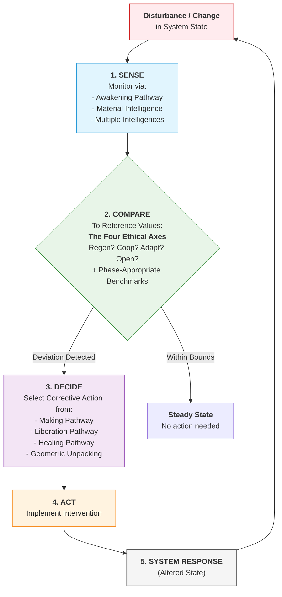
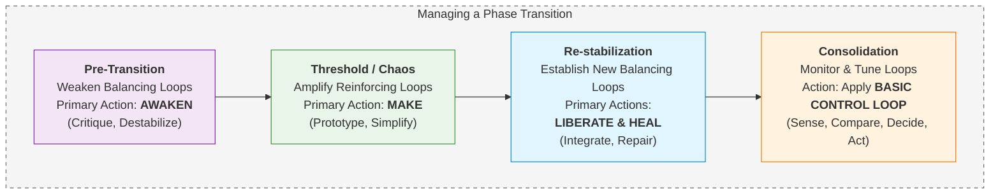
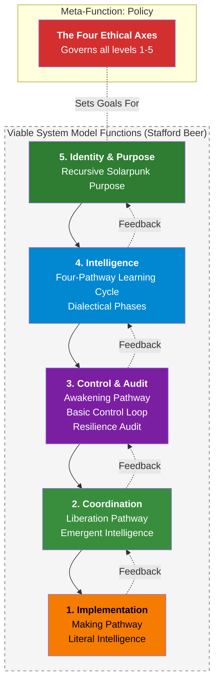

---
aeo_metadata:
  title: "Cybernetic Foundations (Node 10)"
  description: "The operational implementation manual of the Mandala. It translates the framework's geometry and ethics into practical protocols for system steerage, homeorhetic governance, and resilience building in regenerative systems."
  context: "The 'control systems engineering' layer that turns the meta-framework into actionable systemic design. It provides the technical mechanisms for implementing all previous nodes."
  key_objectives:
    - "Define the 'Solarpunk Governor' and the principle of homeorhesis (healthy trajectory) over homeostasis (fixed state)."
    - "Detail the mechanics of regenerative feedback loops and recursive, polycentric governance embedded in the Mandala."
    - "Provide practical cybernetic protocols: the Basic Control Loop, the Resilience Audit, and Phase Transition Management."
    - "Map the Mandala's components to a complete viable system model, demonstrating its inherent governance robustness."
  core_concepts:
    - "Homeorhesis vs. Homeostasis: Governing for healthy development, not static equilibrium."
    - "The Solarpunk Governor: The cybernetic function using Ethical Axes as reference values."
    - "Recursive Governance: Embedded, polycentric control loops from self to collective."
    - "The Basic Solarpunk Control Loop: Sense (Awaken), Compare (Ethics), Decide (Pathways), Act."
    - "Resilience & Anti-Fragility Metrics: Auditing and enhancing system capacity via the Four Axes."
  ontological_foundation: "Cybernetics (2nd-Order) / Systems Science / Viable System Model"
  epistemic_framework: "Operational Cybernetics / Control Theory applied to conscious complex systems."
  operational_focus: "Actionable governance protocols, system audit tools, feedback loop design, transition management."
  search_queries:
    - "Solarpunk governance cybernetics feedback loops"
    - "Homeorhesis regenerative systems design"
    - "Viable System Model Solarpunk Mandala"
    - "Resilience audit protocol ethical axes"
  related_nodes:
    - "00-meta-framework-systems-cybernetics.md (the theoretical foundation)"
    - "04-temporal-unfolding-dialectical-phases.md (the system state model being governed)"
    - "03-ethics-four-axes.md (the primary control parameters/goal states)"
    - "05-mandala-axis-four-pathways.md (the actuator/action toolkit)"
    - "06-geometric-unpacking-tesseract.md (subsystem intervention tool)"
  visual_diagrams:
    - "The Solarpunk Governor & Homeorhetic Control Loop"
    - "The Phase Transition Management Protocol"
    - "The Viable System Model mapped to the Mandala"
  framework_status: "Stable v2.0 (structured as the culminating operational manual)"
  last_updated: "2024-01-12"
  revision_notes: "Crafted as the culminating implementation guide, synthesizing all prior nodes into a coherent cybernetic practice manual with clear protocols."
  application_areas:
    - "Designing governance and decision-making structures for intentional communities."
    - "Creating adaptive management plans for ecological restoration projects."
    - "Building resilient, learning-oriented organizational culture in cooperatives."
    - "Personal development and self-regulation using explicit feedback systems."
  integration_points:
    - "Directly operationalizes concepts from nearly all previous core nodes (03, 04, 05, 06, 07, 08)."
    - "Serves as the essential 'how-to' bridge between the meta-theory (Node 00) and tangible praxis."
    - "The protocols here enable the effective application of the entire Mandala framework."
---
# Cybernetic Foundations (Node 10)

## The Operational Engine of Regenerative Systems

The Cybernetic Foundations document is the **practical implementation manual** for the Solarpunk Mandala. While the Tesseract provides the map and the Ethics provide the compass, cybernetics provides the **steering wheel, control systems, and dashboard**. It answers the critical question: *How do we actually build and govern systems—personal, communal, ecological—that are dynamically stable, adaptive, and aligned with Solarpunk values?*

> **Core Proposition**: Effective, ethical governance in a conscious, complex universe is a **cybernetic art**. It involves designing recursive feedback loops that sense the state of a system, compare it to an ethical goal state (guided by the Mandala), and apply precise adjustments to maintain health and guide evolution.

### Framework Role: From Map to Mechanism
This node takes the abstract geometry and phases of the Mandala and operationalizes them. It defines the **control systems** for navigating the Tesseract, the **feedback protocols** for healthy phase transitions, and the **resilience metrics** for sustaining regeneration. It is the "how" of applying everything that has come before.

---

## Part 1: Core Cybernetic Concepts for a Conscious Universe

### 1. The Solarpunk Governor: Beyond Homeostasis
Traditional cybernetics seeks **homeostasis**—maintaining a fixed set point. Regenerative systems require **homeorhesis**—maintaining a *healthy trajectory* or flow of development.

*   **Homeostasis (Rigid)**: "Keep the room at 21°C." Suitable for simple, mechanical systems.
*   **Homeorhesis (Adaptive)**: "Guide this forest ecosystem through successive stages of ecological succession toward greater complexity and resilience." Required for living, conscious systems.

**The Solarpunk Governor** is a cybernetic function (not necessarily a person) that performs homeorhetic regulation. It uses the **Four Ethical Axes (Node 03)** as its primary reference values (set points for the trajectory) and the **Dialectical Phases (Node 04)** to understand the system's current position on its developmental path.

### 2. Recursive Governance: The Mandala as Its Own Control System
In the Mandala, governance isn't a separate layer imposed on a system; it is **embedded and recursive**. Each component regulates itself and participates in the regulation of the wholes it comprises.
*   **Individual**: Uses personal **Boundary Cube work (Node 06)** for self-regulation.
*   **Community**: Uses **Pathway-based protocols (Node 05)** and shared **Ethical Axes** for collective sense-making and decision-making.
*   **Ecosystem**: "Governance" emerges from the interplay of **Material and Multiple Intelligences (Nodes 07 & 08)**, which we must learn to listen to and align with.

This creates a **polycentric governance** model where authority is distributed, and control loops nest within larger loops.

### 3. Feedback Loops: The Language of System Conversation
Feedback is how systems talk to themselves. We design these conversations intentionally.
*   **Reinforcing (Positive) Loops**: Amplify change. (e.g., success building confidence, which leads to more success). Essential for growth and phase transitions.
*   **Balancing (Negative) Loops**: Counteract change to stabilize. (e.g., hunger motivating you to eat, restoring energy balance). Essential for integration and preventing collapse.
*   **The Solarpunk Imperative**: Design reinforcing loops for **Regeneration, Cooperation, and Openness**. Design balancing loops to limit **Extraction, Competition, and Closure**. The **Phase Conductance Metric (Node 04)** is a master balancing loop for the pace of change.

---

## Part 2: The Cybernetics of Mandala Components

This section translates key Mandala concepts into cybernetic mechanisms.

### The Tesseract as a Cybernetic Map
Each **Boundary Cube** represents a subsystem with its own internal control loops. The connections between cubes represent the **information and influence channels** through which feedback flows. Geometric Unpacking (Node 06) is the process of opening these subsystems for observation and repair.

### Dialectical Phases as System States
Each Dialectical Phase (-1D to 4D) represents a distinct **attractor basin**—a stable state toward which the system tends. A phase transition is a **cybernetic bifurcation**, where existing balancing loops fail and new reinforcing loops carry the system to a new attractor. The Phase Conductance Metric (0.0-1.0) measures the *rate of change* between these attractors.

### Ethical Axes as Control Parameters
The Four Axes are the **primary control knobs** for the Solarpunk Governor.
*   **Regeneration/Extraction**: Controls the **energy and resource flow** loop. Is the system an open, net-positive flow or a closed, draining loop?
*   **Cooperation/Competition**: Controls the **social relational** loop. Are interactions positive-sum or zero-sum?
*   **Adaptation/Domination**: Controls the **power and change response** loop. Does the system learn and flex, or resist and control?
*   **Openness/Closure**: Controls the **information** loop. Is data shared and transparent, or hoarded and opaque?

Governance involves constantly monitoring these parameters and making adjustments to keep the system on a homeorhetic trajectory toward the Solarpunk pole of each axis.

```mermaid
flowchart TD
    A["<b>Disturbance / Change</b><br>in System State"]
    A --> B["<b>1. SENSE</b><br>Monitor via:<br>- Awakening Pathway<br>- Material Intelligence<br>- Multiple Intelligences"]
    B --> C{"<b>2. COMPARE</b><br>To Reference Values:<br><b>The Four Ethical Axes</b><br>Regen? Coop? Adapt? Open?<br>+ Phase-Appropriate Benchmarks"}
    C -->|Deviation Detected| D["<b>3. DECIDE</b><br>Select Corrective Action from:<br>- Making Pathway<br>- Liberation Pathway<br>- Healing Pathway<br>- Geometric Unpacking"]
    C -->|Within Bounds| E["<b>Steady State</b><br>No action needed"]
    D --> F["<b>4. ACT</b><br>Implement Intervention"]
    F --> G["<b>5. SYSTEM RESPONSE</b><br>(Altered State)"]
    G --> A

    style A fill:#ffebee,stroke:#d32f2f
    style B fill:#e1f5fe,stroke:#0288d1
    style C fill:#e8f5e8,stroke:#388e3c
    style D fill:#f3e5f5,stroke:#7b1fa2
    style F fill:#fff3e0,stroke:#f57c00
    style G fill:#f5f5f5,stroke:#666
```

---

## Part 3: Practical Protocols for Cybernetic Governance

### Protocol 1: Establishing a Basic Solarpunk Control Loop
This is the fundamental unit of regenerative governance, applicable at any scale.

1.  **Sense**: Collect data about the system state. *Use tools from:* **Awakening Pathway** (observation), **Material Intelligence** (monitoring physical flows), **Multiple Intelligences** (listening to human and non-human agents).
2.  **Compare**: Assess the data against your **Ethical Axes goals** and **Phase-appropriate** benchmarks. Are you moving toward Regeneration? Is Phase Conductance in the healthy zone (0.6-0.8)?
3.  **Decide**: Choose a corrective action. *Select from the toolkit of:* **Making Pathway** (build something), **Liberation Pathway** (change a structure), **Healing Pathway** (restore relationship), **Geometric Unpacking** (re-sign a boundary).
4.  **Act**: Implement the action clearly.
5.  **Close the Loop**: Return to Step 1. *This is the recursion.* The system learns from the results of its own actions.

### Protocol 2: The Resilience Audit
Resilience is the capacity to absorb disturbance and retain core function. Conduct this audit periodically using the **Four Axes** as lenses.

| Axis | Resilience Question | Metric / Signal |
| :--- | :--- | :--- |
| **Regeneration** | Do we have surplus & redundant resources to handle shocks? | Savings rate, biodiversity index, soil organic matter, skill diversity in community. |
| **Cooperation** | Do trust and social capital allow for collective response? | Strength of mutual aid networks, speed of conflict resolution, level of volunteered labor. |
| **Adaptation** | Can we learn quickly and change our plans? | Number of successful "pilots" or experiments per year, diversity of strategies in play. |
| **Openness** | Is information flowing to where it's needed? | Transparency of decision logs, accessibility of knowledge bases, lack of information silos. |

**Scoring**: For each axis, rate resilience as **Low (needs work)**, **Medium (adequate)**, or **High (robust)**. Prioritize action on the lowest-scoring axis.

### Protocol 3: Managing Phase Transitions (Cybernetics of Change)
Use this protocol to guide a system (self, team, community) through a planned Dialectical Phase shift.

1.  **Pre-Transition (Destabilize)**: *Weaken existing balancing loops.* Use **Awakening** to critique current limitations. Introduce novelty to challenge the old attractor.
2.  **Threshold (Navigate Chaos)**: *Amplify new reinforcing loops.* As the old structure dissolves (-1D/0D), use **Making** to prototype simple new rules (1D). Protect the fledgling pattern.
3.  **Re-stabilization (Integrate)**: *Establish new balancing loops.* Use **Liberation** to integrate the new form with existing systems. Use **Healing** to process dislocation and trauma.
4.  **Consolidation (Optimize)**: *Monitor and tune.* Use the basic Control Loop (Protocol 1) to refine the new phase. Ensure Conductance settles into the healthy zone.

```mermaid
flowchart LR
    subgraph Process["Managing a Phase Transition"]
        direction LR
        P1["<b>Pre-Transition</b><br>Weaken Balancing Loops<br>Primary Action: <b>AWAKEN</b><br>(Critique, Destabilize)"]
        P2["<b>Threshold / Chaos</b><br>Amplify Reinforcing Loops<br>Primary Action: <b>MAKE</b><br>(Prototype, Simplify)"]
        P3["<b>Re-stabilization</b><br>Establish New Balancing Loops<br>Primary Actions:<br><b>LIBERATE & HEAL</b><br>(Integrate, Repair)"]
        P4["<b>Consolidation</b><br>Monitor & Tune Loops<br>Action: Apply <b>BASIC CONTROL LOOP</b><br>(Sense, Compare, Decide, Act)"]
    end

    P1 --> P2 --> P3 --> P4

    style Process fill:#f5f5f5,stroke:#666,stroke-dasharray: 5 5
    style P1 fill:#f3e5f5,stroke:#7b1fa2
    style P2 fill:#e8f5e8,stroke:#388e3c
    style P3 fill:#e1f5fe,stroke:#0288d1
    style P4 fill:#fff3e0,stroke:#f57c00
```

---

## Part 4: The Cybernetics of "Solar" Alignment

The "Solar" in Solarpunk implies energy, agency, and positive directionality. Cybernetically, this translates to **purposeful, ethical self-direction**.

### Recursive Purposefulness
A Solarpunk system's highest-level goal is defined recursively: **"To sustain and enhance the capacity of this system and the nested wholes it participates in to pursue regenerative, cooperative, adaptive, and open development."** Every subsystem's purpose should align with this.

### The Viability Theorem
A system is viable (can maintain independent existence) if it contains all the necessary management functions to regulate itself in its environment. The Mandala provides these functions:
*   **Implementation (Doing)**: The **Making Pathway**, Literal Intelligence.
*   **Coordination (Relating)**: The **Liberation Pathway**, Emergent Intelligence.
*   **Control (Monitoring)**: The **Awakening Pathway**, Basic Control Loop.
*   **Intelligence (Learning)**: The **Four Pathways** as a learning cycle, Dialectical Phases.
*   **Policy (Ethics)**: The **Four Ethical Axes**.
*   **Identity (Purpose)**: The recursive Solarpunk purpose statement above.

A healthy community, project, or organization must instantiate all these functions.

```mermaid
graph TD
    subgraph VSM["Viable System Model Functions (Stafford Beer)"]
        F5["<b>5. Identity & Purpose</b><br>Recursive Solarpunk Purpose"]
        F4["<b>4. Intelligence</b><br>Four-Pathway Learning Cycle<br>Dialectical Phases"]
        F3["<b>3. Control & Audit</b><br>Awakening Pathway<br>Basic Control Loop<br>Resilience Audit"]
        F2["<b>2. Coordination</b><br>Liberation Pathway<br>Emergent Intelligence"]
        F1["<b>1. Implementation</b><br>Making Pathway<br>Literal Intelligence"]
    end

    subgraph Policy["Meta-Function: Policy"]
        P["<b>The Four Ethical Axes</b><br>Governs all levels 1-5"]
    end

    P -.-|Sets Goals For| F5
    F5 --> F4
    F4 --> F3
    F3 --> F2
    F2 --> F1
    F1 -.->|Feedback| F2
    F2 -.->|Feedback| F3
    F3 -.->|Feedback| F4
    F4 -.->|Feedback| F5

    style VSM fill:#f5f5f5,stroke:#666,stroke-dasharray: 5 5
    style F5 fill:#2e7d32,color:#fff
    style F4 fill:#0288d1,color:#fff
    style F3 fill:#7b1fa2,color:#fff
    style F2 fill:#388e3c,color:#fff
    style F1 fill:#f57c00,color:#000
    style P fill:#d32f2f,color:#fff
```

---

## Part 5: Integration & The Path to Anti-Fragility

### From Resilience to Anti-Fragility
Resilient systems resist shock; **anti-fragile systems improve because of it**. The ultimate cybernetic goal for a Solarpunk system is anti-fragility.
*   **Method**: Embed **learn-from-failure** loops at every level. Use **Healing Pathway** protocols not just to restore, but to **generate new wisdom and tighter bonds** from breaches.
*   **Metric**: Is the system's **Phase Conductance** more stable, and its **Ethical Axis scores** higher, *after* weathering a disturbance than before?

#### Second-Order Praxis: The Narrative Field Audit
The principle of the included observer is operationalized through the **Narrative Field Audit (NFA)**, defined in **Core Model 11**. The NFA is a structured second-order process where a facilitator:
1.  **Acknowledges their position** as an observer-in-and-of the system.
2.  **Gathers data** (story artifacts) that are recognized as constructs of specific Tesseract perspectives (UL, LL, etc.).
3.  **Intervenes** by helping the system observe and re-author its own constitutive narratives.

This protocol makes second-order cybernetics *actionable*. It transforms abstract theory into a method for conscious system evolution, where the "feedback" being analyzed and adjusted is the very story the system tells about itself.

### The Cybernetic Mandala: A Living Conclusion
The Solarpunk Mandala framework is, itself, a cybernetic system. It contains the feedback mechanisms to evolve:
1.  **It senses its own inadequacy** through community practice and critique (Compatible Frameworks Matrix, Node 09).
2.  **It compares this to its ethical goals** (the Axes).
3.  **It decides on changes** through the distributed governance of its contributors.
4.  **It acts** by updating its documents and protocols.

You, the practitioner, are a vital sensor and actuator in this loop.

**Your First Week of Cybernetic Practice**:
1.  Pick one small system you're part of (your morning routine, a work team, a household).
2.  **Sense**: Map one simple feedback loop in it. (e.g., "When I feel tired (sensing), I drink coffee (act), which disrupts my sleep later (feedback), making me more tired tomorrow (new state).")
3.  **Compare**: Is this loop moving things toward Regeneration/Cooperation or Extraction/Competition?
4.  **Decide & Act**: Design one tiny intervention to adjust the loop. (e.g., "When I feel tired, I will drink water and do 5 push-ups instead.")
5.  **Close the Loop**: Observe what happens.

You have now begun the practice of conscious, ethical steerage. This is the foundation of Solarpunk governance.

---

**Related Documents**:
- [00-meta-framework-systems-cybernetics.md](00-meta-framework-systems-cybernetics.md) - The high-level theory this node implements.
- [04-temporal-unfolding-dialectical-phases.md](04-temporal-unfolding-dialectical-phases.md) - The phase model that defines system states.
- [03-ethics-four-axes.md](03-ethics-four-axes.md) - The goal states for cybernetic control.
- [05-mandala-axis-four-pathways.md](05-mandala-axis-four-pathways.md) - The actuator toolkit for governance actions.
