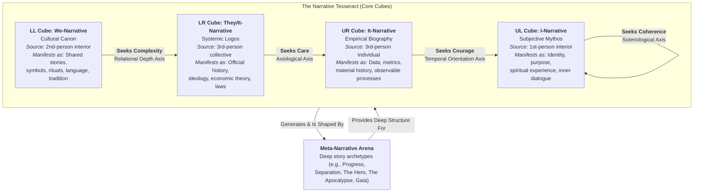

---
aeo_metadata:
  title: "Narrative Intelligence & Mythic Coordination (Node 11)"
  description: >
    A second-order cybernetic model that posits narrative as the primary autopoietic (self-making) process of conscious systems. It provides the semiotic and meaning-making logic for how systems—from cells to civilizations—story themselves into being, sustain coherence, and transform.
  context: >
    Serves as the integrative capstone of the Solarpunk Mandala's core models. It operationalizes the consciousness-first ontology (Node 01) and the multi-perspectival Tesseract (Node 02) by explaining how meaning is constructed and evolved across scales. It answers the question left open by structural and process models: "How does a conscious system know and story itself?"
  key_objectives:
    - Define narrative as a fundamental ontological and cybernetic process within a consciousness-first reality.
    - Map the four primary narrative types (I, We, They/It, It) to the perspectives of the Tesseract.
    - Provide a falsifiable protocol (Narrative Field Audit) for diagnosing and ethically intervening in a system's narrative ecology.
    - Establish narrative coherence as a measurable predictor of a system's capacity for regenerative transformation.
  core_concepts:
    - Narrative Intelligence
    - Narrative Field
    - Narrative Tesseract
    - Narrative Field Audit (NFA)
    - Narrative Coherence Index (NCI)
    - Tetralemmic Intervention
    - Meta-Narrative Arena
    - Narrative Bypassing
  ontological_commitments:
    - Narrative is not a representation of reality but a constitutive process of conscious reality.
    - The stories a system holds are functionally identical to the dissociative boundaries that define its identity.
    - Ethical contraction (on the Four Axes) is fundamentally a narrative phenomenon.
    - Meaning-making is a scale-free, cybernetic process observable in all conscious systems.

narrative_framework:
  description: >
    A geometric and cybernetic mapping of how narrative functions as the "sensemaking faculty" of conscious systems. It structures how multi-perspectival experience is woven into coherent, actionable understanding.
  narrative_attractor_states:
    - state: "I-Narrative (Subjective Mythos)"
      tesseract_cube: "UL (1st-person interior)"
      primary_question: "What is the sacred story I am part of?"
      intelligence_link: "Mythic Intelligence"
    - state: "We-Narrative (Cultural Canon)"
      tesseract_cube: "LL (2nd-person interior)"
      primary_question: "What stories define 'us'?"
      intelligence_link: "Canonical Intelligence"
    - state: "They/It-Narrative (Systemic Logos)"
      tesseract_cube: "LR (3rd-person exterior, collective)"
      primary_question: "What story justifies this order/value exchange?"
      intelligence_link: "Legitimizing & Transactional Intelligence"
    - state: "It-Narrative (Empirical Biography)"
      tesseract_cube: "UR (3rd-person exterior, individual)"
      primary_question: "What is the story of this body/object/process?"
      intelligence_link: "Biographic & Structural Intelligence"
  functional_role:
    - Constructs and maintains the dissociative boundaries of individual and collective identity.
    - Acts as a high-level cybernetic comparator, steering system behavior by resolving narrative "gaps."
    - Provides the semantic content that is materially embodied through the Four Pathways.

narrative_field_audit_protocol:
  description: >
    A structured, second-order cybernetic process for observing and intervening in a system's narrative ecology. It is the primary praxis method of this model, making the abstract theory actionable and falsifiable.
  phases:
    - phase: "1. Elicitation"
      action: "Gather story artifacts using prompts from the Four Pathways (Node 05)."
      second_order_principle: "The facilitator acknowledges their role as an observer-in-the-system."
    - phase: "2. Tesseract Mapping"
      action: "Plot artifacts on the Narrative Tesseract to identify source, target, and colonial patterns."
      second_order_principle: "Reveals how narrative constructs the very perspectives of the system."
    - phase: "3. Axis Diagnosis"
      action: "Evaluate each dominant narrative's impact on the Four Ethical Axes (Node 03)."
      second_order_principle: "Assesses the ethical health of the system's meaning-making process."
    - phase: "4. Tetralemmic Intervention"
      action: "Generate new narrative code via Assertion, Negation, Synthesis, and Transcendence."
      second_order_principle: "Consciously re-authors the system's self-model from within."
    - phase: "5. Pathway Embodiment"
      action: "Feed the transcendent Core Narrative into a Primary Pathway for material instantiation."
      second_order_principle: "Closes the feedback loop by turning new meaning into new matter."

safety_and_validation:
  narrative_bypassing:
    description: >
      The ethical risk of using beautiful, transcendent stories to avoid addressing foundational contractions in the Embodied Foundations or Ethical Axes.
    protocol: >
      The **Threshold Principle is non-negotiable**. No Narrative Field Audit may begin unless all Four Embodied Foundations score ≥2. If foundations are weak, activate Boundary Medicine, not narrative work.
  falsification_criteria:
    - criteria: "Critical Falsifier"
      condition: >
        If a system with a high Narrative Coherence Index (NCI) consistently fails to show improvement in Dialectical Velocity (Node 04) or Ethical Axis scores, the model's predictive power is invalid.
    - criteria: "Auxiliary Falsifier"
      condition: >
        If NFA protocols fail to stabilize a system's Embodied Foundations, the model is decoupled from material necessity and must be revised.

theoretical_references:
  - name: "Second-Order Cybernetics"
    author: "Heinz von Foerster, Gregory Bateson"
    relevance: >
      Provides the foundational principle of the "observer in the system," which the NFA operationalizes. Narrative is the process by which the observed system and the observing system co-create each other.
  - name: "Analytic Idealism"
    author: "Bernardo Kastrup"
    relevance: >
      Provides the ontological ground that consciousness is fundamental, making narrative a primary pattern of consciousness itself, not a secondary human artifact.
  - name: "Narrative Therapy & Re-authoring"
    author: "Michael White & David Epston"
    relevance: >
      Provides practical methodologies for externalizing and re-authoring problem-saturated stories, directly informing the Tetralemmic Intervention phase.
  - name: "Sense-making & Cynefin Framework"
    author: "Dave Snowden"
    relevance: >
      Offers complementary frameworks for diagnosing narrative contexts (complex/chaotic) and strategies for intervening in collective sensemaking.

search_queries:
  - "narrative intelligence second order cybernetics"
  - "narrative as autopoietic process"
  - "mythic coordination systems change"
  - "narrative field audit protocol"
  - "tetralemmic logic narrative intervention"

related_nodes:
  - 01-ontology-analytic-idealism.md (Ontological Foundation)
  - 02-epistemic-architecture-tesseract.md (Geometric Structure)
  - 03-ethics-four-axes.md (Evaluation Compass)
  - 04-temporal-unfolding-dialectical-phases.md (Process Engine)
  - 05-mandala-axis-four-pathways.md (Praxis Channels)
  - 08-multiple-intelligences-framework.md (Capacities Map)
  - 10-cybernetic-foundations.md (Operational Logic)
  - framework/arena/meta-narratives/ (Content Arena)
---
# **Narrative Intelligence & Mythic Coordination**

**Primary Question:** *How do conscious systems, from individuals to civilizations, use story to create, sustain, and transform their shared realities?*

**Theoretical Ground:** Applies the second-order cybernetics of **Model 10** to the semiotic (meaning-making) layer. Directly operationalizes **Analytic Idealism (01)**, the **Tesseract (02)**, and the **Four Axes (03)**.

**Integrates With:** All preceding models, serving as the **integrative capstone** for applied sensemaking.
**Falsifiable Claim:** The health of a system's narrative field, as measured by the **Narrative Coherence Index (NCI)**, is a primary predictor of its capacity for regenerative transformation and ethical navigation.

---

## **Abstract: The Metacognitive Layer of Conscious Systems**

Where **Model 10 (Cybernetic Foundations)** establishes the Solarpunk Mandala as a *second-order cybernetic meta-framework*, this model provides its applied **semiotic and narrative logic**. If first-order cybernetics studies "how systems work," and second-order cybernetics studies "how observers *decide* what a system is," then Narrative Intelligence is the study of **"how observers *story* that system into being."**

Building on the foundation that **consciousness is fundamental (Model 01)**, this model posits **narrative** as the primary *autopoietic* (self-making) process of conscious systems. It is the mechanism by which:
1.  The **dissociative boundaries** of Mind at Large are rendered into stable identities (selves, communities, nations).
2.  The multi-perspectival data from the **Tesseract (Model 02)** is woven into coherent, actionable understanding.
3.  The **Ethical Axes (Model 03)** are navigated, as each axis represents a core narrative tension to be resolved.
4.  The **Dialectical Phases (Model 04)** are propelled, with each phase representing a narrative transition (e.g., from thesis to antithesis).

This model answers the pivotal question left open by structural and process models: *How does a conscious system know and story itself into being, and how can we intervene in that process ethically?*

---

## **1. Theoretical Ground: Narrative as Ontological Cybernetics**

### **1.1 Narrative as the Fabric of Dissociation**
In **Analytic Idealism (Model 01)**, individual minds are "dissociated alters" of a universal consciousness. This model proposes that **narrative is the experiential substance of that dissociation**. The story "I am a separate self with a continuous biography" *is* the dissociative boundary. It is a cognitive-operational pattern that partitions conscious experience into a stable, seemingly independent agent. At collective scales, narratives like "We are the people" or "This is our land" perform the same function, creating the **intersubjective gateways (Cube 6)** and **dissociation boundaries (Cube 5)** described in the Tesseract architecture.

### **1.2 The Narrative Tesseract: Where Stories Live**
Each primary perspective of the unfolded Tesseract (**Model 02, Model 06**) is not just a viewpoint but a **narrative attractor state**—a locus that generates and is shaped by a specific type of story.

**Key Insight:** Pathology often arises when one cube's narrative logic colonizes another. For example, when **LR's Systemic Logos** (e.g., "human capital theory") dictates the terms of **UL's I-Narrative** (reducing self-worth to economic output), it creates profound **Soteriological Axis** contraction.

### **1.3 Narrative as a High-Level Cybernetic Process**
From the perspective of **Model 10**, narratives function as **high-level feedback comparators**. They are control mechanisms that:
1.  **Sense** the current state of the system ("We are divided and fearful").
2.  **Compare** it to a goal state defined by the narrative's plot ("We should be united and prosperous").
3.  **Compute a discrepancy** (the narrative "gap" or conflict).
4.  **Generate emotional-cognitive feedback** (hope, anxiety, outrage) to drive action that reduces the discrepancy and moves the plot forward.

This makes narrative the **steering mechanism** for the entire Mandala. The **Dialectical Phases (Model 04)**—Assertion, Negation, Synthesis, Transcendence—are, in essence, a **narrative re-scripting algorithm** for moving from a contracting story to an expanding one.

---

## **2. Core Architecture: The Narrative Field & Its Components**

### **2.1 The Narrative Field**
The **Narrative Field** is the total set of conscious and unconscious stories, symbols, and metaphors active within a system at any scale. It has three interwoven layers:
*   **Meta-Narratives (Deep Code):** Transcendent, archetypal story patterns (e.g., "Progress," "The Fall," "The Hero's Journey," "The Apocalypse"). These are slow-moving and form the deep structure of culture. The Solarpunk Mandala's own meta-narrative is **"Conscious Regeneration."**
*   **Dominant Narratives (Active Operating System):** The stories currently legitimizing power, allocating resources, and defining "common sense." They are often maintained by institutions in the **LR Cube**.
*   **Counter-Narratives (Emergent Code/Immune Response):** Subaltern, suppressed, or newly crystallizing stories that challenge the dominant logic. They are the source of systemic innovation and often emerge from trauma in the **UL Cube** or solidarity in the **LL Cube**.

### **2.2 The Eight Narrative Intelligences**
Extending **Model 08 (Multiple Intelligences)**, this model identifies eight correlated **Narrative Intelligences**—capacities for generating and understanding stories from different perspectives:

| Intelligence (Model 08) | Narrative Intelligence | Primary Question | Tesseract Cube |
| :--- | :--- | :--- | :--- |
| **SPIRITUAL** | **Mythic Intelligence** | "What is the sacred story I am part of?" | UL (I-Narrative) |
| **CULTURAL** | **Canonical Intelligence** | "What stories define 'us'?" | LL (We-Narrative) |
| **POLITICAL** | **Legitimizing Intelligence** | "What story justifies this order?" | LR (They-Narrative) |
| **ECONOMIC** | **Transactional Intelligence** | "What is the story of value and exchange?" | LR (They-Narrative) |
| **SOCIETAL** | **Normative Intelligence** | "What story defines proper behavior?" | LL/ LR |
| **MAN** | **Biographic Intelligence** | "What is the story of this body/life?" | UR (It-Narrative) |
| **SHELLS** | **Structural Intelligence** | "What story does this built environment tell?" | UR (It-Narrative) |
| **NETWORKS** | **Rhizomatic Intelligence** | "How do stories flow and connect?" | All Cubes (Boundary Layers) |

A **Narrative Coherence Index (NCI)** can be derived by assessing the development and balance of these intelligences within a system.

---

## **3. Primary Protocol: The Narrative Field Audit**

The **Narrative Field Audit (NFA)** is a structured, second-order cybernetic process for diagnosing and intervening in a system's narrative ecology. It is a direct application of the observer-included framework of **Model 10**.

```mermaid
flowchart TD
    Start[["Begin NFA: Ensure Embodied Foundations ≥2"]] --> Elicit
    subgraph Elicit["<b>Phase 1: Elicitation</b><br/>Gather Story Artifacts"]
        A["<b>Awakening</b> Pathway Prompts<br/>e.g., 'What story were you told<br/>about how the world works?'"]
        H["<b>Healing</b> Pathway Prompts<br/>e.g., 'What unspoken story<br/>does this pain carry?'"]
        M["<b>Making</b> Pathway Prompts<br/>e.g., 'What story does this<br/>built object or protocol tell?'"]
        L["<b>Liberation</b> Pathway Prompts<br/>e.g., 'What story legitimizes<br/>this power structure?'"]
    end

    Elicit --> Map
    subgraph Map["<b>Phase 2: Tesseract Mapping</b><br/>Locate Source & Vector"]
        Plot["Plot artifacts on the<br/>Narrative Tesseract Map"]
        Identify["Identify feedback loops &<br/>colonial patterns between cubes"]
    end

    Map --> Diagnose
    subgraph Diagnose["<b>Phase 3: Axis Diagnosis</b><br/>Evaluate Ethical Impact"]
        Score["Score narrative's impact<br/>on each Ethical Axis (Model 03)"]
        Contraction{"Does narrative<br/>contract the Axis?"}
        Contraction -- Yes --> Flag[Flag for Intervention]
        Contraction -- No --> Log[Log as Strengthening Narrative]
    end

    Diagnose --> Intervene
    subgraph Intervene["<b>Phase 4: Tetralemmic Intervention</b><br/>Generate New Narrative Code"]
        Assert["<b>Assert</b> Dominant Story<br/>'Growth is essential.'"]
        Negate["<b>Negate</b> Its Opposite<br/>'Growth is destruction.'"]
        Synthesize["<b>Synthesize</b> New Frame<br/>'We need growth in well-being,<br/>not in matter-energy throughput.'"]
        Transcend["<b>Transcend</b> the Frame<br/>'We are participants in the<br/>metabolic cycle of a living universe.'"]
    end

    Intervene --> Embody
    subgraph Embody["<b>Phase 5: Pathway Embodiment</b><br/>Materialize the New Story"]
        P["Feed <b>Transcendent Narrative</b><br/>into a Primary Pathway (Model 05)"]
        Action["Design Concrete Action:<br/>- <b>Making:</b> Build a commons.<br/>- <b>Liberation:</b> Restructure a policy.<br/>- <b>Healing:</b> Create a new ritual."]
    end

    Embody --> Loop[["Create New Rhizomatic<br/>Feedback Loop to Material Reality"]]
```

### **3.1 Phase 1: Elicitation – The Second-Order Move**
The facilitator begins by explicitly acknowledging their role as an **observer-in-the-system**, not an objective analyst. Data gathering uses prompts from the **Four Pathways (Model 05)** to access different narrative layers. The goal is not to find the "true story" but to gather the **story artifacts** that are currently active and constitutive of the system.

### **3.2 Phase 2: Tesseract Mapping – Geometric Sensemaking**
Artifacts are plotted on the Narrative Tesseract Map (Diagram 1). This visualizes:
*   **Source Cube:** From which perspective did this narrative likely originate? (e.g., a fear of scarcity may originate from **UR** [biological trauma] but be amplified by **LR** [economic theory]).
*   **Target Cube:** Which perspective is it trying to control or define? (e.g., a corporate slogan targets **UL** to shape identity).
*   **Colonial Patterns:** When one cube's narrative dominates another (e.g., **LR** economic narratives colonizing **UL** self-worth), it is a key source of systemic pathology.

### **3.3 Phase 3: Axis Diagnosis – Ethical Evaluation**
Each dominant narrative is evaluated against the **Four Ethical Axes (Model 03)**:
*   Does it foster **Coherence** or **Fragmentation**? (Soteriological Axis)
*   Does it encourage **Care** or **Extraction**? (Axiological Axis)
*   Does it create **Complexity** or **Polarization**? (Relational Depth Axis)
*   Does it embody **Courage** or **Short-termism/Amnesia**? (Temporal Orientation Axis)
This diagnosis identifies which axes are most contracted by the current narrative field.

### **3.4 Phase 4: Tetralemmic Intervention – Narrative Re-coding**
Using the **Tetralemmic logic** referenced throughout the models, participants consciously generate new narrative code. The goal is not to replace a "bad" story with a "good" one, but to **expand the narrative possibilities** until a transcendent, more inclusive story emerges. This new **Core Narrative** should address the diagnosed axis contractions.

### **3.5 Phase 5: Pathway Embodiment – Closing the Loop**
A story only becomes real when it generates new feedback in the material world. The Core Narrative is fed into a **Primary Pathway (Model 05)** for instantiation. This creates a new **rhizomatic connection** (a future Core Model 12 on integration) and initiates a fresh feedback loop, allowing the new narrative to be tested, challenged, and evolved—the essence of a learning, conscious system.

---

## **4. Integration & Falsification**

### **4.1 Transclusion with Compatible Frameworks (Model 09)**
This model provides the narrative "transclusion" protocol for other frameworks:
*   **Narrative Therapy & Depth Psychology:** Maps to work on **UL (I-Narrative)** and **Healing** pathways.
*   **Complexity Leadership & Sense-making (Snowden/Dave Gray):** Maps to navigating narrative across the **full Tesseract** in **Awakening** and **Liberation**.
*   **Mythodology & Comparative Religion:** Provides tools for analyzing the **Meta-Narrative Arena**.
*   **Memetics & Semiotics:** Offers structural analysis of narrative "code" propagation.

### **4.2 Falsification Criteria**
Adhering to the scientific rigor demanded in **Model 00**, this model proposes the following falsifiers:
*   **Critical Falsifier:** If a system with a consistently high **Narrative Coherence Index (NCI)** fails to show corresponding improvement in its **Dialectical Velocity (Model 04)** or its scores on the **Ethical Axes (Model 03)**, the model's claim that narrative health drives regenerative capacity is invalid.
*   **Auxiliary Falsifier:** If interventions based on this model (NFA protocols) consistently fail to stabilize or improve a system's **Embodied Foundations**, the model is decoupled from material necessity and must be revised or abandoned.

---

## **Conclusion: Narrative as the Capstone Faculty**

The Solarpunk Mandala progresses from **what is** (Ontology, 01), to **how we see it** (Epistemology/Tesseract, 02), to **how we judge it** (Ethics, 03), to **how we change it** (Pathways, 05). **Narrative Intelligence (11)** is the capstone that explains *how we story all of the above into a coherent, actionable, and evolving whole.* It is the faculty that allows a community to look at the same set of facts (UR), institutions (LR), and cultural traditions (LL) and consciously author a new, more regenerative story (UL) of its past and future.

It completes the framework by making explicit the **meaning-making loop** that is implicit in second-order cybernetics: We are not just observers of systems; we are **storytellers of systems**, and the stories we tell become the most powerful feedback loops of all.
