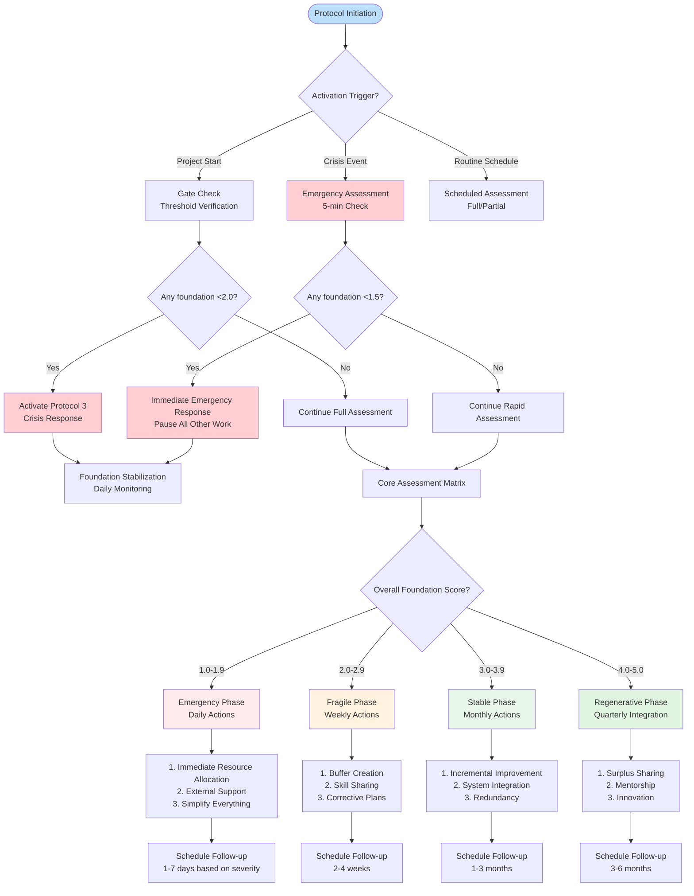
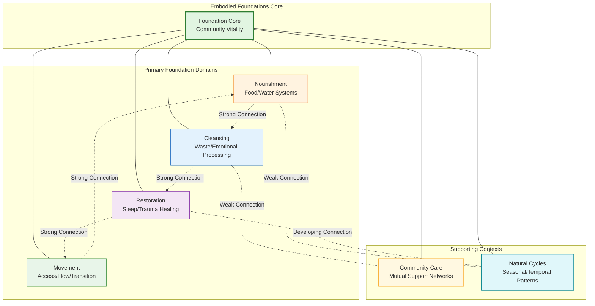
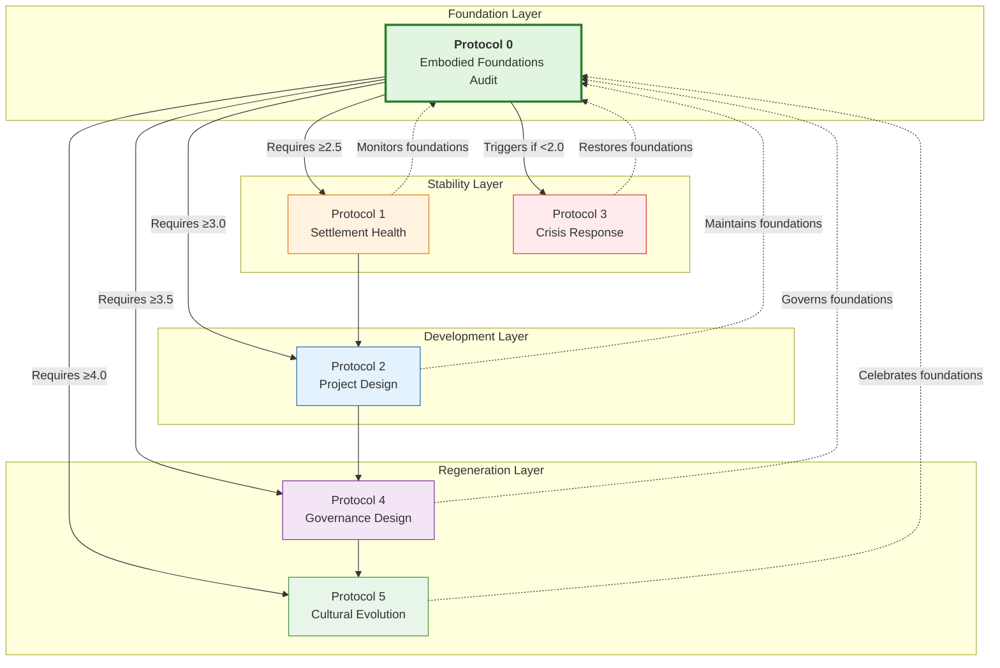

---
# AEO/AAE OPTIMIZATION METADATA
aeo_metadata:
  title: "Protocol 0: Embodied Foundations Audit"
  description: "A prerequisite assessment protocol for verifying basic human need fulfillment before engaging in higher-order community transformation. Establishes material and emotional stability as the foundation for all regenerative work within the Solarpunk Mandala framework."
  context: "Foundational protocol that must be completed before any other community work. Addresses the 0D/1D dimensional interface where consciousness manifests in physical form. Serves as boundary medicine for healing dissociation between material needs and spiritual development."
  key_objectives:
    - "Verify minimum threshold fulfillment of four embodied foundation domains (Nourishment, Cleansing, Restoration, Movement)"
    - "Establish protocol activation/deactivation criteria based on community phase and crisis conditions"
    - "Provide fractal assessment tools applicable across individual, community, and settlement scales"
    - "Integrate material foundation work with MAL (Mind at Large) consciousness principles"
    - "Create clear action pathways based on assessment scores and dialectical velocity"
    - "Define inter-protocol dependencies and integration points within the Solarpunk Mandala framework"
  
  core_concepts:
    - "Embodied Foundations Quadrant (Nourishment, Cleansing, Restoration, Movement)"
    - "Foundation Threshold Theory (Emergency/Critical/Stable/Regenerative)"
    - "Dialectical Velocity Assessment"
    - "Dissociation Boundary Healing through Material Practice"
    - "Fractal Scaling of Basic Need Fulfillment"
    - "Protocol Activation/Deactivation Criteria"
    - "Inter-Protocol Dependency Mapping"
  
  ontological_foundation: "Materialism-Spirituality Integration through Embodied Practice"
  epistemic_stance: "Pragmatic Assessment with Consciousness Integration"
  
  search_queries:
    - "community needs assessment protocol"
    - "basic needs audit for intentional communities"
    - "embodied foundations assessment tool"
    - "prerequisites for community transformation work"
    - "Solarpunk Mandala protocol 0"
    - "material-spiritual integration assessment"
    - "crisis response foundation stabilization"
  
  related_nodes:
    - "guides/protocols/01-settlement-health-assessment.md"
    - "guides/protocols/03-crisis-response-framework.md"
    - "framework/core-model/05-dissociation-boundaries-cube.md"
    - "framework/core-model/01-dimensional-unfolding-theory.md"
    - "case-studies/detroit-water-justice-2014.md"
  
  framework_status: "Stable Core Protocol"
  version: "2.1"
  last_reviewed: "2026-01-12"
  next_review: "2026-07-12"
  protocol_dependencies:
    prerequisite: "None (entry point protocol)"
    required_for: "All other protocols (1-5)"
    triggers: "Protocol 3 when foundations <2.0"
  
  assessment_metrics:
    - "Four foundation domain scores (1-5 scale)"
    - "Interconnection strength scores (1-5 scale)"
    - "Dialectical velocity (0.0-1.0 scale)"
    - "Dimensional center identification (0D-4D)"
    - "Threshold compliance status (pass/fail)"
  
  implementation_levels:
    - "Emergency/Rapid (5-15 minutes)"
    - "Standard/Community (90-120 minutes)"
    - "Comprehensive/Integrated (2-3 hours)"
    - "Reflective/Advanced (integrated with other protocols)"
  
  license: "Community-Supported Open Protocol"
  contributing_guidelines: "https://github.com/ravaioli/solarpunk-mandala/blob/main/CONTRIBUTING.md"
---
# Protocol 0: Embodied Foundations Audit
*A Prerequisite Assessment for Regenerative Community Practice*

> **Protocol Boundary**: This foundational protocol must be completed before initiating any advanced community transformation work. It ensures the physical, emotional, and relational stability required for meaningful systemic change.

---

## AEO Metadata
*Placeholder for AEO/AAE Optimization Metadata YAML*

## 1.0 Purpose & Philosophical Foundations

### 1.1 Core Purpose
To systematically assess and verify that a community's basic human needs are reliably met before engaging in higher-order transformation work. This protocol establishes the material and emotional foundations necessary for sustainable regeneration.

### 1.2 Philosophical Framework
Embodied foundations represent the 0D/1D dimensional interface where consciousness manifests in physical form. By attending to nourishment, cleansing, restoration, and movement, we honor the body as the primary vessel through which Mind at Large (MAL) experiences and transforms material reality. These foundations are not preliminary to spiritual practice but constitute its essential ground.

### 1.3 MAL Integration Context
When communities neglect embodied foundations, they reinforce dissociation boundaries between individual survival and collective consciousness. This protocol serves as boundary medicine, healing the artificial separation between material needs and spiritual development by recognizing that food, water, rest, and movement are sacred expressions of consciousness organizing matter.

## 2.0 Protocol Activation Framework

### 2.1 Activation Triggers
Initiate this protocol when any of the following conditions are present:

| Trigger Category | Specific Indicators | Urgency Level |
|-----------------|---------------------|---------------|
| **Project Initiation** | Starting any new community project, settlement, or initiative | Required (pre-launch) |
| **Crisis Response** | Natural disaster, resource scarcity, social conflict, or systemic shock | Immediate (within 72 hours) |
| **Degeneration Patterns** | Emerging burnout, attrition, conflict escalation, or neglect of basic needs | High (within 1 week) |
| **Routine Maintenance** | Established communities requiring periodic foundation verification | Scheduled (monthly/quarterly) |
| **Phase Transition** | Preparing for increased complexity or scale of community work | Required (pre-transition) |

### 2.2 Deactivation Criteria
This protocol transitions from active assessment to integrated practice when:
- All four foundation domains score consistently at 4.0+ for three consecutive assessments
- Community demonstrates stable, self-correcting patterns of foundation care
- Responsibility for foundation maintenance has distributed beyond designated facilitators
- Foundation practices have become embedded in community rituals and decision-making

### 2.3 Assessment Frequency Guidelines

| Community Phase | Recommended Frequency | Assessment Depth | Focus Areas |
|-----------------|-----------------------|------------------|-------------|
| **Crisis/Emergency** | Weekly | Rapid (30-minute assessment) | Critical gaps only |
| **Formation/Early** | Monthly | Standard (90-minute assessment) | All domains, focus on thresholds |
| **Stable/Developing** | Quarterly | Comprehensive (2-hour assessment) | All domains with integration analysis |
| **Regenerative/Mature** | Biannually | Reflective (integrated with other protocols) | Inter-domain connections, MAL integration |

## 3.0 Embodied Foundations Gate Check
*Prerequisite Assessment Before Protocol Proceeds*

### 3.1 Foundation Threshold Verification
Before conducting a full assessment, verify that all foundations meet minimum survival thresholds:

| Foundation Domain | Current Score (1-5) | Minimum Threshold | Emergency Threshold | Status | Notes |
|------------------|---------------------|-------------------|---------------------|--------|-------|
| **Nourishment** | _____ | 2.0 | 1.5 | [ ] Pass / [ ] Fail | Access to food/water |
| **Cleansing** | _____ | 2.0 | 1.5 | [ ] Pass / [ ] Fail | Hygiene & waste systems |
| **Restoration** | _____ | 2.0 | 1.5 | [ ] Pass / [ ] Fail | Sleep & trauma healing |
| **Movement** | _____ | 2.0 | 1.5 | [ ] Pass / [ ] Fail | Physical & social mobility |

### 3.2 Boundary Rules & Protocol Cascades

**CRITICAL RULE**: If ANY foundation scores below the emergency threshold (1.5):
- IMMEDIATELY pause all non-essential community activities
- Activate Protocol 3 (Crisis Response Framework) with foundation stabilization focus
- Redirect all available resources to address the critical foundation gap
- Conduct daily mini-assessments until emergency is resolved

**STANDARD RULE**: If ANY foundation scores below minimum threshold (2.0) but above emergency:
- Proceed with simplified version of this protocol (Section 4 only)
- Implement corrective actions within 48 hours
- Re-assess affected foundation within 1 week
- Limit other protocols to those directly supporting foundation repair

## 4.0 Core Assessment Matrix

### 4.1 Assessment Methodology
Score each indicator on a 1-5 scale using the following rubric:
- **1 (Critical Failure)**: Condition is absent or actively harmful
- **2 (Deficient)**: Condition exists but is unreliable or exclusionary
- **3 (Adequate)**: Condition is reliably available to most members
- **4 (Regenerative)**: Condition enhances community vitality and ecological health
- **5 (Transformative)**: Condition generates surplus value beyond the community

*Score based on the experience of the most vulnerable community members, not average conditions.*

### 4.2 Nourishment Domain
*Healing the dissociation between consumption and consciousness*

| Assessment Indicator | Score (1-5) | Evidence & Notes |
|----------------------|-------------|------------------|
| **4.2.1** Reliable access to nutritionally adequate food for all community members | _____ |  |
| **4.2.2** Consistent access to clean drinking water (minimum 5L/person/day) | _____ |  |
| **4.2.3** Communal eating spaces that welcome all members across social boundaries | _____ |  |
| **4.2.4** Food systems that connect people to seasonal cycles and local ecology | _____ |  |
| **4.2.5** Food production/consumption practices that regenerate soil and ecosystems | _____ |  |
| **Nourishment Subscore** | **_____** | *Average of above scores* |

### 4.3 Cleansing Domain
*Transforming waste into regeneration*

| Assessment Indicator | Score (1-5) | Evidence & Notes |
|----------------------|-------------|------------------|
| **4.3.1** Access to clean water for bathing and hygiene for all members | _____ |  |
| **4.3.2** Waste processing systems that transform rather than dispose | _____ |  |
| **4.3.3** Regular emotional cleansing practices (grief circles, conflict resolution) | _____ |  |
| **4.3.4** Systems for cleansing social patterns (accountability processes, restorative justice) | _____ |  |
| **4.3.5** Rituals that mark completion and release (endings, transitions, forgiveness) | _____ |  |
| **Cleansing Subscore** | **_____** | *Average of above scores* |

### 4.4 Restoration Domain
*Remembering rest as sacred practice*

| Assessment Indicator | Score (1-5) | Evidence & Notes |
|----------------------|-------------|------------------|
| **4.4.1** Access to adequate sleep conditions (safe, quiet, comfortable spaces) | _____ |  |
| **4.4.2** Trauma healing resources accessible to those who need them | _____ |  |
| **4.4.3** Daily and seasonal rest rhythms honored in community schedules | _____ |  |
| **4.4.4** Practices for restoring connection after conflict or separation | _____ |  |
| **4.4.5** Systems that prevent burnout and distribute emotional labor equitably | _____ |  |
| **Restoration Subscore** | **_____** | *Average of above scores* |

### 4.5 Movement Domain
*Honoring flow as expression of consciousness*

| Assessment Indicator | Score (1-5) | Evidence & Notes |
|----------------------|-------------|------------------|
| **4.5.1** All members can move safely through community spaces (accessibility) | _____ |  |
| **4.5.2** Regular opportunities for communal movement (dance, walking, shared labor) | _____ |  |
| **4.5.3** Decision-making systems allow fluid movement of power and resources | _____ |  |
| **4.5.4** Support for life transitions (age, role, relationship status changes) | _____ |  |
| **4.5.5** Connection between bodily movement and ecological flows (water, wildlife, seasons) | _____ |  |
| **Movement Subscore** | **_____** | *Average of above scores* |

### 4.6 Foundation Interconnection Assessment
*Assessing relationships between domains*

| Connection | Strength (1-5) | Notes & Interventions |
|------------|----------------|----------------------|
| Nourishment ↔ Cleansing | _____ | Food systems connected to waste processing? |
| Cleansing ↔ Restoration | _____ | Cleansing rituals supporting emotional restoration? |
| Restoration ↔ Movement | _____ | Rest supporting capacity for movement and change? |
| Movement ↔ Nourishment | _____ | Movement connecting people to food sources? |
| **Interconnection Score** | **_____** | *Average of connection strengths* |

## 5.0 Scoring Interpretation & Action Pathways

### 5.1 Foundation Scoring Rubric

| Score Range | Phase Designation | Systemic Interpretation | Required Actions |
|-------------|-------------------|-------------------------|------------------|
| **1.0-1.9** | Emergency Collapse | Foundational systems failing or absent. Survival threatened. | 1. Immediate Protocol 3 activation 2. Focus resources on single most critical foundation 3. Daily monitoring 4. External support mobilization |
| **2.0-2.9** | Fragile Stability | Basic needs met but unreliable. High vulnerability to disruption. | 1. Simplified protocol monthly 2. Corrective action plan within 48h 3. Buffer creation for critical resources 4. Community skill-sharing for foundation care |
| **3.0-3.9** | Stable Foundation | Reliable systems supporting most members. Capacity for basic regeneration. | 1. Standard protocol quarterly 2. Incremental improvements toward 4.0 3. Begin integrating foundations with other protocols 4. Develop redundancy systems |
| **4.0-4.9** | Regenerative Flow | Systems enhance community and ecological vitality. Creating surplus value. | 1. Comprehensive protocol biannually 2. Share surplus with neighboring communities 3. Mentor other communities 4. Innovate new foundation practices |
| **5.0** | Transformative Integration | Foundations become generative portals for consciousness evolution. | 1. Protocol fully integrated into community being 2. Foundations teach other communities 3. Contribute to framework evolution 4. Create art/ritual expressing foundation wisdom |

### 5.2 Dialectical Phase Assessment
*Measuring community capacity for conscious transformation*

**Current Dialectical Velocity**: _____ (Rate 0.0-1.0)

| Velocity Range | Phase | Interpretation | Protocol Adaptation |
|---------------|-------|----------------|---------------------|
| **0.0-0.2** | Stagnant/Survival | Focused on immediate needs. Little capacity for reflection or change. | Focus on ONE most critical foundation only. Use simplest possible assessment. |
| **0.3-0.6** | Transitioning | Actively changing patterns. Some reflection capacity emerging. | Assess all foundations but prioritize based on scores. Include basic reflection questions. |
| **0.7-1.0** | Flowing | Natural movement between phases. Integrated reflection and action. | Full protocol with all reflection components. Explore interconnections deeply. |

**Integration Rule**: If dialectical velocity is below 0.3, reduce assessment to the 3 most critical indicators per foundation rather than full matrix.

## 6.0 Fractal Integration Analysis

### 6.1 Dissociation Lens Assessment
*For each foundation domain, complete the following analysis:*

**Domain**: [Nourishment/Cleansing/Restoration/Movement]

1. **Dissociation Boundary Identified**: Which Cube 5 boundary does this foundation primarily heal? (e.g., body-MAL, individual-collective, matter-spirit)

2. **MAL Re-membering**: How does stabilizing this foundation help us remember our belonging to Mind at Large?

3. **Boundary Medicine Practices**: What specific practices dissolve this dissociation? (List 2-3)

4. **Integration Ritual**: Design a simple ritual that honors this foundation as sacred practice.

*[Provide space for written reflection - ½ page per domain]*

### 6.2 Hexagonal Connection Mapping
*Visualizing foundation relationships and blockages*

**Mapping Exercise**:
1. Label the center cell: "Embodied Foundations Core"
2. Label surrounding cells: Nourishment, Cleansing, Restoration, Movement, Community Care, Natural Cycles
3. Draw lines between cells where strong, healthy connections exist (green)
4. Draw dotted lines between cells where connections are weak or damaged (yellow)
5. Mark cells where connections are blocked or antagonistic (red)
6. Identify one "keystone connection" to strengthen in the next assessment period

### 6.3 Dimensional Movement Tracking
*Monitoring evolution through dimensional unfolding*

| Dimensional Shift | Indicators of Movement | MAL Integration Moment | Assessment Questions |
|-------------------|------------------------|------------------------|----------------------|
| **0D → 1D** (Point to Line) | Emergency distribution → Regular schedule; Crisis reaction → Pattern recognition | Remembering that survival needs connect us to universal patterns of care | "Have we moved from reacting to emergencies to recognizing patterns?" |
| **1D → 2D** (Line to Plane) | Individual access → Collective systems; Personal responsibility → Shared governance | Recognizing shared responsibility as expression of collective consciousness | "Are foundation systems collectively owned and governed?" |
| **2D → 3D** (Plane to Volume) | Human systems → Ecological integration; Separate domains → Interconnected web | Seeing foundation work as MAL's intelligence expressed through human-ecological systems | "Do our foundation practices regenerate ecological systems?" |
| **3D → 4D** (Volume to Time) | Current stability → Future resilience; Static systems → Adaptive learning | Living as if personal, collective, and ecological needs are temporal expressions of the same consciousness | "Do our foundations make us more resilient to future changes?" |

**Current Dimensional Center**: _____ (0D, 1D, 2D, 3D, 4D)
**Primary Growth Edge**: _____ (Which dimensional shift is community currently navigating?)

## 7.0 Case Study: Applied Protocol Analysis

### 7.1 Detroit Water Justice Network (2014 Water Shutoffs)

**Context**: Municipal water shutoffs affecting 30,000+ households in predominantly Black neighborhoods during 2014. Crisis framed as "bill collection" vs. "human rights violation."

**Initial Assessment Scores**:
- **Nourishment**: 1.2 (food insecurity exacerbated by water crisis)
- **Cleansing**: 0.8 (no water access for drinking, bathing, toilets)
- **Restoration**: 1.5 (sleep disrupted by stress; no spaces for trauma processing)
- **Movement**: 1.8 (fear of moving through neighborhoods; social mobility blocked)

**Protocol Activation**: Triggered emergency Protocol 3 response. Network paused all policy advocacy to focus on:
1. Emergency water distribution points
2. Mutual aid networks for water sharing
3. Public health education about waterborne diseases
4. Creation of "hydration stations" in churches and community centers

**Dimensional Analysis**: Community was at 0D→1D transition - moving from crisis panic to organized response patterns.

**Three-Month Progress**:
- Foundations stabilized to minimum thresholds (all scores >2.0)
- Trust built through material support enabled deeper organizing
- Network developed "Water as Human Right" framework connecting individual need to systemic analysis
- Capacity built for simultaneous crisis response and policy advocacy

**One-Year Transformation**: When foundations reached consistent 3.0+ scores, network successfully:
- Launched community-owned water cooperative
- Won moratorium on water shutoffs
- Developed participatory water governance model
- Connected water justice to food sovereignty and land reparations movements

**Key Insight**: Foundation work built the trust and embodied resilience necessary for sustained systemic change. The protocol's insistence on addressing material needs before political analysis honored the truth that consciousness transforms through the body, not around it.

## 8.0 MAL Reflection Space
*Integrating assessment with cosmic consciousness perspective*

**Guided Reflection Questions**:

1. **Embodied Sacredness**: How does attending to basic needs like food, water, rest, and movement become spiritual practice rather than preliminary to it?

2. **Dissolution of Hierarchy**: In what ways does ensuring everyone's needs are met dissolve the illusion that some lives/consciousnesses matter more than others?

3. **Materiality as Consciousness**: How can we perceive food, water, waste, sleep, and movement as MAL organizing itself into temporary forms for experience and transformation?

4. **Foundation as Portal**: Which foundation domain currently serves as the most potent portal for your community to remember its belonging to MAL? Why?

5. **Ritual Design**: What simple daily ritual could honor one foundation domain as sacred practice?

*[Provide space for written reflection - 1-2 pages]*

## 9.0 Facilitation Framework

### 9.1 Preparation Guidelines

**Physical Space Requirements**:
- Quiet, comfortable space with natural light if possible
- Water and simple snacks available
- Wall space for hexagonal mapping exercise
- Floor seating options for embodied practice

**Material Preparation**:
- Printed assessment worksheets (one per participant plus facilitators)
- Colored pens/pencils for scoring and mapping
- Large paper for collective hexagonal map
- Timer for grounding and reflection exercises
- Recording device (with consent) for capturing insights

**Temporal Requirements**:
- 15 minutes: Facilitator preparation and space setup
- 10 minutes: Participant arrival and settling
- 90-120 minutes: Core assessment protocol
- 30 minutes: Immediate action planning
- **Total**: 2.5-3 hours minimum

**Facilitator Preparation**:
- Complete self-assessment of personal foundations beforehand
- Review previous assessment data if available
- Prepare adaptations for different mobility/access needs
- Establish emotional support plan for potentially triggering content

### 9.2 Facilitation Process

**Opening Sequence (15 minutes)**:
1. **Land Acknowledgement** (2 min): Honoring indigenous stewardship of land and water
2. **Grounding Practice** (3 min): Shared breathing or gentle movement
3. **Purpose Reminder** (3 min): Why we're here - not evaluation but loving assessment
4. **Confidentiality & Consent** (2 min): What's shared here stays here; right to pass
5. **Practical Logistics** (5 min): Bathrooms, breaks, timeline

**Core Assessment (60-80 minutes)**:
1. **Gate Check** (10 min): Quick threshold verification
2. **Domain Assessment** (40-50 min): Section 4 scoring with discussion
3. **Interconnection Analysis** (10 min): Relationship mapping
4. **Scoring Synthesis** (10 min): Calculate scores, identify patterns

**Integration & Planning (40-50 minutes)**:
1. **Dialectical Assessment** (5 min): Velocity scoring
2. **Dimensional Tracking** (10 min): Growth edge identification
3. **Action Planning** (20 min): Immediate and medium-term actions
4. **Closing Reflection** (5-10 min): One-word check-out or simple ritual

### 9.3 Facilitator Notes & Adaptations

**Critical Principles**:
- **Score from the margins**: Always assess based on most vulnerable members' experience
- **Concrete over abstract**: Use specific examples, not generalizations
- **Trauma-informed pace**: Watch for dissociation, overwhelm, activation
- **Honor resistance**: Skepticism about the process may indicate unmet foundations

**Common Challenges & Responses**:

| Challenge | Signs | Facilitator Response |
|-----------|-------|----------------------|
| **Minimization** | "We're fine, let's get to real work" | Gently explore specific examples; honor urgency while maintaining boundary |
| **Overwhelm** | Shutdown, distraction, emotional flooding | Offer break; simplify to one domain; focus on concrete next step |
| **Perfectionism** | Debate over precise scores; missing forest for trees | Redirect to patterns not precision; use ranges not exact numbers |
| **Privilege Blindness** | Scoring based on personal comfort not community margins | Ask "Who might experience this differently?"; use personas |
| **Theoretical Escape** | Philosophical discussion avoiding material assessment | "Let's track this important insight for later; for now, what's actually happening with water access?" |

**Adaptation for Different Contexts**:
- **Crisis Settings**: Reduce to 3 indicators per domain; focus on actions not reflection
- **Digital/Remote**: Use shared documents; include movement breaks; be explicit about context
- **Large Communities**: Assess by affinity groups then synthesize; use representatives + random sample
- **High Conflict**: Facilitate separately then synthesize; focus on shared needs not blame

## 10.0 Protocol Integration Matrix

### 10.1 Inter-Protocol Dependencies

| Protocol | Prerequisite Foundation Score | Integration Points | Contingency Actions |
|----------|-------------------------------|-------------------|---------------------|
| **Protocol 0** (This protocol) | Self-referential | Complete before any other protocol | If any foundation <2.0, activate Protocol 3 |
| **Protocol 1** (Settlement Health) | All foundations ≥2.5 | Foundation stability enables ecological assessment | If foundations degrade during Protocol 1, return here |
| **Protocol 2** (Project Design) | All foundations ≥3.0 | Foundation resilience supports complex project implementation | Projects must include foundation maintenance plans |
| **Protocol 3** (Crisis Response) | No minimum (activated by failure) | Emergency restoration of foundations | Post-crisis, use this protocol to assess recovery |
| **Protocol 4** (Governance Design) | All foundations ≥3.5 | Stable foundations enable participatory governance | Governance systems must monitor foundations |
| **Protocol 5** (Cultural Evolution) | All foundations ≥4.0 | Regenerative foundations support cultural innovation | Cultural practices must honor foundation wisdom |

### 10.2 Assessment Integration Schedule

| Community Phase | Primary Protocol | Foundation Integration | Frequency |
|-----------------|------------------|-----------------------|-----------|
| **Crisis** | Protocol 3 | Emergency foundation restoration | Daily monitoring |
| **Stabilization** | Protocol 0 | Foundation assessment & repair | Weekly → Monthly |
| **Development** | Protocols 1 & 2 | Foundation-ecology-project integration | Quarterly assessments |
| **Regeneration** | Protocols 4 & 5 | Foundations as cultural governance element | Biannual reflection |
| **Transformation** | All protocols integrated | Foundations as unconscious competence | As needed sensing |

## 11.0 Appendices

### 11.1 Rapid Assessment Template
*For emergency or time-constrained situations*

**Five-Minute Check**:
1. **Water**: Does everyone have drinking water today? (Y/N)
2. **Food**: Does everyone have at least two meals today? (Y/N)
3. **Rest**: Has everyone had 4+ hours sleep in safe space? (Y/N)
4. **Safety**: Can everyone move without fear of violence? (Y/N)

*If ANY "No": Activate emergency response immediately.*

### 11.2 Foundation Ritual Library
*Simple practices for honoring each domain*

**Nourishment Ritual**: Silent eating with gratitude; seasonal food celebration
**Cleansing Ritual**: Water blessing; burn bowl for releasing what no longer serves
**Restoration Ritual**: Collective nap; storytelling circle for healing
**Movement Ritual**: Dawn walk; spontaneous dance break

### 11.3 Resource Mapping Template
*For tracking foundation-related assets and gaps*

| Resource Type | What we have | What we need | Who has access | Who doesn't |
|---------------|--------------|--------------|----------------|-------------|
| Water sources |              |              |                |             |
| Food systems  |              |              |                |             |
| Sleep spaces  |              |              |                |             |
| Safe pathways |              |              |                |             |

### 11.4 Glossary of Terms

**Dialectical Velocity**: The rate and fluidity of movement between different phases of community development.

**Dissociation Boundary**: In Cube 5 framework, the perceived separation between different aspects of consciousness (body/mind, self/other, human/nature).

**Foundation Domain**: One of four primary areas of embodied need (Nourishment, Cleansing, Restoration, Movement).

**Mind at Large (MAL)**: The framework's term for universal consciousness of which all beings are expressions.

**Regenerative Practice**: Activity that enhances rather than depletes the systems it engages with.

---

*Protocol Version: 2.1 • Last Updated: 2026-01-12 • Framework: Solarpunk Mandala v4.3*
*License: Community-Supported Open Protocol • Contributing: See framework repository*
