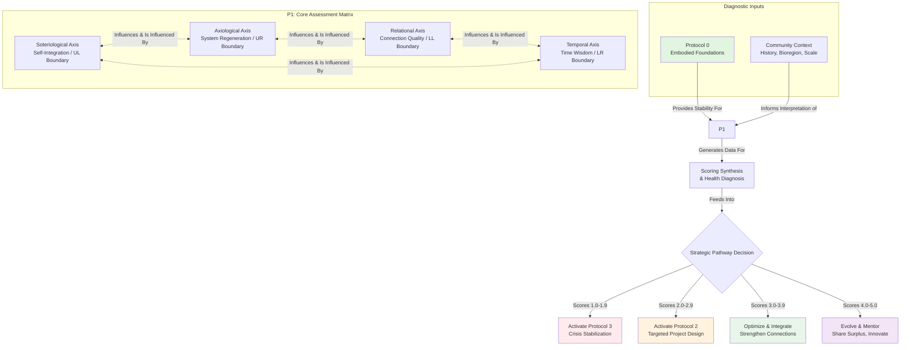
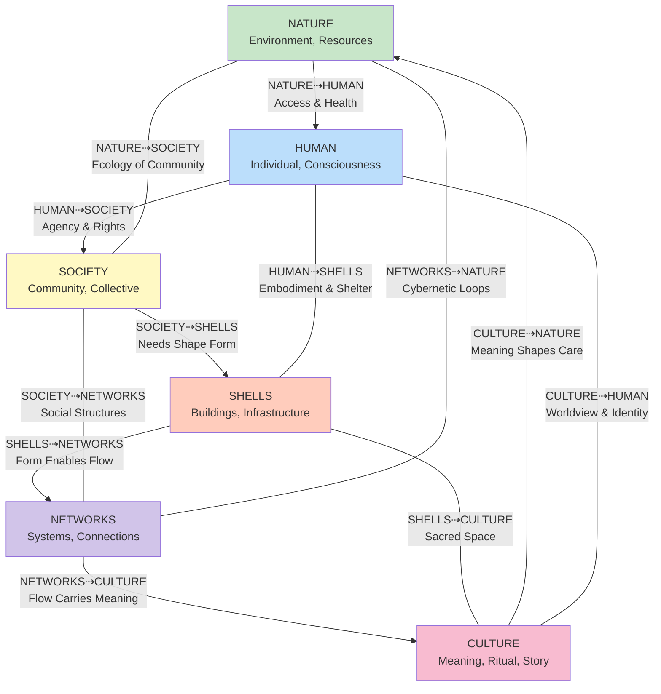
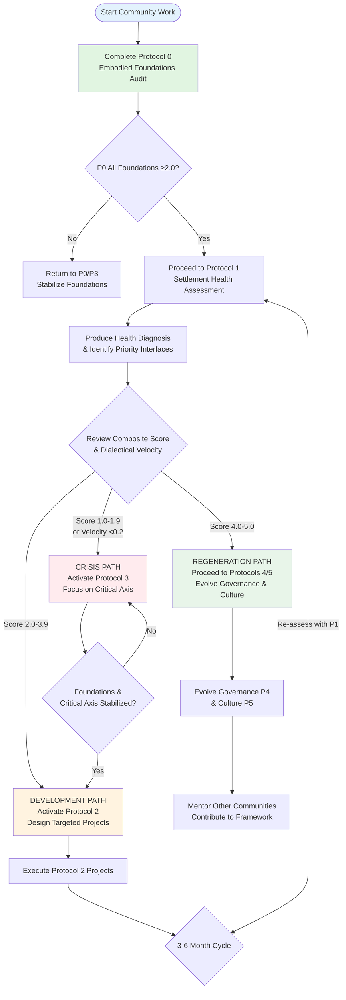

# Protocol 1: Settlement Health Assessment
*A Multi-Axis Diagnostic for Regenerative Community Vitality*

> **Protocol Gateway**: This diagnostic protocol maps the health, contraction patterns, and regenerative potential of a community across four ethical axes. It transforms abstract values into measurable indicators, providing a strategic map for conscious intervention and holistic development.

---

## 1.0 Purpose & Diagnostic Foundations

### 1.1 Core Purpose
To diagnose the health of a human settlement by simultaneously assessing its state across four interdependent axes of transformation: **Soteriological** (Self-Integration), **Axiological** (System Regeneration), **Relational** (Connection Quality), and **Temporal** (Time Wisdom). This protocol identifies specific patterns of contraction and regeneration to guide targeted, fractal interventions.

### 1.2 Philosophical Framework
A healthy settlement is a conscious entity expressing the dynamics of Mind at Large (MAL) through its material and social forms. This assessment operates on the principle that contraction in one axis creates distortion in all others, and regeneration in one fosters resilience in the whole. It treats the community as a living system, where "health" is defined by its capacity for integrated complexity, adaptive learning, and conscious participation in larger ecological and cosmic patterns.

### 1.3 Protocol Position in the Mandala
This protocol builds upon the material stability verified in **Protocol 0 (Embodied Foundations)**. It serves as the primary diagnostic tool to inform project design in **Protocol 2** and can trigger **Protocol 3 (Crisis Response)** if severe contraction is detected. It is the bridge between foundational survival and conscious co-evolution.

## 2.0 Protocol Activation Framework

### 2.1 Activation Triggers & Prerequisites
This protocol requires that **Protocol 0** has been completed with all foundations scoring **≥2.0**.

| Trigger Scenario | Recommended Timing | Assessment Scope | Primary Goal |
|------------------|-------------------|------------------|--------------|
| **Strategic Planning Cycle** | Annually or biennially | Comprehensive (Full protocol) | Long-term strategy & resource allocation |
| **Post-Major Event** | 4-8 weeks after a crisis, influx, or celebration | Targeted (Focused on affected axes) | Assess impact and realignment needs |
| **Pre-Project Launch** | Before initiating any **Protocol 2** project | Specific (Axes related to the project) | Ensure community capacity for the project |
| **Signs of Systemic Stress** | When conflicts, burnout, or stagnation emerge | Exploratory (Identify root axis of contraction) | Diagnose underlying patterns of dysfunction |

### 2.2 Embodied Foundations Gate Check
*Do not proceed if any foundation is below threshold.*

| Foundation Domain | Current Score (1-5) | Minimum Required | Status | Notes |
|-------------------|---------------------|-------------------|--------|-------|
| **Nourishment** | _____ | 2.0 | [ ] Pass / [ ] Fail | |
| **Cleansing** | _____ | 2.0 | [ ] Pass / [ ] Fail | |
| **Restoration** | _____ | 2.0 | [ ] Pass / [ ] Fail | |
| **Movement** | _____ | 2.0 | [ ] Pass / [ ] Fail | |

**Boundary Rule**: If any foundation scores below 2.0, pause this protocol. Return to **Protocol 0** and/or activate **Protocol 3** with a foundation focus.

### 2.3 Assessment Cadence & Depth

| Community Phase | Recommended Frequency | Facilitator Level | Focus |
|-----------------|-----------------------|-------------------|--------|
| **Formation / Crisis Recovery** | Quarterly | Experienced | Stabilization, identifying critical contraction |
| **Stable / Developing** | Biannually | Trained | Balanced development, strengthening weak axes |
| **Regenerative / Flowing** | Annually | Any community member | Refinement, mentoring, contributing to framework evolution |

## 3.0 Core Assessment Matrix: The Four Axes of Transformation

### 3.1 Assessment Methodology
For each indicator below, score **1–5** based on the experience of the *most vulnerable* community members.
- **1 (Critical Contraction)**: Absent or actively harmful.
- **2 (Significant Contraction)**: Fragile, unreliable, or exclusionary.
- **3 (Stable Integration)**: Functionally adequate for most.
- **4 (Regenerative Practice)**: Enhances community & ecological vitality.
- **5 (Transformative Expression)**: Generates new patterns and serves as a model.

### 3.2 Axis 1: Soteriological (Self-Integration)
*Healing the dissociation between the individual self and Mind at Large (UL Boundary).*

| Indicator | Score (1-5) | Evidence & Observations |
|-----------|-------------|--------------------------|
| **3.2.1** Spaces for contemplation, solitude, and awe are accessible and honored. | _____ | |
| **3.2.2** Individuals feel supported in developing a coherent, meaningful personal narrative. | _____ | |
| **3.2.3** Practices connecting people to wonder, transcendence, or the numinous are diverse and accessible. | _____ | |
| **3.2.4** Inner life, intuition, and subjective experience are valued in community decision-making. | _____ | |
| **3.2.5** The community has shared rituals or symbols that point toward a unifying depth of meaning. | _____ | |
| **SOTERIOLOGICAL SUBSCORE** | **_____** | *Average of 3.2.1–3.2.5* |

### 3.3 Axis 2: Axiological (System Regeneration)
*Healing the dissociation between human systems and ecological wholes (UR Boundary).*

| Indicator | Score (1-5) | Evidence & Observations |
|-----------|-------------|--------------------------|
| **3.3.1** Waste streams are transformed into resources within local systems (compost, repair, upcycling). | _____ | |
| **3.3.2** Economic circuits keep resources, capital, and skills circulating within the bioregion. | _____ | |
| **3.3.3** Built infrastructure (shelter, water, energy) is designed for ecological and human flourishing. | _____ | |
| **3.3.4** Systems are designed to repair, maintain, and enhance social and natural capital. | _____ | |
| **3.3.5** The community measures success beyond GDP (e.g., biodiversity, well-being, resilience). | _____ | |
| **AXIOLOGICAL SUBSCORE** | **_____** | *Average of 3.3.1–3.3.5* |

### 3.4 Axis 3: Relational (Connection Quality)
*Healing the dissociation between self and other (LL Boundary).*

| Indicator | Score (1-5) | Evidence & Observations |
|-----------|-------------|--------------------------|
| **3.4.1** Conflicts are primarily resolved through restorative, relational repair, not punitive measures. | _____ | |
| **3.4.2** A high percentage of members feel a deep sense of belonging and mutual care. | _____ | |
| **3.4.3** Regular, facilitated spaces exist for deep dialogue across differences (age, background, view). | _____ | |
| **3.4.4** Relationships are characterized by reciprocity, trust, and voluntary interdependence. | _____ | |
| **3.4.5** Power dynamics are visible, discussed, and actively balanced within groups. | _____ | |
| **RELATIONAL SUBSCORE** | **_____** | *Average of 3.4.1–3.4.5* |

### 3.5 Axis 4: Temporal (Time Wisdom)
*Healing the dissociation between present action and deep time (LR Boundary).*

| Indicator | Score (1-5) | Evidence & Observations |
|-----------|-------------|--------------------------|
| **3.5.1** Major decisions consider impacts on the next seven generations. | _____ | |
| **3.5.2** Community memory includes ancestral knowledge, past lessons, and long-term vision. | _____ | |
| **3.5.3** Seasonal, lunar, and natural cycles are reflected in community rituals and work rhythms. | _____ | |
| **3.5.4** Time is treated as a sacred, qualitative experience, not merely a quantifiable resource. | _____ | |
| **3.5.5** The community engages in legacy projects with benefits far beyond the present members. | _____ | |
| **TEMPORAL SUBSCORE** | **_____** | *Average of 3.5.1–3.5.5* |

## 4.0 Scoring Synthesis & Strategic Pathways

### 4.1 Overall Health Diagnosis

| Composite Score Range (Avg. of 4 Axes) | Phase Designation | Systemic Interpretation | Primary Strategic Goal |
|----------------------------------------|-------------------|-------------------------|------------------------|
| **1.0–1.9** | **Systemic Crisis** | Multiple axes in severe contraction. Survival of community culture is at risk. | **Stabilize.** Activate Protocol 3. Focus on 1-2 most critical axes. |
| **2.0–2.9** | **Fragmented Stability** | Basic functions exist but are siloed. Vulnerable to shocks. | **Integrate.** Use Protocol 2 to design projects that bridge the weakest axes. |
| **3.0–3.9** | **Integrated Function** | Axes are stable and moderately connected. Capacity for steady growth. | **Optimize.** Strengthen inter-axis connections. Prepare for increased complexity. |
| **4.0–4.9** | **Regenerative Flow** | Axes reinforce each other, creating surplus vitality and innovation. | **Share.** Mentor others, innovate frameworks, host learning journeys. |
| **5.0** | **Transformative Field** | The settlement acts as a conscious node in the planetary ecosystem. | **Emanate.** Generate new cultural, spiritual, and ecological patterns. |

### 4.2 Dialectical Phase & Velocity Assessment
*How fluidly is the community moving through phases of change?*

**Current Dialectical Velocity**: _____ / 1.0

| Velocity | Phase | Community Experience | Assessment & Intervention Style |
|----------|-------|----------------------|--------------------------------|
| **0.0–0.2** | **Stagnant / Coagulated** | Stuck, repetitive, focused on basic security. | Use gentle, inquiry-based assessment. Focus on listening and acknowledging stuckness. Interventions must be simple, concrete, and immediately rewarding. |
| **0.3–0.6** | **Transitioning / Fluid** | Active change, some turbulence, emerging new patterns. | Use structured assessment to provide clarity. Interventions can be more ambitious, focusing on structural changes and skill-building. |
| **0.7–1.0** | **Flowing / Crystalline** | Adaptive, learns quickly, navigates change with grace. | Assessment can be collaborative and open-ended. Community is ready for complex, self-guided interventions and pioneering work. |

## 5.0 Fractal Integration Analysis

### 5.1 Dissociation Lens Assessment
*For each axis, reflect on the following:*

**Axis**: _________________________

1.  **Primary Boundary & Symptom**: Which dissociation boundary (from Cube 5) does this axis address, and what is the main symptom of contraction here? (e.g., Temporal axis ⇢ LR Boundary ⇢ Symptom: short-termism)
2.  **MAL Re-Membering**: How would healing this axis help individuals experience themselves as part of Mind at Large? What would feel different?
3.  **Boundary Medicine**: List 2-3 specific, tangible practices that serve as "medicine" for this specific boundary within your community context.

*[Space for written reflection per axis]*

### 5.2 Hexagonal Connection Map & 24 Faces Analysis
This map assesses the health of interfaces between the six fundamental ekistic elements: **NATURE, HUMAN, SOCIETY, SHELLS, NETWORKS, and CULTURE**.

**Central Node: Community Heart Space**
*Score the vibrancy of your community's central gathering space (physical or social):* _____ / 5

**24 Faces Cross-Walk Matrix**
*Identify the 3 lowest-scoring interfaces below as primary intervention points.*

| Interface | Description | Health (1-5) | Notes |
|-----------|-------------|--------------|-------|
| **NATURE ⇢ HUMAN** | Access to nature, environmental health, biophilic design | _____ | |
| **HUMAN ⇢ SOCIETY** | Individual agency within social structures, personal rights | _____ | |
| **SOCIETY ⇢ SHELLS** | How social needs shape buildings & infrastructure | _____ | |
| **SHELLS ⇢ NETWORKS** | How buildings facilitate or hinder communication & flow | _____ | |
| **NETWORKS ⇢ CULTURE** | How communication systems transmit values & stories | _____ | |
| **CULTURE ⇢ NATURE** | How worldviews and rituals reflect ecological understanding | _____ | |

**Priority Intervention Interfaces:**
1.  _________________________ (Score: ___)
2.  _________________________ (Score: ___)
3.  _________________________ (Score: ___)

## 6.0 Case Study: Flint Food Sovereignty Network

**Context**: Post-water crisis Flint, Michigan. A community grappling with infrastructural collapse, trauma, and a rupture of trust in public systems.

**Initial Assessment Snapshot**:
- **Axiological (Systems)**: **4.2** – Strong emergent networks of urban gardens, composting, and local food distribution.
- **Relational**: **3.1** – Strong in-group bonds among activists, but weak bridges to broader, more skeptical communities.
- **Temporal**: **2.8** – Reacting to immediate crisis, with little capacity for long-term visioning.
- **Soteriological (Self)**: **2.0** – High burnout, trauma, and difficulty finding meaning in the struggle.
- **Critical Interface (24 Faces)**: `SOCIETY ⇢ SHELLS` scored **1.3** – Community had no agency over the poisoned physical infrastructure (pipes, buildings).

**Strategic Insight**: The assessment revealed a dangerous asymmetry: robust alternative systems (Axiological) were being built on a foundation of personal burnout (Soteriological) and political disenfranchisement (SOCIETY⇢SHELLS). The community was creating external abundance amid internal depletion.

**Intervention Pivot**: The network shifted from just building gardens to:
1.  Integrating mandatory rest and reflection circles (healing Soteriological axis).
2.  Explicitly designing gardens as **political organizing spaces** (healing SOCIETY⇢SHELLS interface).
3.  Framing food work as "healing the land to heal ourselves," creating a coherent narrative (bridging Soteriological and Axiological).

**Eighteen-Month Outcome**: The network successfully advocated for policy changes supporting urban agriculture while establishing community-controlled gardens. More importantly, they evolved from a "food project" into a **holistic culture of resilience**, where political action, personal healing, and ecological regeneration were seen as one integrated process.

## 7.0 Dimensional Movement Tracking

| Dimensional Shift | Indicator of Movement | Implied MAL Integration |
|-------------------|------------------------|--------------------------|
| **0D → 1D** (Point to Line) | Isolated acts of care (e.g., a garden) become recognizable, repeatable **patterns** (e.g., a gardening guild). | Recognizing that individual acts are part of a larger, intelligent pattern of care. |
| **1D → 2D** (Line to Plane) | Patterns connect (e.g., the gardening guild partners with the compost crew and the kitchen). **Interdependence** becomes visible. | Seeing relationships and synergy as the natural state of a unified consciousness. |
| **2D → 3D** (Plane to Volume) | The interconnected system is seen as a **whole** with emergent properties (e.g., the "local food ecosystem" is a community asset). | Perceiving the settlement itself as a distinct, conscious entity within MAL. |
| **3D → 4D** (Volume to Time) | The system is designed for **adaptation and legacy** (e.g., the food ecosystem includes seed saving, youth training, and climate adaptation plans). | Acting as a responsible custodian of a temporal strand of MAL's expression. |

**Our Community's Current Dimensional Center**: _____
**Our Growth Edge**: _____

## 8.0 MAL Reflection Space

*Guiding Questions for Integration:*

1.  **Beyond Problem-Solving**: In what way is this health assessment itself an act of communion with MAL? How does the act of collective looking change what is seen?
2.  **The Gift of Contraction**: Can you identify a current contraction in your community not just as a "problem," but as a specific, needed message from MAL about an imbalance that requires love?
3.  **Axis as Portal**: If each axis is a portal to experiencing MAL, which axis feels most like a door, and which feels most like a wall for your community right now? Why?
4.  **Wholeness in the Map**: When you look at the completed assessment—the scores, the map, the interfaces—can you perceive the hidden pattern of wholeness that is trying to emerge through these current conditions?

*[Space for collective reflection]*

## 9.0 Facilitation Framework

### 9.1 Preparation & Materials
- **Space**: A room with ample wall space for the Hexagonal Map and scoring matrices. Natural light preferred.
- **Materials**:
    - Large paper or whiteboard for the Hexagonal Map.
    - Colored markers (Blue: Soteriological, Green: Axiological, Red: Relational, Purple: Temporal).
    - Printed worksheets for individual scoring (Sections 3 & 5).
    - Sticky notes in four colors.
    - Timer.
- **Pre-Work**: Distribute the four axis descriptions and core questions to participants 3 days in advance for reflection.

### 9.2 Session Flow (3 Hours)
- **Opening & Grounding (15 min)**: Land acknowledgment. Reminder of purpose. Embodied check-in.
- **Gate Check & Review (10 min)**: Publicly confirm Protocol 0 scores are met.
- **Individual Scoring (30 min)**: Silent, individual work on Section 3 (Core Axes).
- **Small Group Synthesis (40 min)**: In axis-themed groups, discuss scores and evidence. Create a collective score with key quotes for each indicator.
- **Plenary Mapping & Cross-Walk (50 min)**: Present axis scores. Co-create the Hexagonal Map on the wall. Identify the 3 weakest interfaces (24 Faces).
- **Dialectical Velocity & Strategic Discussion (30 min)**: Score velocity. Discuss strategic pathways from Section 4 based on overall results.
- **Closing Reflection & Next Steps (15 min)**: MAL reflection question. Commit to 1-3 clear next actions.

### 9.3 Facilitator Notes
- **Hold the Tension**: This protocol often reveals painful gaps. Your role is to hold the data with neutrality and compassion, framing contraction as diagnostic information, not failure.
- **Evidence-Based**: Continuously ask, "What specific example makes you give that score?" This grounds the assessment in shared reality.
- **Watch for Blame**: If discussion becomes about blaming individuals or groups, gently steer it back to **systemic patterns** and **axis health**.
- **Energy Management**: The Relational and Soteriological axes can be emotionally draining. Schedule breaks accordingly.
- **Document Visually**: Take photos of the final maps and matrices. They are powerful communication tools for the wider community.

## 10.0 Protocol Integration Matrix

| Protocol | Relationship to Protocol 1 | Required Score to Proceed | Output Becomes Input For |
|----------|----------------------------|---------------------------|--------------------------|
| **Protocol 0** | **Prerequisite Foundation** | All foundations ≥2.0 | Provides the stable base for this higher-order assessment. |
| **Protocol 1** | **Self (This Diagnostic)** | N/A | Produces the primary diagnostic map for all strategic work. |
| **Protocol 2** | **Intervention Design** | Recommended: No axis <2.0 | The identified weak axes/interfaces become the direct focus of designed projects. |
| **Protocol 3** | **Emergency Response** | Triggered if any axis <1.5, or if velocity is <0.2 with high conflict. | Provides rapid containment and stabilization for a contracting axis. |
| **Protocol 4** | **Governance Design** | Recommended: All axes ≥3.0 | Assessment reveals which governance structures are needed (e.g., strong Temporal axis needs long-term councils). |
| **Protocol 5** | **Cultural Evolution** | Recommended: All axes ≥3.5, with at least one at 4.0+ | The "story" revealed by the assessment informs mythos and ritual creation. |

---
