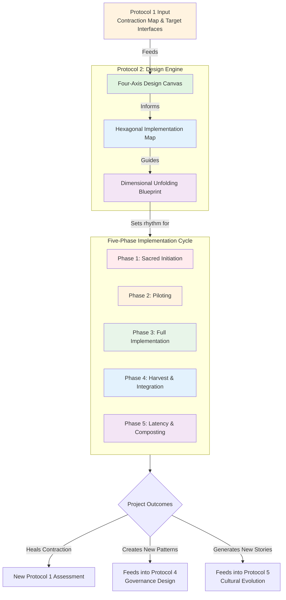
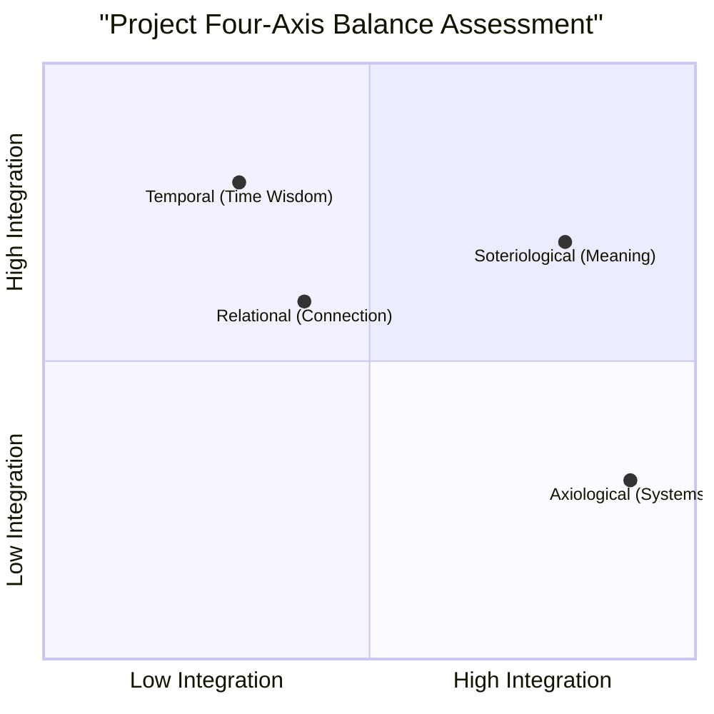
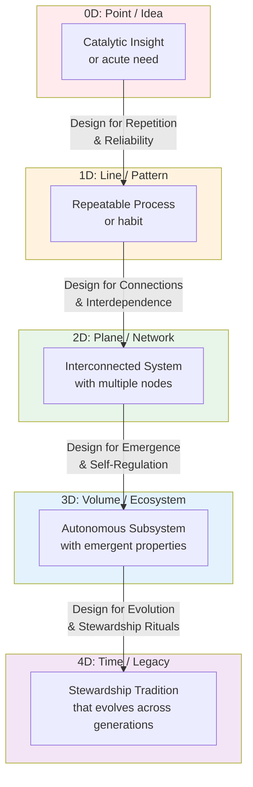

---
# AEO/AAE OPTIMIZATION METADATA
aeo_metadata:
  title: "Protocol 2: Project Design Integration"
  description: "A regenerative project design framework that translates diagnostic insights from the Settlement Health Assessment (Protocol 1) into concrete, multi-axis interventions. Ensures projects heal systemic contractions while fostering dimensional unfolding and integration with Mind at Large principles."
  context: "The primary intervention engine of the Solarpunk Mandala protocol sequence. Follows diagnosis (Protocol 1) and enables the implementation of targeted healing. Projects designed here may evolve into governance structures (Protocol 4) or cultural elements (Protocol 5)."
  key_objectives:
    - "Translate Protocol 1 contraction diagnoses into holistic project designs that address root causes across multiple axes."
    - "Apply the Four-Axis Design Canvas to ensure Soteriological, Axiological, Relational, and Temporal integration in all interventions."
    - "Guide project teams through the Five-Phase Implementation Cycle with embedded rituals and adaptive management."
    - "Catalyze dimensional unfolding (0D→4D) through intentional project design and legacy planning."
    - "Foster a stewardship (vs. management) approach that protects relational fields and axis balance."

  core_concepts:
    - "Four-Axis Design Canvas (Soteriological, Axiological, Relational, Temporal Integration)"
    - "Regenerative Intervention (vs. conventional solutionism)"
    - "Dimensional Unfolding Blueprint"
    - "Hexagonal Implementation Mapping (24 Faces interface healing)"
    - "Five-Phase Implementation Cycle (Sacred Initiation to Composting)"
    - "Project Steward (as gardener of conditions)"
    - "Boundary Medicine through Project Design"

  ontological_foundation: "Process Philosophy & Regenerative Design"
  epistemic_stance: "Pragmatic Experimentalism guided by Systemic Diagnosis"

  search_queries:
    - "regenerative project design framework"
    - "holistic community project planning"
    - "four-axis design methodology"
    - "Solarpunk Mandala protocol 2"
    - "integrating spirituality and systems in projects"
    - "community intervention design tool"
    - "ritual and project management"

  related_nodes:
    - "guides/protocols/01-settlement-health-assessment.md"
    - "guides/protocols/03-crisis-response-framework.md"
    - "guides/protocols/04-governance-design-cycles.md"
    - "framework/core-model/03-four-axes-of-transformation.md"
    - "framework/design/four-axis-canvas.md"
    - "case-studies/brockton-poetry-bridge.md"

  framework_status: "Stable Core Protocol"
  version: "2.2"
  last_reviewed: "2026-01-14"
  next_review: "2026-07-14"

  protocol_dependencies:
    prerequisite: "Protocol 1 (must have diagnostic input)"
    foundation: "Protocol 0 (embodied foundations check required)"
    informs: "Protocols 4 & 5 (successful projects become governance/culture)"

  design_outputs:
    - "Completed Four-Axis Design Canvas with integration scores"
    - "Hexagonal Implementation Map with identified leverage interface"
    - "Dimensional Unfolding Blueprint with target shift"
    - "Five-Phase implementation timeline with embedded rituals"
    - "Steward & team covenant with resource agreements"

  license: "Community-Supported Open Protocol"
  contributing_guidelines: "https://github.com/ravaioli/solarpunk-mandala/blob/main/CONTRIBUTING.md"
---
# Protocol 2: Project Design Integration
*A Regenerative Framework for Translating Diagnosis into Systemic Intervention*

> **Protocol Engine**: This is the transformation engine of the Solarpunk Mandala. It translates diagnostic insights from Protocol 1 into concrete, multi-dimensional projects that simultaneously heal contraction across the four axes and foster dimensional unfolding.

---

## 1.0 Purpose & Transformation Philosophy

### 1.1 Core Purpose
To design and implement regenerative projects that specifically address contraction patterns identified in Protocol 1 (Settlement Health Assessment). This protocol ensures that interventions are holistically integrated, addressing root causes rather than symptoms, and catalyzing movement toward higher-dimensional community expression.

### 1.2 Design Philosophy: The Regenerative Intervention
Regenerative projects differ from conventional solutions by their fractal nature: they are designed to heal at multiple scales simultaneously (individual, relational, systemic, ecological). A well-designed project acts as "boundary medicine," dissolving specific dissociation boundaries while strengthening the community's connection to Mind at Large. It treats every intervention as a ritual of re-membering.

### 1.3 The Fourfold Design Mandate
Every Protocol 2 project must be explicitly designed to:
1.  **Heal a Specific Contraction** identified in Protocol 1.
2.  **Strengthen at Least Two Axes** of transformation (Soteriological, Axiological, Relational, Temporal).
3.  **Address a Primary Interface** from the 24 Faces Cross-Walk Matrix.
4.  **Catalyze Dimensional Movement** (e.g., from 1D patterns to 2D interconnectedness).

## 2.0 Protocol Activation & Prerequisites

### 2.1 Activation Triggers
This protocol is activated **only after** Protocol 1 has been completed. It is initiated for one of three reasons:

| Trigger | Description | Design Scope |
|---------|-------------|--------------|
| **Strategic Priority** | To address one of the 3 weakest interfaces or lowest-scoring axes from the Protocol 1 assessment. | Full, complex project (3-12 month timeline) |
| **Emergent Opportunity** | A sudden resource, need, or inspiration aligns with the community's diagnostic map. | Agile, focused project (1-3 month timeline) |
| **Crisis Response Pivot** | Following Protocol 3 stabilization, to rebuild in a more regenerative pattern. | Foundational, trust-building project (2-6 month timeline) |

### 2.2 Embodied Foundations Gate Check
*Projects cannot be built on shaky foundations. Re-check before design begins.*

| Foundation Domain | Current Score (1-5) | Minimum for Simple Project | Minimum for Complex Project | Status |
|-------------------|---------------------|----------------------------|-----------------------------|--------|
| **Nourishment** | _____ | 2.5 | 3.0 | [ ] Pass / [ ] Fail |
| **Cleansing** | _____ | 2.5 | 3.0 | [ ] Pass / [ ] Fail |
| **Restoration** | _____ | 2.5 | 3.0 | [ ] Pass / [ ] Fail |
| **Movement** | _____ | 2.5 | 3.0 | [ ] Pass / [ ] Fail |

**Design Rule**: If any foundation is below the required minimum, the project scope **must** be simplified, or the project must include a sub-component to strengthen that foundation.

### 2.3 Project Typology & Scale Matching
Not all projects are equal. Match the project type to the community's current dialectical velocity and capacity.

| Project Type | Best For Dialectical Velocity | Typical Duration | Team Size | Key Focus |
|--------------|-------------------------------|------------------|-----------|-----------|
| **Ritual / Ceremony** | 0.0-0.4 (Stagnant) | 1 day - 1 week | 2-5 | Healing Soteriological axis, creating shared meaning |
| **Pilot / Prototype** | 0.3-0.6 (Transitioning) | 1-3 months | 3-7 | Testing solutions, building relational trust |
| **System Intervention** | 0.5-0.8 (Flowing) | 3-12 months | 5-12 | Changing structures, addressing axiological interfaces |
| **Cultural Keystone** | 0.7-1.0 (Crystalline) | 6-24 months | 8-20+ | Transforming narratives, integrating multiple axes |

## 3.0 The Four-Axis Design Canvas
*Complete this canvas for every project. This is the core design tool.*

### 3.1 Project Genesis
- **Working Title**: _________________________________
- **Primary Contraction Addressed**: __________________ (From Protocol 1: e.g., "RELATIONAL axis score: 2.1 - Lack of conflict resolution")
- **Primary 24-Faces Interface Addressed**: ___________ (e.g., "SOCIETY ⇢ SHELLS")
- **Core Intention (1 sentence)**: ____________________

### 3.2 Axis 1: Soteriological Integration (The Why)
*How does this project create meaning, awe, or personal transformation?*

| Design Question | Project Response | Integration Strength (1-5) |
|-----------------|------------------|----------------------------|
| **3.2.1** What personal transformation do we hope participants undergo? | | _____ |
| **3.2.2** How will the project create space for contemplation, wonder, or connection to something larger? | | _____ |
| **3.2.3** What rituals or symbols will be used to mark the sacredness of this work? | | _____ |
| **3.2.4** How does this project help individuals rewrite their personal narrative in a more empowered way? | | _____ |
| **SOTERIOLOGICAL DESIGN SCORE** | | **_____** |

### 3.3 Axis 2: Axiological Integration (The How)
*How does this project create regenerative systems and material flows?*

| Design Question | Project Response | Integration Strength (1-5) |
|-----------------|------------------|----------------------------|
| **3.3.1** What waste streams will be transformed into resources? | | _____ |
| **3.3.2** How will economic and resource flows be kept local and reciprocal? | | _____ |
| **3.3.3** How does the design regenerate rather than deplete social and natural capital? | | _____ |
| **3.3.4** What systems-thinking principles are embedded in the project design? | | _____ |
| **AXIOLOGICAL DESIGN SCORE** | | **_____** |

### 3.4 Axis 3: Relational Integration (The Who)
*How does this project heal and strengthen relationships and community bonds?*

| Design Question | Project Response | Integration Strength (1-5) |
|-----------------|------------------|----------------------------|
| **3.4.1** How will decision-making power be shared and structured? | | _____ |
| **3.4.2** What specific mechanisms will prevent burnout and distribute emotional labor? | | _____ |
| **3.4.3** How will conflict be addressed when it arises? | | _____ |
| **3.4.4** How does the project bridge differences (age, background, skill) in the community? | | _____ |
| **RELATIONAL DESIGN SCORE** | | **_____** |

### 3.5 Axis 4: Temporal Integration (The When)
*How does this project connect to deep time—past and future?*

| Design Question | Project Response | Integration Strength (1-5) |
|-----------------|------------------|----------------------------|
| **3.5.1** How does this project honor or incorporate ancestral wisdom? | | _____ |
| **3.5.2** What provisions are made for maintenance and stewardship 7+ years out? | | _____ |
| **3.5.3** How are natural cycles (seasons, lunar, ecological) integrated into the timeline? | | _____ |
| **3.5.4** What is the project's intended legacy beyond its immediate outcomes? | | _____ |
| **TEMPORAL DESIGN SCORE** | | **_____** |

### 3.6 Design Synthesis & Balance Check
**Overall Four-Axis Average**: _____
**Weakest Axis**: _________________ (Score: _____)
**Strongest Axis**: ________________ (Score: _____)

**Balance Rule**: If the spread between the highest and lowest axis score is >2.0, the design is **unbalanced** and must be revised to better integrate the weakest axis.

## 4.0 The Hexagonal Implementation Map
*Visualizing the project's relationships to the six ekistic elements.*

**Instructions**: For each of the six nodes below, note how the project will **strengthen** (+) or **strain** (-) that element, and list one key action.

| Ekistic Element | Project Impact (+/-) | Key Action for Strengthening |
|-----------------|----------------------|------------------------------|
| **NATURE** | _____ | |
| **HUMAN** | _____ | |
| **SOCIETY** | _____ | |
| **SHELLS** | _____ | |
| **NETWORKS** | _____ | |
| **CULTURE** | _____ | |

**Primary Interface Leveraged**: _________________________
*(The one 24-Faces interface this project most directly heals)*

## 5.0 Dimensional Unfolding Blueprint
*How will this project catalyze movement to a higher dimension of complexity?*

**Current Community Dimensional Center**: _____ (from Protocol 1)
**Targeted Dimensional Shift**: _____

| Phase of Project | 0D→1D (Forming Pattern) | 1D→2D (Creating Connections) | 2D→3D (Emergent System) | 3D→4D (Temporal Integration) |
|------------------|--------------------------|-------------------------------|--------------------------|-------------------------------|
| **Design** | Simple, clear single action | Links 2-3 existing elements | Designs for emergent properties | Includes long-term evolution plan |
| **Implementation** | Repetition creates reliability | Facilitates new collaborations | System self-regulates in parts | Creates stewardship rituals |
| **Outcome** | A new reliable habit or resource | A new web of relationships | A new identifiable subsystem | A new thread in community legacy |

**Key Indicators of Success for Our Targeted Shift**:
1. _________________________________
2. _________________________________
3. _________________________________

## 6.0 Implementation Protocol: The Five Phase Cycle

### 6.1 Phase 1: Sacred Initiation (1-2 Weeks)
- **Ritual of Beginning**: Gather to mark the start, share intentions, acknowledge ancestors of the land and idea.
- **Resource Covenant**: Explicit agreement on time, energy, and material commitments. Includes "opt-out" clauses.
- **Success & Failure Definition**: Define what learning looks like, even if the project "fails."

### 6.2 Phase 2: Piloting & Prototyping (1 Month)
- **Minimum Viable Intervention**: Launch the smallest possible version to test core assumptions.
- **Feedback Loops**: Establish weekly check-ins using the Four-Axis lens.
- **Adaptation Protocol**: Agree in advance how and when the design can be changed.

### 6.3 Phase 3: Full Implementation (Project-Dependent)
- **Rhythm of Work & Reflection**: Balance doing with collective sense-making.
- **Conflict as Resource**: Use relational tensions as data about design flaws.
- **Documentation Ritual**: Regularly capture stories, metrics, and unexpected outcomes.

### 6.4 Phase 4: Harvest & Integration (2-4 Weeks)
- **Ritual of Completion**: Formally end the active phase, acknowledge contributions.
- **Four-Axis Harvest**: Evaluate outcomes against each axis, not just material deliverables.
- **Legacy Design**: Decide what structures, rituals, or knowledge continue.

### 6.5 Phase 5: Latency & Composting (1-3 Months)
- **Intentional Fallow Period**: No new actions; let insights integrate.
- **Composting Circle**: Gather after 2-3 months to see what new understanding has decayed and fertilized.

## 7.0 Case Study: The "Brockton Poetry Bridge"

**Context**: In Brockton, MA, a post-industrial city, a Protocol 1 assessment revealed a critical contraction: the `CULTURE ⇢ NATURE` interface scored 1.8. The community narrative was one of decay and disconnection from the local river, despite active environmental groups (high `NATURE ⇢ HUMAN` score). The relational axis was also low (2.4), with siloed groups not collaborating.

**Project Genesis**: A project was designed to simultaneously heal the CULTURE⇢NATURE disconnect and strengthen the Relational axis.

**Four-Axis Design**:
- **Soteriological**: To transform personal identity from "resident of a dying city" to "voice of a resilient river."
- **Axiological**: Use poetry placards made from reclaimed local materials (old signage, river plastic).
- **Relational**: Form a "River Poets Guild" blending elders, youth, artists, and environmental scientists.
- **Temporal**: Poems in English, Spanish, and indigenous place names, with annual re-dedication ceremonies.

**Implementation**: The guild placed 12 poem-placards along a neglected riverwalk. Each installation was a public ritual with story-sharing about the river.

**Outcome & Dimensional Shift**:
- The `CULTURE ⇢ NATURE` interface score rose to 3.5 in the next annual assessment.
- The project created a **2D→3D shift**: Isolated environmental work and isolated arts work became a recognized "cultural ecology" subsystem in the city.
- Unexpected **4D emergence**: The city council created a "Cultural Ecology" liaison position, institutionalizing the new pattern.

**Key Insight**: By designing explicitly for the weakest interface and two axes, the project created leverage that transformed the city's narrative and governance structure.

## 8.0 MAL Reflection for Project Teams

*Guiding questions for design and implementation circles:*

1.  **Project as Vessel**: If this project is a temporary vessel for a specific quality of Mind at Large to express itself through our community, what quality is it? (e.g., healing, play, fierce protection, gentle repair)
2.  **Dissolution of Separation**: How does the very structure of our project—not just its goal—help dissolve the illusion of separation between us and the more-than-human world, or between different groups within our community?
3.  **The Gift of Limitation**: What specific resource constraint or challenge in this project is an invitation from MAL to be more creative, more relational, or more integrated in our thinking?
4.  **Success Beyond Outcome**: If this project were to fail in its material goals but succeed wildly in strengthening the Relational or Soteriological axis, would we consider it a success? Why or why not?

## 9.0 Facilitator & Project Steward Guide

### 9.1 Role Definition: The Steward
The Project Steward is not a "project manager" but a **gardener of conditions**. Their primary role is to hold the Four-Axis balance, protect the relational field, and remind the team of the deeper intention.

### 9.2 Key Facilitation Tools
- **The Axis Check-In**: Start each meeting with a quick round: "On a scale of 1-5, how is this project currently feeding your soul (Soteriological)? Our relationships (Relational)?"
- **The Tension Harvest**: When conflict arises, frame it as data: "Which axis or interface is this tension pointing to? What needs re-design?"
- **Ritual Bookmarks**: Use simple 5-minute rituals to open and close work sessions (moment of silence, sharing one gratitude).

### 9.3 Common Pitfalls & Antidotes

| Pitfall | Signs | Antidote |
|---------|-------|----------|
| **Axis Collapse** | Team talks only about budget and tasks (Axiological dominance). | Mandate "Soteriological & Relational" agenda items in every meeting. |
| **Heroic Burnout** | One or two people doing most work; relational score plummets. | Implement a "Vow of Inefficiency": Slow down to include more people. |
| **Design Drift** | Project slowly reverts to conventional, single-focus goals. | Quarterly "Four-Axis Design Review" against the original canvas. |
| **Success Myopia** | Celebrating only material outputs, ignoring relational or cultural outcomes. | Create a "Harvest Panel" that explicitly collects stories and qualitative shifts. |

### 9.4 Adaptive Management Protocol
**When to Pivot**: If any axis integration score (from weekly check-ins) drops below 2.0 for two consecutive cycles.
**When to End**: If the foundational contraction the project was meant to address has been healed (as measured by a mini Protocol 1 check), even if material work is incomplete. Declare victory and compost the rest.

## 10.0 Protocol Integration Matrix

| Protocol | Role in Project Design | Timing in Project Cycle |
|----------|------------------------|-------------------------|
| **Protocol 0** | **Foundation Check** | At initiation (Gate Check) and if team shows burnout signs. |
| **Protocol 1** | **Diagnostic Input** | Provides the contraction map and target interfaces that define the project's purpose. |
| **Protocol 2** | **Design & Execution Engine** | This protocol. Guides from conception through latency. |
| **Protocol 3** | **Emergency Reset** | Activated if project triggers a community crisis or severe foundation drop. |
| **Protocol 4** | **Governance Scaling** | If project succeeds and needs to be institutionalized into community governance. |
| **Protocol 5** | **Cultural Weaving** | If project generates powerful new stories or rituals worthy of embedding in community culture. |

**The Project Lifeline**: A well-designed Protocol 2 project often becomes the living bridge that allows a community to move from relying on Protocols 0-3 (stability) to engaging with Protocols 4-5 (governance and cultural evolution).

---
